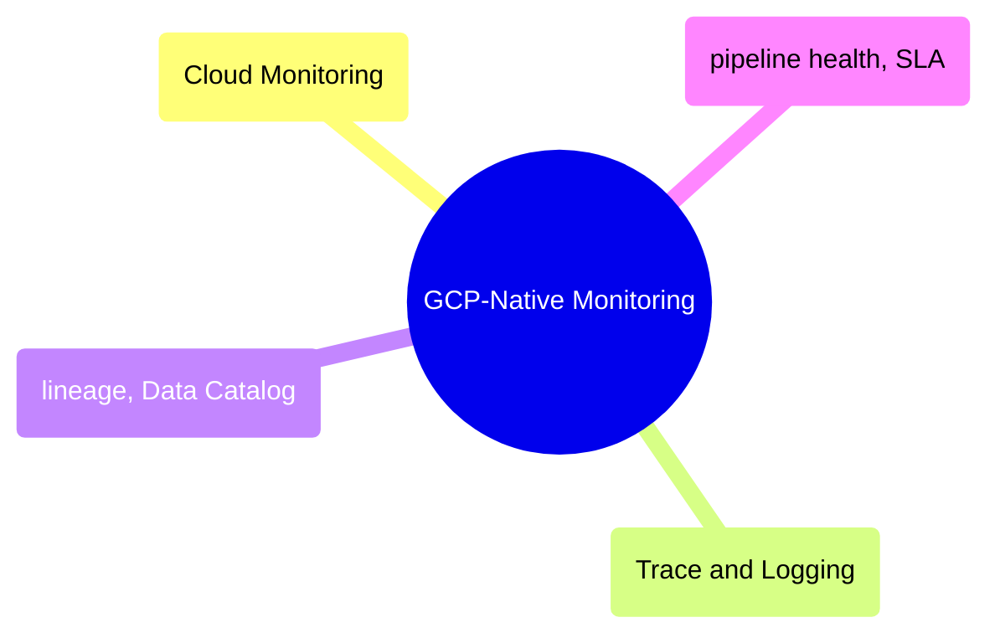

# GCP-Native Monitoring

Google Cloud's built-in observability stack — Cloud Monitoring, Cloud Trace, Cloud Logging, Data Catalog, Dataplex, and pipeline health/SLA patterns.

> [!abstract]- [[01-gcp-cloud-monitoring-deep-dive]]

> [!abstract]- [[02-gcp-cloud-trace-and-logging]]

> [!abstract]- [[04-gcp-data-lineage-and-catalog]]

> [!abstract]- [[03-gcp-pipeline-health-and-sla]]
