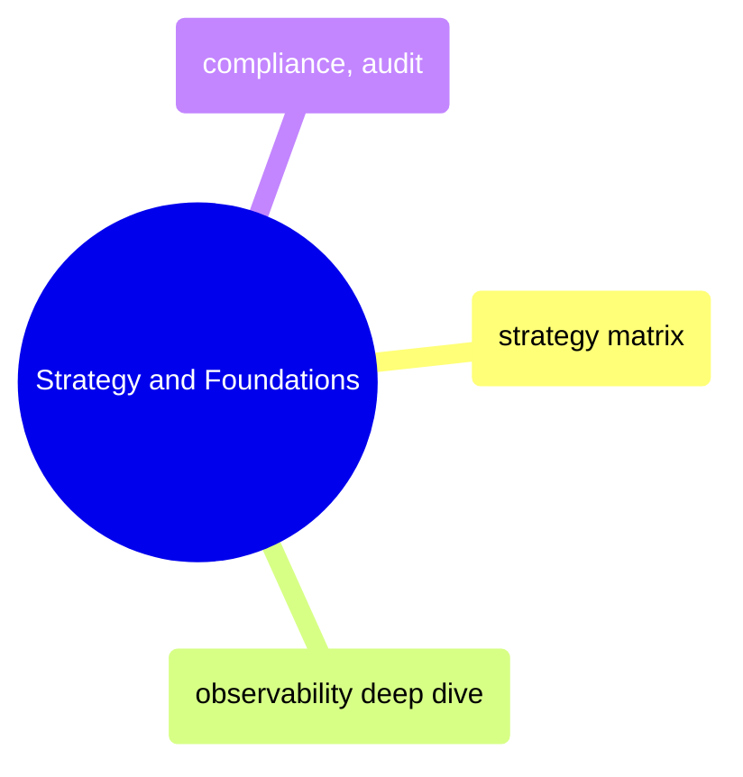

# Strategy and Foundations

Observability philosophy, monitoring matrices, alert severity frameworks, and compliance requirements that guide all instrumentation decisions.

> [!abstract]- [[01-observability-strategy-matrix]]

> [!abstract]- [[01-observability-deep-dive]]

> [!abstract]- [[02-compliance-and-auditability]]
