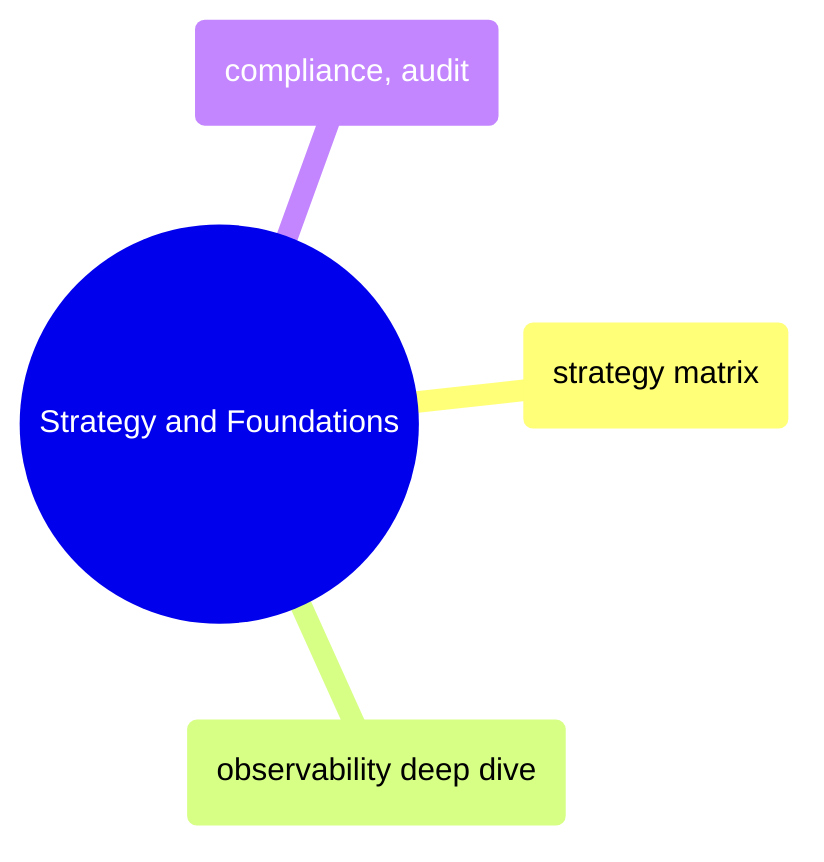

# Strategy and Foundations

Observability philosophy, monitoring matrices, alert severity frameworks, and compliance requirements that guide all instrumentation decisions.

> [!abstract]- [[01-observability-strategy-matrix]]
>
> - [[observability-strategy-matrix#The Three Pillars Applied to Data Pipelines|Three pillars applied to data pipelines]]
> - [[observability-strategy-matrix#Master Monitoring Matrix — Per Component|Master monitoring matrix]]
> - [[observability-strategy-matrix#Alert Severity Framework|Alert severity framework]]
> - [[observability-strategy-matrix#Dashboard Strategy|Dashboard strategy]]
> - [[observability-strategy-matrix#Datadog vs GCP-Native — When to Use Which|Datadog vs GCP-Native decision guide]]
> - [[observability-strategy-matrix#Anti-Patterns|Anti-patterns]]

> [!abstract]- [[01-observability-deep-dive]]
>
> - [[observability-deep-dive#The Three Pillars (Metrics, Logs, Traces) Applied to Data Pipelines|Three pillars for data pipelines]]
> - [[observability-deep-dive#DataDog for Data Pipeline Observability|Datadog for pipeline observability]]
> - [[observability-deep-dive#Data Freshness Monitoring|Data freshness monitoring]]
> - [[observability-deep-dive#Data Lineage: Where Did This Number Come From?|Data lineage]]
> - [[observability-deep-dive#Building a Data Quality Framework|Data quality framework]]
> - [[observability-deep-dive#Data Profiling and Drift Detection: Shift-Left Quality|Profiling and drift detection]]

> [!abstract]- [[02-compliance-and-auditability]]
>
> - [[compliance-and-auditability#End-to-End Data Lineage|End-to-end data lineage]]
> - [[compliance-and-auditability#Corporate Action Processing|Corporate action processing]]
> - [[compliance-and-auditability#EU BMR Compliance|EU BMR compliance]]
> - [[compliance-and-auditability#Restatement Procedures|Restatement procedures]]
> - [[compliance-and-auditability#Datadog Integration for Compliance Monitoring|Datadog compliance monitoring]]
