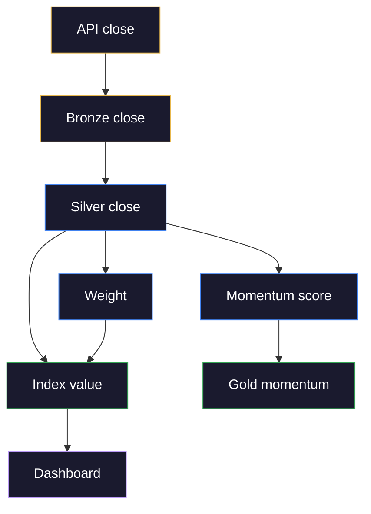
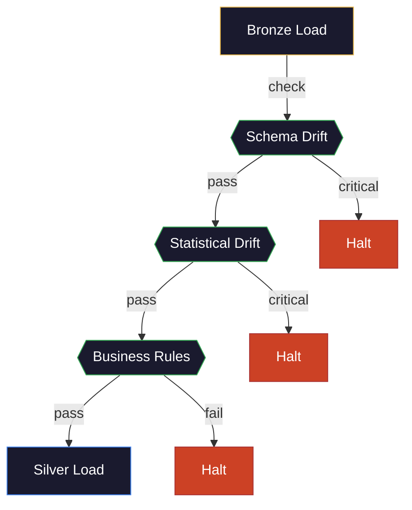

# Observability Deep Dive: DataDog, Lineage, and Data Cataloging

Observability in data engineering is not just "monitoring with a fancier name." Monitoring tells you *that* something broke. Observability tells you *why* it broke, *what data* was affected, and *who* needs to be notified. For a financial index provider where incorrect data has regulatory and financial consequences, observability is a fiduciary obligation. This aligns with the broader [DataOps philosophy](https://alp78.github.io/elysium/15-DataOps/dataops-principles-and-practices), which treats observability as a foundational pillar alongside testing, CI/CD, and automation.

> [!warning] Financial Data Stakes
> In financial indexing, a monitoring gap is not just an operational inconvenience — it can result in incorrect index values published to the market, incorrect ETF NAVs, failed rebalancing trades, and regulatory scrutiny. Observability at this level is a compliance requirement, not an engineering nicety.

---

### The Three Pillars (Metrics, Logs, Traces) Applied to Data Pipelines

Every observability system is built on three complementary signal types. Each answers a different question about your pipeline's behavior, and no single pillar is sufficient on its own. Metrics tell you *something is wrong*, logs tell you *what happened*, and traces tell you *where the time went*.

| Pillar | Application Question | Data Engineering Example |
|---|---|---|
| **Metrics** | "How much?" | Pipeline duration, row counts, error rates, query latency, data freshness |
| **Logs** | "What happened?" | Transform errors, SQL statements, API response bodies, retry attempts |
| **Traces** | "Where did time go?" | End-to-end pipeline trace: ingestion → transform → load → validate → publish |

Most data teams have metrics and logs but lack traces. Without traces, debugging a slow pipeline means grepping through logs hoping to reconstruct the execution flow. With traces, you click on the slow pipeline run and see exactly which stage, which query, and which table was the bottleneck.

> [!tip] The Observability Maturity Ladder
> **Level 1 — Logs only:** you know something failed after reading log output manually. Most small teams are here.
> **Level 2 — Metrics + Logs:** you get alerted when a metric threshold is breached, then investigate in logs. Most mid-size teams are here.
> **Level 3 — Metrics + Logs + Traces:** you see the full execution path, identify the bottleneck stage, and drill into the specific query or API call. This is where financial data teams need to be.

> [!warning] Metrics Without Context Are Noise
> A metric that says "pipeline duration = 47 minutes" is useless without context. Is 47 minutes normal? Was it 12 minutes yesterday? Did it spike because of a slow upstream API or because the MERGE hit 10x more rows than usual? Always pair metrics with baselines and dimensional tags (stage name, index key, date) so alerts carry actionable context.

---

## DataDog for Data Pipeline Observability

DataDog is the observability platform used by financial data companies and index providers. For a senior data engineer, the key is not just *installing* DataDog but *instrumenting* pipelines to produce actionable signals. The [datadog-architecture-overview](https://alp78.github.io/elysium/13-Observability/Datadog/datadog-architecture-overview) covers the practical agent setup and infrastructure topology, while [cloud-logging](https://alp78.github.io/elysium/06-GCP/Logging/cloud-logging) provides the GCP-native logging complement for services like Cloud Run where the Datadog agent cannot run.

### Custom Metrics for Pipeline Health

#### Wrapping pipeline stages with DataDog metrics — statsd gauge/histogram/increment

```python
from datadog import statsd
import time

def run_pipeline_stage(stage_name: str, func, *args, **kwargs):
    """Wrap any pipeline stage with DataDog metrics."""
    start = time.monotonic()
    try:
        result = func(*args, **kwargs)
        statsd.increment(f'pipeline.stage.success', tags=[f'stage:{stage_name}'])
        return result
    except Exception as e:
        statsd.increment(f'pipeline.stage.failure', tags=[f'stage:{stage_name}', f'error:{type(e).__name__}'])
        raise
    finally:
        elapsed = time.monotonic() - start
        statsd.histogram(f'pipeline.stage.duration_seconds', elapsed, tags=[f'stage:{stage_name}'])

# Usage in your pipeline:
run_pipeline_stage('ingest_ohlcv', load_ohlcv_from_yahoo, index_key='market_index')
run_pipeline_stage('transform_signals', compute_momentum_scores, date='2026-03-10')
run_pipeline_stage('load_gold', upsert_gold_scores, index_key='market_index')
```

### SQL Server Integration Metrics

#### SQL Server metrics to monitor in DataDog

| Metric | Alert Threshold | Why It Matters |
|---|---|---|
| `sqlserver.buffer.page_life_expectancy` | < 300 seconds | Buffer pool under memory pressure — pages being evicted too fast |
| `sqlserver.stats.lock_waits` | > 100/sec sustained | Lock contention — queries blocking each other |
| `sqlserver.performance.deadlocks` | > 0 | Deadlocks kill transactions — pipeline reliability at risk |
| `sqlserver.database.log_flush_wait_time` | > 10ms average | Transaction log I/O bottleneck — slow commits |
| `sqlserver.queries.plan_cache_hit_ratio` | < 90% | Query plans not being reused — plan cache pollution |
| Custom: `pipeline.data_freshness_seconds` | > SLA window | Data not arriving on time — downstream consumers see stale data |

### DataDog APM Traces for Airflow DAGs

#### APM tracing with `ddtrace` — instrument any pipeline function

```python
from ddtrace import tracer

@tracer.wrap(service="data-pipeline-pipeline", resource="daily_ohlcv_load")
def load_daily_ohlcv(index_key: str, target_date: str):
    """Load OHLCV data — automatically traced by DataDog APM."""
    span = tracer.current_span()
    span.set_tag("index_key", index_key)
    span.set_tag("target_date", target_date)

    df = fetch_from_yahoo(index_key, target_date)
    span.set_tag("row_count", len(df))

    rows_loaded = upsert_to_silver(df)
    span.set_tag("rows_loaded", rows_loaded)

    # DataDog now shows: this function took 4.2s, loaded 50 rows,
    # and the SQL MERGE inside upsert_to_silver took 1.8s of that
```

### DataDog Monitor Definitions (as Code)

#### DataDog monitors defined as YAML — deploy via Terraform or DataDog API

```yaml
# datadog-monitors.yaml — define as code, deploy via Terraform or DataDog API

# Monitor 1: Pipeline SLA breach
- name: "Pipeline SLA: Daily OHLCV load exceeded 30-minute window"
  type: metric alert
  query: "max(last_5m):max:pipeline.stage.duration_seconds{stage:daily_full_pipeline} > 1800"
  message: |
    Pipeline took more than 30 minutes.
    Last duration: {{value}} seconds.
    @slack-data-engineering @pagerduty-data-oncall
  thresholds:
    critical: 1800
    warning: 1200

# Monitor 2: Data freshness
- name: "Data Freshness: Gold layer stale for Euro market index"
  type: metric alert
  query: "max(last_15m):max:pipeline.data_freshness_seconds{index:market_index} > 3600"
  message: |
    Gold layer data for Euro market index is more than 1 hour old.
    Possible causes: pipeline failure, upstream data delay, or database connectivity.
    @slack-data-engineering

# Monitor 3: Deadlock detection
- name: "SQL Server: Deadlock Detected"
  type: event alert
  query: "events('sqlserver.deadlock').rollup('count').by('host').last('5m') > 0"
  message: |
    Deadlock detected on {{host.name}}.
    Check the deadlock graph in SQL Server error log.
    @slack-data-engineering @pagerduty-data-oncall
```

---

## Data Freshness Monitoring

Data freshness is the single most important metric for a data pipeline. It answers: "how old is the data that consumers are seeing right now?" Freshness is measured as the elapsed time between the most recent data point in a table and the current wall-clock time. A gold layer table with `max(trade_date) = 2026-03-09` queried at 10:00 AM on March 10 has a freshness of ~18 hours — which may or may not be acceptable depending on the SLA.

> [!info] Freshness vs Latency vs Timeliness
> These three terms are related but distinct:
> - **Freshness** — how old is the most recent data in the table right now? (consumer perspective)
> - **Latency** — how long does data take to travel from source to destination? (pipeline perspective)
> - **Timeliness** — did the data arrive before the SLA deadline? (business perspective)
>
> A pipeline with 5-minute latency that runs at 11 PM produces fresh data by midnight. The same pipeline running at 6 AM produces stale data for any consumer with a pre-market SLA. Freshness depends on *when* the pipeline runs, not just *how fast* it runs.

> [!danger] Stale Data in Financial Indexing
> A stale gold layer in a financial index pipeline means the published index value is based on yesterday's prices. If an ETF tracking the index rebalances based on stale weights, trades execute at incorrect allocations. The correction cost scales with AUM — a 0.1% allocation error on a $1B ETF is $1M of tracking error. Freshness monitoring with automatic halt-before-publish is not optional.

### SQL Implementation: Freshness Tracking Table

#### Create a freshness tracking table with a computed freshness column

```sql
-- Create a freshness tracking table
CREATE TABLE pipeline.data_freshness (
    table_name      NVARCHAR(200) NOT NULL,
    index_key       NVARCHAR(50),
    last_updated    DATETIME2 NOT NULL,
    row_count       INT NOT NULL,
    max_trade_date  DATE,
    checked_at      DATETIME2 NOT NULL DEFAULT SYSUTCDATETIME(),
    freshness_sec   AS DATEDIFF(SECOND, last_updated, SYSUTCDATETIME())
);

-- Populate after every pipeline run
INSERT INTO pipeline.data_freshness (table_name, index_key, last_updated, row_count, max_trade_date)
SELECT
    'gold.index_performance',
    index_key,
    MAX(updated_at),
    COUNT(*),
    MAX(trade_date)
FROM gold.index_performance
GROUP BY index_key;
```

#### Push freshness to DataDog as a gauge metric

```python
# Push freshness to DataDog as a gauge metric
from datadog import statsd
import pyodbc

def report_freshness(conn: pyodbc.Connection):
    cursor = conn.execute("""
        SELECT table_name, index_key, freshness_sec
        FROM pipeline.data_freshness
        WHERE checked_at > DATEADD(HOUR, -1, SYSUTCDATETIME())
    """)
    for row in cursor:
        statsd.gauge('pipeline.data_freshness_seconds', row.freshness_sec,
                     tags=[f'table:{row.table_name}', f'index:{row.index_key}'])
```

---

## Data Lineage: Where Did This Number Come From?

Data lineage is the complete record of how a data point was produced — every source it originated from, every transformation applied, every intermediate table it passed through, and every consumer that reads it. Lineage operates at two granularity levels: **table-level** (which tables feed which tables) and **column-level** (which specific columns participate in which calculations).

For a regulated financial index, an auditor may ask: "Show me exactly how the EURO market index closing value on March 9, 2026 was calculated — every input, every transformation, every intermediate value."

> [!info] Forward Lineage vs Backward Lineage
> - **Backward lineage** (provenance): "Where did this gold table value come from?" — traces upstream to source. Used for root cause analysis when a value looks wrong.
> - **Forward lineage** (impact analysis): "If I change this bronze table schema, what breaks downstream?" — traces downstream to consumers. Used before schema changes, migrations, or decommissioning tables.
>
> Both directions are essential. Backward lineage debugs incidents; forward lineage prevents them.

> [!warning] Lineage Gaps Are Invisible Until an Audit
> If your lineage graph has gaps (stages not logged), you won't notice until someone asks "how was this number calculated?" and you can't answer. The most common gap: Python scripts that load data outside of dbt — these don't appear in the dbt lineage graph unless you manually log them.

### Column-Level Lineage for an Index Calculation



> [!abstract] Column lineage — close price through the medallion layers
> - **API → Bronze** — raw `close_price` loaded via truncate-reload
> - **Bronze → Silver** — cleaned, validated, SCD2 applied
> - **Silver → Gold** — three derivations:
>   - `momentum_score` (30-day return z-score) → `gold.momentum_z`
>   - `weight` (market cap weighted)
>   - `index_value` = SUM(close × shares × free_float × cap_factor) / divisor
> - **Gold → Dashboard** — Blazor Server reads from gold layer

> [!info] Lineage and dbt
> [dbt](https://alp78.github.io/elysium/14-Data-Architecture/Pipeline-Patterns/dbt-transformation-layer) automatically generates column-level lineage as part of `dbt docs generate`. For tables outside dbt (bronze loads, custom scripts), you must manually log lineage to a metadata table as shown below.

### Implementing Lineage with Metadata Tables

#### Lineage metadata table — track every transformation

```sql
CREATE TABLE pipeline.lineage (
    lineage_id      INT IDENTITY PRIMARY KEY,
    run_id          UNIQUEIDENTIFIER NOT NULL,
    source_table    NVARCHAR(200) NOT NULL,
    target_table    NVARCHAR(200) NOT NULL,
    transform_type  NVARCHAR(50) NOT NULL,  -- MERGE, INSERT, TRUNCATE_RELOAD, AGGREGATE
    source_rows     INT,
    target_rows     INT,
    sql_hash        CHAR(64),               -- hash of the SQL statement used
    executed_at     DATETIME2 NOT NULL DEFAULT SYSUTCDATETIME(),
    executed_by     NVARCHAR(100) NOT NULL   -- pipeline name or user
);

-- Log lineage after every pipeline stage
INSERT INTO pipeline.lineage (run_id, source_table, target_table, transform_type, source_rows, target_rows, sql_hash, executed_by)
VALUES (@run_id, 'bronze.yahoo_ohlcv', 'silver.daily_ohlcv', 'MERGE', @source_count, @target_count, @sql_hash, 'pipeline_daily_dag');
```

---

## Data Cataloging and Entitlement

A data catalog is the searchable inventory of all datasets, tables, columns, and their metadata. It answers the question every new team member asks: "What data do we have, where is it, what does it mean, and who owns it?" Without a catalog, tribal knowledge is the only documentation — and tribal knowledge leaves when people do.

Data entitlement is the access control layer on top of the catalog: who can see which datasets, at what granularity, and under what conditions. Financial index platforms explicitly require experience with "data cataloging and data entitlement capabilities."

> [!info] Catalog vs Documentation vs Lineage
> These three overlap but serve different purposes:
> - **Catalog** — searchable inventory of *what exists* (tables, schemas, owners, tags)
> - **Documentation** — prose explaining *how to use it* (business context, caveats, examples)
> - **Lineage** — graph showing *where it came from* (upstream sources, transformations)
>
> A mature data platform has all three. dbt generates documentation and lineage automatically; the catalog must be maintained separately (or via a tool like DataHub/OpenMetadata that ingests dbt artifacts).

### What a Data Catalog Must Contain

| Metadata | Example |
|---|---|
| **Technical metadata** | Table name, column names, data types, row counts, storage size |
| **Business metadata** | Description ("Daily closing prices for index constituents"), owner, domain |
| **Quality metadata** | Last validation date, NULL rates, freshness SLA |
| **Lineage metadata** | Upstream sources, downstream consumers, transforms applied |
| **Entitlement metadata** | Who can read this table? Who can write? Classification (internal/restricted/public) |

### Data Entitlement (Access Control for Financial Data)

Data entitlement goes beyond standard RBAC. In index providers, access control is driven by regulatory requirements, client contracts, and market data licenses — not just organizational hierarchy. Not all data is available to all teams. Client data is segregated, pre-announcement reconstitution data is restricted, and market data licensing limits redistribution.

> [!danger] Pre-Announcement Data Leakage
> Index reconstitution decisions (which stocks enter/exit the index) are market-moving information. If a data engineer with gold-layer access queries `reconstitution_candidates` before the official announcement date, that constitutes potential insider trading exposure — even if the query was for debugging. Entitlement rules must enforce time-based access: reconstitution tables are restricted until T+0 (announcement date).

> [!info] Entitlement Dimensions for Financial Data
> - **Role-based** — data_consumer vs data_engineer vs compliance_auditor
> - **Schema-based** — gold layer is read-only for consumers; bronze/silver require engineer role
> - **Time-based** — reconstitution data restricted until announcement date
> - **Client-based** — client A's custom index data invisible to client B's team
> - **License-based** — redistributing Bloomberg/Reuters raw data may violate vendor agreements

#### Role-based access control for index data schemas

```sql
-- Example: role-based access control for index data
CREATE ROLE data_consumer;      -- can read gold layer only
CREATE ROLE data_engineer;       -- can read/write bronze, silver, gold
CREATE ROLE index_analyst;       -- can read silver + gold, write gold.reconstitution_*
CREATE ROLE compliance_auditor;  -- can read everything including pipeline.lineage and audit logs

GRANT SELECT ON SCHEMA::gold TO data_consumer;
GRANT SELECT, INSERT, UPDATE, DELETE ON SCHEMA::bronze TO data_engineer;
GRANT SELECT, INSERT, UPDATE, DELETE ON SCHEMA::silver TO data_engineer;
GRANT SELECT, INSERT, UPDATE, DELETE ON SCHEMA::gold TO data_engineer;
GRANT SELECT ON SCHEMA::silver TO index_analyst;
GRANT SELECT ON SCHEMA::gold TO index_analyst;
GRANT SELECT, INSERT, UPDATE ON gold.reconstitution_candidates TO index_analyst;
GRANT SELECT ON SCHEMA::pipeline TO compliance_auditor;
GRANT SELECT ON SCHEMA::bronze TO compliance_auditor;
GRANT SELECT ON SCHEMA::silver TO compliance_auditor;
GRANT SELECT ON SCHEMA::gold TO compliance_auditor;
```

### Catalog Tools in the Ecosystem

| Tool | Type | Best For |
|---|---|---|
| **Google Data Catalog** | Managed (GCP) | BigQuery-native, auto-discovery of GCP assets |
| **OpenMetadata** | Open source | Self-hosted, broad connector ecosystem, lineage |
| **DataHub** (LinkedIn) | Open source | Large-scale, strong lineage, governance features |
| **Atlan** | SaaS | Modern UI, collaboration-focused, active metadata |
| **Unity Catalog** (Databricks) | Managed | Databricks/Spark-native, ABAC, Delta Lake integration |
| **Apache Atlas** | Open source | Hadoop ecosystem, type-based classification |

---

## Building a Data Quality Framework

Data quality is not a one-time check — it is a continuous system that validates data at every layer. A quality framework defines *what* to check (dimensions), *where* to check (which pipeline stage), *how* to check (SQL assertions, Python validators, dbt tests), and *what happens when checks fail* (halt, quarantine, alert, or log-and-continue).

> [!tip] Quality Gates vs Quality Checks
> A **quality check** validates data and reports pass/fail. A **quality gate** is a check that *blocks the pipeline* if it fails. Not every check should be a gate — blocking on a warning-level anomaly creates unnecessary pipeline failures. Reserve gates for critical dimensions (completeness, validity) and use non-blocking checks for informational dimensions (minor distribution shifts).

### The Data Quality Dimensions

The six dimensions below form the standard framework for data quality assessment. Each dimension answers a different question about the data, and each requires different validation techniques.

| Dimension | Question | Check |
|---|---|---|
| **Completeness** | Are all expected rows present? | Row count vs expected; NULL rate per column |
| **Accuracy** | Are values correct? | Cross-reference against Bloomberg/Reuters (tolerance check) |
| **Freshness** | Is data current? | Max timestamp vs SLA window |
| **Consistency** | Do related tables agree? | Sum of constituent weights = 100%; index value from components = published value |
| **Uniqueness** | Are there duplicates? | COUNT vs COUNT(DISTINCT key) |
| **Validity** | Are values in acceptable ranges? | Stock price > 0; weight between 0 and 1; date is a valid trading day |

> [!warning] The Hardest Dimension: Accuracy
> Completeness, uniqueness, and validity can be checked with SQL alone. Accuracy requires an *external reference* — you need a second source of truth to compare against. For financial data, this means cross-referencing your calculated index value against a published benchmark, or comparing your ingested prices against a second data vendor. Without a reference, you can only check that data *looks reasonable*, not that it's *correct*.

#### Automated data quality checks stored in pipeline.quality_checks

```sql
-- Automated data quality checks run after every pipeline load
-- Results stored in pipeline.quality_checks for monitoring

-- Check 1: Completeness — expect 50 rows per index
INSERT INTO pipeline.quality_checks (check_name, table_name, status, details)
SELECT
    'row_count_check',
    'gold.index_performance',
    CASE WHEN COUNT(*) = 50 THEN 'PASS' ELSE 'FAIL' END,
    CONCAT('Expected 50, got ', COUNT(*))
FROM gold.index_performance
WHERE index_key = 'market_index' AND trade_date = CAST(GETDATE() AS DATE);

-- Check 2: Validity — no negative prices
INSERT INTO pipeline.quality_checks (check_name, table_name, status, details)
SELECT
    'positive_prices',
    'silver.daily_ohlcv',
    CASE WHEN COUNT(*) = 0 THEN 'PASS' ELSE 'FAIL' END,
    CONCAT(COUNT(*), ' rows with negative prices')
FROM silver.daily_ohlcv
WHERE close_price < 0 AND trade_date = CAST(GETDATE() AS DATE);

-- Check 3: Consistency — weights sum to ~100%
INSERT INTO pipeline.quality_checks (check_name, table_name, status, details)
SELECT
    'weight_sum_check',
    'gold.constituent_weights',
    CASE WHEN ABS(SUM(weight_pct) - 100.0) < 0.1 THEN 'PASS' ELSE 'FAIL' END,
    CONCAT('Weight sum: ', FORMAT(SUM(weight_pct), 'N4'), '%')
FROM gold.constituent_weights
WHERE index_key = 'market_index' AND effective_date = CAST(GETDATE() AS DATE);

-- Check 4: Freshness — data updated within last 2 hours
INSERT INTO pipeline.quality_checks (check_name, table_name, status, details)
SELECT
    'freshness_check',
    'gold.index_performance',
    CASE WHEN DATEDIFF(MINUTE, MAX(updated_at), SYSUTCDATETIME()) < 120 THEN 'PASS' ELSE 'FAIL' END,
    CONCAT('Last update: ', FORMAT(MAX(updated_at), 'yyyy-MM-dd HH:mm:ss'), ' UTC')
FROM gold.index_performance
WHERE index_key = 'market_index';
```

### Great Expectations Integration

Great Expectations (GX) is a Python framework for defining data validation rules as code. Unlike SQL-based checks that run inside the warehouse, GX validates DataFrames in Python — making it ideal for checking raw ingested data *before* it reaches the warehouse. Expectations are declarative ("this column must be between 0.01 and 100000") and composable into suites that run as pipeline steps.

> [!info] When to Use Great Expectations vs dbt Tests vs SQL Checks
> - **Great Expectations** — Python-native validation on raw ingested DataFrames (bronze layer). Best for validating data before it enters the warehouse.
> - **dbt tests** — SQL-native validation on transformed tables (staging, intermediate, marts). Best for testing business logic and referential integrity.
> - **SQL quality checks** — Custom SQL assertions stored in `pipeline.quality_checks`. Best for ad-hoc operational checks and SLA tracking.
>
> Use all three at different pipeline stages. They complement each other — GX catches source problems, dbt tests catch transform errors, SQL checks enforce business invariants.

#### Great Expectations Python-based validation suite

```python
import great_expectations as gx

context = gx.get_context()

# Define expectations for the daily OHLCV table
suite = context.add_expectation_suite("daily_ohlcv_suite")

# Every row must have a positive close price
suite.add_expectation(
    gx.expectations.ExpectColumnValuesToBeBetween(
        column="close_price", min_value=0.01, max_value=100000
    )
)

# Volume must be non-negative
suite.add_expectation(
    gx.expectations.ExpectColumnValuesToBeBetween(
        column="volume", min_value=0
    )
)

# No NULL symbols
suite.add_expectation(
    gx.expectations.ExpectColumnValuesToNotBeNull(column="symbol")
)

# Expect exactly 50 rows per index per date
suite.add_expectation(
    gx.expectations.ExpectTableRowCountToBeBetween(min_value=45, max_value=55)
)

# Run validation
result = context.run_checkpoint(checkpoint_name="daily_ohlcv_checkpoint")
if not result.success:
    raise ValueError(f"Data quality check failed: {result.statistics}")
```

> [!tip] Great Expectations vs dbt Tests
> Use [dbt tests](https://alp78.github.io/elysium/14-Data-Architecture/Pipeline-Patterns/dbt-transformation-layer) for SQL-native validation on transformed tables (staging, intermediate, marts). Use Great Expectations for Python-native validation on raw ingested data *before* it reaches the warehouse. They complement each other — dbt tests catch transformation errors, GX catches source data quality problems.

---

## Data Profiling and Drift Detection: Shift-Left Quality

Traditional data quality checks ask "does this data pass my rules?" Drift detection asks a deeper question: "has the *shape* of this data changed in a way that suggests something upstream is broken?" This is the difference between catching a bad row and catching a bad *data feed* — before the bad rows even arrive.

> [!info] What is Drift?
> In data engineering, **drift** means an unexpected change in data structure or statistical properties compared to a known baseline. Drift is not inherently bad — markets move, schemas evolve, and new columns appear. The goal is to *detect* drift early so a human can decide whether it's a legitimate change (new column from an API upgrade) or a data error (provider switched currency denomination silently).

#### Two types of drift that break financial pipelines

| Drift Type | Definition | Example | Impact |
|---|---|---|---|
| **Schema drift** | Columns added, removed, renamed, or type-changed upstream | Yahoo Finance API starts returning `adj_close` as a string instead of float | Pipeline crashes or silently loads NULLs |
| **Data drift** | Statistical distribution of values shifts unexpectedly | Mean close price of Euro market index constituents drops 40% overnight | Could be a market crash *or* a data feed switching from EUR to GBP |

### Schema Drift Detection

Schema drift occurs when the *structure* of incoming data changes without the pipeline being updated to expect it. This is the most common cause of silent data corruption — a renamed column doesn't crash the pipeline, it just loads NULLs into the target column while the data quietly disappears.

> [!info] Schema Drift Severity Levels
> - **CRITICAL — Column missing or renamed:** the pipeline will either crash (good — fail-fast) or silently load NULLs into the target (bad — silent corruption). Always halt.
> - **HIGH — Type changed:** a column that was `Float64` is now `String`. The pipeline may load successfully but downstream calculations produce wrong results. Halt and investigate.
> - **LOW — New column added:** an upstream source added a field. No immediate breakage, but it may contain data you should be capturing. Log and review.

> [!danger] The Silent NULL Problem
> When a source renames `adj_close` to `adjusted_close`, a pipeline that maps by column name will load NULLs into `adj_close` (the column exists in the target but has no matching source data). No error is thrown. The pipeline reports success. Downstream calculations silently use NULL values, which in many SQL aggregations are simply ignored — producing numerically plausible but wrong results. Schema drift detection before loading is the only defense.

#### Python function to detect schema drift against a reference schema

```python
import polars as pl
from datetime import date

def detect_schema_drift(current_df: pl.DataFrame,
                        reference_schema: dict[str, str],
                        table_name: str) -> list[dict]:
    """
    Compare a DataFrame's schema against the expected reference schema.
    Returns a list of drift events (empty = no drift detected).
    """
    drifts = []
    current_schema = {col: str(dtype) for col, dtype in zip(current_df.columns, current_df.dtypes)}

    # Check for missing columns
    for col, expected_type in reference_schema.items():
        if col not in current_schema:
            drifts.append({
                'table': table_name,
                'drift_type': 'COLUMN_MISSING',
                'column': col,
                'expected': expected_type,
                'actual': None,
                'severity': 'CRITICAL',
                'detected_at': date.today().isoformat()
            })
        elif current_schema[col] != expected_type:
            drifts.append({
                'table': table_name,
                'drift_type': 'TYPE_CHANGED',
                'column': col,
                'expected': expected_type,
                'actual': current_schema[col],
                'severity': 'HIGH',
                'detected_at': date.today().isoformat()
            })

    # Check for unexpected new columns (may indicate upstream changes)
    for col in current_schema:
        if col not in reference_schema:
            drifts.append({
                'table': table_name,
                'drift_type': 'COLUMN_ADDED',
                'column': col,
                'expected': None,
                'actual': current_schema[col],
                'severity': 'LOW',
                'detected_at': date.today().isoformat()
            })

    return drifts

# Usage: check before loading into the warehouse
EXPECTED_OHLCV_SCHEMA = {
    'symbol': 'String', 'trade_date': 'Date', 'open': 'Float64',
    'high': 'Float64', 'low': 'Float64', 'close': 'Float64',
    'volume': 'Int64', 'adj_close': 'Float64'
}

raw_data = pl.read_csv("bronze/yahoo_ohlcv_20260310.csv")
drifts = detect_schema_drift(raw_data, EXPECTED_OHLCV_SCHEMA, "bronze.yahoo_ohlcv")
if any(d['severity'] == 'CRITICAL' for d in drifts):
    raise RuntimeError(f"Critical schema drift detected: {drifts}")
```

### Statistical Data Drift Detection

Statistical drift detection compares the *distribution* of today's data against a historical baseline to determine whether values have shifted beyond expected variation. Unlike rule-based checks ("is this price negative?"), statistical drift catches anomalies that are technically valid but behaviorally abnormal ("prices are all positive, but the mean dropped 40% overnight").

> [!info] Z-Score — Measuring Mean Shift
> The **Z-score** measures how many standard deviations the current mean is from the baseline mean. A Z-score of 0 means no shift; a Z-score of 3 means the current mean is 3 standard deviations away from the baseline — an event that occurs by chance only 0.3% of the time under normal conditions.
>
> **Formula:** `Z = (current_mean - baseline_mean) / baseline_std`
>
> **Interpretation:** |Z| > 3.0 is the conventional threshold for "something unusual happened." For financial data with fat-tailed distributions, you may need to adjust this — a Z-score of 3 during earnings season may be normal.

> [!info] Kolmogorov-Smirnov (KS) Test — Measuring Distribution Change
> The **KS test** compares two entire distributions, not just their means. It answers: "could these two samples have been drawn from the same underlying distribution?" The test returns a **p-value** — the probability that the observed difference arose by chance.
>
> - **p-value > 0.05** — distributions are statistically similar (no drift)
> - **p-value < 0.05** — distributions are statistically different (drift detected)
> - **p-value < 0.001** — distributions are very different (high-confidence drift)
>
> The KS test catches drift that Z-score misses: if the mean stays the same but the variance doubles (some prices went up, others went down), the Z-score shows nothing but the KS test flags it.

> [!warning] Statistical Tests on Financial Data Have Caveats
> Financial time series violate the assumptions of standard statistical tests:
> - **Fat tails** — extreme events are more frequent than a normal distribution predicts. A 5-sigma move happens more often than once in 3.5 million days.
> - **Regime changes** — a central bank rate decision can shift the entire distribution overnight. This is real market behavior, not a data error.
> - **Seasonality** — volume spikes on options expiration days, year-end rebalancing, and earnings seasons are predictable but look anomalous to a naive baseline.
>
> Use drift detection as an *early warning signal*, not an automated halt. A human must decide whether a CRITICAL drift alert is a data error or a genuine market event.

#### Z-score and Kolmogorov-Smirnov test for distribution drift

```python
import polars as pl
import numpy as np
from scipy import stats
from dataclasses import dataclass

@dataclass
class DriftResult:
    column: str
    metric: str
    baseline_value: float
    current_value: float
    pct_change: float
    p_value: float       # statistical significance (KS test)
    is_drift: bool
    severity: str        # INFO, WARNING, CRITICAL

def detect_data_drift(baseline: pl.DataFrame,
                      current: pl.DataFrame,
                      numeric_columns: list[str],
                      z_threshold: float = 3.0,
                      ks_threshold: float = 0.05) -> list[DriftResult]:
    """
    Detect statistical drift between a baseline period and current data.
    Uses Z-score for mean shift and Kolmogorov-Smirnov test for distribution change.
    """
    results = []

    for col in numeric_columns:
        base_vals = baseline[col].drop_nulls().to_numpy()
        curr_vals = current[col].drop_nulls().to_numpy()

        if len(base_vals) < 10 or len(curr_vals) < 10:
            continue

        base_mean = np.mean(base_vals)
        base_std = np.std(base_vals)
        curr_mean = np.mean(curr_vals)

        # Z-score of current mean relative to baseline distribution
        z_score = (curr_mean - base_mean) / base_std if base_std > 0 else 0
        pct_change = ((curr_mean - base_mean) / base_mean * 100) if base_mean != 0 else 0

        # Kolmogorov-Smirnov test for distribution change
        ks_stat, p_value = stats.ks_2samp(base_vals, curr_vals)

        is_drift = abs(z_score) > z_threshold or p_value < ks_threshold
        severity = 'INFO'
        if is_drift and abs(pct_change) > 20:
            severity = 'CRITICAL'
        elif is_drift:
            severity = 'WARNING'

        results.append(DriftResult(
            column=col,
            metric='mean',
            baseline_value=round(base_mean, 4),
            current_value=round(curr_mean, 4),
            pct_change=round(pct_change, 2),
            p_value=round(p_value, 6),
            is_drift=is_drift,
            severity=severity
        ))

        # Also check NULL rate drift
        base_null_rate = baseline[col].null_count() / len(baseline)
        curr_null_rate = current[col].null_count() / len(current)
        if curr_null_rate > base_null_rate + 0.05:  # >5% increase in NULLs
            results.append(DriftResult(
                column=col, metric='null_rate',
                baseline_value=round(base_null_rate, 4),
                current_value=round(curr_null_rate, 4),
                pct_change=round((curr_null_rate - base_null_rate) * 100, 2),
                p_value=0.0, is_drift=True, severity='CRITICAL'
            ))

    return results

# Usage: compare today's load against the trailing 30-day baseline
baseline = pl.read_parquet("silver/daily_ohlcv_baseline_30d.parquet")
today = pl.read_parquet("silver/daily_ohlcv_20260310.parquet")

drift_results = detect_data_drift(
    baseline, today,
    numeric_columns=['close', 'volume', 'high', 'low']
)

for r in drift_results:
    if r.is_drift:
        print(f"DRIFT [{r.severity}] {r.column}.{r.metric}: "
              f"{r.baseline_value} → {r.current_value} ({r.pct_change:+.1f}%) "
              f"p={r.p_value}")
```

### Automated Drift Monitoring Table

Drift results must be persisted so they can be queried by dashboards, tracked over time, and correlated with pipeline incidents. The table below stores every drift check result with severity, resolution status, and the statistical values that triggered the alert.

> [!tip] Track Resolved Drifts, Not Just Active Ones
> Keeping a history of resolved drifts builds institutional knowledge. When a similar drift recurs, the `resolution_note` from last time tells the on-call engineer: "This happened on 2026-01-15 — it was a JPY/USD feed switch, fixed by contacting the vendor." Without this history, every drift alert is investigated from scratch.

#### SQL table for persisting drift detection results — drives dashboards and alerts

```sql
-- pipeline.drift_monitor — store drift results for dashboarding and alerting
CREATE TABLE pipeline.drift_monitor (
    check_id        BIGINT IDENTITY PRIMARY KEY,
    check_date      DATE NOT NULL DEFAULT CAST(GETDATE() AS DATE),
    table_name      NVARCHAR(200) NOT NULL,
    column_name     NVARCHAR(100) NOT NULL,
    drift_type      NVARCHAR(20) NOT NULL,   -- SCHEMA, STATISTICAL, NULL_RATE
    metric          NVARCHAR(50),             -- mean, stddev, null_rate, ks_stat
    baseline_value  DECIMAL(18,6),
    current_value   DECIMAL(18,6),
    pct_change      DECIMAL(8,2),
    p_value         DECIMAL(10,8),
    severity        NVARCHAR(20) NOT NULL,    -- INFO, WARNING, CRITICAL
    is_drift        BIT NOT NULL,
    resolved        BIT NOT NULL DEFAULT 0,
    resolution_note NVARCHAR(500),
    detected_at     DATETIME2 NOT NULL DEFAULT SYSUTCDATETIME()
);

-- Datadog query: alert on unresolved critical drifts
-- SELECT COUNT(*) FROM pipeline.drift_monitor
-- WHERE severity = 'CRITICAL' AND resolved = 0
--   AND check_date = CAST(GETDATE() AS DATE)
-- Threshold: > 0 → page on-call engineer
```

### The Drift Detection Pipeline as a Quality Gate



> [!abstract] Three quality gates between Bronze and Silver
> - **Gate 1 — Schema Drift:** compare incoming schema to reference. Critical drift (missing/renamed columns) halts the load. Low drift (new nullable column) logs and continues.
> - **Gate 2 — Statistical Drift:** compare today's distributions to 30-day baseline. Critical deviation halts and pages on-call. Warning-level deviation loads but flags for review.
> - **Gate 3 — Business Rules:** Great Expectations or SQL checks (prices > 0, weights sum to 1.0). Any failure halts and pages on-call.

> [!warning] Drift detection is early warning
>
> Schema and data drift checks run *before* your Great Expectations suite. They catch problems that rule-based checks miss: a column silently renamed, a data provider switching currency conventions, a third-party API returning yesterday's data instead of today's. In financial indexing, a drift alert at 8:55 AM that says "mean price of the Asia/Pacific index constituents dropped 30% — likely a JPY/USD feed error" is the difference between catching a bad index value before publication and issuing a correction after €500M in ETF trades have already settled.

---

### Observability Gotchas and Edge Cases

> [!warning] DataDog statsd vs DogStatsD
> The standard `statsd` client works but lacks DataDog-specific features (histograms, service checks, events). Use the `datadog` Python client (`pip install datadog`) for full DogStatsD support. If you use the generic `statsd` client, histograms silently degrade to timers and you lose percentile calculations.

> [!warning] Drift Thresholds for Financial Data
> Z-score threshold of 3.0 and KS p-value of 0.05 are starting points only. Financial time series have fat tails and regime changes — tune thresholds based on your specific asset class and market conditions. A 30% single-day move in an emerging market equity index might be a genuine market event, not a data error. Consider separate thresholds for different asset classes and market regimes.

> [!tip] Catalog Tooling Selection
> Google Data Catalog is ideal if your stack is GCP-native (BigQuery auto-discovery, Dataplex integration). For mixed environments (SQL Server + BigQuery + GCS), OpenMetadata or DataHub offer better multi-system connectors. Evaluate on three axes: connector coverage for your stack, lineage depth (table vs column level), and operational burden (managed vs self-hosted).

> [!warning] Freshness SLAs Must Be Per-Table
> Different tables have different SLAs. The gold layer might have a 30-minute SLA during market hours; bronze tables might have a 5-minute SLA. Track SLA per table, not a single global threshold. A single "pipeline freshness" metric hides the table that's 3 hours stale behind the table that was just refreshed.

> [!danger] Lineage Completeness
> dbt generates lineage automatically for dbt models. External processes (Python loaders, SQL Agent jobs) must manually log to `pipeline.lineage`. Without this, your lineage graph has holes — and holes in lineage are invisible until an auditor asks "how was this number calculated?" and you can't trace it back to source.

## Related
- [datadog-architecture-overview](https://alp78.github.io/elysium/13-Observability/Datadog/datadog-architecture-overview) — DataDog agent setup and infrastructure monitoring
- fastapi and polars — FastAPI services and Polars pipelines being monitored
- [dbt-transformation-layer](https://alp78.github.io/elysium/14-Data-Architecture/Pipeline-Patterns/dbt-transformation-layer) — dbt tests as a complementary data quality layer
- [idempotent-pipeline-design](https://alp78.github.io/elysium/14-Data-Architecture/Pipeline-Patterns/idempotent-pipeline-design) — pipeline design patterns that support observability
- [open-table-formats](https://alp78.github.io/elysium/14-Data-Architecture/Architectures/open-table-formats) — Iceberg time travel as a lineage/audit capability

## References
- [DataDog Python client](https://datadogpy.readthedocs.io/)
- [Great Expectations documentation](https://docs.greatexpectations.io/)
- [OpenMetadata documentation](https://docs.open-metadata.org/)
- [DataHub documentation](https://datahubproject.io/docs/)
- [Kolmogorov-Smirnov test (scipy)](https://docs.scipy.org/doc/scipy/reference/generated/scipy.stats.ks_2samp.html)
