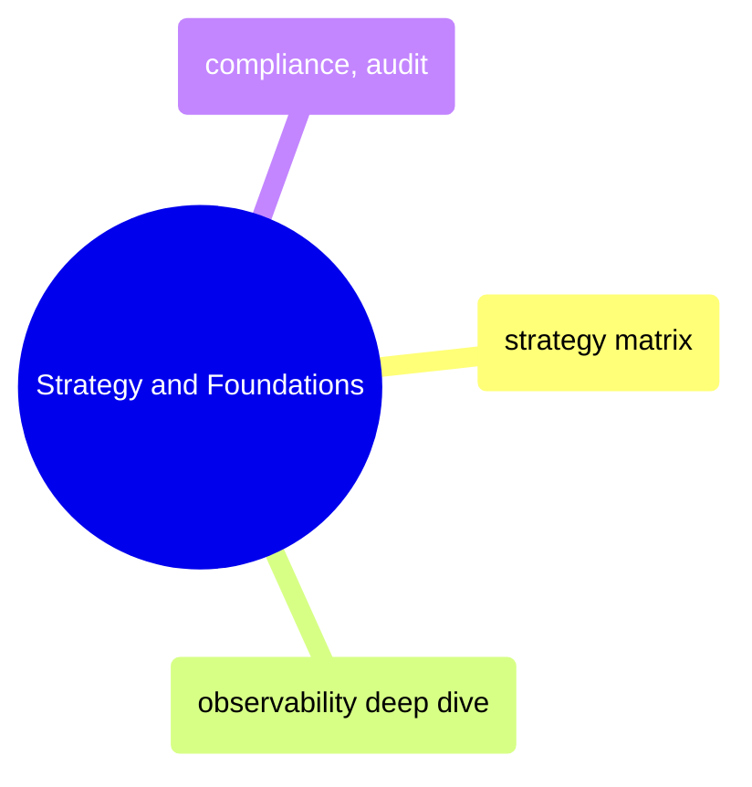
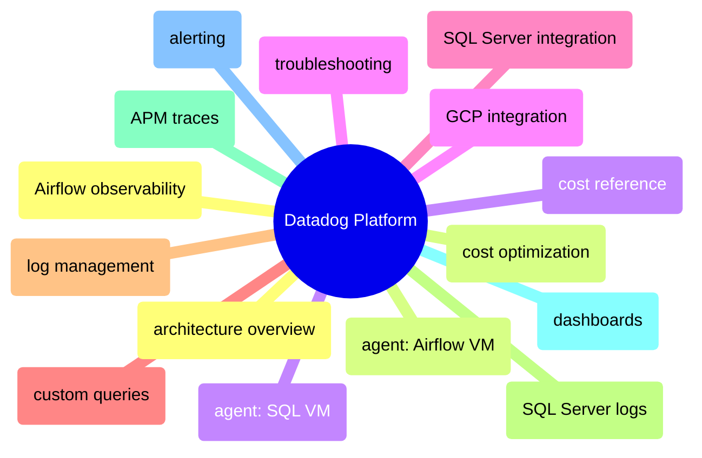
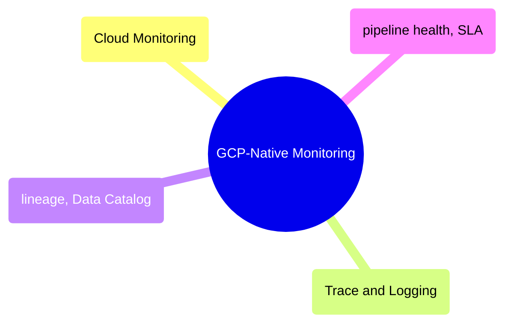

# MOC: Observability

Monitoring and observability from strategy through implementation — covering
the observability philosophy, the Datadog platform end-to-end, and GCP-native
monitoring alternatives. Expand any section to browse page contents.

> [!example]- Strategy and Foundations
>
> > [!abstract]- [[observability-strategy-matrix]]
> >
> > - [[observability-strategy-matrix#The Three Pillars Applied to Data Pipelines|Three pillars applied to data pipelines]]
> > - [[observability-strategy-matrix#Master Monitoring Matrix — Per Component|Master monitoring matrix]]
> > - [[observability-strategy-matrix#Alert Severity Framework|Alert severity framework]]
> > - [[observability-strategy-matrix#Dashboard Strategy|Dashboard strategy]]
> > - [[observability-strategy-matrix#Datadog vs GCP-Native — When to Use Which|Datadog vs GCP-Native decision guide]]
> > - [[observability-strategy-matrix#Anti-Patterns|Anti-patterns]]
>
> > [!abstract]- [[observability-deep-dive]]
> >
> > - [[observability-deep-dive#The Three Pillars (Metrics, Logs, Traces) Applied to Data Pipelines|Three pillars for data pipelines]]
> > - [[observability-deep-dive#DataDog for Data Pipeline Observability|Datadog for pipeline observability]]
> > - [[observability-deep-dive#Data Freshness Monitoring|Data freshness monitoring]]
> > - [[observability-deep-dive#Data Lineage: Where Did This Number Come From?|Data lineage]]
> > - [[observability-deep-dive#Building a Data Quality Framework|Data quality framework]]
> > - [[observability-deep-dive#Data Profiling and Drift Detection: Shift-Left Quality|Profiling and drift detection]]
>
> > [!abstract]- [[compliance-and-auditability]]
> >
> > - [[compliance-and-auditability#End-to-End Data Lineage|End-to-end data lineage]]
> > - [[compliance-and-auditability#Corporate Action Processing|Corporate action processing]]
> > - [[compliance-and-auditability#EU BMR Compliance|EU BMR compliance]]
> > - [[compliance-and-auditability#Restatement Procedures|Restatement procedures]]
> > - [[compliance-and-auditability#Datadog Integration for Compliance Monitoring|Datadog compliance monitoring]]

> [!example]- Datadog Platform
>
> > [!abstract]- [[datadog-architecture-overview]]
> >
> > - [[datadog-architecture-overview#Datadog Infrastructure Topology|Infrastructure topology]]
> > - [[datadog-architecture-overview#What Gets Monitored by Datadog|What gets monitored]]
> > - [[datadog-architecture-overview#Three Pillars of Observability in Datadog|Three pillars in Datadog]]
> > - [[datadog-architecture-overview#GCP Integration Setup|GCP integration setup]]
> > - [[datadog-architecture-overview#Disabling Datadog Agents and Integration|Disabling Datadog]]
>
> > [!abstract]- [[datadog-agent-airflow-vm]]
> >
> > - [[datadog-agent-airflow-vm#How It Works|How it works]]
> > - [[datadog-agent-airflow-vm#Docker Autodiscovery Labels|Docker autodiscovery labels]]
> > - [[datadog-agent-airflow-vm#StatsD — Airflow Metrics Collection|StatsD metrics collection]]
> > - [[datadog-agent-airflow-vm#Datadog Agent Memory Budget on Airflow VM|Memory budget]]
> > - [[datadog-agent-airflow-vm#Terraform Configuration for Airflow VM Agent|Terraform configuration]]
>
> > [!abstract]- [[datadog-agent-sql-vm]]
> >
> > - [[datadog-agent-sql-vm#Automated Setup (via Startup Script)|Automated setup]]
> > - [[datadog-agent-sql-vm#Datadog Agent Manual Install on SQL VM|Manual install]]
> > - [[datadog-agent-sql-vm#Datadog Agent Config File Locations on SQL VM|Config file locations]]
> > - [[datadog-agent-sql-vm#Datadog Agent Management Commands on SQL VM|Management commands]]
>
> > [!abstract]- [[datadog-gcp-integration]]
> >
> > - [[datadog-gcp-integration#Why the Datadog GCP Integration Is Needed|Why GCP integration is needed]]
> > - [[datadog-gcp-integration#GCP Integration Setup Steps|Setup steps]]
> > - [[datadog-gcp-integration#Terraform Resources for GCP Integration|Terraform resources]]
> > - [[datadog-gcp-integration#Using Cloud Run Metrics in Dashboards|Cloud Run metrics in dashboards]]
>
> > [!abstract]- [[datadog-sql-server-integration]]
> >
> > - [[datadog-sql-server-integration#Integration Config File|Integration config file]]
> > - [[datadog-sql-server-integration#SQL Server Integration Connection Parameters|Connection parameters]]
> > - [[datadog-sql-server-integration#Built-in SQL Server Metrics Collected by Datadog|Built-in metrics collected]]
> > - [[datadog-sql-server-integration#Verifying the SQL Server Integration|Verifying the integration]]
>
> > [!abstract]- [[datadog-custom-queries]]
> >
> > - [[datadog-custom-queries#Query 1: Connections by Login Name|Connections by login name]]
> > - [[datadog-custom-queries#Query 2: SQL Server Deadlock Count Metric|Deadlock count metric]]
> > - [[datadog-custom-queries#Full custom_queries Config Reference|Full config reference]]
> > - [[datadog-custom-queries#Datadog Column Type Reference for custom_queries|Column type reference]]
>
> > [!abstract]- [[datadog-log-management]]
> >
> > - [[datadog-log-management#SQL Server Errorlog Collection|SQL Server errorlog collection]]
> > - [[datadog-log-management#Airflow Container Log Collection|Airflow container log collection]]
> > - [[datadog-log-management#Viewing Logs in Datadog Log Explorer|Viewing logs in Log Explorer]]
> > - [[datadog-log-management#Cloud Run Pipeline Logs in Datadog|Cloud Run pipeline logs]]
>
> > [!abstract]- [[datadog-sql-server-logs]]
> >
> > - [[datadog-sql-server-logs#Configure the SQL Server Log Source|Configure the log source]]
> > - [[datadog-sql-server-logs#What Gets Logged from SQL Server Errorlog|What gets logged]]
> > - [[datadog-sql-server-logs#Troubleshooting If Bytes Read Stays at 0|Troubleshooting bytes read]]
> > - [[datadog-sql-server-logs#SQL Server Log Search Queries in Datadog|Log search queries]]
>
> > [!abstract]- [[datadog-apm-traces]]
> >
> > - [[datadog-apm-traces#How ddtrace Works (APM Auto-Instrumentation)|How ddtrace works]]
> > - [[datadog-apm-traces#What a Datadog APM Trace Looks Like|What a trace looks like]]
> > - [[datadog-apm-traces#Manual Spans per Pipeline Step|Manual spans per step]]
> > - [[datadog-apm-traces#Log-to-Trace Correlation with dd.trace_id|Log-to-trace correlation]]
> > - [[datadog-apm-traces#APM Trace Search Queries in Datadog|Trace search queries]]
>
> > [!abstract]- [[datadog-dashboards]]
> >
> > - [[datadog-dashboards#Pipeline Watch Dashboard|Pipeline Watch dashboard]]
> > - [[datadog-dashboards#SQL Server DBA Dashboard|SQL Server DBA dashboard]]
> > - [[datadog-dashboards#Airflow Orchestration Dashboard|Airflow Orchestration dashboard]]
>
> > [!abstract]- [[datadog-alerting]]
> >
> > - [[datadog-alerting#SQL Server DBA Monitors|SQL Server DBA monitors]]
> > - [[datadog-alerting#Airflow Orchestration Monitors|Airflow orchestration monitors]]
> > - [[datadog-alerting#Dashboard Conditional Formatting|Dashboard conditional formatting]]
> > - [[datadog-alerting#GCE Host Automuting in Datadog|GCE host automuting]]
>
> > [!abstract]- [datadog-airflow-observability](/13-Observability/Datadog/datadog-airflow-observability)
> >
> > - [StatsD metrics flow](/13-Observability/Datadog/datadog-airflow-observability#how-statsd-metrics-flow-from-airflow-to-datadog)
> > - [Key metrics reference](/13-Observability/Datadog/datadog-airflow-observability#key-metrics-reference)
> > - [Airflow dashboard](/13-Observability/Datadog/datadog-airflow-observability#airflow-orchestration-dashboard-in-datadog)
> > - [Recommended monitors](/13-Observability/Datadog/datadog-airflow-observability#recommended-airflow-monitors-in-datadog)
> > - [Self-hosted limitations](/13-Observability/Datadog/datadog-airflow-observability#limitations-of-self-hosted-airflow-observability)
>
> > [!abstract]- [[datadog-cost-optimization]]
> >
> > - [[datadog-cost-optimization#Datadog Cost Breakdown per Component|Cost breakdown per component]]
> > - [[datadog-cost-optimization#Datadog Agent Memory Overhead|Agent memory overhead]]
> > - [[datadog-cost-optimization#Disabling Datadog to Remove All Costs|Disabling Datadog]]
> > - [[datadog-cost-optimization#Datadog Cost Reduction Strategies|Cost reduction strategies]]
>
> > [!abstract]- [[datadog-cost-reference]]
> >
> > - [[datadog-cost-reference#Datadog SaaS Cost Breakdown|SaaS cost breakdown]]
> > - [[datadog-cost-reference#What Drives Datadog Pricing|What drives pricing]]
> > - [[datadog-cost-reference#Datadog Agent RAM Impact on Existing VMs|Agent RAM impact]]
> > - [[datadog-cost-reference#Datadog Compared to GCP Infrastructure Costs|Compared to GCP costs]]
>
> > [!abstract]- [[datadog-troubleshooting]]
> >
> > - [[datadog-troubleshooting#Agent Not Appearing in Datadog|Agent not appearing]]
> > - [[datadog-troubleshooting#APM Traces Not Appearing|APM traces not appearing]]
> > - [[datadog-troubleshooting#No Logs Appearing in Datadog Log Explorer|No logs appearing]]
> > - [[datadog-troubleshooting#COS Read-Only Filesystem Constraints for dd-agent|COS filesystem constraints]]
> > - [[datadog-troubleshooting#Ghost Hosts Appearing in Datadog Infrastructure|Ghost hosts]]
> > - [[datadog-troubleshooting#Agent Management Commands|Agent management commands]]

> [!example]- GCP-Native Monitoring
>
> > [!abstract]- [[gcp-cloud-monitoring-deep-dive]]
> >
> > - [[gcp-cloud-monitoring-deep-dive#Cloud Monitoring Architecture|Architecture]]
> > - [[gcp-cloud-monitoring-deep-dive#Monitoring Every GCP Component Used in Data Engineering|Monitoring every GCP component]]
> > - [[gcp-cloud-monitoring-deep-dive#Monitoring Query Language (MQL)|Monitoring Query Language]]
> > - [[gcp-cloud-monitoring-deep-dive#Custom Metrics for Data Pipelines|Custom metrics for pipelines]]
> > - [[gcp-cloud-monitoring-deep-dive#Alerting Policies|Alerting policies]]
> > - [[gcp-cloud-monitoring-deep-dive#SLIs and SLOs|SLIs and SLOs]]
>
> > [!abstract]- [[gcp-cloud-trace-and-logging]]
> >
> > - [[gcp-cloud-trace-and-logging#Cloud Logging for Data Engineers|Cloud Logging for data engineers]]
> > - [[gcp-cloud-trace-and-logging#Log-Based Metrics|Log-based metrics]]
> > - [[gcp-cloud-trace-and-logging#Log Router and Sinks|Log router and sinks]]
> > - [[gcp-cloud-trace-and-logging#Cloud Trace for Distributed Pipeline Tracing|Cloud Trace for pipeline tracing]]
> > - [[gcp-cloud-trace-and-logging#End-to-End Observability: Connecting Metrics, Logs, and Traces|Connecting metrics, logs, and traces]]
> > - [[gcp-cloud-trace-and-logging#Cost Comparison: GCP-Native vs Datadog|Cost comparison with Datadog]]
>
> > [!abstract]- [[gcp-data-lineage-and-catalog]]
> >
> > - [[gcp-data-lineage-and-catalog#GCP Lineage and Catalog Landscape|Lineage and catalog landscape]]
> > - [[gcp-data-lineage-and-catalog#Dataplex — Unified Data Governance|Dataplex unified governance]]
> > - [[gcp-data-lineage-and-catalog#Data Catalog — Tagging and Business Context|Data Catalog tagging]]
> > - [[gcp-data-lineage-and-catalog#Data Lineage — End-to-End Tracing|End-to-end lineage tracing]]
> > - [[gcp-data-lineage-and-catalog#Data Quality with Dataplex|Data quality with Dataplex]]
> > - [[gcp-data-lineage-and-catalog#Impact Analysis — Before You Change Anything|Impact analysis]]
>
> > [!abstract]- [[gcp-pipeline-health-and-sla]]
> >
> > - [[gcp-pipeline-health-and-sla#Data Freshness Monitoring|Data freshness monitoring]]
> > - [[gcp-pipeline-health-and-sla#Data Quality Checks|Data quality checks]]
> > - [[gcp-pipeline-health-and-sla#SLA Monitoring and Reporting|SLA monitoring and reporting]]
> > - [[gcp-pipeline-health-and-sla#Dead Man's Switch (Heartbeat Monitoring)|Heartbeat monitoring]]
> > - [[gcp-pipeline-health-and-sla#Alerting Runbook for Data Engineers|Alerting runbook]]
> > - [[gcp-pipeline-health-and-sla#Automation: Self-Healing Pipelines|Self-healing pipelines]]

## Cross-References

- [GCP](/06-GCP/moc-gcp) — Cloud Logging and Cloud Monitoring service configuration
- [SQL Server](/04-SQL-Server/moc-sql-server) — Wait stats and performance monitoring from the SQL Server perspective
- [Data Architecture](/14-Data-Architecture/moc-data-architecture) — Observability strategy in the five pillars framework
- [dbt](/11-dbt/moc-dbt) — dbt observability and Datadog integration
