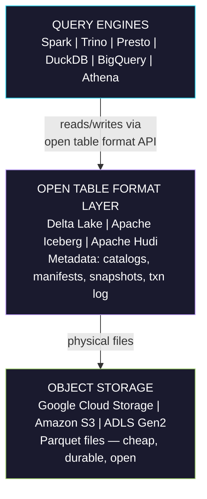
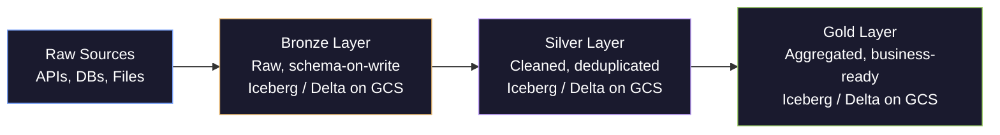
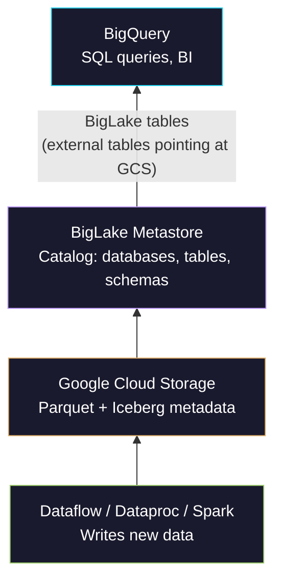

# Lakehouse Architecture

> [!quote]
> "A lakehouse is a data management system based on low-cost storage that also provides traditional analytical DBMS management and performance features."
>
> — **Michael Armbrust** (co-creator of Delta Lake)

> [!abstract]- Summary
>
> This note defines the lakehouse as the architecture that keeps data on open object storage while adding transactional metadata, schema control, and governance so one storage layer can serve ingestion, analytics, and machine-learning workloads without the traditional lake-versus-warehouse split.
>
> **Why the lakehouse emerged**
> - Explains how unmanaged lakes failed through missing ACID guarantees and governance while classic warehouses imposed proprietary storage and cost constraints on raw-scale analytics.
> - Positions the lakehouse as the synthesis that separates cheap storage from query engines while keeping a shared metadata contract over the files.
>
> **Core table-format capabilities**
> - Covers ACID transactions, schema enforcement and evolution, time travel, and row-level mutations, treating the open table format as the mechanism that makes object storage behave like a managed analytical system.
> - Compares copy-on-write and merge-on-read to show how write frequency, read latency, and maintenance trade against each other.
>
> **Formats, engines, and platform choices**
> - Compares Delta Lake, Apache Iceberg, and Apache Hudi, then maps the architecture onto medallion layering, multi-engine query access, and GCP governance through BigLake and related catalogs.
> - Connects implementation choices to ecosystem fit, interoperability, and operational ownership rather than treating the format decision as branding.
>
> **Operations and safety**
> - Warnings: an open table format is mandatory, compaction and snapshot cleanup are operational tasks not optional hygiene, and weak catalog discipline recreates the old data swamp under a new name.
> - Recommendations: choose the format that matches the platform ecosystem, treat maintenance as part of the design, and keep medallion layers and governance policies explicit from the first write.

> [!note]- Glossary
>
> **Lakehouse**
> - An analytical architecture that stores data in open file formats on object storage while adding database-like management through a metadata and transaction layer.
> - It matters here because the note explains why this architecture exists and how it replaces the traditional split between raw lake and governed warehouse.
>
> > [!info] One storage layer
> >
> > The lakehouse promise is not just lower cost. It is the ability to keep one authoritative physical copy of data while serving multiple compute engines.
>
> ---
>
> **Open table format**
> - A specification and metadata model that tracks table snapshots, files, schemas, and transactional state on top of object storage data files.
> - It matters here because the format layer is what gives the lakehouse ACID behavior, schema control, and interoperability.
>
> > [!warning] Files alone are not enough
> >
> > Parquet in a bucket is not a lakehouse. Without the table-format metadata, readers have no consistent table state to agree on.
>
> ---
>
> **ACID transaction**
> - A write or sequence of writes that obeys atomicity, consistency, isolation, and durability so readers never observe partial state.
> - It matters here because raw object storage does not provide these guarantees natively, yet the lakehouse depends on them.
>
> > [!info] Snapshot visibility
> >
> > Readers consult metadata first, so a failed write simply never becomes part of the visible table snapshot.
>
> ---
>
> **Schema evolution**
> - The controlled process of changing a table schema over time while preserving compatibility rules for existing readers and writers.
> - It matters here because the lakehouse promises flexibility without returning to the uncontrolled schema drift of old data lakes.
>
> > [!warning] Evolution is constrained
> >
> > Safe schema evolution still needs compatibility rules. Adding nullable columns is easy; narrowing types or reusing semantics is where tables break.
>
> ---
>
> **Time travel**
> - The ability to query a table as it existed at an earlier timestamp or snapshot version.
> - It matters here because auditing, debugging, and reproducible model training all rely on historical table states being queryable.
>
> > [!info] Operational replay tool
> >
> > Time travel is not just a convenience feature. It is a concrete recovery and investigation mechanism after bad writes or disputed outputs.
>
> ---
>
> **Snapshot**
> - A consistent recorded table state that points to the exact files and metadata valid at a specific version or time.
> - It matters here because every lakehouse read depends on snapshots rather than scanning whatever files happen to exist in storage.
>
> > [!warning] Retention has cost
> >
> > Keeping more snapshots improves auditability and rollback options, but it also increases metadata volume and cleanup work.
>
> ---
>
> **Copy-on-Write**
> - A mutation strategy that rewrites affected data files when rows change so readers always see compact, directly readable files.
> - It matters here because it favors read performance and simplicity at the cost of heavier writes.
>
> > [!info] Good for read-heavy tables
> >
> > Copy-on-write is usually easier to operate on dimensions and curated datasets where reads dominate and mutations are relatively sparse.
>
> ---
>
> **Merge-on-Read**
> - A mutation strategy that records changes in auxiliary delta or delete files and merges them with base files during reads.
> - It matters here because it reduces write cost for high-ingest tables while shifting more work to readers and maintenance jobs.
>
> > [!warning] Read path is more complex
> >
> > Merge-on-read can degrade query performance if compaction lags and too many delta files accumulate behind the scenes.
>
> ---
>
> **Catalog**
> - The metadata service that stores table definitions, namespaces, schemas, and access points for lakehouse engines.
> - It matters here because multiple engines can only share the same tables safely when they agree on a common catalog contract.
>
> > [!warning] Governance lives here
> >
> > If teams bypass the catalog and write directly to storage paths, they recreate the coordination failures the lakehouse was meant to solve.
>
> ---
>
> **BigLake**
> - Google Cloud's governance and external-table layer for analytical data stored in GCS and exposed through BigQuery-compatible controls.
> - It matters here because the note uses BigLake as the GCP-native path for cataloging and querying lakehouse-style storage.
>
> > [!info] GCP control plane
> >
> > BigLake is less about inventing a new format and more about providing managed cataloging, policy enforcement, and SQL access over open storage.
>


## Why the Lakehouse Emerged

To understand the lakehouse you need to understand what it replaced — and why both predecessors failed in isolation.

### The Data Lake Problem (2010–2018)

The original data lake premise was compelling: store all raw data cheaply on object storage (HDFS, then S3/GCS) and process it with schema-on-read. No ETL, no upfront modeling, maximum flexibility. In practice, data lakes became "data swamps":

- **No ACID guarantees.** A failed pipeline write left partial or corrupt files with no rollback mechanism.
- **No schema enforcement.** Any producer could write any schema. Downstream consumers broke silently when upstream schema changed.
- **No time travel.** "What did this table look like last Tuesday?" — impossible without maintaining your own snapshot infrastructure.
- **No fine-grained updates.** Correcting a single row meant rewriting entire Parquet partitions.
- **Governance collapse.** Without metadata, datasets became undiscoverable, untrustworthy, and unusable.
- **Massive small-files problem.** Streaming writes produced millions of tiny files, making queries scan thousands of objects for no data benefit.

> [!warning] The Data Swamp Anti-Pattern
> A data lake without governance is a liability, not an asset. Teams that dumped data into S3 "to process later" typically found that "later" never came, the schema was undocumented, and the cost of making the data usable exceeded the cost of re-extracting from source.

> [!success] Safe Pattern: Govern from the First Byte
> Apply an open table format (Iceberg or Delta Lake) from the very first write — even to raw/Bronze tables. Register all tables in a catalog (BigLake Metastore, AWS Glue, Nessie) at creation time, enforce schema-on-write, and document grain and ownership before any downstream pipeline reads the data. Governance applied retroactively is orders of magnitude more expensive than governance applied at ingestion.

### The Data Warehouse Problem (2000–present)

Data warehouses (Snowflake, Redshift, BigQuery, SQL Server) solved governance but imposed hard constraints:

- **Proprietary storage formats.** Data inside a Snowflake table is not accessible by Spark or DuckDB without going through Snowflake's compute (and billing).
- **Cost at scale.** Storing every raw event in a warehouse at warehouse pricing is 5–20x more expensive than object storage.
- **ML/AI friction.** Training ML models requires raw, granular data in formats that Python and Spark consume natively (Parquet, TFRecord). Exporting from a warehouse for every training run is slow and expensive.
- **Semi-structured data limitations.** Warehouses can store JSON but were not designed to query deeply nested, high-cardinality event streams efficiently.

### The Lakehouse Synthesis

The lakehouse resolves both sets of problems by separating storage from compute and adding a transaction layer on top of open formats:



The table format layer is what makes the lakehouse work. It is a metadata contract on top of files — any engine that implements the format spec can read and write the same data, with full ACID semantics.

---

## Key Properties of a Lakehouse

### ACID Transactions on Object Storage

Object storage (GCS, S3) has no native transaction support — it is a key-value store for blobs. Open table formats implement ACID by managing a transaction log that tracks every operation:

- **Atomicity:** a write either commits all files or none. A failed job leaves no partial state visible to readers.
- **Consistency:** readers always see a consistent snapshot; a write in progress does not affect concurrent reads.
- **Isolation:** multiple writers can operate concurrently using optimistic concurrency control; conflicts are detected and the losing writer retries.
- **Durability:** once committed to the transaction log (which is itself written to object storage), a write is permanent.

> [!abstract] How Delta Lake Achieves Atomicity
> Delta Lake writes new Parquet files to the storage location, then atomically updates a `_delta_log/` transaction log entry. Readers query the log first to determine which files constitute the current table state. Files not referenced in the log are invisible — partial writes simply never appear in the log.

### Schema Enforcement and Evolution

Unlike a raw data lake, a lakehouse table has a defined schema that is enforced on write:

- **Enforcement:** writing a dataframe with an incompatible schema raises an error rather than silently producing bad data.
- **Evolution:** new columns can be added safely without breaking existing readers. Column types can be widened (INT → LONG) but not narrowed.
- **Partition evolution (Iceberg):** the partition scheme of a table can change without rewriting historical data — Iceberg tracks the partition spec per snapshot.

### Time Travel

Every write to a lakehouse table creates a new snapshot. Snapshots are retained according to a configurable retention policy. This enables:

```python
# Delta Lake time travel — Spark
df = spark.read.format("delta") \
    .option("timestampAsOf", "2026-01-01") \
    .load("gs://my-bucket/events")

# Iceberg time travel — SQL via Spark SQL
spark.sql("""
SELECT * FROM catalog.db.events
TIMESTAMP AS OF '2026-01-01 00:00:00'
""")

# Query a specific snapshot ID
spark.sql("""
SELECT * FROM catalog.db.events
VERSION AS OF 42
""")
```

Time travel is critical for:
- **Auditing:** regulatory requirements to produce data as it existed at a specific point in time.
- **ML reproducibility:** training a model on the exact data snapshot that was available at training time.
- **Debugging:** comparing a pipeline output before and after a change.
- **GDPR right-to-erasure rollbacks:** verifying a deletion propagated correctly across historical snapshots.

### Row-Level Updates and Deletes

Traditional Parquet on object storage cannot update or delete individual rows — you must rewrite entire partition files. The lakehouse formats handle row-level mutations:

- **Copy-on-Write (CoW):** on UPDATE/DELETE, the affected Parquet files are rewritten with the changes applied. Reads are fast (no merging needed); writes are expensive for large files.
- **Merge-on-Read (MoR):** changes are written as small delta files (delete vectors, row-group updates). Reads merge the base files with the deltas on the fly; writes are fast but reads do more work.

Most production lakehouses use Copy-on-Write for dimension tables (slow-changing, query-heavy) and Merge-on-Read for fact tables (high-write, streaming).

---

### Open Table Formats Comparison

For a deep technical dive into each format's metadata model, see [open-table-formats](https://alp78.github.io/elysium/14-Data-Architecture/Architectures/open-table-formats). The summary comparison:

| Dimension | Delta Lake | Apache Iceberg | Apache Hudi |
|---|---|---|---|
| **Origin** | Databricks (2019) | Netflix (2020, Apache) | Uber (2019, Apache) |
| **Metadata model** | Transaction log JSON files | Manifest + snapshot tree | Timeline + log compaction |
| **Partition evolution** | Limited (requires rewrite) | Full — per-snapshot partition spec | Limited |
| **Hidden partitioning** | No | Yes — engine computes partition from column values | No |
| **Row-level deletes** | Delete vectors (v2+) | Equality delete files | Delete log (MoR) |
| **Streaming support** | Strong (Spark Structured Streaming) | Strong (Flink, Spark) | Native streaming-first design |
| **Catalog support** | Databricks Unity Catalog, HMS, AWS Glue | Nessie, Polaris, Tabular, HMS, AWS Glue, BigLake | HMS, AWS Glue |
| **GCP / BigQuery integration** | Via Dataproc, not native BigQuery | BigQuery Iceberg (GA), BigLake | Limited |
| **Primary ecosystem** | Databricks | Multi-vendor, open | Hudi ecosystem |
| **Best for** | Databricks shops | Multi-engine, cloud-agnostic | Streaming-heavy CDC workloads |

> [!tip] Choosing a Format for GCP
> On Google Cloud Platform, **Apache Iceberg** is the strategic choice. BigQuery has native Iceberg support (BigQuery Iceberg tables), BigLake Metastore is the managed catalog, and Dataproc/Spark reads Iceberg natively. Delta Lake works on Dataproc but has no native BigQuery integration. Hudi is rarely seen in GCP-first environments.

---

### Medallion Architecture as the Lakehouse Pattern

The [medallion-architecture](https://alp78.github.io/elysium/14-Data-Architecture/Pipeline-Patterns/medallion-architecture) (bronze / silver / gold) is the canonical organizational pattern for data within a lakehouse. Each layer is a set of lakehouse tables (Iceberg or Delta) in object storage, with increasing quality and decreasing granularity:



Key differences from a purely SQL-Server-based medallion implementation:
- **Bronze tables** use Merge-on-Read — streaming writes arrive constantly, CoW is too expensive.
- **Silver tables** use Copy-on-Write — quality transformations are batch, reads are frequent.
- **Gold tables** may be materialized views in BigQuery for fast BI access, pointing at the Iceberg silver tables via BigLake.

The [dbt-transformation-layer](https://alp78.github.io/elysium/14-Data-Architecture/Pipeline-Patterns/dbt-transformation-layer) can manage the silver → gold transformations using incremental models against Iceberg tables via Spark or Trino.

---

## GCP Lakehouse: BigLake and Unity Catalog

### BigLake (GCP's Lakehouse Management Layer)

BigLake is Google's lakehouse governance layer. It consists of:

- **BigLake Metastore:** a managed catalog compatible with the Apache Hive Metastore (HMS) API and the Iceberg REST Catalog spec. Spark, Flink, and Hive can all point at it.
- **BigLake tables:** a table type in BigQuery that reads data from GCS (Parquet, Iceberg, Delta, ORC, Avro) without copying it. Storage stays in GCS; BigQuery provides the SQL query engine.
- **Fine-grained access control:** row-level security and column-level masking policies are enforced at the BigLake layer — the same policy applies whether a user queries via BigQuery SQL or via Spark.
- **Data Boost:** a serverless read path that lets Bigtable and Spanner data be queried without consuming database compute.

#### GCP Lakehouse Stack


**Python: create a BigLake Iceberg table via BigQuery client**
```python
from google.cloud import bigquery

client = bigquery.Client(project="my-project")

# Create a BigQuery dataset that maps to a BigLake catalog
external_config = bigquery.ExternalConfig("ICEBERG")
external_config.source_uris = ["gs://my-bucket/warehouse/events/"]

table = bigquery.Table("my-project.my_dataset.events")
table.external_data_configuration = external_config

client.create_table(table)
print("BigLake Iceberg table created")
```

### Unity Catalog (Databricks)

Unity Catalog is Databricks' governance layer for the Databricks Lakehouse:
- Unified catalog for Delta Lake tables, files, ML models, and dashboards.
- Fine-grained access control (row filters, column masks) enforced at the catalog level.
- Lineage tracking: every read and write is recorded, enabling column-level lineage.
- Delta Sharing: open protocol for sharing Delta/Iceberg tables with external parties without copying data.

### Tabular (Iceberg-native)

Tabular is the company founded by the Apache Iceberg creators. It provides:
- A managed Iceberg catalog (REST catalog spec).
- Table optimization services (compaction, clustering, expiration) as a managed service.
- Engine-agnostic: works with Spark, Trino, Flink, DuckDB, Snowflake.

---

## Query Engines for the Lakehouse

A key lakehouse advantage is engine independence — the same data can be queried by multiple engines:

| Engine | Best For | Notes |
|---|---|---|
| **Apache Spark** | Large-scale batch ETL, ML feature engineering | The dominant lakehouse write engine; native Delta and Iceberg support |
| **Trino / Presto** | Interactive ad-hoc SQL queries | Sub-second latency at petabyte scale; excellent Iceberg support |
| **DuckDB** | Local/single-node analytics, fast development iteration | Can read Parquet and Iceberg directly; no cluster needed |
| **BigQuery** | BI queries, dashboards, SQL familiarity | Native Iceberg support via BigLake tables; serverless pricing |
| **Apache Flink** | Streaming ETL writing to lakehouse tables | Native Iceberg sink; low-latency streaming with exactly-once |
| **ksqlDB** | Kafka-integrated streaming SQL | Pairs with Kafka for event-driven lakehouse ingestion |

> [!tip] DuckDB for Local Development
> DuckDB is the fastest way to develop and test lakehouse queries locally. It reads Parquet files from GCS directly (with `INSTALL httpfs; LOAD httpfs; SET s3_region='auto'`) and supports basic Iceberg catalog queries. Use it to prototype transformations before scaling to Spark.

#### DuckDB reading Parquet from GCS
```sql
-- DuckDB local query against GCS Parquet files
INSTALL httpfs;
LOAD httpfs;

-- Set GCP credentials
SET gcs_access_key_id = 'GOOG...',
    gcs_secret_access_key = '...';

SELECT
    event_date,
    COUNT(*) AS event_count,
    SUM(amount) AS total_amount
FROM read_parquet('gs://my-bucket/warehouse/events/**/*.parquet')
WHERE event_date >= '2026-01-01'
GROUP BY event_date
ORDER BY event_date;
```

---

### Lakehouse vs Data Warehouse vs Data Lake

| Dimension | Data Lake | Data Warehouse | Lakehouse |
|---|---|---|---|
| **Storage format** | Open (Parquet, JSON, CSV, raw) | Proprietary (Snowflake micropartitions, BQ Capacitor) | Open (Parquet + table format metadata) |
| **Storage cost** | Very low (GCS/S3 pricing) | High (warehouse pricing includes storage) | Very low (GCS/S3 pricing) |
| **ACID transactions** | None | Full | Full (via Delta/Iceberg/Hudi) |
| **Schema enforcement** | None (schema on read) | Strict | Enforced on write |
| **Time travel** | None (unless you build it) | Limited (Snowflake Time Travel, BQ snapshots) | Native (every format) |
| **SQL query support** | Via external engines only | Native, optimized | Via multiple engines |
| **ML/AI access** | Direct (Spark/Python reads files natively) | Export required (expensive, slow) | Direct (same files, governed) |
| **Streaming ingestion** | Yes (just write files) | Limited, expensive | Yes (MoR, streaming formats) |
| **Governance & security** | None | Strong | Strong (catalog + ACLs) |
| **Vendor lock-in** | Low | High | Low (open formats) |
| **Compute engine choice** | Any | Warehouse-specific | Any (Spark, Trino, DuckDB, BigQuery) |
| **Update/delete rows** | No | Yes | Yes (CoW or MoR) |
| **Typical users** | Data scientists, ML engineers | Data analysts, BI | All of the above |

---

## When to Choose the Lakehouse

#### Choose the lakehouse when

- You have multiple compute engines that must access the same data (Spark for ETL, BigQuery for BI, Python for ML).
- Your data volume makes warehouse storage pricing prohibitive (>10 TB active data).
- You need ML/AI training on raw or semi-raw data at scale.
- Your regulatory environment requires long-retention data with point-in-time query capability.
- You are building a multi-tenant data platform where different teams use different tools.
- You are managing semi-structured or unstructured data alongside structured.
- You need to implement [data mesh](https://alp78.github.io/elysium/14-Data-Architecture/Architectures/data-mesh-architecture) — domain teams owning their data products in open formats that any consumer can read.

#### Do not choose the lakehouse when

- Your team is small and primarily doing SQL-based BI — a managed warehouse (BigQuery, Snowflake) has far less operational overhead.
- You are in early-stage product development where iteration speed matters more than scalability.
- You do not have Spark/Trino expertise — the lakehouse requires engineering investment to operate correctly.
- Your primary use case is OLTP (operational transactions) — a lakehouse is an analytics platform, not a database.

> [!warning] Operational Complexity
> A lakehouse is a distributed system. You are now responsible for compaction (merging small files into large ones), snapshot expiration (cleaning up old table versions), catalog management, and compute cluster sizing. Managed services (Databricks, Tabular, Google Dataproc Metastore) reduce this burden but do not eliminate it. Budget for operational engineering from day one.

> [!success] Safe Pattern: Automate Maintenance from Day One
> Schedule compaction, snapshot expiration, and orphan-file removal as recurring jobs in your orchestrator (Airflow, Databricks Workflows) at launch — not after performance degrades. Start with conservative defaults (compact daily, expire snapshots after 7 days, remove orphans weekly) and tune based on observed file-size distributions and query latency metrics.

---

## Real-World Implementations

### Databricks Lakehouse Platform

Databricks is the company that invented Delta Lake and coined the term "lakehouse." Their managed platform provides:
- **Managed Delta Lake:** automatic compaction, Z-ordering (multi-column clustering), Liquid Clustering (adaptive partitioning).
- **Unity Catalog:** governance, lineage, row-level security.
- **Databricks SQL:** SQL warehouse for BI on Delta tables with query result caching.
- **MLflow:** integrated ML experiment tracking and model registry.
- **Delta Live Tables:** declarative pipeline framework for building medallion architecture with automatic dependency resolution and quality assertions.

#### Databricks Delta Live Tables (declarative medallion)
```python
import dlt
from pyspark.sql.functions import col, current_timestamp

# Bronze: raw ingestion — append from streaming source
@dlt.table(
    name="events_bronze",
    comment="Raw events from Pub/Sub — no cleaning, no deduplication"
)
def events_bronze():
    return (
        spark.readStream
        .format("cloudFiles")  # Auto Loader — GCS file discovery
        .option("cloudFiles.format", "json")
        .load("gs://my-bucket/raw/events/")
    )

# Silver: cleaned, deduplicated
@dlt.table(
    name="events_silver",
    comment="Cleaned events — nulls removed, duplicates eliminated"
)
@dlt.expect_or_drop("valid_event_id", "event_id IS NOT NULL")
@dlt.expect_or_drop("valid_amount", "amount > 0")
def events_silver():
    return (
        dlt.read_stream("events_bronze")
        .dropDuplicates(["event_id"])
        .withColumn("ingested_at", current_timestamp())
    )

# Gold: business aggregate
@dlt.table(
    name="daily_revenue_gold",
    comment="Daily revenue rollup — dashboard-ready"
)
def daily_revenue_gold():
    return (
        dlt.read("events_silver")
        .groupBy("event_date", "product_id")
        .agg({"amount": "sum", "event_id": "count"})
    )
```

### Snowflake with Iceberg Support

Snowflake added Apache Iceberg table support — Snowflake can serve as the catalog and query engine for Iceberg tables stored in your own cloud storage bucket:
- **Snowflake-managed Iceberg:** Snowflake manages the metadata; you own the storage.
- **External Iceberg:** tables created by Spark or another engine, registered in Snowflake as external Iceberg tables.
- This enables "bring your own storage" while leveraging Snowflake's SQL engine and BI ecosystem.

### BigQuery with BigLake

BigQuery's lakehouse story is built around:
- **BigLake tables:** read Iceberg, Delta, Parquet, ORC from GCS with BigQuery SQL — no data copy.
- **Omni:** run BigQuery SQL against data in AWS S3 or Azure ADLS.
- **Materialized views on external tables:** BigQuery can materialize the results of queries against BigLake Iceberg tables, providing sub-second BI latency.

#### BigQuery query against a BigLake Iceberg table
```sql
-- BigQuery SQL — reads directly from GCS Iceberg table
SELECT
  event_date,
  product_category,
  SUM(revenue) AS total_revenue,
  COUNT(DISTINCT user_id) AS unique_users
FROM `my-project.my_dataset.events_silver`  -- BigLake Iceberg table
WHERE event_date BETWEEN '2026-01-01' AND '2026-03-22'
GROUP BY event_date, product_category
ORDER BY event_date, total_revenue DESC;
```

For BigQuery query optimization on external tables, see [querying-and-cost-optimization](https://alp78.github.io/elysium/06-GCP/BigQuery/querying-and-cost-optimization).

---

## Compaction and Table Maintenance

A critical operational responsibility in any lakehouse is table maintenance. Streaming writes and frequent small updates create many small Parquet files, which degrade read performance:

#### Iceberg table maintenance with Spark
```python
from pyspark.sql import SparkSession

spark = SparkSession.builder \
    .config("spark.sql.extensions", "org.apache.iceberg.spark.extensions.IcebergSparkSessionExtensions") \
    .config("spark.sql.catalog.glue", "org.apache.iceberg.spark.SparkCatalog") \
    .getOrCreate()

# Compact small files into target file size (512 MB)
spark.sql("""
CALL glue.system.rewrite_data_files(
  table => 'db.events',
  options => map(
    'target-file-size-bytes', '536870912',
    'min-file-size-bytes',    '134217728'
  )
)
""")

# Expire old snapshots (keep 7 days)
spark.sql("""
CALL glue.system.expire_snapshots(
  table => 'db.events',
  older_than => TIMESTAMP '2026-03-15 00:00:00',
  retain_last => 10
)
""")

# Remove orphan files (files not in any snapshot)
spark.sql("""
CALL glue.system.remove_orphan_files(
  table => 'db.events',
  older_than => TIMESTAMP '2026-03-15 00:00:00'
)
""")
```

> [!tip] Automate Maintenance with Airflow
> Schedule Iceberg maintenance jobs as daily [Airflow DAGs](https://alp78.github.io/elysium/12-Orchestration/Airflow/airflow-dag-patterns). Run compaction after the nightly batch load, expire snapshots weekly, and remove orphans monthly. Failing to do this will progressively degrade query performance and inflate storage costs.

---

### Connection to Streaming Architecture

The lakehouse is primarily a batch analytics architecture, but it increasingly handles streaming workloads. For streaming pipelines writing to lakehouse tables, see [streaming-architecture](https://alp78.github.io/elysium/14-Data-Architecture/Architectures/streaming-architecture):

- Apache Flink writes to Iceberg tables with exactly-once semantics via the Iceberg Flink sink.
- Spark Structured Streaming writes to Delta Lake with micro-batch or continuous processing.
- Pub/Sub → Dataflow (Apache Beam) → Iceberg on GCS is the canonical GCP streaming-to-lakehouse path.

---

## Related Notes

- [open-table-formats](https://alp78.github.io/elysium/14-Data-Architecture/Architectures/open-table-formats) — deep technical dive into Iceberg, Delta Lake, Hudi metadata models
- [medallion-architecture](https://alp78.github.io/elysium/14-Data-Architecture/Pipeline-Patterns/medallion-architecture) — bronze/silver/gold organizational pattern within a lakehouse
- [dbt-transformation-layer](https://alp78.github.io/elysium/14-Data-Architecture/Pipeline-Patterns/dbt-transformation-layer) — SQL transformation on lakehouse tables
- [idempotent-pipeline-design](https://alp78.github.io/elysium/14-Data-Architecture/Pipeline-Patterns/idempotent-pipeline-design) — ensuring safe re-runs in lakehouse pipelines
- [streaming-architecture](https://alp78.github.io/elysium/14-Data-Architecture/Architectures/streaming-architecture) — streaming ingestion into lakehouse tables
- [data-mesh-architecture](https://alp78.github.io/elysium/14-Data-Architecture/Architectures/data-mesh-architecture) — organizational pattern that uses lakehouse as the technical foundation
- [querying-and-cost-optimization](https://alp78.github.io/elysium/06-GCP/BigQuery/querying-and-cost-optimization) — BigQuery optimization when querying BigLake tables
- [serialization-formats](https://alp78.github.io/elysium/14-Data-Architecture/Pipeline-Patterns/serialization-formats) — Parquet, ORC, Avro — the file formats underneath the table formats
- [five-pillars-of-data-engineering](https://alp78.github.io/elysium/14-Data-Architecture/five-pillars-of-data-engineering) — reliability, observability, efficiency, security, operability

## References

- [Delta Lake Documentation](https://docs.delta.io/)
- [Apache Iceberg Documentation](https://iceberg.apache.org/docs/latest/)
- [Apache Hudi Documentation](https://hudi.apache.org/docs/overview/)
- [BigLake Documentation](https://cloud.google.com/biglake/docs)
- [Databricks Lakehouse Platform](https://www.databricks.com/product/data-lakehouse)
- [Quartz: The Lakehouse — A New Generation of Open Platforms (Armbrust et al., 2021)](https://www.cidrdb.org/cidr2021/papers/cidr2021_paper17.pdf)
