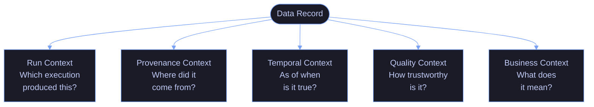
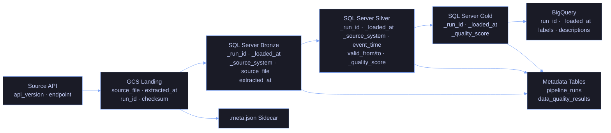

# Context and Metadata Architecture

> [!quote]+
> "Metadata is a love note to the future."
>
> — **Jason Scott**, Internet Archive

> [!abstract]- Summary
>
> This note defines context and metadata architecture as the discipline of preserving meaning, provenance, temporal state, and quality signals through every pipeline stage, then shows how to model, propagate, validate, and query that context so data stays explainable under change, audit, and failure.
>
> **Why context matters and the five context types**
> - Uses concrete failure scenarios to show how pipelines can succeed mechanically while still losing meaning, then defines run, provenance, temporal, quality, and business context as the five dimensions needed for trustworthy data.
> - Treats missing context as an architecture failure because debugging, compliance, restatement analysis, and trust all depend on it.
>
> **Implementation and propagation patterns**
> - Covers context records in SQL Server, BigQuery, Firestore, and Python, then explains propagation patterns such as metadata tables, envelope and sidecar approaches, and row-level context columns.
> - Connects context capture to day-to-day operations like replay, lineage tracing, auditability, and freshness tracking rather than leaving metadata in a separate governance silo.
>
> **Contracts, schema evolution, and design choices**
> - Explains data contracts, contract validation, schema evolution, schema drift detection, versioned registries, and anti-patterns that cause context to disappear across teams and systems.
> - Adds a decision framework for selecting the minimum viable context model by pipeline complexity and by the kinds of questions the system must answer later.
>
> **Operations and safety**
> - Warnings: overwritten history, orphaned schemas, missing run identifiers, and undocumented business meaning destroy trust even when the rows themselves are technically present.
> - Recommendations: start with minimum viable context on every table, propagate identifiers end to end, formalize contracts early, and use the operational recipes to prove the metadata can answer real incident and audit questions.
> - Troubleshooting: 6 operational recipes cover failed runs, row tracing, failed quality checks, freshness visibility, issue lineage, and stale BigQuery tables.

> [!note]- Glossary
>
> **Context / metadata architecture**
> - The design of how a platform captures, stores, propagates, and queries the information that explains what data means and how it came to exist.
> - It matters here because the note treats context as part of the data system itself rather than as side documentation.
>
> > [!warning] Metadata must answer questions
> >
> > If the platform cannot use metadata to investigate incidents, enforce contracts, or satisfy audits, the metadata model is ornamental rather than operational.
>
> ---
>
> **Run context**
> - The execution metadata that identifies which pipeline run produced a row or dataset, with what parameters, timing, and outcome.
> - It matters here because debugging and safe reprocessing begin with knowing exactly which run wrote what.
>
> > [!info] First investigation pivot
> >
> > When numbers look wrong, the fastest path is usually to compare run IDs, parameters, and row counts before inspecting business logic.
>
> ---
>
> **Provenance context**
> - The chain of source-system and transformation lineage that shows where a datum originated and how it moved through the platform.
> - It matters here because errors and ownership questions are only traceable when lineage remains attached to the data.
>
> > [!warning] Lineage gaps hide defects
> >
> > A row without provenance forces teams into guesswork about whether the bug sits in extraction, transformation, reference data, or publication.
>
> ---
>
> **Temporal context**
> - The time semantics that describe when data was observed, processed, valid in the business domain, and potentially corrected later.
> - It matters here because late arrivals, restatements, and audit comparisons all depend on time being modeled explicitly.
>
> > [!warning] One timestamp is not enough
> >
> > Event time, processing time, and validity time answer different questions. Collapsing them into a single column makes historical reasoning unreliable.
>
> ---
>
> **Quality context**
> - The metrics, assertions, and confidence signals that indicate whether data is complete, fresh, accurate, and fit for use.
> - It matters here because consumers need visible trust signals instead of blind faith that a green pipeline means good data.
>
> > [!info] Trust needs evidence
> >
> > Quality context works best when it is surfaced next to the data product, not buried in a separate monitoring tool that consumers never check.
>
> ---
>
> **Business context**
> - The semantic meaning of a field or dataset, including business definitions, ownership, classification, and intended use.
> - It matters here because technically correct rows are still ambiguous if different teams interpret them differently.
>
> > [!warning] Semantics drift quietly
> >
> > Metric names and field labels often look stable while their business meaning changes underneath. That drift is a context problem, not just a documentation problem.
>
> ---
>
> **Context propagation**
> - The mechanism by which context travels with data through pipeline stages rather than being recreated or guessed later.
> - It matters here because captured metadata has little value if it gets dropped at every transformation boundary.
>
> > [!info] Carry the chain forward
> >
> > Good propagation design makes context accumulation natural. Each stage adds new facts without severing what upstream already recorded.
>
> ---
>
> **Data contract**
> - A formal versioned agreement that defines schema, ownership, quality expectations, and compatibility rules between producers and consumers.
> - It matters here because contracts turn context from internal convention into an explicit inter-team boundary.
>
> > [!warning] Contracts need enforcement
> >
> > A YAML file by itself does not protect consumers. Validation, compatibility checks, and deployment gates are what make the contract real.
>
> ---
>
> **Schema drift**
> - Unplanned change in source or published schema that can break consumers or silently alter meaning if not detected and managed.
> - It matters here because schema drift is one of the fastest ways for context and trust to disappear from a pipeline.
>
> > [!warning] Silent breakage risk
> >
> > Drift is dangerous when systems keep running after the change. The pipeline looks healthy while consumers receive semantically different data.
>
> ---
>
> **Envelope pattern**
> - A propagation pattern where payload data is wrapped together with metadata so transport and processing preserve both as one unit.
> - It matters here because some architectures need context to travel with each record rather than relying only on side tables.
>
> > [!info] Useful at boundaries
> >
> > Envelope designs are especially helpful when data crosses services or protocols that would otherwise strip away execution and provenance details.
>
> ---
>
> **Bi-temporal modeling**
> - A temporal design that records both business-valid time and system-recorded time for the same fact.
> - It matters here because restatements and audit comparisons often require answering when something was true and when the platform knew it.
>
> > [!warning] More columns, clearer truth
> >
> > Bi-temporal models add complexity, but they are often the only clean way to reason about corrections, late data, and retroactive business changes.
>


## Why Context Matters — The Cost of Context Loss

Every data team eventually encounters the same class of failures — not failures of computation, but failures of meaning. The pipeline ran. The numbers landed. But nobody can explain what the numbers mean.

**Scenario 1: The Unexplained Revenue Drop**
A dashboard shows revenue dropped 15% overnight. The business panics. An analyst spends four hours digging through SQL before discovering that a pipeline reprocessed three days of data with a parameter change. There was no revenue drop — the pipeline double-counted corrections. Without **run context** (which execution produced which rows, with which parameters), this is invisible.

**Scenario 2: The Compliance Question Nobody Can Answer**
A compliance officer asks: "Show me every system that holds customer PII." The data team cannot answer because no table carries classification metadata. Fields named `email`, `phone`, or `ssn` are scattered across hundreds of tables with no business context tagging. Without **business context**, you cannot map data to regulatory obligations.

**Scenario 3: The Quarterly Report That Looks Wrong**
A quarterly report produces different numbers than the same report did last week for the same quarter. The data was restated, but the old version was overwritten. Without **temporal context** — the ability to query what the data looked like at a prior point in time — you cannot rewind and compare.

**Scenario 4: The Degrading ML Model**
An ML model's predictions degrade over two weeks. The model hasn't changed. The features haven't changed. But the training data quality has silently shifted — null rates increased, a source API started returning stale prices, and a schema change added an unexpected column. Without **quality context**, nobody notices until the business impact is undeniable.

> [!danger] The True Cost
> Context loss is not a technical inconvenience. It produces wrong business decisions, compliance violations, hours of debugging, and — most corrosively — a loss of trust in data. Once stakeholders stop trusting the data, they revert to spreadsheets and gut feelings. Rebuilding that trust takes months.

> [!success] Building and Rebuilding Trust
> Instrument every pipeline stage with a minimum context record: `_run_id`, `_extracted_at`, `_source_system`, and a row-count assertion. Surface these in a lightweight data health dashboard so consumers can see freshness and quality at a glance. When trust has been lost, start by making the metadata transparent — even imperfect data with honest quality scores is more trustworthy than perfect-looking data with no provenance.

---

## The Five Types of Pipeline Context

Every piece of data flowing through a pipeline needs five types of context to be fully understood. Most pipelines capture one or two. Mature pipelines capture all five.



*Figure: The five dimensions of pipeline context — a data record is fully understood only when all five are known.*

| Context Type | Core Question | Without It |
|---|---|---|
| **Run Context** | Which execution produced this data? | Cannot debug, audit, or reprocess |
| **Provenance Context** | Where did this data come from? | Cannot trace errors to their source |
| **Temporal Context** | As of when is this data true? | Cannot handle late data or corrections |
| **Quality Context** | How trustworthy is this data? | Consumers trust blindly or not at all |
| **Business Context** | What does this data mean? | Teams define metrics differently |

---

### Run Context — Which Execution Produced This Data?

Run context answers: "This row exists because pipeline X ran at time Y with parameters Z and produced N rows." It is the most fundamental form of pipeline observability.

#### What it captures

The following fields form the minimum run context record. Start with the first five and add the rest as your observability needs grow.

| Field | Type | Purpose |
|---|---|---|
| `run_id` | UUID | Unique identifier for this execution |
| `pipeline_name` | String | Which pipeline ran |
| `started_at` | Timestamp | When execution began |
| `completed_at` | Timestamp | When execution finished |
| `duration_seconds` | Integer | How long it took |
| `status` | Enum | running, success, failed, cancelled |
| `rows_extracted` | Integer | How many rows were read from the source |
| `rows_loaded` | Integer | How many rows were written to the target |
| `parameters` | JSON | Runtime parameters (date range, flags, overrides) |
| `triggered_by` | String | Manual, scheduler, event, backfill |
| `dag_run_id` | String | Airflow/orchestrator run identifier |
| `parent_run_id` | UUID | If this run was triggered by another pipeline |

**Why it matters:** When something goes wrong, the first question is always "what changed?" Run context lets you compare today's run to yesterday's run — different parameters, different row counts, different duration. It also enables idempotent reprocessing: delete all rows with a given `_run_id` and re-run.

#### Implementation: Pipeline Runs Metadata Table (SQL Server)

Create a central metadata table to record every pipeline execution, with filtered indexes for the two most common operational queries (recent runs by pipeline, all failures):

```sql
CREATE TABLE dbo.pipeline_runs (
    run_id              UNIQUEIDENTIFIER PRIMARY KEY DEFAULT NEWID(),
    pipeline_name       VARCHAR(100)     NOT NULL,
    started_at          DATETIME2(0)     NOT NULL DEFAULT SYSUTCDATETIME(),
    completed_at        DATETIME2(0),
    duration_seconds    AS DATEDIFF(SECOND, started_at, completed_at),
    status              VARCHAR(20)      NOT NULL DEFAULT 'running'
                        CHECK (status IN ('running','success','failed','cancelled')),
    rows_extracted      INT,
    rows_loaded         INT,
    parameters          NVARCHAR(MAX),   -- JSON blob
    triggered_by        VARCHAR(50)      DEFAULT 'scheduler',
    dag_run_id          VARCHAR(200),
    parent_run_id       UNIQUEIDENTIFIER,
    error_message       NVARCHAR(MAX),
    error_stack_trace   NVARCHAR(MAX),
    CONSTRAINT FK_pipeline_runs_parent
        FOREIGN KEY (parent_run_id) REFERENCES dbo.pipeline_runs(run_id)
);

CREATE INDEX IX_pipeline_runs_name_started
    ON dbo.pipeline_runs (pipeline_name, started_at DESC);

CREATE INDEX IX_pipeline_runs_status
    ON dbo.pipeline_runs (status)
    WHERE status = 'failed';
```

#### Implementation: Pipeline Runs Metadata Table (BigQuery)

The equivalent structure in BigQuery, partitioned by run date and clustered for efficient status and pipeline-name queries:

```sql
CREATE TABLE IF NOT EXISTS `project.ops.pipeline_runs` (
    run_id          STRING       NOT NULL,
    pipeline_name   STRING       NOT NULL,
    started_at      TIMESTAMP    NOT NULL,
    completed_at    TIMESTAMP,
    status          STRING       NOT NULL,
    rows_extracted  INT64,
    rows_loaded     INT64,
    parameters      JSON,
    triggered_by    STRING,
    dag_run_id      STRING,
    parent_run_id   STRING,
    error_message   STRING
)
PARTITION BY DATE(started_at)
CLUSTER BY pipeline_name, status
OPTIONS (
    description = 'Tracks every pipeline execution with parameters and outcomes',
    labels = [('team', 'data-platform'), ('tier', 'operational')]
);
```

#### Implementation: Materialized Run ID Column

Every target table carries the run that wrote it:

```sql
-- On every bronze/silver/gold table
ALTER TABLE dbo.daily_prices
    ADD _run_id    UNIQUEIDENTIFIER NOT NULL,
        _loaded_at DATETIME2(0)     NOT NULL DEFAULT SYSUTCDATETIME();

-- Enables: "delete and reload" idempotent pattern
DELETE FROM dbo.daily_prices WHERE _run_id = @CurrentRunId;
INSERT INTO dbo.daily_prices (_run_id, ...) VALUES (@CurrentRunId, ...);
```

#### Implementation: Firestore Real-Time Pipeline State

For dashboards that need real-time pipeline status (see [firestore-data-model-and-operations](https://alp78.github.io/elysium/06-GCP/Firestore/firestore-data-model-and-operations)):

```python
from google.cloud import firestore

db = firestore.Client()

def update_pipeline_state(run_id: str, pipeline_name: str, status: str, **kwargs):
    """Write real-time pipeline state to Firestore for dashboard consumption."""
    doc_ref = db.collection("pipeline_runs").document(run_id)
    doc_ref.set({
        "pipeline_name": pipeline_name,
        "status": status,
        "updated_at": firestore.SERVER_TIMESTAMP,
        **kwargs
    }, merge=True)
```

#### Implementation: Python Context Manager

A reusable context manager that wraps every pipeline run, recording start, end, status, and metrics:

```python
import uuid
import logging
from datetime import datetime, timezone
from contextlib import contextmanager
from dataclasses import dataclass, field
from typing import Optional

import pyodbc

logger = logging.getLogger(__name__)


@dataclass
class RunMetrics:
    """Accumulates metrics during a pipeline run."""
    rows_extracted: int = 0
    rows_loaded: int = 0
    rows_rejected: int = 0
    custom: dict = field(default_factory=dict)


class PipelineContext:

    def __init__(
        self,
        pipeline_name: str,
        db_connection: pyodbc.Connection,
        parameters: Optional[dict] = None,
        triggered_by: str = "scheduler",
        parent_run_id: Optional[str] = None,
    ):
        self.run_id = str(uuid.uuid4())
        self.pipeline_name = pipeline_name
        self.db_connection = db_connection
        self.parameters = parameters or {}
        self.triggered_by = triggered_by
        self.parent_run_id = parent_run_id
        self.metrics = RunMetrics()
        self.started_at: Optional[datetime] = None
        self.completed_at: Optional[datetime] = None
        self.status: str = "pending"

    def __enter__(self):
        self.started_at = datetime.now(timezone.utc)
        self.status = "running"
        self._insert_run_record()
        logger.info(
            "Pipeline %s started | run_id=%s",
            self.pipeline_name, self.run_id
        )
        return self

    def __exit__(self, exc_type, exc_val, exc_tb):
        self.completed_at = datetime.now(timezone.utc)

        if exc_type is None:
            self.status = "success"
            error_message = None
        else:
            self.status = "failed"
            error_message = f"{exc_type.__name__}: {exc_val}"
            logger.error(
                "Pipeline %s failed | run_id=%s | error=%s",
                self.pipeline_name, self.run_id, error_message
            )

        self._update_run_record(error_message)

        logger.info(
            "Pipeline %s completed | run_id=%s | status=%s | "
            "extracted=%d | loaded=%d | duration=%.1fs",
            self.pipeline_name, self.run_id, self.status,
            self.metrics.rows_extracted, self.metrics.rows_loaded,
            (self.completed_at - self.started_at).total_seconds()
        )

        # Do not suppress exceptions
        return False

    def _insert_run_record(self):
        """Insert the initial run record into the metadata table."""
        import json
        cursor = self.db_connection.cursor()
        cursor.execute(
            """
            INSERT INTO dbo.pipeline_runs
                (run_id, pipeline_name, started_at, status,
                 parameters, triggered_by, parent_run_id)
            VALUES (?, ?, ?, ?, ?, ?, ?)
            """,
            self.run_id,
            self.pipeline_name,
            self.started_at,
            self.status,
            json.dumps(self.parameters),
            self.triggered_by,
            self.parent_run_id,
        )
        self.db_connection.commit()

    def _update_run_record(self, error_message: Optional[str] = None):
        """Update the run record with completion details."""
        cursor = self.db_connection.cursor()
        cursor.execute(
            """
            UPDATE dbo.pipeline_runs
            SET completed_at    = ?,
                status          = ?,
                rows_extracted  = ?,
                rows_loaded     = ?,
                error_message   = ?
            WHERE run_id = ?
            """,
            self.completed_at,
            self.status,
            self.metrics.rows_extracted,
            self.metrics.rows_loaded,
            error_message,
            self.run_id,
        )
        self.db_connection.commit()
```

#### Implementation: Decorator Pattern

For simpler pipelines, a decorator wraps the function automatically:

```python
import functools

def pipeline_context(pipeline_name: str, db_connection_factory=None):
    """Decorator that wraps a pipeline function with run context."""
    def decorator(func):
        @functools.wraps(func)
        def wrapper(*args, **kwargs):
            conn = db_connection_factory() if db_connection_factory else kwargs.get("db_connection")
            with PipelineContext(pipeline_name, conn) as ctx:
                kwargs["ctx"] = ctx
                return func(*args, **kwargs)
        return wrapper
    return decorator


# Usage:
@pipeline_context("daily-prices-ingest", db_connection_factory=get_db_connection)
def ingest_daily_prices(date: str, ctx: PipelineContext = None):
    data = extract_prices(date)
    ctx.metrics.rows_extracted = len(data)
    load_prices(data, ctx.run_id)
    ctx.metrics.rows_loaded = len(data)
```

#### Airflow Integration

Pass the orchestrator's run context into the pipeline:

```python
# In an Airflow DAG
from airflow.decorators import task

@task
def run_daily_ingest(**airflow_context):
    dag_run_id = airflow_context["dag_run"].run_id
    execution_date = airflow_context["ds"]

    with PipelineContext(
        pipeline_name="daily-ingest",
        db_connection=get_connection(),
        parameters={"execution_date": execution_date},
        triggered_by=f"airflow:{dag_run_id}",
    ) as ctx:
        # Pipeline logic here
        ...
```

> [!tip] Always Generate run_id at the Top
> Generate the `run_id` once at the start of the pipeline and propagate it through every function call, every database write, and every log message. If you generate IDs at each stage, you lose the ability to trace end-to-end.

---

### Provenance Context — Where Did This Data Come From?

Provenance answers: "This row was extracted from source system X, table Y, at time Z, via API version V." It creates the chain of custody from origin to destination.

#### What it captures

Provenance columns answer the chain-of-custody question: given any row, where did it come from and when?

| Field | Type | Purpose |
|---|---|---|
| `_source_system` | String | Name of the originating system |
| `_source_table` | String | Table, API endpoint, or file path |
| `_extracted_at` | Timestamp | When data was pulled from source |
| `_source_file` | String | For file-based pipelines, the file URI |
| `_api_version` | String | Version of the source API |
| `_schema_version` | String | Version of the source schema |
| `_batch_id` | String | Logical batch grouping for the extraction |

**Why it matters:** When a data quality issue surfaces in gold-layer reporting, provenance lets you trace backward: which silver transformation? which bronze table? which source extraction? which file or API call?

#### Implementation: Materialized Provenance Columns

Add provenance columns directly to the bronze table alongside business columns so every row is self-describing:

```sql
-- Bronze table carries full provenance from the source
CREATE TABLE dbo.bronze_daily_prices (
    symbol          VARCHAR(20)     NOT NULL,
    trade_date      DATE            NOT NULL,
    open_price      DECIMAL(18,6),
    high_price      DECIMAL(18,6),
    low_price       DECIMAL(18,6),
    close_price     DECIMAL(18,6),
    volume          BIGINT,
    _run_id         UNIQUEIDENTIFIER NOT NULL,
    _loaded_at      DATETIME2(0)     NOT NULL DEFAULT SYSUTCDATETIME(),
    _source_system  VARCHAR(50)      NOT NULL,
    _source_file    VARCHAR(500),
    _extracted_at   DATETIME2(0)     NOT NULL,
    _schema_version VARCHAR(20)
);
```

#### Implementation: Envelope Pattern (Event / Message Pipelines)

For event-driven or message-based pipelines (Pub/Sub, Kafka), wrap every message in a metadata envelope:

```json
{
    "metadata": {
        "message_id": "msg-2026-03-22-00042",
        "source_system": "market-data-api",
        "source_endpoint": "/v3/eod-prices",
        "api_version": "v3",
        "schema_version": "2.1.0",
        "extracted_at": "2026-03-22T14:30:00Z",
        "pipeline_run_id": "a1b2c3d4-e5f6-7890-abcd-ef1234567890",
        "content_type": "application/json",
        "compression": "none",
        "record_count": 1
    },
    "payload": {
        "symbol": "AAPL",
        "trade_date": "2026-03-20",
        "close": 185.42,
        "volume": 52300000
    }
}
```

Python helper for producing enveloped messages:

```python
import json
import uuid
from datetime import datetime, timezone
from typing import Any


def create_envelope(
    payload: Any,
    source_system: str,
    source_endpoint: str,
    run_id: str,
    schema_version: str = "1.0.0",
    api_version: str = "v1",
) -> dict:
    """Wrap a payload in a metadata envelope for context propagation."""
    return {
        "metadata": {
            "message_id": str(uuid.uuid4()),
            "source_system": source_system,
            "source_endpoint": source_endpoint,
            "api_version": api_version,
            "schema_version": schema_version,
            "extracted_at": datetime.now(timezone.utc).isoformat(),
            "pipeline_run_id": run_id,
            "content_type": "application/json",
            "record_count": len(payload) if isinstance(payload, list) else 1,
        },
        "payload": payload,
    }


def unwrap_envelope(message: dict) -> tuple[dict, Any]:
    """Separate metadata from payload."""
    return message["metadata"], message["payload"]
```

Publishing an enveloped message to Pub/Sub:

```python
from google.cloud import pubsub_v1

publisher = pubsub_v1.PublisherClient()
topic_path = publisher.topic_path("my-project", "market-data")

envelope = create_envelope(
    payload={"symbol": "AAPL", "close": 185.42},
    source_system="market-data-api",
    source_endpoint="/v3/eod-prices",
    run_id=ctx.run_id,
    schema_version="2.1.0",
)

future = publisher.publish(
    topic_path,
    data=json.dumps(envelope).encode("utf-8"),
    # Also set key attributes for filtering/routing
    source_system="market-data-api",
    schema_version="2.1.0",
)
```

#### Implementation: Sidecar Metadata Files

For file-based pipelines, write a companion metadata file alongside every data file:

```
gs://data-lake/landing/prices/2026-03-22.parquet
gs://data-lake/landing/prices/2026-03-22.meta.json
```

Contents of the sidecar file:

```json
{
    "data_file": "gs://data-lake/landing/prices/2026-03-22.parquet",
    "source_system": "market-data-api",
    "source_endpoint": "/v3/eod-prices",
    "api_version": "v3",
    "extracted_at": "2026-03-22T14:35:00Z",
    "pipeline_run_id": "a1b2c3d4-e5f6-7890-abcd-ef1234567890",
    "record_count": 8432,
    "file_size_bytes": 1245678,
    "schema_version": "2.1.0",
    "checksum_sha256": "e3b0c44298fc1c149afbf4c8996fb92427ae41e4649b934ca495991b7852b855"
}
```

Python function to write sidecar metadata:

```python
import hashlib
import json
import os
from google.cloud import storage


def write_sidecar_metadata(
    gcs_data_path: str,
    source_system: str,
    run_id: str,
    record_count: int,
    schema_version: str = "1.0.0",
    extracted_at: str = None,
    extra_metadata: dict = None,
):
    """Write a .meta.json sidecar file next to the data file in GCS."""
    client = storage.Client()
    bucket_name = gcs_data_path.split("/")[2]
    blob_path = "/".join(gcs_data_path.split("/")[3:])

    # Get data file size
    bucket = client.bucket(bucket_name)
    data_blob = bucket.blob(blob_path)
    data_blob.reload()

    # Build metadata
    meta = {
        "data_file": gcs_data_path,
        "source_system": source_system,
        "pipeline_run_id": run_id,
        "extracted_at": extracted_at or datetime.now(timezone.utc).isoformat(),
        "record_count": record_count,
        "file_size_bytes": data_blob.size,
        "schema_version": schema_version,
        "checksum_md5": data_blob.md5_hash,
    }
    if extra_metadata:
        meta.update(extra_metadata)

    # Write sidecar file
    meta_path = blob_path.rsplit(".", 1)[0] + ".meta.json"
    meta_blob = bucket.blob(meta_path)
    meta_blob.upload_from_string(
        json.dumps(meta, indent=2),
        content_type="application/json",
    )
```

#### Implementation: GCS Object Custom Metadata

An alternative to sidecar files — store provenance directly on the GCS object:

```bash
# Set custom metadata on a GCS object
gcloud storage objects update gs://data-lake/landing/prices/2026-03-22.parquet \
    --custom-metadata="source_system=market-data-api,extracted_at=2026-03-22T14:30:00Z,pipeline_run_id=a1b2c3d4,schema_version=2.1.0,record_count=8432"

# Read custom metadata back
gcloud storage objects describe gs://data-lake/landing/prices/2026-03-22.parquet \
    --format="json(metadata)"
```

```python
# Setting custom metadata in Python
from google.cloud import storage

client = storage.Client()
bucket = client.bucket("data-lake")
blob = bucket.blob("landing/prices/2026-03-22.parquet")
blob.metadata = {
    "source_system": "market-data-api",
    "extracted_at": "2026-03-22T14:30:00Z",
    "pipeline_run_id": ctx.run_id,
    "schema_version": "2.1.0",
    "record_count": "8432",
}
blob.patch()
```

#### Cross-System Provenance Chain

As data moves through zones, each hop should record where it came from:

```
API (market-data-api v3)
  → GCS landing (gs://bucket/landing/prices/2026-03-22.parquet)
    → SQL Server bronze (dbo.bronze_daily_prices, _source_file=gs://...)
      → SQL Server silver (dbo.silver_daily_prices, _source_system=bronze)
        → BigQuery gold (dataset.daily_prices, _source_system=silver)
```

> [!warning] Never Strip Provenance in Transformation
> A common anti-pattern is to SELECT only business columns during transformation, dropping `_source_system` and `_extracted_at`. Always carry at least `_run_id` through every layer. It is your foreign key back to the full provenance chain.

> [!success] Provenance Column Pattern
> Add a standard provenance block to every transformation SELECT: `_run_id`, `_source_system`, `_extracted_at`, and `_processed_at`. Define these as a dbt macro or a Python dataclass so every pipeline applies them consistently without per-developer decisions. The overhead is negligible (4 columns); the debugging value when tracing a bad record through three layers is immense.

---

### Temporal Context — As of When Is This Data True?

Temporal context is the hardest context problem. It requires distinguishing between three separate time concepts that most pipelines conflate into one.

#### Three Time Concepts

Most pipelines conflate all three into a single `timestamp` field. Separating them is what enables late-arrival handling, restatements, and historical auditability:

| Concept | Definition | Example |
|---|---|---|
| **Event time** | When the business event actually occurred | A trade executed at 14:30:00 EST |
| **Processing time** | When the pipeline processed the record | The pipeline ingested it at 15:45:00 UTC |
| **Recording time** | When the record was written to the target | The row was inserted into SQL Server at 15:47:12 UTC |

#### Why all three matter

Each time concept enables a different class of data reliability:

- **Late-arriving data**: A trade from Monday arrives in Tuesday's pipeline run. If you only track processing time, it appears as a Tuesday event. If you track event time, it correctly belongs to Monday.
- **Corrections**: The source system corrects a price from $185.42 to $185.44. With only current state, the old value is gone. With recording time, you know both values and when each was believed true.
- **Restatements**: A regulatory filing requires restating Q3 numbers. With bi-temporal modeling, you can show both the original and restated values with their respective validity periods.

#### Bi-Temporal Modeling

Bi-temporal tables track two independent time axes:

1. **Business time** (`valid_from` / `valid_to`): when the fact was true in the real world
2. **System time** (`recorded_at`): when the system learned about this version

```mermaid
%%{init: {"theme": "base", "themeVariables": {"primaryColor": "#1a1b26", "primaryTextColor": "#c0caf5", "primaryBorderColor": "#7aa2f7", "lineColor": "#7aa2f7", "secondaryColor": "#16161e", "tertiaryColor": "#24283b", "edgeLabelBackground": "#1a1b26", "clusterBkg": "#24283b", "clusterBorder": "#565f89"}}}%%
flowchart TD
    subgraph BT["Business Time Axis — when was it true in the world?"]
        V1["Version 1<br/>valid_from: 2025-01-01<br/>valid_to: 2026-03-01<br/>sector: Technology"]:::highlight
        V2["Version 2<br/>valid_from: 2026-03-01<br/>valid_to: 9999-12-31<br/>sector: Software"]
        V1 -->|"sector changed"| V2
    end
    subgraph ST["System Time Axis — when did the system learn about each version?"]
        R1["Recorded: 2025-01-01<br/>first known version"]:::highlight
        R2["Recorded: 2026-03-01<br/>new version discovered"]
        RC["Recorded: 2026-03-05<br/>retroactive correction to V1<br/>supersedes original R1"]
        R1 --> RC
        R2
    end
    V1 --- R1
    V2 --- R2

    classDef highlight fill:#24283b,stroke:#7aa2f7
```



*Figure: Bi-temporal modeling tracks both when a fact was true (business time) and when the system learned about it (system time), enabling point-in-time reconstruction and retroactive correction handling.*

```sql
CREATE TABLE dbo.instrument_dim (
    instrument_sk   INT IDENTITY(1,1) PRIMARY KEY,
    instrument_id   INT              NOT NULL,
    symbol          VARCHAR(20)      NOT NULL,
    company_name    NVARCHAR(200),
    sector          VARCHAR(100),
    exchange        VARCHAR(50),
    currency        CHAR(3),
    valid_from      DATETIME2(0)     NOT NULL,
    valid_to        DATETIME2(0)     NOT NULL DEFAULT '9999-12-31',
    is_current      BIT              NOT NULL DEFAULT 1,
    recorded_at     DATETIME2(0)     NOT NULL DEFAULT SYSUTCDATETIME(),
    superseded_at   DATETIME2(0),
    _run_id         UNIQUEIDENTIFIER NOT NULL,
    _source_system  VARCHAR(50)      NOT NULL
);

-- Indexes for temporal queries
CREATE INDEX IX_instrument_dim_natural_key
    ON dbo.instrument_dim (instrument_id, valid_from, valid_to);

CREATE INDEX IX_instrument_dim_current
    ON dbo.instrument_dim (instrument_id)
    WHERE is_current = 1;
```

#### Point-in-Time Queries

**"What did we believe the instrument looked like on March 1?"**

**Business-time query** — what was true in the real world on March 1:

```sql
SELECT *
FROM dbo.instrument_dim
WHERE instrument_id = 42
  AND valid_from <= '2026-03-01'
  AND valid_to   >  '2026-03-01';
```

**Bi-temporal query** — what did the system believe on March 1 was true on March 1 (corrects for retroactive data fixes):

```sql
SELECT *
FROM dbo.instrument_dim
WHERE instrument_id = 42
  AND valid_from   <= '2026-03-01'
  AND valid_to     >  '2026-03-01'
  AND recorded_at  <= '2026-03-01'
  AND (superseded_at IS NULL OR superseded_at > '2026-03-01');
```

#### "Show me how our knowledge of this instrument changed over time"

Query all historical versions of a dimension record, ordered by when the system first learned about each version:

```sql
-- All versions of a single instrument, ordered by when we learned about them
SELECT instrument_id, symbol, company_name, sector,
       valid_from, valid_to,
       recorded_at, superseded_at
FROM dbo.instrument_dim
WHERE instrument_id = 42
ORDER BY recorded_at;
```

#### SCD Type 2 Insert Procedure with Bi-Temporal Support

A stored procedure implementing [SCD Type 2](https://alp78.github.io/elysium/14-Data-Architecture/Architectures/data-warehouse-architecture) with bi-temporal support: it closes the current record on the business time axis and records the correction timestamp on the system time axis:

```sql
CREATE PROCEDURE dbo.usp_merge_instrument_dim
    @instrument_id  INT,
    @symbol         VARCHAR(20),
    @company_name   NVARCHAR(200),
    @sector         VARCHAR(100),
    @exchange       VARCHAR(50),
    @currency       CHAR(3),
    @valid_from     DATETIME2(0),
    @run_id         UNIQUEIDENTIFIER,
    @source_system  VARCHAR(50)
AS
BEGIN
    SET NOCOUNT ON;

    DECLARE @now DATETIME2(0) = SYSUTCDATETIME();

    -- Close the current record if attributes changed
    UPDATE dbo.instrument_dim
    SET valid_to      = @valid_from,
        is_current    = 0,
        superseded_at = @now
    WHERE instrument_id = @instrument_id
      AND is_current = 1
      AND (
          symbol       <> @symbol
          OR company_name <> @company_name
          OR sector       <> @sector
          OR exchange     <> @exchange
          OR currency     <> @currency
      );

    -- Insert new version if the update affected rows (meaning something changed)
    IF @@ROWCOUNT > 0 OR NOT EXISTS (
        SELECT 1 FROM dbo.instrument_dim
        WHERE instrument_id = @instrument_id AND is_current = 1
    )
    BEGIN
        INSERT INTO dbo.instrument_dim (
            instrument_id, symbol, company_name, sector, exchange, currency,
            valid_from, valid_to, is_current,
            recorded_at, superseded_at,
            _run_id, _source_system
        )
        VALUES (
            @instrument_id, @symbol, @company_name, @sector, @exchange, @currency,
            @valid_from, '9999-12-31', 1,
            @now, NULL,
            @run_id, @source_system
        );
    END
END;
```

#### BigQuery Temporal Capabilities

BigQuery provides built-in time travel for system time queries:

```sql
-- Query a table as it existed 3 days ago
SELECT *
FROM `project.dataset.daily_prices`
FOR SYSTEM_TIME AS OF TIMESTAMP_SUB(CURRENT_TIMESTAMP(), INTERVAL 3 DAY);

-- Query a table at a specific point in time
SELECT *
FROM `project.dataset.daily_prices`
FOR SYSTEM_TIME AS OF TIMESTAMP('2026-03-19 00:00:00 UTC');

-- Compare current state to a prior state
SELECT
    current.symbol,
    current.close_price AS current_price,
    prior.close_price   AS prior_price,
    current.close_price - prior.close_price AS price_change
FROM `project.dataset.daily_prices` AS current
FULL OUTER JOIN `project.dataset.daily_prices`
    FOR SYSTEM_TIME AS OF TIMESTAMP('2026-03-19 00:00:00 UTC') AS prior
    ON current.symbol = prior.symbol
       AND current.trade_date = prior.trade_date
WHERE current.close_price <> prior.close_price;
```

> [!info] BigQuery Time Travel Limits
> BigQuery time travel supports querying up to 7 days in the past by default. For longer historical queries, you need snapshot tables, SCD modeling, or open table format time travel (see [lakehouse-architecture](https://alp78.github.io/elysium/14-Data-Architecture/Architectures/lakehouse-architecture)).

#### Event Time vs. Processing Time in Fact Tables

For fact tables (transactions, events), always store both event time and processing time:

```sql
CREATE TABLE dbo.silver_trades (
    trade_id            BIGINT          NOT NULL,
    symbol              VARCHAR(20)     NOT NULL,
    trade_timestamp     DATETIME2(3)    NOT NULL,
    trade_date          AS CAST(trade_timestamp AS DATE) PERSISTED,
    _processed_at       DATETIME2(0)    NOT NULL DEFAULT SYSUTCDATETIME(),
    _loaded_at          DATETIME2(0)    NOT NULL DEFAULT SYSUTCDATETIME(),
    _is_late_arrival    BIT             NOT NULL DEFAULT 0,
    _days_late          AS DATEDIFF(DAY, trade_timestamp, _processed_at),
    quantity            DECIMAL(18,4)   NOT NULL,
    price               DECIMAL(18,6)   NOT NULL,
    trade_value         AS quantity * price PERSISTED,
    _run_id             UNIQUEIDENTIFIER NOT NULL,
    _source_system      VARCHAR(50)     NOT NULL
);

-- Partition-aligned index on event time for business queries
CREATE INDEX IX_silver_trades_event_time
    ON dbo.silver_trades (trade_date, symbol);

-- Index on processing time for pipeline debugging
CREATE INDEX IX_silver_trades_processing_time
    ON dbo.silver_trades (_processed_at);
```

#### Event Sourcing as Temporal Context

Event sourcing stores every state change as an immutable event rather than overwriting current state:

```sql
-- Event store table
CREATE TABLE dbo.instrument_events (
    event_id        BIGINT IDENTITY(1,1) PRIMARY KEY,
    instrument_id   INT             NOT NULL,
    event_type      VARCHAR(50)     NOT NULL,
    event_timestamp DATETIME2(3)    NOT NULL,
    event_data      NVARCHAR(MAX)   NOT NULL,
    recorded_at     DATETIME2(0)    NOT NULL DEFAULT SYSUTCDATETIME(),
    _run_id         UNIQUEIDENTIFIER NOT NULL,
    _source_system  VARCHAR(50)     NOT NULL
);

-- Rebuild current state by replaying events
SELECT
    instrument_id,
    JSON_VALUE(event_data, '$.symbol')       AS symbol,
    JSON_VALUE(event_data, '$.company_name') AS company_name,
    JSON_VALUE(event_data, '$.sector')       AS sector,
    event_timestamp                          AS valid_from
FROM (
    SELECT *,
           ROW_NUMBER() OVER (
               PARTITION BY instrument_id
               ORDER BY event_timestamp DESC
           ) AS rn
    FROM dbo.instrument_events
    WHERE event_timestamp <= '2026-03-01'  -- Point-in-time reconstruction
) ranked
WHERE rn = 1;
```

> [!tip] When to Use Event Sourcing
> Use event sourcing for audit-heavy domains (finance, healthcare, legal) where you need a complete history of every change. Avoid it for high-volume OLAP or simple CRUD scenarios where the overhead of replaying events outweighs the benefit.

---

### Quality Context — How Trustworthy Is This Data?

Quality context answers: "This dataset has a completeness score of 0.97, all uniqueness constraints passed, but freshness is 3 hours past SLA." It transforms quality from a binary pass/fail into a quantified signal that consumers can reason about.

#### What it captures

Quality context quantifies trustworthiness along six dimensions, turning a binary pass/fail into a scored signal that consumers can reason about:

| Check Type | Metric | Example |
|---|---|---|
| Completeness | % of non-null values | `close_price` is 99.7% non-null |
| Validity | % of values passing rules | `price > 0` passes for 100% of rows |
| Uniqueness | % of distinct values | `symbol + trade_date` is 100% unique |
| Freshness | Time since last update | Last loaded 45 minutes ago |
| Volume | Row count vs. expectation | Expected ~8000 rows, got 8432 |
| Consistency | Cross-table agreement | Revenue in fact table matches control total |

#### Implementation: Quality Results Metadata Table

Store every quality check result as a row linked to its producing run via foreign key, enabling dashboard queries over check history:

```sql
CREATE TABLE dbo.data_quality_results (
    check_id        UNIQUEIDENTIFIER PRIMARY KEY DEFAULT NEWID(),
    run_id          UNIQUEIDENTIFIER NOT NULL,
    table_name      VARCHAR(200)     NOT NULL,
    column_name     VARCHAR(100),
    check_name      VARCHAR(200)     NOT NULL,
    check_type      VARCHAR(50)      NOT NULL
                    CHECK (check_type IN (
                        'completeness','validity','uniqueness',
                        'freshness','volume','consistency','custom'
                    )),
    passed          BIT              NOT NULL,
    metric_value    FLOAT,
    threshold       FLOAT,
    details         NVARCHAR(MAX),   -- JSON with additional context
    checked_at      DATETIME2(0)     NOT NULL DEFAULT SYSUTCDATETIME(),
    CONSTRAINT FK_dq_results_run
        FOREIGN KEY (run_id) REFERENCES dbo.pipeline_runs(run_id)
);

CREATE INDEX IX_dq_results_table
    ON dbo.data_quality_results (table_name, checked_at DESC);

CREATE INDEX IX_dq_results_failures
    ON dbo.data_quality_results (passed, checked_at DESC)
    WHERE passed = 0;
```

#### Implementation: Quality Score Column

Attach a quality score directly to the data rows:

```sql
-- Add quality score to a gold table
ALTER TABLE dbo.gold_daily_metrics
    ADD _quality_score FLOAT NOT NULL DEFAULT 1.0
        CHECK (_quality_score >= 0.0 AND _quality_score <= 1.0);

-- Compute the quality score from individual checks
UPDATE g
SET _quality_score = ISNULL(q.avg_score, 1.0)
FROM dbo.gold_daily_metrics g
OUTER APPLY (
    SELECT AVG(CAST(passed AS FLOAT)) AS avg_score
    FROM dbo.data_quality_results dq
    WHERE dq.run_id = g._run_id
      AND dq.table_name = 'dbo.gold_daily_metrics'
) q;
```

#### Implementation: Python Quality Check Framework

A declarative framework for defining and executing quality checks against SQL Server tables, storing results in the `data_quality_results` metadata table:

```python
from dataclasses import dataclass
from typing import Callable, Optional
import pyodbc


@dataclass
class QualityCheck:
    """Definition of a single data quality check."""
    name: str
    check_type: str   # completeness, validity, uniqueness, freshness, volume
    table_name: str
    column_name: Optional[str]
    sql: str          # SQL that returns a single numeric metric value
    threshold: float  # Minimum acceptable metric value
    description: str = ""


class QualityRunner:
    """Executes quality checks and records results."""

    def __init__(self, db_connection: pyodbc.Connection, run_id: str):
        self.conn = db_connection
        self.run_id = run_id
        self.results: list[dict] = []

    def run_check(self, check: QualityCheck) -> bool:
        """Execute a single quality check and record the result."""
        cursor = self.conn.cursor()

        # Execute the check SQL to get the metric value
        cursor.execute(check.sql)
        metric_value = cursor.fetchone()[0]
        passed = metric_value >= check.threshold

        # Record the result
        result = {
            "run_id": self.run_id,
            "table_name": check.table_name,
            "column_name": check.column_name,
            "check_name": check.name,
            "check_type": check.check_type,
            "passed": passed,
            "metric_value": metric_value,
            "threshold": check.threshold,
        }
        self.results.append(result)

        cursor.execute(
            """
            INSERT INTO dbo.data_quality_results
                (run_id, table_name, column_name, check_name,
                 check_type, passed, metric_value, threshold)
            VALUES (?, ?, ?, ?, ?, ?, ?, ?)
            """,
            self.run_id,
            check.table_name,
            check.column_name,
            check.name,
            check.check_type,
            1 if passed else 0,
            metric_value,
            check.threshold,
        )
        self.conn.commit()
        return passed

    def run_all(self, checks: list[QualityCheck]) -> tuple[bool, float]:
        """Run all checks. Returns (all_passed, overall_score)."""
        results = [self.run_check(c) for c in checks]
        all_passed = all(results)
        score = sum(results) / len(results) if results else 1.0
        return all_passed, score

    @property
    def overall_score(self) -> float:
        """Calculate overall quality score from all executed checks."""
        if not self.results:
            return 1.0
        return sum(r["passed"] for r in self.results) / len(self.results)


# Define checks for a specific table
DAILY_PRICES_CHECKS = [
    QualityCheck(
        name="close_price_completeness",
        check_type="completeness",
        table_name="dbo.silver_daily_prices",
        column_name="close_price",
        sql="""
            SELECT CAST(
                SUM(CASE WHEN close_price IS NOT NULL THEN 1 ELSE 0 END) AS FLOAT
            ) / COUNT(*)
            FROM dbo.silver_daily_prices
            WHERE _loaded_at >= DATEADD(DAY, -1, SYSUTCDATETIME())
        """,
        threshold=0.995,
        description="Close price must be >= 99.5% non-null",
    ),
    QualityCheck(
        name="price_validity",
        check_type="validity",
        table_name="dbo.silver_daily_prices",
        column_name="close_price",
        sql="""
            SELECT CAST(
                SUM(CASE WHEN close_price > 0 AND close_price < 1000000 THEN 1 ELSE 0 END) AS FLOAT
            ) / NULLIF(COUNT(*), 0)
            FROM dbo.silver_daily_prices
            WHERE _loaded_at >= DATEADD(DAY, -1, SYSUTCDATETIME())
        """,
        threshold=1.0,
        description="All prices must be positive and below 1M",
    ),
    QualityCheck(
        name="symbol_date_uniqueness",
        check_type="uniqueness",
        table_name="dbo.silver_daily_prices",
        column_name=None,
        sql="""
            SELECT 1.0 - CAST(
                (SELECT COUNT(*) FROM (
                    SELECT symbol, trade_date, COUNT(*) AS cnt
                    FROM dbo.silver_daily_prices
                    WHERE _loaded_at >= DATEADD(DAY, -1, SYSUTCDATETIME())
                    GROUP BY symbol, trade_date
                    HAVING COUNT(*) > 1
                ) dupes)
            AS FLOAT) / NULLIF(
                (SELECT COUNT(DISTINCT CONCAT(symbol, '|', trade_date))
                 FROM dbo.silver_daily_prices
                 WHERE _loaded_at >= DATEADD(DAY, -1, SYSUTCDATETIME())),
            0)
        """,
        threshold=1.0,
        description="symbol + trade_date must be unique",
    ),
    QualityCheck(
        name="row_volume_check",
        check_type="volume",
        table_name="dbo.silver_daily_prices",
        column_name=None,
        sql="""
            SELECT CASE
                WHEN COUNT(*) BETWEEN 5000 AND 15000 THEN 1.0
                ELSE 0.0
            END
            FROM dbo.silver_daily_prices
            WHERE _loaded_at >= DATEADD(DAY, -1, SYSUTCDATETIME())
        """,
        threshold=1.0,
        description="Daily row count should be between 5000 and 15000",
    ),
]
```

#### Quality Context Propagation

If upstream data has low quality, downstream data inherits that risk:

```python
def propagate_quality_score(
    db_connection: pyodbc.Connection,
    source_run_id: str,
    source_table: str,
    target_table: str,
    target_run_id: str,
) -> float:
    """Inherit quality context from upstream. Returns propagated score."""
    cursor = db_connection.cursor()

    # Get upstream quality score
    cursor.execute(
        """
        SELECT AVG(CAST(passed AS FLOAT))
        FROM dbo.data_quality_results
        WHERE run_id = ? AND table_name = ?
        """,
        source_run_id, source_table,
    )
    upstream_score = cursor.fetchone()[0] or 1.0

    # Record the inherited score for the target
    cursor.execute(
        """
        INSERT INTO dbo.data_quality_results
            (run_id, table_name, check_name, check_type, passed, metric_value, threshold)
        VALUES (?, ?, ?, 'consistency', ?, ?, 0.9)
        """,
        target_run_id,
        target_table,
        f"inherited_quality_from_{source_table}",
        1 if upstream_score >= 0.9 else 0,
        upstream_score,
    )
    db_connection.commit()
    return upstream_score
```

#### Circuit Breaker Pattern

Halt downstream processing when quality degrades below acceptable thresholds:

```python
class QualityCircuitBreaker:
    """Stops pipeline progression when quality drops below threshold."""

    def __init__(self, threshold: float = 0.9):
        self.threshold = threshold

    def check(self, quality_runner: QualityRunner, checks: list[QualityCheck]):
        """Run checks and raise if quality is below threshold."""
        all_passed, score = quality_runner.run_all(checks)

        if score < self.threshold:
            raise QualityGateFailure(
                f"Quality score {score:.2%} is below threshold "
                f"{self.threshold:.2%}. Halting pipeline. "
                f"Failed checks: {[r['check_name'] for r in quality_runner.results if not r['passed']]}"
            )


class QualityGateFailure(Exception):
    """Raised when data quality falls below acceptable threshold."""
    pass
```

> [!warning] Quality Context Is Not Optional
> Without quality metadata, consumers face a binary choice: trust all data blindly or trust none of it. Quality scores give consumers the information they need to make nuanced decisions — use data with a 0.98 score for financial reports, but flag data below 0.90 for manual review.

> [!success] Implementing Quality Scores
> Compute a composite quality score at each pipeline stage: completeness (non-null rate on required columns), validity (business rule pass rate), freshness (lag from event time to landing time), and deduplication rate. Store the score alongside the data in a `_quality_score` column and in a separate `data_quality_runs` metadata table. Expose both in the data catalog so consumers can filter or alert based on score thresholds rather than discovering bad data in their own queries.

---

### Business Context — What Does This Data Mean?

Business context answers: "This column represents the closing price adjusted for stock splits and dividends, owned by the market-data team, classified as non-PII, and refreshed daily by 6 PM UTC."

#### What it captures

Business context bridges the gap between technical metadata and organizational meaning — it answers questions no schema or runtime log can answer:

| Field | Purpose |
|---|---|
| Business definition | What the column/table means in business terms |
| Ownership | Which team owns and maintains this data |
| Classification | PII, confidential, internal, public |
| Regulatory scope | GDPR, SOX, HIPAA applicability |
| Intended use | What this data should and should not be used for |
| Update frequency | How often the data is refreshed |
| SLA | When the data must be available |

#### Implementation: SQL Server Extended Properties

SQL Server's extended properties system allows attaching arbitrary metadata to database objects — tables, columns, schemas, and views:

```sql
-- Table-level description
EXEC sp_addextendedproperty
    @name  = N'Description',
    @value = N'Daily end-of-day prices for all tracked instruments, adjusted for corporate actions',
    @level0type = N'SCHEMA', @level0name = 'dbo',
    @level1type = N'TABLE',  @level1name = 'silver_daily_prices';

-- Column-level descriptions
EXEC sp_addextendedproperty
    @name  = N'Description',
    @value = N'Closing price adjusted for stock splits and dividends',
    @level0type = N'SCHEMA', @level0name = 'dbo',
    @level1type = N'TABLE',  @level1name = 'silver_daily_prices',
    @level2type = N'COLUMN', @level2name = 'adj_close';

-- Data classification
EXEC sp_addextendedproperty
    @name  = N'DataClassification',
    @value = N'internal',
    @level0type = N'SCHEMA', @level0name = 'dbo',
    @level1type = N'TABLE',  @level1name = 'silver_daily_prices';

-- Ownership
EXEC sp_addextendedproperty
    @name  = N'Owner',
    @value = N'market-data-team',
    @level0type = N'SCHEMA', @level0name = 'dbo',
    @level1type = N'TABLE',  @level1name = 'silver_daily_prices';

-- Query all extended properties for a table
SELECT
    t.name    AS table_name,
    c.name    AS column_name,
    ep.name   AS property_name,
    ep.value  AS property_value
FROM sys.extended_properties ep
LEFT JOIN sys.tables  t ON ep.major_id = t.object_id AND ep.minor_id = 0 AND ep.class = 1
LEFT JOIN sys.columns c ON ep.major_id = c.object_id AND ep.minor_id = c.column_id
WHERE t.name = 'silver_daily_prices';
```

#### Implementation: BigQuery Column Descriptions and Labels

BigQuery supports inline column descriptions via `OPTIONS (description = ...)` in DDL and table-level labels for ownership, classification, and SLA metadata:

```sql
-- Create table with column descriptions
CREATE TABLE IF NOT EXISTS `project.dataset.daily_prices` (
    symbol       STRING   OPTIONS (description = 'Ticker symbol (e.g., AAPL, MSFT)'),
    trade_date   DATE     OPTIONS (description = 'Calendar date of the trading session'),
    open_price   FLOAT64  OPTIONS (description = 'Opening price in local currency'),
    high_price   FLOAT64  OPTIONS (description = 'Highest price during the trading session'),
    low_price    FLOAT64  OPTIONS (description = 'Lowest price during the trading session'),
    close_price  FLOAT64  OPTIONS (description = 'Closing price adjusted for splits and dividends'),
    volume       INT64    OPTIONS (description = 'Total shares traded during the session'),
    _run_id      STRING   OPTIONS (description = 'Pipeline run identifier linking to ops.pipeline_runs'),
    _loaded_at   TIMESTAMP OPTIONS (description = 'UTC timestamp when this row was written')
)
PARTITION BY trade_date
CLUSTER BY symbol
OPTIONS (
    description = 'Daily end-of-day prices for all tracked instruments',
    labels = [
        ('owner', 'market-data-team'),
        ('classification', 'internal'),
        ('tier', 'gold'),
        ('refresh', 'daily'),
        ('sla', '18-00-utc')
    ]
);
```

Using `bq` CLI to update descriptions:

```bash
# Update table description
bq update --description "Daily end-of-day prices for all tracked instruments, adjusted for corporate actions" \
    project:dataset.daily_prices

# Update schema with column descriptions (from a JSON schema file)
bq update --schema schema_with_descriptions.json project:dataset.daily_prices
```

Schema file with descriptions (`schema_with_descriptions.json`):

```json
[
    {"name": "symbol",      "type": "STRING",    "description": "Ticker symbol (e.g., AAPL, MSFT)"},
    {"name": "trade_date",  "type": "DATE",      "description": "Calendar date of the trading session"},
    {"name": "close_price", "type": "FLOAT64",   "description": "Closing price adjusted for splits and dividends"},
    {"name": "volume",      "type": "INTEGER",   "description": "Total shares traded during the session"},
    {"name": "_run_id",     "type": "STRING",    "description": "Pipeline run ID linking to ops.pipeline_runs"},
    {"name": "_loaded_at",  "type": "TIMESTAMP", "description": "UTC timestamp when this row was written"}
]
```

#### Implementation: Dataplex Tag Templates

For centralized business context across BigQuery and GCS (see [gcp-data-lineage-and-catalog](https://alp78.github.io/elysium/13-Observability/GCP-Native/gcp-data-lineage-and-catalog)):

```bash
# Create a tag template for data ownership and classification
gcloud dataplex tag-templates create data-context \
    --location=us-central1 \
    --display-name="Data Context" \
    --field=id=owner,type=string,display-name="Owner Team",required=true \
    --field=id=classification,type='enum(public|internal|confidential|restricted)',display-name="Data Classification",required=true \
    --field=id=pii,type=bool,display-name="Contains PII",required=true \
    --field=id=sla_hours,type=double,display-name="Freshness SLA (hours)" \
    --field=id=description,type=string,display-name="Business Description" \
    --field=id=regulatory_scope,type=string,display-name="Regulatory Scope"

# Attach a tag to a BigQuery table
gcloud dataplex entries update \
    --entry="projects/my-project/locations/us-central1/entryGroups/@bigquery/entries/my-project.dataset.daily_prices" \
    --aspects='data-context={"owner":"market-data-team","classification":"internal","pii":false,"sla_hours":2.0,"description":"Daily EOD prices adjusted for corporate actions","regulatory_scope":"none"}'
```

#### Implementation: INFORMATION_SCHEMA for Context Discovery

Query BigQuery metadata to discover context:

```sql
-- Find all tables owned by a specific team
SELECT
    table_catalog,
    table_schema,
    table_name,
    option_value AS label_value
FROM `project.dataset.INFORMATION_SCHEMA.TABLE_OPTIONS`
WHERE option_name = 'labels'
  AND option_value LIKE '%market-data-team%';

-- Get column descriptions for a table
SELECT
    column_name,
    data_type,
    is_nullable,
    column_default,
    (SELECT option_value
     FROM `project.dataset.INFORMATION_SCHEMA.COLUMN_FIELD_PATHS` cfp
     WHERE cfp.table_name = c.table_name
       AND cfp.column_name = c.column_name
    ) AS description
FROM `project.dataset.INFORMATION_SCHEMA.COLUMNS` c
WHERE table_name = 'daily_prices';

-- Find all tables containing PII columns (by naming convention)
SELECT DISTINCT
    table_schema,
    table_name,
    column_name
FROM `region-us.INFORMATION_SCHEMA.COLUMNS`
WHERE LOWER(column_name) IN ('email', 'phone', 'ssn', 'social_security',
                              'date_of_birth', 'dob', 'address', 'ip_address')
ORDER BY table_schema, table_name;
```

---

## Context Propagation Architecture

### The Context Chain

As data flows through pipeline stages, context must flow with it. Each stage reads upstream context, adds its own, and passes the combined context forward.



*Figure: Context propagation across pipeline zones — each layer adds context on top of what it inherits.*

### Context Propagation Patterns

#### Pattern 1: Materialized Columns (Simplest)

Add context columns directly to every data table. Each transformation stage copies upstream context and appends its own.

```sql
-- Bronze: provenance from source
CREATE TABLE dbo.bronze_trades (
    -- Business columns
    trade_id        BIGINT,
    symbol          VARCHAR(20),
    price           DECIMAL(18,6),
    quantity         DECIMAL(18,4),
    -- Context: run + provenance
    _run_id         UNIQUEIDENTIFIER NOT NULL,
    _loaded_at      DATETIME2(0)     NOT NULL DEFAULT SYSUTCDATETIME(),
    _source_system  VARCHAR(50)      NOT NULL,
    _source_file    VARCHAR(500),
    _extracted_at   DATETIME2(0)     NOT NULL
);

-- Silver: adds temporal context
CREATE TABLE dbo.silver_trades (
    -- Business columns (cleaned, validated)
    trade_id        BIGINT           NOT NULL,
    symbol          VARCHAR(20)      NOT NULL,
    price           DECIMAL(18,6)    NOT NULL,
    quantity        DECIMAL(18,4)    NOT NULL,
    trade_value     AS price * quantity PERSISTED,
    -- Context: run + provenance + temporal
    _run_id         UNIQUEIDENTIFIER NOT NULL,
    _loaded_at      DATETIME2(0)     NOT NULL DEFAULT SYSUTCDATETIME(),
    _source_system  VARCHAR(50)      NOT NULL,
    _event_time     DATETIME2(3)     NOT NULL,  -- From source
    _processed_at   DATETIME2(0)     NOT NULL,  -- When pipeline ran
    _is_late         BIT             NOT NULL DEFAULT 0
);

-- Gold: adds quality context
CREATE TABLE dbo.gold_daily_summary (
    -- Business columns (aggregated)
    symbol          VARCHAR(20)      NOT NULL,
    trade_date      DATE             NOT NULL,
    total_volume    DECIMAL(18,4)    NOT NULL,
    vwap            DECIMAL(18,6)    NOT NULL,
    trade_count     INT              NOT NULL,
    -- Context: run + quality
    _run_id         UNIQUEIDENTIFIER NOT NULL,
    _loaded_at      DATETIME2(0)     NOT NULL DEFAULT SYSUTCDATETIME(),
    _quality_score  FLOAT            NOT NULL DEFAULT 1.0,
    PRIMARY KEY (symbol, trade_date)
);
```

**Pros:** Simple, queryable with standard SQL, no external dependencies, self-documenting.
**Cons:** Schema bloat on wide tables, must be manually maintained in every transformation query.

#### Pattern 2: Metadata Tables (Normalized)

Data tables carry only `_run_id` as a foreign key. All other context lives in normalized metadata tables, retrieved by joining.

```sql
-- Data table carries minimal context
CREATE TABLE dbo.silver_daily_prices (
    symbol       VARCHAR(20)      NOT NULL,
    trade_date   DATE             NOT NULL,
    close_price  DECIMAL(18,6),
    volume       BIGINT,
    _run_id      UNIQUEIDENTIFIER NOT NULL,  -- FK to pipeline_runs
    PRIMARY KEY (symbol, trade_date)
);

-- Full context retrieved via join
SELECT
    p.symbol,
    p.trade_date,
    p.close_price,
    r.pipeline_name,
    r.started_at,
    r.parameters,
    r.status,
    dq.check_name,
    dq.passed,
    dq.metric_value
FROM dbo.silver_daily_prices p
JOIN dbo.pipeline_runs r
    ON p._run_id = r.run_id
LEFT JOIN dbo.data_quality_results dq
    ON r.run_id = dq.run_id
    AND dq.table_name = 'dbo.silver_daily_prices'
WHERE p.symbol = 'AAPL'
  AND p.trade_date = '2026-03-20';
```

**Pros:** No schema bloat, rich context, single source of truth for run metadata.
**Cons:** Requires joins for full context, more complex queries.

#### Pattern 3: Envelope Pattern (Event-Driven)

Every message carries its own context. Natural for streaming and event-driven pipelines.

```python
# Producer wraps payload in envelope
envelope = {
    "metadata": {
        "message_id": str(uuid.uuid4()),
        "source": "trading-engine",
        "event_time": "2026-03-22T14:30:00.123Z",
        "schema_version": "3.0",
        "run_id": ctx.run_id,
    },
    "payload": {
        "trade_id": 987654,
        "symbol": "AAPL",
        "price": 185.42,
        "quantity": 100,
    }
}

# Consumer unwraps and processes separately
metadata = message["metadata"]
payload = message["payload"]

# Metadata used for routing, auditing, quality
# Payload used for business logic
```

**Pros:** Self-describing messages, natural for streaming, decoupled from any central store.
**Cons:** Larger message sizes, parsing overhead, metadata schema must be standardized.

#### Pattern 4: External Context Store (Centralized)

All context lives in a dedicated metadata platform — Dataplex, DataHub, or a custom store. Pipelines write context to the store; consumers query it.

```python
# Write lineage event to Dataplex Lineage API
from google.cloud import datacatalog_lineage_v1

client = datacatalog_lineage_v1.LineageClient()

# Create a lineage event recording source → target
run = client.create_run(
    parent=f"projects/my-project/locations/us-central1/processes/daily-ingest",
    run=datacatalog_lineage_v1.Run(
        display_name=f"run-{ctx.run_id}",
        start_time=ctx.started_at,
        state=datacatalog_lineage_v1.Run.State.STARTED,
    ),
)

event = client.create_lineage_event(
    parent=run.name,
    lineage_event=datacatalog_lineage_v1.LineageEvent(
        start_time=ctx.started_at,
        links=[
            datacatalog_lineage_v1.EventLink(
                source=datacatalog_lineage_v1.EntityReference(
                    fully_qualified_name="bigquery:project.bronze.daily_prices"
                ),
                target=datacatalog_lineage_v1.EntityReference(
                    fully_qualified_name="bigquery:project.silver.daily_prices"
                ),
            )
        ],
    ),
)
```

**Pros:** Single source of truth, powerful querying and visualization, lineage graphs, search and discovery.
**Cons:** Additional infrastructure to maintain, latency for writes, coupling to external service.

#### Pattern 5: Hybrid (Recommended)

Combine patterns based on the type of context:

| Context Type | Pattern | Rationale |
|---|---|---|
| Run ID | Materialized column (`_run_id`) | Must be on every row for traceability |
| Load timestamp | Materialized column (`_loaded_at`) | Most-queried context field |
| Run details | Metadata table (`pipeline_runs`) | Rich but rarely queried per-row |
| Quality results | Metadata table (`data_quality_results`) | Normalized, joinable |
| Business context | External store (Dataplex/catalog) | Shared across systems |
| Lineage | External store (Dataplex Lineage API) | Graph structure, visualization |
| Streaming context | Envelope pattern | Travels with the message |

---

### Implementing Context Propagation in Python

A comprehensive `PipelineContext` class that ties all five context types together:

```python
import json
import logging
import uuid
from datetime import datetime, timezone
from typing import Optional

import pyodbc
from google.cloud import firestore

logger = logging.getLogger(__name__)


class FullPipelineContext:

    def __init__(
        self,
        pipeline_name: str,
        db_connection: pyodbc.Connection,
        source_system: str = "unknown",
        owner: str = "unknown",
        parameters: Optional[dict] = None,
        triggered_by: str = "scheduler",
        parent_run_id: Optional[str] = None,
        firestore_client: Optional[firestore.Client] = None,
    ):
        self.run_id = str(uuid.uuid4())
        self.pipeline_name = pipeline_name
        self.db = db_connection
        self.source_system = source_system
        self.owner = owner
        self.parameters = parameters or {}
        self.triggered_by = triggered_by
        self.parent_run_id = parent_run_id
        self.fs = firestore_client
        self.started_at: Optional[datetime] = None
        self.completed_at: Optional[datetime] = None
        self.status = "pending"
        self.rows_extracted = 0
        self.rows_loaded = 0
        self.quality_score = 1.0
        self._quality_runner: Optional[QualityRunner] = None

    def __enter__(self):
        self.started_at = datetime.now(timezone.utc)
        self.status = "running"
        self._insert_run_record()
        self._update_firestore("running")
        self._quality_runner = QualityRunner(self.db, self.run_id)
        logger.info("Pipeline %s started | run_id=%s", self.pipeline_name, self.run_id)
        return self

    def __exit__(self, exc_type, exc_val, exc_tb):
        self.completed_at = datetime.now(timezone.utc)
        error_msg = None

        if exc_type is None:
            self.status = "success"
        else:
            self.status = "failed"
            error_msg = f"{exc_type.__name__}: {exc_val}"

        self._update_run_record(error_msg)
        self._update_firestore(self.status, error_msg)

        logger.info(
            "Pipeline %s | run_id=%s | status=%s | extracted=%d | loaded=%d | quality=%.2f",
            self.pipeline_name, self.run_id, self.status,
            self.rows_extracted, self.rows_loaded, self.quality_score,
        )
        return False

    def record_extraction(self, rows: int, source_file: str = None):
        """Record provenance context for the extraction stage."""
        self.rows_extracted = rows
        if source_file:
            cursor = self.db.cursor()
            cursor.execute(
                """
                UPDATE dbo.pipeline_runs
                SET rows_extracted = ?,
                    parameters = JSON_MODIFY(ISNULL(parameters, '{}'), '$.source_file', ?)
                WHERE run_id = ?
                """,
                rows, source_file, self.run_id,
            )
            self.db.commit()

    def record_load(self, rows: int):
        """Record the number of rows loaded."""
        self.rows_loaded = rows

    def run_quality_checks(self, checks: list) -> float:
        """Run quality checks and return overall score."""
        _, self.quality_score = self._quality_runner.run_all(checks)
        return self.quality_score

    def gate_quality(self, threshold: float = 0.9):
        """Raise QualityGateFailure if quality is below threshold."""
        if self.quality_score < threshold:
            raise QualityGateFailure(
                f"Quality gate failed: {self.quality_score:.2%} < {threshold:.2%}"
            )

    def _insert_run_record(self):
        cursor = self.db.cursor()
        cursor.execute(
            """
            INSERT INTO dbo.pipeline_runs
                (run_id, pipeline_name, started_at, status,
                 parameters, triggered_by, parent_run_id)
            VALUES (?, ?, ?, ?, ?, ?, ?)
            """,
            self.run_id, self.pipeline_name, self.started_at, self.status,
            json.dumps(self.parameters), self.triggered_by, self.parent_run_id,
        )
        self.db.commit()

    def _update_run_record(self, error_message=None):
        cursor = self.db.cursor()
        cursor.execute(
            """
            UPDATE dbo.pipeline_runs
            SET completed_at = ?, status = ?, rows_extracted = ?,
                rows_loaded = ?, error_message = ?
            WHERE run_id = ?
            """,
            self.completed_at, self.status, self.rows_extracted,
            self.rows_loaded, error_message, self.run_id,
        )
        self.db.commit()

    def _update_firestore(self, status: str, error_message: str = None):
        if not self.fs:
            return
        doc = {
            "pipeline_name": self.pipeline_name,
            "status": status,
            "run_id": self.run_id,
            "started_at": self.started_at,
            "owner": self.owner,
            "updated_at": firestore.SERVER_TIMESTAMP,
        }
        if error_message:
            doc["error_message"] = error_message
        if self.completed_at:
            doc["completed_at"] = self.completed_at
            doc["rows_extracted"] = self.rows_extracted
            doc["rows_loaded"] = self.rows_loaded
            doc["quality_score"] = self.quality_score
        self.fs.collection("pipeline_runs").document(self.run_id).set(doc, merge=True)
```

### Implementing Context in BigQuery

Partitioned and clustered tables with full context support:

```sql
-- Gold table in BigQuery with context
CREATE TABLE IF NOT EXISTS `project.gold.daily_portfolio_metrics` (
    portfolio_id    STRING      NOT NULL OPTIONS (description = 'Unique portfolio identifier'),
    as_of_date      DATE        NOT NULL OPTIONS (description = 'Business date for the metric'),
    total_value     FLOAT64     NOT NULL OPTIONS (description = 'Total portfolio market value in USD'),
    daily_return    FLOAT64              OPTIONS (description = 'Single-day return as a decimal'),
    sharpe_ratio    FLOAT64              OPTIONS (description = 'Rolling 30-day Sharpe ratio'),
    -- Context columns
    _run_id         STRING      NOT NULL OPTIONS (description = 'Pipeline run ID from ops.pipeline_runs'),
    _loaded_at      TIMESTAMP   NOT NULL OPTIONS (description = 'UTC timestamp when row was written'),
    _quality_score  FLOAT64     NOT NULL OPTIONS (description = 'Composite quality score 0.0-1.0'),
    _source_system  STRING      NOT NULL OPTIONS (description = 'Upstream system that produced this data')
)
PARTITION BY as_of_date
CLUSTER BY portfolio_id
OPTIONS (
    description = 'Daily portfolio-level metrics with full context propagation',
    labels = [
        ('owner', 'portfolio-analytics'),
        ('tier', 'gold'),
        ('classification', 'confidential'),
        ('sla', '08-00-utc')
    ]
);

-- Query: find all data loaded in a specific pipeline run
SELECT *
FROM `project.gold.daily_portfolio_metrics`
WHERE _run_id = 'a1b2c3d4-e5f6-7890-abcd-ef1234567890';

-- Query: find data with low quality scores
SELECT
    as_of_date,
    portfolio_id,
    _quality_score,
    _run_id,
    _loaded_at
FROM `project.gold.daily_portfolio_metrics`
WHERE _quality_score < 0.9
ORDER BY _loaded_at DESC
LIMIT 100;

-- Query: check freshness — time between event and load
SELECT
    as_of_date,
    MAX(_loaded_at) AS last_loaded,
    TIMESTAMP_DIFF(MAX(_loaded_at), TIMESTAMP(MAX(as_of_date)), HOUR) AS hours_to_load
FROM `project.gold.daily_portfolio_metrics`
WHERE as_of_date >= DATE_SUB(CURRENT_DATE(), INTERVAL 7 DAY)
GROUP BY as_of_date
ORDER BY as_of_date DESC;
```

---

## Data Contracts — Formalizing Context Between Teams

A data contract is a formal agreement between a data producer and its consumers. It specifies what the data looks like, how good it must be, when it will be available, who owns it, and what it means. Contracts make implicit assumptions explicit.

### Why Data Contracts?

Without contracts:
- Producer renames a column → consumer's dashboard breaks silently
- Producer starts sending nulls in a required field → ML model degrades
- Producer changes update frequency → consumer's SLA is violated
- Nobody documented what "active user" means → two teams use different definitions

With contracts:
- Schema changes are validated against the contract before deployment
- Quality thresholds are checked on every run
- SLA violations trigger alerts
- Business definitions are versioned and shared

### YAML Data Contract Specification

A complete contract specification covers schema, quality thresholds, SLA, classification, lineage, and changelog — all in a single versioned YAML file stored alongside pipeline code:

```yaml
# data-contracts/daily-prices.yaml
contract:
  name: daily-prices
  version: "2.1"
  status: active
  owner:
    team: market-data-team
    contact: market-data@company.com
    slack: "#market-data-support"

  description: >
    Daily end-of-day prices for all tracked instruments, adjusted for
    corporate actions (splits, dividends). Source is the EOD market data API.
    Updated daily after market close.

  schema:
    type: table
    database: sql-server
    schema_name: dbo
    table_name: silver_daily_prices
    columns:
      - name: symbol
        type: VARCHAR(20)
        description: "Ticker symbol (e.g., AAPL, MSFT, GOOG)"
        nullable: false
        pii: false
        primary_key: true
        constraints:
          pattern: "^[A-Z]{1,5}$"

      - name: trade_date
        type: DATE
        description: "Calendar date of the trading session"
        nullable: false
        pii: false
        primary_key: true
        constraints:
          min: "2000-01-01"

      - name: open_price
        type: DECIMAL(18,6)
        description: "Opening price in local currency"
        nullable: true
        pii: false
        constraints:
          min: 0
          max: 1000000

      - name: close_price
        type: DECIMAL(18,6)
        description: "Closing price adjusted for splits and dividends"
        nullable: false
        pii: false
        constraints:
          min: 0
          max: 1000000

      - name: volume
        type: BIGINT
        description: "Total shares traded during the session"
        nullable: true
        pii: false
        constraints:
          min: 0

  quality:
    checks:
      - name: close_price_completeness
        type: completeness
        column: close_price
        threshold: 0.995
        description: "Close price must be >= 99.5% non-null"

      - name: price_validity
        type: validity
        column: close_price
        rule: "close_price > 0 AND close_price < 1000000"
        threshold: 1.0
        description: "All prices must be positive and below 1M"

      - name: symbol_date_uniqueness
        type: uniqueness
        columns: [symbol, trade_date]
        threshold: 1.0
        description: "Each symbol+date combination must be unique"

      - name: daily_volume
        type: volume
        rule: "row_count BETWEEN 5000 AND 15000"
        description: "Expected daily row count range"

  sla:
    freshness: "2 hours after US market close (22:00 UTC)"
    availability: "99.5%"
    latency: "< 30 minutes from extraction to silver"
    retention: "10 years"

  classification:
    data_class: internal
    contains_pii: false
    regulatory_scope: none

  consumers:
    - team: portfolio-analytics
      use_case: "Daily performance attribution and risk metrics"
      sla_dependency: true

    - team: ml-platform
      use_case: "Feature store for price prediction models"
      sla_dependency: false

    - team: reporting
      use_case: "Regulatory and client reporting"
      sla_dependency: true

  lineage:
    sources:
      - system: market-data-api
        endpoint: /v3/eod-prices
        api_version: v3
    targets:
      - system: bigquery
        table: project.gold.daily_prices
      - system: bigquery
        table: project.gold.daily_portfolio_metrics

  changelog:
    - version: "2.1"
      date: "2026-03-15"
      change: "Added volume column, increased completeness threshold to 99.5%"
    - version: "2.0"
      date: "2026-01-10"
      change: "Switched to adjusted close prices, added SLA section"
    - version: "1.0"
      date: "2025-08-01"
      change: "Initial contract"
```

### Python Contract Validator

A validator class that reads the YAML contract and executes schema and quality checks against a live SQL Server table, returning structured `ValidationResult` objects:

```python
import yaml
from pathlib import Path
from dataclasses import dataclass
from typing import Optional


@dataclass
class ValidationResult:
    """Result of a contract validation check."""
    check_name: str
    passed: bool
    message: str
    severity: str = "error"  # error, warning


class ContractValidator:
    """Validates data against a YAML data contract."""

    def __init__(self, contract_path: str):
        with open(contract_path) as f:
            self.contract = yaml.safe_load(f)["contract"]

    def validate_schema(self, db_connection, table_name: str) -> list[ValidationResult]:
        """Compare actual table schema against contract schema."""
        results = []
        cursor = db_connection.cursor()

        # Get actual columns from SQL Server
        cursor.execute(
            """
            SELECT COLUMN_NAME, DATA_TYPE, IS_NULLABLE, CHARACTER_MAXIMUM_LENGTH
            FROM INFORMATION_SCHEMA.COLUMNS
            WHERE TABLE_SCHEMA + '.' + TABLE_NAME = ?
            ORDER BY ORDINAL_POSITION
            """,
            table_name,
        )
        actual_columns = {row.COLUMN_NAME: row for row in cursor.fetchall()}

        for col_spec in self.contract["schema"]["columns"]:
            col_name = col_spec["name"]

            if col_name not in actual_columns:
                results.append(ValidationResult(
                    check_name=f"column_exists_{col_name}",
                    passed=False,
                    message=f"Contract column '{col_name}' not found in table",
                ))
                continue

            actual = actual_columns[col_name]

            # Check nullability
            expected_nullable = col_spec.get("nullable", True)
            actual_nullable = actual.IS_NULLABLE == "YES"
            if not expected_nullable and actual_nullable:
                results.append(ValidationResult(
                    check_name=f"nullable_{col_name}",
                    passed=False,
                    message=f"Column '{col_name}' should be NOT NULL per contract",
                ))
            else:
                results.append(ValidationResult(
                    check_name=f"nullable_{col_name}",
                    passed=True,
                    message=f"Column '{col_name}' nullability matches contract",
                ))

        return results

    def validate_quality(
        self, db_connection, run_id: str
    ) -> list[ValidationResult]:
        """Run quality checks defined in the contract."""
        results = []
        quality_runner = QualityRunner(db_connection, run_id)
        table_name = (
            f"{self.contract['schema']['schema_name']}."
            f"{self.contract['schema']['table_name']}"
        )

        for check_spec in self.contract.get("quality", {}).get("checks", []):
            check = self._build_quality_check(check_spec, table_name)
            if check:
                passed = quality_runner.run_check(check)
                results.append(ValidationResult(
                    check_name=check.name,
                    passed=passed,
                    message=check.description,
                ))

        return results

    def _build_quality_check(
        self, spec: dict, table_name: str
    ) -> Optional[QualityCheck]:
        """Convert a contract quality spec into a QualityCheck object."""
        check_type = spec["type"]
        name = spec["name"]
        threshold = spec.get("threshold", 1.0)

        if check_type == "completeness":
            col = spec["column"]
            sql = f"""
                SELECT CAST(SUM(CASE WHEN {col} IS NOT NULL THEN 1 ELSE 0 END) AS FLOAT)
                       / NULLIF(COUNT(*), 0)
                FROM {table_name}
            """
        elif check_type == "uniqueness":
            cols = spec.get("columns", [spec.get("column")])
            col_list = ", ".join(cols)
            sql = f"""
                SELECT 1.0 - CAST(
                    (SELECT COUNT(*) FROM (
                        SELECT {col_list}, COUNT(*) AS cnt
                        FROM {table_name}
                        GROUP BY {col_list}
                        HAVING COUNT(*) > 1
                    ) d)
                AS FLOAT) / NULLIF(
                    (SELECT COUNT(*) FROM {table_name}), 0)
            """
        else:
            return None

        return QualityCheck(
            name=name,
            check_type=check_type,
            table_name=table_name,
            column_name=spec.get("column"),
            sql=sql,
            threshold=threshold,
            description=spec.get("description", ""),
        )
```

> [!tip] Start Simple with Contracts
> You do not need a full YAML specification on day one. Start with a Markdown file listing column names, types, and descriptions. Add quality thresholds next. Formalize into YAML when you have multiple consumers depending on the same dataset.

---

## Schema Evolution — Preserving Context Through Change

Schema changes are the most common cause of silent data pipeline failures. A column rename, a type change, or a dropped field can cascade through downstream systems. Context-aware pipelines handle schema evolution gracefully.

### The Expand-and-Contract Pattern

The safest way to evolve a schema without breaking consumers:

```
Phase 1: EXPAND — Add the new column alongside the old
Phase 2: MIGRATE — Backfill the new column, update writers to populate both
Phase 3: TRANSITION — Update all consumers to read from new column
Phase 4: CONTRACT — Drop the old column
```

```sql
-- Phase 1: EXPAND — Add new column
ALTER TABLE dbo.silver_daily_prices
    ADD adjusted_close DECIMAL(18,6);

-- Phase 2: MIGRATE — Backfill from old column
UPDATE dbo.silver_daily_prices
SET adjusted_close = close_price;

-- Phase 3: TRANSITION — Pipeline now writes to both
-- (Update INSERT/MERGE statements to populate both columns)

-- Phase 4: CONTRACT — After all consumers migrate, drop old column
ALTER TABLE dbo.silver_daily_prices
    DROP COLUMN close_price;
```

> [!warning] Never Skip Phase 3
> Dropping a column before all consumers have migrated causes silent failures. Track consumer dependencies via data contracts or lineage before contracting.

> [!success] Safe Column Removal Process
> Before removing any column, query your data catalog or lineage graph to enumerate every downstream consumer that references it. Notify each owner, set a deprecation date at least 30 days out, and mark the column with `@deprecated` in the dbt schema or a `description: DEPRECATED - use new_column instead` in BigQuery. Only drop after all consumers confirm migration and the column shows zero query hits in the access logs for at least one full reporting cycle.

### BigQuery Schema Evolution Rules

BigQuery enforces strict schema evolution constraints. Some changes are safe and allowed in-place; others require the expand-and-contract approach to avoid breaking downstream consumers:

```sql
-- Allowed: Add a new NULLABLE column
ALTER TABLE `project.dataset.daily_prices`
ADD COLUMN dividend_yield FLOAT64
OPTIONS (description = 'Annual dividend yield as a decimal');

-- Allowed: Relax a column from REQUIRED to NULLABLE
ALTER TABLE `project.dataset.daily_prices`
ALTER COLUMN volume SET OPTIONS (description = 'Total shares traded (nullable for holidays)');

-- NOT allowed: Drop a column (must recreate table)
-- NOT allowed: Rename a column (must use expand-and-contract)
-- NOT allowed: Change column type (must use expand-and-contract)
```

### Schema Drift Detection

Detect when the actual schema diverges from the contract:

```python
def detect_schema_drift(
    db_connection: pyodbc.Connection,
    contract_path: str,
) -> list[str]:
    """Compare actual schema to contract and return drift warnings."""
    validator = ContractValidator(contract_path)
    contract_columns = {
        col["name"]: col
        for col in validator.contract["schema"]["columns"]
    }

    cursor = db_connection.cursor()
    table_name = (
        f"{validator.contract['schema']['schema_name']}."
        f"{validator.contract['schema']['table_name']}"
    )
    cursor.execute(
        """
        SELECT COLUMN_NAME, DATA_TYPE, IS_NULLABLE
        FROM INFORMATION_SCHEMA.COLUMNS
        WHERE TABLE_SCHEMA + '.' + TABLE_NAME = ?
        """,
        table_name,
    )
    actual_columns = {row.COLUMN_NAME: row for row in cursor.fetchall()}

    drift_warnings = []

    # Columns in contract but not in table
    for col_name in contract_columns:
        if col_name not in actual_columns and not col_name.startswith("_"):
            drift_warnings.append(
                f"MISSING: Contract column '{col_name}' not found in table"
            )

    # Columns in table but not in contract (excluding context columns)
    for col_name in actual_columns:
        if col_name not in contract_columns and not col_name.startswith("_"):
            drift_warnings.append(
                f"UNEXPECTED: Table column '{col_name}' not in contract"
            )

    return drift_warnings
```

### Versioned Schema Registry

For teams managing many schemas, a lightweight registry:

```sql
CREATE TABLE dbo.schema_registry (
    schema_id       INT IDENTITY(1,1) PRIMARY KEY,
    schema_name     VARCHAR(200)     NOT NULL,
    version         VARCHAR(20)      NOT NULL,
    schema_json     NVARCHAR(MAX)    NOT NULL,
    compatibility   VARCHAR(20)      NOT NULL DEFAULT 'backward',
                    CHECK (compatibility IN ('backward','forward','full','none')),
    created_at      DATETIME2(0)     NOT NULL DEFAULT SYSUTCDATETIME(),
    created_by      VARCHAR(100)     NOT NULL,
    is_active       BIT              NOT NULL DEFAULT 1,
    CONSTRAINT UQ_schema_version UNIQUE (schema_name, version)
);

-- Query: get the latest active schema for a dataset
SELECT TOP 1
    schema_name,
    version,
    schema_json,
    compatibility,
    created_at
FROM dbo.schema_registry
WHERE schema_name = 'daily-prices'
  AND is_active = 1
ORDER BY created_at DESC;
```

---

### Anti-Patterns — How Context Gets Lost

The following patterns represent the most common ways context is silently lost in production pipelines — each mapped to its downstream consequence and the fix:

| Anti-Pattern | What Happens | Fix |
|---|---|---|
| Truncate-and-reload without `_run_id` | Cannot determine which load introduced bad data | Add `_run_id` and `_loaded_at` to every target table |
| Overwriting without history | Cannot rewind to a prior correct state | Use SCD Type 2, append-only, or snapshot tables |
| Undocumented column names | `col_7`, `val_adj_2` — nobody knows what these mean | Business glossary, column descriptions, data contracts |
| No data contract | Producer changes schema, consumer breaks silently | Formal contracts with validation on write |
| Context stripped in transformation | Bronze has source info, gold loses it | Always carry `_run_id` and `_source_system` through every layer |
| Processing time used as event time | Late-arriving data appears in wrong partitions/periods | Separate `event_time` and `_processed_at` columns |
| No quality metadata | Consumers trust data blindly or not at all | Quality checks with results stored in metadata tables |
| Hardcoded source references | `WHERE source = 'api-v2'` breaks when API upgrades | Use `_schema_version` and `_api_version` columns |
| Orphaned metadata | Run records exist but data was deleted | Include `_run_id` in DELETE operations, cascade cleanup |
| Monolithic context | One giant metadata table for everything | Separate tables for runs, quality, lineage, business context |
| Context in logs only | Context exists but is not queryable | Write context to structured metadata tables, not just log files |
| No temporal distinction | Single `timestamp` column conflates event, processing, and recording time | Three explicit timestamp columns with clear naming |

> [!danger] The Most Dangerous Anti-Pattern
> The most dangerous anti-pattern is **context that exists only in someone's head**. "Oh, that column is adjusted for splits" — until that person leaves the team. Every piece of context must be written down: in column descriptions, extended properties, data contracts, or catalog entries.

> [!success] Codifying Tribal Knowledge
> Run a "knowledge audit" for every critical dataset: for each column, write a description that explains what it means, what its valid range is, and how it is calculated. Use `EXEC sp_addextendedproperty` in SQL Server or BigQuery column descriptions in the schema YAML. Treat undocumented columns as a pipeline defect — add documentation to the definition of done for every data model and schema change.

---

## Decision Framework: Choosing Your Context Architecture

```mermaid
%%{init: {"theme": "base", "themeVariables": {"primaryColor": "#1a1b26", "primaryTextColor": "#c0caf5", "primaryBorderColor": "#7aa2f7", "lineColor": "#7aa2f7", "secondaryColor": "#16161e", "tertiaryColor": "#24283b", "edgeLabelBackground": "#1a1b26", "clusterBkg": "#24283b", "clusterBorder": "#565f89"}}}%%
flowchart TD
    START{"What is your<br/>primary pain point?"}

    START -->|"Cannot debug<br/>failed runs"| RC["Run Context<br/>pipeline_runs + _run_id<br/>on every row"]:::tip
    START -->|"Cannot trace<br/>data origin"| PC["Provenance Context<br/>source columns +<br/>lineage API"]:::tip
    START -->|"Late data / corrections<br/>break reports"| TC["Temporal Context<br/>bi-temporal modeling,<br/>event_time + _processed_at"]:::tip
    START -->|"Nobody trusts<br/>the data"| QC["Quality Context<br/>quality checks + scores<br/>+ circuit breakers"]:::tip
    START -->|"Teams define<br/>metrics differently"| BC["Business Context<br/>glossary + data contracts<br/>+ catalog tags"]:::tip

    RC --> MIN["Minimum Viable:<br/>pipeline_runs table<br/>+ _run_id everywhere<br/>+ column descriptions"]:::highlight
    PC --> MIN
    TC --> ADV["Advanced:<br/>bi-temporal dimensions<br/>+ event sourcing<br/>+ Dataplex lineage"]
    QC --> MIN
    BC --> ADV

    classDef tip fill:#1a1b26,stroke:#e0af68
    classDef highlight fill:#1a1b26,stroke:#9ece6a
```



*Figure: Context architecture selection — start with the pain point driving the investment, then build toward the minimum viable foundation.*

### By Pipeline Complexity

Match your context architecture investment to your pipeline's actual complexity — over-engineering context infrastructure for a simple daily batch is as costly as having none:

| If your pipelines are... | Start with... | Then add... |
|---|---|---|
| Simple batch, 1-2 tables | Materialized columns (`_run_id`, `_loaded_at`) | `pipeline_runs` metadata table |
| Multi-stage medallion | Metadata tables + materialized `_run_id` | Dataplex lineage, quality checks |
| Streaming / event-driven | Envelope pattern with metadata wrapper | Schema registry + dead-letter queues |
| Multi-team / data mesh | Data contracts + business glossary | Full Dataplex governance + tag templates |
| Regulated (finance, health) | Bi-temporal modeling + immutable audit log | Full context store + lineage + event sourcing |

### By Context Type Priority

If you are solving a specific pain point, target the context type that addresses it directly rather than implementing everything at once:

| If your biggest pain point is... | Prioritize... |
|---|---|
| "We can't debug failed pipelines" | Run context (pipeline_runs table, `_run_id` everywhere) |
| "We don't know where data comes from" | Provenance context (source columns, lineage API) |
| "Late data and corrections break reports" | Temporal context (bi-temporal modeling, event time) |
| "Nobody trusts the data" | Quality context (checks, scores, circuit breakers) |
| "Teams define metrics differently" | Business context (glossary, contracts, catalog) |

> [!question] Which context type should I implement first?
> Start with **Run Context** — it unblocks every other type. Without `_run_id` on rows and a `pipeline_runs` table, you cannot trace quality failures to their producing run, cannot idempotently reprocess, and cannot link provenance or temporal metadata back to a specific execution. Once run context is in place, the order depends on your biggest pain point: Provenance if root-cause debugging consumes team time; Quality if stakeholders don't trust the data; Temporal if late data or regulatory restatements are recurring problems; Business if teams disagree on metric definitions or can't answer compliance questions.

### Minimum Viable Context

If you implement nothing else, implement these three things:

1. **A `pipeline_runs` table** that records every execution with run_id, status, row counts, and timestamps.
2. **`_run_id` and `_loaded_at` columns** on every target table, providing traceability from any row back to its producing run.
3. **Column descriptions** on every table in BigQuery and SQL Server, so the next person to look at the data knows what it means.

Everything else builds on this foundation.

---

## Querying Context — Operational Recipes

### "What happened in the last failed run?"

Query the `pipeline_runs` table ordered by start time to retrieve the most recent failure with full parameters and error detail:

```sql
SELECT
    r.run_id,
    r.pipeline_name,
    r.started_at,
    r.completed_at,
    r.rows_extracted,
    r.rows_loaded,
    r.error_message,
    r.parameters
FROM dbo.pipeline_runs r
WHERE r.pipeline_name = 'daily-prices-ingest'
  AND r.status = 'failed'
ORDER BY r.started_at DESC
OFFSET 0 ROWS FETCH NEXT 1 ROWS ONLY;
```

### "Which rows were loaded in a specific run?"

Every target table carries `_run_id` — use it to isolate all rows produced by a specific execution, enabling safe delete-and-reload reprocessing:

```sql
SELECT *
FROM dbo.silver_daily_prices
WHERE _run_id = 'a1b2c3d4-e5f6-7890-abcd-ef1234567890';
```

### "What quality checks failed today?"

Join quality results to pipeline runs to get a full picture of which checks failed, in which tables, and in which pipeline execution:

```sql
SELECT
    dq.table_name,
    dq.check_name,
    dq.check_type,
    dq.metric_value,
    dq.threshold,
    dq.checked_at,
    r.pipeline_name
FROM dbo.data_quality_results dq
JOIN dbo.pipeline_runs r ON dq.run_id = r.run_id
WHERE dq.passed = 0
  AND dq.checked_at >= CAST(GETUTCDATE() AS DATE)
ORDER BY dq.checked_at DESC;
```

### "Show me data freshness for all gold tables"

A union query across gold tables computes minutes-since-last-load and flags anything beyond a 3-hour threshold as stale:

```sql
SELECT
    table_name,
    MAX(_loaded_at) AS last_loaded,
    DATEDIFF(MINUTE, MAX(_loaded_at), SYSUTCDATETIME()) AS minutes_since_load,
    CASE
        WHEN DATEDIFF(MINUTE, MAX(_loaded_at), SYSUTCDATETIME()) > 180
        THEN 'STALE'
        ELSE 'FRESH'
    END AS freshness_status
FROM (
    SELECT 'dbo.gold_daily_summary' AS table_name, _loaded_at FROM dbo.gold_daily_summary
    UNION ALL
    SELECT 'dbo.gold_daily_metrics', _loaded_at FROM dbo.gold_daily_metrics
) all_tables
GROUP BY table_name;
```

### "Trace a data issue from dashboard to source"

Work backward through each medallion layer using `_run_id` as the tracing key — from a suspicious gold row all the way to the original source file:

```sql
-- Step 1: Find the run that produced the suspicious gold data
SELECT _run_id, _loaded_at, _quality_score
FROM dbo.gold_daily_summary
WHERE symbol = 'AAPL' AND trade_date = '2026-03-20';

-- Step 2: Get run details
SELECT * FROM dbo.pipeline_runs WHERE run_id = '<run_id from step 1>';

-- Step 3: Check quality results for that run
SELECT * FROM dbo.data_quality_results WHERE run_id = '<run_id>' ORDER BY checked_at;

-- Step 4: Trace to silver
SELECT _run_id, _source_system, _loaded_at
FROM dbo.silver_daily_prices
WHERE symbol = 'AAPL' AND trade_date = '2026-03-20';

-- Step 5: Trace to bronze
SELECT _run_id, _source_system, _source_file, _extracted_at
FROM dbo.bronze_daily_prices
WHERE symbol = 'AAPL' AND trade_date = '2026-03-20';
```

### BigQuery: "Find all tables that haven't been updated in 24 hours"

BigQuery's `__TABLES__` metadata table stores `last_modified_time` for every table in a dataset, enabling dataset-wide freshness monitoring:

```sql
SELECT
    table_id,
    TIMESTAMP_MILLIS(last_modified_time) AS last_modified,
    TIMESTAMP_DIFF(
        CURRENT_TIMESTAMP(),
        TIMESTAMP_MILLIS(last_modified_time),
        HOUR
    ) AS hours_since_update
FROM `project.dataset.__TABLES__`
WHERE TIMESTAMP_DIFF(
    CURRENT_TIMESTAMP(),
    TIMESTAMP_MILLIS(last_modified_time),
    HOUR
) > 24
ORDER BY last_modified ASC;
```

---

## Related Notes

- [data-warehouse-architecture](https://alp78.github.io/elysium/14-Data-Architecture/Architectures/data-warehouse-architecture) — SCD Type 1/2/3 as the foundation for temporal context in dimension tables
- [data-lake-architecture](https://alp78.github.io/elysium/14-Data-Architecture/Architectures/data-lake-architecture) — Zone architecture (landing/raw/curated) naturally carries provenance through file organization
- [lakehouse-architecture](https://alp78.github.io/elysium/14-Data-Architecture/Architectures/lakehouse-architecture) — Open table formats (Delta Lake, Iceberg) provide time travel and schema evolution natively
- [data-mesh-architecture](https://alp78.github.io/elysium/14-Data-Architecture/Architectures/data-mesh-architecture) — Data contracts and domain ownership as the organizational model for business context
- [streaming-architecture](https://alp78.github.io/elysium/14-Data-Architecture/Architectures/streaming-architecture) — Event time vs processing time, watermarks, late-arriving data handling
- [medallion-architecture](https://alp78.github.io/elysium/14-Data-Architecture/Pipeline-Patterns/medallion-architecture) — Context propagation through bronze, silver, and gold layers
- [gcp-data-lineage-and-catalog](https://alp78.github.io/elysium/13-Observability/GCP-Native/gcp-data-lineage-and-catalog) — Dataplex lineage API, tag templates, and business glossary for centralized context
- [gcp-pipeline-health-and-sla](https://alp78.github.io/elysium/13-Observability/GCP-Native/gcp-pipeline-health-and-sla) — Freshness monitoring, SLA tracking, and alerting built on quality context
- [firestore-data-model-and-operations](https://alp78.github.io/elysium/06-GCP/Firestore/firestore-data-model-and-operations) — Real-time pipeline state storage for operational dashboards
- [idempotent-pipeline-design](https://alp78.github.io/elysium/14-Data-Architecture/Pipeline-Patterns/idempotent-pipeline-design) — Idempotent reprocessing depends on `_run_id` for safe delete-and-reload patterns
