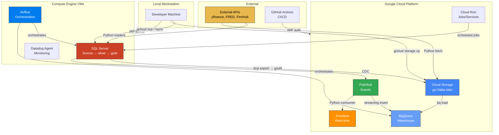
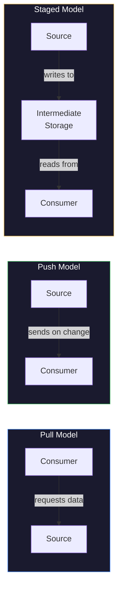
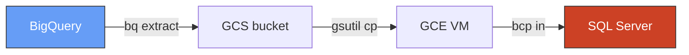
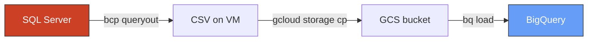
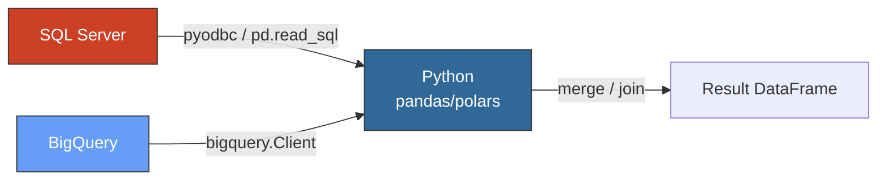

# Data Flow Architecture

> [!quote]+
> "As data accumulates, it begins to have gravity — it attracts services, applications, and more data toward it. Moving compute to data is almost always cheaper than moving data to compute."
>
> — **Dave McCrory** (coined the term "data gravity")

> [!abstract]- Summary
>
> This note defines the end-to-end data movement topology for the stack, then uses transfer matrices, format choices, flow-direction models, and cross-system integration patterns to answer which path, tool, and file shape should be used between any two systems without inventing ad hoc movement logic.
>
> **Topology and flow inventory**
> - Maps the complete stack-wide movement graph across local machines, GCE, SQL Server, GCS, BigQuery, Pub/Sub, Firestore, Airflow, and GitHub Actions.
> - Turns that graph into an explicit inventory so each recurring source-to-destination movement has a named tool, format, cadence, and reference implementation.
>
> **Transfer and format decisions**
> - Compares movement methods such as `gcloud compute scp`, `rsync`, `gcloud storage cp`, `bq load`, `bcp`, and streaming paths based on volume, boundary, and operational fit.
> - Explains when to use JSON, CSV, Parquet, and Avro so format choice stays aligned with landing fidelity, warehouse loading, archive efficiency, and contract evolution.
>
> **Flow models and cross-system joins**
> - Contrasts push, pull, batch, streaming, and micro-batch patterns, then uses cross-database join options to show where data should move versus where computation should move.
> - Treats the SQL Server, BigQuery, and Python handoff choices as architecture decisions rather than one-off scripting tricks.
>
> **Operations and safety**
> - Warnings: moving large data to the wrong compute location, selecting row formats where columnar files are expected, or forcing cross-database joins in place leads to unnecessary cost and latency.
> - Recommendations: keep the flow inventory explicit, prefer compute near the data, use Parquet for bulk analytics movement, and choose batch by default unless latency justifies streaming complexity.

> [!note]- Glossary
>
> **Data flow topology**
> - The mapped set of systems, boundaries, and recurring movement paths through which data travels across a platform.
> - It matters here because the note serves as the central routing reference for deciding how information should move from one part of the stack to another.
>
> > [!info] Architecture-level map
> >
> > A topology is useful because it turns scattered scripts and integrations into one explicit system view that engineers can reason about consistently.
>
> ---
>
> **Data gravity**
> - The tendency for large datasets to attract applications and compute toward the place where the data already resides.
> - It matters here because many movement decisions are really decisions about whether it is cheaper to move bytes or to move computation.
>
> > [!warning] Distance becomes cost
> >
> > As datasets grow, network transfer time, egress charges, and duplicate storage make naive movement patterns much more expensive than they first appear.
>
> ---
>
> **Transfer method**
> - The concrete tool or protocol used to move data between two systems, such as file copy, bulk load, export, or streaming ingestion.
> - It matters here because the note compares transfer methods directly against source, destination, and volume constraints.
>
> > [!info] Path and tool are separate choices
> >
> > The architecture decision is not just where data goes. It also includes how it gets there and what operational guarantees that method provides.
>
> ---
>
> **Parquet**
> - A columnar storage format optimized for analytical reads, compression, and schema-aware interchange.
> - It matters here because the note treats Parquet as the preferred bulk-movement and warehouse-loading format for analytical data.
>
> > [!info] Default analytical format
> >
> > When the workload is scan-heavy analytics rather than raw fidelity or debugging, Parquet is usually the best starting point.
>
> ---
>
> **Push model**
> - A flow pattern where the source initiates transfer and sends data onward when state changes or a trigger occurs.
> - It matters here because push architectures reduce polling but require the sender to own timing and delivery behavior.
>
> > [!warning] Source owns the timing
> >
> > Push can simplify consumers, but it also means outages, retries, and burst control often become source-side responsibilities.
>
> ---
>
> **Pull model**
> - A flow pattern where the consumer requests data from a source on demand or on a schedule.
> - It matters here because many pipeline designs in the stack rely on scheduled extraction rather than source-driven publication.
>
> > [!info] Easier consumer control
> >
> > Pull is often simpler to govern because the receiving system decides cadence, backoff, and retry behavior instead of depending on upstream triggers.
>
> ---
>
> **Micro-batch**
> - A movement or processing model that groups data into short repeated intervals rather than continuous event-by-event handling.
> - It matters here because the note positions micro-batch as a common compromise between batch simplicity and streaming latency.
>
> > [!info] Useful middle ground
> >
> > Many near-real-time requirements are better satisfied by small recurring batches than by full streaming infrastructure.
>
> ---
>
> **Cross-database join**
> - A situation where related data lives in separate engines that cannot query each other directly as one logical relational space.
> - It matters here because the note shows that solving this usually requires deliberate export, load, or dataframe-based handoff patterns.
>
> > [!warning] Avoid wishful querying
> >
> > If two engines do not share an execution plane, trying to pretend they do usually leads to brittle manual workflows or expensive repeated exports.
>
> ---
>
> **Bulk load**
> - A high-throughput data movement pattern that writes large datasets into a target system in efficient large batches or native import operations.
> - It matters here because the note repeatedly prefers bulk paths such as `bcp` and `bq load` over row-by-row transport when volume is high.
>
> > [!info] Throughput-oriented path
> >
> > Bulk load is usually the right choice once reliability and volume matter more than interactive convenience or small ad hoc edits.
>
> ---
>
> **Streaming insert**
> - A low-latency ingestion path where individual events or small batches are written continuously into a downstream service.
> - It matters here because the topology includes CDC and Pub/Sub-driven patterns that trade cost and complexity for freshness.
>
> > [!warning] Latency trades for simplicity
> >
> > Streaming insert paths are valuable when freshness is critical, but they are rarely the cheapest or easiest default for the platform as a whole.
>

## The Complete Data Flow Topology

### Flow inventory — every data movement in the stack

| Flow | Source | Destination | Tool | Format | Frequency | Vault Reference |
|---|---|---|---|---|---|---|
| API ingestion | External APIs | SQL Server bronze | Python (pyodbc) | JSON → SQL INSERT | Daily (Airflow) | [bronze-layer-loading > Strategy 1: Truncate & Reload (Most Loaders)](https://alp78.github.io/elysium/04-Databases/01-SQL-Server/04-Applied-SQL-Server-for-Data-Pipelines/bronze-layer-loading#strategy-1-truncate--reload-most-loaders) |
| OHLCV merge | External APIs | SQL Server bronze | Python (pyodbc) | JSON → SQL MERGE | Daily (Airflow) | [bronze-layer-loading > Strategy 2: Merge (OHLCV Only)](https://alp78.github.io/elysium/04-Databases/01-SQL-Server/04-Applied-SQL-Server-for-Data-Pipelines/bronze-layer-loading#strategy-2-merge-ohlcv-only) |
| Bronze → Silver | SQL Server bronze | SQL Server silver | Python transforms | In-database | Daily (Airflow) | [medallion-architecture > Silver (Cleaned)](https://alp78.github.io/elysium/14-Data-Architecture/Pipeline-Patterns/medallion-architecture#silver-cleaned) |
| Silver → Gold | SQL Server silver | SQL Server gold | Python transforms | In-database | Daily (Airflow) | [medallion-architecture > Gold (Analytics)](https://alp78.github.io/elysium/14-Data-Architecture/Pipeline-Patterns/medallion-architecture#gold-analytics) |
| SQL → BigQuery | SQL Server gold | BigQuery | bcp → GCS → bq load | CSV/Parquet | Daily | See cross-database join below |
| CDC streaming | SQL Server | Pub/Sub → BigQuery | CDC + Python | JSON events | Near-real-time | [sql-server-change-tracking > CDC → Pub/Sub — streaming changes to GCP](https://alp78.github.io/elysium/04-Databases/01-SQL-Server/02-Database-Design-and-Storage/sql-server-change-tracking#cdc--pubsub--streaming-changes-to-gcp) |
| CDC to Firestore | SQL Server | Firestore | CDC + Python | JSON docs | Event-driven | [sql-server-change-tracking > CDC → Firestore — push dimension changes to real-time store](https://alp78.github.io/elysium/04-Databases/01-SQL-Server/02-Database-Design-and-Storage/sql-server-change-tracking#cdc--firestore--push-dimension-changes-to-real-time-store) |
| GCS → BigQuery | Cloud Storage | BigQuery | bq load | Parquet/CSV | On-demand | [data-loading-and-export > bq load --source_format=PARQUET — load Parquet from GCS (recommended)](https://alp78.github.io/elysium/06-GCP/BigQuery/data-loading-and-export#bq-load---sourceformatparquet--load-parquet-from-gcs-recommended) |
| File transfer | Local | GCE VM | gcloud scp / rsync | Any | Ad-hoc | [data-transfer > gcloud compute scp — push and pull files to/from GCE VMs](https://alp78.github.io/elysium/01-Shell/File-Operations/data-transfer#gcloud-compute-scp--push-and-pull-files-tofrom-gce-vms) |
| File upload | Local | GCS | gcloud storage cp | Any | Ad-hoc | [data-transfer > gcloud storage — modern replacement for gsutil (20-94% faster)](https://alp78.github.io/elysium/01-Shell/File-Operations/data-transfer#gcloud-storage--modern-replacement-for-gsutil-20-94-faster) |
| Orchestration | Airflow | All systems | DAG tasks | N/A | Scheduled | [airflow-dag-patterns > Medallion Architecture DAG — Bronze to Silver to Gold](https://alp78.github.io/elysium/12-Orchestration/Airflow/airflow-dag-patterns#medallion-architecture-dag--bronze-to-silver-to-gold) |

---

## Transfer Method Decision Matrix

"I need to move data from X to Y — which tool?"

| Source | Destination | Volume | Best Tool | Why | Reference |
|---|---|---|---|---|---|
| Local file | GCE VM | < 1 GB | `gcloud compute scp` | Simple, IAP-integrated | [data-transfer > gcloud compute scp — push and pull files to/from GCE VMs](https://alp78.github.io/elysium/01-Shell/File-Operations/data-transfer#gcloud-compute-scp--push-and-pull-files-tofrom-gce-vms) |
| Local file | GCE VM | > 1 GB | `rsync -avzP` through IAP | Resume, delta, compression | [data-transfer > rsync through IAP tunnel — transferring to GCE VMs with no public IP](https://alp78.github.io/elysium/01-Shell/File-Operations/data-transfer#rsync-through-iap-tunnel--transferring-to-gce-vms-with-no-public-ip) |
| Local file | GCS | Any | `gcloud storage cp` | Parallel composite upload, resumable | [data-transfer > gcloud storage — modern replacement for gsutil (20-94% faster)](https://alp78.github.io/elysium/01-Shell/File-Operations/data-transfer#gcloud-storage--modern-replacement-for-gsutil-20-94-faster) |
| GCS | BigQuery | Any | `bq load` | Native, no intermediate step | [data-loading-and-export > bq load --source_format=PARQUET — load Parquet from GCS (recommended)](https://alp78.github.io/elysium/06-GCP/BigQuery/data-loading-and-export#bq-load---sourceformatparquet--load-parquet-from-gcs-recommended) |
| BigQuery | GCS | Any | `bq extract` | Native export with compression | [data-loading-and-export > Exporting BigQuery Data to GCS](https://alp78.github.io/elysium/06-GCP/BigQuery/data-loading-and-export#exporting-bigquery-data-to-gcs) |
| JSON/CSV | SQL Server | < 100K rows | pyodbc `fast_executemany` | Transactional, Python-native | [sql-server-loading-patterns > cursor.fast_executemany = True — batch mode activation](https://alp78.github.io/elysium/04-Databases/01-SQL-Server/04-Applied-SQL-Server-for-Data-Pipelines/sql-server-loading-patterns#cursorfastexecutemany--true--batch-mode-activation) |
| JSON/CSV | SQL Server | > 1M rows | `bcp` bulk load | Fastest path, minimal logging | [sql-server-loading-patterns > bcp BULK LOAD — command-line syntax](https://alp78.github.io/elysium/04-Databases/01-SQL-Server/04-Applied-SQL-Server-for-Data-Pipelines/sql-server-loading-patterns#bcp-bulk-load--command-line-syntax) |
| SQL Server | CSV file | Any | `bcp queryout` | Maximum throughput | [data-transfer > bcp queryout — export a query result to CSV](https://alp78.github.io/elysium/01-Shell/File-Operations/data-transfer#bcp-queryout--export-a-query-result-to-csv) |
| GCS ↔ GCS | Same region | Any | `gsutil cp gs:// gs://` | Server-side, zero egress | [data-transfer > gsutil cp gs:// gs:// — server-side copy between GCS buckets](https://alp78.github.io/elysium/01-Shell/File-Operations/data-transfer#gsutil-cp-gs-gs--server-side-copy-between-gcs-buckets) |
| Directory sync | Local ↔ GCS | Ongoing | `gsutil rsync` / `gcloud storage rsync` | Delta sync, delete support | [data-transfer > gsutil rsync — delta sync to Cloud Storage](https://alp78.github.io/elysium/01-Shell/File-Operations/data-transfer#gsutil-rsync--delta-sync-to-cloud-storage) |
| VM ↔ VM | Same VPC | Any | `rsync` over private IP | No IAP needed, direct path | [data-transfer > rsync -avzP over SSH — local to remote and back](https://alp78.github.io/elysium/01-Shell/File-Operations/data-transfer#rsync--avzp-over-ssh--local-to-remote-and-back) |
| VM ↔ VM | Cross-VPC | Any | `rsync` through IAP | IAP for secure cross-VPC | [iap-tunneling](https://alp78.github.io/elysium/01-Shell/Networking/iap-tunneling) |

---

## Format Selection by Scenario

When to use CSV vs JSON vs Parquet vs Avro. For the deep codec comparison with benchmarks, see [serialization-formats](https://alp78.github.io/elysium/14-Data-Architecture/Pipeline-Patterns/serialization-formats).

| Scenario | Format | Compression | Why |
|---|---|---|---|
| API response landing (bronze) | JSON | None (small files) | Preserves source structure exactly |
| Pipeline intermediate files | Parquet | snappy (default) | Columnar, fast reads, schema embedded |
| BigQuery loading from GCS | Parquet | snappy | Native BQ support, schema auto-detect |
| SQL Server bcp export | CSV | gzip or zstd | bcp native format, universal |
| Long-term archive in GCS | Parquet | zstd -19 | Maximum compression for cold storage |
| Streaming / messaging (Pub/Sub) | JSON | None | Human-readable, schema-flexible |
| Cross-system data contract | Avro | deflate | Schema evolution, compact binary |

> [!tip] Format selection rule of thumb
>
> - **Landing zone (bronze):** Keep the source format (JSON from APIs, CSV from bcp)
> - **Processing (silver/gold):** Parquet with snappy — columnar reads, schema enforcement
> - **Warehouse (BigQuery):** Parquet for bulk loads, JSON for streaming inserts
> - **Messaging (Pub/Sub):** JSON — schema validation at the consumer, not the broker
>
> For compression algorithm selection (gzip vs zstd vs snappy), see
> [compression > Compression strategy matrix — choosing the right algorithm for data pipelines](https://alp78.github.io/elysium/01-Shell/File-Operations/compression#compression-strategy-matrix--choosing-the-right-algorithm-for-data-pipelines).

---

## Push vs Pull Architecture

Three models for data flow direction. Most production stacks use all three.

| Model | How It Works | Stack Example | Best For |
|---|---|---|---|
| **Pull** | Consumer requests data when needed | BigQuery query, `SELECT` from SQL Server, API call | Low coupling, consumer controls timing |
| **Push** | Producer sends data when it changes | CDC → Pub/Sub, Firestore trigger, webhook | Low latency, event-driven reactions |
| **Staged** | Producer writes to storage, consumer reads at own pace | API → JSON → GCS → `bq load` | Decoupled, fault-tolerant, replayable |

> [!info] When to choose each model
>
> - **Pull** when the consumer needs data on-demand and can tolerate latency (dashboards,
>   ad-hoc queries, backfills)
> - **Push** when changes must propagate within seconds (dimension updates to Firestore,
>   alerting on anomalies)
> - **Staged** when source and destination have different availability, speed, or schema
>   requirements (the default for batch pipelines — producer and consumer never need to be
>   online simultaneously)

---

## Batch vs Streaming vs Micro-Batch

For the full streaming architecture theory (Lambda, Kappa, event sourcing, windowing), see [streaming-architecture](https://alp78.github.io/elysium/14-Data-Architecture/Architectures/streaming-architecture).

| Pattern | Latency | Tool in Stack | Use Case |
|---|---|---|---|
| **Batch** (scheduled) | Hours | Airflow DAG → Python → SQL Server / BigQuery | Daily pipeline, backfills, full refresh |
| **Micro-batch** | Minutes | Cloud Scheduler → Cloud Run Job | 5-minute price snapshots (pulse) |
| **Streaming** | Seconds | CDC → Pub/Sub → BigQuery streaming insert | Dimension change propagation |

```mermaid
graph TD
    subgraph Batch["Batch (Daily)"]
        B1[Airflow Scheduler] -->|triggers| B2[Python Loaders]
        B2 -->|INSERT/MERGE| B3[SQL Server]
        B3 -->|bcp export| B4[GCS]
        B4 -->|bq load| B5[BigQuery]
    end

    subgraph Micro["Micro-Batch (5 min)"]
        M1[Cloud Scheduler] -->|triggers| M2[Cloud Run Job]
        M2 -->|fetch + INSERT| M3[SQL Server pulse]
    end

    subgraph Stream["Streaming (seconds)"]
        ST1[SQL Server CDC] -->|change events| ST2[Pub/Sub]
        ST2 -->|streaming insert| ST3[BigQuery]
        ST2 -->|consumer| ST4[Firestore]
    end

    style Batch fill:#1a1a2e,stroke:#4285f4,color:#fff
    style Micro fill:#1a1a2e,stroke:#e8b84d,color:#fff
    style Stream fill:#1a1a2e,stroke:#34a853,color:#fff
```

> [!warning] Choosing the right pattern
>
> - Batch is correct for 90% of data engineering workloads. Don't add streaming
>   complexity unless you have a latency requirement under 5 minutes.
> - Micro-batch (Cloud Run on a schedule) is the sweet spot for "near-real-time"
>   without the operational cost of streaming infrastructure.
> - Streaming is justified only when: (a) downstream consumers need sub-minute data,
>   AND (b) the source supports change capture.
>
> See [streaming-architecture > Streaming vs Batch Decision Matrix](https://alp78.github.io/elysium/14-Data-Architecture/Architectures/streaming-architecture#streaming-vs-batch-decision-matrix) for the full
> decision framework.

> [!success] Default to Batch, Escalate Deliberately
>
> Start every new pipeline as a daily Airflow DAG. If stakeholders request faster data, move to micro-batch (Cloud Scheduler → Cloud Run) — this delivers near-real-time refresh with no streaming infrastructure. Only introduce CDC + Pub/Sub streaming when a documented latency SLA of under 5 minutes cannot be met by micro-batch and the source system supports change capture.

---

## The Cross-Database Join Problem

"I need data from SQL Server AND BigQuery in the same query." There is no direct connector between them. Three options:

### Option A: Export BigQuery → load into SQL Server (small datasets)

Best for < 1M rows. Use when SQL Server has the complex logic and BigQuery has a small reference table.

- `bq extract` to GCS as CSV: [data-loading-and-export > Exporting BigQuery Data to GCS](https://alp78.github.io/elysium/06-GCP/BigQuery/data-loading-and-export#exporting-bigquery-data-to-gcs)
- `gsutil cp` / `gcloud storage cp` to VM: [gcs-object-operations > Copying Files with gcloud storage cp](https://alp78.github.io/elysium/06-GCP/Storage/gcs-object-operations#copying-files-with-gcloud-storage-cp)
- `bcp in` to SQL Server: [sql-server-loading-patterns > bcp BULK LOAD — command-line syntax](https://alp78.github.io/elysium/04-Databases/01-SQL-Server/04-Applied-SQL-Server-for-Data-Pipelines/sql-server-loading-patterns#bcp-bulk-load--command-line-syntax)

### Option B: Export SQL Server → load into BigQuery (analytical queries)

Best for analytical queries over large datasets. Use when BigQuery is the analytical engine and SQL Server has the source data.

- `bcp queryout` from SQL Server: [data-transfer > bcp queryout — export a query result to CSV](https://alp78.github.io/elysium/01-Shell/File-Operations/data-transfer#bcp-queryout--export-a-query-result-to-csv)
- Upload to GCS: [data-transfer > gcloud storage — modern replacement for gsutil (20-94% faster)](https://alp78.github.io/elysium/01-Shell/File-Operations/data-transfer#gcloud-storage--modern-replacement-for-gsutil-20-94-faster)
- `bq load` into BigQuery: [data-loading-and-export > bq load --source_format=CSV — load CSV from GCS](https://alp78.github.io/elysium/06-GCP/BigQuery/data-loading-and-export#bq-load---sourceformatcsv--load-csv-from-gcs)

### Option C: Pull both into Python DataFrames (ad-hoc analysis)

Best for ad-hoc analysis and small-to-medium joins. Use when both datasets fit in memory.

- SQL Server via pyodbc: [sql-server-loading-patterns > cursor.fast_executemany = True — batch mode activation](https://alp78.github.io/elysium/04-Databases/01-SQL-Server/04-Applied-SQL-Server-for-Data-Pipelines/sql-server-loading-patterns#cursorfastexecutemany--true--batch-mode-activation)
- BigQuery via Python client: [bq-advanced](https://alp78.github.io/elysium/05-DB-Queries/BigQuery/bq-advanced)

> [!tip] Cross-Database Join Decision
>
> Move the **smaller, more static** dataset to where the **larger, more dynamic** dataset
> lives. If BigQuery has 10B rows and SQL Server has 1K dimension rows, export the
> dimension to BigQuery — never pull 10B rows to SQL Server. If both datasets are small,
> Option C (Python) is the fastest path to an answer.

---

## Data Flow Anti-Patterns

> [!danger] Data Flow Anti-Patterns
>
> | Anti-Pattern | Problem | Fix |
> |---|---|---|
> | **Laptop as ETL server** | Doesn't scale, single point of failure, network bottleneck | Run pipelines on GCE VMs or Cloud Run |
> | **Direct SQL Server ↔ BigQuery** | No connector exists — people waste hours looking | Use the staged pattern: bcp → GCS → bq load |
> | **Uncompressed network transfers** | Wastes bandwidth, 3-10x slower | Always compress: `rsync -z`, `gzip`, `zstd` |
> | **No intermediate storage** | If destination fails, restart from source | Stage in GCS first — replay without re-fetching |
> | **Mixed push and pull for same flow** | CDC to Pub/Sub AND a batch pull = duplicates | Choose one: event-driven OR batch, not both |
> | **No source-destination validation** | Row count mismatches go unnoticed | Compare `COUNT(*)` after every load — see [idempotent-pipeline-design](https://alp78.github.io/elysium/14-Data-Architecture/Pipeline-Patterns/idempotent-pipeline-design) |
> | **Loading directly to production** | No validation, no rollback | Always load to staging first — see [sql-server-loading-patterns > Loading Directly to Production — no staging, no validation](https://alp78.github.io/elysium/04-Databases/01-SQL-Server/04-Applied-SQL-Server-for-Data-Pipelines/sql-server-loading-patterns#loading-directly-to-production--no-staging-no-validation) |

> [!success] Safe Data Flow Patterns
>
> Run all pipeline jobs on GCE VMs or Cloud Run — never on a local machine. Always stage data in GCS before loading to BigQuery (`bcp queryout` → `gcloud storage cp` → `bq load`). Compress all network transfers with `rsync -z` or `zstd`. Always compare `COUNT(*)` source vs destination after every load. Use a single flow model per dataset (either CDC streaming or batch — not both) and load to a staging table first, then swap or merge into production.

---

## Related

- [data-transfer](https://alp78.github.io/elysium/01-Shell/File-Operations/data-transfer) — CLI tools for every transfer scenario (rsync, scp, bcp, gsutil)
- [compression](https://alp78.github.io/elysium/01-Shell/File-Operations/compression) — Algorithm selection for pipeline data
- [serialization-formats](https://alp78.github.io/elysium/14-Data-Architecture/Pipeline-Patterns/serialization-formats) — Format comparison with benchmarks
- [medallion-architecture](https://alp78.github.io/elysium/14-Data-Architecture/Pipeline-Patterns/medallion-architecture) — Bronze → Silver → Gold layer design
- [idempotent-pipeline-design](https://alp78.github.io/elysium/14-Data-Architecture/Pipeline-Patterns/idempotent-pipeline-design) — Load patterns that are safe to re-run
- [streaming-architecture](https://alp78.github.io/elysium/14-Data-Architecture/Architectures/streaming-architecture) — Full streaming theory (Lambda, Kappa, CDC, windowing)
- [sql-server-loading-patterns](https://alp78.github.io/elysium/04-Databases/01-SQL-Server/04-Applied-SQL-Server-for-Data-Pipelines/sql-server-loading-patterns) — SQL Server bulk load methods and benchmarks
- [data-loading-and-export](https://alp78.github.io/elysium/06-GCP/BigQuery/data-loading-and-export) — BigQuery load and export operations
- [gcs-object-operations](https://alp78.github.io/elysium/06-GCP/Storage/gcs-object-operations) — GCS file operations and transfer optimization
- [airflow-dag-patterns](https://alp78.github.io/elysium/12-Orchestration/Airflow/airflow-dag-patterns) — Orchestration patterns for all flows above
