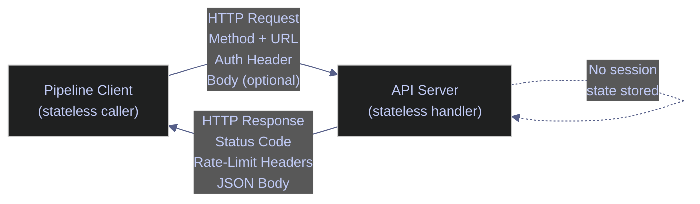
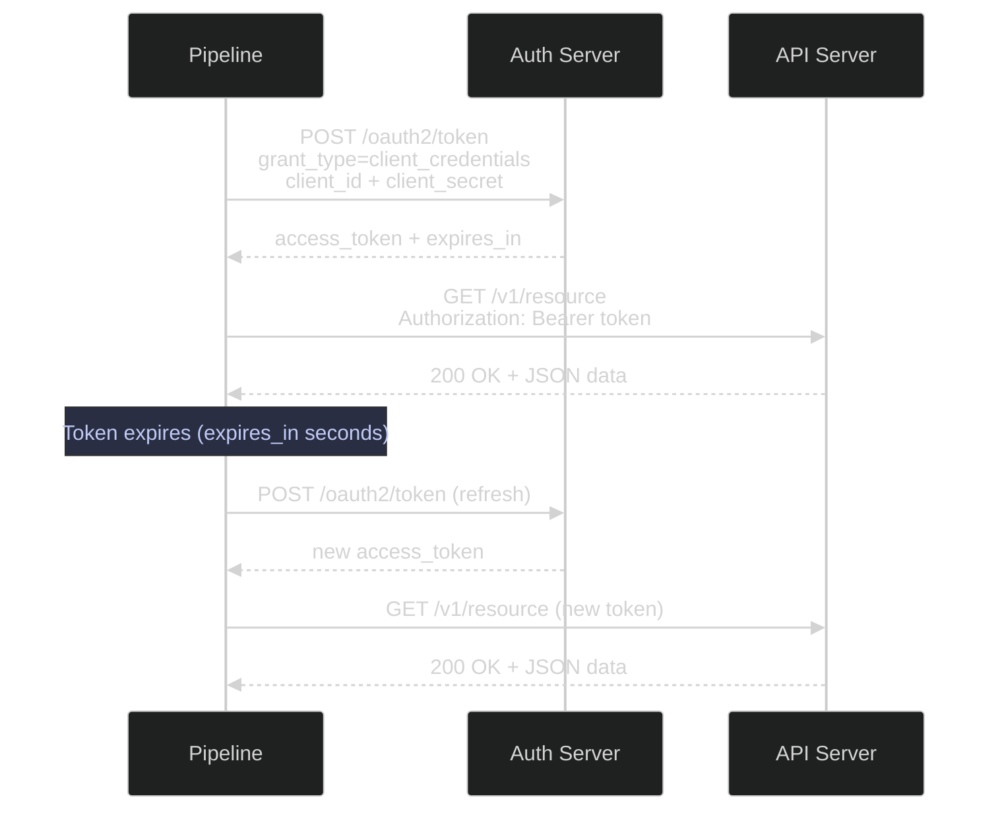
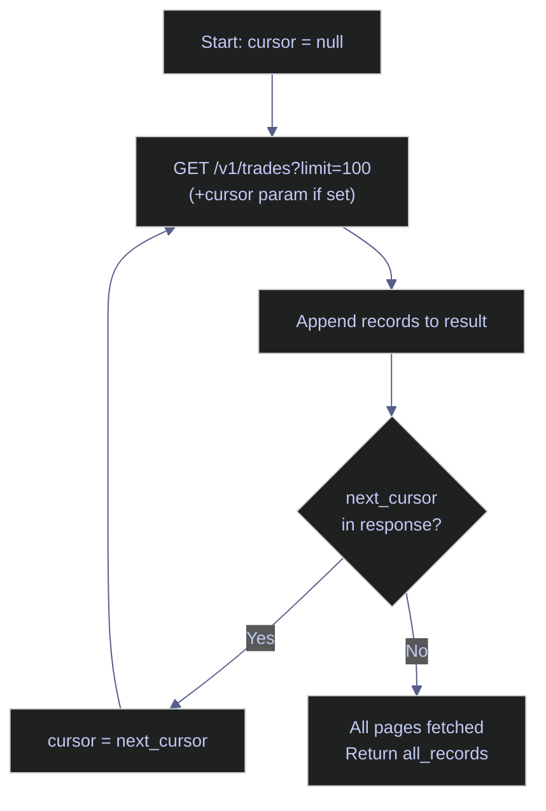
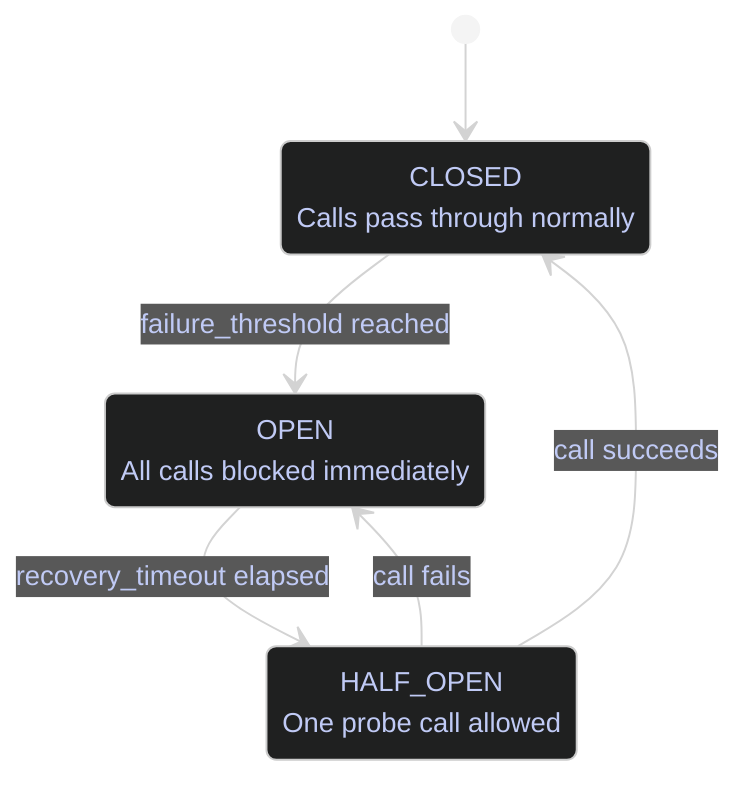
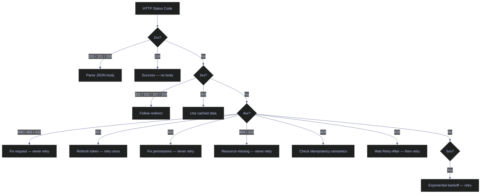

# REST API Design and Consumption

> [!quote]
> "A truly RESTful API looks like hypertext. Every addressable unit of information carries an address."
>
> — **Roy Fielding**, *Architectural Styles and the Design of Network-based Software Architectures* (2000)

> [!abstract]- Summary
>
> This note defines REST API work for data engineers in both directions, covering how to consume external HTTP APIs safely and how to build internal data-serving APIs with predictable contracts, authentication, retries, pagination, and documentation.
>
> **REST fundamentals and HTTP behavior**
> - Explains REST structure, HTTP methods, URL anatomy, request and response metadata, and idempotency so pipeline behavior stays aligned with the semantics of the underlying protocol.
> - Treats status codes and method safety as operational controls that directly shape retry logic and failure handling.
>
> **Authentication and production API consumption**
> - Covers API keys, OAuth2 bearer tokens, GCP service-account tokens, basic auth, and mTLS, then moves into pagination, rate limiting, async consumption with `httpx`, and pipeline-oriented error handling.
> - Connects request headers, backoff, and streaming-like consumption patterns to the realities of large external data pulls.
>
> **Building and documenting data APIs**
> - Explains when data engineers should build APIs with FastAPI, how to structure endpoints and Pydantic models, and how OpenAPI, Swagger, and `curl` support testing and consumer onboarding.
> - Adds design practices for versioning, filtering, bulk operations, compression, ETags, and health checks so served data stays durable as a contract.
>
> **Operations and safety**
> - Warnings: POST is not idempotent by default, ignoring headers hides rate-limit and retry metadata, and weak auth or logging practices can leak secrets or corrupt state.
> - Recommendations: retry only with method-aware semantics, use idempotency keys for unsafe creates, document contracts with OpenAPI, and keep authentication plus pagination behavior explicit in code and docs.

> [!note]- Glossary
>
> **REST**
> - A stateless architectural style for HTTP-based systems that exposes resources through a uniform interface.
> - It matters here because the note treats REST as the default external API contract most data pipelines must consume or produce.
>
> > [!info] Ubiquitous and operationally visible
> >
> > REST remains common partly because every tool can speak HTTP, inspect headers, and debug calls with minimal specialized infrastructure.
>
> ---
>
> **Statelessness**
> - The property that each request contains all the information needed for the server to process it without relying on stored client session state.
> - It matters here because stateless APIs are much easier to retry, parallelize, and scale in pipeline contexts.
>
> > [!info] Retry-friendly by design
> >
> > Statelessness is valuable operationally because a failed request can often be retried independently without reconstructing hidden server-side conversation state.
>
> ---
>
> **Idempotency**
> - The property that making the same request multiple times yields the same final effect as making it once.
> - It matters here because safe pipeline retry behavior depends on understanding which HTTP operations are naturally idempotent and which need extra safeguards.
>
> > [!warning] POST needs help
> >
> > Create operations usually are not idempotent unless the client and server cooperate through stable identifiers or explicit idempotency keys.
>
> ---
>
> **Rate limiting**
> - The server-side control that restricts how many requests a client may make in a given time window.
> - It matters here because large data pulls often fail operationally through quota exhaustion rather than through protocol misuse.
>
> > [!warning] Headers carry the truth
> >
> > Good clients watch remaining quota and reset timing in headers. Ignoring them is a common reason pipelines hit avoidable 429s.
>
> ---
>
> **Pagination**
> - The splitting of a large result set into multiple requests using page numbers, offsets, cursors, or tokens.
> - It matters here because pipeline consumers usually need complete extraction, not just one visible page of records.
>
> > [!info] Extraction loop contract
> >
> > Pagination is not just a UI convenience. It defines how a pipeline walks a dataset without missing or duplicating records.
>
> ---
>
> **API key**
> - A static credential used to identify or authorize a client for API access.
> - It matters here because many vendor APIs data engineers consume still rely on API keys as the primary auth mechanism.
>
> > [!warning] Simple but easy to leak
> >
> > Keys often end up in logs, URLs, or copied scripts unless teams enforce header-based usage and secret management consistently.
>
> ---
>
> **Bearer token / OAuth2**
> - A time-bounded access token, often obtained through an OAuth2 flow, that authorizes API requests without exposing long-lived credentials directly.
> - It matters here because modern internal and external APIs increasingly rely on token-based authentication rather than static secrets.
>
> > [!info] Stronger lifecycle control
> >
> > Tokens are operationally useful because they can expire, be scoped, and be refreshed without rotating every client credential by hand.
>
> ---
>
> **OpenAPI**
> - A machine-readable specification format that describes HTTP endpoints, payloads, parameters, auth, and responses.
> - It matters here because documentation and client generation become much more reliable when the API contract is formalized.
>
> > [!info] Contract plus tooling surface
> >
> > OpenAPI is valuable because it improves both human understanding and automation, from Swagger UIs to generated clients and test scaffolds.
>
> ---
>
> **ETag**
> - A response identifier used for conditional requests so clients can detect whether a resource changed before re-downloading or overwriting it.
> - It matters here because conditional fetch and optimistic update patterns can save bandwidth and prevent stale writes in data-serving APIs.
>
> > [!info] Cheap change detection
> >
> > ETags are most useful when consumers poll or cache frequently and need a lightweight way to ask whether the resource is still current.
>
> ---
>
> **mTLS**
> - Mutual TLS authentication, where both client and server present certificates to verify each other.
> - It matters here because high-trust internal or regulated data APIs sometimes need stronger peer authentication than header-based tokens alone.
>
> > [!warning] Strong but operationally heavier
> >
> > mTLS improves trust at the transport layer, but certificate issuance, rotation, and troubleshooting add real operational complexity.
>

> [!example] REST Interface Fit
>
> > [!success] Broad HTTP Adoption
> >
> > - Use REST when you need to consume vendor or SaaS APIs, or expose processed data and platform state through internal HTTP interfaces that many consumers can adopt quickly.
>
> > [!failure] Low-Latency or Streaming Mismatch
> >
> > - Do not default to REST for ultra-low-latency internal hops, streaming-heavy binary pipelines, or cases where gRPC or eventing protocols fit the workload better.

## REST Fundamentals for Data Engineers

REST defines a set of structural constraints for HTTP-based systems. This section covers the core properties — HTTP methods, URL anatomy, request and response structure, and idempotency — that shape how data pipelines interact with APIs.

### What REST Is

REST (Representational State Transfer) is a stateless client-server architectural style built on top of HTTP. Every request from a client contains all information the server needs to fulfill it — no session state lives on the server between calls. This property is what makes REST pipelines straightforward to scale horizontally and retry safely. For Python implementation of REST clients and servers, see [15_py_webapis](https://alp78.github.io/elysium/02-Programming-Languages/Python/15_py_webapis); for C#, see [15_cs_webapis](https://alp78.github.io/elysium/02-Programming-Languages/CSharp/15_cs_webapis).

Key constraints of REST:
- **Stateless** — server holds no client context between requests
- **Uniform interface** — resources identified by URLs, manipulated through representations (JSON)
- **Layered system** — client doesn't know whether it's talking to origin or a cache/proxy
- **Cacheable** — responses must declare whether they can be cached

> [!info] Why statelessness matters for pipelines
> Because each request is self-contained, you can restart a failed pipeline step mid-run without needing to re-establish session state. Each API call either succeeds or fails atomically, making retry logic clean.



*Figure: REST request-response lifecycle — every request is self-contained; the server stores no client state between calls.*

### HTTP Methods Mapped to Data Operations

REST maps HTTP verbs to data operations. The safety and idempotency properties determine how you design retry logic — only idempotent methods can be retried unconditionally.

| Method   | Operation | SQL Equivalent | Body? | Safe? | Idempotent? |
|----------|-----------|----------------|-------|-------|-------------|
| `GET`    | Read      | `SELECT`       | No    | Yes   | Yes         |
| `POST`   | Create    | `INSERT`       | Yes   | No    | No          |
| `PUT`    | Replace   | `UPDATE` (full)| Yes   | No    | Yes         |
| `PATCH`  | Update    | `UPDATE` (partial)| Yes | No   | No*         |
| `DELETE` | Remove    | `DELETE`       | Rarely| No   | Yes         |

*`PATCH` idempotency depends on implementation. Well-designed `PATCH` endpoints are idempotent.

**Safe** means the method does not change server state. **Idempotent** means calling it N times has the same effect as calling it once. This distinction matters directly for retry logic.

> [!warning] POST is not idempotent
> If a `POST /v1/orders` call times out before you receive the response, you don't know if the order was created. Naively retrying can create duplicate records. Use idempotency keys (`Idempotency-Key: <uuid>`) to let the server deduplicate — this pattern is standard in payment APIs and is worth implementing in your own data APIs.

> [!success] Idempotency Key Pattern
> Generate a stable UUID per logical operation (e.g., derived from `f"{pipeline_run_id}:{entity_id}"` hashed to UUID5) and pass it as `Idempotency-Key` on every POST. The server stores the key and returns the original response on duplicate requests. On your pipeline side, always retry POST calls with the same key — the operation becomes safely idempotent.

### URL Structure Anatomy

A REST URL encodes both resource identity and request parameters. Consistent URL design makes APIs predictable and their access logs readable.

```
https://api.example.com/v2/indices/{index_id}/constituents?date=2026-03-22&format=json
|____| |_____________| |_| |______________________| |__________________________________|
scheme     host         ver       path (resource)           query parameters
```

Good URL design principles:
- Use nouns, not verbs: `/prices` not `/getPrices`
- Hierarchical resources: `/indices/{id}/constituents` expresses containment
- Plural resource names: `/indices`, `/constituents`, `/positions`
- Version in the path: `/v2/` — explicit, cacheable, visible in logs
- Query params for filtering, sorting, pagination — not resource identity

### Request Anatomy

Every HTTP request has four parts:

```
METHOD /path?query HTTP/1.1
Host: api.example.com
Header-Name: header-value
Header-Name-2: header-value-2

request body (JSON, form data, etc.)
```

For data engineering work, the most important headers to send:
- `Authorization: Bearer <token>` or `X-API-Key: <key>`
- `Content-Type: application/json` — for POST/PUT/PATCH with JSON body
- `Accept: application/json` — declare you want JSON back
- `Accept-Encoding: gzip, deflate` — always enable compression for large payloads
- `User-Agent: my-pipeline/1.0` — many APIs require this, helps vendor support debug your calls

### Response Anatomy

Every HTTP response carries metadata in headers alongside the body. Rate limit state, request IDs, and retry timing arrive in headers — not the body. Pipelines that only read the body miss critical operational information.

```
HTTP/1.1 200 OK
Content-Type: application/json
X-RateLimit-Limit: 1000
X-RateLimit-Remaining: 847
X-RateLimit-Reset: 1742680800
X-Request-Id: 7f3a9b2c-1d4e-4f8a-b3c2-9e1f7a6d8b5e
Retry-After: 60

{
  "data": [...],
  "meta": {"page": 1, "total": 5000, "per_page": 100}
}
```

The response headers carry critical pipeline metadata: rate limit state, request tracing IDs, and retry timing. Ignoring these headers is why pipelines hit 429s.

### Idempotency and Pipeline Retries

Different HTTP methods carry different idempotency guarantees. This table summarizes which operations are safe to retry unconditionally and which require special handling to avoid duplicate effects.

```
Operation  | Retry safe? | Notes
-----------|-------------|------------------------------------------
GET        | Yes         | Read-only, retry freely
PUT        | Yes         | Replace is idempotent by definition
DELETE     | Yes         | Second delete returns 404, treat as success
POST       | No*         | Use Idempotency-Key header to make safe
PATCH      | Depends     | Absolute updates (set price=100) are safe;
           |             | relative updates (increment quantity by 1) are not
```

For POST operations in critical pipelines, always pass an idempotency key:

```python
import uuid

response = session.post(
    "https://api.example.com/v1/trades",
    headers={
        "Authorization": f"Bearer {token}",
        "Idempotency-Key": str(uuid.uuid4()),
        "Content-Type": "application/json",
    },
    json={"symbol": "AAPL", "quantity": 100, "side": "buy"},
    timeout=30,
)
```

---

## HTTP Status Codes Every Data Engineer Must Know

HTTP status codes are grouped by class. Each class signals a different category of outcome and maps to a specific pipeline action — retry, abort, refresh credentials, or process normally.

### 2xx — Success

Success codes confirm the request completed. The specific code tells you whether to expect a response body and what the pipeline should do next.

| Code | Name              | Meaning                                      | Pipeline action       |
|------|-------------------|----------------------------------------------|-----------------------|
| 200  | OK                | Request succeeded, body contains result      | Process response      |
| 201  | Created           | Resource created (POST response)             | Extract Location header for new resource URL |
| 202  | Accepted          | Request accepted, processing async           | Poll status endpoint or check webhook |
| 204  | No Content        | Success, no body (DELETE, some PATCHes)      | Treat as success, don't try to parse JSON |
| 206  | Partial Content   | Range request fulfilled                      | Combine chunks        |

> [!tip] 204 No Content gotcha
> `response.raise_for_status()` won't raise on 204, but `response.json()` will throw `JSONDecodeError`. Always check `response.status_code != 204` before parsing.

### 3xx — Redirection

Redirect codes indicate the resource has moved. Most HTTP clients follow them automatically; production pipelines should log the final destination URL to detect unexpected endpoint migrations.

| Code | Name              | Meaning                                      | Pipeline action       |
|------|-------------------|----------------------------------------------|-----------------------|
| 301  | Moved Permanently | Resource at new URL forever                  | Update your config, follow once |
| 302  | Found             | Temporary redirect                           | `requests` follows automatically; verify final URL |
| 304  | Not Modified      | Cached response still valid (ETag match)     | Use cached data       |
| 307  | Temporary Redirect| Redirect, preserve method                   | Follow automatically  |
| 308  | Permanent Redirect| Redirect, preserve method, permanent        | Update your config    |

> [!warning] Redirect loops
> `requests` follows redirects by default (up to 30). Disable with `allow_redirects=False` when debugging or when redirects indicate a misconfiguration. Log the final URL: `response.url` gives you where you actually landed.

> [!success] Safe Redirect Handling
> In production pipelines, log `response.url` after every request to confirm you landed on the expected endpoint. Use `allow_redirects=True` (the default) but cap with `max_redirects=5` via the session adapter. If the final URL differs from the configured URL by more than a path prefix (e.g., a full domain change), raise an alert — it may indicate a misconfigured base URL or a vendor domain migration.

### 4xx — Client Errors

Client errors indicate a problem with the request itself. Most 4xx errors are permanent — retrying the same request will produce the same failure. Fix the request before retrying.

| Code | Name                  | Meaning                                      | Pipeline action               |
|------|-----------------------|----------------------------------------------|-------------------------------|
| 400  | Bad Request           | Malformed request, invalid params            | Abort, fix request — don't retry |
| 401  | Unauthorized          | Auth missing or expired                      | Refresh token, retry once — then alert |
| 403  | Forbidden             | Authenticated but not authorized             | Abort — permission issue, not transient |
| 404  | Not Found             | Resource doesn't exist                       | Abort — check your ID/URL     |
| 405  | Method Not Allowed    | Wrong HTTP verb for endpoint                 | Abort, fix method             |
| 409  | Conflict              | State conflict (duplicate, version mismatch) | Depends — check idempotency   |
| 410  | Gone                  | Resource permanently removed                 | Abort, clean up references    |
| 422  | Unprocessable Entity  | Valid syntax, invalid semantics              | Abort, fix payload            |
| 429  | Too Many Requests     | Rate limit exceeded                          | Wait `Retry-After` seconds, retry |

> [!danger] 401 vs 403 distinction
> **401** means "I don't know who you are" — your token is missing, expired, or malformed. Refresh and retry.
> **403** means "I know who you are, and you can't do this" — your account doesn't have permission. Retrying will never help. Alert and fix the IAM/API plan.

> [!success] Correct Response Per Status
> On 401: call your token refresh logic, update the session header, and retry the request once. If the retry also returns 401, stop and alert — the credentials themselves are broken. On 403: do not retry. Log the full request URL and the authenticated identity, then raise a `PermissionError` that surfaces in your pipeline monitoring. Fix the IAM binding or API plan before the next run.

### 5xx — Server Errors

Server errors indicate a transient problem on the API side. All 5xx codes are safe to retry with exponential backoff — the server is effectively telling you to try again later.

| Code | Name                  | Meaning                                      | Pipeline action               |
|------|-----------------------|----------------------------------------------|-------------------------------|
| 500  | Internal Server Error | Unhandled exception on server                | Retry with backoff (often transient) |
| 502  | Bad Gateway           | Upstream failure (load balancer → app)       | Retry with backoff            |
| 503  | Service Unavailable   | Server overloaded or in maintenance          | Retry with backoff, check status page |
| 504  | Gateway Timeout       | Upstream timeout                             | Retry with backoff, consider longer timeout |

> [!info] Retry matrix summary
> - **Always retry**: 429, 500, 502, 503, 504
> - **Retry once after refresh**: 401
> - **Never retry**: 400, 403, 404, 405, 410, 422
> - **Conditional**: 409 (depends on conflict semantics)

---

## Authentication Patterns

APIs authenticate clients using tokens, keys, or certificates. This section covers the four patterns common in data engineering: static API keys, OAuth2 bearer tokens, GCP service account credentials, and mTLS client certificates.

### API Key Authentication

The simplest pattern. A static secret issued by the API provider, sent on every request. Common with market data vendors (Bloomberg, Refinitiv, Alpha Vantage, Quandl, Polygon.io).

Two delivery mechanisms:

#### Header-based (preferred)

Pass the API key in an `Authorization` or `X-API-Key` header — headers are not captured in URL access logs, so the key is not exposed in server log files.

```python
response = session.get(
    "https://api.polygon.io/v2/aggs/ticker/AAPL/range/1/day/2026-01-01/2026-03-22",
    headers={"Authorization": f"Bearer {api_key}"},  # Polygon uses Bearer for API key
)
```

#### Query parameter (avoid if possible — keys appear in logs)

Some APIs require the key as a query parameter. Avoid this when you have a choice — the key appears in server access logs, browser history, and any intermediary cache.

```python
response = session.get(
    "https://api.example.com/v1/prices",
    params={"api_key": api_key, "symbol": "AAPL"},
)
```

```bash
# curl with API key in header
curl -H "X-API-Key: $API_KEY" "https://api.example.com/v1/prices?symbol=AAPL"

# curl with Authorization header
curl -H "Authorization: Bearer $API_KEY" "https://api.example.com/v1/prices?symbol=AAPL"
```

For more curl recipes and CLI-based API interaction patterns, see [http-requests-and-apis](https://alp78.github.io/elysium/01-Shell/Networking/http-requests-and-apis).

> [!warning] Never log query params containing secrets
> Many logging frameworks capture full URLs. If the API key is a query parameter, it ends up in your logs. Use header-based auth and scrub Authorization headers from logs.

> [!success] Safe Logging Pattern
> Pass secrets exclusively via headers (`Authorization`, `X-API-Key`), never as query parameters. Configure your logging middleware to redact the `Authorization` header value: replace the token value with `[REDACTED]` before writing to logs. The `structlog` processor pipeline or a `requests` event hook can apply this scrubbing automatically on every request, so no individual caller needs to remember.

### Bearer Token (OAuth2)

The standard for modern enterprise APIs: GCP, Azure, AWS SigV4 (variant), Salesforce, most financial data platforms.

#### OAuth2 Client Credentials Flow (machine-to-machine)

The client credentials grant is the correct OAuth2 flow for server-to-server authentication. No user is involved — the pipeline authenticates directly with its own `client_id` and `client_secret`, exchanging them for a short-lived access token.

```python
import requests

def get_oauth2_token(token_url: str, client_id: str, client_secret: str, scope: str) -> str:
    response = requests.post(
        token_url,
        data={
            "grant_type": "client_credentials",
            "client_id": client_id,
            "client_secret": client_secret,
            "scope": scope,
        },
        timeout=10,
    )
    response.raise_for_status()
    return response.json()["access_token"]

token = get_oauth2_token(
    token_url="https://auth.example.com/oauth2/token",
    client_id="my-pipeline-client",
    client_secret=os.environ["CLIENT_SECRET"],
    scope="read:prices write:positions",
)

# Use token
response = session.get(
    "https://api.example.com/v1/prices",
    headers={"Authorization": f"Bearer {token}"},
)
```



*Figure: OAuth2 client credentials flow — pipeline exchanges client\_id + client\_secret for a short-lived access token, caches it, and refreshes before expiry.*

#### Token caching with expiry

Fetching a new token on every API call wastes latency and may trigger rate limits on the token endpoint. Cache the token in memory and refresh it proactively 60 seconds before it expires to avoid mid-request expiry.

```python
import time
from dataclasses import dataclass, field
from typing import Optional

@dataclass
class TokenCache:
    token: Optional[str] = None
    expires_at: float = 0.0

    def is_valid(self, buffer_seconds: int = 60) -> bool:
        return self.token is not None and time.time() < self.expires_at - buffer_seconds

    def store(self, token: str, expires_in: int) -> None:
        self.token = token
        self.expires_at = time.time() + expires_in

_cache = TokenCache()

def get_token() -> str:
    if _cache.is_valid():
        return _cache.token
    resp = requests.post(TOKEN_URL, data={...})
    resp.raise_for_status()
    data = resp.json()
    _cache.store(data["access_token"], data["expires_in"])
    return _cache.token
```

### GCP Service Account Tokens

When calling GCP-hosted APIs (Vertex AI, BigQuery API, Cloud Run services) from a pipeline running with a service account:

```python
import google.auth
import google.auth.transport.requests

# Uses Application Default Credentials (ADC)
# Works on GCE/Cloud Run automatically; locally needs GOOGLE_APPLICATION_CREDENTIALS set
credentials, project = google.auth.default(
    scopes=["https://www.googleapis.com/auth/cloud-platform"]
)

# Refresh to get a valid access token
credentials.refresh(google.auth.transport.requests.Request())
token = credentials.token

# Use in requests
response = session.get(
    "https://my-service-XXXX-uc.a.run.app/v1/prices",
    headers={"Authorization": f"Bearer {token}"},
)
```

For identity tokens (calling Cloud Run with `--no-allow-unauthenticated`):

```python
import google.oauth2.id_token
import google.auth.transport.requests

request = google.auth.transport.requests.Request()
id_token = google.oauth2.id_token.fetch_id_token(
    request,
    audience="https://my-service-XXXX-uc.a.run.app",
)

response = session.get(
    "https://my-service-XXXX-uc.a.run.app/v1/prices",
    headers={"Authorization": f"Bearer {id_token}"},
)
```

```bash
# Get GCP access token from gcloud CLI
TOKEN=$(gcloud auth print-access-token)
curl -H "Authorization: Bearer $TOKEN" \
     "https://my-service-XXXX-uc.a.run.app/v1/prices"

# Get identity token for Cloud Run
ID_TOKEN=$(gcloud auth print-identity-token --audiences="https://my-service-XXXX-uc.a.run.app")
curl -H "Authorization: Bearer $ID_TOKEN" \
     "https://my-service-XXXX-uc.a.run.app/v1/prices"
```

### Basic Authentication

HTTP Basic Auth sends `Base64(username:password)` in the header. Legacy pattern — avoid for new integrations.

```python
# requests handles encoding automatically
response = session.get(
    "https://api.legacy.com/v1/data",
    auth=("username", "password"),
)

# Equivalent explicit form
import base64
credentials = base64.b64encode(b"username:password").decode()
response = session.get(
    "https://api.legacy.com/v1/data",
    headers={"Authorization": f"Basic {credentials}"},
)
```

```bash
curl -u "username:password" "https://api.legacy.com/v1/data"
# curl --user "username:password" is equivalent
```

### mTLS (Mutual TLS)

Certificate-based authentication. Both client and server present certificates. Used in high-security financial APIs (FIX over TLS, prime broker APIs, HSM-backed systems).

```python
response = session.get(
    "https://secure-api.clearinghouse.com/v1/positions",
    cert=("/path/to/client.crt", "/path/to/client.key"),
    verify="/path/to/ca-bundle.crt",  # or True for system CAs
)
```

```bash
curl \
  --cert /path/to/client.crt \
  --key /path/to/client.key \
  --cacert /path/to/ca-bundle.crt \
  "https://secure-api.clearinghouse.com/v1/positions"
```

---

## Consuming APIs in Data Pipelines

Production pipeline code needs more than a one-liner `requests.get()`. This section covers the full client stack: session configuration, pagination strategies, rate limit handling, async concurrency, error classification, circuit breaking, and dead letter queues.

### Python requests — Production-Ready Session

Production pipelines make many API calls under varied conditions. A configured session handles retries, timeouts, compression, and auth uniformly — without repeating boilerplate at each call site.

> [!danger] Using bare requests.get() in production
> Calling `requests.get()` directly creates a new TCP connection per call, applies no retry logic, and has no default timeout. A single network glitch in a pipeline making hundreds of calls will raise an uncaught exception and halt the entire run.

> [!success] Build a configured Session once per pipeline run
> A `Session` reuses TCP connections (keepalive), shares auth headers across all calls, and applies retry logic automatically. Build it once at pipeline startup and pass it to every function that makes API calls.

The session retries on status codes 429, 500, 502, 503, and 504 with exponential backoff (1s, 2s, 4s at `backoff_factor=1`). Errors are raised manually via `response.raise_for_status()` after all retries are exhausted, which allows richer log context than urllib3's built-in mechanism. When a 429 includes a `Retry-After` header, the retry waits exactly that many seconds rather than using the backoff formula.

```python
import os
import logging
import requests
from requests.adapters import HTTPAdapter
from urllib3.util.retry import Retry

logger = logging.getLogger(__name__)

def build_session(token: str, total_retries: int = 3, backoff_factor: float = 1.0) -> requests.Session:
    session = requests.Session()

    retry_strategy = Retry(
        total=total_retries,
        backoff_factor=backoff_factor,
        status_forcelist=[429, 500, 502, 503, 504],
        allowed_methods=["GET", "POST", "PUT", "PATCH", "DELETE"],
        raise_on_status=False,
        respect_retry_after_header=True,
    )
    adapter = HTTPAdapter(max_retries=retry_strategy)
    session.mount("https://", adapter)
    session.mount("http://", adapter)

    session.headers.update({
        "Authorization": f"Bearer {token}",
        "Accept": "application/json",
        "Accept-Encoding": "gzip, deflate",
        "User-Agent": "my-data-pipeline/1.0",
        "Content-Type": "application/json",
    })

    return session


def api_get(session: requests.Session, url: str, **kwargs) -> dict:
    """Thin wrapper: logs request metadata, raises on error."""
    import time
    start = time.monotonic()
    response = session.get(url, timeout=kwargs.pop("timeout", 30), **kwargs)
    elapsed = time.monotonic() - start

    logger.info(
        "API GET %s | status=%d | %.3fs | %d bytes",
        url,
        response.status_code,
        elapsed,
        len(response.content),
    )

    response.raise_for_status()
    return response.json()
```

#### Usage in a financial data pipeline

The session is built once and reused across all calls in a pipeline run, sharing the auth header, retry configuration, and TCP connection pool.

```python
session = build_session(token=get_token())

prices = api_get(
    session,
    "https://api.example.com/v2/prices",
    params={
        "symbol": "AAPL",
        "from": "2026-01-01",
        "to": "2026-03-22",
        "adjusted": "true",
        "interval": "1d",
    },
)
```

### Pagination Patterns

Most data APIs paginate results. There are four common strategies, and you'll encounter all of them.

#### Offset-Based Pagination

The simplest. `page` (or `offset`) + `per_page` (or `limit`) as query params.

```
GET /v1/constituents?index=SP500&page=1&per_page=100
GET /v1/constituents?index=SP500&page=2&per_page=100
GET /v1/constituents?index=SP500&page=3&per_page=100
```

Problem: if records are inserted or deleted between pages, you get skips or duplicates. Acceptable for historical data, risky for live data. The loop terminates when the response returns no records or the accumulated count reaches the total reported in the metadata.

```python
def paginate_offset(session, base_url: str, params: dict, page_size: int = 100) -> list:
    """Fetch all pages using offset/page-based pagination."""
    all_records = []
    page = 1
    params = {**params, "per_page": page_size}

    while True:
        data = api_get(session, base_url, params={**params, "page": page})

        records = data.get("data", data.get("results", data if isinstance(data, list) else []))
        all_records.extend(records)

        meta = data.get("meta", data.get("pagination", {}))
        total = meta.get("total", meta.get("total_count", 0))
        if not records or len(all_records) >= total:
            break

        page += 1

    return all_records
```

#### Cursor-Based Pagination

The right approach for mutable datasets. The server returns an opaque cursor pointing to the current position. Cursor field names vary by API — common variants are `next_cursor`, `cursor`, and `meta.next_cursor`; the function checks all three. The loop terminates when the cursor is null or the page returns no records.

```
GET /v1/trades?limit=100
→ {"data": [...], "next_cursor": "eyJpZCI6MTIzNDV9"}

GET /v1/trades?limit=100&cursor=eyJpZCI6MTIzNDV9
→ {"data": [...], "next_cursor": "eyJpZCI6MTIzNjB9"}

GET /v1/trades?limit=100&cursor=eyJpZCI6MTIzNjB9
→ {"data": [...], "next_cursor": null}  ← done
```

```python
def paginate_cursor(session, base_url: str, params: dict, page_size: int = 100) -> list:
    """Fetch all pages using cursor-based pagination."""
    all_records = []
    cursor = None
    params = {**params, "limit": page_size}

    while True:
        page_params = {**params}
        if cursor:
            page_params["cursor"] = cursor

        data = api_get(session, base_url, params=page_params)

        records = data.get("data", data.get("results", []))
        all_records.extend(records)

        cursor = (
            data.get("next_cursor")
            or data.get("cursor")
            or data.get("meta", {}).get("next_cursor")
        )
        if not cursor or not records:
            break

    return all_records
```



*Figure: Cursor pagination flow — each response carries an opaque cursor pointing to the next page; the loop terminates when `next_cursor` is null.*

#### Link Header Pagination (RFC 5988)

GitHub, many REST-compliant APIs. The `Link` header carries URLs for `next`, `prev`, `first`, `last`.

```
Link: <https://api.example.com/v1/prices?page=4&per_page=100>; rel="next",
      <https://api.example.com/v1/prices?page=50&per_page=100>; rel="last"
```

```python
import re

def parse_link_header(link_header: str) -> dict[str, str]:
    """Parse Link header into {rel: url} dict."""
    links = {}
    for part in link_header.split(","):
        match = re.match(r'<([^>]+)>;\s*rel="([^"]+)"', part.strip())
        if match:
            url, rel = match.group(1), match.group(2)
            links[rel] = url
    return links


def paginate_link_header(session, start_url: str, params: dict) -> list:
    """Fetch all pages following Link: rel='next' headers."""
    all_records = []
    url = start_url

    while url:
        response = session.get(url, params=params, timeout=30)
        response.raise_for_status()

        data = response.json()
        records = data if isinstance(data, list) else data.get("data", [])
        all_records.extend(records)

        # After first request, params are embedded in the next URL
        params = {}

        link_header = response.headers.get("Link", "")
        links = parse_link_header(link_header)
        url = links.get("next")  # None when there's no 'next' link

    return all_records
```

#### Keyset Pagination

Uses a sortable unique field (usually `id` or a timestamp) as the page boundary. Consistent and fast because it uses an index.

```
GET /v1/ticks?after_id=0&limit=1000
GET /v1/ticks?after_id=12345&limit=1000
GET /v1/ticks?after_id=13567&limit=1000
```

```python
def paginate_keyset(session, base_url: str, params: dict, id_field: str = "id", page_size: int = 1000) -> list:
    """Fetch all pages using keyset/after-ID pagination."""
    all_records = []
    after_id = 0
    params = {**params, "limit": page_size}

    while True:
        data = api_get(session, base_url, params={**params, "after_id": after_id})

        records = data.get("data", data if isinstance(data, list) else [])
        if not records:
            break

        all_records.extend(records)
        after_id = records[-1][id_field]

        if len(records) < page_size:
            break  # last page

    return all_records
```

#### Financial data example — paginating 5,000 index constituents

A complete example: fetching all members of a large index using cursor pagination. The same pattern applies to any resource set where the API supports cursor-based traversal.

```python
def fetch_index_constituents(
    session: requests.Session,
    index_code: str,
    as_of_date: str,
) -> list[dict]:
    """
    Fetch all constituents of an index as of a date.
    Index may have up to 5,000 members — must paginate.
    Returns list of {symbol, weight, shares, market_cap} dicts.
    """
    logger.info("Fetching constituents for %s as of %s", index_code, as_of_date)

    constituents = paginate_cursor(
        session=session,
        base_url=f"https://api.example.com/v2/indices/{index_code}/constituents",
        params={"date": as_of_date, "fields": "symbol,weight,shares,market_cap"},
        page_size=500,
    )

    logger.info("Fetched %d constituents for %s", len(constituents), index_code)
    return constituents


# Usage
session = build_session(token=get_token())
constituents = fetch_index_constituents(session, "SP500", "2026-03-22")
# → 503 records, fetched in 2 pages of 500
```

### Rate Limiting and Backoff

Rate limiting governs how many requests a client can make per time window. Pipelines must read rate limit headers proactively after each response and implement backoff strategies for when limits are exceeded.

#### Reading Rate Limit Headers

Extract rate limit state from response headers after every call. `X-RateLimit-Remaining` tells you how many requests remain before the window resets; `X-RateLimit-Reset` gives the Unix timestamp for the reset; `Retry-After` gives the exact number of seconds to wait after a 429.

```python
def log_rate_limit_status(response: requests.Response) -> None:
    """Extract and log rate limit info from response headers."""
    headers = response.headers

    limit = headers.get("X-RateLimit-Limit")
    remaining = headers.get("X-RateLimit-Remaining")
    reset = headers.get("X-RateLimit-Reset")
    retry_after = headers.get("Retry-After")

    if remaining and int(remaining) < 50:
        logger.warning(
            "Rate limit low: %s/%s remaining | resets at %s",
            remaining, limit, reset,
        )

    return {
        "limit": int(limit) if limit else None,
        "remaining": int(remaining) if remaining else None,
        "reset": int(reset) if reset else None,
        "retry_after": int(retry_after) if retry_after else None,
    }
```

#### Proactive Rate Limit Throttling

Rather than waiting for 429s, throttle proactively based on remaining quota:

```python
import time

def throttle_if_needed(response: requests.Response, min_remaining: int = 10) -> None:
    """Sleep if rate limit is nearly exhausted."""
    remaining = int(response.headers.get("X-RateLimit-Remaining", 9999))
    reset_at = int(response.headers.get("X-RateLimit-Reset", 0))

    if remaining <= min_remaining:
        wait = max(0, reset_at - time.time()) + 1  # +1s buffer
        logger.info("Rate limit low (%d remaining). Sleeping %.1fs until reset.", remaining, wait)
        time.sleep(wait)
```

#### Exponential Backoff with Jitter

Jitter adds randomness to the wait interval to prevent the thundering-herd problem — multiple pipeline instances retrying in unison after a server outage all hit the API at the same moment. Full jitter randomizes the delay uniformly between zero and the calculated maximum.

```python
import time
import random

def backoff_delay(attempt: int, base: float = 1.0, cap: float = 60.0) -> float:
    """
    Exponential backoff with full jitter.
    attempt=0 → 0-1s, attempt=1 → 0-2s, attempt=2 → 0-4s, ...
    Cap at 60s.
    """
    max_delay = min(base * (2 ** attempt), cap)
    return random.uniform(0, max_delay)


def retry_with_backoff(func, max_attempts: int = 5, retryable_codes: set = None):
    """Generic retry wrapper with exponential backoff."""
    if retryable_codes is None:
        retryable_codes = {429, 500, 502, 503, 504}

    for attempt in range(max_attempts):
        try:
            response = func()
            if response.status_code not in retryable_codes:
                response.raise_for_status()
                return response

            if attempt == max_attempts - 1:
                response.raise_for_status()

            # Honor Retry-After if present (common on 429)
            retry_after = response.headers.get("Retry-After")
            if retry_after:
                delay = float(retry_after)
            else:
                delay = backoff_delay(attempt)

            logger.warning(
                "HTTP %d on attempt %d/%d. Retrying in %.1fs.",
                response.status_code, attempt + 1, max_attempts, delay,
            )
            time.sleep(delay)

        except requests.exceptions.ConnectionError as e:
            delay = backoff_delay(attempt)
            logger.warning("Connection error on attempt %d: %s. Retrying in %.1fs.", attempt + 1, e, delay)
            time.sleep(delay)

    raise RuntimeError(f"All {max_attempts} attempts failed")
```

#### Token Bucket for Controlled Throughput

When you have a rate limit of, say, 10 requests/second and are making bulk calls, a token bucket controls throughput without building complex per-call timing logic. `rate` sets how many tokens are added per second (equivalent to the target request rate); `capacity` sets the maximum burst size — set it equal to `rate` to disallow bursting. `consume()` blocks briefly until a token is available, so callers only need to call it before each API request.

```python
import threading
import time

class TokenBucket:
    def __init__(self, rate: float, capacity: float):
        self.rate = rate
        self.capacity = capacity
        self.tokens = capacity
        self.last_refill = time.monotonic()
        self._lock = threading.Lock()

    def consume(self, tokens: float = 1.0) -> None:
        while True:
            with self._lock:
                self._refill()
                if self.tokens >= tokens:
                    self.tokens -= tokens
                    return
            time.sleep(0.01)

    def _refill(self) -> None:
        now = time.monotonic()
        elapsed = now - self.last_refill
        self.tokens = min(self.capacity, self.tokens + elapsed * self.rate)
        self.last_refill = now


# Use in a pipeline making many calls
bucket = TokenBucket(rate=8, capacity=8)

for symbol in symbols:
    bucket.consume()
    data = api_get(session, f"https://api.example.com/v1/quote/{symbol}")
    process(data)
```

### Async API Consumption with httpx

For high-throughput ingestion where you need to call hundreds or thousands of endpoints concurrently (e.g., fetching end-of-day prices for every constituent of an index), use `httpx` with `asyncio`.

```python
import httpx
import asyncio
import logging
from typing import Any

logger = logging.getLogger(__name__)

async def fetch_one(
    client: httpx.AsyncClient,
    sem: asyncio.Semaphore,
    symbol: str,
    date: str,
) -> dict[str, Any]:
    """Fetch OHLCV data for one symbol. Returns dict with symbol + data."""
    async with sem:
        try:
            response = await client.get(
                f"https://api.example.com/v2/prices/{symbol}",
                params={"date": date, "adjusted": "true"},
            )
            response.raise_for_status()
            return {"symbol": symbol, "data": response.json(), "error": None}
        except httpx.HTTPStatusError as e:
            logger.error("HTTP %d for %s: %s", e.response.status_code, symbol, e.response.text[:200])
            return {"symbol": symbol, "data": None, "error": str(e)}
        except httpx.RequestError as e:
            logger.error("Request failed for %s: %s", symbol, e)
            return {"symbol": symbol, "data": None, "error": str(e)}


async def fetch_all_prices(
    symbols: list[str],
    date: str,
    token: str,
    max_concurrent: int = 20,
) -> list[dict[str, Any]]:
    """
    Fetch end-of-day prices for all symbols concurrently.

    max_concurrent controls parallelism — tune to stay under rate limits.
    For a 100 req/s limit, 20 concurrent with ~200ms avg latency works well.
    """
    sem = asyncio.Semaphore(max_concurrent)

    async with httpx.AsyncClient(
        headers={
            "Authorization": f"Bearer {token}",
            "Accept": "application/json",
            "Accept-Encoding": "gzip, deflate",
        },
        timeout=httpx.Timeout(30.0, connect=5.0),
        limits=httpx.Limits(max_connections=max_concurrent, max_keepalive_connections=max_concurrent),
    ) as client:
        tasks = [fetch_one(client, sem, symbol, date) for symbol in symbols]
        results = await asyncio.gather(*tasks, return_exceptions=False)

    successful = [r for r in results if r["error"] is None]
    failed = [r for r in results if r["error"] is not None]

    logger.info(
        "Fetched %d/%d symbols successfully. %d failed.",
        len(successful), len(symbols), len(failed),
    )
    return results


# Run from sync context
def ingest_eod_prices(symbols: list[str], date: str, token: str) -> list[dict]:
    return asyncio.run(fetch_all_prices(symbols, date, token))
```

> [!tip] Tuning max_concurrent
> Start conservatively (10-20). Monitor rate limit headers. Increase until you see `X-RateLimit-Remaining` drop close to zero, then back off slightly. Most market data APIs have per-second and per-day limits — respect both.

### Error Handling for Pipelines

API errors fall into two fundamentally different categories — transient and permanent — each requiring a different response strategy. Misclassifying them either wastes retries on unfixable errors or silently drops valid retry opportunities.

#### Transient vs Permanent Errors

API errors fall into categories that require fundamentally different handling strategies. Retrying a permanent error wastes quota and delays alerting; not retrying a transient error causes unnecessary pipeline failures.

```
Error Type       | Examples                  | Action
-----------------|---------------------------|---------------------------
Transient        | 429, 500, 502, 503, 504  | Retry with backoff
Network          | ConnectionError, Timeout  | Retry with backoff
Auth (expired)   | 401 with valid creds      | Refresh token, retry once
Permanent client | 400, 403, 404, 422        | Abort, fix the request
Data error       | Valid JSON, wrong schema  | Log, send to dead letter queue
```

#### Circuit Breaker Pattern

Stop hammering a failing API. After N consecutive failures, open the circuit (stop calling) for a cooldown period. The breaker cycles through three states: `CLOSED` — calls proceed normally; `OPEN` — all calls are blocked immediately after `failure_threshold` consecutive failures; `HALF_OPEN` — after `recovery_timeout` seconds, one probe call is allowed to test if the API has recovered. On success it returns to `CLOSED`; on failure it reopens.

```python
import time
from enum import Enum

class CircuitState(Enum):
    CLOSED = "closed"
    OPEN = "open"
    HALF_OPEN = "half_open"

class CircuitBreaker:
    def __init__(self, failure_threshold: int = 5, recovery_timeout: float = 60.0):
        self.failure_threshold = failure_threshold
        self.recovery_timeout = recovery_timeout
        self.state = CircuitState.CLOSED
        self.failure_count = 0
        self.last_failure_time: float = 0

    def call(self, func, *args, **kwargs):
        if self.state == CircuitState.OPEN:
            if time.monotonic() - self.last_failure_time > self.recovery_timeout:
                self.state = CircuitState.HALF_OPEN
                logger.info("Circuit breaker: HALF_OPEN — testing recovery")
            else:
                raise RuntimeError("Circuit breaker OPEN — API unavailable")

        try:
            result = func(*args, **kwargs)
            self._on_success()
            return result
        except Exception as e:
            self._on_failure()
            raise

    def _on_success(self):
        self.failure_count = 0
        if self.state == CircuitState.HALF_OPEN:
            self.state = CircuitState.CLOSED
            logger.info("Circuit breaker: CLOSED — API recovered")

    def _on_failure(self):
        self.failure_count += 1
        self.last_failure_time = time.monotonic()
        if self.failure_count >= self.failure_threshold:
            self.state = CircuitState.OPEN
            logger.error(
                "Circuit breaker: OPEN after %d failures. Will retry after %.0fs.",
                self.failure_count, self.recovery_timeout,
            )


# Usage
breaker = CircuitBreaker(failure_threshold=5, recovery_timeout=120)

def get_price(symbol):
    return breaker.call(api_get, session, f"https://api.example.com/v1/prices/{symbol}")
```



*Figure: Circuit breaker state machine — CLOSED allows calls, OPEN blocks them after repeated failures, HALF\_OPEN tests whether the API has recovered.*

#### Dead Letter Queue

Permanent failures (400, 404, 422) should be persisted for manual review and replay rather than silently dropped or allowed to halt the pipeline. This implementation writes to a local JSONL file. In production, replace with Cloud Pub/Sub, a BigQuery staging table, or a dedicated dead letter queue service.

```python
import json
from datetime import datetime, timezone
from pathlib import Path

class DeadLetterQueue:
    def __init__(self, path: str = "/tmp/dlq/api-failures.jsonl"):
        self.path = Path(path)
        self.path.parent.mkdir(parents=True, exist_ok=True)

    def enqueue(self, request_info: dict, error: str) -> None:
        record = {
            "timestamp": datetime.now(timezone.utc).isoformat(),
            "request": request_info,
            "error": error,
        }
        with self.path.open("a") as f:
            f.write(json.dumps(record) + "\n")
        logger.warning("DLQ: saved failed request for %s", request_info.get("url"))


dlq = DeadLetterQueue()

for symbol in symbols:
    try:
        data = api_get(session, f"https://api.example.com/v1/prices/{symbol}")
        process(data)
    except requests.HTTPError as e:
        if e.response.status_code in {400, 404, 422}:
            dlq.enqueue(
                {"url": str(e.response.url), "symbol": symbol},
                f"HTTP {e.response.status_code}: {e.response.text[:500]}",
            )
        else:
            raise  # let transient errors propagate for retry
```

---

## Building Data APIs with FastAPI

Data engineers build APIs to serve processed results to downstream consumers — BI tools, dashboards, automation scripts, and other pipelines. FastAPI with Pydantic provides request validation, response serialization, and OpenAPI documentation from Python type annotations with minimal boilerplate.

### When a Data Engineer Builds an API

Data engineers build APIs to:
- Serve processed/aggregated data to BI tools and dashboards
- Expose pipeline results to downstream teams without granting direct DB access
- Provide webhook receivers for event-driven ingestion (SaaS → your pipeline)
- Create standardized data contracts between teams

See [15_py_webapis](https://alp78.github.io/elysium/02-Programming-Languages/Python/15_py_webapis) for full FastAPI integration patterns. This section covers the API design layer.

### Application Structure

FastAPI derives API routes, parameter validation, and OpenAPI documentation directly from Python type annotations and function signatures. The `FastAPI()` instance is the root of the application.

```python
from fastapi import FastAPI, Query, Path, HTTPException, Depends
from pydantic import BaseModel, Field
from datetime import date
from typing import Annotated
import logging

logger = logging.getLogger(__name__)

app = FastAPI(
    title="Market Data API",
    description="Internal API serving processed market data to dashboards and downstream systems",
    version="2.0.0",
    docs_url="/docs",        # Swagger UI
    redoc_url="/redoc",      # ReDoc UI
    openapi_url="/openapi.json",
)
```

### Pydantic Models for Request/Response

Pydantic models define the contract for request and response data. FastAPI uses them for input validation, response serialization, and automatic OpenAPI schema generation — one model serves all three purposes.

```python
from pydantic import BaseModel, Field, field_validator
from datetime import date
from typing import Optional

class PerformanceResponse(BaseModel):
    index_code: str = Field(..., description="Index identifier", example="SP500")
    from_date: date = Field(..., description="Start date (inclusive)")
    to_date: date = Field(..., description="End date (inclusive)")
    total_return: float = Field(..., description="Total return over period", example=0.0823)
    annualized_return: float = Field(..., description="Annualized return", example=0.1124)
    volatility: float = Field(..., description="Annualized volatility", example=0.1847)
    sharpe_ratio: Optional[float] = Field(None, description="Sharpe ratio (if RF rate available)")

    class Config:
        json_schema_extra = {
            "example": {
                "index_code": "SP500",
                "from_date": "2025-01-01",
                "to_date": "2026-03-22",
                "total_return": 0.0823,
                "annualized_return": 0.1124,
                "volatility": 0.1847,
                "sharpe_ratio": 0.61,
            }
        }


class PaginatedResponse(BaseModel):
    data: list
    meta: dict = Field(
        ...,
        example={"page": 1, "per_page": 100, "total": 503, "total_pages": 6}
    )
```

### Endpoint Design for Data Serving

Data-serving endpoints follow REST conventions: GET with typed path and query parameters, a typed `response_model`, and explicit validation before touching the data layer. FastAPI infers the OpenAPI schema from the function signature.

```python
@app.get(
    "/v1/indices/{index_code}/performance",
    response_model=PerformanceResponse,
    summary="Get index performance metrics",
    tags=["indices"],
)
async def get_index_performance(
    index_code: Annotated[str, Path(description="Index code", example="SP500")],
    from_date: Annotated[date, Query(description="Start date", example="2025-01-01")],
    to_date: Annotated[date, Query(description="End date", example="2026-03-22")],
) -> PerformanceResponse:
    """
    Returns performance metrics for an index over the specified date range.

    Metrics are calculated from end-of-day prices adjusted for dividends and splits.
    """
    if from_date >= to_date:
        raise HTTPException(status_code=422, detail="from_date must be before to_date")

    # Validate index exists
    if index_code not in VALID_INDICES:
        raise HTTPException(status_code=404, detail=f"Index '{index_code}' not found")

    result = compute_performance(index_code, from_date, to_date)
    return PerformanceResponse(**result)


@app.get("/v1/indices/{index_code}/constituents", tags=["indices"])
async def get_constituents(
    index_code: str,
    as_of_date: date = Query(default=None, description="Point-in-time date. Defaults to latest."),
    sector: Optional[str] = Query(None, description="Filter by GICS sector"),
    country: Optional[str] = Query(None, description="Filter by country ISO-2"),
    min_weight: float = Query(0.0, ge=0, le=1, description="Minimum weight threshold"),
    sort: str = Query("weight", description="Sort field. Prefix with - for descending. E.g. -weight"),
    fields: Optional[str] = Query(None, description="Comma-separated field selection. E.g. symbol,weight,sector"),
    page: int = Query(1, ge=1),
    per_page: int = Query(100, ge=1, le=500),
):
    """Returns index constituents with filtering, sorting, and pagination."""
    ...
```

### API Versioning

Version your API so consumers can migrate at their own pace while you iterate. URL path versioning is the recommended approach for data APIs — it makes the version visible in logs, cache keys, and client configurations.

#### URL path versioning (recommended for data APIs)

Embed the version number in the URL path. This makes it explicit in logs, cache keys, load balancer rules, and client configuration — no hidden behaviour behind a header.

```
/v1/indices    ← stable, deprecated
/v2/indices    ← current, adds new fields
```

Pros: explicit in logs, cacheable, works everywhere.
Cons: URL changes require client updates.

#### Header versioning

An alternative: pass the version in the `Accept` header. Keeps URLs clean but hides the version from standard tooling — browsers, log aggregators, and CDN rules can't see it.

```
GET /indices
Accept: application/vnd.myapi+json;version=2
```

Pros: clean URLs. Cons: invisible in browser, harder to cache, harder to route.

**For data engineering APIs, prefer URL versioning.** When deprecating:

```python
import warnings
from fastapi.responses import JSONResponse

@app.get("/v1/indices/{index_code}/performance", deprecated=True)
async def get_performance_v1(index_code: str, ...):
    """
    Deprecated: use /v2/indices/{index_code}/performance instead.
    Will be removed 2026-09-01.
    """
    # Forward to v2 logic with backward-compat mapping
    ...
```

### Middleware for Logging and Timing

Middleware intercepts every HTTP exchange before routing and after response generation — the correct place for cross-cutting concerns like request tracing, response timing, and injecting standard headers.

```python
import time
import uuid
from fastapi import Request

@app.middleware("http")
async def log_requests(request: Request, call_next):
    request_id = str(uuid.uuid4())
    start = time.monotonic()

    response = await call_next(request)

    elapsed_ms = (time.monotonic() - start) * 1000
    logger.info(
        "%s %s | status=%d | %.1fms | request_id=%s",
        request.method,
        request.url.path,
        response.status_code,
        elapsed_ms,
        request_id,
    )
    response.headers["X-Request-Id"] = request_id
    response.headers["X-Response-Time"] = f"{elapsed_ms:.1f}ms"
    return response
```

---

## API Design Best Practices for Data Systems

A well-designed data API is predictable, filterable, and pipeline-friendly. This section covers the structural decisions that affect every consumer: URL conventions, query parameter grammar, bulk operations, compression, and HTTP caching.

### Resource Naming

Use lowercase plural nouns for resource paths. HTTP methods express the action — the URL identifies only the resource. Verb-based URLs are a common anti-pattern that breaks REST semantics.

```
Good                                Bad
/v2/indices                         /v2/getIndices
/v2/indices/{id}/constituents       /v2/fetchIndexConstituents?id={id}
/v2/prices/{symbol}                 /v2/getPrice?symbol={symbol}
/v2/portfolios/{id}/positions       /v2/listPortfolioPositions
/v2/prices/batch                    /v2/batchPriceRequest
```

### Filtering, Sorting, Field Selection

Design a consistent query param grammar. Everything is additive:

```
# Filtering (AND by default)
GET /v2/constituents?sector=technology&country=US&min_weight=0.005

# Range filtering
GET /v2/constituents?min_market_cap=1000000000&max_market_cap=50000000000

# Sorting: prefix with - for descending
GET /v2/constituents?sort=-market_cap,symbol   # sort by market_cap DESC, then symbol ASC

# Field selection (reduce payload — critical for wide tables)
GET /v2/constituents?fields=symbol,close_price,volume,market_cap

# Combined
GET /v2/constituents?index=SP500&sector=technology&sort=-weight&fields=symbol,weight&page=1&per_page=50
```

### Bulk Operations

Single-item endpoints are fine for interactive use. Pipelines need bulk:

```python
@app.post("/v1/prices/batch")
async def batch_get_prices(
    symbols: list[str] = Body(..., max_length=500),
    date: date = Query(...),
) -> dict[str, PriceRecord]:
    """
    Fetch prices for up to 500 symbols in a single request.
    Returns dict keyed by symbol.
    """
    ...
```

```bash
# Batch request with curl
curl -X POST \
  -H "Authorization: Bearer $TOKEN" \
  -H "Content-Type: application/json" \
  -d '{"symbols": ["AAPL", "MSFT", "GOOGL", "AMZN"], "date": "2026-03-22"}' \
  "https://api.example.com/v1/prices/batch"
```

### Compression

Always enable gzip for large responses. Both sides of the equation:

#### As a consumer

Enable compression on the client by setting `Accept-Encoding`. The `requests` library automatically decompresses gzip responses before returning the body — no manual decompression needed.

```python
# requests enables Accept-Encoding: gzip by default when you pass headers
session.headers["Accept-Encoding"] = "gzip, deflate"
# responses are decompressed transparently
```

#### As a producer (FastAPI with GZipMiddleware)

Add middleware to compress responses above a minimum size threshold. No changes to individual route handlers are required — the middleware wraps every response automatically.

```python
from fastapi.middleware.gzip import GZipMiddleware

app.add_middleware(GZipMiddleware, minimum_size=1000)  # compress responses > 1KB
```

Compression savings for JSON API responses with repeated field names typically range from 60-80%. For a response returning 5,000 constituents, this matters.

### ETags and Conditional Requests

For endpoints where data changes infrequently (e.g., index constituents rebalancing quarterly):

```python
import hashlib
import json
from fastapi import Request
from fastapi.responses import Response

@app.get("/v1/indices/{index_code}/constituents")
async def get_constituents(index_code: str, request: Request):
    data = fetch_constituents(index_code)

    # Generate ETag from content hash
    content = json.dumps(data, sort_keys=True)
    etag = f'"{hashlib.sha256(content.encode()).hexdigest()[:16]}"'

    # Check If-None-Match header
    if request.headers.get("If-None-Match") == etag:
        return Response(status_code=304)  # Not Modified — client uses cache

    return JSONResponse(
        content=data,
        headers={
            "ETag": etag,
            "Cache-Control": "max-age=3600, must-revalidate",
        },
    )
```

```bash
# First request — server returns ETag
curl -D - "https://api.example.com/v1/indices/SP500/constituents"
# → ETag: "a1b2c3d4e5f67890"

# Subsequent request — only transfer if changed
curl -H 'If-None-Match: "a1b2c3d4e5f67890"' "https://api.example.com/v1/indices/SP500/constituents"
# → 304 Not Modified (no body transferred) if unchanged
```

---

## OpenAPI / Swagger

OpenAPI is the machine-readable contract that describes an API's endpoints, schemas, and authentication. FastAPI generates it automatically from type annotations; any other framework can export it. Either way, the spec enables client generation, contract validation, and mock server testing without manual documentation effort.

### What It Is

OpenAPI (formerly Swagger) is a machine-readable specification of an API: its endpoints, request/response schemas, authentication, and error codes, written in YAML or JSON. It is the contract between API producer and consumer.

FastAPI generates a complete OpenAPI spec automatically from your code — no separate documentation step.

```
https://your-api.com/docs         ← Swagger UI (interactive)
https://your-api.com/redoc        ← ReDoc (cleaner for reading)
https://your-api.com/openapi.json ← Raw spec (for tooling)
```

### Why It Matters for Data Engineering

OpenAPI specs unlock tooling that saves significant integration work. These are the four benefits that matter most for data engineering teams.

1. **Auto-generate Python clients** — don't write `requests` boilerplate by hand
2. **Validate responses** — ensure the API returns what it claims
3. **Documented contracts** — downstream teams know exactly what fields to expect
4. **Mock servers** — test your pipeline against a mock before the API is built

### Generating a Python Client from a Spec

Use `openapi-python-client` to generate a type-safe Python client from any OpenAPI spec — no hand-written `requests` boilerplate needed. The generated client handles auth, serialization, and type checking automatically.

```bash
# Install openapi-generator
pip install openapi-python-client

# Generate from a live API
openapi-python-client generate --url https://api.example.com/openapi.json

# Generate from a local spec file
openapi-python-client generate --path ./spec/market-data-api-v2.yaml

# The generated client is type-safe and handles auth
```

Using a generated client:

```python
from market_data_api_client import AuthenticatedClient
from market_data_api_client.api.indices import get_index_performance
from market_data_api_client.models import PerformanceResponse

client = AuthenticatedClient(base_url="https://api.example.com", token=get_token())

result: PerformanceResponse = get_index_performance.sync(
    client=client,
    index_code="SP500",
    from_date="2025-01-01",
    to_date="2026-03-22",
)

print(f"Total return: {result.total_return:.2%}")
```

### Writing an OpenAPI Spec (Fragment)

When writing specs manually rather than generating them from FastAPI, use this fragment as a starting point for a data-serving endpoint with typed parameters, pagination, and error responses.

```yaml
openapi: "3.1.0"
info:
  title: Market Data API
  version: "2.0.0"
paths:
  /v2/indices/{index_code}/constituents:
    get:
      summary: Get index constituents
      parameters:
        - name: index_code
          in: path
          required: true
          schema:
            type: string
            example: SP500
        - name: date
          in: query
          required: false
          schema:
            type: string
            format: date
      responses:
        "200":
          description: List of constituents
          content:
            application/json:
              schema:
                $ref: "#/components/schemas/ConstituentList"
        "404":
          description: Index not found
        "429":
          description: Rate limit exceeded
          headers:
            Retry-After:
              schema:
                type: integer
components:
  schemas:
    Constituent:
      type: object
      required: [symbol, weight]
      properties:
        symbol:
          type: string
          example: AAPL
        weight:
          type: number
          format: float
          example: 0.0723
```

---

## curl for API Testing

curl is the essential tool for debugging APIs before writing pipeline code. Always test with curl first — it's faster to validate an endpoint interactively than to debug it through Python client code.

### CRUD Methods

The four HTTP methods used in data engineering APIs: GET for fetching, POST for creating, PATCH for partial updates, DELETE for removal. Use `-X` to specify the method; `-d` or `-d @file` to send a JSON body.

```bash
curl -H "Authorization: Bearer $TOKEN" \
     "https://api.example.com/v2/prices?symbol=AAPL&date=2026-03-22"

curl -s -H "Authorization: Bearer $TOKEN" \
     "https://api.example.com/v2/prices?symbol=AAPL" | jq .

curl -X POST \
     -H "Authorization: Bearer $TOKEN" \
     -H "Content-Type: application/json" \
     -d '{"symbol": "AAPL", "name": "Apple Inc."}' \
     "https://api.example.com/v2/watchlist"

curl -X POST \
     -H "Authorization: Bearer $TOKEN" \
     -H "Content-Type: application/json" \
     -d @payload.json \
     "https://api.example.com/v1/prices/batch"

curl -X PATCH \
     -H "Authorization: Bearer $TOKEN" \
     -H "Content-Type: application/json" \
     -d '{"weight": 0.0812}' \
     "https://api.example.com/v2/portfolios/MY-PORT/positions/AAPL"

curl -X DELETE \
     -H "Authorization: Bearer $TOKEN" \
     "https://api.example.com/v2/watchlist/items/AAPL"
```

### Debugging and Inspection

Use `-I` to fetch headers only, `-i` to include headers in the output alongside the body, `-D file` to save headers to a file for inspection, `-w` for timing breakdowns, and `-v` for full protocol-level output including TLS handshake. These are the first tools to reach for when an API call fails.

```bash
curl -I -H "Authorization: Bearer $TOKEN" \
     "https://api.example.com/v2/prices?symbol=AAPL"

curl -i -H "Authorization: Bearer $TOKEN" \
     "https://api.example.com/v2/prices?symbol=AAPL"

curl -D headers.txt \
     -H "Authorization: Bearer $TOKEN" \
     -o response.json \
     "https://api.example.com/v2/prices?symbol=AAPL"
cat headers.txt

curl -w "\n---\nHTTP %{http_code}\nTotal: %{time_total}s\nDNS: %{time_namelookup}s\nConnect: %{time_connect}s\nTTFB: %{time_starttransfer}s\nSize: %{size_download} bytes\n" \
     -o /dev/null -s \
     -H "Authorization: Bearer $TOKEN" \
     "https://api.example.com/v2/prices?symbol=AAPL"

curl -v -H "Authorization: Bearer $TOKEN" \
     "https://api.example.com/v2/health" 2>&1 | head -50
```

### Advanced Options

Redirect following with `-L`, mTLS client certificates with `--cert`/`--key`/`--cacert`, gzip compression verification with `--compressed`, conditional requests with `If-None-Match`, and native retry with `--retry`. These cover the less common but critical scenarios in pipeline development.

```bash
curl -L -H "Authorization: Bearer $TOKEN" \
     "https://api.example.com/prices"

curl --cert ./client.crt \
     --key ./client.key \
     --cacert ./ca-bundle.crt \
     "https://secure-api.clearinghouse.com/v1/positions"

curl -H "Accept-Encoding: gzip" \
     -H "Authorization: Bearer $TOKEN" \
     --compressed \
     -o /dev/null -w "%{size_download} bytes (compressed) from %{size_header} header bytes\n" \
     "https://api.example.com/v2/indices/SP500/constituents"

curl -H 'If-None-Match: "a1b2c3d4e5f67890"' \
     -H "Authorization: Bearer $TOKEN" \
     -w "\nHTTP %{http_code}\n" \
     "https://api.example.com/v1/indices/SP500/constituents"

curl --retry 3 --retry-delay 2 --retry-on-http-error 429,500,502,503,504 \
     -H "Authorization: Bearer $TOKEN" \
     "https://api.example.com/v2/prices?symbol=AAPL"
```

### Pipeline Debugging One-Liners

Short shell scripts for bulk status validation and throughput measurement.

```bash
for symbol in AAPL MSFT GOOGL AMZN META; do
    echo -n "$symbol: "
    curl -s -o /dev/null -w "%{http_code}\n" \
         -H "Authorization: Bearer $TOKEN" \
         "https://api.example.com/v2/prices/$symbol?date=2026-03-22"
done

for i in $(seq 1 10); do
    curl -s -o /dev/null -w "%{time_total}\n" \
         -H "Authorization: Bearer $TOKEN" \
         "https://api.example.com/v2/prices?symbol=AAPL"
done | awk '{sum+=$1} END {printf "avg: %.3fs over %d requests\n", sum/NR, NR}'

curl -s -H "Authorization: Bearer $TOKEN" \
     "https://api.example.com/v2/indices/SP500/constituents?per_page=500" \
     | jq '.data[].symbol' | head -20
```

---

## REST vs Alternatives — When to Use What

REST is the default for external APIs, but it is not the right choice for all internal data engineering infrastructure. This table maps the trade-offs of REST, gRPC, GraphQL, WebSocket, and file-based protocols to common data engineering scenarios. For a deeper comparison, see [api-protocols-comparison](https://alp78.github.io/elysium/14-Data-Architecture/APIs-and-Protocols/api-protocols-comparison).

| Protocol  | Best For                              | Latency      | Payload             | Streaming          |
|-----------|---------------------------------------|--------------|---------------------|--------------------|
| REST      | CRUD, public APIs, web, SaaS          | Medium       | JSON (verbose)      | No (polling)       |
| gRPC      | Internal services, high-throughput    | Low          | Protobuf (compact)  | Yes (bidirectional)|
| GraphQL   | Flexible queries, frontend-driven     | Medium       | JSON                | Subscriptions      |
| WebSocket | Real-time feeds, live prices          | Very low     | Any format          | Yes (full-duplex)  |
| Webhook   | Event notifications, push-based       | Event-driven | JSON                | Push-based         |
| FTP/SFTP  | Bulk file transfers, legacy data      | High         | Files               | No                 |

For a deeper side-by-side comparison of REST, gRPC, GraphQL, and other protocols, see [api-protocols-comparison](https://alp78.github.io/elysium/14-Data-Architecture/APIs-and-Protocols/api-protocols-comparison).

### Use REST When

REST is the default for any external-facing integration. Third-party APIs, SaaS platforms, and BI tools almost universally expose REST endpoints.

- Consuming a third-party API (it will almost certainly be REST)
- Building an API for external teams or BI tools
- The operation is naturally request-response (fetch data, submit batch)
- You need broad compatibility with any HTTP client

### Avoid REST When

REST adds overhead that matters in certain scenarios. These situations call for a different protocol.

- You need sub-millisecond latency between internal services (use gRPC)
- The client needs server-push with no polling (use WebSocket or Server-Sent Events)
- You're moving bulk files (use SFTP, GCS, S3)

> [!question] Protocol selection for data engineers
> External API? Almost always REST — you don't choose. Internal microservice talking to another? Evaluate gRPC. Dashboard needing live data? WebSocket or polling with short intervals. Event from SaaS (Salesforce, Stripe, GitHub)? Webhook receiver. Batch file from vendor? SFTP/object storage.

---

## Common Patterns Reference

Reusable patterns that appear across multiple API integration contexts: secret loading, structured logging, response mocking for tests, and health checking.

### Environment Variable Pattern for Secrets

Load API credentials from environment variables — never from hardcoded constants. Cache the resolved config after the first call to avoid redundant environment reads on every API request.

```python
import os
from functools import lru_cache

@lru_cache(maxsize=1)
def get_api_config() -> dict:
    """Load API config from environment. Cached after first call."""
    return {
        "base_url": os.environ["MARKET_DATA_API_URL"],
        "api_key": os.environ["MARKET_DATA_API_KEY"],
        "timeout": int(os.environ.get("API_TIMEOUT_SECONDS", "30")),
        "max_retries": int(os.environ.get("API_MAX_RETRIES", "3")),
    }
```

### Structured Logging for API Calls

Log every outbound API call with consistent fields: method, URL, status code, latency, and response size. Structured fields enable filtering and aggregation in log management systems like Datadog or Cloud Logging.

```python
import structlog  # or standard logging with extra dict

log = structlog.get_logger()

def logged_api_call(session, method: str, url: str, **kwargs) -> requests.Response:
    """Make an API call with structured logging."""
    import time
    start = time.monotonic()

    try:
        response = session.request(method, url, **kwargs)
        elapsed = time.monotonic() - start

        log.info(
            "api_call",
            method=method,
            url=url,
            status=response.status_code,
            elapsed_ms=round(elapsed * 1000, 1),
            response_bytes=len(response.content),
            rate_limit_remaining=response.headers.get("X-RateLimit-Remaining"),
        )
        return response

    except requests.exceptions.Timeout:
        elapsed = time.monotonic() - start
        log.error("api_timeout", method=method, url=url, elapsed_ms=round(elapsed * 1000, 1))
        raise

    except requests.exceptions.ConnectionError as e:
        log.error("api_connection_error", method=method, url=url, error=str(e))
        raise
```

### Testing API Client Code

Use the `responses` library to mock HTTP calls in unit tests. This lets you test retry logic, error handling, and response parsing without making real network requests. See [14_py_testing](https://alp78.github.io/elysium/02-Programming-Languages/Python/14_py_testing) for broader Python testing patterns.

```python
import pytest
import responses  # pip install responses

@responses.activate
def test_fetch_prices_success():
    responses.add(
        responses.GET,
        "https://api.example.com/v2/prices",
        json={"data": [{"symbol": "AAPL", "close": 182.34}], "meta": {"total": 1}},
        status=200,
        headers={"X-RateLimit-Remaining": "999"},
    )

    session = build_session(token="test-token")
    result = api_get(session, "https://api.example.com/v2/prices", params={"symbol": "AAPL"})
    assert result["data"][0]["symbol"] == "AAPL"


@responses.activate
def test_fetch_prices_retries_on_503():
    # First call fails, second succeeds
    responses.add(responses.GET, "https://api.example.com/v2/prices", status=503)
    responses.add(
        responses.GET,
        "https://api.example.com/v2/prices",
        json={"data": []},
        status=200,
    )

    session = build_session(token="test-token", total_retries=2)
    result = api_get(session, "https://api.example.com/v2/prices")
    assert len(responses.calls) == 2  # confirmed retry happened
```

### Health Check Endpoint Pattern

A health endpoint lets load balancers and monitoring systems verify the API is operational. It should check every critical dependency and return 503 when any are degraded — not just 200 because the process is alive.

```python
from fastapi import FastAPI
from pydantic import BaseModel
from datetime import datetime, timezone

class HealthResponse(BaseModel):
    status: str
    version: str
    timestamp: str
    dependencies: dict[str, str]

@app.get("/health", response_model=HealthResponse, tags=["system"])
async def health_check():
    """
    Health check endpoint for load balancers and monitoring.
    Returns 200 if healthy, 503 if degraded.
    """
    dep_status = {}

    # Check database
    try:
        await db.execute("SELECT 1")
        dep_status["database"] = "ok"
    except Exception:
        dep_status["database"] = "error"

    overall = "ok" if all(v == "ok" for v in dep_status.values()) else "degraded"

    return HealthResponse(
        status=overall,
        version="2.0.0",
        timestamp=datetime.now(timezone.utc).isoformat(),
        dependencies=dep_status,
    )
```

> [!info] Calling a health check from a pipeline
> Before starting a long ingestion run, call the upstream API's health endpoint:
> ```python
> resp = session.get("https://api.example.com/health", timeout=5)
> if resp.status_code != 200 or resp.json().get("status") != "ok":
>     raise RuntimeError("API unhealthy — aborting pipeline run")
> ```

---

## Quick Reference Cheatsheet

One-line snippets, decision trees, and header glossaries for fast lookup during development or debugging.

### requests One-Liners

Common patterns condensed to single expressions for quick reference during development.

```python
# GET with params
requests.get(url, params={"key": "val"}, headers={"Auth": f"Bearer {tok}"}, timeout=30).json()

# POST JSON
requests.post(url, json={"key": "val"}, headers={"Auth": f"Bearer {tok}"}, timeout=30).json()

# Check if response has body
if response.status_code != 204:
    data = response.json()

# Get all pages (offset)
page, results = 1, []
while True:
    r = session.get(url, params={**params, "page": page}).json()
    results.extend(r["data"]); page += 1
    if not r["data"] or len(results) >= r["meta"]["total"]: break

# Get all pages (cursor)
cursor, results = None, []
while True:
    r = session.get(url, params={**params, **({} if not cursor else {"cursor": cursor})}).json()
    results.extend(r["data"]); cursor = r.get("next_cursor")
    if not cursor: break
```

### Status Code Decision Tree

Translate any HTTP status code to the correct pipeline action using this decision tree.



*Figure: HTTP status code decision tree — maps every response code to the correct pipeline action.*

### Headers Cheatsheet

The most important headers to send with every request and the most important headers to parse from every response.

```
Send these:                          Look for these in response:
Authorization: Bearer {token}        X-RateLimit-Limit
Content-Type: application/json       X-RateLimit-Remaining
Accept: application/json             X-RateLimit-Reset (Unix timestamp)
Accept-Encoding: gzip, deflate       Retry-After (seconds to wait)
Idempotency-Key: {uuid}              ETag (caching token)
User-Agent: my-pipeline/1.0          Location (new resource URL after 201)
If-None-Match: {etag}                X-Request-Id (for support tickets)
```

---

*See also: [error-handling-and-retry-patterns](https://alp78.github.io/elysium/14-Data-Architecture/Pipeline-Patterns/error-handling-and-retry-patterns) | [15_py_webapis](https://alp78.github.io/elysium/02-Programming-Languages/Python/15_py_webapis) | [curl and HTTP](https://alp78.github.io/elysium/01-Shell/Networking/http-requests-and-apis) | [service-accounts-and-iam](https://alp78.github.io/elysium/06-GCP/Security/service-accounts-and-iam) | [12_py_asyncconcurrency](https://alp78.github.io/elysium/02-Programming-Languages/Python/12_py_asyncconcurrency)*
