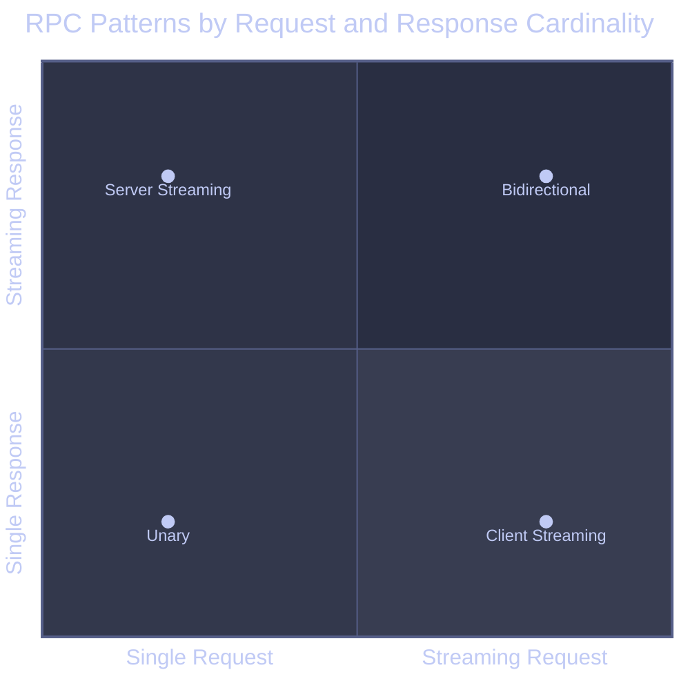
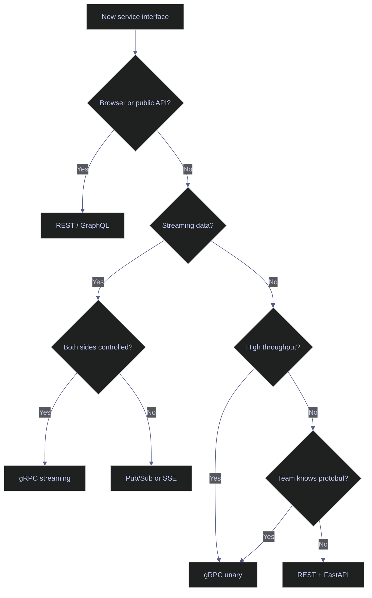

# gRPC for Data Pipelines

> [!quote]
> "Protocol Buffers were created to solve the problem of a single evolving interface with many servers, each at a different version."
>
> — **Kenton Varda** (original Protobuf author)

gRPC is a high-performance, open-source RPC framework developed by Google that uses HTTP/2 as its transport protocol and Protocol Buffers (protobuf) as its default serialization format. For data engineers, it is the go-to choice for building low-latency, high-throughput internal service communication — from real-time market data feeds to bulk ingestion pipelines between microservices.

> [!abstract] Core Idea
> gRPC lets you define a service contract in a `.proto` file, generate client and server code in any supported language, and call remote functions as if they were local. The wire format is binary and compact; the transport is HTTP/2 with multiplexing and built-in flow control.

---

## Overview

gRPC sits at the intersection of transport efficiency and developer ergonomics. Unlike REST, which relies on HTTP/1.1 and text-based JSON, gRPC uses HTTP/2 for multiplexed binary transport and Protocol Buffers for compact, strongly-typed serialization. The result is a framework optimized for high-throughput internal service communication — the kind financial data pipelines require when moving price ticks, risk calculations, and index constituents between microservices.


### What gRPC Is

gRPC stands for **g**oogle **R**emote **P**rocedure **C**all. It is built on three foundational technologies:

| Layer | Technology | Why It Matters |
|---|---|---|
| Transport | HTTP/2 | Multiplexing, header compression, flow control, bidirectional streams |
| Serialization | Protocol Buffers | Binary encoding, 5-10x smaller than JSON, strongly typed |
| Interface | `.proto` IDL | Language-neutral contract; codegen eliminates boilerplate |

**HTTP/2 multiplexing** means multiple RPC calls share one TCP connection with no head-of-line blocking at the HTTP layer. This is critical for data pipelines calling many services concurrently.

**Protocol Buffers** encode data as binary, not text. A JSON object `{"price": 4523.75, "symbol": "AAPL", "ts": 1711100000}` compresses to ~30 bytes in protobuf vs ~55 bytes in JSON — before network-level compression.

> [!info] gRPC vs gRPC-Web
> Standard gRPC uses HTTP/2 trailers, which browsers cannot access. gRPC-Web is a proxy-based adaptation for browsers. Data engineers nearly always deal with server-to-server gRPC, not gRPC-Web.

---

### When Data Engineers Use gRPC

gRPC is the right choice in these data engineering contexts:

**1. High-throughput internal service communication**
When a pricing engine must push 50,000 price updates per second to a risk engine, REST/JSON cannot keep up. gRPC handles the binary encoding and streaming natively.

**2. Streaming data between pipeline stages**
Instead of polling a REST endpoint, a downstream service opens a server-streaming RPC and receives events as they are produced. This eliminates polling overhead entirely.

**3. Microservice architectures with multiple languages**
A Python ingestion service, a Go aggregation service, and a Java analytics service all consume the same `.proto` contract. Codegen handles the per-language implementation.

**4. Strong schema enforcement**
Protobuf schemas are versioned and backward-compatible. Adding a new field never breaks existing consumers. This is far safer than unversioned JSON APIs in long-lived pipelines.

**5. Service meshes (Istio, Linkerd)**
Service meshes understand HTTP/2 and gRPC natively, providing automatic mTLS, circuit breaking, and observability at the gRPC level.

> [!guide] Real-World Data Pipeline Use Case
> A financial data platform receives FIX protocol messages from exchange feeds, normalizes them in a Python service, and pushes normalized records via client-streaming gRPC to a Go aggregation service that writes to BigQuery. Each component speaks the same `.proto` contract.

---

## Protocol Buffers

Protocol Buffers (protobuf) is both the serialization format and the interface definition language for gRPC.

### Schema Definition (.proto files)

Define messages with typed fields. Each field carries a name, a type, and a field number. The **field number** — not the name — is what gets encoded on the wire, enabling backward compatibility: adding a new field never breaks existing clients, and renaming a field has no wire impact. Proto3 scalar types include `double`, `float`, `int32`, `int64`, `uint32`, `uint64`, `sint32`, `sint64`, `fixed32`, `fixed64`, `sfixed32`, `sfixed64`, `bool`, `string`, and `bytes`.

```protobuf
syntax = "proto3";

package marketdata.v1;

message PriceRecord {
  string symbol        = 1;
  double price         = 2;
  double bid           = 3;
  double ask           = 4;
  int64  timestamp_us  = 5;
  int64  volume        = 6;
  string currency      = 7;
  string exchange      = 8;
}
```

**Field numbers** (not names) are encoded on the wire. This is what enables backward compatibility: you can add field 9 without breaking clients that only understand fields 1-8.

### Well-Known Types

Proto3 ships with predefined message types for common use cases. `Timestamp` and `Duration` avoid timezone ambiguity by encoding time as Unix epoch nanoseconds. Wrapper types (`DoubleValue`, `StringValue`, etc.) provide nullable scalars — proto3 lacks a native null for scalar fields, so wrappers fill that gap.

```protobuf
import "google/protobuf/timestamp.proto";
import "google/protobuf/duration.proto";
import "google/protobuf/wrappers.proto";  // nullable scalars

message Trade {
  string                    trade_id   = 1;
  google.protobuf.Timestamp executed_at = 2;
  google.protobuf.DoubleValue notional  = 3;  // nullable double
}
```

### Enums

Declare enumerations for fields with a fixed set of valid values. Proto3 requires the first enum value to be zero, serving as the `UNSPECIFIED` default — if an unknown enum value arrives from a newer server, older clients receive zero. Explicit `UNSPECIFIED` values are therefore important for safe default handling.

```protobuf
enum AssetClass {
  ASSET_CLASS_UNSPECIFIED = 0;  // proto3 requires zero value
  ASSET_CLASS_EQUITY      = 1;
  ASSET_CLASS_FIXED_INCOME = 2;
  ASSET_CLASS_FX          = 3;
  ASSET_CLASS_COMMODITY   = 4;
  ASSET_CLASS_CRYPTO      = 5;
}

message Position {
  string     symbol     = 1;
  AssetClass asset_class = 2;
  double     quantity   = 3;
  double     avg_cost   = 4;
}
```

### Oneof (Discriminated Unions)

Use `oneof` to model discriminated unions — exactly one field in the group is set at a time. Setting one field automatically clears all others. This is the correct pattern for event messages where the payload type varies by event kind (price tick vs trade record vs status update).

```protobuf
message MarketEvent {
  string symbol    = 1;
  int64  timestamp = 2;

  oneof payload {
    PriceRecord  price  = 3;
    TradeRecord  trade  = 4;
    QuoteRecord  quote  = 5;
    StatusRecord status = 6;
  }
}
```

### Maps

Use `map<K, V>` for key-value associations. Map keys must be integral or string types; values can be any type including nested messages. Maps do not have guaranteed ordering and cannot be used inside `oneof`.

```protobuf
message PortfolioSnapshot {
  string                   portfolio_id = 1;
  map<string, double>      positions    = 2;  // symbol -> quantity
  map<string, PriceRecord> last_prices  = 3;  // symbol -> last price
}
```

### Code Generation

Generate Python message classes and service stubs from a `.proto` file using `grpc_tools.protoc`. The `--python_out` flag generates message classes; `--grpc_python_out` generates service stubs. Both output files are required — message classes handle serialization, service stubs define the client and server interfaces.

```bash
# Install the Python gRPC tools
pip install grpcio grpcio-tools

# Generate Python code from .proto
python -m grpc_tools.protoc \
  --proto_path=./protos \
  --python_out=./generated \
  --grpc_python_out=./generated \
  ./protos/marketdata/v1/market_data.proto

# Output files:
# generated/marketdata/v1/market_data_pb2.py      (message classes)
# generated/marketdata/v1/market_data_pb2_grpc.py  (service stubs)
```

> [!tip] Buf — Modern Protobuf Toolchain
> `buf` replaces `protoc` for most teams. It handles linting, breaking-change detection, and dependency management.
> ```bash
> brew install bufbuild/buf/buf
> buf generate
> buf lint
> buf breaking --against '.git#branch=main'
> ```

### Type Safety and Backward Compatibility Rules

Protobuf enforces backward compatibility through a strict set of safe and unsafe change rules. Field numbers are permanent once assigned — changing a number breaks all existing clients. The `reserved` keyword prevents field number reuse after deletion, which would silently corrupt data for clients that still recognize the old field definition.

| Change | Safe? | Notes |
|---|---|---|
| Add a new field | Yes | New clients send it; old servers ignore it |
| Remove a field | Yes | Reserve the field number |
| Rename a field | Yes | Only the number matters on the wire |
| Change a field number | **No** | Breaks all existing clients |
| Change a field type | Sometimes | int32 → int64 is safe; string → int32 is not |
| Add an enum value | Yes | Old clients get the default (0) |

```protobuf
// Safe removal: reserve the number to prevent reuse
message PriceRecord {
  reserved 7, 8;               // old field numbers
  reserved "old_field_name";   // old field names
  string symbol = 1;
  double price  = 2;
  // ... remaining fields
}
```

---

### Complete .proto File Example

A complete service definition for a financial market data platform:

```protobuf
syntax = "proto3";

package marketdata.v1;

import "google/protobuf/timestamp.proto";
import "google/protobuf/empty.proto";

option go_package = "github.com/example/marketdata/gen/go/marketdata/v1;marketdatav1";
option java_package = "com.example.marketdata.v1";

// ─── Messages ────────────────────────────────────────────────────────────────

message PriceRequest {
  repeated string symbols  = 1;   // e.g., ["AAPL", "MSFT", "GOOGL"]
  string          currency = 2;   // ISO 4217, e.g., "USD"
}

message PriceResponse {
  string                    symbol      = 1;
  double                    price       = 2;
  double                    bid         = 3;
  double                    ask         = 4;
  double                    spread      = 5;
  google.protobuf.Timestamp as_of       = 6;
  string                    exchange    = 7;
  PriceStatus               status      = 8;
}

enum PriceStatus {
  PRICE_STATUS_UNSPECIFIED = 0;
  PRICE_STATUS_LIVE        = 1;
  PRICE_STATUS_DELAYED     = 2;
  PRICE_STATUS_CLOSED      = 3;
  PRICE_STATUS_HALTED      = 4;
}

message PriceRecord {
  string symbol       = 1;
  double price        = 2;
  int64  volume       = 3;
  int64  timestamp_us = 4;  // microseconds since Unix epoch
  string source       = 5;
}

message IngestSummary {
  int64  records_received = 1;
  int64  records_accepted = 2;
  int64  records_rejected = 3;
  int64  bytes_received   = 4;
  double duration_seconds = 5;
  repeated string errors  = 6;
}

message IndexRequest {
  string index_code = 1;  // e.g., "SPX", "NDX", "FTSE100"
}

message IndexConstituent {
  string symbol = 1;
  string name   = 2;
  double weight = 3;  // percentage, e.g., 7.2
  string sector = 4;
}

message IndexResponse {
  string                     index_code   = 1;
  string                     index_name   = 2;
  repeated IndexConstituent  constituents = 3;
  google.protobuf.Timestamp  as_of        = 4;
}

message HistoricalRequest {
  string                    symbol    = 1;
  google.protobuf.Timestamp from_time = 2;
  google.protobuf.Timestamp to_time   = 3;
  string                    interval  = 4;  // "1m", "5m", "1h", "1d"
}

message OHLCV {
  google.protobuf.Timestamp time   = 1;
  double                    open   = 2;
  double                    high   = 3;
  double                    low    = 4;
  double                    close  = 5;
  int64                     volume = 6;
  int64                     trades = 7;
}

message BidirectionalUpdate {
  repeated string subscribe   = 1;  // symbols to add
  repeated string unsubscribe = 2;  // symbols to remove
}

// ─── Service ─────────────────────────────────────────────────────────────────

service MarketDataService {
  // Unary: fetch current prices for a list of symbols
  rpc GetPrice(PriceRequest) returns (PriceResponse);

  // Server streaming: subscribe to a live price feed
  rpc StreamPrices(PriceRequest) returns (stream PriceResponse);

  // Client streaming: bulk ingest price records
  rpc BatchIngest(stream PriceRecord) returns (IngestSummary);

  // Bidirectional streaming: dynamic subscription management
  rpc ManageSubscriptions(stream BidirectionalUpdate) returns (stream PriceResponse);

  // Unary: fetch index constituents
  rpc GetIndexConstituents(IndexRequest) returns (IndexResponse);

  // Server streaming: historical OHLCV data
  rpc GetHistoricalOHLCV(HistoricalRequest) returns (stream OHLCV);

  // Unary: health check (for grpc health protocol)
  rpc Ping(google.protobuf.Empty) returns (google.protobuf.Empty);
}
```

---

## RPC Types

gRPC defines four communication patterns that map directly to data engineering use cases. The correct choice depends on whether the request, the response, or both require streaming — and how backpressure and connection lifecycle should be managed.



### Four gRPC RPC Types

gRPC defines four communication patterns. Each maps to a different data engineering use case.

```
┌─────────────────────┬──────────────────┬──────────────────────────────────┐
│ Pattern             │ Request          │ Use Case                         │
├─────────────────────┼──────────────────┼──────────────────────────────────┤
│ Unary               │ 1 → 1            │ Lookup, single record fetch      │
│ Server Streaming    │ 1 → many         │ Live feed, historical replay     │
│ Client Streaming    │ many → 1         │ Bulk ingestion, log shipping     │
│ Bidirectional       │ many → many      │ Dynamic subscriptions, chat      │
└─────────────────────┴──────────────────┴──────────────────────────────────┘
```

---

## Python Implementation

Python's async gRPC library (`grpc.aio`) integrates directly with `asyncio`, making it the right choice for I/O-bound services like market data feeds. All four RPC patterns are supported as async generators or coroutines. The examples below use `grpc.aio` throughout — sync usage with `concurrent.futures.ThreadPoolExecutor` follows the same patterns but is not recommended for new services.

### Python gRPC Server Implementation

Implement a gRPC service by subclassing the generated `Servicer` base class and overriding each RPC method. Method signatures must exactly match the generated base class. Async servicers require `grpc.aio` — passing an async servicer to a sync server raises a `TypeError` at runtime.

```python
# server.py
from __future__ import annotations

import asyncio
import logging
import time
from collections.abc import AsyncIterator
from concurrent import futures

import grpc
from grpc import aio

# Generated modules (after running protoc)
from generated.marketdata.v1 import market_data_pb2 as pb2
from generated.marketdata.v1 import market_data_pb2_grpc as pb2_grpc

logger = logging.getLogger(__name__)


class MarketDataServicer(pb2_grpc.MarketDataServiceServicer):
    """
    Async gRPC servicer for the MarketDataService.

    All method signatures match the generated base class exactly.
    Async servicers require grpc.aio; sync servicers use grpc.
    """

    def __init__(self, price_store: dict, feed_manager) -> None:
        self._prices = price_store       # symbol -> PriceRecord
        self._feed = feed_manager        # async generator source

    # ── Unary RPC ────────────────────────────────────────────────────────────

    async def GetPrice(
        self,
        request: pb2.PriceRequest,
        context: grpc.aio.ServicerContext,
    ) -> pb2.PriceResponse:
        """Single request, single response."""
        if not request.symbols:
            await context.abort(
                grpc.StatusCode.INVALID_ARGUMENT,
                "symbols list must not be empty",
            )

        symbol = request.symbols[0]
        record = self._prices.get(symbol)

        if record is None:
            await context.abort(
                grpc.StatusCode.NOT_FOUND,
                f"no price data for symbol: {symbol}",
            )

        return pb2.PriceResponse(
            symbol=symbol,
            price=record.price,
            bid=record.price - 0.01,
            ask=record.price + 0.01,
            spread=0.02,
            status=pb2.PRICE_STATUS_LIVE,
        )

    # ── Server Streaming RPC ─────────────────────────────────────────────────

    async def StreamPrices(
        self,
        request: pb2.PriceRequest,
        context: grpc.aio.ServicerContext,
    ) -> AsyncIterator[pb2.PriceResponse]:
        """One request; server yields many responses."""
        symbols = set(request.symbols)
        logger.info("StreamPrices: client subscribed to %s", symbols)

        async for tick in self._feed.subscribe(symbols):
            # Check if client has disconnected
            if context.cancelled():
                logger.info("StreamPrices: client cancelled")
                return

            yield pb2.PriceResponse(
                symbol=tick.symbol,
                price=tick.price,
                bid=tick.bid,
                ask=tick.ask,
                spread=tick.ask - tick.bid,
                status=pb2.PRICE_STATUS_LIVE,
            )

    # ── Client Streaming RPC ─────────────────────────────────────────────────

    async def BatchIngest(
        self,
        request_iterator,
        context: grpc.aio.ServicerContext,
    ) -> pb2.IngestSummary:
        """Client streams many records; server returns one summary."""
        received = 0
        accepted = 0
        rejected = 0
        bytes_received = 0
        errors = []
        start = time.monotonic()

        async for record in request_iterator:
            received += 1
            bytes_received += record.ByteSize()

            try:
                _validate_price_record(record)
                self._prices[record.symbol] = record
                accepted += 1
            except ValueError as exc:
                rejected += 1
                errors.append(f"{record.symbol}: {exc}")
                if len(errors) > 100:
                    errors.append("... truncated")
                    break

        duration = time.monotonic() - start
        logger.info(
            "BatchIngest complete: %d received, %d accepted, %d rejected in %.2fs",
            received, accepted, rejected, duration,
        )

        return pb2.IngestSummary(
            records_received=received,
            records_accepted=accepted,
            records_rejected=rejected,
            bytes_received=bytes_received,
            duration_seconds=duration,
            errors=errors,
        )

    # ── Bidirectional Streaming RPC ───────────────────────────────────────────

    async def ManageSubscriptions(
        self,
        request_iterator,
        context: grpc.aio.ServicerContext,
    ) -> AsyncIterator[pb2.PriceResponse]:
        """Client sends subscription updates; server streams matching prices."""
        active_symbols: set[str] = set()
        price_queue: asyncio.Queue[pb2.PriceResponse] = asyncio.Queue(maxsize=1000)

        async def _read_updates():
            async for update in request_iterator:
                active_symbols.update(update.subscribe)
                active_symbols.difference_update(update.unsubscribe)
                logger.debug("Subscriptions updated: %s", active_symbols)
            price_queue.put_nowait(None)  # sentinel

        async def _stream_prices():
            async for tick in self._feed.subscribe_all():
                if tick.symbol in active_symbols:
                    try:
                        price_queue.put_nowait(
                            pb2.PriceResponse(
                                symbol=tick.symbol,
                                price=tick.price,
                            )
                        )
                    except asyncio.QueueFull:
                        logger.warning("Price queue full, dropping tick for %s", tick.symbol)

        reader_task = asyncio.create_task(_read_updates())
        streamer_task = asyncio.create_task(_stream_prices())

        try:
            while True:
                item = await price_queue.get()
                if item is None:
                    break
                yield item
        finally:
            reader_task.cancel()
            streamer_task.cancel()


def _validate_price_record(record: pb2.PriceRecord) -> None:
    if not record.symbol:
        raise ValueError("symbol is required")
    if record.price <= 0:
        raise ValueError(f"price must be positive, got {record.price}")
    if record.timestamp_us <= 0:
        raise ValueError("timestamp_us is required")


async def serve(host: str = "0.0.0.0", port: int = 50051) -> None:
    server = aio.server(
        options=[
            ("grpc.max_send_message_length", 100 * 1024 * 1024),   # 100 MB
            ("grpc.max_receive_message_length", 100 * 1024 * 1024),
            ("grpc.keepalive_time_ms", 30_000),
            ("grpc.keepalive_timeout_ms", 10_000),
            ("grpc.keepalive_permit_without_calls", True),
        ]
    )

    price_store = {}
    feed_manager = MockFeedManager()  # replace with real feed

    pb2_grpc.add_MarketDataServiceServicer_to_server(
        MarketDataServicer(price_store, feed_manager), server
    )

    # TLS credentials (production)
    # with open("server.key", "rb") as f:
    #     private_key = f.read()
    # with open("server.crt", "rb") as f:
    #     certificate_chain = f.read()
    # credentials = grpc.ssl_server_credentials([(private_key, certificate_chain)])
    # server.add_secure_port(f"{host}:{port}", credentials)

    server.add_insecure_port(f"{host}:{port}")
    await server.start()
    logger.info("gRPC server listening on %s:%d", host, port)
    await server.wait_for_termination()


if __name__ == "__main__":
    logging.basicConfig(level=logging.INFO)
    asyncio.run(serve())
```

---

### Python gRPC Client Implementation

Create a client by opening a `grpc.aio.Channel` and passing it to the generated `Stub` class. Use the channel as an async context manager to ensure cleanup on exit. The stub exposes all service methods as coroutines or async generators, handling protobuf serialization transparently.

```python
# client.py
from __future__ import annotations

import asyncio
import logging
from contextlib import asynccontextmanager

import grpc
from grpc import aio

from generated.marketdata.v1 import market_data_pb2 as pb2
from generated.marketdata.v1 import market_data_pb2_grpc as pb2_grpc

logger = logging.getLogger(__name__)


class MarketDataClient:
    """
    Async client wrapper for MarketDataService.

    Use as an async context manager to ensure the channel is closed:
        async with MarketDataClient("localhost:50051") as client:
            response = await client.get_price(["AAPL"])
    """

    def __init__(self, address: str, timeout_seconds: float = 5.0) -> None:
        self._address = address
        self._timeout = timeout_seconds
        self._channel: aio.Channel | None = None
        self._stub: pb2_grpc.MarketDataServiceStub | None = None

    async def __aenter__(self) -> "MarketDataClient":
        self._channel = aio.insecure_channel(
            self._address,
            options=[
                ("grpc.max_send_message_length", 100 * 1024 * 1024),
                ("grpc.max_receive_message_length", 100 * 1024 * 1024),
            ],
        )
        self._stub = pb2_grpc.MarketDataServiceStub(self._channel)
        return self

    async def __aexit__(self, *_) -> None:
        if self._channel:
            await self._channel.close()

    # ── Unary ────────────────────────────────────────────────────────────────

    async def get_price(self, symbols: list[str]) -> pb2.PriceResponse:
        """Fetch a single price. Raises grpc.aio.AioRpcError on failure."""
        request = pb2.PriceRequest(symbols=symbols, currency="USD")
        try:
            return await self._stub.GetPrice(
                request,
                timeout=self._timeout,
                metadata=[("x-request-id", "pipeline-001")],
            )
        except aio.AioRpcError as exc:
            logger.error(
                "GetPrice failed: code=%s details=%s",
                exc.code(), exc.details()
            )
            raise

    # ── Server Streaming ─────────────────────────────────────────────────────

    async def stream_prices(self, symbols: list[str]):
        """Yield PriceResponse messages as they arrive from the server."""
        request = pb2.PriceRequest(symbols=symbols)
        call = self._stub.StreamPrices(request)
        async for response in call:
            yield response

    # ── Client Streaming ─────────────────────────────────────────────────────

    async def batch_ingest(
        self,
        records: list[dict],
    ) -> pb2.IngestSummary:
        """Stream a batch of price records to the server."""

        async def _record_generator():
            for r in records:
                yield pb2.PriceRecord(
                    symbol=r["symbol"],
                    price=r["price"],
                    volume=r["volume"],
                    timestamp_us=r["timestamp_us"],
                    source="pipeline",
                )

        return await self._stub.BatchIngest(_record_generator())

    # ── Bidirectional Streaming ───────────────────────────────────────────────

    async def manage_subscriptions(self, update_queue: asyncio.Queue):
        """
        Send subscription updates from update_queue; yield price responses.
        Put None into update_queue to terminate the stream.
        """
        async def _updates():
            while True:
                update = await update_queue.get()
                if update is None:
                    return
                yield update

        call = self._stub.ManageSubscriptions(_updates())
        async for response in call:
            yield response


# ── Usage Examples ────────────────────────────────────────────────────────────

async def example_unary():
    async with MarketDataClient("localhost:50051") as client:
        response = await client.get_price(["AAPL"])
        print(f"{response.symbol}: ${response.price:.2f} (spread: {response.spread:.4f})")


async def example_server_streaming():
    async with MarketDataClient("localhost:50051") as client:
        symbols = ["AAPL", "MSFT", "GOOGL", "AMZN", "META"]
        async for tick in client.stream_prices(symbols):
            print(f"[TICK] {tick.symbol:6s} ${tick.price:10.2f}  bid={tick.bid:.2f} ask={tick.ask:.2f}")


async def example_batch_ingest():
    import time
    records = [
        {
            "symbol": "AAPL",
            "price": 189.50 + i * 0.01,
            "volume": 1000 + i,
            "timestamp_us": int(time.time() * 1_000_000) + i,
        }
        for i in range(100_000)
    ]

    async with MarketDataClient("localhost:50051") as client:
        summary = await client.batch_ingest(records)
        print(
            f"Ingest complete: {summary.records_accepted}/{summary.records_received} accepted "
            f"in {summary.duration_seconds:.2f}s "
            f"({summary.bytes_received / 1024 / 1024:.1f} MB)"
        )
        if summary.errors:
            print(f"Errors: {summary.errors[:5]}")
```

---

### gRPC Server Streaming for Real-Time Market Data

Server streaming is the natural model for pushing market data from a feed to downstream consumers.

```python
# feed_consumer.py — processes a live price stream
import asyncio
import time
from collections import defaultdict
from typing import AsyncIterator

import grpc.aio as aio

from generated.marketdata.v1 import market_data_pb2 as pb2
from generated.marketdata.v1 import market_data_pb2_grpc as pb2_grpc


async def consume_feed_with_reconnect(
    address: str,
    symbols: list[str],
    callback,
    max_gap_seconds: float = 5.0,
) -> None:
    """
    Consume a price stream with automatic reconnection.

    If no message arrives within max_gap_seconds, the stream is assumed dead
    and a new connection is established.
    """
    backoff = 1.0

    while True:
        try:
            async with aio.insecure_channel(address) as channel:
                stub = pb2_grpc.MarketDataServiceStub(channel)
                request = pb2.PriceRequest(symbols=symbols)
                call = stub.StreamPrices(request)

                last_message = time.monotonic()
                async for tick in call:
                    last_message = time.monotonic()
                    backoff = 1.0  # reset backoff on successful message
                    await callback(tick)

                    # Check for stale feed
                    if time.monotonic() - last_message > max_gap_seconds:
                        raise RuntimeError("Feed went stale")

        except (aio.AioRpcError, RuntimeError) as exc:
            print(f"Stream error ({exc}), reconnecting in {backoff:.1f}s")
            await asyncio.sleep(backoff)
            backoff = min(backoff * 2, 60.0)


# ── Stateful aggregation over a stream ───────────────────────────────────────

class VWAPCalculator:
    """
    Calculates Volume-Weighted Average Price over a rolling window
    as price ticks arrive from a gRPC stream.
    """

    def __init__(self, window_seconds: int = 60) -> None:
        self._window = window_seconds
        self._ticks: dict[str, list[tuple[float, float, int]]] = defaultdict(list)
        # symbol -> list of (timestamp, price, volume)

    async def on_tick(self, tick: pb2.PriceResponse) -> None:
        now = time.monotonic()
        bucket = self._ticks[tick.symbol]
        bucket.append((now, tick.price, 1))  # volume from tick if available

        # Expire old ticks
        cutoff = now - self._window
        self._ticks[tick.symbol] = [(t, p, v) for t, p, v in bucket if t >= cutoff]

    def vwap(self, symbol: str) -> float | None:
        ticks = self._ticks.get(symbol, [])
        if not ticks:
            return None
        total_pv = sum(p * v for _, p, v in ticks)
        total_v = sum(v for _, _, v in ticks)
        return total_pv / total_v if total_v else None


async def run_vwap_consumer(address: str, symbols: list[str]) -> None:
    calc = VWAPCalculator(window_seconds=60)

    async def handle_tick(tick: pb2.PriceResponse) -> None:
        await calc.on_tick(tick)
        vwap = calc.vwap(tick.symbol)
        if vwap:
            spread = abs(tick.price - vwap)
            print(f"{tick.symbol:6s}  price={tick.price:.2f}  vwap={vwap:.2f}  diff={spread:.2f}")

    await consume_feed_with_reconnect(address, symbols, handle_tick)
```

---

### gRPC Client Streaming for Bulk Ingestion

Client streaming lets a Python ingestion process push records to a storage service without polling or buffering the entire batch in memory.

```python
# bulk_ingestor.py
import asyncio
import time
from pathlib import Path
from typing import AsyncIterator

import polars as pl
import grpc.aio as aio

from generated.marketdata.v1 import market_data_pb2 as pb2
from generated.marketdata.v1 import market_data_pb2_grpc as pb2_grpc


async def stream_parquet_to_grpc(
    parquet_path: Path,
    stub: pb2_grpc.MarketDataServiceStub,
    batch_size: int = 5_000,
) -> pb2.IngestSummary:
    """
    Read a Parquet file in batches and stream records via client-streaming gRPC.
    Memory usage stays constant regardless of file size.
    """

    async def _record_generator() -> AsyncIterator[pb2.PriceRecord]:
        df = pl.scan_parquet(parquet_path)
        for batch in df.collect().iter_slices(batch_size):
            for row in batch.iter_rows(named=True):
                yield pb2.PriceRecord(
                    symbol=row["symbol"],
                    price=row["price"],
                    volume=row.get("volume", 0),
                    timestamp_us=row["timestamp_us"],
                    source=row.get("source", "parquet"),
                )
                # Small yield to prevent blocking the event loop
                await asyncio.sleep(0)

    return await stub.BatchIngest(_record_generator())


async def ingest_directory(address: str, data_dir: Path) -> None:
    """Stream all Parquet files in a directory to the gRPC server."""
    parquet_files = sorted(data_dir.glob("*.parquet"))
    print(f"Found {len(parquet_files)} Parquet files to ingest")

    async with aio.insecure_channel(address) as channel:
        stub = pb2_grpc.MarketDataServiceStub(channel)

        total_accepted = 0
        for path in parquet_files:
            start = time.monotonic()
            summary = await stream_parquet_to_grpc(path, stub)
            elapsed = time.monotonic() - start
            rate = summary.records_accepted / elapsed if elapsed > 0 else 0

            print(
                f"  {path.name}: "
                f"{summary.records_accepted:>8,} accepted / "
                f"{summary.records_received:>8,} received  "
                f"({rate:,.0f} rec/s)"
            )
            total_accepted += summary.records_accepted

        print(f"\nTotal: {total_accepted:,} records ingested")
```

---

### gRPC Bidirectional Streaming

Bidirectional streaming is useful for scenarios where both sides need to send data simultaneously, such as a dynamic subscription manager.

```python
# subscription_manager.py — dynamic symbol subscription over one connection
import asyncio
import grpc.aio as aio

from generated.marketdata.v1 import market_data_pb2 as pb2
from generated.marketdata.v1 import market_data_pb2_grpc as pb2_grpc


async def run_dynamic_subscription(address: str) -> None:
    """
    Demonstrate bidirectional streaming:
    - Start with AAPL, MSFT
    - After 10s, add GOOGL and remove AAPL
    - After 20s, unsubscribe from everything
    """

    async def _update_generator():
        # Initial subscription
        yield pb2.BidirectionalUpdate(subscribe=["AAPL", "MSFT"])
        print("[+] Subscribed to AAPL, MSFT")

        await asyncio.sleep(10)
        yield pb2.BidirectionalUpdate(
            subscribe=["GOOGL"],
            unsubscribe=["AAPL"],
        )
        print("[~] Added GOOGL, removed AAPL")

        await asyncio.sleep(10)
        yield pb2.BidirectionalUpdate(unsubscribe=["MSFT", "GOOGL"])
        print("[-] Unsubscribed from all")

    async with aio.insecure_channel(address) as channel:
        stub = pb2_grpc.MarketDataServiceStub(channel)
        call = stub.ManageSubscriptions(_update_generator())

        async for tick in call:
            print(f"  [TICK] {tick.symbol}: ${tick.price:.2f}")
```

---

## Error Handling and Status Codes

gRPC has a rich set of status codes that map to specific failure conditions. Proper error handling is critical in data pipelines.

```python
# error_handling.py
import grpc
import grpc.aio as aio

from generated.marketdata.v1 import market_data_pb2 as pb2
from generated.marketdata.v1 import market_data_pb2_grpc as pb2_grpc


async def robust_get_price(
    stub: pb2_grpc.MarketDataServiceStub,
    symbol: str,
) -> pb2.PriceResponse | None:
    """Fetch a price with comprehensive error handling."""
    try:
        return await stub.GetPrice(
            pb2.PriceRequest(symbols=[symbol]),
            timeout=2.0,
        )

    except aio.AioRpcError as exc:
        code = exc.code()

        if code == grpc.StatusCode.NOT_FOUND:
            # Symbol doesn't exist — don't retry
            print(f"Symbol {symbol} not found: {exc.details()}")
            return None

        elif code == grpc.StatusCode.DEADLINE_EXCEEDED:
            # Timeout — may retry with backoff
            print(f"Request timed out for {symbol}")
            raise

        elif code == grpc.StatusCode.UNAVAILABLE:
            # Server unavailable — retry with backoff
            print(f"Server unavailable: {exc.details()}")
            raise

        elif code == grpc.StatusCode.RESOURCE_EXHAUSTED:
            # Rate limited — back off
            print(f"Rate limited: {exc.details()}")
            raise

        elif code == grpc.StatusCode.UNAUTHENTICATED:
            # Bad credentials — do not retry
            print(f"Authentication failed: {exc.details()}")
            raise

        elif code == grpc.StatusCode.PERMISSION_DENIED:
            # Not authorized — do not retry
            print(f"Permission denied for {symbol}: {exc.details()}")
            raise

        elif code == grpc.StatusCode.INTERNAL:
            # Server-side bug — log and maybe retry once
            print(f"Internal server error: {exc.details()}")
            raise

        elif code == grpc.StatusCode.CANCELLED:
            # Client cancelled — expected, don't treat as error
            return None

        else:
            print(f"Unexpected gRPC error {code}: {exc.details()}")
            raise
```

### Status Code Reference

Every gRPC response carries one of 17 status codes. The retry decision is the most critical inference: `UNAVAILABLE` and `DEADLINE_EXCEEDED` should trigger backoff retries; `NOT_FOUND`, `INVALID_ARGUMENT`, and `PERMISSION_DENIED` must not be retried since they indicate client-side problems that will not resolve on retry.

| Status Code | gRPC Name | Typical Cause | Retry? |
|---|---|---|---|
| 0 | OK | Success | N/A |
| 1 | CANCELLED | Client cancelled the call | No |
| 2 | UNKNOWN | Server threw an unmapped exception | Yes, once |
| 3 | INVALID_ARGUMENT | Bad request parameters | No |
| 4 | DEADLINE_EXCEEDED | Timeout exceeded | Yes, with backoff |
| 5 | NOT_FOUND | Resource does not exist | No |
| 6 | ALREADY_EXISTS | Duplicate create | No |
| 7 | PERMISSION_DENIED | Insufficient authorization | No |
| 8 | RESOURCE_EXHAUSTED | Rate limit hit | Yes, with backoff |
| 10 | ABORTED | Optimistic concurrency conflict | Yes |
| 11 | OUT_OF_RANGE | Pagination cursor out of bounds | No |
| 12 | UNIMPLEMENTED | Method not available | No |
| 13 | INTERNAL | Server-side bug | Maybe |
| 14 | UNAVAILABLE | Server down or overloaded | Yes, with backoff |
| 15 | DATA_LOSS | Unrecoverable data corruption | No |
| 16 | UNAUTHENTICATED | Missing or invalid credentials | No |

### Setting Status Codes in the Servicer

Return structured error information from a servicer using `context.abort()` with a status code and detail string. Use `send_initial_metadata()` to attach response headers before the first response message — useful for conveying rate-limit state or correlation IDs.

```python
# In a servicer method:
async def GetPrice(self, request, context):
    if not request.symbols:
        await context.abort(
            grpc.StatusCode.INVALID_ARGUMENT,
            "symbols list must not be empty",
        )
        return  # abort() raises internally, but explicit return is clearer

    # Add trailing metadata (e.g., for rate limit headers)
    await context.send_initial_metadata([
        ("x-rate-limit-remaining", "999"),
        ("x-rate-limit-reset", "1711100060"),
    ])
```

### Deadline Propagation

A deadline set by the initial caller must be propagated to every downstream RPC call in the chain. Without propagation, a caller that times out at 5 seconds may trigger downstream work that continues for minutes, wasting resources and producing results nobody reads.

```python
# Propagate deadlines through a pipeline of RPC calls
import time

async def pipeline_step(stub_a, stub_b, request, deadline_seconds=5.0):
    deadline = time.monotonic() + deadline_seconds

    # First RPC
    remaining_a = deadline - time.monotonic()
    result_a = await stub_a.Step1(request, timeout=remaining_a)

    # Second RPC (uses whatever deadline remains)
    remaining_b = deadline - time.monotonic()
    if remaining_b <= 0:
        raise TimeoutError("Deadline expired before second RPC")
    result_b = await stub_b.Step2(result_a, timeout=remaining_b)

    return result_b
```

---

## Interceptors

Interceptors attach cross-cutting behavior to every RPC call — authentication, logging, retry logic, metrics — without modifying individual servicer methods. The pattern mirrors middleware in web frameworks: client-side interceptors wrap outbound calls, server-side interceptors wrap inbound calls.

### gRPC Interceptors

Interceptors attach cross-cutting behavior — logging, auth token injection, retry, metrics — to every RPC call without modifying individual method implementations.

```python
# interceptors.py
import logging
import time
from typing import Callable

import grpc
import grpc.aio as aio

logger = logging.getLogger(__name__)


# ── Client-side interceptor: adds auth token to all outbound calls ────────────

class AuthInterceptor(aio.UnaryUnaryClientInterceptor):
    def __init__(self, token_provider: Callable[[], str]) -> None:
        self._token_provider = token_provider

    async def intercept_unary_unary(self, continuation, client_call_details, request):
        token = self._token_provider()
        new_metadata = list(client_call_details.metadata or [])
        new_metadata.append(("authorization", f"Bearer {token}"))

        new_details = client_call_details._replace(metadata=new_metadata)
        return await continuation(new_details, request)


# ── Client-side interceptor: logs every RPC call ─────────────────────────────

class LoggingClientInterceptor(aio.UnaryUnaryClientInterceptor):
    async def intercept_unary_unary(self, continuation, client_call_details, request):
        start = time.monotonic()
        method = client_call_details.method

        try:
            response = await continuation(client_call_details, request)
            elapsed_ms = (time.monotonic() - start) * 1000
            logger.info("gRPC call OK  %s  %.1fms", method, elapsed_ms)
            return response
        except aio.AioRpcError as exc:
            elapsed_ms = (time.monotonic() - start) * 1000
            logger.error(
                "gRPC call FAIL  %s  %.1fms  code=%s  details=%s",
                method, elapsed_ms, exc.code(), exc.details()
            )
            raise


# ── Server-side interceptor: validates Bearer token on every call ─────────────

class ServerAuthInterceptor(aio.ServerInterceptor):
    EXEMPT_METHODS = {"/grpc.health.v1.Health/Check"}

    def __init__(self, valid_tokens: set[str]) -> None:
        self._valid_tokens = valid_tokens

    async def intercept_service(self, continuation, handler_call_details):
        if handler_call_details.method in self.EXEMPT_METHODS:
            return await continuation(handler_call_details)

        metadata = dict(handler_call_details.invocation_metadata)
        auth_header = metadata.get("authorization", "")

        if not auth_header.startswith("Bearer "):
            async def _unauthenticated(request, context):
                await context.abort(
                    grpc.StatusCode.UNAUTHENTICATED,
                    "missing or malformed Authorization header",
                )
            return grpc.unary_unary_rpc_method_handler(_unauthenticated)

        token = auth_header[len("Bearer "):]
        if token not in self._valid_tokens:
            async def _unauthorized(request, context):
                await context.abort(grpc.StatusCode.PERMISSION_DENIED, "invalid token")
            return grpc.unary_unary_rpc_method_handler(_unauthorized)

        return await continuation(handler_call_details)


# ── Retry interceptor (client-side) ──────────────────────────────────────────

RETRYABLE_CODES = {
    grpc.StatusCode.UNAVAILABLE,
    grpc.StatusCode.DEADLINE_EXCEEDED,
    grpc.StatusCode.RESOURCE_EXHAUSTED,
}

class RetryInterceptor(aio.UnaryUnaryClientInterceptor):
    def __init__(self, max_attempts: int = 3, base_delay: float = 0.5) -> None:
        self._max_attempts = max_attempts
        self._base_delay = base_delay

    async def intercept_unary_unary(self, continuation, client_call_details, request):
        import asyncio, random

        for attempt in range(1, self._max_attempts + 1):
            try:
                return await continuation(client_call_details, request)
            except aio.AioRpcError as exc:
                if exc.code() not in RETRYABLE_CODES or attempt == self._max_attempts:
                    raise
                delay = self._base_delay * (2 ** (attempt - 1)) + random.uniform(0, 0.1)
                logger.warning("Retry %d/%d after %.2fs: %s", attempt, self._max_attempts, delay, exc.code())
                await asyncio.sleep(delay)


# ── Wiring interceptors to a channel ─────────────────────────────────────────

def create_client_channel(address: str, token_provider: Callable[[], str]) -> aio.Channel:
    return aio.insecure_channel(
        address,
        interceptors=[
            AuthInterceptor(token_provider),
            RetryInterceptor(max_attempts=3),
            LoggingClientInterceptor(),
        ],
    )
```

---

## Load Balancing and Service Discovery

gRPC is connection-oriented and requires explicit load balancing — unlike HTTP/1.1, a single gRPC channel holds a persistent TCP connection to one server. Without configuration, all traffic routes to the same pod. The recommended patterns are DNS-based round-robin for Kubernetes and xDS for service meshes.

```python
# load_balancing.py
import grpc
import grpc.aio as aio

# ── Round-robin across multiple server instances ──────────────────────────────

# Option 1: DNS round-robin (works with Kubernetes headless services)
channel = aio.insecure_channel(
    "dns:///market-data-service:50051",  # resolves to multiple IPs
    options=[("grpc.lb_policy_name", "round_robin")],
)

# Option 2: Static list of backends
channel = aio.insecure_channel(
    "ipv4:///10.0.0.1:50051,10.0.0.2:50051,10.0.0.3:50051",
    options=[("grpc.lb_policy_name", "round_robin")],
)

# Option 3: xDS for service mesh (Istio, Traffic Director)
channel = aio.insecure_channel(
    "xds:///market-data-service",
    options=[("grpc.lb_policy_name", "xds_wrr_locality")],
)
```

### Kubernetes Service Configuration

For gRPC round-robin in Kubernetes, use a headless service (`clusterIP: None`). A regular Kubernetes service returns a single virtual IP and routes connections through `kube-proxy` — all traffic reaches one pod. A headless service returns individual pod IPs from DNS, allowing the gRPC client to spread connections across all replicas.

```yaml
# Headless service: DNS returns individual pod IPs (gRPC round-robin)
apiVersion: v1
kind: Service
metadata:
  name: market-data-service
spec:
  clusterIP: None   # headless
  selector:
    app: market-data
  ports:
    - port: 50051
      protocol: TCP
---
apiVersion: apps/v1
kind: Deployment
metadata:
  name: market-data
spec:
  replicas: 3
  selector:
    matchLabels:
      app: market-data
  template:
    spec:
      containers:
        - name: market-data
          image: market-data:latest
          ports:
            - containerPort: 50051
```

---

## Health Checking and Reflection

gRPC defines two standard extension protocols: the health checking protocol (`grpc.health.v1`) for readiness probes and orchestrator-driven health checks, and the server reflection protocol for tooling discovery. Both are implemented as ordinary gRPC services added to the server alongside application services.

### gRPC Health Protocol

Implement the standardized gRPC health protocol using the `grpcio-health-checking` package. Kubernetes liveness and readiness probes, Cloud Run startup checks, and Istio health checks all support this protocol. The servicer maintains a per-service status that clients poll using a standard `Check` or `Watch` RPC.

```python
# health.py
from grpc_health.v1 import health, health_pb2, health_pb2_grpc
import grpc.aio as aio


async def serve_with_health(host: str = "0.0.0.0", port: int = 50051) -> None:
    server = aio.server()

    # Your main servicer
    from generated.marketdata.v1 import market_data_pb2_grpc as pb2_grpc
    pb2_grpc.add_MarketDataServiceServicer_to_server(
        MarketDataServicer(...), server
    )

    # Health servicer
    health_servicer = health.HealthServicer()
    health_pb2_grpc.add_HealthServicer_to_server(health_servicer, server)

    # Mark the service as serving
    health_servicer.set(
        "marketdata.v1.MarketDataService",
        health_pb2.HealthCheckResponse.SERVING,
    )

    server.add_insecure_port(f"{host}:{port}")
    await server.start()
    await server.wait_for_termination()


# Client: check health
async def check_health(address: str) -> bool:
    async with aio.insecure_channel(address) as channel:
        stub = health_pb2_grpc.HealthStub(channel)
        try:
            response = await stub.Check(
                health_pb2.HealthCheckRequest(
                    service="marketdata.v1.MarketDataService"
                ),
                timeout=2.0,
            )
            return response.status == health_pb2.HealthCheckResponse.SERVING
        except Exception:
            return False
```

### gRPC Reflection (for grpcurl and debugging)

Enable server reflection using the `grpcio-reflection` package so that `grpcurl` and other tools can discover the API schema at runtime without requiring the `.proto` files locally. Consider disabling reflection in production to avoid exposing the service schema to unauthorized clients.

```python
# Enable server reflection so grpcurl can discover the API
from grpc_reflection.v1alpha import reflection

SERVICE_NAMES = (
    pb2.DESCRIPTOR.services_by_name["MarketDataService"].full_name,
    reflection.SERVICE_NAME,
)
reflection.enable_server_reflection(SERVICE_NAMES, server)
```

```bash
# Use grpcurl to inspect a running server
grpcurl -plaintext localhost:50051 list
# marketdata.v1.MarketDataService

grpcurl -plaintext localhost:50051 describe marketdata.v1.MarketDataService

grpcurl -plaintext -d '{"symbols": ["AAPL"]}' \
  localhost:50051 \
  marketdata.v1.MarketDataService/GetPrice
```

---

## gRPC vs REST

The choice between gRPC and REST is primarily an API boundary question, not a performance question. gRPC wins for internal, high-throughput, or streaming service communication. REST wins at any boundary that crosses organizational lines or requires browser or third-party access.

> [!question] Which protocol should I use?
> - **Internal service-to-service, both sides controlled:** gRPC — binary efficiency, streaming, strong contracts
> - **Public or partner-facing API:** REST — tooling accessibility, HTTP caching, `curl`-ability
> - **Browser clients without a proxy layer:** REST or GraphQL — gRPC requires Envoy + gRPC-Web for browsers
> - **Simple CRUD with read-heavy caching:** REST — HTTP `ETags` and `Cache-Control` are built-in; gRPC has no equivalent
> - **High-throughput streaming (50k+ events/sec):** gRPC — native streaming without WebSocket infrastructure
> - **Polyglot microservices, all internal:** gRPC — codegen handles per-language clients from a single `.proto`
> - **Team unfamiliar with protobuf:** REST — the codegen pipeline has a learning curve; REST + FastAPI ships faster

### gRPC vs REST Comparison

| Dimension | gRPC | REST/JSON |
|---|---|---|
| **Protocol** | HTTP/2 | HTTP/1.1 or HTTP/2 |
| **Payload format** | Binary (protobuf) | Text (JSON, XML) |
| **Payload size** | ~5-10x smaller | Baseline |
| **Serialization speed** | ~5-10x faster | Baseline |
| **Streaming** | Native (4 modes) | SSE, WebSocket (bolted on) |
| **Type safety** | Enforced by schema + codegen | Optional (OpenAPI, TypeScript) |
| **Browser support** | Requires gRPC-Web proxy | Native |
| **API discoverability** | Reflection, `.proto` files | OpenAPI/Swagger |
| **Debugging** | `grpcurl`, Wireshark, reflection | `curl`, browser DevTools |
| **Learning curve** | Higher (protobuf, codegen) | Lower |
| **Caching** | Not built-in | HTTP caching (ETags, Cache-Control) |
| **Human-readable** | No (binary wire format) | Yes (text/JSON) |
| **Error model** | Rich status codes | HTTP status codes |
| **Versioning** | Proto field numbers (backward compat) | URL versioning, headers |
| **Client codegen** | First-class (official SDKs) | OpenAPI generators |
| **Interoperability** | Best for internal services | Best for public APIs |
| **Firewall / proxy** | Sometimes blocked (HTTP/2) | Wide compatibility |

> [!tip] Decision Rule
> Use gRPC when performance and streaming matter and all callers are internal services you control. Use REST when you need browser clients, public APIs, or simple CRUD with caching.



---

## gRPC on GCP

GCP provides first-class gRPC support across its compute and networking stack. Cloud Run supports gRPC natively over HTTP/2; Cloud Endpoints provides gRPC-to-REST transcoding for mixed audiences; and Dataflow workers maintain persistent gRPC channels through the `DoFn` lifecycle, avoiding per-element connection overhead.

### gRPC on Cloud Run

Cloud Run natively supports gRPC since all requests are HTTP/2. No special configuration is needed beyond enabling HTTP/2.

```yaml
# cloud-run-service.yaml
apiVersion: serving.knative.dev/v1
kind: Service
metadata:
  name: market-data-grpc
spec:
  template:
    metadata:
      annotations:
        run.googleapis.com/execution-environment: gen2
    spec:
      containers:
        - image: gcr.io/project/market-data:latest
          ports:
            - name: h2c  # HTTP/2 cleartext — required for gRPC on Cloud Run
              containerPort: 50051
```

```bash
# Deploy
gcloud run deploy market-data-grpc \
  --image gcr.io/project/market-data:latest \
  --port 50051 \
  --use-http2

# Test with grpcurl
grpcurl \
  -H "Authorization: Bearer $(gcloud auth print-identity-token)" \
  market-data-grpc-xxxxx-uc.a.run.app:443 \
  marketdata.v1.MarketDataService/GetPrice
```

### gRPC via Cloud Endpoints / API Gateway

Cloud Endpoints supports gRPC transcoding — exposing a gRPC service via HTTP/JSON for REST clients.

```yaml
# api_config.yaml (Cloud Endpoints)
type: google.api.Service
config_version: 3
name: market-data.endpoints.project-id.cloud.goog
apis:
  - name: marketdata.v1.MarketDataService
http:
  rules:
    - selector: marketdata.v1.MarketDataService.GetPrice
      get: /v1/prices/{symbols}
```

### gRPC with Dataflow and Pub/Sub Integration

Use `DoFn.setup()` to create a persistent gRPC channel per Dataflow worker rather than opening a new connection per element. `teardown()` closes the channel when the worker shuts down. Use the sync gRPC client (`grpc.insecure_channel`) rather than `grpc.aio` in Dataflow workers — Beam's `process()` method is synchronous.

```python
# Use gRPC within a Beam pipeline to call an enrichment service
import apache_beam as beam
from apache_beam import DoFn, PCollection
import grpc.aio as aio

class EnrichWithGrpc(DoFn):
    def setup(self):
        # Called once per worker; create a persistent channel
        self._channel = aio.insecure_channel("enrichment-service:50051")
        self._stub = EnrichmentServiceStub(self._channel)

    def teardown(self):
        self._channel.close()

    def process(self, element):
        import asyncio
        loop = asyncio.get_event_loop()
        result = loop.run_until_complete(
            self._stub.Enrich(EnrichRequest(data=element))
        )
        yield result
```

---

## Decision Guide

gRPC's performance advantages are real but irrelevant if the use case doesn't match. The guidance below covers protocol selection, security posture, and team maturity — not raw throughput numbers.

> [!danger] Never use `add_insecure_port` in production
> The server examples above use `add_insecure_port`, which transmits all data in cleartext over the network. Any credentials passed via metadata interceptors are fully exposed on the wire.

> [!success] Use TLS credentials for production deployments
> ```python
> with open("server.key", "rb") as f:
>     private_key = f.read()
> with open("server.crt", "rb") as f:
>     certificate_chain = f.read()
> credentials = grpc.ssl_server_credentials([(private_key, certificate_chain)])
> server.add_secure_port(f"{host}:{port}", credentials)
> ```
> On GCP, Cloud Run and Cloud Endpoints handle TLS termination — use `h2c` (HTTP/2 cleartext) inside the container and let the platform encrypt the external connection.

### When NOT to Use gRPC

> [!warning] Avoid gRPC in These Scenarios
>
> **Public / third-party APIs**: REST with OpenAPI is far more accessible. External developers expect `curl`-able endpoints, not protobuf codegen.
>
> **Browser clients (without a proxy)**: Raw gRPC requires HTTP/2 trailers, which browsers do not expose. You need gRPC-Web + Envoy proxy, adding operational complexity. Consider REST or GraphQL instead.
>
> **Simple CRUD with caching**: If your access pattern is read-heavy and HTTP caching (ETags, Cache-Control) would provide significant benefit, REST gives you this for free. gRPC has no equivalent.
>
> **Teams unfamiliar with protobuf**: The codegen pipeline adds cognitive overhead. If the team is small and velocity matters more than performance, REST + FastAPI is faster to ship.
>
> **File transfers**: gRPC has a 4 MB default message size limit. Large file transfers are better handled via signed GCS URLs or multipart uploads.

> [!success] When gRPC Is the Right Choice
> Use gRPC for internal service-to-service communication where you control both sides, need binary-compact payloads, or want streaming without bolting on WebSocket infrastructure. For browser-facing needs, expose a REST or GraphQL endpoint and let an internal gRPC layer handle high-throughput backend communication. For large file transfers, use signed GCS URLs passed through a small unary gRPC call — keep the heavy bytes in object storage, not in protobuf messages.

---

## Quick Reference

Minimal code for the most common gRPC tasks: installing dependencies, generating stubs, and bootstrapping a server and client.

```python
# Install
pip install grpcio grpcio-tools grpcio-health-checking grpcio-reflection

# Generate code
python -m grpc_tools.protoc \
  --proto_path=protos \
  --python_out=generated \
  --grpc_python_out=generated \
  protos/service.proto

# Minimal async server
server = aio.server()
add_MyServiceServicer_to_server(MyServicer(), server)
server.add_insecure_port("0.0.0.0:50051")
await server.start()
await server.wait_for_termination()

# Minimal async client
async with aio.insecure_channel("localhost:50051") as channel:
    stub = MyServiceStub(channel)
    response = await stub.MyMethod(MyRequest(field="value"))
```

---

## Related Notes

- [rest-api-design-and-consumption](https://alp78.github.io/elysium/14-Data-Architecture/APIs-and-Protocols/rest-api-design-and-consumption) — REST patterns and when to use REST vs gRPC
- [serialization-formats](https://alp78.github.io/elysium/14-Data-Architecture/Pipeline-Patterns/serialization-formats) — Deep dive on protobuf, Avro, Parquet, Arrow
- [web APIs and FastAPI](https://alp78.github.io/elysium/02-Programming-Languages/Python/15_py_webapis) — Building HTTP APIs in Python when gRPC is not needed
- [streaming-architecture](https://alp78.github.io/elysium/14-Data-Architecture/Architectures/streaming-architecture) — Event streaming patterns; gRPC streaming vs Kafka/Pub/Sub
- [pubsub-messaging](https://alp78.github.io/elysium/06-GCP/Serverless/pubsub-messaging) — Pub/Sub for event-driven pipelines; complement to gRPC server streaming
- [py-async-concurrency](https://alp78.github.io/elysium/02-Programming-Languages/Python/12_py_asyncconcurrency) — `asyncio` and `grpc.aio` patterns used throughout the Python implementation
