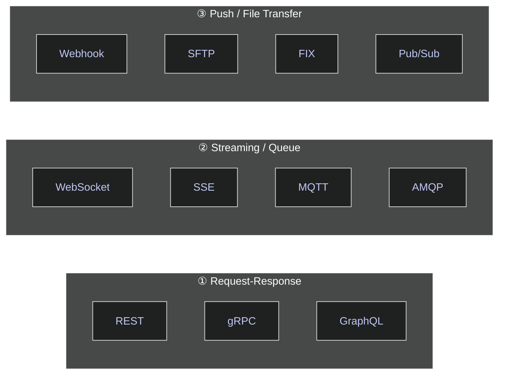
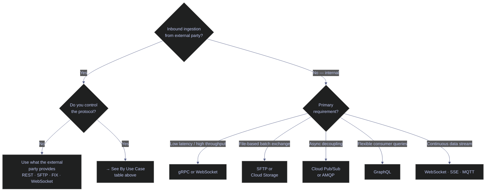
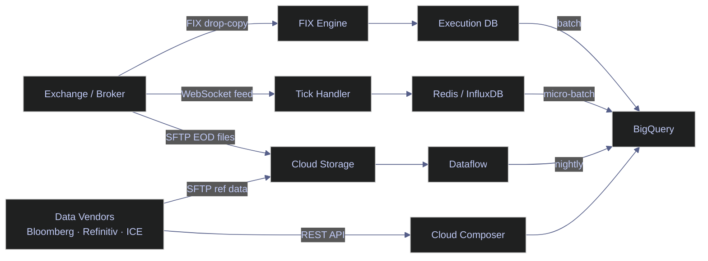
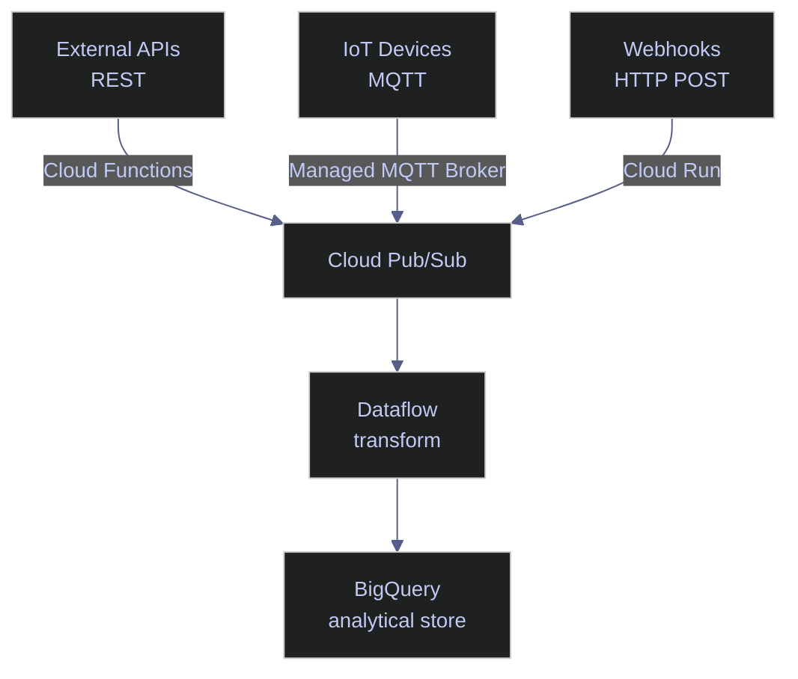
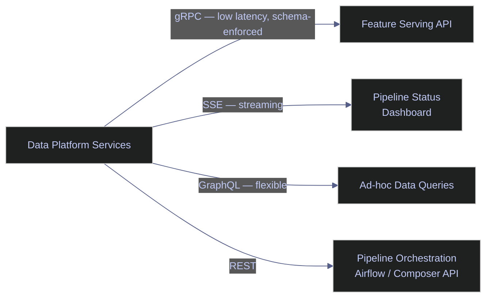

# API and Protocol Comparison — Decision Framework

> [!quote]
> "A REST API should spend almost all of its descriptive effort in defining the media type(s) used for representing resources."
>
> — **Roy Fielding**, *Architectural Styles and the Design of Network-based Software Architectures* (2000)
>
> "The hardest part of design is not solving the problem — it is deciding which problem to solve."
>
> — **Leonard Richardson**, *RESTful Web APIs* (2013)

> [!abstract] Purpose
> Data engineers interact with APIs at every stage of a pipeline: pulling from vendor REST endpoints, consuming WebSocket market data feeds, receiving SFTP files from exchanges, publishing to message queues, and exposing data products downstream. This note is the entry point for deciding **which protocol to use and why**. Each protocol section links to a deeper implementation note where one exists.

---

## Protocol Landscape Overview

APIs are not interchangeable. The protocol you choose determines latency, throughput, schema guarantees, infrastructure complexity, and what your consumers can actually do with the data. Data engineers deal with a wider range of protocols than most backend engineers because the job spans three distinct integration directions:

- **Inbound ingestion** — pulling from external data sources (SaaS vendors, exchanges, IoT devices, data marketplaces). You are the client; you rarely control the protocol.
- **Internal pipeline transport** — moving data between services you own. You control both sides and can optimize aggressively.
- **Downstream serving** — exposing data products to consumers (analytics teams, applications, other services). You control the server; consumers control how they want to query.

Understanding the trade-offs at each layer is what separates a pipeline that works from one that scales.

> [!quote] API Adoption in the Industry
> REST 86% · Webhooks 36% · GraphQL 29% · SOAP 26% · WebSockets 25% · gRPC 11%
>
> — **Postman**, *State of the API Report 2023*

The eleven protocols covered in this note fall into three communication models. REST, gRPC, and GraphQL are request-response: the client initiates and the server replies. WebSocket, SSE, MQTT, and AMQP are streaming or queue-based: the server or broker pushes data continuously. Webhooks, SFTP, FIX, and Pub/Sub handle push delivery or file transfer.



---

## Request-Response Protocols

These protocols follow the classic pattern: client sends a request, server sends a response. The connection is stateless or short-lived. The three dominant options for data engineering are REST, gRPC, and GraphQL.

### REST (HTTP/JSON)

REST is the lingua franca of the internet. Almost every external API a data engineer will consume — Bloomberg, Refinitiv Eikon, Alpha Vantage, Stripe, Salesforce, Snowflake, GitHub — speaks REST over HTTP/1.1 with JSON payloads. The stateless request-response model maps cleanly to CRUD operations, and the tooling ecosystem is unmatched: OpenAPI specs, Postman, curl, every HTTP library in every language. For a deeper treatment of authentication patterns, pagination strategies, rate-limit handling, and idiomatic Python consumption patterns, see [rest-api-design-and-consumption](https://alp78.github.io/elysium/14-Data-Architecture/APIs-and-Protocols/rest-api-design-and-consumption).

**Sweet spot:** public and partner APIs, CRUD-style data access, any situation where interoperability and broad tooling support matter more than raw performance.

**Trade-offs:** Verbose JSON payloads (typically 3–10× larger than equivalent Protobuf). No built-in streaming — each request opens a new connection under HTTP/1.1. No schema enforcement by default; field additions and removals by the API provider silently break client code. Over-fetching is common — endpoints return fixed response shapes regardless of what the client actually needs.

> [!info] REST Is a Style, Not a Specification
> As Reis & Housley note in *Fundamentals of Data Engineering*, REST "is not a full specification" — it stipulates basic interaction properties but leaves significant domain-knowledge gaps that engineers must fill with custom connector code covering authentication, extraction strategy, and change synchronisation. At any large company, maintaining these connectors is a recurring burden. Managed connector platforms (Airbyte, Fivetran, dlt) exist specifically to absorb it.

---

### gRPC (HTTP/2 + Protobuf)

gRPC is Google's open-source RPC framework built on HTTP/2 and Protocol Buffers. Where REST sends human-readable JSON over a new connection per request, gRPC sends binary-encoded Protobuf messages over a single multiplexed HTTP/2 connection. The result is typically 5–10x lower payload size and significantly higher throughput for high-frequency internal service calls. gRPC also defines four communication patterns in one framework: unary (request-response), server-streaming, client-streaming, and bidirectional streaming — making it uniquely suited for pipeline stages that need to stream large result sets. Schema contracts are enforced via `.proto` files, which serve as the single source of truth across every language that generates stubs from them. For service definition patterns, Python stub generation, streaming implementation, and GCP Cloud Run deployment, see [grpc-for-data-pipelines](https://alp78.github.io/elysium/14-Data-Architecture/APIs-and-Protocols/grpc-for-data-pipelines).

**Sweet spot:** high-throughput internal microservices, streaming pipeline stages, any service where schema enforcement and low latency matter more than browser compatibility.

**Trade-offs:** Binary Protobuf payloads are not human-readable — debugging requires `grpcurl` or a Protobuf decoder. Not browser-compatible without a proxy (gRPC-Web or ConnectRPC). `.proto` file management, code generation, and HTTP/2 infrastructure add setup overhead. Overkill for low-frequency CRUD services. Schema changes require recompiling and redistributing stubs across all consumers.

> [!info] gRPC Adoption and Real-World Use
> LLM inference backends — including Gemini and ChatGPT — use gRPC internally because high-frequency prediction calls demand its throughput characteristics. Industry-wide adoption is 11% (Postman 2023), reflecting that gRPC is a specialist tool for high-throughput internal services, not a general-purpose choice.

---

### GraphQL

GraphQL is a query language for APIs, developed by Facebook and now widely adopted for data-serving layers. Rather than defining fixed endpoints that return fixed shapes, GraphQL exposes a single endpoint backed by a strongly-typed schema written in Schema Definition Language (SDL). Clients specify exactly the fields they need, eliminating over-fetching (getting too much data) and under-fetching (needing multiple round trips). For data engineering teams serving analytics consumers with divergent needs — one team wants trades with position data, another wants only OHLCV — GraphQL lets each team write their own query without requiring server-side endpoint proliferation. The introspection feature means the schema is self-documenting and explorable via tools like GraphiQL. For schema design, resolver patterns, and Python server implementation, see [graphql-for-data-access](https://alp78.github.io/elysium/14-Data-Architecture/APIs-and-Protocols/graphql-for-data-access).

**Sweet spot:** data-serving layers with multiple heterogeneous consumers, situations where over-fetching is costly, self-documenting APIs for internal data products.

**Trade-offs:** The N+1 query problem — a query that fetches a list and then a related field on each item triggers N+1 database calls without DataLoader batching. Caching is harder than REST because requests are dynamic POSTs with variable bodies. Authorization must be enforced at the field level, not just the endpoint level. Versioning is not recommended for GraphQL APIs — there is no concept of a versioned endpoint, so schema evolution requires careful deprecation management.

> [!warning] GraphQL as a Translation Layer
> Adding GraphQL over existing REST backends you do not control is rarely worth it. The benefit of GraphQL — consumer-defined queries against a coherent schema — only materialises when you own the data layer. A GraphQL wrapper over third-party REST APIs inherits those APIs' limitations while adding resolver complexity.

> [!success] GraphQL Native Pattern
> Use GraphQL when you own both the schema and the underlying data sources (e.g., PostgreSQL, BigQuery). Start with a well-designed SDL schema. Reserve it for serving data to analytics consumers with divergent field requirements — not as a general-purpose API translation layer.

---

## Streaming and Real-Time Protocols

When the data model is continuous rather than discrete — market tick data, sensor telemetry, log streams, live order books — request-response protocols become inefficient or impossible. You cannot poll a WebSocket feed; you cannot replicate a live order book over REST without hammering rate limits. The protocols below are purpose-built for continuous data flows.

### WebSocket

WebSocket establishes a full-duplex persistent TCP connection, negotiated via an HTTP/1.1 upgrade handshake. Once the connection is open, both client and server can send frames at any time without the overhead of repeated HTTP headers. This makes it the standard protocol for real-time financial data: live price feeds, order book updates, and execution reports from exchanges all arrive over WebSocket connections.

#### When a data engineer uses it
- Connecting to exchange WebSocket feeds (Coinbase Advanced Trade, Binance, ICE, CME streaming APIs)
- Subscribing to live FX tick data from a broker or aggregator
- Receiving real-time portfolio valuation updates
- Feeding live price data to a dashboard without polling

#### Python example — connecting to a price feed

The function below establishes an async WebSocket connection, sends a subscription message for a list of symbols, and processes incoming tick messages in a loop. An outer `while True` reconnect loop wraps the connection so that network drops or exchange-initiated disconnects automatically re-establish the feed. The `ping_interval` and `ping_timeout` parameters keep the connection alive through idle periods.

```python
import asyncio
import json
import websockets
from datetime import datetime

async def subscribe_price_feed(uri: str, symbols: list[str]) -> None:
    """
    Connect to a WebSocket price feed and process incoming tick data.
    Reconnects automatically on disconnection.
    """
    subscribe_msg = {
        "type": "subscribe",
        "channels": [{"name": "ticker", "product_ids": symbols}]
    }

    while True:  # outer loop handles reconnection
        try:
            async with websockets.connect(
                uri,
                ping_interval=20,
                ping_timeout=10,
                close_timeout=5,
            ) as ws:
                await ws.send(json.dumps(subscribe_msg))
                print(f"[{datetime.utcnow():%H:%M:%S}] Subscribed to {symbols}")

                async for raw_message in ws:
                    msg = json.loads(raw_message)

                    if msg.get("type") == "ticker":
                        symbol   = msg["product_id"]
                        price    = float(msg["price"])
                        bid      = float(msg.get("best_bid", 0))
                        ask      = float(msg.get("best_ask", 0))
                        ts       = msg.get("time", datetime.utcnow().isoformat())

                        print(f"{ts} | {symbol} | price={price:.4f} bid={bid:.4f} ask={ask:.4f}")

        except (websockets.ConnectionClosed, OSError) as e:
            print(f"Connection lost: {e}. Reconnecting in 5 seconds...")
            await asyncio.sleep(5)

if __name__ == "__main__":
    FEED_URI = "wss://advanced-trade-ws.coinbase.com"
    asyncio.run(subscribe_price_feed(FEED_URI, ["BTC-USD", "ETH-USD"]))
```

#### Pros and cons

In production, WebSocket tick data is typically written to a ring buffer, forwarded to Cloud Pub/Sub, or inserted into a time-series database (Redis, InfluxDB, BigQuery) rather than printed directly.

| Aspect | Detail |
|--------|--------|
| Latency | Very low — no connection setup overhead after initial handshake |
| Direction | Full-duplex — client and server can both send at any time |
| Persistence | Long-lived connection; requires reconnection logic |
| Browser support | Yes (native WebSocket API) |
| Proxy/firewall | Can be blocked; falls back to long-polling in some environments |
| Schema | None — message format is convention-based (usually JSON) |
| Backpressure | Manual — must implement flow control yourself |
| Connection state | Not self-evident — client must implement heartbeat probes to detect silent disconnects |
| Complexity | Medium — async handling, ping/pong keepalives, reconnect logic required |

> [!warning] WebSocket Reliability
> Exchanges drop WebSocket connections without warning — during maintenance windows, market circuit breakers, or network instability. Production feed handlers must implement exponential backoff reconnection, sequence number gap detection, and a REST fallback to re-snapshot state after reconnecting.

> [!success] Resilient WebSocket Pattern
> Wrap the connection loop with exponential backoff (start at 1s, cap at 60s) and track the last received sequence number. On reconnect, call the REST snapshot endpoint to re-establish current state, then resume streaming from the WebSocket. The Python example above shows the outer `while True` reconnect loop as the baseline; add sequence gap detection by comparing each message's `sequence` field against the last seen value.

> [!info] WebSocket Handshake Mechanics
> The client initiates a WebSocket connection with a standard HTTP GET request containing `Connection: Upgrade` and a randomly generated `Sec-WebSocket-Key` header. The server responds with HTTP 101 Switching Protocols and a `Sec-WebSocket-Accept` value computed by appending the RFC 6455 magic GUID to the key, hashing with SHA-1, and base64-encoding the result. After this handshake, both sides communicate over the raw TCP socket using WebSocket framing — no further HTTP headers.

---

### Server-Sent Events (SSE)

SSE is a one-way streaming protocol built on HTTP. The server holds the connection open and pushes newline-delimited `data:` events to the client. Unlike WebSocket, SSE is just HTTP — it works through corporate proxies and firewalls, supports automatic reconnection at the browser level, and requires no special server infrastructure beyond a streaming HTTP response.

The trade-off is directionality: the client cannot send data after the initial request. For data engineering, this is often fine — you want to receive a stream of pipeline status updates, log tail output, or price events without needing to send anything back.

#### When a data engineer uses it
- Streaming pipeline job status to a dashboard (job started, running, X rows processed, complete)
- Log tailing endpoints in internal tooling
- Server-push notifications for data quality alerts
- Streaming LLM-generated data summaries

#### curl example

```bash
# -N disables output buffering so events appear as they arrive
curl -N -H "Authorization: Bearer $TOKEN" https://api.example.com/stream/pipeline/job-42/status
```

#### Python client example with httpx

```python
import httpx
import json

def stream_pipeline_status(job_id: str, token: str) -> None:
    """
    Consume an SSE stream of pipeline job status events.
    Each event is a JSON object with fields: status, rows_processed, message.
    """
    url = f"https://api.example.com/stream/pipeline/{job_id}/status"
    headers = {
        "Authorization": f"Bearer {token}",
        "Accept": "text/event-stream",
        "Cache-Control": "no-cache",
    }

    with httpx.Client(timeout=None) as client:
        with client.stream("GET", url, headers=headers) as response:
            response.raise_for_status()
            buffer = ""

            for line in response.iter_lines():
                if line.startswith("data:"):
                    payload = line[5:].strip()
                    if payload == "[DONE]":
                        print("Stream complete.")
                        break
                    try:
                        event = json.loads(payload)
                        status = event.get("status", "unknown")
                        rows   = event.get("rows_processed", 0)
                        msg    = event.get("message", "")
                        print(f"[{status}] rows={rows:,}  {msg}")
                    except json.JSONDecodeError:
                        pass  # skip malformed events

if __name__ == "__main__":
    stream_pipeline_status("job-42", token="your-token-here")
```

#### Python server example with FastAPI

```python
import asyncio
import json
from fastapi import FastAPI
from fastapi.responses import StreamingResponse

app = FastAPI()

async def pipeline_status_generator(job_id: str):
    """Simulate streaming pipeline progress as SSE events."""
    stages = [
        {"status": "starting",   "rows_processed": 0,      "message": "Initialising connections"},
        {"status": "running",    "rows_processed": 250_000, "message": "Processing batch 1/4"},
        {"status": "running",    "rows_processed": 500_000, "message": "Processing batch 2/4"},
        {"status": "running",    "rows_processed": 750_000, "message": "Processing batch 3/4"},
        {"status": "complete",   "rows_processed": 1_000_000, "message": "All rows written"},
    ]
    for stage in stages:
        yield f"data: {json.dumps(stage)}\n\n"
        await asyncio.sleep(1.5)
    yield "data: [DONE]\n\n"

@app.get("/stream/pipeline/{job_id}/status")
async def stream_status(job_id: str):
    return StreamingResponse(
        pipeline_status_generator(job_id),
        media_type="text/event-stream",
        headers={"Cache-Control": "no-cache", "X-Accel-Buffering": "no"},
    )
```

> [!tip] SSE vs WebSocket
> If you only need server-to-client streaming, prefer SSE over WebSocket. SSE is simpler to implement, works through HTTP/1.1 (no upgrade needed), survives load balancers and proxies more reliably, and has built-in browser reconnection via the `EventSource` API. Only reach for WebSocket when you need to send data in both directions.

---

### MQTT

MQTT (Message Queuing Telemetry Transport) is a lightweight publish-subscribe protocol designed for constrained devices and unreliable networks. It runs over TCP and uses a broker model: publishers send messages to topics on a broker; subscribers receive messages for the topics they subscribe to. The protocol overhead is minimal — a minimum header of 2 bytes — making it viable for microcontrollers and sensors with limited battery and bandwidth.

#### When a data engineer uses it
- Ingesting telemetry from IoT sensors (temperature, pressure, flow rate) into a time-series database
- Consuming edge device data (factory equipment, trading terminal heartbeats)
- Bridging IoT device networks to cloud pipelines (MQTT broker → Cloud Pub/Sub → BigQuery)

#### Quality of Service levels

QoS in MQTT is not a global broker setting — it is a per-message contract negotiated independently between each publisher-broker and broker-subscriber pair. A publisher can send at QoS 1 while a subscriber receives at QoS 0, enabling mixed reliability guarantees within the same topic infrastructure. QoS 2's four-part handshake is the most reliable but most resource-intensive option.

| QoS | Guarantee | Mechanism | Use case |
|-----|-----------|-----------|----------|
| 0 (At most once) | Fire and forget — no acknowledgment | Single publish, no retry | Sensor telemetry where occasional loss is acceptable |
| 1 (At least once) | Delivered at least once — possible duplicates | Publisher retransmits until PUBACK received | Pipeline events where duplicates can be deduplicated downstream |
| 2 (Exactly once) | Delivered exactly once | Four-part PUBLISH → PUBREC → PUBREL → PUBCOMP handshake | Financial transactions, critical control commands |

#### Python example with paho-mqtt

The ingestion function establishes a TLS-authenticated connection to the broker, subscribes to all sub-topics under a factory floor prefix with QoS 1, and buffers incoming readings in a shared list. A main loop flushes the buffer to storage every 10 seconds. The `loop_start()` call runs the MQTT network loop in a background thread, allowing the main thread to handle the flush logic independently.

```python
import json
import time
import paho.mqtt.client as mqtt
from datetime import datetime, timezone

BROKER_HOST = "mqtt.broker.example.com"
BROKER_PORT = 8883          # TLS port
TOPIC_PREFIX = "sensors/factory-floor"

def on_connect(client, userdata, flags, rc):
    if rc == 0:
        print(f"Connected to MQTT broker")
        client.subscribe(f"{TOPIC_PREFIX}/#", qos=1)
    else:
        print(f"Connection failed with code {rc}")

def on_message(client, userdata, msg):
    """Handle incoming sensor telemetry."""
    try:
        payload = json.loads(msg.payload.decode("utf-8"))
        topic   = msg.topic
        ts      = datetime.now(tz=timezone.utc).isoformat()

        sensor_id   = payload.get("sensor_id")
        reading     = payload.get("value")
        unit        = payload.get("unit", "")

        print(f"{ts} | {topic} | sensor={sensor_id} value={reading} {unit}")
        userdata["buffer"].append({
            "topic": topic,
            "sensor_id": sensor_id,
            "value": reading,
            "unit": unit,
            "timestamp": ts,
        })

    except (json.JSONDecodeError, KeyError) as e:
        print(f"Malformed message on {msg.topic}: {e}")

def run_mqtt_ingestion():
    buffer = []
    client = mqtt.Client(userdata={"buffer": buffer})
    client.on_connect = on_connect
    client.on_message = on_message

    client.tls_set()
    client.username_pw_set(username="pipeline-user", password="secret")

    client.connect(BROKER_HOST, BROKER_PORT, keepalive=60)
    client.loop_start()

    try:
        while True:
            time.sleep(10)
            if buffer:
                print(f"Flushing {len(buffer)} readings to storage...")
                # flush_to_bigquery(buffer.copy())
                buffer.clear()
    except KeyboardInterrupt:
        client.loop_stop()
        client.disconnect()

if __name__ == "__main__":
    run_mqtt_ingestion()
```

> [!info] MQTT vs Pub/Sub for IoT
> For pure GCP pipelines, Cloud IoT Core (deprecated) and its successor patterns use MQTT as the device-facing protocol but bridge into Cloud Pub/Sub for the pipeline side. You rarely run your own MQTT broker at scale — instead, use a managed broker (HiveMQ Cloud, AWS IoT Core, EMQX Cloud) that bridges to your cloud messaging system. In the ingestion pattern above, the buffered readings would be flushed to InfluxDB, BigQuery, or forwarded to Cloud Pub/Sub for downstream processing.

---

### AMQP (RabbitMQ)

AMQP (Advanced Message Queuing Protocol) is a binary wire-level protocol for message queuing. RabbitMQ is its most widely deployed implementation. Where Kafka is a distributed log (append-only, consumer manages offset), RabbitMQ is a traditional message broker with rich routing: direct exchanges, fanout exchanges, topic exchanges, and header-based routing. Messages can be acknowledged, rejected, and dead-lettered to separate queues for failed-message handling.

#### When a data engineer uses it
- Decoupling pipeline stages that operate at different throughput rates
- Async task dispatch: queue a data quality check job; a worker pool processes it
- Dead-letter queues: failed transformation attempts accumulate for manual inspection
- Priority queues: urgent regulatory reports ahead of routine batch jobs

#### AMQP vs Pub/Sub vs Kafka

| Dimension | AMQP (RabbitMQ) | Cloud Pub/Sub | Kafka |
|-----------|-----------------|---------------|-------|
| Model | Message queue + routing | Topic-based pub/sub | Distributed log |
| Message retention | Until acknowledged | 7 days default (configurable) | Configurable (days to forever) |
| Consumer model | Competing consumers (push) | Pull or push subscriptions | Consumer groups (pull, offset-based) |
| Ordering | Per-queue (FIFO) | Best-effort | Per-partition strict |
| Dead-letter | Native | Configurable dead-letter topic | Manual or Kafka Streams |
| GCP native | No (self-hosted or CloudAMQP) | Yes | No (use Confluent or self-hosted) |
| Replay | No | Limited (snapshot + replay) | Yes — full replay from any offset |
| Best for | Complex routing, task queues | GCP pipelines, event fan-out | Event sourcing, high-throughput log |

> [!tip] When to Use AMQP vs Pub/Sub on GCP
> If you are entirely within GCP, prefer Pub/Sub — it is managed, scales automatically, and integrates natively with Dataflow, Cloud Functions, and BigQuery subscriptions. Use RabbitMQ (AMQP) when you need sophisticated routing logic, priority queues, or you are integrating with an on-premise system that already speaks AMQP.

> [!info] What Makes AMQP Different from Informal Protocols
> AMQP mandates the behavior of both the message provider and the broker — not just the message format. This behavioral contract is what enables cross-vendor interoperability: a RabbitMQ publisher and an ActiveMQ consumer can exchange messages reliably over AMQP. Kafka, by contrast, uses a proprietary binary protocol — high performance, but consumers are tied to the Kafka ecosystem. Message queues (RabbitMQ, AMQP, Cloud Pub/Sub) prioritise reliable delivery over ordering; distributed logs (Kafka, Kinesis) prioritise throughput and replay with per-partition ordering.

---

## Push-Based Protocols

Push-based protocols invert the request-response model: the data producer initiates contact with the consumer when an event occurs. Rather than polling on a schedule and paying the cost of empty responses, the consumer registers a receiver endpoint and waits. The primary trade-off is reliability — if the consumer endpoint is unavailable when the event fires, the notification is lost unless the sender implements retry logic.

### Webhooks

A webhook is a "reverse API": rather than the data consumer polling the producer for new events, the producer calls the consumer's endpoint when an event occurs. From the consumer's perspective, it is simply an inbound HTTP POST request. The terminology "webhook" describes the architectural pattern, not a distinct transport protocol. Instead of polling an endpoint to check for new events, you register a URL with a third-party service and that service sends an HTTP POST to your URL whenever an event occurs. From your server's perspective, you are receiving an inbound HTTP request, not making one.

#### When a data engineer uses it
- Receiving trade execution notifications from a brokerage API
- GitHub Actions triggering pipeline runs on push to main
- Stripe payment events landing in a financial reconciliation pipeline
- Salesforce change data capture events (new lead, closed opportunity)
- PagerDuty alerting a pipeline monitoring endpoint on data quality breach

#### Webhook receiver in FastAPI with HMAC verification

The receiver below implements the three essentials of a production webhook endpoint: HMAC-SHA256 signature verification to confirm the sender's identity, idempotency key checking to deduplicate retried events, and immediate 200 return with async enqueue so the sender is not kept waiting. Heavy processing is never done inline — the endpoint is a fast gate, not a processing unit.

```python
import hashlib
import hmac
import json
import logging
from fastapi import FastAPI, Header, HTTPException, Request, status

app = FastAPI()
logger = logging.getLogger(__name__)

WEBHOOK_SECRET = b"your-webhook-secret"  # shared with the sender; store in Secret Manager

def verify_hmac_signature(
    payload: bytes,
    signature_header: str,
    secret: bytes,
    algorithm: str = "sha256",
) -> bool:
    """
    Verify that the request came from the expected sender using HMAC-SHA256.
    The signature header is typically 'sha256=<hex-digest>' (GitHub style).
    """
    if not signature_header:
        return False
    try:
        scheme, provided_sig = signature_header.split("=", 1)
    except ValueError:
        return False

    expected_sig = hmac.new(secret, payload, hashlib.sha256).hexdigest()
    # constant-time comparison to prevent timing attacks
    return hmac.compare_digest(provided_sig, expected_sig)

@app.post("/webhooks/trade-executions")
async def receive_trade_execution(
    request: Request,
    x_signature_256: str = Header(None, alias="X-Signature-256"),
):
    """
    Receive trade execution events from a brokerage webhook.
    Verifies HMAC signature, parses payload, enqueues for processing.
    Returns 200 immediately — heavy processing happens asynchronously.
    """
    raw_body = await request.body()

    if not verify_hmac_signature(raw_body, x_signature_256, WEBHOOK_SECRET):
        logger.warning("Invalid webhook signature — rejecting request")
        raise HTTPException(
            status_code=status.HTTP_401_UNAUTHORIZED,
            detail="Invalid signature",
        )

    try:
        event = json.loads(raw_body)
    except json.JSONDecodeError:
        raise HTTPException(status_code=400, detail="Invalid JSON payload")

    event_type = event.get("event_type")
    idempotency_key = event.get("idempotency_key") or request.headers.get("X-Idempotency-Key")

    logger.info(f"Received webhook: type={event_type} key={idempotency_key}")

    if idempotency_key and await is_already_processed(idempotency_key):
        logger.info(f"Duplicate event {idempotency_key} — skipping")
        return {"status": "already_processed"}

    # await task_queue.enqueue("process_trade_execution", event)

    return {"status": "accepted", "idempotency_key": idempotency_key}

async def is_already_processed(key: str) -> bool:
    """Check Redis or a dedupliation table for this idempotency key."""
    # Implementation: check Redis SET or Firestore document
    return False
```

#### Reliability patterns for webhook consumers

| Challenge | Solution |
|-----------|----------|
| Sender retries on timeout | Return 200 within 5 seconds; process asynchronously |
| Duplicate delivery | Idempotency keys + deduplication store (Redis, Firestore) |
| Signature forgery | HMAC-SHA256 verification on every request |
| Sender goes silent | Implement heartbeat checks or polling fallback |
| Payload too large | Accept reference, fetch full payload from sender's API |
| Ordered processing | Sequence numbers + ordering buffer, or accept eventual consistency |

> [!warning] Webhook Reliability Expectations
> You cannot guarantee webhook delivery from the sender's side. Network failures, sender bugs, and IP allowlist issues all cause gaps. For financial data pipelines, always maintain a reconciliation process that independently fetches the complete state from the sender's REST API on a schedule. Webhooks are notifications, not guaranteed delivery.

> [!success] Webhook + Reconciliation Pattern
> Treat webhooks as a fast-path notification, not as the source of truth. Run a scheduled reconciliation job (e.g., nightly) that fetches the complete state from the sender's REST API and compares against your local records. Any gap detected by reconciliation is filled by the batch fetch. This dual-mode approach provides near-real-time delivery via webhooks and guaranteed completeness via the scheduled reconciliation.

> [!tip] Full Webhook Architecture on GCP
> A standalone webhook receiver is architecturally brittle. The robust pattern: Cloud Run (receive + validate + return 200) → Cloud Pub/Sub (durable event buffer) → Dataflow or Cloud Functions (transform + enrich) → BigQuery (analytical store). This decouples receipt from processing, absorbs traffic spikes, and provides at-least-once delivery guarantees even if the downstream processor is temporarily unavailable.

---

## File Transfer Protocols

File transfer protocols deliver data as files rather than as discrete API responses or message streams. Despite the rise of APIs and event-driven architectures, file-based exchange remains deeply embedded in financial data workflows — exchanges, data vendors, regulators, and clearinghouses all rely on scheduled file drops for end-of-day data, reference data updates, and regulatory submissions. The data engineer's job is to integrate these file-based feeds into modern cloud pipelines without breaking the counterparty's delivery expectations.

### SFTP

SFTP (SSH File Transfer Protocol) is not a streaming API — it is a file-based data exchange protocol, and it remains deeply embedded in financial data workflows. Exchanges, data vendors, regulators, and clearinghouses all deliver data as files dropped into an SFTP server. End-of-day position files, reference data updates, settlement instructions, regulatory reports — these arrive as CSV, fixed-width, or XML files transferred over SFTP.

#### When a data engineer uses it
- Retrieving end-of-day trade files from an exchange or prime broker
- Consuming reference data updates (security master, FX rates) from a data vendor
- Delivering regulatory reports (MiFID II, EMIR trade reports) to a regulator's SFTP drop
- Exchanging settlement files with a clearinghouse (DTCC, LCH)

#### Python example with paramiko

The code below defines two functions: `create_sftp_client` establishes a key-authenticated SSH connection using Ed25519 with strict host key verification (rejecting unknown hosts prevents man-in-the-middle attacks), and `ingest_eod_trade_files` connects to a remote directory, filters for files matching today's date string, skips already-downloaded files for idempotency, and downloads the remaining files to a local landing directory. A third function, `upload_regulatory_report`, handles the reverse direction.

```python
import os
import paramiko
from pathlib import Path
from datetime import date, timedelta

def create_sftp_client(
    host: str,
    port: int,
    username: str,
    private_key_path: str,
) -> tuple[paramiko.SSHClient, paramiko.SFTPClient]:
    """
    Establish an SSH connection and return an SFTP client.
    Uses key-based authentication (preferred over password for automated pipelines).
    """
    ssh = paramiko.SSHClient()
    ssh.set_missing_host_key_policy(paramiko.RejectPolicy())
    ssh.load_host_keys(os.path.expanduser("~/.ssh/known_hosts"))

    private_key = paramiko.Ed25519Key.from_private_key_file(private_key_path)
    ssh.connect(host, port=port, username=username, pkey=private_key, timeout=30)

    sftp = ssh.open_sftp()
    return ssh, sftp

def ingest_eod_trade_files(
    host: str,
    port: int,
    username: str,
    private_key_path: str,
    remote_dir: str,
    local_landing_dir: Path,
    as_of_date: date | None = None,
) -> list[Path]:
    """
    Download end-of-day trade files from an exchange SFTP server.
    Files are named like: trades_YYYYMMDD.csv
    Returns list of downloaded local file paths.
    """
    if as_of_date is None:
        as_of_date = date.today() - timedelta(days=1)

    date_str = as_of_date.strftime("%Y%m%d")
    local_landing_dir.mkdir(parents=True, exist_ok=True)

    ssh, sftp = create_sftp_client(host, port, username, private_key_path)
    downloaded = []

    try:
        sftp.chdir(remote_dir)
        remote_files = sftp.listdir()

        target_files = [f for f in remote_files if date_str in f and f.endswith(".csv")]

        for filename in target_files:
            local_path = local_landing_dir / filename

            if local_path.exists():
                print(f"Already downloaded: {filename} — skipping")
                continue

            remote_attrs = sftp.stat(filename)
            print(f"Downloading {filename} ({remote_attrs.st_size:,} bytes)...")
            sftp.get(filename, str(local_path))
            downloaded.append(local_path)
            print(f"  -> {local_path}")

    finally:
        sftp.close()
        ssh.close()

    return downloaded

def upload_regulatory_report(
    host: str,
    port: int,
    username: str,
    private_key_path: str,
    remote_dir: str,
    local_file: Path,
) -> str:
    """
    Upload a regulatory report file to a regulator's SFTP drop zone.
    Returns the remote file path on success.
    """
    ssh, sftp = create_sftp_client(host, port, username, private_key_path)
    try:
        remote_path = f"{remote_dir}/{local_file.name}"
        sftp.put(str(local_file), remote_path)
        print(f"Uploaded {local_file.name} to {host}:{remote_path}")
        return remote_path
    finally:
        sftp.close()
        ssh.close()

if __name__ == "__main__":
    from pathlib import Path

    SFTP_CONFIG = {
        "host":             "sftp.exchange.example.com",
        "port":             22,
        "username":         "pipeline-user",
        "private_key_path": "/home/pipeline/.ssh/exchange_ed25519",
    }

    files = ingest_eod_trade_files(
        **SFTP_CONFIG,
        remote_dir="/outbound/trades",
        local_landing_dir=Path("/data/landing/trades"),
    )

    print(f"\nIngested {len(files)} file(s):")
    for f in files:
        print(f"  {f}")
```

> [!tip] Automated SFTP in Production
> In a Cloud Composer (Airflow) or Cloud Run pipeline, the SFTP ingestion task runs on a schedule (typically 18:30 local exchange time for T+0 EOD files). Downloaded files land in a Cloud Storage staging bucket, trigger a Pub/Sub notification, and a downstream Dataflow job loads them into BigQuery. Never leave files in the SFTP landing zone indefinitely — acknowledge receipt by moving or deleting, and keep the local staging area time-bounded. Vendors often retain multiple days of files on the server; the date-string filter in the code above prevents re-downloading prior days.

> [!info] When to Use MFT Instead of Raw SFTP
> MFT (Managed File Transfer) platforms — such as IBM Sterling, GoAnywhere, or MOVEit — wrap SFTP with enterprise-grade compliance features: end-to-end encryption at rest and in transit, full audit trails, SLA monitoring, and automated retry policies. For regulated institutions subject to DORA, MiFID II, or SOX file transfer controls, MFT is often mandated. SFTP via paramiko is appropriate for internal pipelines; MFT is the standard for counterparty-facing regulatory submissions.

---

### FIX Protocol

FIX (Financial Information eXchange) is the industry standard messaging protocol for electronic trading. Developed in 1992 between Fidelity Investments and Salomon Brothers, it remains dominant in equities, derivatives, and FX trading globally. A FIX message is a sequence of tag=value pairs delimited by the SOH (ASCII 01) character — entirely human-readable when decoded, but processed at machine speed.

#### When a data engineer encounters FIX
- Ingesting trade execution reports from an order management system (OMS) or execution management system (EMS) in real time
- Consuming order book snapshots and incremental updates from an exchange FIX feed
- Processing drop-copy feeds: a real-time mirror of all executed orders routed to a separate system for risk monitoring and regulatory reporting

#### Message structure example (decoded)

```
8=FIX.4.4 | 9=148 | 35=D | 49=CLIENT | 56=BROKER | 34=1 | 52=20241115-09:30:01.123 |
11=ORD-001 | 55=AAPL | 54=1 | 38=100 | 40=2 | 44=182.50 | 59=0 | 10=153 |
```

| Tag | Field | Value |
|-----|-------|-------|
| 35 | MsgType | D = New Order Single |
| 55 | Symbol | AAPL |
| 54 | Side | 1 = Buy |
| 38 | OrderQty | 100 |
| 40 | OrdType | 2 = Limit |
| 44 | Price | 182.50 |

#### Key FIX message types for data engineers

| MsgType | Name | Data engineering use |
|---------|------|---------------------|
| D | New Order Single | Order flow analysis |
| 8 | Execution Report | Trade capture, P&L, regulatory reporting |
| W | Market Data Snapshot | Reference price, order book initialization |
| X | Market Data Incremental | Real-time order book updates |
| V | Market Data Request | Subscribing to a feed |

> [!info] FIX is a Specialist Domain
> Full FIX session management (logon, heartbeat, sequence number recovery, resend requests) is a specialised engineering domain handled by FIX engines: QuickFIX/n, Onixs, B2BITS, or commercial solutions. As a data engineer you are more likely to consume FIX data after it has been parsed and written to a queue or database by a FIX engine, rather than implementing the session layer yourself. The key skill is understanding the message structure and knowing which tags carry the data you need.

---

## Protocol Comparison Matrix

The table below compares all eleven protocols across the dimensions most relevant to protocol selection: transport layer, payload format, communication direction, latency profile, schema enforcement, and the typical data engineering context where each protocol appears.

| Protocol | Transport | Payload | Direction | Latency | Throughput | Browser | Streaming | Schema | Auth | When DE Uses It |
|----------|-----------|---------|-----------|---------|------------|---------|-----------|--------|------|-----------------|
| REST | HTTP/1.1 | JSON/XML | Request-response | Medium | Medium | Yes | No | OpenAPI (optional) | Headers/OAuth | External APIs, CRUD |
| gRPC | HTTP/2 | Protobuf | Req-resp + streaming | Low | High | gRPC-Web | Yes (4 types) | .proto (required) | Interceptors/mTLS | Internal services |
| GraphQL | HTTP | JSON | Request-response | Medium | Medium | Yes | Subscriptions | SDL (required) | Resolvers | Flexible data serving |
| WebSocket | TCP | Any | Full-duplex | Very low | High | Yes | Yes | None | Handshake | Real-time feeds |
| SSE | HTTP | Text/JSON | Server→client | Low | Medium | Yes | Yes (one-way) | None | Headers | Status streaming |
| MQTT | TCP | Binary | Pub/sub | Very low | Medium | Via WS | Yes | None | Username/cert | IoT ingestion |
| AMQP | TCP | Binary | Queue-based | Low | High | No | Yes | None | SASL | Reliable messaging |
| Webhook | HTTP | JSON | Push (server→client) | Event-driven | Low | N/A | No | None | HMAC | Event notifications |
| SFTP | SSH | Binary files | Bidirectional | High | High | No | No | None | Key/password | File-based exchange |
| FIX | TCP | Tagged fields | Bidirectional | Ultra-low | Very high | No | Yes | FIX dictionary | Session | Trading data |
| Pub/Sub | HTTPS | JSON/binary | Pub/sub | Medium | Very high | No | Yes | None | IAM | GCP pipeline decoupling |

---

## Decision Framework

Use these tables and the decision tree to select a protocol given your use case, integration direction, and constraints. When in doubt, start with the simplest protocol that meets your requirements — optimise later when you have real latency or throughput data from production.

> [!question] Which protocol should I use?
> Start by identifying your integration direction: **inbound** (external party dictates the protocol), **internal** (you control both sides — optimise freely), or **downstream serving** (you control the server, consumers have varying query shapes). Then apply the By Use Case table for workload matching, and the By Constraint table for non-negotiable requirements.

### By Use Case

Match your workload pattern to the protocol designed for it.

| Scenario | Recommended | Why |
|----------|-------------|-----|
| Ingest from a SaaS vendor API | REST | Universal support, documented, every vendor has one |
| High-throughput internal pipeline stage | gRPC | Speed, streaming, type safety, schema contracts |
| Serve data to multiple dashboard teams | GraphQL | Each team queries exactly what they need |
| Real-time market data feed (ticks, order book) | WebSocket | Full-duplex, lowest latency, exchange standard |
| Receive deployment/CI events | Webhook | Push-based, simple, zero polling overhead |
| Ingest IoT sensor data | MQTT | Lightweight, handles unreliable networks, QoS levels |
| Decouple pipeline stages on GCP | Pub/Sub | Managed, scales to millions of msgs/sec, GCP-native |
| Receive daily files from exchange or vendor | SFTP | Industry standard for file delivery in financial data |
| Pipeline status streaming to dashboard | SSE | Simple, one-way, HTTP-compatible, firewall-friendly |
| Async task dispatch with routing | AMQP | Rich routing, dead-letter queues, competing consumers |
| Ingest trade execution data from OMS | FIX drop-copy | Industry standard for order and execution data |
| Regulatory reporting to counterparty | SFTP | Counterparty dictates the protocol; SFTP is the norm |

### By Constraint

When a requirement is non-negotiable — browser compatibility, schema enforcement, exactly-once delivery — filter first by constraint, then by use case.

| If you need... | Use |
|----------------|-----|
| Browser compatibility | REST, GraphQL, WebSocket, SSE |
| Schema enforcement | gRPC (Protobuf), GraphQL (SDL) |
| Bidirectional streaming | gRPC, WebSocket |
| Works through corporate firewalls | REST, SSE, GraphQL |
| Maximum throughput | gRPC, AMQP, FIX |
| Minimum latency | FIX, WebSocket, MQTT |
| Minimum complexity | REST, Webhooks |
| GCP-native integration | REST (Cloud Endpoints), gRPC (Cloud Run), Pub/Sub |
| Reliable delivery with acknowledgment | AMQP, Pub/Sub (with ack deadline) |
| Exactly-once semantics | MQTT QoS 2, AMQP with transactions |
| No control over sender-side protocol | Whatever the sender dictates (usually REST or SFTP) |

### Decision Tree

Starting from the integration direction narrows the choice space immediately.



---

## Protocol Evolution and Trends

Protocol standards and tooling evolve continuously. The following trends are most relevant to data engineering teams building or modernising API infrastructure in 2024–2026. Understanding these shifts helps avoid choosing a pattern that was standard two years ago but is now superseded or considered legacy.

### HTTP/3 and QUIC

HTTP/3 replaces TCP with QUIC (Quick UDP Internet Connections), a UDP-based transport that eliminates head-of-line blocking — the problem where a single lost TCP packet stalls all streams sharing the connection. For gRPC and REST over high-latency or lossy networks (cross-region calls, mobile), HTTP/3 reduces connection establishment time and improves throughput under packet loss.

HTTP/3 is now mainstream at the CDN and edge layer, carrying approximately 35% of global web traffic (Cloudflare, October 2025). Cloud provider support: GCP external HTTPS Load Balancers and Cloud CDN support HTTP/3 via a single toggle; AWS CloudFront supports it on all edge locations globally; AWS ALB and Azure load balancers do not yet support HTTP/3 natively as of early 2026. The practical impact for data engineering is felt most in cross-region REST polling and CDN-fronted API calls — backend service-to-service gRPC typically runs within a VPC where HTTP/3's benefits are less significant.

### gRPC-Web

Standard gRPC cannot run in a browser because browsers do not expose the raw HTTP/2 framing gRPC requires. gRPC-Web is a proxy-compatible variant that wraps gRPC frames in HTTP/1.1, enabling browser clients to call gRPC services with an Envoy proxy handling the translation. gRPC-Web is not deprecated, but as of 2025–2026 the community treats it as the legacy approach for new browser-facing gRPC projects. ConnectRPC (see below) is now the preferred alternative.

### ConnectRPC

ConnectRPC is a newer RPC framework from Buf that generates gRPC-compatible services callable via plain HTTP/1.1 with JSON — meaning `curl` and standard HTTP clients work without modification, while gRPC clients using Protobuf also work natively. This eliminates the "gRPC is hard to debug" friction while preserving schema contracts and binary efficiency.

Community consensus in 2025–2026 is clear: ConnectRPC is the **preferred choice for new browser-facing gRPC services**. Buf has replaced all internal gRPC-Go code with ConnectRPC. The connect-go library is imported by approximately 5,800 Go projects; connect-es (TypeScript) has hundreds of npm dependents. For internal data services, ConnectRPC provides the benefits of Protobuf schemas without mandating gRPC clients everywhere — debuggable with `curl` and compatible with Postman.

### AsyncAPI

OpenAPI (formerly Swagger) is the schema standard for REST APIs. AsyncAPI is its equivalent for event-driven architectures: a machine-readable specification for Kafka topics, Pub/Sub topics, WebSocket channels, AMQP queues, and MQTT topics. It documents the message structure, channel names, protocol bindings, and operation semantics (publish vs subscribe). For teams building data products on event-driven infrastructure, AsyncAPI documentation serves the same role as OpenAPI docs do for REST services — a contract that consumer teams can rely on.

**AsyncAPI v3.0 is GA** as of 2024, with v3.1 in progress for 2026. The tooling ecosystem (AsyncAPI Studio, server-api) caught up through 2025. If you are implementing AsyncAPI documentation today, target v3.0 — v2.x is now legacy.

### WebTransport

WebTransport is a web standard that exposes QUIC streams and datagrams to browser JavaScript, enabling lower-latency browser-to-server streaming than WebSocket over HTTP/3 infrastructure. As of April 2026, WebTransport is a W3C Working Draft nearing Candidate Recommendation (October 2025 revision); the IETF draft is at revision 15 (March 2026). Browser support has broadly landed — Chrome and Firefox ship it; Safari supports it behind a flag. The spec is pre-Recommendation but the implementation is usable in controlled environments. Watch this for real-time financial data display use cases where WebSocket latency is a bottleneck.

---

## Protocol Authentication Reference

Each protocol has idiomatic authentication patterns. Using the wrong one creates unnecessary friction.

| Protocol | Idiomatic Auth | Notes |
|----------|----------------|-------|
| REST | Bearer token (JWT/OAuth2), API key in header | HTTPS mandatory; never send credentials in URL |
| gRPC | mTLS (service-to-service), interceptor with JWT | .proto interceptors handle auth transparently |
| GraphQL | Same as REST (it's over HTTP) | Token in Authorization header |
| WebSocket | Token in query param or subprotocol header at handshake | Cannot set headers after connection upgrade in browsers |
| SSE | Bearer token in initial GET request header | Same as REST; token set at connection time |
| MQTT | Username/password + TLS client certificate | Managed brokers often support OAuth2 as well |
| AMQP | SASL PLAIN over TLS (username/password or certificates) | RabbitMQ also supports OAuth2 via plugin |
| Webhook | HMAC signature in request header | Sender signs payload; receiver verifies — stateless |
| SFTP | SSH public key (preferred), password | Store private key in Secret Manager; rotate regularly |
| FIX | Session-level logon with CompID + password | SenderCompID / TargetCompID establish session identity |

---

## Common Data Engineering Patterns by Domain

The patterns below show how protocols combine in practice across three common data engineering contexts. No single protocol dominates a real pipeline — a typical financial data platform uses five or more protocols simultaneously, each chosen for its particular integration point.

### Financial Data Ingestion Stack

A typical financial data platform runs three parallel ingestion paths from exchanges simultaneously: FIX drop-copy for real-time execution capture, WebSocket for live price data, and SFTP for end-of-day file delivery — all converging into BigQuery via different transport mechanisms.



### GCP Cloud-Native Pipeline Stack

On GCP, Cloud Pub/Sub acts as the protocol normalisation layer — REST, MQTT, and webhook sources all funnel into a single Pub/Sub topic, after which the downstream pipeline is protocol-agnostic.



### Internal Service Mesh

Internal services use different protocols for each interaction pattern: gRPC for latency-sensitive data serving, SSE for continuous status updates, GraphQL for flexible ad-hoc queries, and REST for orchestration APIs where simplicity matters more than performance.



---

## See Also

**APIs and Protocols — deep dives:**
- [rest-api-design-and-consumption](https://alp78.github.io/elysium/14-Data-Architecture/APIs-and-Protocols/rest-api-design-and-consumption) — REST deep dive: pagination, rate limiting, retry patterns, Python clients
- [grpc-for-data-pipelines](https://alp78.github.io/elysium/14-Data-Architecture/APIs-and-Protocols/grpc-for-data-pipelines) — gRPC deep dive: .proto files, streaming, Python stubs, Cloud Run deployment
- [graphql-for-data-access](https://alp78.github.io/elysium/14-Data-Architecture/APIs-and-Protocols/graphql-for-data-access) — GraphQL deep dive: schema design, resolvers, Python server, consumer patterns

**Pipeline patterns referenced in this note:**
- [streaming-architecture](https://alp78.github.io/elysium/14-Data-Architecture/Architectures/streaming-architecture) — WebSocket, SSE, MQTT in the context of streaming pipeline architectures
- [error-handling-and-retry-patterns](https://alp78.github.io/elysium/14-Data-Architecture/Pipeline-Patterns/error-handling-and-retry-patterns) — exponential backoff, dead-letter queues, retry state machines
- [data-contracts](https://alp78.github.io/elysium/14-Data-Architecture/Pipeline-Patterns/data-contracts) — Protobuf and schema enforcement as data contracts between producers and consumers
- [serialization-formats](https://alp78.github.io/elysium/14-Data-Architecture/Pipeline-Patterns/serialization-formats) — Protobuf, Avro, Parquet: when binary serialisation applies
- [data-flow-architecture](https://alp78.github.io/elysium/14-Data-Architecture/Pipeline-Patterns/data-flow-architecture) — end-to-end pipeline topology from ingestion to serving

**GCP services:**
- [pubsub-messaging](https://alp78.github.io/elysium/06-GCP/Serverless/pubsub-messaging) — Cloud Pub/Sub: topics, subscriptions, push/pull, BigQuery subscriptions

**Implementation references:**
- [24_py_streaming_realtime](https://alp78.github.io/elysium/02-Programming-Languages/Python/24_py_streaming_realtime) — Python asyncio, websockets, httpx streaming patterns

**Chapter index:**
- [moc-data-architecture](https://alp78.github.io/elysium/14-Data-Architecture/moc-data-architecture) — Full data architecture index
