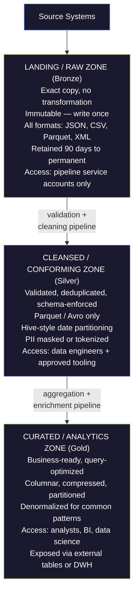

# Data Lake Architecture

> [!quote]
> "Good data architecture serves business requirements with a common, widely reusable set of building blocks while maintaining flexibility and making appropriate trade-offs."
>
> — **Joe Reis & Matt Housley**, *Fundamentals of Data Engineering* (2022)

A **data lake** is a centralized repository that stores raw data at any scale — structured, semi-structured, and unstructured — at a fraction of the cost of a traditional data warehouse. Unlike a warehouse which enforces schema on write (data is transformed into a fixed schema before loading), a data lake applies **schema-on-read**: data is stored in its native format and structure is only imposed when it is queried.

The term was coined by James Dixon (Pentaho) in 2010 as a contrast to the "data mart" concept — a data mart is like a bottle of water (cleaned, packaged, structured for a specific purpose); a data lake is the lake itself (raw, unfiltered, accessible in its native state).

---

### Schema-on-Write vs Schema-on-Read

Understanding this distinction is the architectural foundation of the data lake concept.

| Dimension | Schema-on-Write (Data Warehouse) | Schema-on-Read (Data Lake) |
|---|---|---|
| **When schema is defined** | Before loading (DDL must exist first) | At query time (schema inferred or declared) |
| **Data transformation** | Required before loading | Optional — raw data stored as-is |
| **Flexibility** | Low — schema changes require ALTER TABLE | High — add new data without schema changes |
| **Query performance** | High — optimized columnar storage, statistics | Variable — depends on file format and partitioning |
| **Data quality enforcement** | At load time (rejects bad data) | At query time (bad data accepted, may cause errors) |
| **Storage cost** | Higher (specialized storage, compute attached) | Lower (commodity object storage) |
| **Best for** | Known query patterns, BI dashboards | Exploration, ML training data, multi-format sources |

> [!warning] Schema-on-Read Is Not Free
> Schema-on-read means the lake accepts anything — but it also means bad data silently enters the lake and corrupts downstream queries. A well-run data lake enforces quality at zone boundaries (see the zone architecture below), not at every raw file. The real discipline is enforcing schemas at the *transition* from raw to curated zones, not at ingest.

> [!success] Zone Boundary Enforcement
> Accept any format in the landing zone (raw, immutable copy) but enforce a declared schema at the landing → cleansed transition. Use Spark's `DROPMALFORMED` mode or a Python Pydantic validator to reject or quarantine records that fail the schema. Any quarantined record lands in a `_rejected/` partition alongside the cleansed data, preserving the audit trail without polluting the cleansed zone.

---

## Zone Architecture

The canonical data lake organizes storage into **zones** (also called layers or tiers), each with a defined quality level, access pattern, and governance contract. The zone concept maps directly to the [medallion-architecture](https://alp78.github.io/elysium/14-Data-Architecture/Pipeline-Patterns/medallion-architecture) (Bronze = Landing/Raw, Silver = Cleansed, Gold = Curated).



### Landing / Raw Zone

The landing zone is an **append-only, immutable record** of everything that arrived from source systems. Never delete from this zone and never modify files once written. If a source sends bad data, that bad data must be preserved in landing — it is the audit trail.

#### What goes here
- API responses as raw JSON files
- Database exports as CSV or bulk format
- Event streams from Pub/Sub written as Avro or JSON
- Third-party data feeds in whatever format the vendor sends

**Retention:** Minimum 90 days for re-processing; many organizations retain permanently for auditability.

**Access:** Restrict to pipeline service accounts. Analysts should never query the landing zone directly — raw data is unvalidated and may change format without notice.

```bash
# GCS landing zone bucket naming convention
gs://org-data-lake-landing/
  source-system-name/
    entity-name/
      YYYY/MM/DD/HH/           # Hive-style partition path
        file_YYYYMMDDHHMMSS_001.json.gz

# Example: yfinance OHLCV data
gs://example-data-lake-landing/
  yfinance/
    ohlcv/
      2026/03/22/14/
        ohlcv_20260322_140000_001.json.gz
```

### Cleansed / Conforming Zone

The cleansed zone applies quality rules and standardization. This is where the lake starts enforcing structure.

#### Transformation rules at this boundary
- Validate required fields (not null, expected types)
- Deduplicate by business key + timestamp
- Standardize date formats to ISO 8601 (YYYY-MM-DD)
- Standardize currency codes to ISO 4217 (USD, GBP, EUR)
- Convert to Parquet with a declared schema
- Apply PII masking, tokenization, or pseudonymization

**File format at this zone:** Parquet (or Avro for streaming). Never CSV or raw JSON in the cleansed zone — the format must carry the schema with it.

**Access:** Data engineers, data scientists with appropriate IAM roles. Not open to general business users.

### Curated / Analytics Zone

The curated zone is the public-facing layer. It is optimized for the actual query patterns of downstream consumers.

#### Characteristics
- Columnar Parquet, partitioned and sorted for the dominant query pattern
- Pre-joined or pre-aggregated where beneficial
- Registered in the data catalog with full metadata
- Accessible to analysts via BigQuery external tables, Athena, or Trino
- Version-controlled schema (breaking changes require deprecation notice)

> [!tip] Curated Zone as External Tables
> In a GCP lake, mount the curated zone as BigQuery external tables. Analysts get the familiar BigQuery SQL interface and cost controls (partition pruning, dry runs) while the data physically lives in GCS. When query performance demands it, materialize the most-queried external tables into native BigQuery tables. See [querying-and-cost-optimization](https://alp78.github.io/elysium/06-GCP/BigQuery/querying-and-cost-optimization) and [dataset-and-table-management](https://alp78.github.io/elysium/06-GCP/BigQuery/dataset-and-table-management) for setup.

---

## File Organization and Naming Conventions

Consistent file organization is not aesthetic — it determines whether partition discovery works, whether object listing is fast, and whether data consumers can predict where files live.

### Hive-Style Partitioning

The de facto standard for data lake file organization. Partition paths use `key=value` pairs that query engines (Spark, Presto, BigQuery, Athena) automatically discover and use for partition pruning.

```
# Hive-style partition path structure
gs://bucket/table-name/year=2026/month=03/day=22/

# Example: equity prices
gs://example-data-lake-cleansed/equity-prices/
  year=2026/
    month=03/
      day=22/
        equity_prices_20260322.parquet
      day=21/
        equity_prices_20260321.parquet
```

#### Query engines read partition columns from path, not from file

```python
# PySpark / Dataproc: reads partition key=value from path automatically
df = spark.read.parquet("gs://example-data-lake-cleansed/equity-prices/")
df.filter(df.year == 2026).filter(df.month == 3)
# Only reads year=2026/month=03/ directories — no full scan
```

> [!warning] Partition Cardinality Balance
> Partition on columns with moderate cardinality. Date (YYYY/MM/DD) is the most common and usually ideal. Avoid partitioning by high-cardinality columns (instrument_id with 50,000 values creates 50,000 directories — object listing becomes the bottleneck). Avoid partitioning by low-cardinality columns (market = [US, EU, APAC] → only 3 directories, no pruning benefit for most queries).

> [!success] Recommended Partition Strategy
> Partition first by date (year/month/day for daily data, year/month for monthly aggregates). If a secondary dimension is needed, choose one with 10–500 distinct values (e.g., asset class, region, exchange). For very high-cardinality secondary dimensions like instrument_id, use clustering (BigQuery) or sorting within Parquet row groups instead of directory-level partitioning.

### File Naming Conventions

```
# Pattern: {entity}_{date}_{sequence}.{format}[.{compression}]
equity_prices_20260322_001.parquet
trades_20260322_143000_001.parquet.gz
ohlcv_20260322_001.snappy.parquet

# Avoid:
data.parquet                    # not unique, cannot be identified
equity prices (1).parquet       # spaces, parentheses — breaks many tools
EQUITY_PRICES_2026-03-22.PARQUET  # case inconsistency, dashes in date
```

#### Rules
- All lowercase, no spaces, no special characters except underscores and dots
- Include date (YYYYMMDD) or datetime (YYYYMMDDHHMMSS) in filename
- Include sequence number for multi-file batches (`_001`, `_002`)
- Always include the format extension (`.parquet`, `.avro`, `.json.gz`)
- Include compression codec in extension if non-obvious (`.snappy.parquet`, `.gz`)

### File Size Optimization

Object storage (GCS, S3) has throughput proportional to object size. Many small files degrade performance dramatically — this is the "small files problem."

| File size | Status | Action |
|---|---|---|
| < 1 MB | Too small | Compact with Spark `coalesce()` or GCS Compose |
| 1 MB – 128 MB | Acceptable | No action needed |
| 128 MB – 512 MB | Optimal | Target this range |
| > 1 GB | May limit parallelism | Consider splitting |

```python
# PySpark: coalesce small files into target file size
df.coalesce(target_partitions).write \
    .mode("overwrite") \
    .parquet("gs://bucket/curated/equity-prices/year=2026/month=03/day=22/")

# Estimate target_partitions:
# target_partitions = ceil(total_size_bytes / (256 * 1024 * 1024))  # 256 MB target
```

> [!tip] Incremental Loads and File Accumulation
> Landing zones that receive incremental files will accumulate thousands of small files over time. Run a weekly compaction job that merges small Parquet files by partition into optimal-size consolidated files. [open-table-formats](https://alp78.github.io/elysium/14-Data-Architecture/Architectures/open-table-formats) (Apache Iceberg, Delta Lake) manage this automatically through their `OPTIMIZE` / `REWRITE DATA FILES` operations.

---

## Storage Formats: When to Use Each

See [serialization-formats](https://alp78.github.io/elysium/14-Data-Architecture/Pipeline-Patterns/serialization-formats) for detailed encoding mechanics and compression codec comparison. This section covers the decision criteria specific to data lake storage.

| Format | Schema embedded | Columnar | Splittable | Best use case in a lake |
|---|---|---|---|---|
| **CSV** | No | No | Yes (line-based) | Landing zone raw ingest only; human-readable |
| **JSON** | No | No | Yes (line-delimited) | Landing zone API responses; debug/inspection |
| **JSON Lines (NDJSON)** | No | No | Yes | Streaming event landing; Pub/Sub output |
| **Parquet** | Yes | Yes | Yes (row groups) | Cleansed + curated zones; analytical queries |
| **Avro** | Yes | No | Yes | Streaming / Kafka; schema evolution focus |
| **ORC** | Yes | Yes | Yes | Hive-ecosystem legacy; Presto/Trino on AWS |

#### Decision rules

```
Landing zone:    Whatever format the source sends (preserve exactly)
Cleansed zone:  Parquet (analytics) or Avro (if streaming/Kafka origin)
Curated zone:   Parquet (compressed, partitioned, clustered)
```

> [!warning] Never Use CSV or JSON in the Curated Zone
> CSV and JSON have no embedded schema, no columnar storage, and no compression interoperability. A 10 GB CSV file in the curated zone will be read end-to-end for every query. The same data as Parquet with Snappy compression is typically 2–5 GB and scanned 3–10x faster because query engines read only the relevant columns. See [serialization-formats](https://alp78.github.io/elysium/14-Data-Architecture/Pipeline-Patterns/serialization-formats) for the full format comparison.

> [!success] Convert at the Cleansed Zone Boundary
> Run a conversion step as the final action of every cleansing pipeline: read the raw CSV/JSON from landing, validate the schema, and write the output as Parquet with Snappy compression and Hive-style date partitioning. The cleansed zone should contain only Parquet (or Avro for Kafka-origin data). Any analyst or BI tool that claims to need CSV can be served by a one-off export, not by storing CSV in the lake permanently.

#### Parquet configuration for data lake

```python
import pyarrow as pa
import pyarrow.parquet as pq

# Write Parquet with optimal settings for analytics
table = pa.Table.from_pandas(df)
pq.write_to_dataset(
    table,
    root_path="gs://example-data-lake-cleansed/equity-prices/",
    partition_cols=["year", "month", "day"],
    compression="snappy",       # fast decompression; use zstd for higher compression ratio
    row_group_size=128 * 1024,  # 128K rows per row group (balance of read speed vs overhead)
    write_statistics=True,      # column statistics enable predicate pushdown
    use_dictionary=True,        # dictionary encoding for low-cardinality string columns
    filesystem=gcs_filesystem,
)
```

---

## Data Lake Governance

An ungoverned data lake inevitably becomes a data swamp. The three most common paths to a swamp:

1. Data lands without metadata — no one knows what's there
2. No schema enforcement — downstream queries fail without warning
3. No retention policy — the lake grows without bound, costs spiral

### Data Cataloging

A data catalog is the index of the data lake: what tables exist, where they live, what their schemas are, who owns them, when they were last updated, and what they contain.

#### Minimum viable catalog entry for each dataset

```yaml
name: equity_prices_daily
description: "Daily OHLCV prices for equity instruments sourced from the yfinance API"
owner: data-engineering@org.com
location: gs://example-data-lake-cleansed/equity-prices/
format: parquet
partition_columns: [year, month, day]
schema:
  - name: instrument_id
    type: STRING
    description: "Exchange-specific ticker symbol"
  - name: trade_date
    type: DATE
    description: "Trading date (ISO 8601)"
  - name: open
    type: FLOAT64
  - name: high
    type: FLOAT64
  - name: low
    type: FLOAT64
  - name: close
    type: FLOAT64
  - name: volume
    type: INT64
classification: internal
pii: false
refresh_cadence: daily
sla_available_by: "08:00 UTC"
lineage_upstream: [yfinance-api]
lineage_downstream: [equity_prices_curated, fact_prices_bq]
```

#### GCP-native catalog options

| Tool | Scope | Best for |
|---|---|---|
| **BigQuery Data Catalog (Dataplex)** | GCP-native, BigQuery + GCS | GCP-only shops, tight BQ integration |
| **Apache Atlas** | Multi-cloud, open source | Enterprise, Hadoop ecosystem |
| **Collibra / Alation** | Commercial, enterprise | Large organizations with data governance teams |
| **DataHub (LinkedIn)** | Open source, multi-cloud | Mid-size engineering teams |

### Data Lineage

Lineage tracks the provenance of each dataset: what were its inputs, what transformation produced it, what does it feed downstream. Without lineage, a bug in a source system cannot be traced to impacted downstream reports.

> [!tip] Implement Lineage from Day One
> Retrofitting lineage onto an existing lake is vastly more expensive than building it in from the start. Even a simple metadata file (`lineage.json`) alongside each dataset — listing upstream source names and the pipeline job that produced it — provides enormous value when something breaks.

#### Minimum lineage metadata approach (practical for small teams)

```python
# Write a sidecar metadata file alongside every Parquet dataset
import json
from datetime import datetime, timezone

lineage = {
    "dataset": "equity_prices_cleansed",
    "produced_by": "equity-prices-cleanse-job",
    "job_run_id": run_id,
    "produced_at": datetime.now(timezone.utc).isoformat(),
    "upstream": [
        {"dataset": "equity_prices_landing", "path": "gs://example-data-lake-landing/yfinance/ohlcv/"}
    ],
    "downstream": [
        {"dataset": "equity_prices_curated"},
        {"dataset": "fact_prices_bigquery"}
    ],
    "row_count": df.shape[0],
    "schema_version": "1.3.0"
}

# Write sidecar to GCS alongside the Parquet files
with gcs_client.bucket("example-data-lake-cleansed").blob(
    f"equity-prices/year={year}/month={month}/day={day}/_lineage.json"
).open("w") as f:
    json.dump(lineage, f)
```

### Access Control

The zone architecture naturally maps to a tiered access control model.

| Zone | Who has access | GCP IAM role |
|---|---|---|
| **Landing (raw)** | Pipeline service accounts only | `roles/storage.objectCreator` on landing bucket |
| **Cleansed** | Data engineers, ML pipelines | `roles/storage.objectViewer` on cleansed bucket |
| **Curated** | All data consumers (analysts, BI) | `roles/storage.objectViewer` on curated bucket |
| **Admin** | Data platform team only | `roles/storage.admin` |

See [service-accounts-and-iam](https://alp78.github.io/elysium/06-GCP/Security/service-accounts-and-iam) for GCP IAM mechanics and [vpc-service-controls](https://alp78.github.io/elysium/06-GCP/Security/vpc-service-controls) for perimeter-level lake access control.

> [!warning] Don't Grant Project-Level Storage Roles
> Granting `roles/storage.objectViewer` at the project level gives access to all buckets in the project. Assign bucket-level IAM bindings to enforce zone separation. Use [service-accounts-and-iam](https://alp78.github.io/elysium/06-GCP/Security/service-accounts-and-iam)'s condition-based IAM for attribute-level access control.

> [!success] Bucket-Level IAM Pattern
> Create one service account per pipeline stage (e.g., `sa-landing-writer`, `sa-cleanse-reader`, `sa-curate-writer`) and bind each to its specific bucket with the minimum required role. Analysts get `roles/storage.objectViewer` on the curated bucket only. Enforce this via Terraform so IAM bindings are code-reviewed and version-controlled, not applied ad hoc via the console.

### PII Handling in the Lake

Personally Identifiable Information (PII) in the lake requires a clear handling strategy.

#### Options in order of preference

1. **Tokenization** — Replace PII with a reversible token. The token → PII mapping lives in a secure vault (GCP Secret Manager). Data in the lake contains only tokens.
2. **Pseudonymization** — Hash the PII with a secret salt. Irreversible without the salt. Suitable for analytics where re-identification is not needed.
3. **Masking** — Replace PII with a placeholder (`***`, `REDACTED`). Irreversible. Suitable for logs and audit trails.
4. **Column-level encryption** — Encrypt the PII column with a KMS key. Authorized users decrypt; others see ciphertext.

**PII should never appear in the curated zone.** Apply the chosen technique at the cleansed zone boundary (the cleansing pipeline) so the curated zone is PII-free by design.

---

## Data Lake Anti-Patterns: The Data Swamp

A data lake becomes a data swamp when it grows without governance. Swamps are characterized by data that cannot be trusted, cannot be found, and cannot be deleted.

### Anti-Pattern 1: No Schema Enforcement

**Symptom:** Data lands in arbitrary formats. Downstream queries fail with type errors or return wrong results.

**Fix:** Enforce a schema contract at the cleansed zone boundary. Reject or quarantine data that fails validation. Use Parquet's embedded schema as the enforcement mechanism — write Parquet with a declared schema and any source data that doesn't conform to the schema errors at write time.

### Anti-Pattern 2: No Cataloging

**Symptom:** "Where is the price data?" requires asking a specific person. New team members cannot discover what exists.

**Fix:** Register every dataset in a catalog at write time, not as an afterthought. Automate catalog updates as part of the pipeline completion step.

### Anti-Pattern 3: No Retention Policy

**Symptom:** The lake grows indefinitely. Storage costs compound monthly. "We might need it someday" is the only retention policy.

**Fix:** Define explicit retention periods per zone and per dataset. Implement GCS lifecycle rules to automatically transition and delete data. See [gcs-buckets-and-lifecycle](https://alp78.github.io/elysium/06-GCP/Storage/gcs-buckets-and-lifecycle) for lifecycle rule syntax.

```bash
# GCS lifecycle rule: delete landing zone files after 90 days
cat > /tmp/landing-lifecycle.json << 'EOF'
{
  "lifecycle": {
    "rule": [
      {
        "action": {"type": "Delete"},
        "condition": {"age": 90}
      }
    ]
  }
}
EOF

gcloud storage buckets update gs://example-data-lake-landing \
  --lifecycle-file=/tmp/landing-lifecycle.json
```

### Anti-Pattern 4: Monolithic Buckets

**Symptom:** All data — landing, cleansed, curated — lives in a single bucket. Access control is all-or-nothing. Zone boundaries are meaningless.

**Fix:** One bucket per zone. This maps zone boundaries to security boundaries. IAM is applied at the bucket level, and storage class / lifecycle rules are configured independently per zone.

```
gs://org-data-lake-landing/     # raw, 90-day lifecycle, restricted access
gs://org-data-lake-cleansed/    # validated, Parquet, 1-year lifecycle
gs://org-data-lake-curated/     # analytics-ready, permanent, public (internal)
```

### Anti-Pattern 5: No Idempotency

**Symptom:** Re-running the pipeline for a date creates duplicate files or doubles row counts.

**Fix:** Design every pipeline write as idempotent. For Parquet in GCS, the most reliable approach is to write to a temporary path and then atomically rename (or use the [idempotent-pipeline-design](https://alp78.github.io/elysium/14-Data-Architecture/Pipeline-Patterns/idempotent-pipeline-design) TRUNCATE + RELOAD pattern):

```python
# Idempotent Parquet write: write to temp, rename to final
temp_path = f"gs://bucket/_temp/{run_id}/equity-prices/"
final_path = f"gs://bucket/cleansed/equity-prices/year={year}/month={month}/day={day}/"

# Write to temp
df.to_parquet(temp_path)

# Delete existing final path content
gcs_client.delete_blobs_with_prefix(final_path)

# Move temp → final (using GCS rewrite for cross-prefix move)
gcs_client.move_blobs(temp_path, final_path)
```

---

### Cloud Data Lake Implementations Comparison

| Dimension | GCS (Google Cloud Storage) | S3 (AWS) | ADLS Gen2 (Azure) |
|---|---|---|---|
| **Storage pricing (standard)** | $0.020/GB/month (US multi-region) | $0.023/GB/month (US East) | $0.018/GB/month (LRS) |
| **Storage classes** | STANDARD, NEARLINE, COLDLINE, ARCHIVE | Standard, Infrequent Access, Glacier, Glacier Deep | Hot, Cool, Cold, Archive |
| **Minimum storage duration** | None (STANDARD), 30d (NEARLINE), 90d (COLDLINE), 365d (ARCHIVE) | None (Standard), 30d (IA), 90d (Glacier) | None (Hot), 30d (Cool), 90d (Cold), 180d (Archive) |
| **Lifecycle rules** | Yes — SetStorageClass, Delete, AbortMultipartUpload | Yes — Transition, Expire, NoncurrentVersionTransition | Yes — Tier transition, Delete |
| **Hive partition discovery** | Yes (via Dataproc, BigQuery, BigLake) | Yes (via EMR, Athena, Glue) | Yes (via Synapse, Databricks, HDInsight) |
| **Versioning** | Yes (object versioning) | Yes (object versioning) | Yes (via soft delete) |
| **Query engine native integration** | BigQuery (external tables, BigLake) | Athena, Redshift Spectrum | Synapse Analytics, Databricks |
| **Encryption** | Default CMEK, CSEK | Default SSE-S3, SSE-KMS, SSE-C | Default, BYOK via Key Vault |
| **Access control** | IAM + ACLs (prefer uniform bucket-level) | IAM + S3 bucket policies + ACLs | IAM + POSIX ACLs + RBAC |
| **Transfer to other cloud** | Egress charged | Egress charged | Egress charged |
| **Networking** | VPC Service Controls | VPC Endpoints | Private Endpoints, VNet Service Endpoints |

> [!info] GCS vs S3: Practical Differences
> GCS and S3 are functionally equivalent for most data lake workloads. The key practical difference is the query engine integration: GCS plugs natively into BigQuery (zero-copy external tables), while S3 plugs natively into Athena and Redshift Spectrum. Choose based on which warehouse engine you use, not on raw storage characteristics.

---

### Data Lake vs Data Warehouse Comparison

| Dimension | Data Lake | Data Warehouse |
|---|---|---|
| **Data types** | All (structured, semi-structured, unstructured) | Structured only |
| **Schema** | Schema-on-read | Schema-on-write |
| **Storage cost** | Very low (object storage) | Higher (specialized storage) |
| **Query performance** | Variable (depends on format + partitioning) | High (always optimized, statistics maintained) |
| **Data quality** | Variable — quality enforced at zone boundaries | High — enforced at load time |
| **Concurrency** | High (object storage is infinitely scalable) | Limited by compute (slots, DWU, virtual warehouses) |
| **SQL support** | Via query engines (Presto, Spark, BQ external tables) | Native, first-class |
| **ML / Data Science** | Excellent — direct access to raw files | Limited — typically need export first |
| **Historical raw data** | Yes — immutable landing zone | No — only transformed/loaded data |
| **Governance overhead** | High (requires explicit investment) | Lower (warehouse enforces structure) |
| **Best for** | Exploration, ML, multi-format sources, cost-sensitive storage | Known query patterns, BI dashboards, governed reporting |

> [!tip] Lake + Warehouse = Lakehouse
> Modern architectures combine both: a data lake for low-cost raw storage, feeding a data warehouse or lakehouse layer for governed analytical queries. The [open-table-formats](https://alp78.github.io/elysium/14-Data-Architecture/Architectures/open-table-formats) (Apache Iceberg, Delta Lake) blur this boundary further — open table formats bring warehouse-grade ACID transactions and schema enforcement to object storage, creating the "lakehouse" architecture. The [medallion-architecture](https://alp78.github.io/elysium/14-Data-Architecture/Pipeline-Patterns/medallion-architecture) is a practical implementation pattern that spans both.

---

## GCP Data Lake Implementation: GCS + BigQuery + Dataproc

A complete GCP-native data lake uses GCS for storage, BigQuery for SQL-on-lake queries, and Dataproc (managed Spark) for heavy transformation jobs.

### Setting Up the Three-Zone Lake on GCS

```bash
# Create three zone buckets with appropriate storage classes and access controls

# Landing zone: STANDARD, 90-day auto-delete, restricted access
gcloud storage buckets create gs://example-data-lake-landing \
  --location=EU \
  --default-storage-class=STANDARD \
  --uniform-bucket-level-access

# Cleansed zone: STANDARD, 1-year retention, data engineering access
gcloud storage buckets create gs://example-data-lake-cleansed \
  --location=EU \
  --default-storage-class=STANDARD \
  --uniform-bucket-level-access

# Curated zone: STANDARD → NEARLINE after 365d, analyst access
gcloud storage buckets create gs://example-data-lake-curated \
  --location=EU \
  --default-storage-class=STANDARD \
  --uniform-bucket-level-access
```

See [gcs-buckets-and-lifecycle](https://alp78.github.io/elysium/06-GCP/Storage/gcs-buckets-and-lifecycle) for the full lifecycle rule configuration reference.

### Mounting Curated Zone as BigQuery External Tables

BigQuery external tables let analysts query GCS Parquet files using standard SQL without loading data into BigQuery. Costs are based on bytes scanned from GCS (priced at BigQuery on-demand rates).

```sql
-- Create a BigQuery external table pointing to GCS Parquet
CREATE OR REPLACE EXTERNAL TABLE `example-project.lake_curated.equity_prices_ext`
WITH PARTITION COLUMNS (
    year  INT64,
    month INT64,
    day   INT64
)
OPTIONS (
    format                   = 'PARQUET',
    uris                     = ['gs://example-data-lake-curated/equity-prices/*.parquet'],
    hive_partition_uri_prefix = 'gs://example-data-lake-curated/equity-prices/',
    require_hive_partition_filter = TRUE  -- forces callers to filter on partition columns
);
```

#### Query the external table with partition pruning

```sql
-- This scans ONLY year=2026/month=03/day=22/ — not the full table
SELECT
    instrument_id,
    close,
    volume
FROM `example-project.lake_curated.equity_prices_ext`
WHERE year = 2026
  AND month = 3
  AND day = 22
  AND instrument_id IN ('MSFT', 'AAPL', 'GOOG');
```

> [!tip] Materialize Hot External Tables
> External tables are re-read from GCS on every query. For tables queried many times per day, materialize them into native BigQuery tables nightly:
> ```sql
> CREATE OR REPLACE TABLE `example-project.warehouse.equity_prices`
> PARTITION BY trade_date
> CLUSTER BY instrument_id
> AS SELECT * FROM `example-project.lake_curated.equity_prices_ext`
> WHERE year = EXTRACT(YEAR FROM CURRENT_DATE());
> ```
> Native tables benefit from BigQuery's statistics, caching, and slot-based optimization.

### Dataproc for Heavy Transformation

For complex transformations that exceed what SQL can express efficiently (e.g., time-series gap-filling across 50,000 instruments, ML feature engineering, joining 10+ data sources), use Dataproc (managed Spark) to read from GCS, transform, and write back.

```python
# Dataproc PySpark job: cleanse landing zone equity prices to cleansed zone
from pyspark.sql import SparkSession
from pyspark.sql import functions as F
from pyspark.sql.types import StructType, StructField, StringType, DoubleType, LongType, DateType

spark = SparkSession.builder \
    .appName("equity-prices-cleanse") \
    .config("spark.sql.parquet.compression.codec", "snappy") \
    .getOrCreate()

# Define the canonical schema (enforced on read — bad records error/skip)
schema = StructType([
    StructField("instrument_id", StringType(), nullable=False),
    StructField("trade_date",    DateType(),   nullable=False),
    StructField("open",          DoubleType(), nullable=True),
    StructField("high",          DoubleType(), nullable=True),
    StructField("low",           DoubleType(), nullable=True),
    StructField("close",         DoubleType(), nullable=False),
    StructField("volume",        LongType(),   nullable=True),
])

# Read landing zone (raw JSON, schema-on-read with explicit schema)
df_raw = spark.read \
    .schema(schema) \
    .option("mode", "DROPMALFORMED") \
    .json(f"gs://example-data-lake-landing/yfinance/ohlcv/year=2026/month=03/day=22/")

# Cleanse: deduplicate, validate, add partition columns
df_clean = df_raw \
    .dropDuplicates(["instrument_id", "trade_date"]) \
    .filter(F.col("close") > 0) \
    .filter(F.col("instrument_id").isNotNull()) \
    .withColumn("year",  F.year("trade_date")) \
    .withColumn("month", F.month("trade_date")) \
    .withColumn("day",   F.dayofmonth("trade_date"))

# Write to cleansed zone (Hive-style partitioned Parquet)
df_clean.write \
    .mode("overwrite") \
    .partitionBy("year", "month", "day") \
    .parquet("gs://example-data-lake-cleansed/equity-prices/")

print(f"Wrote {df_clean.count()} rows to cleansed zone")
```

---

## Cost Optimization for Data Lakes

### Storage Class Lifecycle Policies

Implement automatic storage class transitions to minimize cost for aging data. See [gcs-buckets-and-lifecycle](https://alp78.github.io/elysium/06-GCP/Storage/gcs-buckets-and-lifecycle) for full lifecycle JSON configuration.

| Zone | Initial class | Transition | Final disposition |
|---|---|---|---|
| Landing | STANDARD | NEARLINE after 30d, COLDLINE after 60d | DELETE after 90d |
| Cleansed | STANDARD | NEARLINE after 180d, COLDLINE after 365d | Keep or archive |
| Curated | STANDARD | NEARLINE after 365d | Keep permanently |

```json
{
  "lifecycle": {
    "rule": [
      {
        "action": {"type": "SetStorageClass", "storageClass": "NEARLINE"},
        "condition": {"age": 30, "matchesStorageClass": ["STANDARD"]}
      },
      {
        "action": {"type": "SetStorageClass", "storageClass": "COLDLINE"},
        "condition": {"age": 60, "matchesStorageClass": ["NEARLINE"]}
      },
      {
        "action": {"type": "Delete"},
        "condition": {"age": 90}
      }
    ]
  }
}
```

> [!warning] NEARLINE and COLDLINE Minimum Storage Durations
> GCS charges a minimum storage duration for NEARLINE (30 days) and COLDLINE (90 days). If you delete a COLDLINE object after 10 days, you are charged for 90 days. Design lifecycle transitions so objects have lived in the current class for at least the minimum duration before transitioning or deleting. See [gcs-buckets-and-lifecycle](https://alp78.github.io/elysium/06-GCP/Storage/gcs-buckets-and-lifecycle) for the full cost model.

> [!success] Safe Lifecycle Transition Design
> Structure the lifecycle rule chain so each transition fires only after the object has fully served its minimum duration in the current class: STANDARD for the first 30 days, transition to NEARLINE at day 30 (not before), transition to COLDLINE at day 90, and delete at day 180 (or retain permanently in COLDLINE for the cleansed zone). This avoids minimum-duration charges and aligns transitions with natural access patterns — recently ingested data is accessed more frequently.

### Columnar Compression Efficiency

Switching from CSV to Parquet with Snappy compression typically reduces storage by 60–80%. This directly reduces BigQuery on-demand scan costs (priced per byte scanned) and GCS storage costs.

| Source format | Rows | Raw size | Parquet + Snappy | Reduction |
|---|---|---|---|---|
| CSV (daily equity prices) | 5M | 800 MB | 120 MB | 85% |
| JSON (API responses) | 100K | 200 MB | 15 MB | 92% |
| CSV (order book) | 50M | 8 GB | 900 MB | 89% |

### Partition Elimination

A well-partitioned lake reduces BigQuery scan bytes in proportion to how selective the partition filter is. A query filtering on a single day from a 3-year daily-partitioned table scans approximately 1/1095 of the data.

Verify partition elimination is working:

```bash
# BigQuery dry run with partition filter — check bytes processed
bq query --use_legacy_sql=false --dry_run '
SELECT instrument_id, close
FROM `example-project.lake_curated.equity_prices_ext`
WHERE year = 2026 AND month = 3 AND day = 22
'
# "This query will process X bytes when run."
# X should equal ~1 day of data, not the full table
```

---

### Data Lake Governance Checklist

Before treating a data lake zone as production-ready:

- [ ] Every dataset has a **catalog entry** (name, owner, schema, location, refresh cadence)
- [ ] Every dataset has a **lineage record** (upstream sources, producing pipeline, downstream consumers)
- [ ] **PII columns** are identified and masked/tokenized at the cleansed zone boundary
- [ ] **Retention policies** are defined and implemented as lifecycle rules on each bucket
- [ ] **Access control** is enforced at the bucket level (not project level) per zone
- [ ] **Schema validation** runs at the landing → cleansed transition (bad records quarantined)
- [ ] **File sizes** are within the 128–512 MB optimal range (compaction schedule exists)
- [ ] **Idempotent writes** — re-running any pipeline for a date produces the same output
- [ ] **Partition pruning** verified with dry-run queries (external tables only scan needed partitions)
- [ ] **Naming conventions** followed: lowercase, underscores, no spaces, Hive-style paths

---

## Related Notes

- [data-warehouse-architecture](https://alp78.github.io/elysium/14-Data-Architecture/Architectures/data-warehouse-architecture) — The structured analytical layer that the curated zone feeds
- [gcs-buckets-and-lifecycle](https://alp78.github.io/elysium/06-GCP/Storage/gcs-buckets-and-lifecycle) — GCS bucket setup, storage classes, and lifecycle rule configuration
- [gcs-object-operations](https://alp78.github.io/elysium/06-GCP/Storage/gcs-object-operations) — GCS object CRUD, bulk operations, and gsutil patterns
- [open-table-formats](https://alp78.github.io/elysium/14-Data-Architecture/Architectures/open-table-formats) — Apache Iceberg and Delta Lake: ACID transactions on data lake storage
- [medallion-architecture](https://alp78.github.io/elysium/14-Data-Architecture/Pipeline-Patterns/medallion-architecture) — The Bronze/Silver/Gold pattern implemented as a lake zone architecture
- [serialization-formats](https://alp78.github.io/elysium/14-Data-Architecture/Pipeline-Patterns/serialization-formats) — Deep dive on Parquet, Avro, ORC, JSON, CSV mechanics and trade-offs
- [querying-and-cost-optimization](https://alp78.github.io/elysium/06-GCP/BigQuery/querying-and-cost-optimization) — BigQuery cost controls when querying from GCS external tables
- [dataset-and-table-management](https://alp78.github.io/elysium/06-GCP/BigQuery/dataset-and-table-management) — Creating and managing BigQuery external tables on GCS
- [idempotent-pipeline-design](https://alp78.github.io/elysium/14-Data-Architecture/Pipeline-Patterns/idempotent-pipeline-design) — Writing idempotent pipelines that safely re-run against lake zones
- [service-accounts-and-iam](https://alp78.github.io/elysium/06-GCP/Security/service-accounts-and-iam) — GCP IAM for per-zone access control
- [dbt-transformation-layer](https://alp78.github.io/elysium/14-Data-Architecture/Pipeline-Patterns/dbt-transformation-layer) — Standard tool for curated zone SQL transforms
- [five-pillars-of-data-engineering](https://alp78.github.io/elysium/14-Data-Architecture/five-pillars-of-data-engineering) — Reliability, observability, and security principles for lake design
