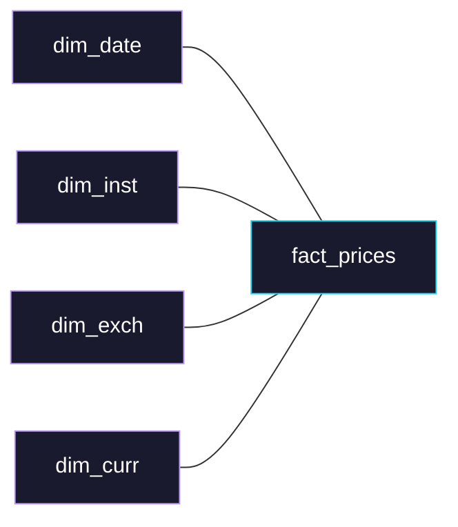
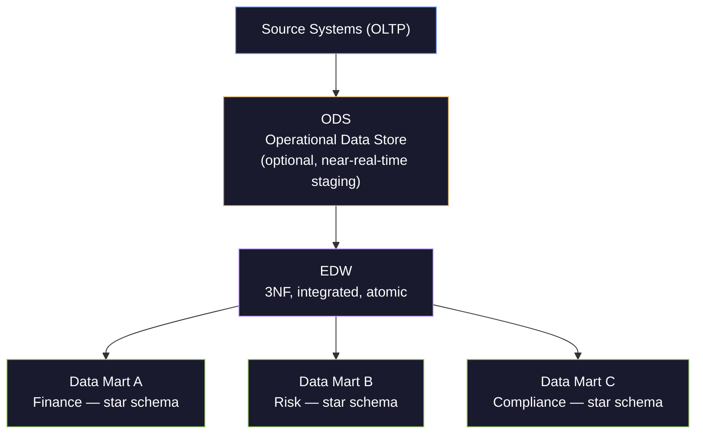

# Data Warehouse Architecture

> [!quote]
> "Dimension tables are the soul of the data warehouse."
> — **Ralph Kimball**

A **data warehouse** (DWH, also called an enterprise data warehouse or EDW) is a subject-oriented, integrated, non-volatile, and time-variant collection of data structured to support management decision-making. Unlike an OLTP database optimized for fast individual row writes, a data warehouse is purpose-built for OLAP — scanning millions of rows, aggregating across large time ranges, and answering complex multi-dimensional analytical questions at speed.

---

### OLTP vs OLAP: The Fundamental Distinction

Understanding why a data warehouse exists requires understanding what it is *not*.

| Dimension | OLTP (Online Transaction Processing) | OLAP (Online Analytical Processing) |
|---|---|---|
| **Primary workload** | INSERT / UPDATE / DELETE of individual rows | SELECT with aggregations over millions of rows |
| **Query pattern** | Simple, indexed lookups by primary key | Complex multi-table joins, GROUP BY, window functions |
| **Data model** | Third Normal Form (3NF) — minimizes redundancy | Denormalized (star/snowflake) — minimizes joins |
| **Optimization target** | Write throughput, row-level locks | Read throughput, full scans, columnar compression |
| **Row count** | Thousands to millions of live records | Billions to trillions of historical records |
| **Concurrency** | Hundreds of concurrent writers | Dozens of concurrent analysts |
| **Examples** | SQL Server OLTP, PostgreSQL, MySQL | BigQuery, Snowflake, Redshift, Azure Synapse |
| **Freshness** | Real-time / near-real-time | Batch (hourly, daily) or near-real-time |

> [!info] SQL Server Can Do Both
> SQL Server is primarily an OLTP system but supports OLAP workloads through columnstore indexes, read replicas (Always On Availability Groups readable secondaries), and In-Memory OLTP. See [always-on-availability-groups](https://alp78.github.io/elysium/04-SQL-Server/High-Availability/always-on-availability-groups) and [index-types-and-strategy](https://alp78.github.io/elysium/04-SQL-Server/Storage-and-Indexes/index-types-and-strategy) for the mechanics. BigQuery and Snowflake are purpose-built OLAP engines — they do not support row-level transactions or real-time writes at OLTP scale.

The core architectural implication: **OLTP → normalize to reduce write amplification. OLAP → denormalize to reduce join overhead at query time.**

---

## The Kimball Methodology: Dimensional Modeling

Ralph Kimball's *The Data Warehouse Toolkit* (first published 1996, now in its 3rd edition) defined the dimensional modeling approach that remains the dominant paradigm for analytical data warehouses. The Kimball methodology is bottom-up: build data marts first, integrated through shared conformed dimensions.

### The Grain Declaration

Before designing any fact table, you must declare the **grain** — the lowest level of detail that a single row represents. This is not optional and not adjustable later without a rebuild.

Examples of grain declarations:
- "One row per sales order line item"
- "One row per financial instrument per trading day"
- "One row per patient admission"
- "One row per page view"

The grain determines what goes in the fact table (the numeric measures at that grain) and what goes in the dimensions (the descriptive attributes of that grain).

> [!warning] Grain Violation Destroys Accuracy
> Mixing rows of different grains in a single fact table is one of the most destructive modeling errors. If your grain is "one row per order line" but you add a row representing the order header total, any SUM of amounts double-counts. Always state the grain in the table description comment and enforce it at load time.

### Star Schema

The canonical Kimball structure: one central **fact table** surrounded by **dimension tables** joined via surrogate keys. It looks like a star when drawn. See [dimensional-modeling](https://alp78.github.io/elysium/14-Data-Architecture/Data-Modeling/dimensional-modeling) for the full Kimball four-step design process with complete DDL examples.



#### Advantages of star schema
- Queries need only one join level (fact → dim) — no intermediate joins
- Optimizers handle star joins efficiently; BigQuery and Snowflake both recognize star patterns
- Analysts understand the pattern immediately — fact table contains measures, dims contain descriptions
- Conformed dimensions enable cross-process analysis

### Snowflake Schema

A normalized variant where dimension tables themselves have parent dimension tables, creating a multi-level hierarchy:

```
dim_product → dim_subcategory → dim_category
```

#### When to use snowflake schema
- Dimensions have very high cardinality attributes that would dominate table size
- Storage is severely constrained (less relevant in cloud)
- Strict normalization requirements from governance

> [!tip] Prefer Star Over Snowflake in Cloud Warehouses
> BigQuery and Snowflake store data in columnar compressed format. The storage penalty of denormalized star schemas is minimal compared to the query performance benefit of avoiding extra joins. In cloud DWH environments, choose star schema unless there is a specific, justified reason to normalize a dimension.

---

## Fact Table Types

Kimball identifies three fundamental fact table types based on the business process being modeled.

### Transactional Fact Table

**Grain:** One row per discrete business event.

This is the most common type. Each row records something that happened at a specific point in time. Measures are additive across all dimensions (you can SUM revenue across any combination of time, product, geography).

```sql
-- Transactional fact: one row per financial trade
CREATE TABLE fact_trades (
    trade_sk          BIGINT PRIMARY KEY,        -- surrogate key
    trade_id          VARCHAR(50),               -- degenerate dimension (source system key)
    date_sk           INT REFERENCES dim_date,
    instrument_sk     INT REFERENCES dim_instrument,
    counterparty_sk   INT REFERENCES dim_counterparty,
    venue_sk          INT REFERENCES dim_venue,
    -- measures (additive):
    quantity          DECIMAL(18,6),
    price             DECIMAL(18,6),
    notional_usd      DECIMAL(18,2),
    commission_usd    DECIMAL(18,2),
    -- metadata:
    load_timestamp    TIMESTAMP
);
```

#### Additive, semi-additive, and non-additive measures

| Measure type | SUM across time? | SUM across other dims? | Example |
|---|---|---|---|
| **Additive** | Yes | Yes | Revenue, quantity sold |
| **Semi-additive** | No | Yes | Account balance (summing balance across days double-counts) |
| **Non-additive** | No | No | Ratios, percentages, averages |

> [!warning] Semi-Additive Measure Trap
> Never SUM a balance or inventory count across time periods — you get the sum of every snapshot, not the current total. Use LAST_VALUE or MAX with appropriate window framing instead. See [gold-transforms](https://alp78.github.io/elysium/04-SQL-Server/Medallion-Project/gold-transforms) for practical patterns.

### Periodic Snapshot Fact Table

**Grain:** One row per entity per standard time period (day, week, month).

Takes a snapshot of a measured condition at regular intervals regardless of whether anything changed. Essential for trend analysis and period-over-period comparisons.

```sql
-- Periodic snapshot: daily account balance
CREATE TABLE fact_account_daily (
    snapshot_date_sk  INT REFERENCES dim_date,
    account_sk        INT REFERENCES dim_account,
    -- measures (semi-additive — can sum across accounts, NOT across dates):
    closing_balance   DECIMAL(18,2),
    open_positions    INT,
    margin_utilization DECIMAL(5,4),
    -- metadata:
    load_timestamp    TIMESTAMP,
    PRIMARY KEY (snapshot_date_sk, account_sk)
);
```

#### Periodic snapshot characteristics
- Rows are populated even when nothing changes (fill-forward logic required for missing periods)
- All rows for the same snapshot date are loaded in a single batch
- Enables easy period-over-period queries: join to itself on `date_sk - 1`
- See [silver-transforms](https://alp78.github.io/elysium/04-SQL-Server/Medallion-Project/silver-transforms) for fill-forward implementation patterns

### Accumulating Snapshot Fact Table

**Grain:** One row per workflow instance (updated as the workflow progresses through milestones).

Models a business process with a defined lifecycle: order → pick → pack → ship → deliver. A single row is **updated in place** as milestones are reached. This is the only fact table type where rows are updated after initial insert.

```sql
-- Accumulating snapshot: trade settlement lifecycle
CREATE TABLE fact_settlement_lifecycle (
    trade_sk              BIGINT PRIMARY KEY,
    -- milestone date FKs (NULL until milestone is reached):
    trade_date_sk         INT REFERENCES dim_date,
    confirmation_date_sk  INT REFERENCES dim_date,
    clearing_date_sk      INT REFERENCES dim_date,
    settlement_date_sk    INT REFERENCES dim_date,
    -- lag measures (days between milestones):
    days_to_confirm       INT,
    days_to_clear         INT,
    days_to_settle        INT,
    -- current status:
    lifecycle_status      VARCHAR(20)  -- TRADED | CONFIRMED | CLEARED | SETTLED | FAILED
);
```

---

## Dimension Table Patterns

### Conformed Dimensions

A dimension shared across multiple fact tables or data marts. The classic example: `dim_date` used by both `fact_sales` and `fact_inventory` with identical keys and attributes. Conformed dimensions are what make cross-process analysis possible — if both facts share the same date dimension, you can compare sales vs inventory by day in a single query.

> [!tip] Build dim_date Once, Use Everywhere
> Generate a complete date dimension covering 20+ years, populated once. It should include day of week, week number, fiscal calendar, holidays, trading day flags, and any domain-specific date attributes your business needs. Never compute these at query time — they belong in the dimension.

#### Standard dim_date columns for a financial data warehouse

```sql
CREATE TABLE dim_date (
    date_sk           INT PRIMARY KEY,           -- YYYYMMDD integer for fast joins
    full_date         DATE,
    year              SMALLINT,
    quarter           TINYINT,
    month             TINYINT,
    month_name        VARCHAR(9),
    week_of_year      TINYINT,
    day_of_week       TINYINT,                   -- 1=Monday ISO
    day_name          VARCHAR(9),
    is_weekend        BIT,
    is_trading_day    BIT,                       -- exchange-specific
    is_us_holiday     BIT,
    is_uk_holiday     BIT,
    fiscal_year       SMALLINT,                  -- fiscal calendar (may differ from calendar year)
    fiscal_quarter    TINYINT,
    fiscal_month      TINYINT
);
```

### Degenerate Dimensions

A dimension attribute that has no corresponding dimension table — it lives directly in the fact table as a key. Most commonly a transaction ID or order number from the source system that has no descriptive attributes worth modeling as a full dimension.

```sql
-- order_number is a degenerate dimension — it's a source system key
-- but "order" has no attributes of its own beyond what's already in the fact
fact_order_lines.order_number   VARCHAR(20)   -- degenerate dimension
```

### Junk Dimensions

A collection of low-cardinality flags and indicators that don't belong to any natural dimension. Rather than adding a dozen boolean columns to the fact table, group them into a single dimension.

```sql
-- Without junk dimension: 12 columns on fact table
fact_trade.is_short_sale       BIT
fact_trade.is_algorithmic      BIT
fact_trade.is_cross_listed     BIT
...

-- With junk dimension: one FK
fact_trade.trade_flag_sk       INT REFERENCES dim_trade_flags

-- dim_trade_flags has all combinations:
-- (is_short_sale, is_algorithmic, is_cross_listed) → small table (~8 rows for 3 booleans)
```

---

## Slowly Changing Dimensions (SCD)

Slowly Changing Dimensions (SCD), also called historical dimension tracking, handle the problem of dimension attributes that change over time. A customer moves city, a product changes category, an analyst changes desk. How you preserve (or discard) that history depends on the SCD type.

> [!info] SCD in dbt
> dbt's `snapshot` feature implements SCD Type 2 natively using a check strategy or a timestamp strategy. See [dbt-transformation-layer](https://alp78.github.io/elysium/14-Data-Architecture/Pipeline-Patterns/dbt-transformation-layer) for implementation details and [merge-and-upsert](https://alp78.github.io/elysium/04-SQL-Server/T-SQL/merge-and-upsert) for the underlying MERGE statement mechanics.

### SCD Type 1 — Overwrite (No History)

Overwrite the old value with the new value. No history is kept. Use when the old value is simply wrong (data correction) or when historical values are genuinely irrelevant to analysis.

```sql
-- Type 1: update in place
UPDATE dim_customer
SET city = 'London',
    region = 'EMEA'
WHERE customer_sk = 12345;
```

**Use when:** Correcting data quality errors. Customer's birth date was wrong and is now fixed — you never want to report on the wrong date.

**Avoid when:** The change represents a real business event with analytical meaning (then use Type 2).

### SCD Type 2 — Add Row (Full History)

Insert a new row for each change, marking the old row as expired. Every version of the record is permanently preserved with its effective date range. This is the most commonly used SCD type in practice.

```sql
-- Type 2: expire old row, insert new row
UPDATE dim_analyst
SET effective_end_date = CURRENT_DATE - INTERVAL '1 day',
    is_current = FALSE
WHERE analyst_id = 'A001'
  AND is_current = TRUE;

INSERT INTO dim_analyst (
    analyst_sk, analyst_id, name, desk, region,
    effective_start_date, effective_end_date, is_current
)
VALUES (
    nextval('analyst_sk_seq'), 'A001', 'Jane Smith', 'Equity Research', 'APAC',
    CURRENT_DATE, '9999-12-31', TRUE
);
```

#### Resulting table

| analyst_sk | analyst_id | desk | region | effective_start | effective_end | is_current |
|---|---|---|---|---|---|---|
| 101 | A001 | Fixed Income | EMEA | 2022-01-01 | 2024-06-30 | FALSE |
| 208 | A001 | Equity Research | APAC | 2024-07-01 | 9999-12-31 | TRUE |

**Joining to fact tables:** Always join on both the business key AND the effective date range to get the dimension version that was valid at the time of the transaction:

```sql
SELECT f.trade_date, a.desk, SUM(f.notional_usd)
FROM fact_trades f
JOIN dim_analyst a
  ON f.analyst_id = a.analyst_id
  AND f.trade_date BETWEEN a.effective_start_date AND a.effective_end_date
GROUP BY f.trade_date, a.desk;
```

**Use when:** You need to report "what was the analyst's desk at the time of the trade?" — the most common business requirement in financial data warehouses.

### SCD Type 3 — Previous Value Column

Add a column to store the previous value alongside the current value. Only one level of history is kept. Trades recency for simplicity.

```sql
ALTER TABLE dim_customer ADD COLUMN previous_city VARCHAR(100);

UPDATE dim_customer
SET previous_city = city,
    city = 'Manchester'
WHERE customer_sk = 12345;
```

**Use when:** Business users only ever compare current vs previous (e.g., "what changed last quarter?"). Rarely appropriate for analytical systems with genuine historical depth requirements.

**Limitation:** Only tracks one prior state. A third change overwrites the previous-value column, losing the intermediate history.

### SCD Type 4 — Mini-Dimension (Rapidly Changing Attributes)

Extract frequently changing attributes into a separate "mini-dimension" table, leaving the slowly changing attributes in the main dimension. The fact table carries FKs to both.

```sql
-- Main dimension: slowly changing
dim_customer(customer_sk, customer_id, name, date_of_birth, ...)

-- Mini-dimension: rapidly changing
dim_customer_profile(profile_sk, credit_score_band, income_band, risk_tier, eff_date)

-- Fact table carries both FKs:
fact_transactions(customer_sk, profile_sk, ...)
```

**Use when:** Some attributes change far more frequently than others, and tracking each change as a Type 2 row would explode the main dimension table. Common for behavioral scores, credit ratings, and risk tiers in financial systems.

### SCD Type 6 — Hybrid (1 + 2 + 3)

Combines Type 1, 2, and 3. Maintains full history (Type 2 rows) while also carrying the current value on all historical rows (Type 1 overwrite of a `current_*` column) and the previous value (Type 3). Maximally flexible but complex to implement and maintain.

```sql
-- Type 6 dimension: full history + current value on all rows
dim_customer (
    customer_sk           INT,
    customer_id           VARCHAR,          -- business key
    -- current value on ALL rows (Type 1 — keeps in sync across history):
    current_region        VARCHAR(50),
    -- historical value for THIS row's effective period (Type 2):
    region                VARCHAR(50),
    -- previous value (Type 3):
    previous_region       VARCHAR(50),
    -- Type 2 tracking:
    effective_start_date  DATE,
    effective_end_date    DATE,
    is_current            BIT
)
```

**Use when:** You need both: "what was the region at time of transaction?" (join on date range, use `region`) AND "what is this customer's current region?" (filter `is_current = 1`, use `current_region`). Avoids needing two separate queries.

---

## The Inmon Methodology: Enterprise Data Warehouse

Bill Inmon's approach is top-down: build an integrated, normalized Enterprise Data Warehouse (EDW) first in Third Normal Form (3NF), then derive department-specific data marts from it.

#### Inmon's 4 characteristics of a data warehouse
1. **Subject-oriented** — organized around subjects (Customer, Instrument, Position), not business processes
2. **Integrated** — single, consistent representation across all source systems
3. **Non-volatile** — data is never updated or deleted; only loaded
4. **Time-variant** — every record has a timestamp; history is preserved by design

#### The Inmon flow



The EDW itself is **not** queried by business users. It is a normalized integration layer. Business users query dimensional data marts derived from it.

### Kimball vs Inmon: Comparison

| Dimension | Kimball (Bottom-Up) | Inmon (Top-Down) |
|---|---|---|
| **Starting point** | Data marts first, EDW emerges | EDW first, data marts derived |
| **Data model** | Dimensional (star/snowflake) | 3NF normalized |
| **Time to first value** | Weeks (one mart at a time) | Months (EDW must exist first) |
| **Integration mechanism** | Conformed dimensions | Common EDW data model |
| **Query layer** | Directly on star schema | Data marts layered over EDW |
| **Flexibility** | High (add marts independently) | Lower (changes to EDW propagate) |
| **Consistency** | Good (via conformed dimensions) | Excellent (single source) |
| **Storage** | Higher (denormalized) | Lower (normalized) |
| **Organizational fit** | Agile, department-driven | Enterprise-wide governance |
| **Common in** | Mid-sized companies, cloud-native | Large enterprises, financial services |

> [!tip] In Practice: Hybrid Wins
> Most real-world warehouses are hybrid. A normalized staging/integration layer (Inmon-style) feeds dimensional data marts (Kimball-style). This is exactly what the [medallion-architecture](https://alp78.github.io/elysium/14-Data-Architecture/Pipeline-Patterns/medallion-architecture) implements: normalized Silver → denormalized Gold. The [dbt-transformation-layer](https://alp78.github.io/elysium/14-Data-Architecture/Pipeline-Patterns/dbt-transformation-layer) typically handles the Gold layer modeling.

---

## Data Vault 2.0

Data Vault 2.0 (DV2) is a third modeling methodology designed specifically for large enterprise warehouses that must integrate many source systems with evolving schemas and auditability requirements. It was designed by Dan Linstedt.

### Core Components

**Hubs** — The list of unique business keys for an entity. One row per business key, forever. No updates, ever.

```sql
CREATE TABLE hub_instrument (
    instrument_hk    BINARY(16) PRIMARY KEY,  -- hash of business key
    load_date        TIMESTAMP NOT NULL,
    record_source    VARCHAR(100) NOT NULL,    -- which system loaded this
    instrument_id    VARCHAR(50) NOT NULL      -- business key from source
);
```

**Links** — Relationships between hubs. One row per unique combination of related business keys.

```sql
CREATE TABLE link_trade_instrument (
    link_hk          BINARY(16) PRIMARY KEY,
    load_date        TIMESTAMP NOT NULL,
    record_source    VARCHAR(100) NOT NULL,
    -- FKs to hubs:
    trade_hk         BINARY(16) REFERENCES hub_trade,
    instrument_hk    BINARY(16) REFERENCES hub_instrument,
    counterparty_hk  BINARY(16) REFERENCES hub_counterparty
);
```

**Satellites** — Descriptive attributes of hubs and links. Support full history through effective date ranges. Each satellite tracks one "rate of change" grouping of attributes.

```sql
CREATE TABLE sat_instrument_market_data (
    instrument_hk    BINARY(16) REFERENCES hub_instrument,
    load_date        TIMESTAMP NOT NULL,        -- effective start (no end date — use next load_date)
    record_source    VARCHAR(100) NOT NULL,
    hash_diff        BINARY(16),                -- hash of all attributes for fast change detection
    -- attributes:
    last_price       DECIMAL(18,6),
    bid              DECIMAL(18,6),
    ask              DECIMAL(18,6),
    volume           BIGINT,
    PRIMARY KEY (instrument_hk, load_date)
);
```

### When to Use Data Vault

| Situation | Use Data Vault? |
|---|---|
| 5+ heterogeneous source systems that evolve independently | Yes |
| Strict auditability: every row must be traceable to source and load time | Yes |
| Schema changes are frequent and breaking | Yes |
| Single source of truth, well-understood schema | No — use Kimball |
| Small-to-medium team with tight delivery deadlines | No — Kimball faster |
| Real-time streaming loads at high velocity | Yes (DV2 is insert-only, parallel-friendly) |
| BI users query the warehouse directly | No — expose Kimball marts on top of DV2 |

> [!info] Data Vault + Kimball Together
> Most production DV2 implementations expose **Information Marts** (Kimball-style star schemas) on top of the DV2 raw vault for BI tools and analysts. The DV2 raw vault is the system of record; the information marts are the reporting layer. This maps directly to [medallion-architecture](https://alp78.github.io/elysium/14-Data-Architecture/Pipeline-Patterns/medallion-architecture) where Silver = DV2 raw vault, Gold = information marts.

---

### Cloud Data Warehouse Comparison

Modern cloud data warehouses have largely converged on columnar storage, MPP (Massively Parallel Processing) execution, and separation of compute from storage. The differences lie in pricing model, SQL dialect, ecosystem integrations, and operational characteristics.

| Dimension | BigQuery | Snowflake | Redshift | Azure Synapse |
|---|---|---|---|---|
| **Vendor** | Google Cloud | Independent (on AWS/Azure/GCP) | AWS | Microsoft |
| **Compute model** | Serverless (slots) or reservations | Virtual warehouses (auto-suspend) | Node-based clusters | DWU-based pools |
| **Pricing model** | Per-TB scanned (on-demand) or flat reservation | Per-second of active compute | Per-hour per node | Per-DWU-hour |
| **Storage** | Colossus (GCS-backed), auto-replicated | S3/ADLS/GCS, customer-managed | S3, customer-managed | ADLS Gen2 |
| **SQL dialect** | GoogleSQL (ANSI + extensions) | Snowflake SQL (ANSI + extensions) | PostgreSQL-based | T-SQL (SQL Server) |
| **Strengths** | Ad hoc queries, zero ops, GCP integration | Multi-cloud, data sharing, concurrency | AWS ecosystem, Redshift Spectrum | SQL Server continuity, Azure integration |
| **Weaknesses** | Cost unpredictability (on-demand), limited DML | Cost at scale, query contention | Operational overhead, no true serverless | Complex pricing, slower innovation |
| **External tables** | Yes (BigLake, GCS, Drive) | Yes (S3, Azure, GCS) | Yes (Redshift Spectrum) | Yes (ADLS, Blob) |
| **Time travel** | 7 days (INFORMATION_SCHEMA.TABLE_SNAPSHOTS) | 0–90 days (configurable) | No native | No native |
| **Best for** | GCP-native shops, ad hoc analytics | Multi-cloud, data sharing at scale | AWS shops, existing Redshift investment | Microsoft/Azure shops |

> [!tip] BigQuery Cost Control
> BigQuery on-demand pricing charges per byte scanned. The three most impactful cost controls: (1) partition tables on date columns — queries that filter on the partition key scan only matching partitions, (2) cluster tables by frequently-filtered columns, (3) never `SELECT *`. See [querying-and-cost-optimization](https://alp78.github.io/elysium/06-GCP/BigQuery/querying-and-cost-optimization) for dry run commands and detailed optimization practices.

---

## ELT vs ETL in Warehouse Context

Modern cloud warehouses favor **ELT** (Extract → Load → Transform) over traditional **ETL** (Extract → Transform → Load). The distinction matters because it determines where transformation compute runs and who pays for it.

#### ETL paradigm (legacy)
1. Extract from source
2. Transform in a middleware engine (Informatica, SSIS, Spark, Python)
3. Load clean data into warehouse

#### ELT paradigm (modern cloud)
1. Extract from source
2. Load raw data into warehouse (cheap columnar storage)
3. Transform inside the warehouse using SQL (leverages the warehouse's MPP engine)

> [!info] Why ELT Won
> Cloud warehouses have essentially unlimited compute at linear per-query cost. It is cheaper and simpler to run SQL transforms inside BigQuery than to spin up and maintain a separate Spark cluster. ELT also preserves the raw data (enabling re-derivation when business rules change) and leverages the warehouse's optimizer rather than fighting it.

See [dbt-transformation-layer](https://alp78.github.io/elysium/14-Data-Architecture/Pipeline-Patterns/dbt-transformation-layer) for the standard ELT implementation tool.

---

## Materialized Views, Aggregation Tables, and Pre-Computed Rollups

When analytical queries are expensive but predictable, pre-computing results reduces both latency and cost.

### Materialized Views

A materialized view persists the result of a query as physical storage, refreshed on a schedule or incrementally.

#### BigQuery materialized views
```sql
-- BigQuery: materialized view with incremental refresh
CREATE MATERIALIZED VIEW `project.dataset.daily_volume_mv`
OPTIONS (enable_refresh = true, refresh_interval_minutes = 60)
AS
SELECT
    DATE(trade_timestamp) AS trade_date,
    instrument_id,
    SUM(quantity)         AS total_volume,
    SUM(notional_usd)     AS total_notional
FROM `project.dataset.fact_trades`
GROUP BY 1, 2;
```

#### SQL Server materialized views (indexed views)
```sql
-- SQL Server: indexed view (must use SCHEMABINDING, WITH NOEXPAND hint)
CREATE VIEW dbo.vw_daily_volume
WITH SCHEMABINDING
AS
SELECT
    CAST(trade_timestamp AS DATE) AS trade_date,
    instrument_id,
    SUM(quantity)                 AS total_volume,
    COUNT_BIG(*)                  AS row_count        -- required by SQL Server
FROM dbo.fact_trades
GROUP BY CAST(trade_timestamp AS DATE), instrument_id;

CREATE UNIQUE CLUSTERED INDEX IX_vw_daily_volume
ON dbo.vw_daily_volume (trade_date, instrument_id);
```

### Aggregation Tables

Explicit pre-aggregated tables maintained by the ETL/ELT pipeline, not a database engine feature. More portable and controllable than materialized views.

```sql
-- Gold-layer aggregation table: monthly P&L summary
CREATE TABLE gold.monthly_pnl_summary (
    year_month          CHAR(7),       -- 'YYYY-MM'
    desk                VARCHAR(50),
    region              VARCHAR(50),
    total_trades        INT,
    total_notional      DECIMAL(18,2),
    realized_pnl        DECIMAL(18,2),
    unrealized_pnl      DECIMAL(18,2),
    net_pnl             DECIMAL(18,2),
    refreshed_at        TIMESTAMP
);
```

Load this table as part of the [gold-transforms](https://alp78.github.io/elysium/04-SQL-Server/Medallion-Project/gold-transforms) pipeline step on a daily cadence.

### Pre-Computed Rollups Pattern

For dashboards with fixed dimensions and known query patterns, pre-compute every combination at load time using a CUBE or ROLLUP query:

```sql
-- Pre-compute all rollup levels (SQL Server / BigQuery compatible)
INSERT INTO gold.pnl_rollup (trade_date, desk, region, currency, total_notional)
SELECT
    trade_date,
    GROUPING_ID(desk, region, currency) AS rollup_level,
    desk,
    region,
    currency,
    SUM(notional_usd) AS total_notional
FROM silver.trades
GROUP BY ROLLUP(trade_date, desk, region, currency);
```

---

## Warehouse Sizing and Cost Patterns

Cloud warehouses do not require traditional capacity planning, but understanding cost drivers prevents bill shock.

### BigQuery Cost Model

| Cost component | Driver | Optimization |
|---|---|---|
| **Query (on-demand)** | Bytes scanned per query | Partitioning, clustering, column selection |
| **Storage (active)** | Bytes in tables | Lifecycle policies, partition expiration |
| **Storage (long-term)** | Tables unmodified 90+ days | Automatically discounted 50% |
| **Streaming inserts** | Rows inserted via streaming API | Use batch loads where latency allows |
| **Slot reservations** | Fixed monthly commitment | Use when predictable high volume |

**Rule of thumb:** Tables over 1 TB should be partitioned. Tables over 10 TB should be both partitioned and clustered. See [querying-and-cost-optimization](https://alp78.github.io/elysium/06-GCP/BigQuery/querying-and-cost-optimization) for mechanics. For SQL Server warehouse tables, [partitioning-strategies](https://alp78.github.io/elysium/04-SQL-Server/Storage-and-Indexes/partitioning-strategies) covers partition functions, schemes, and sliding window maintenance.

### Snowflake Cost Model

| Cost component | Driver | Optimization |
|---|---|---|
| **Compute credits** | Warehouse size × active time | Auto-suspend (default 10 min), right-size XS→XL |
| **Storage** | Data + Time Travel + Fail-safe | Reduce Time Travel window for transient tables |
| **Cloud services** | Metadata, compilation | < 10% of compute = free; > 10% = extra charge |
| **Data transfer** | Cross-cloud egress | Avoid cross-cloud queries |

---

For guidance on building the metadata and context layers that make warehouse data self-describing and auditable, see [context-and-metadata-architecture](https://alp78.github.io/elysium/14-Data-Architecture/Architectures/context-and-metadata-architecture).

### Warehouse Architecture Checklist

Before declaring a warehouse schema production-ready, verify:

- [ ] Every fact table has an explicit **grain declaration** in its description
- [ ] All foreign keys join to the **same grain or higher** — no grain mixing
- [ ] Date dimension (`dim_date`) covers the full historical range plus 5 future years
- [ ] **Surrogate keys** (integers or hashes) are used for all joins — never business keys as FKs
- [ ] SCD Type 2 tables have `effective_start_date`, `effective_end_date`, and `is_current` columns
- [ ] Conformed dimensions are defined in a shared schema layer accessible to all marts
- [ ] All fact table measures are classified as additive, semi-additive, or non-additive in docs
- [ ] Materialized views or aggregation tables exist for the 5 most expensive recurring queries
- [ ] Partition pruning is verified for the primary query patterns (run EXPLAIN / dry run)
- [ ] Data quality checks run at load time (null rate, row count, min/max date assertions)

---

## Related Notes

- [data-lake-architecture](https://alp78.github.io/elysium/14-Data-Architecture/Architectures/data-lake-architecture) — The complementary storage architecture; data lakes feed data warehouses
- [medallion-architecture](https://alp78.github.io/elysium/14-Data-Architecture/Pipeline-Patterns/medallion-architecture) — Practical Bronze/Silver/Gold implementation pattern
- [open-table-formats](https://alp78.github.io/elysium/14-Data-Architecture/Architectures/open-table-formats) — Apache Iceberg, Delta Lake, and the lakehouse convergence of lake + warehouse
- [dbt-transformation-layer](https://alp78.github.io/elysium/14-Data-Architecture/Pipeline-Patterns/dbt-transformation-layer) — The standard tool for implementing ELT transforms in a warehouse
- [idempotent-pipeline-design](https://alp78.github.io/elysium/14-Data-Architecture/Pipeline-Patterns/idempotent-pipeline-design) — How to safely load and reload warehouse data
- [querying-and-cost-optimization](https://alp78.github.io/elysium/06-GCP/BigQuery/querying-and-cost-optimization) — BigQuery-specific cost optimization mechanics
- [merge-and-upsert](https://alp78.github.io/elysium/04-SQL-Server/T-SQL/merge-and-upsert) — MERGE statement for SCD Type 2 implementation in SQL Server
- [partitioning-strategies](https://alp78.github.io/elysium/04-SQL-Server/Storage-and-Indexes/partitioning-strategies) — SQL Server partitioning (compare to BigQuery partition pruning)
- [serialization-formats](https://alp78.github.io/elysium/14-Data-Architecture/Pipeline-Patterns/serialization-formats) — Parquet and columnar storage formats underpinning cloud DWH storage
- [silver-transforms](https://alp78.github.io/elysium/04-SQL-Server/Medallion-Project/silver-transforms) — Silver-layer cleaning patterns that feed warehouse staging
- [gold-transforms](https://alp78.github.io/elysium/04-SQL-Server/Medallion-Project/gold-transforms) — Gold-layer aggregation patterns for analytical consumption
- [five-pillars-of-data-engineering](https://alp78.github.io/elysium/14-Data-Architecture/five-pillars-of-data-engineering) — Architectural principles every DWH design should satisfy
