> [!info] ER Diagram Legend — Relationship Connectors

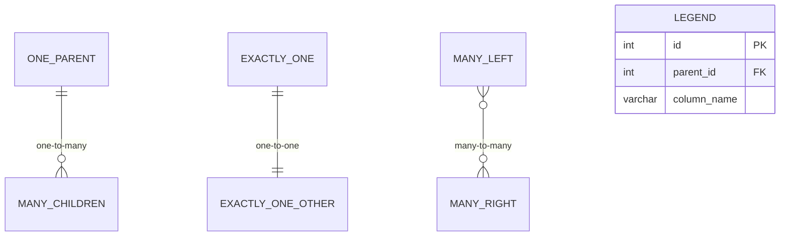

# Data Modeling Patterns

> [!quote]
> "I call it my billion-dollar mistake. It was the invention of the null reference in 1965."
> — **Tony Hoare**
>
> "The grain must be declared before choosing dimensions or facts because every candidate dimension or fact must be consistent with the grain."
> — **Ralph Kimball**

Data modeling is the discipline of deciding how to structure data for storage, retrieval, and analysis. The choice of model determines query performance, schema flexibility, load complexity, and the kinds of questions you can answer efficiently. Most practitioners default to dimensional modeling (star/snowflake) for analytics — and that is often correct — but it is only one pattern among many. Each model exists because it solves a specific class of problem better than the alternatives.

This note covers the broader landscape: **normalized (3NF)**, **Data Vault 2.0**, **wide/flat (OBT)**, **activity schema**, **document**, **graph**, and **time-series** models. All examples draw from a financial index provider domain — an organization that calculates and publishes market indices, maintains constituent lists, tracks daily valuations, and serves this data to institutional clients.

> [!info] Companion Note: Dimensional Modeling
> Star schemas, snowflake schemas, fact table types (transactional, periodic snapshot, accumulating snapshot), slowly changing dimensions (SCD Types 1–6), conformed dimensions, and the Kimball methodology are covered in detail in [data-warehouse-architecture](https://alp78.github.io/elysium/14-Data-Architecture/Architectures/data-warehouse-architecture). This note assumes familiarity with those concepts and focuses on the models that complement or replace dimensional modeling in specific contexts.

---

## Choosing a Data Model — Decision Framework

No single model is universally correct. The choice depends on the workload pattern, the query consumers, schema evolution requirements, and the team's operational capacity. Use this matrix as a starting point.

### Decision Matrix

| Model | Best For | Query Pattern | Schema Flexibility | Typical Tooling | Load Complexity |
|-------|---------|---------------|-------------------|-----------------|-----------------|
| **Dimensional** (star/snowflake) | BI dashboards, reports, slice-and-dice analysis | Aggregate, filter, group by | Fixed schema, planned changes | SQL Server, BigQuery, Snowflake | High (SCD logic, surrogate keys) |
| **Normalized (3NF)** | OLTP source systems, Inmon-style EDW staging | Point lookups, transactions, referential integrity | Fixed schema, formal migrations | SQL Server, PostgreSQL | Medium (FK constraints, cascades) |
| **Data Vault 2.0** | Enterprise warehouse, auditability, multi-source integration | Load-then-query, full history, traceable lineage | Additive (add hub/sat/link without restructuring) | SQL Server, Snowflake, BigQuery | Low per source (insert-only, parallel) |
| **Wide/Flat (OBT)** | Fast dashboards, BI tools that dislike joins | Full scan, filter, no joins | Denormalized, rigid (changes cascade) | BigQuery, ClickHouse, Snowflake | High (materialized from upstream) |
| **Activity Schema** | Event analytics, product analytics, audit trails | Event sequences, funnels, sessionization | Semi-structured (JSON payload per event type) | BigQuery, Snowflake | Low (append-only events) |
| **Document** | Operational apps, config stores, flexible hierarchies | Key-value, nested queries, real-time listeners | Fully flexible (schemaless) | Firestore, MongoDB | Low (direct writes) |
| **Graph** | Relationship analysis, network effects, shortest path | Traversals, centrality, pattern matching | Nodes + edges, property bags | Neo4j, BigQuery SQL graph, Neptune | Medium (node/edge ETL) |
| **Time-Series** | Metrics, IoT, market data, pipeline monitoring | Range scans, aggregation over time windows | Columnar, append-heavy, rarely updated | TimescaleDB, InfluxDB, BigQuery | Low (append-only) |

### Decision Flowchart

```
START: What is the primary consumer of this data?
│
├─► BI dashboards / analysts → Star Schema (see [data-warehouse-architecture](https://alp78.github.io/elysium/14-Data-Architecture/Architectures/data-warehouse-architecture))
│     └─► Sub-second response required, BI tool can't do joins? → OBT (Wide/Flat)
│
├─► OLTP application / transactional writes → Normalized (3NF)
│
├─► Enterprise integration hub (5+ sources, audit requirements) → Data Vault 2.0
│     └─► Analysts query it directly? → No, build Information Marts on top
│
├─► Event/product analytics ("what happened?") → Activity Schema
│
├─► Operational config / flexible hierarchy / real-time sync → Document (Firestore)
│
├─► "Who is connected to whom?" / relationship analysis → Graph
│
└─► Time-range scans over metrics / market data → Time-Series
```

> [!tip] In Practice: Multiple Models Coexist
> A mature data platform uses several models simultaneously. A financial index provider might store operational data in a normalized SQL Server database, load it into a Data Vault for enterprise integration, derive star schemas for BI reporting, materialize OBTs for dashboard performance, emit events into an activity schema for audit, store pipeline configuration in Firestore, and model corporate relationship networks as a graph. The question is not "which model?" but "which model for *this* layer and *this* consumer?"

---

## Normalized Modeling (3NF)

Third Normal Form (3NF) is the foundational relational model — the default for OLTP databases and the starting point for Inmon-style enterprise data warehouses. Normalization eliminates redundancy by decomposing data into the smallest logically independent tables, connected by foreign keys.

### When to Use

- **Source system / OLTP databases** — where write performance and data integrity matter more than read performance
- **Inmon-style EDW staging layer** — normalized integration before feeding dimensional marts
- **Compliance systems** — where referential integrity constraints enforce business rules at the database level
- **Any system where the same attribute must never be stored in two places** — master data management, reference data services

### When NOT to Use

- Analytical queries that aggregate across millions of rows (too many joins destroy performance)
- BI tools that generate SQL — most generate only simple star-schema-style queries
- BigQuery and cloud warehouses — joins are expensive in distributed systems; denormalization is preferred

### Normal Forms Explained

Each normal form eliminates a specific class of data anomaly.

**First Normal Form (1NF)** — Atomic values, no repeating groups.

```sql
-- VIOLATES 1NF: repeating group (multiple ISINs in one cell)
-- instrument_name | isins
-- 'Acme Corp'     | 'US0001,GB0001,DE0001'

-- SATISFIES 1NF: one row per ISIN
-- instrument_name | isin
-- 'Acme Corp'     | 'US0001'
-- 'Acme Corp'     | 'GB0001'
-- 'Acme Corp'     | 'DE0001'
```

**Second Normal Form (2NF)** — No partial dependencies on a composite key. Every non-key attribute must depend on the *entire* primary key, not just part of it.

```sql
-- VIOLATES 2NF: index_name depends only on index_id, not on (index_id, instrument_id)
-- Table: index_constituents(index_id, instrument_id, weight_pct, index_name)
--   index_name depends on index_id alone → partial dependency

-- FIX: move index_name to its own table
-- Table: indices(index_id PK, index_name)
-- Table: index_constituents(index_id FK, instrument_id FK, weight_pct)
```

**Third Normal Form (3NF)** — No transitive dependencies. No non-key attribute depends on another non-key attribute.

```sql
-- VIOLATES 3NF: sector_name depends on sector_code, which depends on instrument_id
-- Table: instruments(instrument_id PK, ticker, sector_code, sector_name)
--   instrument_id → sector_code → sector_name (transitive)

-- FIX: separate sector into its own table
-- Table: instruments(instrument_id PK, ticker, sector_code FK)
-- Table: sectors(sector_code PK, sector_name)
```

**Boyce-Codd Normal Form (BCNF)** — Every determinant is a candidate key. Handles edge cases where 3NF allows anomalies when multiple overlapping candidate keys exist.

> [!info] Practical Stopping Point
> In practice, 3NF is sufficient for almost all OLTP systems. BCNF, 4NF, and 5NF address increasingly rare anomalies. If your table is in 3NF and you are not seeing update anomalies, you do not need to go further.

### Financial Index Provider Example — Normalized Source System

Below is the complete DDL for a normalized operational database at an index provider. This is the OLTP system that manages instruments, indices, constituents, prices, and corporate actions.

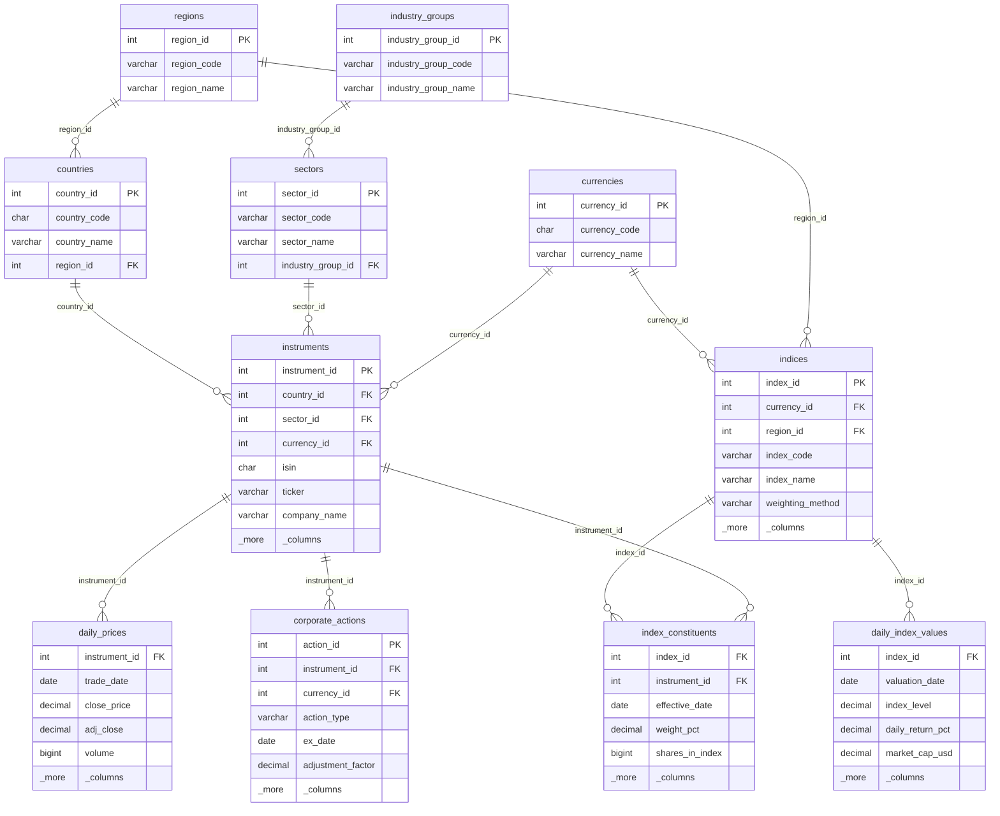

```sql
-- ============================================================
-- NORMALIZED SOURCE SYSTEM (3NF) — Financial Index Provider
-- SQL Server OLTP database
-- ============================================================

-- Reference: geographic hierarchy
CREATE TABLE dbo.regions (
    region_id       INT IDENTITY(1,1) PRIMARY KEY,
    region_code     VARCHAR(10)   NOT NULL UNIQUE,    -- 'EMEA', 'APAC', 'AMER'
    region_name     VARCHAR(100)  NOT NULL
);
```

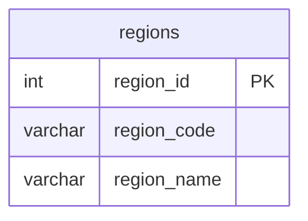

```sql
CREATE TABLE dbo.countries (
    country_id      INT IDENTITY(1,1) PRIMARY KEY,
    country_code    CHAR(2)       NOT NULL UNIQUE,    -- ISO 3166-1 alpha-2
    country_name    VARCHAR(100)  NOT NULL,
    region_id       INT           NOT NULL REFERENCES dbo.regions(region_id)
);
```

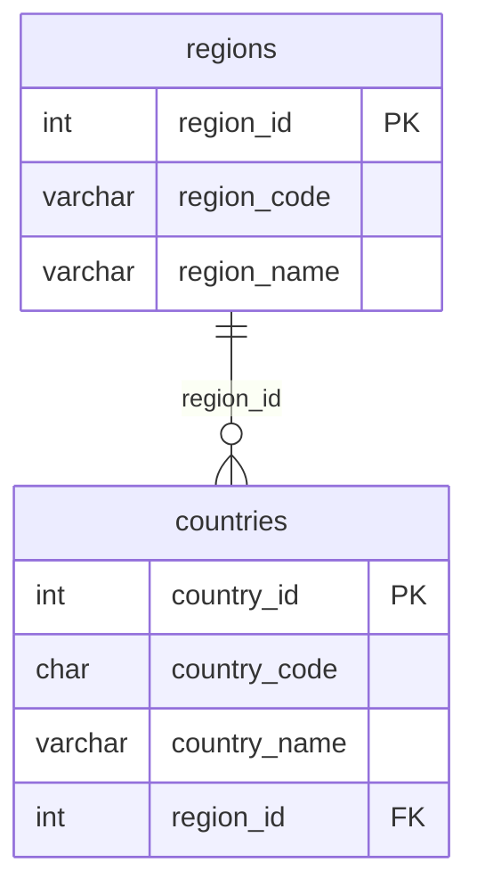

```sql
-- Reference: GICS sector hierarchy (normalized to 3NF)
CREATE TABLE dbo.industry_groups (
    industry_group_id   INT IDENTITY(1,1) PRIMARY KEY,
    industry_group_code VARCHAR(10)   NOT NULL UNIQUE,
    industry_group_name VARCHAR(200)  NOT NULL
);
```

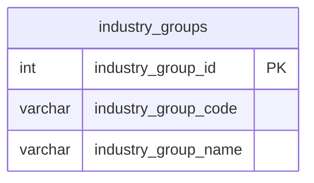

```sql
CREATE TABLE dbo.sectors (
    sector_id       INT IDENTITY(1,1) PRIMARY KEY,
    sector_code     VARCHAR(10)   NOT NULL UNIQUE,    -- GICS sector code
    sector_name     VARCHAR(200)  NOT NULL,
    industry_group_id INT         NOT NULL REFERENCES dbo.industry_groups(industry_group_id)
);
```

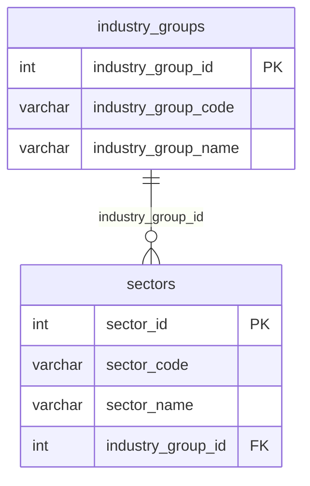

```sql
-- Reference: currencies
CREATE TABLE dbo.currencies (
    currency_id     INT IDENTITY(1,1) PRIMARY KEY,
    currency_code   CHAR(3)       NOT NULL UNIQUE,    -- ISO 4217
    currency_name   VARCHAR(100)  NOT NULL
);
```

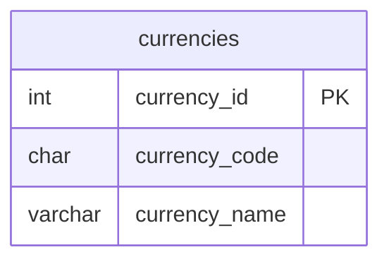

```sql
-- Core entity: financial instruments
CREATE TABLE dbo.instruments (
    instrument_id   INT IDENTITY(1,1) PRIMARY KEY,
    isin            CHAR(12)      NOT NULL UNIQUE,    -- International Securities Identification Number
    ticker          VARCHAR(20)   NOT NULL,
    company_name    VARCHAR(300)  NOT NULL,
    country_id      INT           NOT NULL REFERENCES dbo.countries(country_id),
    sector_id       INT           NOT NULL REFERENCES dbo.sectors(sector_id),
    currency_id     INT           NOT NULL REFERENCES dbo.currencies(currency_id),
    listing_date    DATE,
    status          VARCHAR(20)   NOT NULL DEFAULT 'active',   -- active, suspended, delisted
    created_at      DATETIME2     NOT NULL DEFAULT SYSUTCDATETIME(),
    updated_at      DATETIME2     NOT NULL DEFAULT SYSUTCDATETIME()
);

CREATE NONCLUSTERED INDEX IX_instruments_isin ON dbo.instruments(isin);
CREATE NONCLUSTERED INDEX IX_instruments_ticker ON dbo.instruments(ticker);
CREATE NONCLUSTERED INDEX IX_instruments_sector ON dbo.instruments(sector_id);
CREATE NONCLUSTERED INDEX IX_instruments_country ON dbo.instruments(country_id);
```

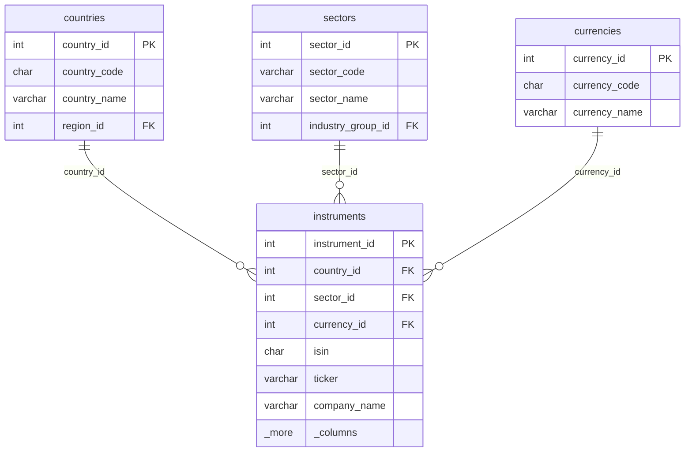

```sql
-- Core entity: market indices
CREATE TABLE dbo.indices (
    index_id        INT IDENTITY(1,1) PRIMARY KEY,
    index_code      VARCHAR(20)   NOT NULL UNIQUE,    -- 'EU_LARGE_CAP', 'GLOBAL_TECH'
    index_name      VARCHAR(300)  NOT NULL,
    currency_id     INT           NOT NULL REFERENCES dbo.currencies(currency_id),
    region_id       INT           NOT NULL REFERENCES dbo.regions(region_id),
    weighting_method VARCHAR(50)  NOT NULL,            -- 'free_float_market_cap', 'equal_weight', 'price_weighted'
    rebal_frequency VARCHAR(20)   NOT NULL,            -- 'quarterly', 'semi_annual', 'annual'
    base_date       DATE          NOT NULL,
    base_value      DECIMAL(18,6) NOT NULL DEFAULT 1000.000000,
    status          VARCHAR(20)   NOT NULL DEFAULT 'active',
    created_at      DATETIME2     NOT NULL DEFAULT SYSUTCDATETIME(),
    updated_at      DATETIME2     NOT NULL DEFAULT SYSUTCDATETIME()
);
```

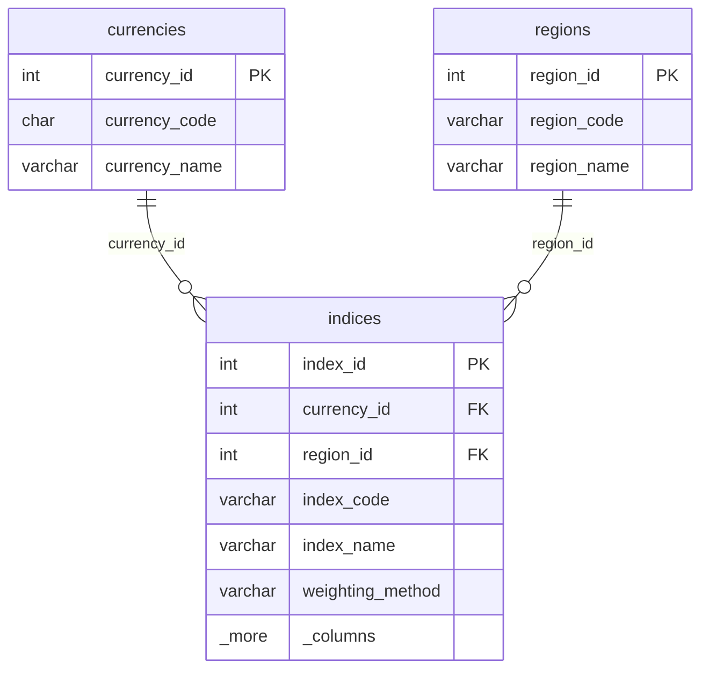

```sql
-- Relationship: which instruments are in which indices (many-to-many with temporal validity)
CREATE TABLE dbo.index_constituents (
    index_id        INT           NOT NULL REFERENCES dbo.indices(index_id),
    instrument_id   INT           NOT NULL REFERENCES dbo.instruments(instrument_id),
    effective_date  DATE          NOT NULL,
    end_date        DATE          NULL,               -- NULL = current constituent
    weight_pct      DECIMAL(10,6) NOT NULL,
    shares_in_index BIGINT,
    free_float_factor DECIMAL(5,4),
    CONSTRAINT PK_index_constituents PRIMARY KEY (index_id, instrument_id, effective_date)
);

CREATE NONCLUSTERED INDEX IX_constituents_instrument ON dbo.index_constituents(instrument_id);
```

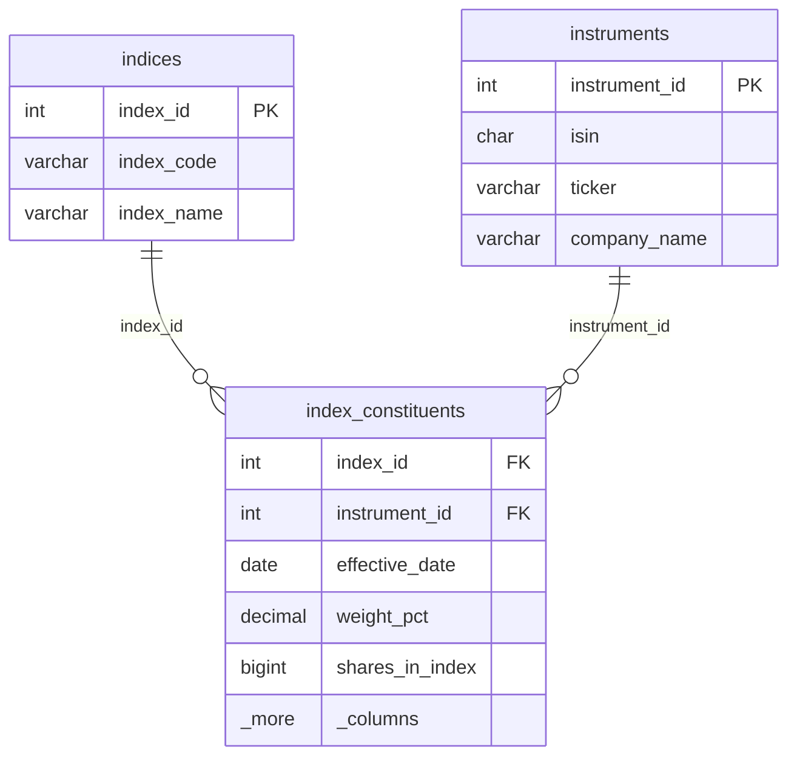

```sql
-- Time-series: daily prices
CREATE TABLE dbo.daily_prices (
    instrument_id   INT           NOT NULL REFERENCES dbo.instruments(instrument_id),
    trade_date      DATE          NOT NULL,
    open_price      DECIMAL(18,6),
    high_price      DECIMAL(18,6),
    low_price       DECIMAL(18,6),
    close_price     DECIMAL(18,6) NOT NULL,
    adj_close       DECIMAL(18,6) NOT NULL,
    volume          BIGINT,
    CONSTRAINT PK_daily_prices PRIMARY KEY (instrument_id, trade_date)
);
```

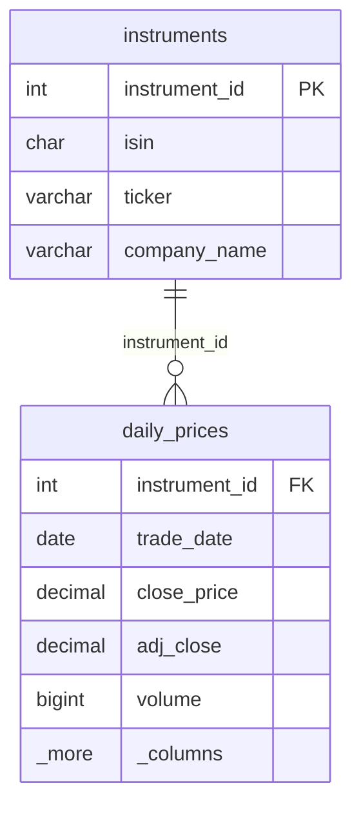

```sql
-- Time-series: daily index valuations
CREATE TABLE dbo.daily_index_values (
    index_id        INT           NOT NULL REFERENCES dbo.indices(index_id),
    valuation_date  DATE          NOT NULL,
    index_level     DECIMAL(18,6) NOT NULL,
    daily_return_pct DECIMAL(10,6),
    total_return_index DECIMAL(18,6),
    market_cap_usd  DECIMAL(22,2),
    num_constituents INT,
    CONSTRAINT PK_daily_index_values PRIMARY KEY (index_id, valuation_date)
);
```

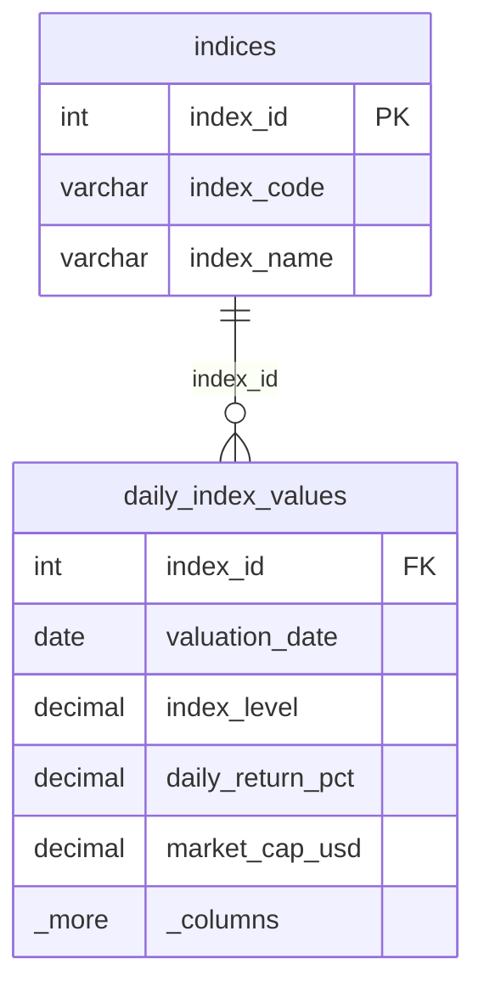

```sql
-- Corporate actions that affect instrument prices and index composition
CREATE TABLE dbo.corporate_actions (
    action_id       INT IDENTITY(1,1) PRIMARY KEY,
    instrument_id   INT           NOT NULL REFERENCES dbo.instruments(instrument_id),
    action_type     VARCHAR(30)   NOT NULL,            -- 'dividend', 'stock_split', 'rights_issue', 'merger', 'spin_off'
    ex_date         DATE          NOT NULL,
    record_date     DATE,
    payment_date    DATE,
    adjustment_factor DECIMAL(18,10),                  -- for splits: 2.0 means 2-for-1
    cash_amount     DECIMAL(18,6),                     -- for dividends
    currency_id     INT           REFERENCES dbo.currencies(currency_id),
    description     VARCHAR(1000),
    created_at      DATETIME2     NOT NULL DEFAULT SYSUTCDATETIME()
);

CREATE NONCLUSTERED INDEX IX_corpactions_instrument_date
    ON dbo.corporate_actions(instrument_id, ex_date);
```

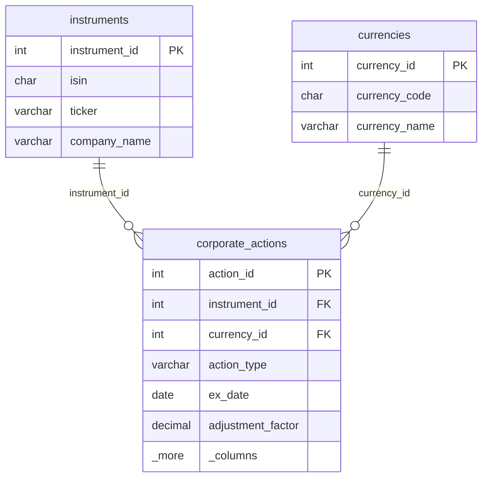

> [!note] Table Count
> 10 tables to represent what could be a single wide table in a denormalized model. This is the cost of normalization — more tables, more joins, less redundancy, stronger integrity constraints.

### The Join Problem — Why 3NF Fails for Analytics

The normalized model enforces data integrity, but answering analytical questions requires traversing many foreign key relationships. Consider this question:

> "What was the total market cap of all instruments in the European Large Cap index, broken down by sector, on 2026-03-22?"

```sql
-- 3NF query: 7 JOINs required
SELECT
    s.sector_name,
    ig.industry_group_name,
    COUNT(DISTINCT i.instrument_id)        AS num_instruments,
    SUM(dp.close_price * ic.shares_in_index) AS total_market_cap
FROM dbo.index_constituents ic
    JOIN dbo.indices idx       ON ic.index_id = idx.index_id
    JOIN dbo.instruments i     ON ic.instrument_id = i.instrument_id
    JOIN dbo.sectors s         ON i.sector_id = s.sector_id
    JOIN dbo.industry_groups ig ON s.industry_group_id = ig.industry_group_id
    JOIN dbo.daily_prices dp   ON i.instrument_id = dp.instrument_id
    JOIN dbo.countries c       ON i.country_id = c.country_id
    JOIN dbo.regions r         ON c.region_id = r.region_id
WHERE idx.index_code = 'EU_LARGE_CAP'
  AND dp.trade_date = '2026-03-22'
  AND ic.effective_date <= '2026-03-22'
  AND (ic.end_date IS NULL OR ic.end_date > '2026-03-22')
GROUP BY s.sector_name, ig.industry_group_name
ORDER BY total_market_cap DESC;
```

### Same Question in a Star Schema — 2 Joins

```sql
-- Star schema query: 2 JOINs (fact → dim_instrument, fact → dim_date)
SELECT
    di.sector_name,
    di.industry_group_name,
    COUNT(DISTINCT di.instrument_id)   AS num_instruments,
    SUM(f.market_cap_contribution)     AS total_market_cap
FROM gold.fact_index_valuation f
    JOIN gold.dim_instrument di  ON f.instrument_key = di.instrument_key
    JOIN gold.dim_date dd        ON f.date_key = dd.date_key
WHERE dd.full_date = '2026-03-22'
  AND f.index_code = 'EU_LARGE_CAP'    -- degenerate dimension
  AND di.is_current = 1
GROUP BY di.sector_name, di.industry_group_name
ORDER BY total_market_cap DESC;
```

#### Performance comparison on 10 years of daily data (~5M price rows, 50 instruments, ~130K constituent-day combinations)

| Metric | Normalized (3NF) | Star Schema |
|--------|-------------------|-------------|
| JOINs | 7 | 2 |
| Tables touched | 8 | 3 |
| Estimated scan (SQL Server) | ~2.1s (nested loop + hash joins) | ~0.3s (star join optimization) |
| Estimated scan (BigQuery) | ~4.2s (shuffle-heavy) | ~0.8s (broadcast join dims) |
| Developer cognitive load | High (must know FK graph) | Low (fact + dims) |

> [!warning] 3NF Is Not Wrong — It Is Wrong for Analytics
> Normalized models excel at what they are designed for: transactional integrity, write efficiency, and eliminating update anomalies. The problem arises when people query a normalized OLTP system for analytical purposes. The correct architecture is: **3NF for source → denormalized for analytics**. See [medallion-architecture](https://alp78.github.io/elysium/14-Data-Architecture/Pipeline-Patterns/medallion-architecture) for the layered approach.

---

## Data Vault 2.0

Data Vault 2.0 (DV2), designed by Dan Linstedt, is a modeling methodology purpose-built for enterprise data warehouses that must integrate many source systems, handle schema evolution gracefully, and provide full auditability. It sits between the raw source and the consumption layer — it is the integration and historization engine, not the reporting model.

For foundational DV2 concepts (hubs, links, satellites, when to use), see [data-warehouse-architecture](https://alp78.github.io/elysium/14-Data-Architecture/Architectures/data-warehouse-architecture). This section goes deeper into the financial index provider implementation.

### When to Use

- **5+ heterogeneous source systems** — instrument master data from vendor feeds, pricing from multiple providers, corporate actions from a separate system, client data from CRM, index methodology from internal systems
- **Audit and compliance requirements** — every row traceable to its source system and exact load timestamp
- **Agile development** — add new sources without restructuring existing tables (just add hubs, sats, and links)
- **Schema changes are frequent** — source systems evolve independently; DV2 absorbs changes in new satellites

### When NOT to Use

- Small team, single source system, fast delivery timeline — use Kimball directly
- BI users querying the warehouse directly — DV2 requires an information mart layer on top
- Real-time operational dashboards — the hub/link/sat join pattern adds latency

### Core Architecture

```
Source Systems (3NF OLTP)
        │
        ▼
  Staging Area (raw, truncate-reload per batch)
        │
        ▼
  Raw Vault (hubs + links + satellites — insert-only, full history)
        │
        ▼
  Business Vault (computed satellites — derived metrics, business rules)
        │
        ▼
  Information Mart (star schemas for BI — see [data-warehouse-architecture](https://alp78.github.io/elysium/14-Data-Architecture/Architectures/data-warehouse-architecture))
```

### Hub-Link-Satellite Pattern — Full DDL

The following implements a complete Data Vault for an index provider's core entities.

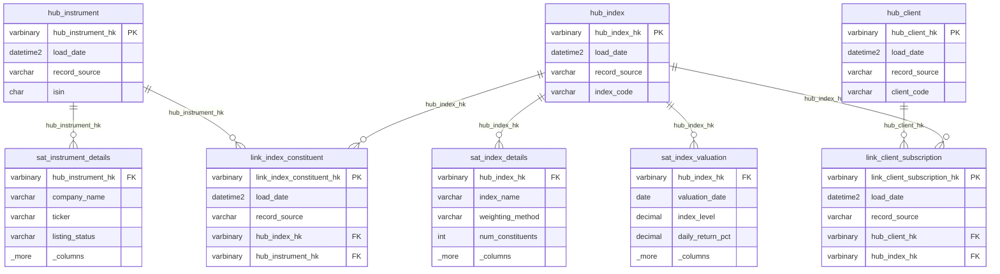

#### Hubs — Business Keys

Hubs store the unique business keys that identify real-world entities. One row per business key, forever. No updates, no deletes. If a source system sends the same instrument twice, only the first load creates the hub row.

```sql
-- ============================================================
-- DATA VAULT 2.0 — HUBS
-- ============================================================

-- Hub: Financial Instruments (identified by ISIN)
CREATE TABLE vault.hub_instrument (
    hub_instrument_hk   BINARY(32)    NOT NULL,   -- SHA-256 hash of ISIN
    load_date           DATETIME2     NOT NULL,
    record_source       VARCHAR(100)  NOT NULL,   -- 'vendor_feed_a', 'manual_upload'
    isin                CHAR(12)      NOT NULL,   -- business key
    CONSTRAINT PK_hub_instrument PRIMARY KEY (hub_instrument_hk)
);
```

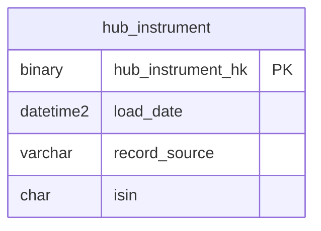

```sql
-- Hub: Market Indices (identified by index_code)
CREATE TABLE vault.hub_index (
    hub_index_hk        BINARY(32)    NOT NULL,   -- SHA-256 hash of index_code
    load_date           DATETIME2     NOT NULL,
    record_source       VARCHAR(100)  NOT NULL,
    index_code          VARCHAR(20)   NOT NULL,   -- business key
    CONSTRAINT PK_hub_index PRIMARY KEY (hub_index_hk)
);
```

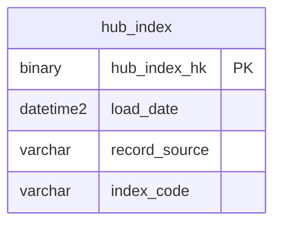

```sql
-- Hub: Clients (identified by client_code)
CREATE TABLE vault.hub_client (
    hub_client_hk       BINARY(32)    NOT NULL,   -- SHA-256 hash of client_code
    load_date           DATETIME2     NOT NULL,
    record_source       VARCHAR(100)  NOT NULL,
    client_code         VARCHAR(30)   NOT NULL,   -- business key
    CONSTRAINT PK_hub_client PRIMARY KEY (hub_client_hk)
);
```

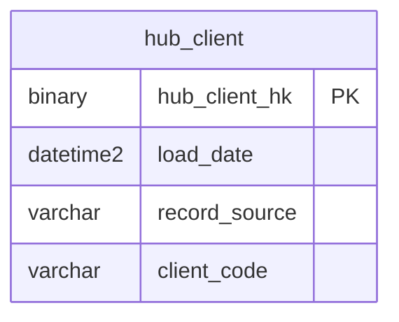

```sql
-- Hub: Sectors (identified by GICS sector_code)
CREATE TABLE vault.hub_sector (
    hub_sector_hk       BINARY(32)    NOT NULL,
    load_date           DATETIME2     NOT NULL,
    record_source       VARCHAR(100)  NOT NULL,
    sector_code         VARCHAR(10)   NOT NULL,   -- business key
    CONSTRAINT PK_hub_sector PRIMARY KEY (hub_sector_hk)
);
```

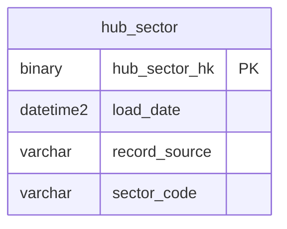

```sql
-- Hub: Countries (identified by ISO country_code)
CREATE TABLE vault.hub_country (
    hub_country_hk      BINARY(32)    NOT NULL,
    load_date           DATETIME2     NOT NULL,
    record_source       VARCHAR(100)  NOT NULL,
    country_code        CHAR(2)       NOT NULL,   -- business key
    CONSTRAINT PK_hub_country PRIMARY KEY (hub_country_hk)
);
```

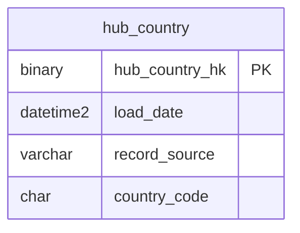

#### Links — Relationships Between Hubs

Links capture the many-to-many and many-to-one relationships between business keys. Like hubs, links are insert-only. A link row says "these two entities were related at some point" — the satellite on the link carries the temporal details.

```sql
-- ============================================================
-- DATA VAULT 2.0 — LINKS
-- ============================================================

-- Link: instrument is a constituent of an index
CREATE TABLE vault.link_index_constituent (
    link_index_constituent_hk  BINARY(32)   NOT NULL,  -- SHA-256(hub_index_hk + hub_instrument_hk)
    load_date                  DATETIME2    NOT NULL,
    record_source              VARCHAR(100) NOT NULL,
    hub_index_hk               BINARY(32)   NOT NULL REFERENCES vault.hub_index(hub_index_hk),
    hub_instrument_hk          BINARY(32)   NOT NULL REFERENCES vault.hub_instrument(hub_instrument_hk),
    CONSTRAINT PK_link_index_constituent PRIMARY KEY (link_index_constituent_hk)
);
```

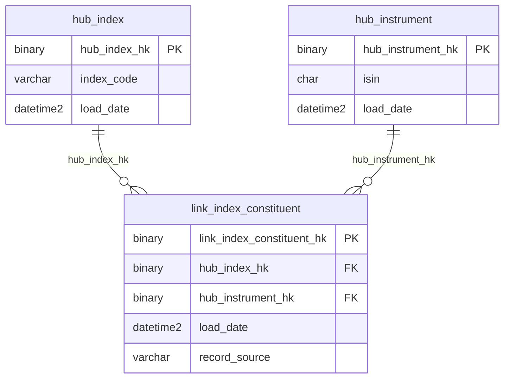

```sql
-- Link: client subscribes to an index data feed
CREATE TABLE vault.link_client_subscription (
    link_client_subscription_hk BINARY(32)  NOT NULL,
    load_date                   DATETIME2   NOT NULL,
    record_source               VARCHAR(100) NOT NULL,
    hub_client_hk               BINARY(32)  NOT NULL REFERENCES vault.hub_client(hub_client_hk),
    hub_index_hk                BINARY(32)  NOT NULL REFERENCES vault.hub_index(hub_index_hk),
    CONSTRAINT PK_link_client_subscription PRIMARY KEY (link_client_subscription_hk)
);
```

```mermaid
%% vault.link_client_subscription
erDiagram
    hub_client ||--o{ link_client_subscription : "hub_client_hk"
    hub_index ||--o{ link_client_subscription : "hub_index_hk"

    link_client_subscription {
        binary link_client_subscription_hk PK
        binary hub_client_hk FK
        binary hub_index_hk FK
        datetime2 load_date
        varchar record_source
    }
    hub_client {
        binary hub_client_hk PK
        varchar client_code
        datetime2 load_date
    }
    hub_index {
        binary hub_index_hk PK
        varchar index_code
        datetime2 load_date
    }
```

```sql
-- Link: instrument belongs to a sector
CREATE TABLE vault.link_instrument_sector (
    link_instrument_sector_hk  BINARY(32)   NOT NULL,
    load_date                  DATETIME2    NOT NULL,
    record_source              VARCHAR(100) NOT NULL,
    hub_instrument_hk          BINARY(32)   NOT NULL REFERENCES vault.hub_instrument(hub_instrument_hk),
    hub_sector_hk              BINARY(32)   NOT NULL REFERENCES vault.hub_sector(hub_sector_hk),
    CONSTRAINT PK_link_instrument_sector PRIMARY KEY (link_instrument_sector_hk)
);
```

```mermaid
%% vault.link_instrument_sector
erDiagram
    hub_instrument ||--o{ link_instrument_sector : "hub_instrument_hk"
    hub_sector ||--o{ link_instrument_sector : "hub_sector_hk"

    link_instrument_sector {
        binary link_instrument_sector_hk PK
        binary hub_instrument_hk FK
        binary hub_sector_hk FK
        datetime2 load_date
        varchar record_source
    }
    hub_instrument {
        binary hub_instrument_hk PK
        char isin
        datetime2 load_date
    }
    hub_sector {
        binary hub_sector_hk PK
        varchar sector_code
        datetime2 load_date
    }
```

```sql
-- Link: instrument is domiciled in a country
CREATE TABLE vault.link_instrument_country (
    link_instrument_country_hk BINARY(32)   NOT NULL,
    load_date                  DATETIME2    NOT NULL,
    record_source              VARCHAR(100) NOT NULL,
    hub_instrument_hk          BINARY(32)   NOT NULL REFERENCES vault.hub_instrument(hub_instrument_hk),
    hub_country_hk             BINARY(32)   NOT NULL REFERENCES vault.hub_country(hub_country_hk),
    CONSTRAINT PK_link_instrument_country PRIMARY KEY (link_instrument_country_hk)
);
```

```mermaid
%% vault.link_instrument_country
erDiagram
    hub_instrument ||--o{ link_instrument_country : "hub_instrument_hk"
    hub_country ||--o{ link_instrument_country : "hub_country_hk"

    link_instrument_country {
        binary link_instrument_country_hk PK
        binary hub_instrument_hk FK
        binary hub_country_hk FK
        datetime2 load_date
        varchar record_source
    }
    hub_instrument {
        binary hub_instrument_hk PK
        char isin
        datetime2 load_date
    }
    hub_country {
        binary hub_country_hk PK
        char country_code
        datetime2 load_date
    }
```

#### Satellites — Descriptive Attributes with Full History

Satellites carry the descriptive context for hubs and links. Every change to any attribute produces a new satellite row. The `hash_diff` column enables fast change detection without comparing every attribute individually.

```sql
-- ============================================================
-- DATA VAULT 2.0 — SATELLITES
-- ============================================================

-- Satellite on hub_instrument: descriptive details (changes tracked)
CREATE TABLE vault.sat_instrument_details (
    hub_instrument_hk   BINARY(32)    NOT NULL REFERENCES vault.hub_instrument(hub_instrument_hk),
    load_date           DATETIME2     NOT NULL,
    load_end_date       DATETIME2     NULL,       -- NULL = current version
    hash_diff           BINARY(32)    NOT NULL,   -- SHA-256 of all attribute values
    record_source       VARCHAR(100)  NOT NULL,
    -- descriptive attributes:
    company_name        VARCHAR(300),
    ticker              VARCHAR(20),
    country_code        CHAR(2),
    sector_code         VARCHAR(10),
    industry_group_code VARCHAR(10),
    currency_code       CHAR(3),
    market_cap_band     VARCHAR(20),              -- 'large_cap', 'mid_cap', 'small_cap'
    listing_status      VARCHAR(20),              -- 'active', 'suspended', 'delisted'
    free_float_pct      DECIMAL(5,2),
    CONSTRAINT PK_sat_instrument_details PRIMARY KEY (hub_instrument_hk, load_date)
);
```

```mermaid
%% vault.sat_instrument_details
erDiagram
    hub_instrument ||--o{ sat_instrument_details : "hub_instrument_hk"

    sat_instrument_details {
        binary hub_instrument_hk FK
        datetime2 load_date
        varchar company_name
        varchar ticker
        varchar listing_status
        _more _columns
    }
    hub_instrument {
        binary hub_instrument_hk PK
        char isin
        datetime2 load_date
    }
```

```sql
-- Satellite on hub_index: index metadata (changes tracked)
CREATE TABLE vault.sat_index_details (
    hub_index_hk        BINARY(32)    NOT NULL REFERENCES vault.hub_index(hub_index_hk),
    load_date           DATETIME2     NOT NULL,
    load_end_date       DATETIME2     NULL,
    hash_diff           BINARY(32)    NOT NULL,
    record_source       VARCHAR(100)  NOT NULL,
    -- descriptive attributes:
    index_name          VARCHAR(300),
    currency_code       CHAR(3),
    region_code         VARCHAR(10),
    weighting_method    VARCHAR(50),
    rebal_frequency     VARCHAR(20),
    num_constituents    INT,
    base_date           DATE,
    base_value          DECIMAL(18,6),
    methodology_version VARCHAR(10),
    CONSTRAINT PK_sat_index_details PRIMARY KEY (hub_index_hk, load_date)
);
```

```mermaid
%% vault.sat_index_details
erDiagram
    hub_index ||--o{ sat_index_details : "hub_index_hk"

    sat_index_details {
        binary hub_index_hk FK
        datetime2 load_date
        varchar index_name
        varchar weighting_method
        int num_constituents
        _more _columns
    }
    hub_index {
        binary hub_index_hk PK
        varchar index_code
        datetime2 load_date
    }
```

```sql
-- Satellite on hub_index: daily valuation metrics (time-series satellite)
CREATE TABLE vault.sat_index_valuation (
    hub_index_hk        BINARY(32)    NOT NULL REFERENCES vault.hub_index(hub_index_hk),
    load_date           DATETIME2     NOT NULL,
    hash_diff           BINARY(32)    NOT NULL,
    record_source       VARCHAR(100)  NOT NULL,
    -- measures:
    valuation_date      DATE          NOT NULL,
    index_level         DECIMAL(18,6),
    daily_return_pct    DECIMAL(10,6),
    total_return_index  DECIMAL(18,6),
    pe_ratio            DECIMAL(10,4),
    dividend_yield      DECIMAL(10,6),
    market_cap_usd      DECIMAL(22,2),
    CONSTRAINT PK_sat_index_valuation PRIMARY KEY (hub_index_hk, load_date)
);
```

```mermaid
%% vault.sat_index_valuation
erDiagram
    hub_index ||--o{ sat_index_valuation : "hub_index_hk"

    sat_index_valuation {
        binary hub_index_hk FK
        datetime2 load_date
        date valuation_date
        decimal index_level
        decimal daily_return_pct
        _more _columns
    }
    hub_index {
        binary hub_index_hk PK
        varchar index_code
        datetime2 load_date
    }
```

```sql
-- Satellite on hub_client: client details
CREATE TABLE vault.sat_client_details (
    hub_client_hk       BINARY(32)    NOT NULL REFERENCES vault.hub_client(hub_client_hk),
    load_date           DATETIME2     NOT NULL,
    load_end_date       DATETIME2     NULL,
    hash_diff           BINARY(32)    NOT NULL,
    record_source       VARCHAR(100)  NOT NULL,
    -- descriptive attributes:
    client_name         VARCHAR(300),
    client_type         VARCHAR(50),              -- 'asset_manager', 'bank', 'etf_provider', 'exchange'
    domicile_country    CHAR(2),
    regulatory_status   VARCHAR(30),
    contract_tier       VARCHAR(20),              -- 'enterprise', 'standard', 'trial'
    CONSTRAINT PK_sat_client_details PRIMARY KEY (hub_client_hk, load_date)
);
```

```mermaid
%% vault.sat_client_details
erDiagram
    hub_client ||--o{ sat_client_details : "hub_client_hk"

    sat_client_details {
        binary hub_client_hk FK
        datetime2 load_date
        varchar client_name
        varchar client_type
        varchar contract_tier
        _more _columns
    }
    hub_client {
        binary hub_client_hk PK
        varchar client_code
        datetime2 load_date
    }
```

```sql
-- Satellite on link_index_constituent: constituent weight and membership details
CREATE TABLE vault.sat_constituent_weight (
    link_index_constituent_hk  BINARY(32)   NOT NULL
        REFERENCES vault.link_index_constituent(link_index_constituent_hk),
    load_date                  DATETIME2    NOT NULL,
    load_end_date              DATETIME2    NULL,
    hash_diff                  BINARY(32)   NOT NULL,
    record_source              VARCHAR(100) NOT NULL,
    -- attributes:
    effective_date             DATE         NOT NULL,
    end_date                   DATE,
    weight_pct                 DECIMAL(10,6),
    shares_in_index            BIGINT,
    free_float_factor          DECIMAL(5,4),
    capping_applied            BIT,
    CONSTRAINT PK_sat_constituent_weight PRIMARY KEY (link_index_constituent_hk, load_date)
);
```

```mermaid
%% vault.sat_constituent_weight
erDiagram
    link_index_constituent ||--o{ sat_constituent_weight : "link_index_constituent_hk"

    sat_constituent_weight {
        binary link_index_constituent_hk FK
        datetime2 load_date
        date effective_date
        decimal weight_pct
        bigint shares_in_index
        _more _columns
    }
    link_index_constituent {
        binary link_index_constituent_hk PK
        binary hub_index_hk FK
        binary hub_instrument_hk FK
    }
```

```sql
-- Satellite on link_client_subscription: subscription details
CREATE TABLE vault.sat_subscription_details (
    link_client_subscription_hk BINARY(32)  NOT NULL
        REFERENCES vault.link_client_subscription(link_client_subscription_hk),
    load_date                   DATETIME2   NOT NULL,
    load_end_date               DATETIME2   NULL,
    hash_diff                   BINARY(32)  NOT NULL,
    record_source               VARCHAR(100) NOT NULL,
    -- attributes:
    subscription_start_date     DATE,
    subscription_end_date       DATE,
    delivery_format             VARCHAR(30),  -- 'api', 'sftp', 'email'
    delivery_frequency          VARCHAR(20),  -- 'real_time', 'end_of_day', 'weekly'
    license_type                VARCHAR(30),  -- 'internal_use', 'redistribution', 'derived_product'
    CONSTRAINT PK_sat_subscription_details PRIMARY KEY (link_client_subscription_hk, load_date)
);
```

```mermaid
%% vault.sat_subscription_details
erDiagram
    link_client_subscription ||--o{ sat_subscription_details : "link_client_subscription_hk"

    sat_subscription_details {
        binary link_client_subscription_hk FK
        datetime2 load_date
        date subscription_start_date
        varchar delivery_format
        varchar license_type
        _more _columns
    }
    link_client_subscription {
        binary link_client_subscription_hk PK
        binary hub_client_hk FK
        binary hub_index_hk FK
    }
```

### Hash Keys and Hash Diffs — The Mechanics

**Hash Keys** make DV2 loading deterministic and parallelizable.

```sql
-- Computing a hash key: deterministic, same input always produces same output
-- SQL Server:
SELECT HASHBYTES('SHA2_256', UPPER(TRIM(isin))) AS hub_instrument_hk
FROM staging.stg_instruments;

-- BigQuery:
SELECT SHA256(UPPER(TRIM(isin))) AS hub_instrument_hk
FROM staging.stg_instruments;

-- Link hash key: concatenation of parent hub hash keys
SELECT HASHBYTES('SHA2_256',
    CONCAT(
        CONVERT(VARCHAR(64), hub_index_hk, 2),
        '||',
        CONVERT(VARCHAR(64), hub_instrument_hk, 2)
    )
) AS link_index_constituent_hk;
```

**Hash Diffs** detect attribute changes without comparing every column.

```sql
-- Hash diff: hash of all satellite attributes (not the key, not metadata)
SELECT HASHBYTES('SHA2_256',
    CONCAT_WS('||',
        ISNULL(company_name, ''),
        ISNULL(ticker, ''),
        ISNULL(country_code, ''),
        ISNULL(sector_code, ''),
        ISNULL(CAST(free_float_pct AS VARCHAR), '')
    )
) AS hash_diff;

-- Loading pattern: only insert new satellite row if hash_diff changed
INSERT INTO vault.sat_instrument_details (hub_instrument_hk, load_date, hash_diff, record_source, ...)
SELECT
    stg.hub_instrument_hk,
    SYSUTCDATETIME(),
    stg.hash_diff,
    'vendor_feed_a',
    stg.company_name, stg.ticker, ...
FROM staging.stg_instruments stg
LEFT JOIN vault.sat_instrument_details sat
    ON stg.hub_instrument_hk = sat.hub_instrument_hk
    AND sat.load_end_date IS NULL                      -- current version only
WHERE sat.hub_instrument_hk IS NULL                    -- new instrument
   OR sat.hash_diff <> stg.hash_diff;                  -- attributes changed
```

> [!tip] MD5 vs SHA-256 for Hash Keys
> MD5 (16 bytes) is faster but has known collision vulnerabilities. SHA-256 (32 bytes) is collision-resistant but uses more storage. For Data Vault hash keys, **collision risk matters** — a collision would merge two different business entities into one hub row. Use SHA-256 for production vaults. MD5 is acceptable for development and testing only.

### Loading Pattern — Stage to Information Mart

```
1. STAGE:      Truncate staging tables, load raw source data
2. RAW VAULT:  Insert new hubs (business keys not yet seen)
               Insert new links (relationships not yet seen)
               Insert new satellites (changed attributes only, via hash_diff)
3. BIZ VAULT:  Compute derived satellites (business rules, aggregations)
4. INFO MART:  Rebuild/refresh star schemas for BI consumption
```

```sql
-- Step 1: Stage (truncate and reload from source)
TRUNCATE TABLE staging.stg_instruments;
INSERT INTO staging.stg_instruments (isin, ticker, company_name, country_code, sector_code, ...)
SELECT isin, ticker, company_name, country_code, sector_code, ...
FROM source_system.dbo.instruments;

-- Step 2a: Load hub (insert only new business keys)
INSERT INTO vault.hub_instrument (hub_instrument_hk, load_date, record_source, isin)
SELECT
    HASHBYTES('SHA2_256', UPPER(TRIM(stg.isin))),
    SYSUTCDATETIME(),
    'oltp_instruments',
    stg.isin
FROM staging.stg_instruments stg
WHERE NOT EXISTS (
    SELECT 1 FROM vault.hub_instrument h
    WHERE h.hub_instrument_hk = HASHBYTES('SHA2_256', UPPER(TRIM(stg.isin)))
);

-- Step 2b: Load satellite (insert only changed records)
-- First, close out the current version for any changed records
UPDATE sat
SET sat.load_end_date = SYSUTCDATETIME()
FROM vault.sat_instrument_details sat
JOIN staging.stg_instruments stg
    ON sat.hub_instrument_hk = HASHBYTES('SHA2_256', UPPER(TRIM(stg.isin)))
WHERE sat.load_end_date IS NULL
  AND sat.hash_diff <> stg.computed_hash_diff;

-- Then insert the new version
INSERT INTO vault.sat_instrument_details (hub_instrument_hk, load_date, load_end_date, hash_diff, record_source, ...)
SELECT
    HASHBYTES('SHA2_256', UPPER(TRIM(stg.isin))),
    SYSUTCDATETIME(),
    NULL,   -- current version
    stg.computed_hash_diff,
    'oltp_instruments',
    stg.company_name, stg.ticker, stg.country_code, stg.sector_code, ...
FROM staging.stg_instruments stg
LEFT JOIN vault.sat_instrument_details sat
    ON HASHBYTES('SHA2_256', UPPER(TRIM(stg.isin))) = sat.hub_instrument_hk
    AND sat.load_end_date IS NULL
WHERE sat.hub_instrument_hk IS NULL           -- new instrument
   OR sat.hash_diff <> stg.computed_hash_diff; -- changed attributes
```

### Business Vault — Computed Satellites

The Business Vault extends the Raw Vault with derived, computed attributes that apply business rules. These are satellites that do not come directly from a source system.

```sql
-- Business Vault: computed satellite with derived metrics per index
CREATE TABLE vault.bsat_index_risk_metrics (
    hub_index_hk        BINARY(32)    NOT NULL REFERENCES vault.hub_index(hub_index_hk),
    load_date           DATETIME2     NOT NULL,
    hash_diff           BINARY(32)    NOT NULL,
    record_source       VARCHAR(100)  NOT NULL DEFAULT 'business_vault',
    -- derived metrics (computed from raw vault data):
    calculation_date    DATE          NOT NULL,
    volatility_30d      DECIMAL(10,6),    -- 30-day rolling std dev of daily returns
    max_drawdown_ytd    DECIMAL(10,6),    -- max peak-to-trough decline year-to-date
    sharpe_ratio_1y     DECIMAL(10,6),    -- annualized Sharpe ratio (1yr)
    tracking_error_vs_benchmark DECIMAL(10,6),
    concentration_hhi   DECIMAL(10,6),    -- Herfindahl-Hirschman Index of constituent weights
    CONSTRAINT PK_bsat_index_risk PRIMARY KEY (hub_index_hk, load_date)
);
```

```mermaid
%% vault.bsat_index_risk_metrics
erDiagram
    hub_index ||--o{ bsat_index_risk_metrics : "hub_index_hk"

    bsat_index_risk_metrics {
        binary hub_index_hk FK
        datetime2 load_date
        date calculation_date
        decimal volatility_30d
        decimal sharpe_ratio_1y
        _more _columns
    }
    hub_index {
        binary hub_index_hk PK
        varchar index_code
        datetime2 load_date
    }
```

### Data Vault vs Dimensional vs 3NF — Detailed Comparison

| Factor | 3NF (Normalized) | Dimensional (Star) | Data Vault 2.0 |
|--------|-------------------|---------------------|-----------------|
| **Primary purpose** | OLTP, source system | BI reporting, analytics | Enterprise integration, historization |
| **Load complexity** | Medium (FK constraints) | High (SCD logic, surrogate keys) | Low per source (insert-only, hash-based) |
| **Query performance** | Low (many joins) | High (star join optimization) | Medium (needs information mart for BI) |
| **Schema evolution** | Hard (ALTER TABLE cascades) | Medium (add dims/facts) | Easy (add hub/sat/link, nothing breaks) |
| **Auditability** | Low (overwrites lose history) | Medium (SCD2 preserves versions) | Full (every version, every source, every timestamp) |
| **Multi-source integration** | Hard (merge conflicts) | Hard (conformed dimensions across sources) | Native (each source loads independently) |
| **Team size** | Small | Medium | Medium to Large |
| **Time to first value** | Days | Weeks | Weeks to Months |
| **Parallel loading** | Limited (FK ordering) | Limited (dim before fact) | High (hubs, links, sats load independently) |
| **Best for** | Source systems | BI consumption layer | Enterprise integration hub |

---

## Wide / Flat Table (One Big Table — OBT)

The One Big Table (OBT) pattern takes denormalization to its logical extreme: join everything into a single wide table with dozens or hundreds of columns. Every query becomes a simple `SELECT ... FROM one_table WHERE ...` with no joins.

### When to Use

- **Sub-second dashboard response** — BI tools render faster when they scan one pre-joined table
- **BI tools that struggle with joins** — Looker, Metabase, and some Tableau configurations generate suboptimal SQL for multi-table queries
- **BigQuery** — optimized for full table scans; joins are expensive because they require data shuffling across nodes
- **ClickHouse** — designed for wide, denormalized tables with columnar compression
- **Embedded analytics** — where query latency directly impacts user experience

### When NOT to Use

- Upstream source of truth — OBTs should always be derived from a properly modeled upstream layer
- When schema changes are frequent — every upstream change requires rebuilding the entire OBT
- When data freshness is critical — OBTs are typically materialized on a schedule

### Pattern

```
Upstream (star schema / Data Vault / normalized)
        │
        ▼
  Materialization Query (scheduled: hourly, daily, on-demand)
        │
        ▼
  One Big Table (pre-joined, denormalized, partitioned/clustered)
        │
        ▼
  BI Tool (direct table scan, no joins, filter + aggregate)
```

### Financial Index Provider Example — Daily Index Wide Table

```mermaid
erDiagram
    %% One Big Table — Denormalized
    daily_index_wide {
        date valuation_date PK
        varchar index_code PK
        varchar index_name
        decimal index_level
        decimal daily_return_pct
        _more _columns
    }
```

```sql
-- ============================================================
-- ONE BIG TABLE (OBT) — BigQuery
-- Materialized daily from upstream star schema
-- ============================================================

CREATE OR REPLACE TABLE analytics.daily_index_wide
PARTITION BY valuation_date
CLUSTER BY index_code, region_code
AS
SELECT
    -- Date attributes (from dim_date)
    dd.full_date                    AS valuation_date,
    dd.year                         AS calendar_year,
    dd.quarter                      AS calendar_quarter,
    dd.month                        AS calendar_month,
    dd.month_name,
    dd.day_of_week,
    dd.day_name,
    dd.is_trading_day,
    dd.is_weekend,
    dd.fiscal_year,
    dd.fiscal_quarter,

    -- Index attributes (from dim_index)
    di.index_code,
    di.index_name,
    di.region_code,
    di.region_name,
    di.currency_code,
    di.weighting_method,
    di.rebal_frequency,
    di.base_date,
    di.base_value,
    di.methodology_version,

    -- Valuation measures (from fact_index_valuation)
    f.index_level,
    f.daily_return_pct,
    f.total_return_index,
    f.market_cap_usd,
    f.pe_ratio,
    f.dividend_yield,
    f.num_constituents,

    -- Derived measures (computed at materialization time)
    f.index_level / NULLIF(LAG(f.index_level) OVER (
        PARTITION BY di.index_code ORDER BY dd.full_date
    ), 0) - 1                       AS daily_return_calculated,

    AVG(f.daily_return_pct) OVER (
        PARTITION BY di.index_code ORDER BY dd.full_date
        ROWS BETWEEN 19 PRECEDING AND CURRENT ROW
    )                               AS avg_return_20d,

    STDDEV(f.daily_return_pct) OVER (
        PARTITION BY di.index_code ORDER BY dd.full_date
        ROWS BETWEEN 29 PRECEDING AND CURRENT ROW
    ) * SQRT(252)                   AS annualized_volatility_30d,

    MAX(f.index_level) OVER (
        PARTITION BY di.index_code ORDER BY dd.full_date
        ROWS BETWEEN 252 PRECEDING AND CURRENT ROW
    )                               AS high_52w,

    MIN(f.index_level) OVER (
        PARTITION BY di.index_code ORDER BY dd.full_date
        ROWS BETWEEN 252 PRECEDING AND CURRENT ROW
    )                               AS low_52w,

    -- Year-to-date return
    f.index_level / NULLIF(FIRST_VALUE(f.index_level) OVER (
        PARTITION BY di.index_code, dd.year ORDER BY dd.full_date
    ), 0) - 1                       AS ytd_return

FROM gold.fact_index_valuation f
JOIN gold.dim_date dd         ON f.date_key = dd.date_key
JOIN gold.dim_index di        ON f.index_key = di.index_key
WHERE di.is_current = 1
  AND dd.is_trading_day = TRUE;
```

```mermaid
%% analytics.daily_index_wide
erDiagram
    daily_index_wide {
        date valuation_date PK
        varchar index_code PK
        varchar index_name
        decimal index_level
        decimal daily_return_pct
        _more _columns
    }
```

### Constituent-Level OBT

For more granular analysis, a constituent-level OBT includes instrument details alongside index membership.

```sql
CREATE OR REPLACE TABLE analytics.daily_constituent_wide
PARTITION BY valuation_date
CLUSTER BY index_code, instrument_isin
AS
SELECT
    dd.full_date                    AS valuation_date,
    dd.year, dd.quarter, dd.month, dd.day_name, dd.is_trading_day,

    -- Index context
    di.index_code, di.index_name, di.region_code, di.currency_code,

    -- Instrument context
    dinst.isin                      AS instrument_isin,
    dinst.ticker                    AS instrument_ticker,
    dinst.company_name,
    dinst.country_code,
    dinst.country_name,
    dinst.sector_name,
    dinst.industry_group_name,
    dinst.market_cap_band,

    -- Constituent membership
    bc.weight_pct,
    bc.shares_in_index,
    bc.free_float_factor,

    -- Price data
    fp.close_price,
    fp.adj_close,
    fp.volume,
    fp.daily_return_pct,

    -- Contribution to index
    bc.weight_pct * fp.daily_return_pct / 100.0  AS return_contribution_pct

FROM gold.fact_constituent_daily bc
JOIN gold.dim_date dd             ON bc.date_key = dd.date_key
JOIN gold.dim_index di            ON bc.index_key = di.index_key
JOIN gold.dim_instrument dinst    ON bc.instrument_key = dinst.instrument_key
JOIN gold.fact_daily_price fp     ON bc.instrument_key = fp.instrument_key
                                  AND bc.date_key = fp.date_key
WHERE dinst.is_current = 1
  AND di.is_current = 1;
```

```mermaid
%% analytics.daily_constituent_wide
erDiagram
    daily_constituent_wide {
        date valuation_date PK
        varchar index_code PK
        varchar instrument_isin PK
        decimal weight_pct
        decimal daily_return_pct
        _more _columns
    }
```

### Querying the OBT

```sql
-- No joins needed — just filter and aggregate
-- "Top 5 sectors by market cap contribution to European Large Cap, Q1 2026"
SELECT
    sector_name,
    COUNT(DISTINCT instrument_isin)    AS num_instruments,
    SUM(weight_pct)                    AS total_weight_pct,
    AVG(daily_return_pct)              AS avg_daily_return
FROM analytics.daily_constituent_wide
WHERE index_code = 'EU_LARGE_CAP'
  AND calendar_year = 2026
  AND calendar_quarter = 1
  AND is_trading_day = TRUE
GROUP BY sector_name
ORDER BY total_weight_pct DESC
LIMIT 5;
```

### OBT Refresh Strategies

| Strategy | Mechanism | Freshness | Cost |
|----------|-----------|-----------|------|
| **Scheduled query** | BigQuery scheduled query or Airflow DAG | Hourly / daily | Full rebuild each run |
| **Materialized view** | `CREATE MATERIALIZED VIEW` (BigQuery) | Auto-refreshed by engine | Engine decides when to refresh |
| **Incremental** | dbt incremental model with `merge_key` | Per-batch (new data only) | Lowest cost, most complex |
| **Partitioned rebuild** | Only rebuild today's partition | Daily | Moderate — only today's data |

```sql
-- BigQuery: incremental partition rebuild (only today's data)
MERGE analytics.daily_index_wide target
USING (
    SELECT ... -- same query as above, filtered to today
    WHERE dd.full_date = CURRENT_DATE()
) source
ON target.valuation_date = source.valuation_date
   AND target.index_code = source.index_code
WHEN MATCHED THEN UPDATE SET
    index_level = source.index_level,
    daily_return_pct = source.daily_return_pct,
    ...
WHEN NOT MATCHED THEN INSERT VALUES (...);
```

> [!warning] OBT Is a Derived Artifact, Not a Source of Truth
> Never build an OBT as your primary data store. It should always be materialized from a properly modeled upstream layer (star schema, Data Vault, or normalized model). If the upstream changes, you rebuild the OBT. If the OBT is corrupted, you rebuild it from upstream. The OBT is disposable; the upstream model is not.

---

## Activity Schema

The Activity Schema (also called the event schema or event log pattern) models data as a stream of timestamped events with flexible payloads. Instead of pre-defining a table per entity type, you define a single `events` or `activity` table where each row represents something that happened, and the details are carried in a semi-structured payload column.

### When to Use

- **Event-driven analytics** — "what happened to this index over time?"
- **Product analytics** — user actions, clickstream, feature usage tracking
- **Audit trails** — every change to every entity, with actor and timestamp
- **Systems with many event types** — where creating a table per event type would result in hundreds of narrow tables
- **When you do not know all event types in advance** — new activity types can be added without DDL changes

### When NOT to Use

- BI reporting with strict schemas — most BI tools struggle with JSON payloads
- High-performance aggregation on structured fields — the JSON extraction overhead matters at scale
- When the payload structure is stable and well-known — use a typed table instead

### Pattern

```
Event Producers (pipelines, applications, manual actions)
        │
        ▼
  Single Activity Table
  ┌─────────────────────────────────────────────────────┐
  │ event_id | entity_id | activity_type | ts | payload │
  └─────────────────────────────────────────────────────┘
        │
        ▼
  Analytics Queries (filter by activity_type, extract from payload)
```

### Financial Index Provider Example — Index Activity Log

Every action taken on an index — constituent changes, rebalancings, corporate action adjustments, methodology overrides — is recorded as an event.

```mermaid
erDiagram
    %% Activity Schema
    index_activity {
        string event_id PK
        string index_code
        string activity_type
        timestamp event_timestamp
        _more _columns
    }
```

```sql
-- ============================================================
-- ACTIVITY SCHEMA — BigQuery
-- ============================================================

CREATE TABLE analytics.index_activity (
    event_id            STRING        NOT NULL,    -- UUID v4
    index_code          STRING        NOT NULL,    -- which index was affected
    activity_type       STRING        NOT NULL,    -- categorized event type
    event_timestamp     TIMESTAMP     NOT NULL,    -- when it happened
    actor               STRING        NOT NULL,    -- 'system:rebalance_engine', 'user:jsmith', 'pipeline:corp_actions'
    actor_type          STRING        NOT NULL,    -- 'system', 'user', 'pipeline'
    payload             JSON,                      -- flexible detail per activity type
    metadata            JSON,                      -- processing metadata (pipeline_run_id, source_file, etc.)
    _loaded_at          TIMESTAMP     NOT NULL DEFAULT CURRENT_TIMESTAMP()
)
PARTITION BY DATE(event_timestamp)
CLUSTER BY index_code, activity_type;
```

```mermaid
%% analytics.index_activity
erDiagram
    index_activity {
        string event_id PK
        string index_code
        string activity_type
        timestamp event_timestamp
        _more _columns
    }
```

### Activity Types and Their Payloads

```json
-- activity_type: 'constituent_add'
{
    "isin": "US0378331005",
    "ticker": "AAPL",
    "weight_pct": 4.2,
    "shares_in_index": 150000,
    "reason": "quarterly_rebalance",
    "effective_date": "2026-03-20"
}

-- activity_type: 'constituent_remove'
{
    "isin": "DE000BAY0017",
    "ticker": "BAYN",
    "previous_weight_pct": 1.8,
    "reason": "market_cap_below_threshold",
    "effective_date": "2026-03-20"
}

-- activity_type: 'rebalance'
{
    "rebalance_type": "quarterly",
    "constituents_added": 3,
    "constituents_removed": 2,
    "total_constituents_after": 50,
    "total_weight_redistributed_pct": 8.4,
    "methodology_version": "2.3"
}

-- activity_type: 'corporate_action'
{
    "isin": "GB0005405286",
    "action_type": "stock_split",
    "ratio": "4:1",
    "ex_date": "2026-03-15",
    "adjustment_factor": 0.25,
    "index_divisor_before": 1234567.89,
    "index_divisor_after": 1234598.12
}

-- activity_type: 'manual_override'
{
    "field_changed": "weight_pct",
    "isin": "FR0000120271",
    "old_value": 5.2,
    "new_value": 4.8,
    "reason": "capping_rule_applied",
    "approved_by": "user:mwilson",
    "approval_timestamp": "2026-03-22T09:15:00Z"
}

-- activity_type: 'methodology_change'
{
    "field_changed": "capping.max_weight_pct",
    "old_value": 10,
    "new_value": 8,
    "effective_date": "2026-06-20",
    "change_document_ref": "MC-2026-014"
}
```

### Querying the Activity Schema

#### Audit trail — every change to an index in the last 90 days

```sql
SELECT
    event_timestamp,
    activity_type,
    actor,
    JSON_VALUE(payload, '$.isin') AS affected_isin,
    JSON_VALUE(payload, '$.reason') AS reason,
    payload
FROM analytics.index_activity
WHERE index_code = 'EU_LARGE_CAP'
  AND event_timestamp >= TIMESTAMP_SUB(CURRENT_TIMESTAMP(), INTERVAL 90 DAY)
ORDER BY event_timestamp DESC;
```

#### Funnel analysis — indices that had a rebalance followed by a corporate action within 7 days

```sql
WITH rebalances AS (
    SELECT
        index_code,
        event_timestamp AS rebalance_ts
    FROM analytics.index_activity
    WHERE activity_type = 'rebalance'
      AND event_timestamp >= '2026-01-01'
),
corp_actions AS (
    SELECT
        index_code,
        event_timestamp AS corp_action_ts,
        JSON_VALUE(payload, '$.action_type') AS action_type
    FROM analytics.index_activity
    WHERE activity_type = 'corporate_action'
      AND event_timestamp >= '2026-01-01'
)
SELECT
    r.index_code,
    r.rebalance_ts,
    c.corp_action_ts,
    c.action_type,
    TIMESTAMP_DIFF(c.corp_action_ts, r.rebalance_ts, DAY) AS days_between
FROM rebalances r
JOIN corp_actions c
    ON r.index_code = c.index_code
    AND c.corp_action_ts > r.rebalance_ts
    AND c.corp_action_ts <= TIMESTAMP_ADD(r.rebalance_ts, INTERVAL 7 DAY)
ORDER BY r.index_code, r.rebalance_ts;
```

#### Activity counts by type and month — operational monitoring

```sql
SELECT
    FORMAT_TIMESTAMP('%Y-%m', event_timestamp)  AS month,
    activity_type,
    COUNT(*)                                    AS event_count,
    COUNT(DISTINCT index_code)                  AS indices_affected,
    COUNTIF(actor_type = 'user')                AS manual_events,
    COUNTIF(actor_type = 'system')              AS automated_events
FROM analytics.index_activity
WHERE event_timestamp >= '2025-01-01'
GROUP BY 1, 2
ORDER BY 1 DESC, 3 DESC;
```

> [!tip] Activity Schema + Typed Views
> For frequently queried activity types, create views that extract and type the JSON payload into proper columns. This gives you the flexibility of the activity schema with the query ergonomics of typed tables.

```sql
-- Typed view for constituent changes
CREATE VIEW analytics.v_constituent_changes AS
SELECT
    event_id,
    index_code,
    activity_type,
    event_timestamp,
    actor,
    CAST(JSON_VALUE(payload, '$.isin') AS STRING)              AS isin,
    CAST(JSON_VALUE(payload, '$.ticker') AS STRING)            AS ticker,
    CAST(JSON_VALUE(payload, '$.weight_pct') AS FLOAT64)       AS weight_pct,
    CAST(JSON_VALUE(payload, '$.reason') AS STRING)            AS reason,
    CAST(JSON_VALUE(payload, '$.effective_date') AS DATE)      AS effective_date
FROM analytics.index_activity
WHERE activity_type IN ('constituent_add', 'constituent_remove');
```

---

## Time-Series Modeling

Time-series data is a sequence of observations ordered by time — each row represents a measurement at a specific point. Market data (OHLCV prices), index valuations, pipeline metrics, and IoT sensor readings are all time-series workloads. The defining characteristic: queries are almost always range scans (filter by time window) with aggregation (average, sum, percentile over the window).

### When to Use

- **Market data** — daily OHLCV prices, intraday ticks, index levels
- **Metrics and monitoring** — pipeline latency, error rates, row counts over time
- **IoT sensor data** — temperature, throughput, capacity readings
- **Any data where the primary query pattern is "give me values between time A and time B"**

### Three Time-Series Patterns

#### Wide Model — One Row per Timestamp, One Column per Metric

Best when the set of metrics is fixed and well-known. All metrics for a given entity-timestamp combination are in one row.

```mermaid
erDiagram
    %% Time-Series — Wide Model
    daily_prices {
        int instrument_id PK
        date trade_date PK
        decimal close_price
        decimal adj_close
        bigint volume
        _more _columns
    }
```

```sql
-- ============================================================
-- TIME-SERIES: WIDE MODEL — SQL Server
-- Best for OHLCV data (columns are always the same)
-- ============================================================

CREATE TABLE dbo.daily_prices (
    instrument_id   INT             NOT NULL,
    trade_date      DATE            NOT NULL,
    open_price      DECIMAL(18,6),
    high_price      DECIMAL(18,6),
    low_price       DECIMAL(18,6),
    close_price     DECIMAL(18,6)   NOT NULL,
    adj_close       DECIMAL(18,6)   NOT NULL,
    volume          BIGINT,
    vwap            DECIMAL(18,6),           -- volume-weighted average price
    turnover        DECIMAL(22,2),           -- price * volume
    CONSTRAINT PK_daily_prices PRIMARY KEY (instrument_id, trade_date)
);

-- Index on trade_date for range scans across all instruments on a given date
CREATE NONCLUSTERED INDEX IX_daily_prices_date
    ON dbo.daily_prices(trade_date)
    INCLUDE (instrument_id, close_price, adj_close, volume);
```

```mermaid
%% dbo.daily_prices (wide model)
erDiagram
    daily_prices {
        int instrument_id PK
        date trade_date PK
        decimal close_price
        decimal adj_close
        bigint volume
        _more _columns
    }
```

**Pros:** Fast reads (no pivot/unpivot needed), natural column-level compression, familiar to analysts.
**Cons:** Adding a new metric requires `ALTER TABLE ADD COLUMN`, which may require backfill.

#### Narrow Model — One Row per Metric per Timestamp (EAV-style)

Best when different entities have different sets of metrics, or when new metric types are added frequently without schema changes.

```mermaid
erDiagram
    %% Time-Series — Narrow (EAV) Model
    instrument_metrics {
        int instrument_id PK
        date metric_date PK
        varchar metric_name PK
        decimal metric_value
        varchar source_system
    }
```

```sql
-- ============================================================
-- TIME-SERIES: NARROW MODEL (Entity-Attribute-Value) — SQL Server
-- Best for heterogeneous metrics across different instruments
-- ============================================================

CREATE TABLE dbo.instrument_metrics (
    instrument_id   INT             NOT NULL,
    metric_date     DATE            NOT NULL,
    metric_name     VARCHAR(50)     NOT NULL,   -- 'pe_ratio', 'dividend_yield', 'beta', 'market_cap_usd'
    metric_value    DECIMAL(22,6)   NOT NULL,
    source_system   VARCHAR(50)     NOT NULL,   -- provenance tracking
    CONSTRAINT PK_instrument_metrics PRIMARY KEY (instrument_id, metric_date, metric_name)
);

-- For "get all metrics for instrument X on date Y"
CREATE NONCLUSTERED INDEX IX_metrics_date_instrument
    ON dbo.instrument_metrics(metric_date, instrument_id)
    INCLUDE (metric_name, metric_value);
```

```mermaid
%% dbo.instrument_metrics (narrow model)
erDiagram
    instrument_metrics {
        int instrument_id PK
        date metric_date PK
        varchar metric_name PK
        decimal metric_value
        varchar source_system
    }
```

#### Querying the narrow model requires pivoting

```sql
-- Pivot narrow model to get a wide result set
SELECT
    instrument_id,
    metric_date,
    MAX(CASE WHEN metric_name = 'pe_ratio'        THEN metric_value END) AS pe_ratio,
    MAX(CASE WHEN metric_name = 'dividend_yield'   THEN metric_value END) AS dividend_yield,
    MAX(CASE WHEN metric_name = 'beta'             THEN metric_value END) AS beta,
    MAX(CASE WHEN metric_name = 'market_cap_usd'   THEN metric_value END) AS market_cap_usd
FROM dbo.instrument_metrics
WHERE instrument_id = 12345
  AND metric_date BETWEEN '2025-01-01' AND '2026-03-22'
GROUP BY instrument_id, metric_date
ORDER BY metric_date;
```

**Pros:** No schema changes when adding new metric types. Flexible.
**Cons:** Pivot queries are verbose and can be slow. Type safety is lost (everything is `DECIMAL`).

#### Hybrid Model — Group Related Metrics

Combines the benefits of both: group related metrics that always appear together into a single wide row, but keep unrelated metrics in separate tables.

```sql
-- ============================================================
-- TIME-SERIES: HYBRID MODEL — SQL Server
-- Related metrics grouped, unrelated metrics separated
-- ============================================================

-- Price data (OHLCV) — always appears together, wide model
CREATE TABLE dbo.daily_prices (
    instrument_id   INT             NOT NULL,
    trade_date      DATE            NOT NULL,
    open_price      DECIMAL(18,6),
    high_price      DECIMAL(18,6),
    low_price       DECIMAL(18,6),
    close_price     DECIMAL(18,6)   NOT NULL,
    adj_close       DECIMAL(18,6)   NOT NULL,
    volume          BIGINT,
    CONSTRAINT PK_daily_prices PRIMARY KEY (instrument_id, trade_date)
);
```

```mermaid
%% dbo.daily_prices (hybrid — OHLCV wide)
erDiagram
    daily_prices {
        int instrument_id PK
        date trade_date PK
        decimal close_price
        decimal adj_close
        bigint volume
        _more _columns
    }
```

```sql
-- Valuation metrics — different instruments have different sets, narrow model
CREATE TABLE dbo.valuation_metrics (
    instrument_id   INT             NOT NULL,
    metric_date     DATE            NOT NULL,
    metric_name     VARCHAR(50)     NOT NULL,
    metric_value    DECIMAL(22,6),
    CONSTRAINT PK_valuation_metrics PRIMARY KEY (instrument_id, metric_date, metric_name)
);
```

```mermaid
%% dbo.valuation_metrics (hybrid — EAV narrow)
erDiagram
    valuation_metrics {
        int instrument_id PK
        date metric_date PK
        varchar metric_name PK
        decimal metric_value
    }
```

```sql
-- Index-level aggregates — always the same columns, wide model
CREATE TABLE dbo.daily_index_values (
    index_id            INT           NOT NULL,
    valuation_date      DATE          NOT NULL,
    index_level         DECIMAL(18,6) NOT NULL,
    daily_return_pct    DECIMAL(10,6),
    total_return_index  DECIMAL(18,6),
    market_cap_usd      DECIMAL(22,2),
    pe_ratio            DECIMAL(10,4),
    dividend_yield      DECIMAL(10,6),
    num_constituents    INT,
    CONSTRAINT PK_daily_index_values PRIMARY KEY (index_id, valuation_date)
);
```

```mermaid
%% dbo.daily_index_values (hybrid — index-level wide)
erDiagram
    daily_index_values {
        int index_id PK
        date valuation_date PK
        decimal index_level
        decimal daily_return_pct
        decimal market_cap_usd
        _more _columns
    }
```

> [!tip] Rule of Thumb
> If the columns are **always the same** for every entity (like OHLCV for equities), use the **wide model**. If different entities have **different metrics** (equity vs bond vs commodity fundamentals), use the **narrow model** for the heterogeneous metrics. This is the hybrid approach.

### BigQuery Time-Series Patterns

BigQuery handles time-series data efficiently with partitioning, clustering, and window functions.

```sql
-- ============================================================
-- TIME-SERIES — BigQuery
-- Partitioned by date, clustered by entity
-- ============================================================

CREATE TABLE analytics.daily_instrument_prices (
    instrument_isin     STRING        NOT NULL,
    trade_date          DATE          NOT NULL,
    open_price          FLOAT64,
    high_price          FLOAT64,
    low_price           FLOAT64,
    close_price         FLOAT64       NOT NULL,
    adj_close           FLOAT64       NOT NULL,
    volume              INT64,
    source_system       STRING        NOT NULL
)
PARTITION BY trade_date
CLUSTER BY instrument_isin;
```

```mermaid
%% analytics.daily_instrument_prices
erDiagram
    daily_instrument_prices {
        string instrument_isin PK
        date trade_date PK
        float close_price
        float adj_close
        int volume
        _more _columns
    }
```

#### Window functions for time-series analysis

```sql
-- Rolling averages, returns, and distribution analysis
SELECT
    instrument_isin,
    trade_date,
    close_price,

    -- Daily return
    (close_price / LAG(close_price) OVER w) - 1    AS daily_return,

    -- 20-day simple moving average
    AVG(close_price) OVER (
        PARTITION BY instrument_isin ORDER BY trade_date
        ROWS BETWEEN 19 PRECEDING AND CURRENT ROW
    )                                                AS sma_20,

    -- 50-day exponential moving average approximation
    AVG(close_price) OVER (
        PARTITION BY instrument_isin ORDER BY trade_date
        ROWS BETWEEN 49 PRECEDING AND CURRENT ROW
    )                                                AS sma_50,

    -- 30-day realized volatility (annualized)
    STDDEV(
        (close_price / LAG(close_price) OVER w) - 1
    ) OVER (
        PARTITION BY instrument_isin ORDER BY trade_date
        ROWS BETWEEN 29 PRECEDING AND CURRENT ROW
    ) * SQRT(252)                                    AS volatility_30d,

    -- 52-week high and low
    MAX(close_price) OVER (
        PARTITION BY instrument_isin ORDER BY trade_date
        ROWS BETWEEN 252 PRECEDING AND CURRENT ROW
    )                                                AS high_52w,

    MIN(close_price) OVER (
        PARTITION BY instrument_isin ORDER BY trade_date
        ROWS BETWEEN 252 PRECEDING AND CURRENT ROW
    )                                                AS low_52w

FROM analytics.daily_instrument_prices
WHERE trade_date BETWEEN '2025-01-01' AND '2026-03-22'
WINDOW w AS (PARTITION BY instrument_isin ORDER BY trade_date)
ORDER BY instrument_isin, trade_date;
```

#### Distribution analysis with APPROX_QUANTILES

```sql
-- Distribution of daily returns across all instruments in an index
SELECT
    APPROX_QUANTILES(daily_return, 100)[OFFSET(5)]   AS percentile_5,
    APPROX_QUANTILES(daily_return, 100)[OFFSET(25)]  AS percentile_25,
    APPROX_QUANTILES(daily_return, 100)[OFFSET(50)]  AS median_return,
    APPROX_QUANTILES(daily_return, 100)[OFFSET(75)]  AS percentile_75,
    APPROX_QUANTILES(daily_return, 100)[OFFSET(95)]  AS percentile_95,
    AVG(daily_return)                                 AS mean_return,
    STDDEV(daily_return)                              AS std_return
FROM (
    SELECT
        p.instrument_isin,
        p.trade_date,
        (p.close_price / LAG(p.close_price) OVER (
            PARTITION BY p.instrument_isin ORDER BY p.trade_date
        )) - 1 AS daily_return
    FROM analytics.daily_instrument_prices p
    JOIN analytics.daily_constituent_wide c
        ON p.instrument_isin = c.instrument_isin
        AND p.trade_date = c.valuation_date
    WHERE c.index_code = 'EU_LARGE_CAP'
      AND p.trade_date BETWEEN '2025-01-01' AND '2026-03-22'
)
WHERE daily_return IS NOT NULL;
```

### SQL Server Temporal Tables for Time-Series

SQL Server's system-versioned temporal tables provide built-in time-travel queries — useful for slowly changing reference data alongside time-series metrics.

```sql
-- Temporal table for instrument reference data
CREATE TABLE dbo.instruments_temporal (
    instrument_id   INT PRIMARY KEY,
    isin            CHAR(12)      NOT NULL,
    company_name    VARCHAR(300)  NOT NULL,
    sector_code     VARCHAR(10)   NOT NULL,
    country_code    CHAR(2)       NOT NULL,
    market_cap_band VARCHAR(20),
    -- system-versioning columns:
    valid_from      DATETIME2 GENERATED ALWAYS AS ROW START NOT NULL,
    valid_to        DATETIME2 GENERATED ALWAYS AS ROW END NOT NULL,
    PERIOD FOR SYSTEM_TIME (valid_from, valid_to)
)
WITH (SYSTEM_VERSIONING = ON (HISTORY_TABLE = dbo.instruments_temporal_history));
```

```mermaid
%% dbo.instruments_temporal
erDiagram
    instruments_temporal {
        int instrument_id PK
        char isin
        varchar company_name
        varchar sector_code
        _more _columns
    }
```

```sql
-- Time-travel query: what was the sector classification on a specific date?
SELECT instrument_id, isin, company_name, sector_code
FROM dbo.instruments_temporal
FOR SYSTEM_TIME AS OF '2025-06-15'
WHERE isin = 'US0378331005';
```

---

## Document Modeling (Firestore / MongoDB)

Document databases store data as self-contained documents (typically JSON) organized in collections. Each document can have a different structure — there is no enforced schema. This flexibility makes document models ideal for operational data, configuration stores, and hierarchical data that does not fit neatly into relational tables.

For detailed Firestore operations, Python SDK patterns, real-time listeners, and querying, see [firestore-data-model-and-operations](https://alp78.github.io/elysium/06-GCP/Firestore/firestore-data-model-and-operations).

### Firestore Document Modeling — When to Use

- **Pipeline configuration and state stores** — each pipeline has different parameters
- **Feature flags and runtime settings** — need real-time reads, flexible schema
- **Operational data with nested/hierarchical structure** — index methodology rules, eligibility criteria
- **Real-time sync to frontend applications** — Firestore's real-time listeners push changes instantly
- **Rapid prototyping** — no migrations, no schema files, just write documents

### Firestore Document Modeling — When NOT to Use

- Analytical queries across many documents (document databases are not built for aggregation at scale)
- Transactions spanning multiple collections (Firestore supports transactions but with limits)
- When referential integrity matters — document databases do not enforce foreign keys
- When you need JOINs — document databases denormalize by design; if you need joins, use a relational model

### Firestore Document Model — Index Configuration Store

```python
# ============================================================
# DOCUMENT MODEL — Firestore
# Collection: index_configs
# ============================================================

# Document path: index_configs/EU_LARGE_CAP
{
    "index_code": "EU_LARGE_CAP",
    "index_name": "European Large Cap",
    "status": "active",
    "currency": "EUR",
    "base_date": "2010-01-04",
    "base_value": 1000.0,

    "methodology": {
        "version": "2.3",
        "effective_date": "2025-09-22",
        "weighting": "free_float_market_cap",
        "capping": {
            "max_weight_pct": 10.0,
            "applies_at": "quarterly_rebalance",
            "buffer_pct": 1.5
        },
        "rebalancing": {
            "frequency": "quarterly",
            "months": [3, 6, 9, 12],
            "reference_date_offset_days": -5,
            "effective_date_offset_days": 0
        },
        "eligibility": {
            "min_market_cap_eur": 5000000000,
            "min_free_float_pct": 15.0,
            "min_avg_daily_volume_eur": 5000000,
            "excluded_sectors": [],
            "domicile_countries": ["DE", "FR", "NL", "ES", "IT", "BE", "FI", "IE", "AT", "PT"]
        },
        "corporate_actions": {
            "dividend_reinvestment": false,
            "split_adjustment": "automatic",
            "merger_handling": "review_required"
        }
    },

    "constituents_target": 50,
    "last_rebalance": "2026-03-20",
    "next_rebalance": "2026-06-19",

    "contacts": {
        "index_manager": "jsmith@indexcalc.internal",
        "methodology_owner": "mwilson@indexcalc.internal"
    },

    "created_at": "2020-03-15T00:00:00Z",
    "updated_at": "2026-03-20T14:30:00Z"
}
```

### Firestore Document Model — Pipeline State Store

```python
# Document path: pipeline_state/daily_index_calculation
{
    "pipeline_id": "daily_index_calculation",
    "last_successful_run": "2026-03-22T06:45:12Z",
    "last_run_status": "success",
    "last_run_duration_seconds": 342,
    "last_run_stats": {
        "indices_calculated": 15,
        "instruments_priced": 2847,
        "corporate_actions_applied": 3,
        "errors": 0,
        "warnings": 2
    },
    "config": {
        "schedule_cron": "0 6 * * 1-5",
        "timeout_seconds": 900,
        "retry_count": 3,
        "alert_on_failure": true,
        "alert_channels": ["slack:#data-alerts", "email:oncall@indexcalc.internal"]
    },
    "watermarks": {
        "prices_through_date": "2026-03-21",
        "corporate_actions_through_date": "2026-03-22",
        "constituents_through_date": "2026-03-22"
    }
}
```

### Firestore Subcollection Pattern — Constituents Under an Index

Firestore supports subcollections — collections nested under a document. This models parent-child relationships naturally.

```python
# Parent document: index_configs/EU_LARGE_CAP
# Subcollection: index_configs/EU_LARGE_CAP/constituents/US0378331005

{
    "isin": "US0378331005",
    "ticker": "AAPL",
    "company_name": "Apple Inc.",
    "weight_pct": 4.2,
    "shares_in_index": 150000,
    "free_float_factor": 0.87,
    "effective_date": "2026-03-20",
    "country_code": "US",
    "sector": "Information Technology",
    "added_reason": "quarterly_rebalance",
    "added_at": "2026-03-20T00:00:00Z"
}
```

### Python SDK — Reading and Writing Documents

```python
from google.cloud import firestore

db = firestore.Client(project="index-calc-platform")

# Read an index configuration
doc_ref = db.collection("index_configs").document("EU_LARGE_CAP")
doc = doc_ref.get()
if doc.exists:
    config = doc.to_dict()
    max_weight = config["methodology"]["capping"]["max_weight_pct"]
    eligible_countries = config["methodology"]["eligibility"]["domicile_countries"]

# Write pipeline state (merge to update only specified fields)
state_ref = db.collection("pipeline_state").document("daily_index_calculation")
state_ref.set({
    "last_successful_run": firestore.SERVER_TIMESTAMP,
    "last_run_status": "success",
    "last_run_stats": {
        "indices_calculated": 15,
        "instruments_priced": 2847,
        "errors": 0
    }
}, merge=True)

# Query: all active indices with quarterly rebalancing
active_quarterly = (
    db.collection("index_configs")
    .where("status", "==", "active")
    .where("methodology.rebalancing.frequency", "==", "quarterly")
    .stream()
)
for doc in active_quarterly:
    print(f"{doc.id}: {doc.to_dict()['index_name']}")

# Real-time listener: watch for methodology changes
def on_snapshot(doc_snapshot, changes, read_time):
    for change in changes:
        if change.type.name == "MODIFIED":
            print(f"Index config changed: {change.document.id}")

doc_ref.on_snapshot(on_snapshot)
```

> [!warning] Document Databases and Analytics Do Not Mix
> Firestore is excellent for operational reads (get a single document by key, query a collection with filters) but terrible for analytical queries (scan all documents, aggregate across collections, join collections). If you need analytics on document data, export it to BigQuery using the Firestore-to-BigQuery extension or a custom export pipeline. See [firestore-data-model-and-operations](https://alp78.github.io/elysium/06-GCP/Firestore/firestore-data-model-and-operations) for export patterns.

---

## Graph Modeling

Graph databases model data as **nodes** (entities) and **edges** (relationships between entities), each with property bags. The power of graph models lies in traversal queries — following chains of relationships that would require recursive CTEs or self-joins in relational databases.

### When to Use

- **Relationship analysis** — "which companies share board members with companies in this index?"
- **Network effects** — "which indices have the most overlapping constituents?"
- **Shortest path** — "what is the shortest ownership chain between entity A and entity B?"
- **Centrality / influence analysis** — "which instrument appears in the most indices?"
- **Compliance: beneficial ownership** — tracing ownership through subsidiary chains

### When NOT to Use

- Simple one-to-many or many-to-many relationships that relational JOINs handle well
- Aggregation-heavy analytics (graph databases are optimized for traversal, not aggregation)
- High-volume time-series data (graph databases are not designed for append-heavy workloads)

### Financial Index Provider — Graph Model

```mermaid
erDiagram
    %% Graph Model — Nodes and Edges
    instruments ||--o{ constituent_of : "instrument_id"
    indices ||--o{ constituent_of : "index_id"
    instruments ||--o{ headquartered_in : "instrument_id"
    countries ||--o{ headquartered_in : "country_id"
    instruments ||--o{ classified_as : "instrument_id"
    sectors ||--o{ classified_as : "sector_id"
    instruments ||--o{ board_member_of : "instrument_id"
    people ||--o{ board_member_of : "person_id"

    instruments {
        string isin PK
        varchar ticker
        varchar company_name
        varchar market_cap_band
        varchar currency
    }
    indices {
        string index_code PK
        varchar index_name
        varchar region
        varchar currency
        varchar weighting_method
    }
    people {
        string person_id PK
        varchar name
        varchar title
    }
    countries {
        string country_code PK
        varchar country_name
        varchar region
    }
    sectors {
        string sector_code PK
        varchar sector_name
    }
    constituent_of {
        string instrument_id FK
        string index_id FK
        decimal weight_pct
    }
    headquartered_in {
        string instrument_id FK
        string country_id FK
        date since_date
    }
    classified_as {
        string instrument_id FK
        string sector_id FK
        varchar gics_level
    }
    board_member_of {
        string person_id FK
        string instrument_id FK
        varchar role
    }
```

#### Node Types

| Node Type | Properties | Example |
|-----------|-----------|---------|
| `Instrument` | isin, ticker, company_name, market_cap_band | ISIN: US0378331005, ticker: AAPL |
| `Index` | index_code, index_name, region, currency | EU_LARGE_CAP, European Large Cap |
| `Sector` | sector_code, sector_name | 45, Information Technology |
| `Country` | country_code, country_name, region | US, United States, AMER |
| `Person` | person_id, name, title | John Smith, Independent Director |
| `Company` | company_id, company_name, legal_entity_type | holding company, subsidiary |

#### Edge Types

| Edge Type | From → To | Properties |
|-----------|-----------|-----------|
| `CONSTITUENT_OF` | Instrument → Index | weight_pct, effective_date, shares_in_index |
| `HEADQUARTERED_IN` | Instrument → Country | since_date |
| `CLASSIFIED_AS` | Instrument → Sector | gics_level |
| `BOARD_MEMBER_OF` | Person → Instrument | role, appointed_date |
| `SUBSIDIARY_OF` | Company → Company | ownership_pct |
| `LISTED_ON` | Instrument → Exchange | primary_listing (boolean) |

#### Neo4j Cypher DDL

```cypher
// ============================================================
// GRAPH MODEL — Neo4j Cypher
// ============================================================

// Create instrument nodes
CREATE (i:Instrument {
    isin: 'US0378331005',
    ticker: 'AAPL',
    company_name: 'Apple Inc.',
    market_cap_band: 'mega_cap',
    currency: 'USD'
});

// Create index nodes
CREATE (idx:Index {
    index_code: 'EU_LARGE_CAP',
    index_name: 'European Large Cap',
    region: 'EMEA',
    currency: 'EUR',
    weighting_method: 'free_float_market_cap'
});

CREATE (idx2:Index {
    index_code: 'GLOBAL_TECH',
    index_name: 'Global Technology',
    region: 'GLOBAL',
    currency: 'USD'
});

// Create sector and country nodes
CREATE (s:Sector {sector_code: '45', sector_name: 'Information Technology'});
CREATE (c:Country {country_code: 'US', country_name: 'United States', region: 'AMER'});

// Create relationships
MATCH (i:Instrument {isin: 'US0378331005'}), (idx:Index {index_code: 'GLOBAL_TECH'})
CREATE (i)-[:CONSTITUENT_OF {weight_pct: 8.5, effective_date: date('2026-03-20')}]->(idx);

MATCH (i:Instrument {isin: 'US0378331005'}), (s:Sector {sector_code: '45'})
CREATE (i)-[:CLASSIFIED_AS {gics_level: 'sector'}]->(s);

MATCH (i:Instrument {isin: 'US0378331005'}), (c:Country {country_code: 'US'})
CREATE (i)-[:HEADQUARTERED_IN {since_date: date('1977-01-03')}]->(c);

// Board member relationships
CREATE (p:Person {person_id: 'P001', name: 'Jane Doe', title: 'Independent Director'});
MATCH (p:Person {person_id: 'P001'}), (i:Instrument {isin: 'US0378331005'})
CREATE (p)-[:BOARD_MEMBER_OF {role: 'independent_director', appointed_date: date('2020-03-15')}]->(i);
```

#### Graph Queries

#### Find all companies that are in both a European and a US index

```cypher
MATCH (i:Instrument)-[:CONSTITUENT_OF]->(eu:Index)
WHERE eu.region = 'EMEA'
WITH i
MATCH (i)-[:CONSTITUENT_OF]->(us:Index)
WHERE us.region = 'AMER'
RETURN DISTINCT i.isin, i.ticker, i.company_name
ORDER BY i.company_name;
```

#### Find companies that share board members across indices

```cypher
MATCH (p:Person)-[:BOARD_MEMBER_OF]->(i1:Instrument)-[:CONSTITUENT_OF]->(idx1:Index),
      (p)-[:BOARD_MEMBER_OF]->(i2:Instrument)-[:CONSTITUENT_OF]->(idx2:Index)
WHERE i1 <> i2
  AND idx1.index_code = 'EU_LARGE_CAP'
  AND idx2.index_code = 'GLOBAL_TECH'
RETURN p.name, i1.ticker AS company_1, i2.ticker AS company_2
ORDER BY p.name;
```

**Index constituent overlap — which indices are most similar?**

```cypher
MATCH (i:Instrument)-[:CONSTITUENT_OF]->(idx1:Index),
      (i)-[:CONSTITUENT_OF]->(idx2:Index)
WHERE idx1 <> idx2
WITH idx1, idx2, COUNT(i) AS overlap_count
MATCH (i1:Instrument)-[:CONSTITUENT_OF]->(idx1)
WITH idx1, idx2, overlap_count, COUNT(i1) AS idx1_size
MATCH (i2:Instrument)-[:CONSTITUENT_OF]->(idx2)
WITH idx1.index_code AS index_1, idx2.index_code AS index_2,
     overlap_count, idx1_size, COUNT(i2) AS idx2_size
RETURN index_1, index_2, overlap_count,
       idx1_size, idx2_size,
       toFloat(overlap_count) / (idx1_size + idx2_size - overlap_count) AS jaccard_similarity
ORDER BY jaccard_similarity DESC
LIMIT 20;
```

### BigQuery SQL Graph (Conceptual)

BigQuery is adding SQL graph capabilities. The relational-to-graph bridge uses standard SQL tables with graph query syntax.

```sql
-- BigQuery: relational tables used as graph source
-- Nodes: instruments table, indices table
-- Edges: index_constituents table

-- Conceptual: find all instruments within 2 relationship hops of a given instrument
-- (share an index, and that index contains another instrument that shares a different index)
WITH direct_indices AS (
    SELECT DISTINCT ic2.instrument_isin
    FROM analytics.index_constituents ic1
    JOIN analytics.index_constituents ic2
        ON ic1.index_code = ic2.index_code
    WHERE ic1.instrument_isin = 'US0378331005'
      AND ic2.instrument_isin <> 'US0378331005'
)
SELECT
    instrument_isin,
    COUNT(DISTINCT index_code) AS shared_indices
FROM analytics.index_constituents
WHERE instrument_isin IN (SELECT instrument_isin FROM direct_indices)
GROUP BY instrument_isin
ORDER BY shared_indices DESC
LIMIT 20;
```

> [!info] Graph Databases Are Complementary
> A graph database does not replace your data warehouse. It complements it by answering relationship-centric questions that are expensive or impossible in SQL. Export relevant entities and relationships from your warehouse to a graph database for network analysis, then bring the results back to enrich your dimensional model.

---

## Naming Conventions and Standards

Consistent naming across all modeling patterns reduces cognitive load, makes code reviews faster, and prevents ambiguity in large teams. The following conventions apply regardless of which data model you use.

### Table Prefix Conventions

| Prefix | Meaning | Model Context | Example |
|--------|---------|---------------|---------|
| `fact_` | Fact table (measures at a declared grain) | Dimensional | `fact_index_valuation` |
| `dim_` | Dimension table (descriptive attributes) | Dimensional | `dim_instrument` |
| `bridge_` | Bridge table (many-to-many resolution) | Dimensional | `bridge_index_constituent` |
| `agg_` | Pre-aggregated table | Dimensional / OBT | `agg_monthly_performance` |
| `stg_` | Staging table (raw, 1:1 with source) | All models | `stg_raw_prices` |
| `int_` | Intermediate table (cleaned, not final) | dbt / Medallion | `int_cleaned_prices` |
| `hub_` | Data Vault hub (business keys) | Data Vault | `hub_instrument` |
| `sat_` | Data Vault satellite (descriptive attrs) | Data Vault | `sat_instrument_details` |
| `bsat_` | Business Vault satellite (derived) | Data Vault | `bsat_index_risk_metrics` |
| `link_` | Data Vault link (relationships) | Data Vault | `link_index_constituent` |
| `ref_` | Reference / lookup table | All models | `ref_currency_codes` |
| `v_` | View (not materialized) | All models | `v_constituent_changes` |
| `mv_` | Materialized view | BigQuery / Snowflake | `mv_daily_index_summary` |
| `tmp_` | Temporary / scratch table | All models | `tmp_rebalance_candidates` |

### Column Naming Conventions

| Pattern | Convention | Example |
|---------|-----------|---------|
| **Primary key** | `<entity>_id` (natural) or `<entity>_key` / `<entity>_sk` (surrogate) | `instrument_id`, `instrument_key` |
| **Foreign key** | Same name as the referenced PK | `instrument_id` in `index_constituents` |
| **Hash key (DV)** | `hub_<entity>_hk` or `link_<entity>_hk` | `hub_instrument_hk` |
| **Date columns** | `<event>_date` for business dates, `<event>_at` for timestamps | `trade_date`, `created_at` |
| **Boolean columns** | `is_<condition>` or `has_<condition>` | `is_current`, `has_dividend`, `is_trading_day` |
| **Percentage columns** | `<metric>_pct` | `weight_pct`, `daily_return_pct` |
| **Amount columns** | `<metric>_<currency>` or `<metric>_amount` | `market_cap_usd`, `dividend_amount` |
| **Count columns** | `num_<things>` or `<things>_count` | `num_constituents`, `error_count` |
| **Code columns** | `<entity>_code` | `country_code`, `sector_code`, `currency_code` |
| **Name columns** | `<entity>_name` | `company_name`, `index_name` |
| **Status columns** | `status` or `<entity>_status` | `listing_status`, `subscription_status` |
| **Metadata** | `_loaded_at`, `_updated_at`, `_record_source` | Leading underscore for system metadata |

### Schema (Namespace) Conventions

| Schema | Purpose | Equivalent in Medallion |
|--------|---------|------------------------|
| `staging` or `bronze` | Raw data, 1:1 with source | Bronze layer |
| `vault` | Data Vault raw vault | Silver (integration) |
| `business` | Business vault / derived | Silver (enriched) |
| `gold` or `analytics` | Consumption-ready tables | Gold layer |
| `reporting` | Views and materialized views for BI | Gold (read-only) |
| `sandbox` | Ad hoc analysis, temporary tables | N/A |

### Date and Time Standards

```sql
-- Date format: always DATE type, never VARCHAR
trade_date          DATE          NOT NULL    -- YYYY-MM-DD
valuation_date      DATE          NOT NULL

-- Timestamps: always UTC, always DATETIME2 (SQL Server) or TIMESTAMP (BigQuery)
created_at          DATETIME2     NOT NULL DEFAULT SYSUTCDATETIME()    -- SQL Server
event_timestamp     TIMESTAMP     NOT NULL                             -- BigQuery (UTC)

-- Date surrogate keys: YYYYMMDD integer for star schema joins
date_key            INT           NOT NULL    -- 20260322

-- Effective date ranges (SCD2, satellites, temporal validity)
effective_start_date DATE         NOT NULL
effective_end_date   DATE         NULL        -- NULL or '9999-12-31' for current
```

---

## Anti-Patterns to Avoid

### Using 3NF for Analytics

Normalized models are designed for write efficiency and referential integrity. Forcing analysts to write 7-table joins to answer simple questions creates slow queries, frustrated users, and shadow Excel copies.

**Fix:** Derive a star schema or OBT from the normalized source for analytical consumers.

### OBT as Source of Truth

Building your OBT first and treating it as the canonical dataset means any schema change, data correction, or backfill requires modifying a massive denormalized table with cascading consequences.

**Fix:** Build a properly modeled upstream layer (dimensional, Data Vault, or normalized). Derive the OBT from it. See [medallion-architecture](https://alp78.github.io/elysium/14-Data-Architecture/Pipeline-Patterns/medallion-architecture).

### One Model for Everything

Using a single modeling approach across all layers and all consumers. A Data Vault for BI dashboards is painful; a star schema for multi-source integration is fragile; a document model for cross-entity analytics is impossible.

**Fix:** Use the right model for each layer. Normalized/DV for integration, dimensional for analytics, OBT for dashboards, document for config, graph for relationships.

### Entity-Attribute-Value (EAV) Everywhere

The narrow/EAV pattern is useful for heterogeneous metrics but becomes a performance and maintainability nightmare when applied to well-structured data that should be in proper columns.

**Fix:** Use EAV only for genuinely heterogeneous attributes. If 95% of your entities have the same attributes, use a wide table.

### Ignoring Grain Declaration

Building fact tables without explicitly stating "one row represents exactly X" leads to mixed-grain tables, double-counting in aggregations, and fan-out traps in BI tools.

**Fix:** Document the grain in the table comment, enforce it at load time, and test it with dbt tests. See [dbt-transformation-layer](https://alp78.github.io/elysium/14-Data-Architecture/Pipeline-Patterns/dbt-transformation-layer).

### Storing Nested JSON in Relational Columns Without Extraction

Storing a JSON blob in a `VARCHAR(MAX)` column and extracting fields at query time for every query. This negates the benefits of columnar storage and pushes parsing cost to read time.

**Fix:** Extract frequently queried JSON fields into typed columns at load time. Keep the raw JSON for flexibility but query the typed columns.

```sql
-- Anti-pattern: extract JSON at every query
SELECT JSON_VALUE(payload, '$.isin') FROM events WHERE ...

-- Better: extract at load time, query typed column
ALTER TABLE events ADD isin AS CAST(JSON_VALUE(payload, '$.isin') AS VARCHAR(12)) PERSISTED;
SELECT isin FROM events WHERE ...
```

### No Partitioning on Time-Series Tables

Loading billions of rows of time-series data into an unpartitioned table. Every query scans the entire table even when it only needs one day.

**Fix:** Partition by date. Always. For every time-series table.

```sql
-- BigQuery: partition + cluster
CREATE TABLE analytics.daily_prices (...)
PARTITION BY trade_date
CLUSTER BY instrument_isin;

-- SQL Server: partition function + scheme
CREATE PARTITION FUNCTION pf_trade_date (DATE) AS RANGE RIGHT
    FOR VALUES ('2024-01-01', '2025-01-01', '2026-01-01');
```

---

### Model Interplay — How They Fit Together in a Platform

A complete data platform at an index provider uses multiple models across layers.

```
┌─────────────────────────────────────────────────────────────────────┐
│                        DATA PLATFORM                                │
│                                                                     │
│  SOURCE LAYER                                                       │
│  ┌──────────────────┐  ┌──────────────────┐  ┌──────────────────┐  │
│  │ SQL Server (3NF) │  │ Vendor Feeds     │  │ Firestore        │  │
│  │ Instruments      │  │ (CSV/JSON)       │  │ (Document)       │  │
│  │ Prices           │  │ Prices           │  │ Pipeline Config  │  │
│  │ Corp Actions     │  │ Corp Actions     │  │ Index Methodology│  │
│  └────────┬─────────┘  └────────┬─────────┘  └────────┬─────────┘  │
│           │                     │                      │            │
│           ▼                     ▼                      ▼            │
│  INTEGRATION LAYER (Data Vault 2.0)                                 │
│  ┌──────────────────────────────────────────────────────────────┐   │
│  │ hub_instrument  hub_index  hub_client  hub_sector            │   │
│  │ link_index_constituent  link_client_subscription              │   │
│  │ sat_instrument_details  sat_index_valuation  ...             │   │
│  │ bsat_index_risk_metrics (Business Vault)                     │   │
│  └────────────────────────────┬─────────────────────────────────┘   │
│                               │                                     │
│           ┌───────────────────┼───────────────────┐                 │
│           ▼                   ▼                   ▼                 │
│  CONSUMPTION LAYER                                                  │
│  ┌──────────────┐  ┌──────────────────┐  ┌──────────────────┐      │
│  │ Star Schema  │  │ OBT (Wide Table) │  │ Activity Schema  │      │
│  │ (Dimensional)│  │ (BigQuery)       │  │ (Audit Log)      │      │
│  │ BI Reports   │  │ Sub-second       │  │ Event Analytics  │      │
│  │ Ad Hoc SQL   │  │ Dashboards       │  │ Compliance       │      │
│  └──────────────┘  └──────────────────┘  └──────────────────┘      │
│                                                                     │
│  SPECIALIZED LAYERS                                                 │
│  ┌──────────────────┐  ┌──────────────────┐                        │
│  │ Graph Database   │  │ Time-Series      │                        │
│  │ (Neo4j)          │  │ (dedicated or    │                        │
│  │ Relationship     │  │  BigQuery with   │                        │
│  │ Analysis         │  │  partitioning)   │                        │
│  └──────────────────┘  └──────────────────┘                        │
└─────────────────────────────────────────────────────────────────────┘
```

This layered architecture maps to the [medallion-architecture](https://alp78.github.io/elysium/14-Data-Architecture/Pipeline-Patterns/medallion-architecture):
- **Bronze** = staging area (raw extracts from all sources)
- **Silver** = Data Vault raw vault + business vault (integrated, historized)
- **Gold** = star schemas + OBTs + activity schema (consumption-ready)

The [dbt-transformation-layer](https://alp78.github.io/elysium/14-Data-Architecture/Pipeline-Patterns/dbt-transformation-layer) manages the Silver-to-Gold transformations (building star schemas and OBTs from the vault), while [context-and-metadata-architecture](https://alp78.github.io/elysium/14-Data-Architecture/Architectures/context-and-metadata-architecture) provides lineage, data contracts, and quality monitoring across all layers.

---

### Data Model Selection Summary — When to Choose What

| If you need... | Choose... | Key trade-off |
|----------------|-----------|---------------|
| Transactional integrity, write efficiency | **Normalized (3NF)** | Bad read performance for analytics |
| BI dashboards, slice-and-dice analytics | **Dimensional (star/snowflake)** | Higher load complexity (SCD, surrogate keys) |
| Multi-source integration with full audit trail | **Data Vault 2.0** | Needs information mart layer for BI consumption |
| Sub-second dashboard queries, no-join simplicity | **Wide/Flat (OBT)** | Data duplication, complex refresh, schema rigidity |
| Event analytics, audit trails, flexible payloads | **Activity Schema** | JSON extraction overhead, BI tool compatibility |
| Operational config, flexible hierarchy, real-time sync | **Document (Firestore)** | No cross-collection analytics, no joins |
| Relationship traversal, network analysis | **Graph** | Not for aggregation-heavy or time-series workloads |
| Time-range scans, metric aggregation | **Time-Series** | Schema rigidity (wide) or pivot overhead (narrow) |

The key insight: **data models are not mutually exclusive.** A well-architected platform uses different models at different layers, each optimized for its specific consumers and query patterns. The data flows through these models via the [medallion-architecture](https://alp78.github.io/elysium/14-Data-Architecture/Pipeline-Patterns/medallion-architecture) and [dbt-transformation-layer](https://alp78.github.io/elysium/14-Data-Architecture/Pipeline-Patterns/dbt-transformation-layer), with [context-and-metadata-architecture](https://alp78.github.io/elysium/14-Data-Architecture/Architectures/context-and-metadata-architecture) providing the connective tissue.

---

*See also: [dimensional-modeling](https://alp78.github.io/elysium/14-Data-Architecture/Data-Modeling/dimensional-modeling) for star schema deep dive, [data-warehouse-architecture](https://alp78.github.io/elysium/14-Data-Architecture/Architectures/data-warehouse-architecture) for Kimball/Inmon/DV2 comparison, [data-lake-architecture](https://alp78.github.io/elysium/14-Data-Architecture/Architectures/data-lake-architecture) for storage layer patterns, [firestore-data-model-and-operations](https://alp78.github.io/elysium/06-GCP/Firestore/firestore-data-model-and-operations) for Firestore SDK patterns.*
