> [!info] ER Diagram Legend — Relationship Connectors

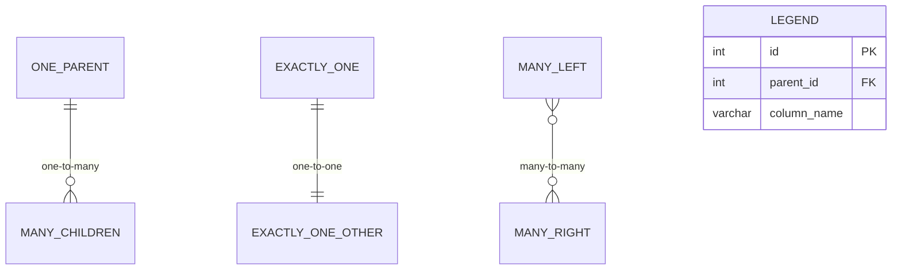

# Dimensional Modeling

Dimensional modeling is the foundational technique for structuring data in analytical warehouses. Developed by Ralph Kimball, it organizes data into **facts** (what happened — the measurements) and **dimensions** (the context — who, what, where, when, how). The resulting schemas are optimized for human understandability and query performance, making them the standard for virtually every analytics platform.

This note uses a **financial index provider** domain throughout. An index provider is a company that calculates stock market indices (broad equity benchmarks, sector indices, thematic indices), decides which stocks belong in each index, computes daily index values, processes corporate actions, and distributes index data to asset managers and exchanges.

---

## The Kimball Four-Step Dimensional Design Process

Every dimensional model begins with four decisions, made in order. Skip a step and the model collapses.

### Step 1 — Select the Business Process

A business process is a measurable activity the organization performs. It is **not** a department or a report — it is the operational event that generates data.

> [!tip] How to identify business processes
> Ask: "What does this team **do** every day that produces rows of data?" The answer is the business process.

For an index provider, the core business processes are:

| # | Business Process | Source System | Frequency |
|---|-----------------|---------------|-----------|
| 1 | Index valuation (calculating daily index levels) | Calculation engine | Daily |
| 2 | Constituent weighting (determining stock weights at rebalance) | Rebalancing system | Quarterly / semi-annual |
| 3 | Corporate action processing (adjusting for splits, mergers, dividends) | Corporate actions feed | Event-driven |
| 4 | Pipeline execution monitoring (tracking data pipeline health) | Orchestration platform | Continuous |

### Step 2 — Declare the Grain

The grain is the most important decision in dimensional modeling. It answers: **what does one row in the fact table represent?**

> [!warning] The grain rule
> Declare the grain before identifying dimensions or facts. Every column in the fact table must be true for that single grain row. If a proposed measure does not live at the declared grain, it belongs in a different fact table.

| Business Process | Grain Statement |
|-----------------|----------------|
| Index valuation | One row per **index** per **trading day** |
| Constituent weighting | One row per **constituent instrument** per **index** per **rebalancing date** |
| Corporate action processing | One row per **corporate action event** |
| Pipeline monitoring | One row per **pipeline execution run** |

### Step 3 — Identify the Dimensions

Dimensions provide the filtering, grouping, and labeling context for every fact row. They answer: who, what, where, when, how?

For the index valuation process at the grain of one index per trading day:

- **When** did the valuation occur? → `dim_date`
- **Which index** was valued? → `dim_index`
- **In what currency** is the value expressed? → `dim_currency`

### Step 4 — Identify the Facts

Facts are the numeric measurements produced by the business process at the declared grain. They should be **additive**, **semi-additive**, or **non-additive** — and you must know which. DataFrame operations like joins and groupbys in [05_py_aggregation_reshaping](https://alp78.github.io/elysium/03-Dataframes/Dataframes-Python/05_py_aggregation_reshaping) mirror the star schema query pattern — joining a fact DataFrame to dimension DataFrames along key columns.

| Measure | Additivity | Explanation |
|---------|-----------|-------------|
| `market_cap_usd` | Semi-additive | Can sum across indices but not across dates (use snapshot logic) |
| `daily_return_pct` | Non-additive | Percentages cannot be summed; must be compounded (see [bq-advanced](https://alp78.github.io/elysium/05-DB-Queries/BigQuery/bq-advanced) for BigQuery window functions that handle compounding) |
| `num_constituents` | Semi-additive | Count at a point in time; averaging across dates is valid, summing is not |
| `weight_pct` | Semi-additive | Sums to 100% within one index on one date; cannot sum across indices |
| `rows_processed` | Additive | Can sum across pipelines, dates, or any dimension |

> [!info] Additive vs semi-additive vs non-additive
> - **Additive**: safe to SUM across every dimension (revenue, quantity, duration)
> - **Semi-additive**: safe to SUM across some dimensions but not all — typically not across time for balance/snapshot measures
> - **Non-additive**: never SUM — use AVG, weighted calculations, or compounding (percentages, ratios, factors)

---

## Star Schema

A star schema places a single **fact table** at the center, surrounded by **dimension tables** radiating outward like points of a star. Fact tables hold foreign keys and numeric measures. Dimension tables hold descriptive attributes with a single surrogate primary key.

**Star 1 — Index Valuation** (one row per index per trading day):

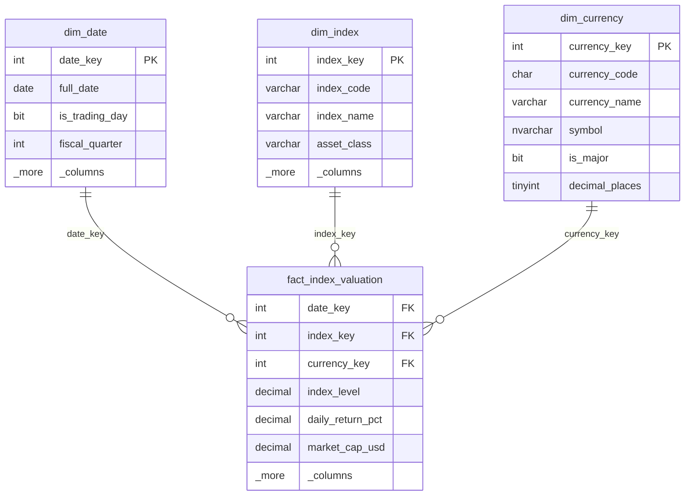

**Star 2 — Constituent Weights** (one row per stock per index per rebalancing date):

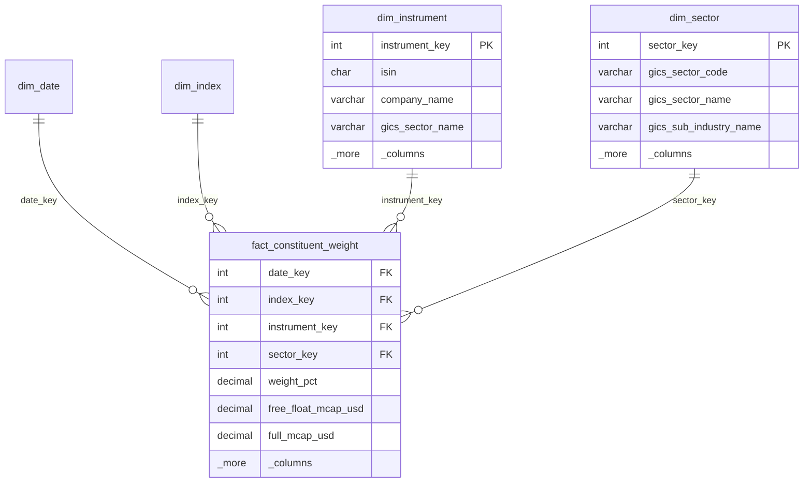

**Star 3 — Corporate Actions** (one row per corporate action event):

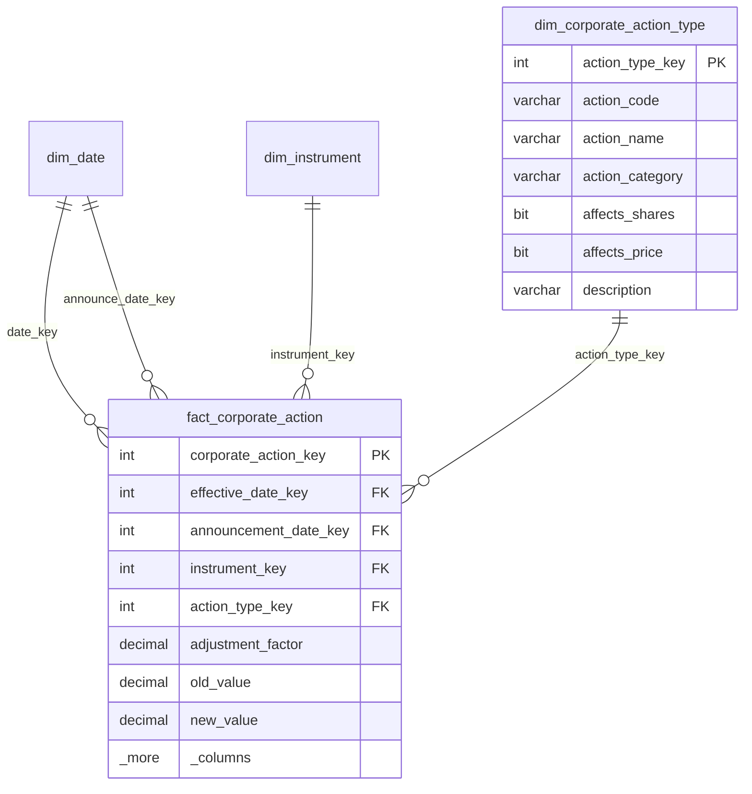

**Star 4 — Pipeline Monitoring** (one row per pipeline execution):


In practice, the [gold-transforms](https://alp78.github.io/elysium/04-SQL-Server/Medallion-Project/gold-transforms) layer is where dimensional models are physically built — fact and dimension tables are materialized as gold-layer outputs ready for dashboard consumption.

### Why Star Schemas Outperform Normalized Models for Analytics

| Factor | Star Schema | 3NF (Normalized) |
|--------|------------|-------------------|
| Joins for a typical query | 2-5 | 10-20 |
| Query plan complexity | Simple hash/merge joins | Complex multi-way joins |
| Predicate pushdown | Dimension filter pushed directly to fact scan | Filters must propagate through join chains |
| Columnar storage alignment | Wide dimension rows stored once; narrow fact columns compress well | Many skinny tables defeat columnar compression |
| User understandability | Business users can navigate | Requires DBA-level knowledge |
| Aggregate navigation | Straightforward rollups along dimension hierarchies | Aggregation paths unclear |
| Index utilization | FK columns on fact → fast lookups | PK/FK chains require composite indexes |

---

## Fact Tables — Full DDL

### fact_index_valuation

One row per index per trading day. The primary analytical fact table for an index provider.

```sql
-- =============================================================
-- fact_index_valuation
-- Grain: one index, one trading day
-- Measures: index_level, daily_return_pct, market_cap, PE, yield
-- =============================================================

-- SQL Server DDL
CREATE TABLE dw.fact_index_valuation (
    -- Surrogate keys (foreign keys to dimensions)
    date_key              INT           NOT NULL,
    index_key             INT           NOT NULL,
    currency_key          INT           NOT NULL,

    -- Degenerate dimension (no separate table needed)
    calculation_batch_id  VARCHAR(50)   NOT NULL,

    -- Additive measures
    market_cap_usd        DECIMAL(20,2) NULL,
    num_constituents      INT           NULL,

    -- Semi-additive measures (snapshot — do not SUM across dates)
    index_level           DECIMAL(18,6) NOT NULL,
    pe_ratio              DECIMAL(10,4) NULL,
    dividend_yield_pct    DECIMAL(8,4)  NULL,

    -- Non-additive measures (percentages — compound, do not SUM)
    daily_return_pct      DECIMAL(10,6) NULL,
    daily_return_gross_pct DECIMAL(10,6) NULL,
    daily_return_net_pct  DECIMAL(10,6) NULL,
    ytd_return_pct        DECIMAL(12,6) NULL,

    -- Metadata
    row_loaded_at         DATETIME2     NOT NULL DEFAULT SYSUTCDATETIME(),
    row_source_system     VARCHAR(50)   NOT NULL DEFAULT 'CALC_ENGINE',

    -- Constraints
    CONSTRAINT pk_fact_index_valuation
        PRIMARY KEY NONCLUSTERED (date_key, index_key),

    CONSTRAINT fk_fiv_date
        FOREIGN KEY (date_key) REFERENCES dw.dim_date(date_key),
    CONSTRAINT fk_fiv_index
        FOREIGN KEY (index_key) REFERENCES dw.dim_index(index_key),
    CONSTRAINT fk_fiv_currency
        FOREIGN KEY (currency_key) REFERENCES dw.dim_currency(currency_key)
);

-- Clustered columnstore for analytical workloads
CREATE CLUSTERED COLUMNSTORE INDEX cci_fact_index_valuation
    ON dw.fact_index_valuation;

-- Nonclustered for point lookups by index + date
CREATE NONCLUSTERED INDEX ix_fiv_index_date
    ON dw.fact_index_valuation(index_key, date_key)
    INCLUDE (index_level, daily_return_pct);
```


```sql
-- BigQuery DDL
CREATE TABLE IF NOT EXISTS `project.warehouse.fact_index_valuation` (
    date_key              INT64         NOT NULL,
    index_key             INT64         NOT NULL,
    currency_key          INT64         NOT NULL,
    calculation_batch_id  STRING        NOT NULL,
    market_cap_usd        NUMERIC,
    num_constituents      INT64,
    index_level           NUMERIC       NOT NULL,
    pe_ratio              NUMERIC,
    dividend_yield_pct    NUMERIC,
    daily_return_pct      NUMERIC,
    daily_return_gross_pct NUMERIC,
    daily_return_net_pct  NUMERIC,
    ytd_return_pct        NUMERIC,
    row_loaded_at         TIMESTAMP     NOT NULL,
    row_source_system     STRING        NOT NULL
)
PARTITION BY RANGE_BUCKET(date_key, GENERATE_ARRAY(19900101, 20401231, 10000))
CLUSTER BY index_key, currency_key
OPTIONS (
    description = 'Daily index valuation fact. Grain: one index, one trading day.',
    require_partition_filter = TRUE
);
```

---

### fact_constituent_weight

One row per constituent instrument per index per rebalancing date.

```sql
-- =============================================================
-- fact_constituent_weight
-- Grain: one constituent, one index, one rebalancing date
-- Measures: weight, free float factor, capping factor, shares, mcap
-- =============================================================

-- SQL Server DDL
CREATE TABLE dw.fact_constituent_weight (
    -- Surrogate keys
    date_key              INT           NOT NULL,
    index_key             INT           NOT NULL,
    instrument_key        INT           NOT NULL,
    sector_key            INT           NOT NULL,

    -- Degenerate dimension
    rebalancing_event_id  VARCHAR(50)   NOT NULL,

    -- Semi-additive measures (snapshot at rebalancing point)
    weight_pct            DECIMAL(12,8) NOT NULL,
    free_float_factor     DECIMAL(8,6)  NULL,
    capping_factor        DECIMAL(8,6)  NULL,
    shares_outstanding    BIGINT        NULL,
    free_float_mcap_usd   DECIMAL(20,2) NULL,
    full_mcap_usd         DECIMAL(20,2) NULL,

    -- Additive measures
    divisor_contribution  DECIMAL(20,10) NULL,

    -- Metadata
    row_loaded_at         DATETIME2     NOT NULL DEFAULT SYSUTCDATETIME(),
    row_source_system     VARCHAR(50)   NOT NULL DEFAULT 'REBAL_ENGINE',

    CONSTRAINT pk_fact_constituent_weight
        PRIMARY KEY NONCLUSTERED (date_key, index_key, instrument_key),

    CONSTRAINT fk_fcw_date
        FOREIGN KEY (date_key) REFERENCES dw.dim_date(date_key),
    CONSTRAINT fk_fcw_index
        FOREIGN KEY (index_key) REFERENCES dw.dim_index(index_key),
    CONSTRAINT fk_fcw_instrument
        FOREIGN KEY (instrument_key) REFERENCES dw.dim_instrument(instrument_key),
    CONSTRAINT fk_fcw_sector
        FOREIGN KEY (sector_key) REFERENCES dw.dim_sector(sector_key)
);

CREATE CLUSTERED COLUMNSTORE INDEX cci_fact_constituent_weight
    ON dw.fact_constituent_weight;

CREATE NONCLUSTERED INDEX ix_fcw_index_date
    ON dw.fact_constituent_weight(index_key, date_key)
    INCLUDE (instrument_key, weight_pct);

CREATE NONCLUSTERED INDEX ix_fcw_instrument
    ON dw.fact_constituent_weight(instrument_key, date_key)
    INCLUDE (index_key, weight_pct);
```


```sql
-- BigQuery DDL
CREATE TABLE IF NOT EXISTS `project.warehouse.fact_constituent_weight` (
    date_key              INT64         NOT NULL,
    index_key             INT64         NOT NULL,
    instrument_key        INT64         NOT NULL,
    sector_key            INT64         NOT NULL,
    rebalancing_event_id  STRING        NOT NULL,
    weight_pct            NUMERIC       NOT NULL,
    free_float_factor     NUMERIC,
    capping_factor        NUMERIC,
    shares_outstanding    INT64,
    free_float_mcap_usd   NUMERIC,
    full_mcap_usd         NUMERIC,
    divisor_contribution  NUMERIC,
    row_loaded_at         TIMESTAMP     NOT NULL,
    row_source_system     STRING        NOT NULL
)
PARTITION BY RANGE_BUCKET(date_key, GENERATE_ARRAY(19900101, 20401231, 10000))
CLUSTER BY index_key, instrument_key
OPTIONS (
    description = 'Constituent weight fact. Grain: one constituent, one index, one rebalancing date.',
    require_partition_filter = TRUE
);
```

---

### fact_corporate_action

One row per corporate action event applied to an instrument.

```sql
-- =============================================================
-- fact_corporate_action
-- Grain: one corporate action event
-- Measures: adjustment_factor, old_value, new_value
-- =============================================================

-- SQL Server DDL
CREATE TABLE dw.fact_corporate_action (
    -- Surrogate key (corporate actions are events, so a single PK is natural)
    corporate_action_key  INT           IDENTITY(1,1) NOT NULL,

    -- Foreign keys
    effective_date_key    INT           NOT NULL,
    announcement_date_key INT           NOT NULL,  -- role-playing dim_date
    instrument_key        INT           NOT NULL,
    action_type_key       INT           NOT NULL,

    -- Degenerate dimensions
    corporate_action_id   VARCHAR(50)   NOT NULL,  -- source system ID
    ex_date_key           INT           NULL,
    record_date_key       INT           NULL,

    -- Measures
    adjustment_factor     DECIMAL(18,10) NOT NULL,
    old_value             DECIMAL(18,6)  NULL,
    new_value             DECIMAL(18,6)  NULL,
    cash_amount           DECIMAL(18,6)  NULL,
    cash_currency_key     INT            NULL,

    -- Flags (degenerate / junk)
    is_mandatory          BIT           NOT NULL DEFAULT 1,
    is_processed          BIT           NOT NULL DEFAULT 0,
    affects_index_divisor BIT           NOT NULL DEFAULT 0,

    -- Metadata
    row_loaded_at         DATETIME2     NOT NULL DEFAULT SYSUTCDATETIME(),
    row_source_system     VARCHAR(50)   NOT NULL DEFAULT 'CORP_ACTIONS',

    CONSTRAINT pk_fact_corporate_action
        PRIMARY KEY NONCLUSTERED (corporate_action_key),

    CONSTRAINT fk_fca_eff_date
        FOREIGN KEY (effective_date_key) REFERENCES dw.dim_date(date_key),
    CONSTRAINT fk_fca_ann_date
        FOREIGN KEY (announcement_date_key) REFERENCES dw.dim_date(date_key),
    CONSTRAINT fk_fca_instrument
        FOREIGN KEY (instrument_key) REFERENCES dw.dim_instrument(instrument_key),
    CONSTRAINT fk_fca_action_type
        FOREIGN KEY (action_type_key) REFERENCES dw.dim_corporate_action_type(action_type_key)
);

CREATE CLUSTERED COLUMNSTORE INDEX cci_fact_corporate_action
    ON dw.fact_corporate_action;

CREATE NONCLUSTERED INDEX ix_fca_instrument_date
    ON dw.fact_corporate_action(instrument_key, effective_date_key);
```

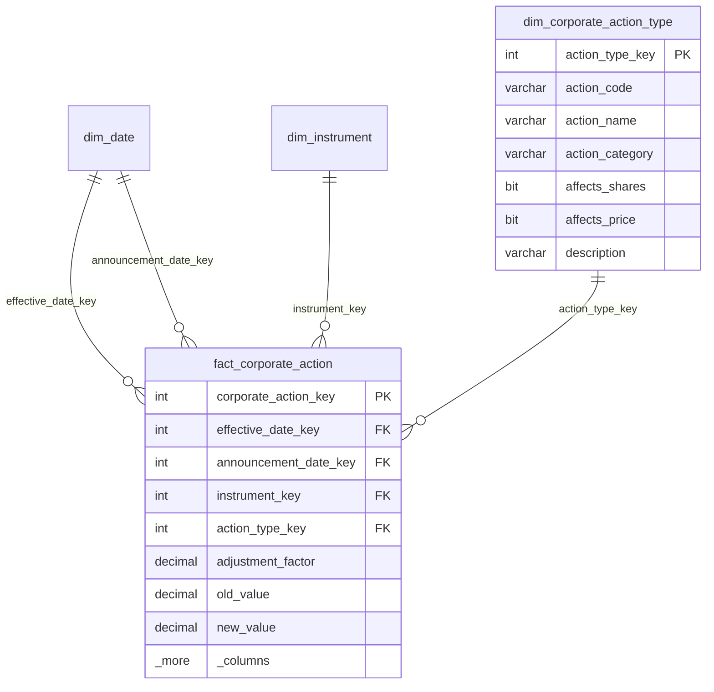

```sql
-- BigQuery DDL
CREATE TABLE IF NOT EXISTS `project.warehouse.fact_corporate_action` (
    corporate_action_key  INT64         NOT NULL,
    effective_date_key    INT64         NOT NULL,
    announcement_date_key INT64         NOT NULL,
    instrument_key        INT64         NOT NULL,
    action_type_key       INT64         NOT NULL,
    corporate_action_id   STRING        NOT NULL,
    ex_date_key           INT64,
    record_date_key       INT64,
    adjustment_factor     NUMERIC       NOT NULL,
    old_value             NUMERIC,
    new_value             NUMERIC,
    cash_amount           NUMERIC,
    cash_currency_key     INT64,
    is_mandatory          BOOL          NOT NULL,
    is_processed          BOOL          NOT NULL,
    affects_index_divisor BOOL          NOT NULL,
    row_loaded_at         TIMESTAMP     NOT NULL,
    row_source_system     STRING        NOT NULL
)
PARTITION BY RANGE_BUCKET(effective_date_key, GENERATE_ARRAY(19900101, 20401231, 10000))
CLUSTER BY instrument_key, action_type_key
OPTIONS (
    description = 'Corporate action fact. Grain: one corporate action event.'
);
```

> [!note] Role-playing dimensions
> `dim_date` appears multiple times in `fact_corporate_action`: once as `effective_date_key`, once as `announcement_date_key`, and optionally as `ex_date_key` and `record_date_key`. Each is a **role-playing** use of the same physical dimension table, aliased differently in queries.

---

### fact_index_calculation_run

Pipeline monitoring fact table. This is a **factless fact with measures** — its primary purpose is to record that a pipeline ran (the event), but it also captures performance metrics.

```sql
-- =============================================================
-- fact_index_calculation_run
-- Grain: one pipeline execution run
-- Measures: duration, rows_processed, freshness, quality_score
-- =============================================================

-- SQL Server DDL
CREATE TABLE dw.fact_index_calculation_run (
    -- Surrogate key
    run_key               INT           IDENTITY(1,1) NOT NULL,

    -- Foreign keys
    date_key              INT           NOT NULL,
    pipeline_key          INT           NOT NULL,
    status_key            INT           NOT NULL,

    -- Degenerate dimensions
    run_id                VARCHAR(100)  NOT NULL,
    triggered_by          VARCHAR(100)  NULL,

    -- Timestamps (not FK — stored as values for duration calculation)
    run_start_utc         DATETIME2     NOT NULL,
    run_end_utc           DATETIME2     NULL,

    -- Additive measures
    duration_seconds      INT           NULL,
    rows_processed        BIGINT        NULL,
    rows_inserted         BIGINT        NULL,
    rows_updated          BIGINT        NULL,
    rows_rejected         BIGINT        NULL,

    -- Semi-additive measures
    data_freshness_seconds INT          NULL,
    quality_score         DECIMAL(5,2)  NULL,  -- 0.00 to 100.00

    -- Metadata
    row_loaded_at         DATETIME2     NOT NULL DEFAULT SYSUTCDATETIME(),

    CONSTRAINT pk_fact_calc_run
        PRIMARY KEY NONCLUSTERED (run_key),

    CONSTRAINT fk_fcr_date
        FOREIGN KEY (date_key) REFERENCES dw.dim_date(date_key),
    CONSTRAINT fk_fcr_pipeline
        FOREIGN KEY (pipeline_key) REFERENCES dw.dim_pipeline(pipeline_key),
    CONSTRAINT fk_fcr_status
        FOREIGN KEY (status_key) REFERENCES dw.dim_status(status_key)
);

CREATE CLUSTERED COLUMNSTORE INDEX cci_fact_calc_run
    ON dw.fact_index_calculation_run;
```

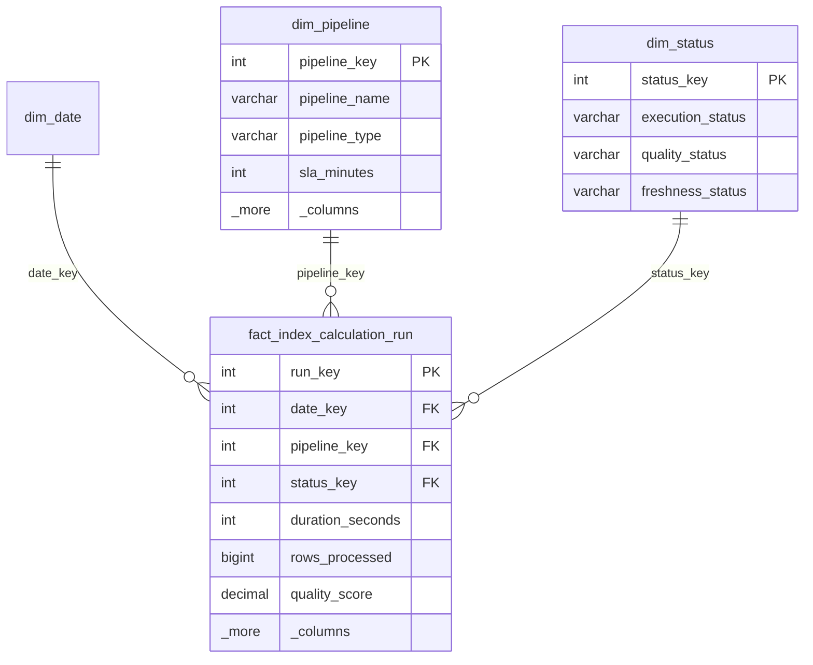

```sql
-- BigQuery DDL
CREATE TABLE IF NOT EXISTS `project.warehouse.fact_index_calculation_run` (
    run_key               INT64         NOT NULL,
    date_key              INT64         NOT NULL,
    pipeline_key          INT64         NOT NULL,
    status_key            INT64         NOT NULL,
    run_id                STRING        NOT NULL,
    triggered_by          STRING,
    run_start_utc         TIMESTAMP     NOT NULL,
    run_end_utc           TIMESTAMP,
    duration_seconds      INT64,
    rows_processed        INT64,
    rows_inserted         INT64,
    rows_updated          INT64,
    rows_rejected         INT64,
    data_freshness_seconds INT64,
    quality_score         NUMERIC,
    row_loaded_at         TIMESTAMP     NOT NULL
)
PARTITION BY RANGE_BUCKET(date_key, GENERATE_ARRAY(20200101, 20401231, 10000))
CLUSTER BY pipeline_key, status_key
OPTIONS (
    description = 'Pipeline monitoring fact. Grain: one pipeline execution run.'
);
```

---

## Dimension Tables — Full DDL

### dim_date

The universal date dimension. Every warehouse needs one. Pre-populated from the earliest historical date to several years in the future.

```sql
-- =============================================================
-- dim_date — the universal date dimension
-- 30+ columns covering calendar, fiscal, trading day attributes
-- =============================================================

-- SQL Server DDL
CREATE TABLE dw.dim_date (
    date_key                INT           NOT NULL,  -- YYYYMMDD integer
    full_date               DATE          NOT NULL,
    date_iso                CHAR(10)      NOT NULL,  -- 'YYYY-MM-DD'

    -- Day-level attributes
    day_of_week             TINYINT       NOT NULL,  -- 1=Monday, 7=Sunday (ISO)
    day_of_week_name        VARCHAR(10)   NOT NULL,  -- 'Monday'
    day_of_week_short       CHAR(3)       NOT NULL,  -- 'Mon'
    day_of_month            TINYINT       NOT NULL,
    day_of_year             SMALLINT      NOT NULL,
    is_weekend              BIT           NOT NULL,
    is_weekday              BIT           NOT NULL,

    -- Trading calendar
    is_trading_day          BIT           NOT NULL DEFAULT 1,
    trading_day_of_month    TINYINT       NULL,
    trading_day_of_quarter  SMALLINT      NULL,
    trading_day_of_year     SMALLINT      NULL,

    -- Week-level attributes
    iso_week_number         TINYINT       NOT NULL,
    iso_week_year           SMALLINT      NOT NULL,
    week_start_date         DATE          NOT NULL,  -- Monday of ISO week
    week_end_date           DATE          NOT NULL,  -- Sunday of ISO week

    -- Month-level attributes
    month_number            TINYINT       NOT NULL,
    month_name              VARCHAR(10)   NOT NULL,  -- 'January'
    month_name_short        CHAR(3)       NOT NULL,  -- 'Jan'
    year_month_key          INT           NOT NULL,  -- YYYYMM
    month_start_date        DATE          NOT NULL,
    month_end_date          DATE          NOT NULL,
    is_month_end            BIT           NOT NULL,
    days_in_month           TINYINT       NOT NULL,

    -- Quarter-level attributes
    calendar_quarter        TINYINT       NOT NULL,  -- 1,2,3,4
    quarter_name            CHAR(6)       NOT NULL,  -- 'Q1 2026'
    quarter_start_date      DATE          NOT NULL,
    quarter_end_date        DATE          NOT NULL,
    is_quarter_end          BIT           NOT NULL,

    -- Year-level attributes
    calendar_year           SMALLINT      NOT NULL,
    year_start_date         DATE          NOT NULL,
    year_end_date           DATE          NOT NULL,
    is_year_end             BIT           NOT NULL,

    -- Fiscal calendar (assuming fiscal year = calendar year; adjust offset as needed)
    fiscal_year             SMALLINT      NOT NULL,
    fiscal_quarter          TINYINT       NOT NULL,
    fiscal_month            TINYINT       NOT NULL,
    fiscal_year_quarter     CHAR(7)       NOT NULL,  -- 'FY26-Q1'

    -- Relative flags (updated daily by ETL or computed at query time)
    is_current_day          BIT           NOT NULL DEFAULT 0,
    is_prior_day            BIT           NOT NULL DEFAULT 0,
    is_current_month        BIT           NOT NULL DEFAULT 0,
    is_prior_month          BIT           NOT NULL DEFAULT 0,
    is_current_year         BIT           NOT NULL DEFAULT 0,

    CONSTRAINT pk_dim_date PRIMARY KEY CLUSTERED (date_key)
);

-- Index for date lookups
CREATE UNIQUE NONCLUSTERED INDEX uix_dim_date_full
    ON dw.dim_date(full_date);
```

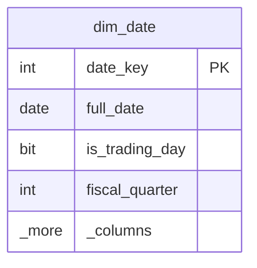

```sql
-- BigQuery DDL
CREATE TABLE IF NOT EXISTS `project.warehouse.dim_date` (
    date_key                INT64         NOT NULL,
    full_date               DATE          NOT NULL,
    date_iso                STRING        NOT NULL,
    day_of_week             INT64         NOT NULL,
    day_of_week_name        STRING        NOT NULL,
    day_of_week_short       STRING        NOT NULL,
    day_of_month            INT64         NOT NULL,
    day_of_year             INT64         NOT NULL,
    is_weekend              BOOL          NOT NULL,
    is_weekday              BOOL          NOT NULL,
    is_trading_day          BOOL          NOT NULL,
    trading_day_of_month    INT64,
    trading_day_of_quarter  INT64,
    trading_day_of_year     INT64,
    iso_week_number         INT64         NOT NULL,
    iso_week_year           INT64         NOT NULL,
    week_start_date         DATE          NOT NULL,
    week_end_date           DATE          NOT NULL,
    month_number            INT64         NOT NULL,
    month_name              STRING        NOT NULL,
    month_name_short        STRING        NOT NULL,
    year_month_key          INT64         NOT NULL,
    month_start_date        DATE          NOT NULL,
    month_end_date          DATE          NOT NULL,
    is_month_end            BOOL          NOT NULL,
    days_in_month           INT64         NOT NULL,
    calendar_quarter        INT64         NOT NULL,
    quarter_name            STRING        NOT NULL,
    quarter_start_date      DATE          NOT NULL,
    quarter_end_date        DATE          NOT NULL,
    is_quarter_end          BOOL          NOT NULL,
    calendar_year           INT64         NOT NULL,
    year_start_date         DATE          NOT NULL,
    year_end_date           DATE          NOT NULL,
    is_year_end             BOOL          NOT NULL,
    fiscal_year             INT64         NOT NULL,
    fiscal_quarter          INT64         NOT NULL,
    fiscal_month            INT64         NOT NULL,
    fiscal_year_quarter     STRING        NOT NULL,
    is_current_day          BOOL          NOT NULL,
    is_prior_day            BOOL          NOT NULL,
    is_current_month        BOOL          NOT NULL,
    is_prior_month          BOOL          NOT NULL,
    is_current_year         BOOL          NOT NULL
)
OPTIONS (description = 'Universal date dimension. Pre-populated 1990-01-01 to 2040-12-31.');
```

#### Date Dimension Generator Script (SQL Server)

```sql
-- =====================================================
-- Generate dim_date rows from @start_date to @end_date
-- =====================================================
DECLARE @start_date DATE = '1990-01-01';
DECLARE @end_date   DATE = '2040-12-31';

WITH date_spine AS (
    SELECT CAST(@start_date AS DATE) AS dt
    UNION ALL
    SELECT DATEADD(DAY, 1, dt)
    FROM date_spine
    WHERE dt < @end_date
)
INSERT INTO dw.dim_date (
    date_key, full_date, date_iso,
    day_of_week, day_of_week_name, day_of_week_short,
    day_of_month, day_of_year, is_weekend, is_weekday,
    is_trading_day,
    iso_week_number, iso_week_year, week_start_date, week_end_date,
    month_number, month_name, month_name_short, year_month_key,
    month_start_date, month_end_date, is_month_end, days_in_month,
    calendar_quarter, quarter_name, quarter_start_date, quarter_end_date, is_quarter_end,
    calendar_year, year_start_date, year_end_date, is_year_end,
    fiscal_year, fiscal_quarter, fiscal_month, fiscal_year_quarter
)
SELECT
    CAST(FORMAT(dt, 'yyyyMMdd') AS INT)                         AS date_key,
    dt                                                           AS full_date,
    FORMAT(dt, 'yyyy-MM-dd')                                     AS date_iso,

    DATEPART(ISO_WEEK, dt) - DATEPART(ISO_WEEK, dt) + DATEPART(WEEKDAY,
        DATEADD(dd, @@DATEFIRST - 1, dt))                        AS day_of_week_raw,
    -- Simplified: use ISO weekday
    (DATEPART(WEEKDAY, dt) + @@DATEFIRST - 2) % 7 + 1           AS day_of_week,
    DATENAME(WEEKDAY, dt)                                        AS day_of_week_name,
    LEFT(DATENAME(WEEKDAY, dt), 3)                               AS day_of_week_short,
    DAY(dt)                                                      AS day_of_month,
    DATEPART(DAYOFYEAR, dt)                                      AS day_of_year,
    CASE WHEN DATEPART(WEEKDAY, dt) IN (1, 7) THEN 1 ELSE 0 END AS is_weekend,
    CASE WHEN DATEPART(WEEKDAY, dt) IN (1, 7) THEN 0 ELSE 1 END AS is_weekday,

    -- Default: trading day = weekday (refine with holiday table later)
    CASE WHEN DATEPART(WEEKDAY, dt) IN (1, 7) THEN 0 ELSE 1 END AS is_trading_day,

    DATEPART(ISO_WEEK, dt)                                       AS iso_week_number,
    YEAR(DATEADD(DAY, 26 - DATEPART(ISO_WEEK, dt), dt))         AS iso_week_year,
    DATEADD(DAY, 1 - (DATEPART(WEEKDAY, dt) + @@DATEFIRST - 2) % 7 - 1, dt) AS week_start_date,
    DATEADD(DAY, 7 - (DATEPART(WEEKDAY, dt) + @@DATEFIRST - 2) % 7 - 1, dt) AS week_end_date,

    MONTH(dt)                                                    AS month_number,
    DATENAME(MONTH, dt)                                          AS month_name,
    LEFT(DATENAME(MONTH, dt), 3)                                 AS month_name_short,
    YEAR(dt) * 100 + MONTH(dt)                                   AS year_month_key,
    DATEFROMPARTS(YEAR(dt), MONTH(dt), 1)                        AS month_start_date,
    EOMONTH(dt)                                                  AS month_end_date,
    CASE WHEN dt = EOMONTH(dt) THEN 1 ELSE 0 END                AS is_month_end,
    DAY(EOMONTH(dt))                                             AS days_in_month,

    DATEPART(QUARTER, dt)                                        AS calendar_quarter,
    CONCAT('Q', DATEPART(QUARTER, dt), ' ', YEAR(dt))            AS quarter_name,
    DATEFROMPARTS(YEAR(dt), (DATEPART(QUARTER, dt)-1)*3+1, 1)   AS quarter_start_date,
    EOMONTH(DATEFROMPARTS(YEAR(dt), DATEPART(QUARTER, dt)*3, 1)) AS quarter_end_date,
    CASE WHEN dt = EOMONTH(DATEFROMPARTS(YEAR(dt), DATEPART(QUARTER, dt)*3, 1))
         THEN 1 ELSE 0 END                                      AS is_quarter_end,

    YEAR(dt)                                                     AS calendar_year,
    DATEFROMPARTS(YEAR(dt), 1, 1)                                AS year_start_date,
    DATEFROMPARTS(YEAR(dt), 12, 31)                              AS year_end_date,
    CASE WHEN dt = DATEFROMPARTS(YEAR(dt), 12, 31) THEN 1 ELSE 0 END AS is_year_end,

    YEAR(dt)                                                     AS fiscal_year,
    DATEPART(QUARTER, dt)                                        AS fiscal_quarter,
    MONTH(dt)                                                    AS fiscal_month,
    CONCAT('FY', RIGHT(CAST(YEAR(dt) AS VARCHAR), 2), '-Q', DATEPART(QUARTER, dt)) AS fiscal_year_quarter

FROM date_spine
OPTION (MAXRECURSION 0);
```

> [!tip] Trading day numbers
> After loading the base date dimension, run a second pass to number trading days sequentially. Use a window function: `ROW_NUMBER() OVER (PARTITION BY year_month_key ORDER BY date_key)` filtered to `is_trading_day = 1`. Then update `trading_day_of_month`, `trading_day_of_quarter`, and `trading_day_of_year`.

---

### dim_index

The index dimension captures every index the provider calculates. SCD Type 2 tracks changes to index methodology (weighting method, rebalancing frequency, target constituent count).

```sql
-- =============================================================
-- dim_index — SCD Type 2
-- =============================================================

-- SQL Server DDL
CREATE TABLE dw.dim_index (
    index_key                 INT           IDENTITY(1,1) NOT NULL,
    index_code                VARCHAR(20)   NOT NULL,  -- natural key, e.g., 'GLBL_EQ_500'
    index_name                VARCHAR(200)  NOT NULL,
    index_family              VARCHAR(100)  NULL,      -- e.g., 'Global Equity', 'Fixed Income'
    currency_code             CHAR(3)       NOT NULL,
    region                    VARCHAR(50)   NULL,      -- 'Global', 'North America', 'EMEA', 'APAC'
    asset_class               VARCHAR(50)   NOT NULL,  -- 'Equity', 'Fixed Income', 'Multi-Asset'
    weighting_method          VARCHAR(50)   NOT NULL,  -- 'Free-float market cap', 'Equal', 'Factor'
    num_constituents_target   INT           NULL,
    rebalancing_frequency     VARCHAR(30)   NULL,      -- 'Quarterly', 'Semi-annual', 'Annual'
    launch_date               DATE          NULL,
    is_active                 BIT           NOT NULL DEFAULT 1,

    -- SCD Type 2 tracking columns
    valid_from                DATE          NOT NULL,
    valid_to                  DATE          NOT NULL DEFAULT '9999-12-31',
    is_current                BIT           NOT NULL DEFAULT 1,

    -- Metadata
    row_loaded_at             DATETIME2     NOT NULL DEFAULT SYSUTCDATETIME(),

    CONSTRAINT pk_dim_index PRIMARY KEY CLUSTERED (index_key)
);

CREATE NONCLUSTERED INDEX ix_dim_index_code
    ON dw.dim_index(index_code, is_current)
    INCLUDE (index_key, index_name);

CREATE NONCLUSTERED INDEX ix_dim_index_scd
    ON dw.dim_index(index_code, valid_from, valid_to);
```

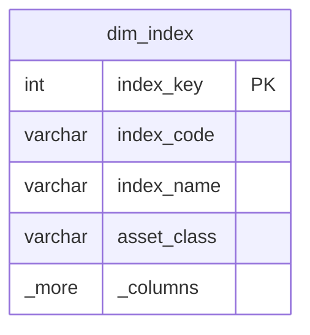

```sql
-- BigQuery DDL
CREATE TABLE IF NOT EXISTS `project.warehouse.dim_index` (
    index_key                 INT64         NOT NULL,
    index_code                STRING        NOT NULL,
    index_name                STRING        NOT NULL,
    index_family              STRING,
    currency_code             STRING        NOT NULL,
    region                    STRING,
    asset_class               STRING        NOT NULL,
    weighting_method          STRING        NOT NULL,
    num_constituents_target   INT64,
    rebalancing_frequency     STRING,
    launch_date               DATE,
    is_active                 BOOL          NOT NULL,
    valid_from                DATE          NOT NULL,
    valid_to                  DATE          NOT NULL,
    is_current                BOOL          NOT NULL,
    row_loaded_at             TIMESTAMP     NOT NULL
)
CLUSTER BY index_code, is_current
OPTIONS (description = 'Index dimension. SCD Type 2.');
```

---

### dim_instrument

The instrument (security/stock) dimension. SCD Type 2 captures company name changes, sector reclassifications, and listing transfers.

```sql
-- =============================================================
-- dim_instrument — SCD Type 2
-- Full GICS hierarchy embedded for star schema convenience
-- =============================================================

-- SQL Server DDL
CREATE TABLE dw.dim_instrument (
    instrument_key            INT           IDENTITY(1,1) NOT NULL,

    -- Natural keys (identifiers)
    isin                      CHAR(12)      NULL,
    sedol                     CHAR(7)       NULL,
    cusip                     CHAR(9)       NULL,
    ticker                    VARCHAR(20)   NULL,
    figi                      CHAR(12)      NULL,

    -- Descriptive attributes
    company_name              VARCHAR(200)  NOT NULL,
    company_name_short        VARCHAR(50)   NULL,
    country_of_incorporation  CHAR(2)       NULL,  -- ISO 3166 alpha-2
    country_of_listing        CHAR(2)       NULL,
    exchange_code             VARCHAR(10)   NULL,  -- MIC code
    exchange_name             VARCHAR(100)  NULL,
    primary_currency          CHAR(3)       NULL,

    -- GICS classification (denormalized into dimension for star schema)
    gics_sector_code          VARCHAR(10)   NULL,
    gics_sector_name          VARCHAR(100)  NULL,
    gics_industry_group_code  VARCHAR(10)   NULL,
    gics_industry_group_name  VARCHAR(100)  NULL,
    gics_industry_code        VARCHAR(10)   NULL,
    gics_industry_name        VARCHAR(100)  NULL,
    gics_sub_industry_code    VARCHAR(10)   NULL,
    gics_sub_industry_name    VARCHAR(100)  NULL,

    -- Derived attributes
    market_cap_band           VARCHAR(20)   NULL,  -- 'Mega', 'Large', 'Mid', 'Small', 'Micro'
    is_active                 BIT           NOT NULL DEFAULT 1,

    -- SCD Type 2
    valid_from                DATE          NOT NULL,
    valid_to                  DATE          NOT NULL DEFAULT '9999-12-31',
    is_current                BIT           NOT NULL DEFAULT 1,

    -- Metadata
    row_loaded_at             DATETIME2     NOT NULL DEFAULT SYSUTCDATETIME(),

    CONSTRAINT pk_dim_instrument PRIMARY KEY CLUSTERED (instrument_key)
);

CREATE NONCLUSTERED INDEX ix_dim_instrument_isin
    ON dw.dim_instrument(isin, is_current)
    INCLUDE (instrument_key, company_name);

CREATE NONCLUSTERED INDEX ix_dim_instrument_sedol
    ON dw.dim_instrument(sedol, is_current)
    INCLUDE (instrument_key);

CREATE NONCLUSTERED INDEX ix_dim_instrument_ticker
    ON dw.dim_instrument(ticker, is_current)
    INCLUDE (instrument_key, company_name);

CREATE NONCLUSTERED INDEX ix_dim_instrument_scd
    ON dw.dim_instrument(isin, valid_from, valid_to);
```

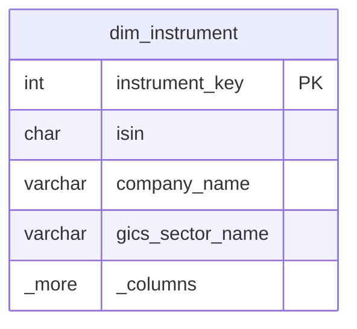

```sql
-- BigQuery DDL
CREATE TABLE IF NOT EXISTS `project.warehouse.dim_instrument` (
    instrument_key            INT64         NOT NULL,
    isin                      STRING,
    sedol                     STRING,
    cusip                     STRING,
    ticker                    STRING,
    figi                      STRING,
    company_name              STRING        NOT NULL,
    company_name_short        STRING,
    country_of_incorporation  STRING,
    country_of_listing        STRING,
    exchange_code             STRING,
    exchange_name             STRING,
    primary_currency          STRING,
    gics_sector_code          STRING,
    gics_sector_name          STRING,
    gics_industry_group_code  STRING,
    gics_industry_group_name  STRING,
    gics_industry_code        STRING,
    gics_industry_name        STRING,
    gics_sub_industry_code    STRING,
    gics_sub_industry_name    STRING,
    market_cap_band           STRING,
    is_active                 BOOL          NOT NULL,
    valid_from                DATE          NOT NULL,
    valid_to                  DATE          NOT NULL,
    is_current                BOOL          NOT NULL,
    row_loaded_at             TIMESTAMP     NOT NULL
)
CLUSTER BY isin, is_current
OPTIONS (description = 'Instrument dimension. SCD Type 2.');
```

---

### dim_sector

The GICS sector hierarchy as a standalone dimension. SCD Type 1 (overwrite) since GICS reclassifications are infrequent and retroactive restatement is standard practice.

```sql
-- =============================================================
-- dim_sector — SCD Type 1 (overwrite)
-- GICS four-level hierarchy
-- =============================================================

-- SQL Server DDL
CREATE TABLE dw.dim_sector (
    sector_key                INT           IDENTITY(1,1) NOT NULL,
    gics_sector_code          VARCHAR(10)   NOT NULL,
    gics_sector_name          VARCHAR(100)  NOT NULL,
    gics_industry_group_code  VARCHAR(10)   NOT NULL,
    gics_industry_group_name  VARCHAR(100)  NOT NULL,
    gics_industry_code        VARCHAR(10)   NOT NULL,
    gics_industry_name        VARCHAR(100)  NOT NULL,
    gics_sub_industry_code    VARCHAR(10)   NOT NULL,
    gics_sub_industry_name    VARCHAR(100)  NOT NULL,

    -- Metadata
    row_loaded_at             DATETIME2     NOT NULL DEFAULT SYSUTCDATETIME(),
    row_updated_at            DATETIME2     NOT NULL DEFAULT SYSUTCDATETIME(),

    CONSTRAINT pk_dim_sector PRIMARY KEY CLUSTERED (sector_key)
);

CREATE UNIQUE NONCLUSTERED INDEX uix_dim_sector_sub_industry
    ON dw.dim_sector(gics_sub_industry_code);
```

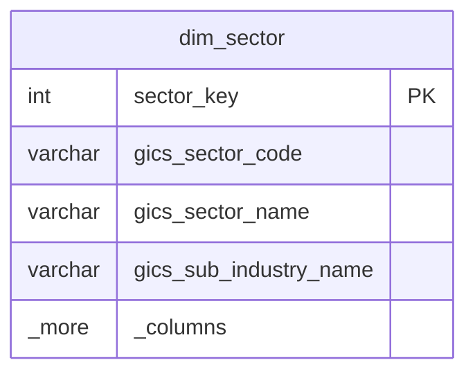

```sql
-- BigQuery DDL
CREATE TABLE IF NOT EXISTS `project.warehouse.dim_sector` (
    sector_key                INT64         NOT NULL,
    gics_sector_code          STRING        NOT NULL,
    gics_sector_name          STRING        NOT NULL,
    gics_industry_group_code  STRING        NOT NULL,
    gics_industry_group_name  STRING        NOT NULL,
    gics_industry_code        STRING        NOT NULL,
    gics_industry_name        STRING        NOT NULL,
    gics_sub_industry_code    STRING        NOT NULL,
    gics_sub_industry_name    STRING        NOT NULL,
    row_loaded_at             TIMESTAMP     NOT NULL,
    row_updated_at            TIMESTAMP     NOT NULL
)
OPTIONS (description = 'GICS sector hierarchy dimension. SCD Type 1.');
```

---

### dim_currency

```sql
-- =============================================================
-- dim_currency — static reference dimension
-- =============================================================

-- SQL Server DDL
CREATE TABLE dw.dim_currency (
    currency_key    INT          IDENTITY(1,1) NOT NULL,
    currency_code   CHAR(3)      NOT NULL,  -- ISO 4217
    currency_name   VARCHAR(50)  NOT NULL,
    symbol          NVARCHAR(5)  NULL,
    is_major        BIT          NOT NULL DEFAULT 0,
    decimal_places  TINYINT      NOT NULL DEFAULT 2,

    CONSTRAINT pk_dim_currency PRIMARY KEY CLUSTERED (currency_key)
);

CREATE UNIQUE NONCLUSTERED INDEX uix_dim_currency_code
    ON dw.dim_currency(currency_code);
```

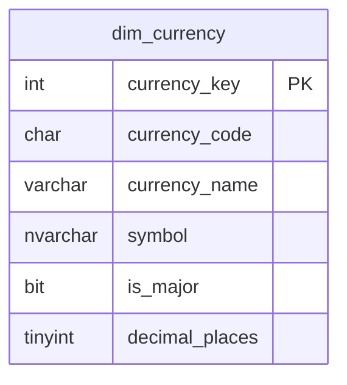

```sql
-- BigQuery DDL
CREATE TABLE IF NOT EXISTS `project.warehouse.dim_currency` (
    currency_key    INT64       NOT NULL,
    currency_code   STRING      NOT NULL,
    currency_name   STRING      NOT NULL,
    symbol          STRING,
    is_major        BOOL        NOT NULL,
    decimal_places  INT64       NOT NULL
)
OPTIONS (description = 'Currency reference dimension.');
```

---

### dim_corporate_action_type

```sql
-- =============================================================
-- dim_corporate_action_type — static reference dimension
-- =============================================================

-- SQL Server DDL
CREATE TABLE dw.dim_corporate_action_type (
    action_type_key   INT          IDENTITY(1,1) NOT NULL,
    action_code       VARCHAR(20)  NOT NULL,
    action_name       VARCHAR(100) NOT NULL,
    action_category   VARCHAR(20)  NOT NULL,  -- 'Mandatory', 'Voluntary'
    affects_shares    BIT          NOT NULL DEFAULT 0,
    affects_price     BIT          NOT NULL DEFAULT 0,
    description       VARCHAR(500) NULL,

    CONSTRAINT pk_dim_corp_action_type PRIMARY KEY CLUSTERED (action_type_key)
);

CREATE UNIQUE NONCLUSTERED INDEX uix_dim_cat_code
    ON dw.dim_corporate_action_type(action_code);
```

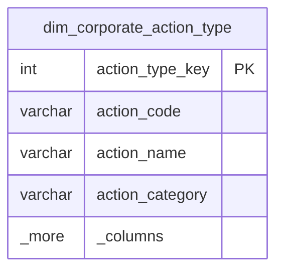

```sql
-- Sample data
INSERT INTO dw.dim_corporate_action_type
    (action_code, action_name, action_category, affects_shares, affects_price, description)
VALUES
    ('SPLIT',   'Stock Split',           'Mandatory',  1, 1, 'Share count increases; price adjusts inversely'),
    ('REV_SPL', 'Reverse Stock Split',   'Mandatory',  1, 1, 'Share count decreases; price adjusts inversely'),
    ('DIV_CSH', 'Cash Dividend',         'Mandatory',  0, 1, 'Cash distribution; price drops by dividend amount on ex-date'),
    ('DIV_STK', 'Stock Dividend',        'Mandatory',  1, 1, 'Additional shares issued as dividend'),
    ('RIGHTS',  'Rights Issue',          'Voluntary',  1, 1, 'Existing shareholders offered new shares at discount'),
    ('MERGER',  'Merger / Acquisition',  'Mandatory',  1, 1, 'Company absorbed into acquirer; shares converted or cashed out'),
    ('SPINOFF', 'Spin-Off',             'Mandatory',  1, 1, 'Subsidiary becomes independent company; parent shares adjusted'),
    ('DELIST',  'Delisting',            'Mandatory',  0, 0, 'Security removed from exchange'),
    ('NAME_CHG','Name Change',          'Mandatory',  0, 0, 'Company changes its legal name');
```

```sql
-- BigQuery DDL
CREATE TABLE IF NOT EXISTS `project.warehouse.dim_corporate_action_type` (
    action_type_key   INT64       NOT NULL,
    action_code       STRING      NOT NULL,
    action_name       STRING      NOT NULL,
    action_category   STRING      NOT NULL,
    affects_shares    BOOL        NOT NULL,
    affects_price     BOOL        NOT NULL,
    description       STRING
)
OPTIONS (description = 'Corporate action type dimension.');
```

---

### dim_pipeline

```sql
-- =============================================================
-- dim_pipeline — pipeline metadata dimension
-- =============================================================

-- SQL Server DDL
CREATE TABLE dw.dim_pipeline (
    pipeline_key      INT          IDENTITY(1,1) NOT NULL,
    pipeline_name     VARCHAR(100) NOT NULL,
    pipeline_type     VARCHAR(50)  NOT NULL,  -- 'Ingestion', 'Transformation', 'Calculation', 'Distribution'
    schedule          VARCHAR(50)  NULL,       -- 'Daily 06:00 UTC', 'Hourly', 'Event-driven'
    owner_team        VARCHAR(100) NULL,
    sla_minutes       INT          NULL,
    is_active         BIT          NOT NULL DEFAULT 1,

    CONSTRAINT pk_dim_pipeline PRIMARY KEY CLUSTERED (pipeline_key)
);

CREATE UNIQUE NONCLUSTERED INDEX uix_dim_pipeline_name
    ON dw.dim_pipeline(pipeline_name);
```

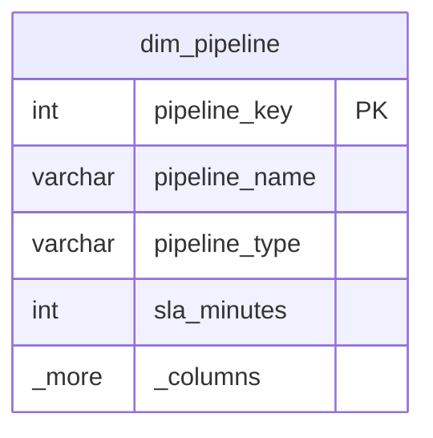

```sql
-- BigQuery DDL
CREATE TABLE IF NOT EXISTS `project.warehouse.dim_pipeline` (
    pipeline_key      INT64       NOT NULL,
    pipeline_name     STRING      NOT NULL,
    pipeline_type     STRING      NOT NULL,
    schedule          STRING,
    owner_team        STRING,
    sla_minutes       INT64,
    is_active         BOOL        NOT NULL
)
OPTIONS (description = 'Pipeline metadata dimension.');
```

---

### dim_status (Junk Dimension)

A **junk dimension** combines low-cardinality flags and indicators into a single table, preventing a proliferation of tiny dimensions.

```sql
-- =============================================================
-- dim_status — junk dimension
-- Combines execution_status, quality_status, freshness_status
-- =============================================================

-- SQL Server DDL
CREATE TABLE dw.dim_status (
    status_key          INT          IDENTITY(1,1) NOT NULL,
    execution_status    VARCHAR(20)  NOT NULL,  -- 'Success', 'Failed', 'Partial', 'Running', 'Cancelled'
    quality_status      VARCHAR(20)  NOT NULL,  -- 'Pass', 'Warning', 'Fail', 'Not Checked'
    freshness_status    VARCHAR(20)  NOT NULL,  -- 'On Time', 'Late', 'Stale', 'Unknown'

    CONSTRAINT pk_dim_status PRIMARY KEY CLUSTERED (status_key)
);

CREATE UNIQUE NONCLUSTERED INDEX uix_dim_status_combo
    ON dw.dim_status(execution_status, quality_status, freshness_status);
```

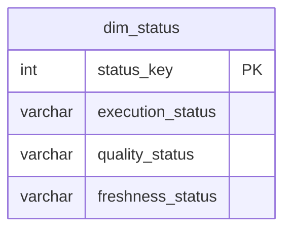

```sql
-- Pre-populate all combinations
INSERT INTO dw.dim_status (execution_status, quality_status, freshness_status)
SELECT e.val, q.val, f.val
FROM (VALUES ('Success'),('Failed'),('Partial'),('Running'),('Cancelled')) AS e(val)
CROSS JOIN (VALUES ('Pass'),('Warning'),('Fail'),('Not Checked')) AS q(val)
CROSS JOIN (VALUES ('On Time'),('Late'),('Stale'),('Unknown')) AS f(val);
```

```sql
-- BigQuery DDL
CREATE TABLE IF NOT EXISTS `project.warehouse.dim_status` (
    status_key          INT64       NOT NULL,
    execution_status    STRING      NOT NULL,
    quality_status      STRING      NOT NULL,
    freshness_status    STRING      NOT NULL
)
OPTIONS (description = 'Junk dimension combining execution, quality, and freshness status flags.');
```

> [!info] Why junk dimensions?
> Without `dim_status`, the fact table would need three separate foreign keys to three tiny tables (or worse, three raw VARCHAR columns). The junk dimension consolidates them into one key, keeping the fact table narrow and the schema clean.

---

## Snowflake Schema

A snowflake schema normalizes dimension hierarchies into separate tables. Instead of storing the full GICS hierarchy in `dim_instrument`, each level gets its own table.

### Snowflake Example: GICS Sector Hierarchy

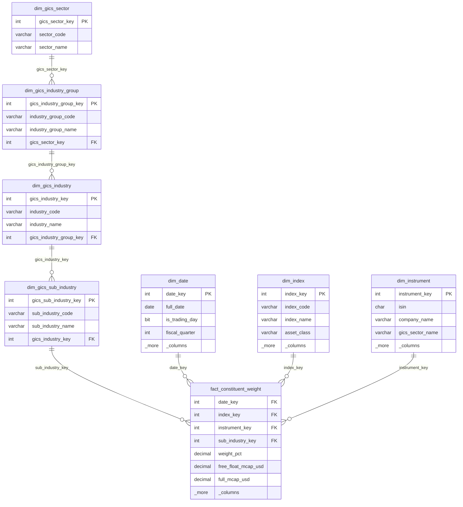

```
dim_instrument → dim_sub_industry → dim_industry → dim_industry_group → dim_sector
```

```sql
-- Snowflaked GICS hierarchy (SQL Server)

CREATE TABLE dw.dim_gics_sector (
    gics_sector_key   INT          IDENTITY(1,1) NOT NULL,
    sector_code       VARCHAR(10)  NOT NULL,
    sector_name       VARCHAR(100) NOT NULL,
    CONSTRAINT pk_gics_sector PRIMARY KEY CLUSTERED (gics_sector_key)
);
```

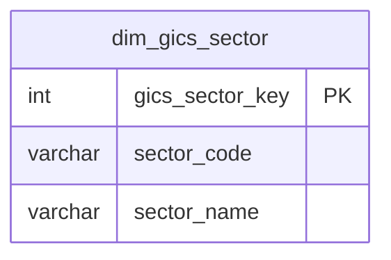

```sql
CREATE TABLE dw.dim_gics_industry_group (
    gics_industry_group_key INT     IDENTITY(1,1) NOT NULL,
    industry_group_code     VARCHAR(10)  NOT NULL,
    industry_group_name     VARCHAR(100) NOT NULL,
    gics_sector_key         INT          NOT NULL,
    CONSTRAINT pk_gics_ig PRIMARY KEY CLUSTERED (gics_industry_group_key),
    CONSTRAINT fk_ig_sector FOREIGN KEY (gics_sector_key) REFERENCES dw.dim_gics_sector(gics_sector_key)
);
```

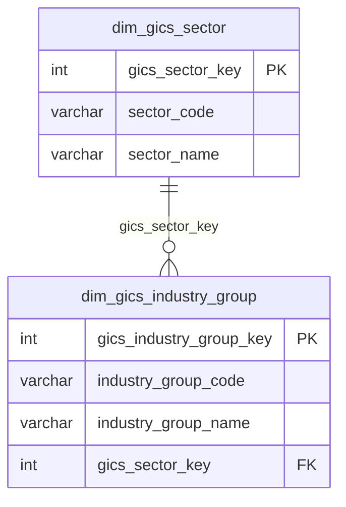

```sql
CREATE TABLE dw.dim_gics_industry (
    gics_industry_key       INT          IDENTITY(1,1) NOT NULL,
    industry_code           VARCHAR(10)  NOT NULL,
    industry_name           VARCHAR(100) NOT NULL,
    gics_industry_group_key INT          NOT NULL,
    CONSTRAINT pk_gics_ind PRIMARY KEY CLUSTERED (gics_industry_key),
    CONSTRAINT fk_ind_ig FOREIGN KEY (gics_industry_group_key) REFERENCES dw.dim_gics_industry_group(gics_industry_group_key)
);
```

```mermaid
%% dim_gics_industry
erDiagram
    dim_gics_industry_group ||--o{ dim_gics_industry : "gics_industry_group_key"

    dim_gics_industry {
        int gics_industry_key PK
        varchar industry_code
        varchar industry_name
        int gics_industry_group_key FK
    }

    dim_gics_industry_group {
        int gics_industry_group_key PK
        varchar industry_group_code
        varchar industry_group_name
    }
```

```sql
CREATE TABLE dw.dim_gics_sub_industry (
    gics_sub_industry_key   INT          IDENTITY(1,1) NOT NULL,
    sub_industry_code       VARCHAR(10)  NOT NULL,
    sub_industry_name       VARCHAR(100) NOT NULL,
    gics_industry_key       INT          NOT NULL,
    CONSTRAINT pk_gics_si PRIMARY KEY CLUSTERED (gics_sub_industry_key),
    CONSTRAINT fk_si_ind FOREIGN KEY (gics_industry_key) REFERENCES dw.dim_gics_industry(gics_industry_key)
);
```

```mermaid
%% dim_gics_sub_industry
erDiagram
    dim_gics_industry ||--o{ dim_gics_sub_industry : "gics_industry_key"

    dim_gics_sub_industry {
        int gics_sub_industry_key PK
        varchar sub_industry_code
        varchar sub_industry_name
        int gics_industry_key FK
    }

    dim_gics_industry {
        int gics_industry_key PK
        varchar industry_code
        varchar industry_name
    }
```

### Star vs Snowflake Comparison

| Criterion | Star Schema | Snowflake Schema |
|-----------|------------|-----------------|
| Number of joins | Fewer (1 hop: fact → dimension) | More (fact → dimension → parent → grandparent) |
| Query simplicity | Simple — business users can self-serve | Complex — requires understanding of normalized chains |
| Dimension table size | Larger (denormalized, repeated text) | Smaller per table (normalized, no redundancy) |
| ETL complexity | Simpler (one table to load per dimension) | More complex (must load hierarchy tables in order) |
| Storage | Slightly more (text duplication) | Slightly less (no duplication) |
| Columnar engine performance | Better (fewer joins = less shuffling) | Worse (more joins, especially in distributed engines like BigQuery) |
| Hierarchy updates | Update one table | Update normalized parent tables (cleaner, single point of change) |
| BI tool compatibility | Excellent (most tools expect star) | Good but requires more metadata configuration |

> [!warning] When to snowflake
> Snowflake the dimension **only** when:
> 1. The hierarchy is extremely large (millions of rows) and updates to a parent level would require touching millions of child rows in a denormalized dimension.
> 2. The hierarchy is maintained by a separate team and needs its own governance.
> 3. The BI tool explicitly benefits from normalized hierarchies (rare).
>
> In **most** cases — including the index provider domain — the star schema wins. Denormalize GICS into `dim_instrument` and `dim_sector`.

---

## Slowly Changing Dimensions — All Types

SCDs handle the fundamental problem: dimension attributes change over time, and the warehouse must decide whether to track that history.

### SCD Type 0 — Fixed Attribute

The attribute **never** changes. If it does, treat it as a data quality error.

**Index provider example**: An ISIN (International Securities Identification Number) is assigned once and never changes for the life of the instrument.

```sql
-- ISIN is Type 0 in dim_instrument
-- The ETL simply ignores any incoming change to ISIN
-- If source sends a different ISIN for an existing SEDOL, flag it as a data quality issue

-- Detection query
SELECT
    src.sedol,
    tgt.isin AS warehouse_isin,
    src.isin AS incoming_isin
FROM staging.stg_instruments src
JOIN dw.dim_instrument tgt
    ON src.sedol = tgt.sedol
    AND tgt.is_current = 1
WHERE src.isin <> tgt.isin;
```

---

### SCD Type 1 — Overwrite

The old value is **destroyed**. The dimension row is updated in place. No history is preserved.

**Index provider example**: A typo in a company name is corrected. There is no business reason to preserve the misspelling.

```sql
-- SCD Type 1: fix company name typo
UPDATE dw.dim_instrument
SET
    company_name   = 'Acme Global Holdings Ltd',
    row_updated_at = SYSUTCDATETIME()
WHERE isin = 'US0000000001'
  AND is_current = 1
  AND company_name = 'Acme Gloabl Holdings Ltd';  -- typo: 'Gloabl'
```

**Index provider example**: GICS reclassification in `dim_sector`. When the classification body reorganizes sectors, the index provider typically restates history — so SCD Type 1 (overwrite) is appropriate for the sector hierarchy.

```sql
-- SCD Type 1: GICS reclassification
UPDATE dw.dim_sector
SET
    gics_sector_name    = 'Communication Services',
    row_updated_at      = SYSUTCDATETIME()
WHERE gics_sector_code = '50'
  AND gics_sector_name = 'Telecommunication Services';
```

---

### SCD Type 2 — Add New Row with Date Range

The most powerful and most common SCD type for analytical warehouses. When an attribute changes, the current row is expired (set `valid_to` and `is_current = 0`) and a new row is inserted with the updated values.

**Index provider example**: A company is reclassified from the Technology sector to the Communication Services sector. The old row is preserved so historical queries join to the old sector and current queries join to the new sector.

```sql
-- =============================================================
-- SCD Type 2 MERGE for dim_instrument (SQL Server)
-- Source: staging.stg_instruments (daily feed from data vendor)
-- =============================================================

MERGE dw.dim_instrument AS tgt
USING staging.stg_instruments AS src
    ON tgt.isin = src.isin
    AND tgt.is_current = 1

-- MATCH: attributes have changed → expire current row
WHEN MATCHED
    AND (
        tgt.company_name             <> src.company_name
        OR tgt.gics_sector_code      <> src.gics_sector_code
        OR tgt.gics_industry_code    <> src.gics_industry_code
        OR tgt.country_of_listing    <> src.country_of_listing
        OR tgt.exchange_code         <> src.exchange_code
        OR tgt.market_cap_band       <> src.market_cap_band
    )
THEN UPDATE SET
    tgt.valid_to    = DATEADD(DAY, -1, CAST(GETDATE() AS DATE)),
    tgt.is_current  = 0

-- NO MATCH: brand new instrument → insert
WHEN NOT MATCHED BY TARGET
THEN INSERT (
    isin, sedol, cusip, ticker, figi,
    company_name, company_name_short,
    country_of_incorporation, country_of_listing,
    exchange_code, exchange_name, primary_currency,
    gics_sector_code, gics_sector_name,
    gics_industry_group_code, gics_industry_group_name,
    gics_industry_code, gics_industry_name,
    gics_sub_industry_code, gics_sub_industry_name,
    market_cap_band, is_active,
    valid_from, valid_to, is_current
)
VALUES (
    src.isin, src.sedol, src.cusip, src.ticker, src.figi,
    src.company_name, src.company_name_short,
    src.country_of_incorporation, src.country_of_listing,
    src.exchange_code, src.exchange_name, src.primary_currency,
    src.gics_sector_code, src.gics_sector_name,
    src.gics_industry_group_code, src.gics_industry_group_name,
    src.gics_industry_code, src.gics_industry_name,
    src.gics_sub_industry_code, src.gics_sub_industry_name,
    src.market_cap_band, 1,
    CAST(GETDATE() AS DATE), '9999-12-31', 1
);

-- Step 2: Insert new current rows for expired records
-- (MERGE cannot INSERT and UPDATE the same target in one pass for SCD2,
--  so we use a follow-up INSERT for changed rows)
INSERT INTO dw.dim_instrument (
    isin, sedol, cusip, ticker, figi,
    company_name, company_name_short,
    country_of_incorporation, country_of_listing,
    exchange_code, exchange_name, primary_currency,
    gics_sector_code, gics_sector_name,
    gics_industry_group_code, gics_industry_group_name,
    gics_industry_code, gics_industry_name,
    gics_sub_industry_code, gics_sub_industry_name,
    market_cap_band, is_active,
    valid_from, valid_to, is_current
)
SELECT
    src.isin, src.sedol, src.cusip, src.ticker, src.figi,
    src.company_name, src.company_name_short,
    src.country_of_incorporation, src.country_of_listing,
    src.exchange_code, src.exchange_name, src.primary_currency,
    src.gics_sector_code, src.gics_sector_name,
    src.gics_industry_group_code, src.gics_industry_group_name,
    src.gics_industry_code, src.gics_industry_name,
    src.gics_sub_industry_code, src.gics_sub_industry_name,
    src.market_cap_band, 1,
    CAST(GETDATE() AS DATE), '9999-12-31', 1
FROM staging.stg_instruments src
JOIN dw.dim_instrument tgt
    ON src.isin = tgt.isin
    AND tgt.is_current = 0
    AND tgt.valid_to = DATEADD(DAY, -1, CAST(GETDATE() AS DATE))
WHERE NOT EXISTS (
    SELECT 1 FROM dw.dim_instrument chk
    WHERE chk.isin = src.isin AND chk.is_current = 1
);
```

> [!tip] The valid_from / valid_to / is_current pattern
> - `valid_from`: the date this version of the row became effective
> - `valid_to`: the last date this version is effective (`9999-12-31` for the current row)
> - `is_current`: convenience flag (`1` for the active row, `0` for historical)
>
> To query as-of a specific historical date:
> ```sql
> SELECT *
> FROM dw.dim_instrument
> WHERE isin = 'US0000000001'
>   AND '2025-06-15' BETWEEN valid_from AND valid_to;
> ```

---

### SCD Type 3 — Add Previous Value Column

Instead of adding a new row, add a column to store the prior value. Preserves exactly one level of history.

**Index provider example**: Track previous sector alongside current sector for transition analysis.

```sql
-- SCD Type 3: add previous_sector columns to dim_instrument
ALTER TABLE dw.dim_instrument ADD
    previous_gics_sector_code VARCHAR(10) NULL,
    previous_gics_sector_name VARCHAR(100) NULL,
    sector_change_date        DATE         NULL;

-- When sector changes:
UPDATE dw.dim_instrument
SET
    previous_gics_sector_code = gics_sector_code,
    previous_gics_sector_name = gics_sector_name,
    gics_sector_code          = '50',
    gics_sector_name          = 'Communication Services',
    sector_change_date        = '2026-03-22'
WHERE isin = 'US0000000001'
  AND is_current = 1;
```

> [!warning] SCD Type 3 limitations
> Only stores the single previous value. If the attribute changes again, the oldest value is lost. Use Type 2 if you need full history. Type 3 is best when you only need "before and after" comparisons.

---

### SCD Type 4 — Mini-Dimension

Split rapidly changing attributes into a separate **mini-dimension** table. The main dimension stays stable; the mini-dimension handles the volatility.

**Index provider example**: Market capitalization band (`Mega`, `Large`, `Mid`, `Small`, `Micro`) changes frequently — potentially quarterly. Rather than creating a new SCD Type 2 row in `dim_instrument` every time market cap band shifts, extract it into a mini-dimension.

```sql
-- Mini-dimension for rapidly changing instrument attributes
CREATE TABLE dw.dim_instrument_profile (
    instrument_profile_key  INT         IDENTITY(1,1) NOT NULL,
    market_cap_band         VARCHAR(20) NOT NULL,
    liquidity_tier          VARCHAR(20) NOT NULL,  -- 'High', 'Medium', 'Low'
    free_float_band         VARCHAR(20) NOT NULL,  -- '>75%', '50-75%', '25-50%', '<25%'
    volatility_quintile     TINYINT     NOT NULL,  -- 1-5

    CONSTRAINT pk_dim_inst_profile PRIMARY KEY CLUSTERED (instrument_profile_key)
);

CREATE UNIQUE NONCLUSTERED INDEX uix_dim_inst_profile
    ON dw.dim_instrument_profile(market_cap_band, liquidity_tier, free_float_band, volatility_quintile);

-- The fact table now has TWO foreign keys to the instrument dimension:
-- instrument_key      → dim_instrument (stable attributes: name, ISIN, sector)
-- instrument_profile_key → dim_instrument_profile (volatile attributes: cap band, liquidity)
```

```mermaid
%% dim_instrument_profile
erDiagram
    dim_instrument_profile {
        int instrument_profile_key PK
        varchar market_cap_band
        varchar liquidity_tier
        varchar free_float_band
        int volatility_quintile
    }
```

---

### SCD Type 6 — Hybrid (Type 1 + 2 + 3)

Combines all three approaches. A new SCD Type 2 row is created (Type 2), the previous value is stored in a column (Type 3), and the current value is also overwritten on all historical rows (Type 1) so that queries filtering on the current sector still find the historical rows.

```sql
-- SCD Type 6 example: dim_instrument with current_ overwrite columns
ALTER TABLE dw.dim_instrument ADD
    current_gics_sector_code VARCHAR(10) NULL,
    current_gics_sector_name VARCHAR(100) NULL;

-- When sector changes from 'Technology' to 'Communication Services':

-- Step 1 (Type 2): Expire old row, insert new row
-- (Same MERGE logic as Type 2 above)

-- Step 2 (Type 1): Overwrite current_ columns on ALL historical rows
UPDATE dw.dim_instrument
SET
    current_gics_sector_code = '50',
    current_gics_sector_name = 'Communication Services'
WHERE isin = 'US0000000001';
-- This updates ALL rows for this ISIN — both historical and current
```

> [!info] When to use Type 6
> Type 6 is powerful when users need both historical accuracy AND the ability to filter all history by the current classification. For example: "Show me the complete weight history of all stocks that are **currently** in the Communication Services sector — even before they were reclassified."

---

### SCD Decision Matrix

| Attribute | Example | Recommended SCD Type | Reasoning |
|-----------|---------|---------------------|-----------|
| ISIN | `US0000000001` | Type 0 (fixed) | Assigned once, never changes |
| Company name (typo fix) | 'Gloabl' → 'Global' | Type 1 (overwrite) | No business value in preserving errors |
| GICS sector (dim_sector) | GICS reclassification | Type 1 (overwrite) | Industry standard is to restate |
| GICS sector (dim_instrument) | Company reclassified | Type 2 (new row) | Preserve which sector the company was in when it was a constituent |
| Exchange listing | NYSE → LSE | Type 2 (new row) | Material change, history needed |
| Market cap band | Large → Mid | Type 4 (mini-dimension) | Changes frequently, would bloat Type 2 rows |
| Index weighting method | Free-float → capped | Type 2 (new row) | Methodology change is a significant event |
| Currency name | 'Euro' (never changes) | Type 0 (fixed) | Static reference data |
| Rebalancing frequency | Quarterly → Monthly | Type 2 (new row) | Methodology change with historical impact |

---

## Advanced Modeling Patterns

### Conformed Dimensions

A conformed dimension is a dimension table shared by multiple fact tables across the warehouse. It ensures that "Wednesday" means the same thing in the index valuation fact as it does in the pipeline monitoring fact.

> [!tip] The two rules of conformed dimensions
> 1. **Same dimension table, same keys**: Multiple fact tables reference the same physical `dim_date`, `dim_instrument`, etc.
> 2. **Subset conformance**: A dimension used by one fact table may be a subset of a broader dimension used by another — as long as the shared attributes have identical meaning.

The **enterprise bus matrix** documents which conformed dimensions are used by which business processes.

### Enterprise Bus Matrix — Index Provider Domain

| Business Process / Fact Table | dim_date | dim_index | dim_instrument | dim_sector | dim_currency | dim_corporate_action_type | dim_pipeline | dim_status |
|-------------------------------|:--------:|:---------:|:--------------:|:----------:|:------------:|:------------------------:|:------------:|:----------:|
| **fact_index_valuation** | X | X | | | X | | | |
| **fact_constituent_weight** | X | X | X | X | | | | |
| **fact_corporate_action** | X | | X | | X | X | | |
| **fact_index_calculation_run** | X | | | | | | X | X |
| **fact_index_eligibility** (factless) | X | X | X | X | | | | |

`dim_date` is conformed across every fact table. `dim_instrument` is conformed across constituent weight, corporate action, and eligibility facts.

---

### Bridge Tables

```mermaid
erDiagram
    %% Bridge Table — Many-to-Many: Index to Constituent

    dim_index ||--o{ bridge_index_constituent : "index_key"
    dim_instrument ||--o{ bridge_index_constituent : "instrument_key"

    dim_index {
        int index_key PK
        varchar index_code
        varchar index_name
        varchar asset_class
        _more _columns
    }

    bridge_index_constituent {
        int bridge_key PK
        int index_key FK
        int instrument_key FK
        date effective_date
        date expiry_date
        decimal weight_pct
    }

    dim_instrument {
        int instrument_key PK
        char isin
        varchar company_name
        varchar gics_sector_name
        _more _columns
    }
```

Bridge tables solve the **many-to-many** relationship between dimensions.

**Index provider example**: One index contains many instruments. One instrument belongs to many indices. On any given date, the relationship between indices and instruments is many-to-many.

```sql
-- =============================================================
-- bridge_index_constituent
-- Resolves M:M between dim_index and dim_instrument
-- =============================================================

CREATE TABLE dw.bridge_index_constituent (
    bridge_key        INT     IDENTITY(1,1) NOT NULL,
    index_key         INT     NOT NULL,
    instrument_key    INT     NOT NULL,
    effective_date    DATE    NOT NULL,
    expiry_date       DATE    NOT NULL DEFAULT '9999-12-31',
    weight_pct        DECIMAL(12,8) NULL,

    CONSTRAINT pk_bridge_idx_const PRIMARY KEY NONCLUSTERED (bridge_key),
    CONSTRAINT fk_bic_index FOREIGN KEY (index_key) REFERENCES dw.dim_index(index_key),
    CONSTRAINT fk_bic_instrument FOREIGN KEY (instrument_key) REFERENCES dw.dim_instrument(instrument_key)
);

CREATE CLUSTERED INDEX ix_bridge_idx_const
    ON dw.bridge_index_constituent(index_key, effective_date, instrument_key);
```

```mermaid
%% bridge_index_constituent
erDiagram
    dim_index ||--o{ bridge_index_constituent : "index_key"
    dim_instrument ||--o{ bridge_index_constituent : "instrument_key"

    bridge_index_constituent {
        int bridge_key PK
        int index_key FK
        int instrument_key FK
        date effective_date
        date expiry_date
        decimal weight_pct
    }
```

```sql
-- Query: Which instruments are in a given index today?
SELECT
    di.index_name,
    dinst.company_name,
    dinst.ticker,
    b.weight_pct
FROM dw.bridge_index_constituent b
JOIN dw.dim_index di ON b.index_key = di.index_key AND di.is_current = 1
JOIN dw.dim_instrument dinst ON b.instrument_key = dinst.instrument_key AND dinst.is_current = 1
WHERE di.index_code = 'GLBL_EQ_500'
  AND CAST(GETDATE() AS DATE) BETWEEN b.effective_date AND b.expiry_date
ORDER BY b.weight_pct DESC;
```

> [!note] Bridge table vs fact table for many-to-many
> In this index provider domain, `fact_constituent_weight` already captures the many-to-many relationship (each row has both `index_key` and `instrument_key`). A separate bridge table is useful when:
> 1. The relationship exists **without** a natural fact (membership without weights)
> 2. You need to filter one dimension through another in a BI tool (e.g., "show me all indices containing a specific stock")
> 3. The relationship changes at a different cadence than the fact table grain

---

### Factless Fact Tables

```mermaid
erDiagram
    %% Factless Fact Table — Index Eligibility

    dim_date ||--o{ fact_index_eligibility : "date_key"
    dim_index ||--o{ fact_index_eligibility : "index_key"
    dim_instrument ||--o{ fact_index_eligibility : "instrument_key"
    dim_sector ||--o{ fact_index_eligibility : "sector_key"

    fact_index_eligibility {
        int date_key FK
        int index_key FK
        int instrument_key FK
        int sector_key FK
    }

    dim_date {
        int date_key PK
        date full_date
        bit is_trading_day
        int fiscal_quarter
        _more _columns
    }

    dim_index {
        int index_key PK
        varchar index_code
        varchar index_name
        varchar asset_class
        _more _columns
    }

    dim_instrument {
        int instrument_key PK
        char isin
        varchar company_name
        varchar gics_sector_name
        _more _columns
    }

    dim_sector {
        int sector_key PK
        varchar gics_sector_code
        varchar gics_sector_name
        varchar gics_sub_industry_name
        _more _columns
    }
```

A factless fact table contains only foreign keys — no numeric measures. It records the occurrence of an event or the existence of a relationship.

#### Coverage / Eligibility Factless Fact

"Which stocks were **eligible** for inclusion in which indices on which date?" This is distinct from actual membership (a stock can be eligible but not selected).

```sql
-- =============================================================
-- fact_index_eligibility — factless fact
-- Grain: one instrument, one index, one eligibility review date
-- No measures — the row's existence IS the fact
-- =============================================================

CREATE TABLE dw.fact_index_eligibility (
    date_key          INT     NOT NULL,
    index_key         INT     NOT NULL,
    instrument_key    INT     NOT NULL,
    sector_key        INT     NOT NULL,

    -- Degenerate dimensions (optional context)
    eligibility_reason VARCHAR(50) NULL,  -- 'Market cap', 'Liquidity', 'Free float'
    review_cycle      VARCHAR(20) NULL,   -- 'Q1-2026', 'Q2-2026'

    CONSTRAINT pk_fact_eligibility PRIMARY KEY NONCLUSTERED (date_key, index_key, instrument_key),

    CONSTRAINT fk_fe_date FOREIGN KEY (date_key) REFERENCES dw.dim_date(date_key),
    CONSTRAINT fk_fe_index FOREIGN KEY (index_key) REFERENCES dw.dim_index(index_key),
    CONSTRAINT fk_fe_instrument FOREIGN KEY (instrument_key) REFERENCES dw.dim_instrument(instrument_key),
    CONSTRAINT fk_fe_sector FOREIGN KEY (sector_key) REFERENCES dw.dim_sector(sector_key)
);

CREATE CLUSTERED COLUMNSTORE INDEX cci_fact_eligibility
    ON dw.fact_index_eligibility;
```

```mermaid
%% fact_index_eligibility
erDiagram
    dim_date ||--o{ fact_index_eligibility : "date_key"
    dim_index ||--o{ fact_index_eligibility : "index_key"
    dim_instrument ||--o{ fact_index_eligibility : "instrument_key"
    dim_sector ||--o{ fact_index_eligibility : "sector_key"

    fact_index_eligibility {
        int date_key FK
        int index_key FK
        int instrument_key FK
        int sector_key FK
        varchar eligibility_reason
        varchar review_cycle
    }
```

```sql
-- Query: How many stocks were eligible for the global equity benchmark
--        but not actually selected in Q1 2026?
SELECT
    dd.quarter_name,
    COUNT(DISTINCT elig.instrument_key)  AS eligible_count,
    COUNT(DISTINCT cw.instrument_key)    AS selected_count,
    COUNT(DISTINCT elig.instrument_key)
        - COUNT(DISTINCT cw.instrument_key) AS eligible_not_selected
FROM dw.fact_index_eligibility elig
JOIN dw.dim_date dd ON elig.date_key = dd.date_key
JOIN dw.dim_index di ON elig.index_key = di.index_key AND di.is_current = 1
LEFT JOIN dw.fact_constituent_weight cw
    ON elig.date_key = cw.date_key
    AND elig.index_key = cw.index_key
    AND elig.instrument_key = cw.instrument_key
WHERE di.index_code = 'GLBL_EQ_500'
  AND dd.quarter_name = 'Q1 2026'
GROUP BY dd.quarter_name;
```

#### Event Factless Fact

"Which corporate actions were **announced** on which date?" The announcement itself is the event — no measures needed (the detailed corporate action facts live in `fact_corporate_action`).

```sql
-- Query using fact_corporate_action as an event fact
-- Count: how many corporate actions per type per month?
SELECT
    dd.year_month_key,
    cat.action_name,
    COUNT(*) AS action_count
FROM dw.fact_corporate_action fca
JOIN dw.dim_date dd ON fca.announcement_date_key = dd.date_key
JOIN dw.dim_corporate_action_type cat ON fca.action_type_key = cat.action_type_key
WHERE dd.calendar_year = 2026
GROUP BY dd.year_month_key, cat.action_name
ORDER BY dd.year_month_key, action_count DESC;
```

---

### Aggregate / Summary Tables

```mermaid
erDiagram
    %% Aggregate Tables — Pre-computed Rollups

    dim_date ||--o{ agg_monthly_index_performance : "year_month_key"
    dim_index ||--o{ agg_monthly_index_performance : "index_key"
    dim_currency ||--o{ agg_monthly_index_performance : "currency_key"

    dim_date ||--o{ agg_sector_weight : "date_key"
    dim_index ||--o{ agg_sector_weight : "index_key"
    dim_sector ||--o{ agg_sector_weight : "sector_key"

    agg_monthly_index_performance {
        int year_month_key FK
        int index_key FK
        int currency_key FK
        decimal monthly_return_pct
        decimal month_close_level
        decimal avg_market_cap_usd
        _more _columns
    }

    agg_sector_weight {
        int date_key FK
        int index_key FK
        int sector_key FK
        decimal total_weight_pct
        int constituent_count
        decimal total_free_float_mcap
        _more _columns
    }

    dim_date {
        int date_key PK
        date full_date
        bit is_trading_day
        int fiscal_quarter
        _more _columns
    }

    dim_index {
        int index_key PK
        varchar index_code
        varchar index_name
        varchar asset_class
        _more _columns
    }

    dim_currency {
        int currency_key PK
        char currency_code
        varchar currency_name
        nvarchar symbol
        bit is_major
        tinyint decimal_places
    }

    dim_sector {
        int sector_key PK
        varchar gics_sector_code
        varchar gics_sector_name
        varchar gics_sub_industry_name
        _more _columns
    }
```

Pre-computed rollups trade storage for query speed. Critical for dashboards that must render in under two seconds.

#### Monthly Index Performance Aggregate

```sql
-- =============================================================
-- agg_monthly_index_performance
-- Pre-computed from fact_index_valuation
-- =============================================================

CREATE TABLE dw.agg_monthly_index_performance (
    year_month_key        INT           NOT NULL,  -- YYYYMM
    index_key             INT           NOT NULL,
    currency_key          INT           NOT NULL,

    -- Month start / end levels
    month_open_level      DECIMAL(18,6) NOT NULL,
    month_close_level     DECIMAL(18,6) NOT NULL,
    month_high_level      DECIMAL(18,6) NOT NULL,
    month_low_level       DECIMAL(18,6) NOT NULL,

    -- Calculated measures
    monthly_return_pct    DECIMAL(12,6) NOT NULL,
    avg_daily_return_pct  DECIMAL(12,6) NOT NULL,
    stddev_daily_return   DECIMAL(12,6) NULL,
    trading_days_in_month INT           NOT NULL,

    -- Aggregated from daily
    avg_market_cap_usd    DECIMAL(20,2) NULL,
    avg_pe_ratio          DECIMAL(10,4) NULL,
    avg_dividend_yield    DECIMAL(8,4)  NULL,
    avg_num_constituents  DECIMAL(8,2)  NULL,

    -- Metadata
    row_computed_at       DATETIME2     NOT NULL DEFAULT SYSUTCDATETIME(),

    CONSTRAINT pk_agg_monthly_perf PRIMARY KEY CLUSTERED (year_month_key, index_key)
);
```

```mermaid
%% agg_monthly_index_performance
erDiagram
    dim_date ||--o{ agg_monthly_index_performance : "year_month_key"
    dim_index ||--o{ agg_monthly_index_performance : "index_key"
    dim_currency ||--o{ agg_monthly_index_performance : "currency_key"

    agg_monthly_index_performance {
        int year_month_key FK
        int index_key FK
        int currency_key FK
        decimal monthly_return_pct
        decimal month_close_level
        decimal avg_market_cap_usd
        _more _columns
    }
```

```sql
-- Populate the aggregate
INSERT INTO dw.agg_monthly_index_performance
SELECT
    dd.year_month_key,
    fiv.index_key,
    fiv.currency_key,
    FIRST_VALUE(fiv.index_level) OVER (
        PARTITION BY dd.year_month_key, fiv.index_key ORDER BY dd.date_key
    )                                                           AS month_open_level,
    LAST_VALUE(fiv.index_level) OVER (
        PARTITION BY dd.year_month_key, fiv.index_key
        ORDER BY dd.date_key
        ROWS BETWEEN UNBOUNDED PRECEDING AND UNBOUNDED FOLLOWING
    )                                                           AS month_close_level,
    MAX(fiv.index_level)                                        AS month_high_level,
    MIN(fiv.index_level)                                        AS month_low_level,
    -- Monthly return: (close / open) - 1
    (LAST_VALUE(fiv.index_level) OVER (
        PARTITION BY dd.year_month_key, fiv.index_key
        ORDER BY dd.date_key
        ROWS BETWEEN UNBOUNDED PRECEDING AND UNBOUNDED FOLLOWING
    ) / NULLIF(FIRST_VALUE(fiv.index_level) OVER (
        PARTITION BY dd.year_month_key, fiv.index_key ORDER BY dd.date_key
    ), 0) - 1) * 100                                            AS monthly_return_pct,
    AVG(fiv.daily_return_pct)                                   AS avg_daily_return_pct,
    STDEV(fiv.daily_return_pct)                                 AS stddev_daily_return,
    COUNT(*)                                                    AS trading_days_in_month,
    AVG(fiv.market_cap_usd)                                     AS avg_market_cap_usd,
    AVG(fiv.pe_ratio)                                           AS avg_pe_ratio,
    AVG(fiv.dividend_yield_pct)                                 AS avg_dividend_yield,
    AVG(CAST(fiv.num_constituents AS DECIMAL(8,2)))             AS avg_num_constituents,
    SYSUTCDATETIME()                                            AS row_computed_at
FROM dw.fact_index_valuation fiv
JOIN dw.dim_date dd ON fiv.date_key = dd.date_key
WHERE dd.is_trading_day = 1
GROUP BY dd.year_month_key, fiv.index_key, fiv.currency_key;
```

#### Sector-Level Weight Rollup

```sql
-- =============================================================
-- agg_sector_weight
-- Sector-level constituent weights per index per rebalancing date
-- =============================================================

CREATE TABLE dw.agg_sector_weight (
    date_key              INT           NOT NULL,
    index_key             INT           NOT NULL,
    sector_key            INT           NOT NULL,

    total_weight_pct      DECIMAL(12,8) NOT NULL,
    constituent_count     INT           NOT NULL,
    avg_free_float_factor DECIMAL(8,6)  NULL,
    total_free_float_mcap DECIMAL(20,2) NULL,

    row_computed_at       DATETIME2     NOT NULL DEFAULT SYSUTCDATETIME(),

    CONSTRAINT pk_agg_sector_weight PRIMARY KEY CLUSTERED (date_key, index_key, sector_key)
);
```

```mermaid
%% agg_sector_weight
erDiagram
    dim_date ||--o{ agg_sector_weight : "date_key"
    dim_index ||--o{ agg_sector_weight : "index_key"
    dim_sector ||--o{ agg_sector_weight : "sector_key"

    agg_sector_weight {
        int date_key FK
        int index_key FK
        int sector_key FK
        decimal total_weight_pct
        int constituent_count
        decimal total_free_float_mcap
        _more _columns
    }
```

```sql
-- Populate
INSERT INTO dw.agg_sector_weight
SELECT
    fcw.date_key,
    fcw.index_key,
    fcw.sector_key,
    SUM(fcw.weight_pct)                AS total_weight_pct,
    COUNT(*)                           AS constituent_count,
    AVG(fcw.free_float_factor)         AS avg_free_float_factor,
    SUM(fcw.free_float_mcap_usd)       AS total_free_float_mcap,
    SYSUTCDATETIME()                   AS row_computed_at
FROM dw.fact_constituent_weight fcw
GROUP BY fcw.date_key, fcw.index_key, fcw.sector_key;
```

> [!note] Aggregates vs materialized views
> | Consideration | Aggregate Table | Materialized View |
> |--------------|-----------------|-------------------|
> | Refresh control | Manual (ETL job) | Automatic (engine-managed) |
> | Custom logic | Full SQL flexibility | Limited to view definition |
> | Cross-platform | Works everywhere | Platform-specific (BigQuery MV, SQL Server indexed view) |
> | Storage cost | Explicit table, you manage lifecycle | Engine manages storage |
> | Staleness risk | Must schedule refresh | Auto-refresh (BigQuery) or immediate (SQL Server indexed view) |
>
> Use aggregate tables when you need custom refresh logic, complex calculations, or cross-platform portability. Use materialized views for simple rollups that the engine can auto-maintain.

---

### Late-Arriving Facts and Dimensions

Real-world data pipelines are messy. Facts and dimensions do not always arrive on time.

#### Late-Arriving Facts

A corporate action is announced retroactively — the effective date was three days ago, but the data feed only delivered it today.

```sql
-- Late-arriving corporate action
-- The fact row references a date_key in the past
-- The dimension keys must resolve as-of the effective date, not today

-- Step 1: Look up the correct instrument_key as of the effective date
DECLARE @effective_date DATE = '2026-03-19';  -- 3 days ago
DECLARE @effective_date_key INT = 20260319;
DECLARE @isin CHAR(12) = 'GB0000000002';

DECLARE @instrument_key INT;
SELECT @instrument_key = instrument_key
FROM dw.dim_instrument
WHERE isin = @isin
  AND @effective_date BETWEEN valid_from AND valid_to;

-- Step 2: Insert the late-arriving fact with the historically correct dimension key
INSERT INTO dw.fact_corporate_action (
    effective_date_key, announcement_date_key, instrument_key, action_type_key,
    corporate_action_id, adjustment_factor, old_value, new_value,
    is_mandatory, is_processed, affects_index_divisor,
    row_source_system
)
VALUES (
    @effective_date_key,
    20260322,  -- announced today
    @instrument_key,
    (SELECT action_type_key FROM dw.dim_corporate_action_type WHERE action_code = 'SPLIT'),
    'CA-2026-0319-SPLIT-001',
    2.000000,   -- 2-for-1 split
    1.000000,   -- old shares per unit
    2.000000,   -- new shares per unit
    1, 0, 1,
    'CORP_ACTIONS_LATE'
);
```

> [!warning] Late-arriving fact pitfall
> Always resolve dimension keys **as-of the fact's effective date**, not as-of the load date. If you use `is_current = 1`, you will join to today's dimension row, which may have different attributes than existed on the fact's actual date.

#### Late-Arriving Dimensions

A new instrument appears in a constituent weight feed before its dimension record has been loaded. The ETL must not fail.

```sql
-- Late-arriving dimension: placeholder row pattern

-- Step 1: Insert a placeholder row for the unknown instrument
INSERT INTO dw.dim_instrument (
    isin, company_name, is_active, valid_from, valid_to, is_current
)
VALUES (
    'XX_UNKNOWN_001',             -- placeholder ISIN
    'Unknown Instrument (pending)', -- clearly flagged
    1,
    '1900-01-01',
    '9999-12-31',
    1
);

-- The fact row is loaded using the placeholder's instrument_key.
-- Step 2: When the real dimension data arrives, update the placeholder.
-- This is effectively an SCD Type 1 correction on the placeholder.

UPDATE dw.dim_instrument
SET
    isin                     = 'JP0000000003',
    sedol                    = '1234567',
    company_name             = 'Pacific Industrial Corp',
    country_of_incorporation = 'JP',
    country_of_listing       = 'JP',
    exchange_code            = 'XJPX',
    gics_sector_code         = '20',
    gics_sector_name         = 'Industrials',
    valid_from               = '2026-03-22',
    row_loaded_at            = SYSUTCDATETIME()
WHERE isin = 'XX_UNKNOWN_001'
  AND is_current = 1;
```

> [!tip] Best practice for late-arriving dimensions
> 1. Create a **standard placeholder** row with a recognizable pattern (e.g., `company_name LIKE 'Unknown%'`).
> 2. Assign a real surrogate key — do **not** use -1 or 0, as these collide with legitimate keys in some systems.
> 3. Monitor placeholders daily: `SELECT COUNT(*) FROM dw.dim_instrument WHERE company_name LIKE 'Unknown%'`.
> 4. Alert if any placeholder is older than your SLA (e.g., 3 business days).

---

## Physical Implementation

### SQL Server

#### Clustered Columnstore Indexes on Fact Tables

All fact tables should use a **clustered columnstore index** (CCI). This is the single most impactful physical design decision for analytical workloads in SQL Server.

```sql
-- Already shown in DDL above. Key points:
-- 1. Create CCI after the table is defined
-- 2. Drop any clustered B-tree index first (only one clustered index per table)
-- 3. CCI provides 5-10x compression and 10-100x query acceleration on analytical scans

-- Verify compression ratio
SELECT
    t.name                                                    AS table_name,
    SUM(ps.reserved_page_count) * 8 / 1024.0                 AS total_mb,
    SUM(ps.used_page_count) * 8 / 1024.0                     AS used_mb,
    SUM(ps.row_count)                                         AS row_count
FROM sys.dm_db_partition_stats ps
JOIN sys.tables t ON ps.object_id = t.object_id
JOIN sys.schemas s ON t.schema_id = s.schema_id
WHERE s.name = 'dw'
  AND t.name LIKE 'fact_%'
GROUP BY t.name
ORDER BY total_mb DESC;
```

#### Nonclustered Indexes on Dimension Lookup Columns

```sql
-- Pattern: nonclustered index on the natural key + is_current flag,
-- INCLUDEing the surrogate key and commonly selected columns.
-- This supports dimension lookups during ETL (natural key → surrogate key)
-- and BI tool browsing (filter/search on natural key).

-- Already shown in DDL above for each dimension table.
```

#### Partitioning Fact Tables by Date

```sql
-- Partition function and scheme for date-based partitioning
CREATE PARTITION FUNCTION pf_date_monthly (INT)
AS RANGE RIGHT FOR VALUES (
    20250101, 20250201, 20250301, 20250401, 20250501, 20250601,
    20250701, 20250801, 20250901, 20251001, 20251101, 20251201,
    20260101, 20260201, 20260301, 20260401, 20260501, 20260601,
    20260701, 20260801, 20260901, 20261001, 20261101, 20261201
);

CREATE PARTITION SCHEME ps_date_monthly
AS PARTITION pf_date_monthly ALL TO ([PRIMARY]);

-- Apply to fact table (must recreate or use ALTER TABLE ... SWITCH)
-- New table example:
CREATE TABLE dw.fact_index_valuation_partitioned (
    date_key              INT           NOT NULL,
    index_key             INT           NOT NULL,
    currency_key          INT           NOT NULL,
    calculation_batch_id  VARCHAR(50)   NOT NULL,
    index_level           DECIMAL(18,6) NOT NULL,
    daily_return_pct      DECIMAL(10,6) NULL,
    market_cap_usd        DECIMAL(20,2) NULL,
    -- ... (remaining columns)
    row_loaded_at         DATETIME2     NOT NULL DEFAULT SYSUTCDATETIME()
) ON ps_date_monthly(date_key);

CREATE CLUSTERED COLUMNSTORE INDEX cci_fiv_part
    ON dw.fact_index_valuation_partitioned
    ON ps_date_monthly(date_key);
```

```mermaid
%% fact_index_valuation_partitioned
erDiagram
    dim_date ||--o{ fact_index_valuation_partitioned : "date_key"
    dim_index ||--o{ fact_index_valuation_partitioned : "index_key"
    dim_currency ||--o{ fact_index_valuation_partitioned : "currency_key"

    fact_index_valuation_partitioned {
        int date_key FK
        int index_key FK
        int currency_key FK
        decimal index_level
        decimal daily_return_pct
        decimal market_cap_usd
        _more _columns
    }
```

#### Compression Strategy

| Table Type | Compression | Rationale |
|-----------|------------|-----------|
| Fact tables | Clustered columnstore (COLUMNSTORE_ARCHIVE for cold partitions) | Maximum compression + scan speed |
| Dimension tables (small, <1M rows) | PAGE compression | Good compression without columnstore overhead |
| Dimension tables (large, >1M rows) | Clustered columnstore | Same benefits as fact tables |
| Staging tables | None or ROW | Staging is transient; compression overhead not worth it |
| Aggregate tables | PAGE or columnstore | Depends on size; columnstore if >100K rows |

```sql
-- Apply PAGE compression to a dimension
ALTER TABLE dw.dim_instrument REBUILD WITH (DATA_COMPRESSION = PAGE);

-- Apply COLUMNSTORE_ARCHIVE to cold fact partitions (older than 1 year)
ALTER INDEX cci_fact_index_valuation ON dw.fact_index_valuation
    REBUILD PARTITION = 1  -- January 2025
    WITH (DATA_COMPRESSION = COLUMNSTORE_ARCHIVE);
```

---

### BigQuery

#### Partitioning and Clustering

```sql
-- Partitioning by date_key (integer range) and clustering by frequently filtered columns
-- Already shown in fact table DDL above. Key points:

-- 1. PARTITION BY RANGE_BUCKET for integer date keys
-- 2. CLUSTER BY the top 1-4 columns used in WHERE / JOIN clauses
-- 3. require_partition_filter = TRUE prevents full-table scans

-- Verify partitioning and clustering
SELECT
    table_name,
    partition_type,
    clustering_columns
FROM `project.warehouse.INFORMATION_SCHEMA.TABLE_OPTIONS`
WHERE table_name LIKE 'fact_%';
```

#### Nested / Repeated Fields for Denormalized Dimensions

BigQuery's native STRUCT and ARRAY types allow embedding dimension attributes directly into the fact table, eliminating joins entirely.

```sql
-- Denormalized fact with nested dimension attributes (BigQuery)
CREATE TABLE IF NOT EXISTS `project.warehouse.fact_index_valuation_denorm` (
    date_key              INT64         NOT NULL,
    full_date             DATE          NOT NULL,

    -- Nested index dimension (STRUCT)
    index_info            STRUCT<
        index_key         INT64,
        index_code        STRING,
        index_name        STRING,
        index_family      STRING,
        asset_class       STRING,
        weighting_method  STRING,
        region            STRING
    >                     NOT NULL,

    -- Nested currency dimension (STRUCT)
    currency_info         STRUCT<
        currency_code     STRING,
        currency_name     STRING
    >                     NOT NULL,

    -- Measures
    index_level           NUMERIC       NOT NULL,
    daily_return_pct      NUMERIC,
    market_cap_usd        NUMERIC,
    pe_ratio              NUMERIC,
    dividend_yield_pct    NUMERIC,
    num_constituents      INT64,

    row_loaded_at         TIMESTAMP     NOT NULL
)
PARTITION BY full_date
CLUSTER BY index_info.index_code
OPTIONS (
    description = 'Denormalized index valuation with nested dimension attributes. Zero-join analytical queries.'
);
```

```mermaid
%% fact_index_valuation_denorm
erDiagram
    fact_index_valuation_denorm {
        int date_key
        struct index_info
        struct currency_info
        decimal index_level
        decimal daily_return_pct
        decimal market_cap_usd
        _more _columns
    }
```

```sql
-- Query: no joins needed
SELECT
    full_date,
    index_info.index_name,
    index_info.region,
    currency_info.currency_code,
    index_level,
    daily_return_pct
FROM `project.warehouse.fact_index_valuation_denorm`
WHERE full_date BETWEEN '2026-01-01' AND '2026-03-22'
  AND index_info.asset_class = 'Equity'
  AND index_info.region = 'Global'
ORDER BY full_date;
```

#### Materialized Views in BigQuery

```sql
-- Materialized view: monthly index performance
CREATE MATERIALIZED VIEW `project.warehouse.mv_monthly_index_performance`
OPTIONS (enable_refresh = true, refresh_interval_minutes = 60)
AS
SELECT
    dd.year_month_key,
    fiv.index_key,
    fiv.currency_key,
    MIN(fiv.index_level)              AS month_low_level,
    MAX(fiv.index_level)              AS month_high_level,
    AVG(fiv.daily_return_pct)         AS avg_daily_return_pct,
    COUNT(*)                          AS trading_days,
    AVG(fiv.market_cap_usd)           AS avg_market_cap_usd,
    AVG(fiv.pe_ratio)                 AS avg_pe_ratio
FROM `project.warehouse.fact_index_valuation` fiv
JOIN `project.warehouse.dim_date` dd ON fiv.date_key = dd.date_key
WHERE dd.is_trading_day = TRUE
GROUP BY dd.year_month_key, fiv.index_key, fiv.currency_key;
```

---

## Modeling Tools and Workflows

### dbt: Model Layers for Dimensional Modeling

dbt organizes transformations into layers that map naturally to dimensional modeling.

| Layer | Prefix | Purpose | Example |
|-------|--------|---------|---------|
| **Staging** | `stg_` | 1:1 with source tables, light cleaning (rename, cast, dedupe) | `stg_vendor__instruments` |
| **Intermediate** | `int_` | Business logic, joins, SCD processing | `int_instruments_scd2` |
| **Marts** | `dim_`, `fact_`, `bridge_`, `agg_` | Final dimensional model tables | `dim_instrument`, `fact_index_valuation` |

```yaml
# dbt project structure
models/
  staging/
    vendor/
      stg_vendor__instruments.sql
      stg_vendor__index_levels.sql
      stg_vendor__corporate_actions.sql
      _vendor__sources.yml
  intermediate/
    int_instruments_scd2.sql
    int_index_valuation_enriched.sql
  marts/
    dimensions/
      dim_date.sql
      dim_index.sql
      dim_instrument.sql
      dim_sector.sql
      dim_currency.sql
      dim_corporate_action_type.sql
      dim_pipeline.sql
      dim_status.sql
    facts/
      fact_index_valuation.sql
      fact_constituent_weight.sql
      fact_corporate_action.sql
      fact_index_calculation_run.sql
    bridges/
      bridge_index_constituent.sql
    aggregates/
      agg_monthly_index_performance.sql
      agg_sector_weight.sql
```

```sql
-- dbt model: fact_index_valuation.sql
-- Uses ref() for lineage tracking

{{ config(
    materialized = 'incremental',
    unique_key = ['date_key', 'index_key'],
    partition_by = {'field': 'date_key', 'data_type': 'int64', 'range': {'start': 19900101, 'end': 20401231, 'interval': 10000}},
    cluster_by = ['index_key', 'currency_key']
) }}

SELECT
    dd.date_key,
    di.index_key,
    dc.currency_key,
    stg.calculation_batch_id,
    stg.index_level,
    stg.daily_return_pct,
    stg.daily_return_gross_pct,
    stg.daily_return_net_pct,
    stg.ytd_return_pct,
    stg.market_cap_usd,
    stg.pe_ratio,
    stg.dividend_yield_pct,
    stg.num_constituents,
    CURRENT_TIMESTAMP()                     AS row_loaded_at,
    'CALC_ENGINE'                           AS row_source_system
FROM {{ ref('int_index_valuation_enriched') }} stg
JOIN {{ ref('dim_date') }} dd
    ON stg.valuation_date = dd.full_date
JOIN {{ ref('dim_index') }} di
    ON stg.index_code = di.index_code
    AND di.is_current = TRUE
JOIN {{ ref('dim_currency') }} dc
    ON stg.currency_code = dc.currency_code


WHERE stg.valuation_date > (SELECT MAX(dd2.full_date) FROM {{ this }} t JOIN {{ ref('dim_date') }} dd2 ON t.date_key = dd2.date_key)

```

```yaml
# dbt schema test: _schema.yml
models:
  - name: fact_index_valuation
    description: "Daily index valuation fact. Grain: one index, one trading day."
    columns:
      - name: date_key
        tests:
          - not_null
          - relationships:
              to: ref('dim_date')
              field: date_key
      - name: index_key
        tests:
          - not_null
          - relationships:
              to: ref('dim_index')
              field: index_key
      - name: index_level
        tests:
          - not_null
          - dbt_utils.accepted_range:
              min_value: 0
              inclusive: false
      - name: daily_return_pct
        tests:
          - dbt_utils.accepted_range:
              min_value: -50
              max_value: 50
    tests:
      - dbt_utils.unique_combination_of_columns:
          combination_of_columns:
            - date_key
            - index_key
```

### Other Modeling Tools

| Tool | Type | Best For | Cost |
|------|------|----------|------|
| **erwin Data Modeler** | Enterprise data modeling | Large-scale enterprise warehouse design, forward/reverse engineering, governance | Commercial |
| **ER/Studio** | Enterprise data modeling | Similar to erwin, strong in multi-platform DDL generation | Commercial |
| **dbdiagram.io** | Browser-based ERD | Quick schema visualization, sharing with team, DBML syntax | Free tier available |
| **DrawSQL** | Collaborative schema design | Team collaboration on schema design, visual ERD editor | Free tier available |
| **BigQuery INFORMATION_SCHEMA** | Schema introspection | Reverse-engineering existing BigQuery schemas | Included with BigQuery |
| **SQL Server sys catalog views** | Schema introspection | Reverse-engineering existing SQL Server schemas | Included with SQL Server |

#### Reverse-Engineering Existing Schemas

```sql
-- BigQuery: list all tables with partitioning and clustering info
SELECT
    t.table_name,
    t.table_type,
    ARRAY_TO_STRING(c.clustering_columns, ', ') AS cluster_cols,
    p.partition_type
FROM `project.warehouse.INFORMATION_SCHEMA.TABLES` t
LEFT JOIN (
    SELECT table_name, ARRAY_AGG(column_name ORDER BY clustering_ordinal_position) AS clustering_columns
    FROM `project.warehouse.INFORMATION_SCHEMA.COLUMNS`
    WHERE clustering_ordinal_position IS NOT NULL
    GROUP BY table_name
) c ON t.table_name = c.table_name
LEFT JOIN (
    SELECT table_name, 'RANGE' AS partition_type
    FROM `project.warehouse.INFORMATION_SCHEMA.PARTITIONS`
    GROUP BY table_name
) p ON t.table_name = p.table_name
WHERE t.table_schema = 'warehouse'
ORDER BY t.table_name;
```

```sql
-- SQL Server: list all tables with columns, types, and indexes
SELECT
    s.name                          AS schema_name,
    t.name                          AS table_name,
    c.name                          AS column_name,
    ty.name                         AS data_type,
    c.max_length,
    c.is_nullable,
    CASE WHEN ic.object_id IS NOT NULL THEN 'PK' ELSE '' END AS is_pk,
    CASE WHEN fkc.parent_object_id IS NOT NULL THEN
        OBJECT_NAME(fkc.referenced_object_id)
    ELSE '' END                     AS fk_references
FROM sys.tables t
JOIN sys.schemas s ON t.schema_id = s.schema_id
JOIN sys.columns c ON t.object_id = c.object_id
JOIN sys.types ty ON c.user_type_id = ty.user_type_id
LEFT JOIN (
    SELECT ic.object_id, ic.column_id
    FROM sys.index_columns ic
    JOIN sys.indexes i ON ic.object_id = i.object_id AND ic.index_id = i.index_id
    WHERE i.is_primary_key = 1
) ic ON t.object_id = ic.object_id AND c.column_id = ic.column_id
LEFT JOIN sys.foreign_key_columns fkc
    ON t.object_id = fkc.parent_object_id AND c.column_id = fkc.parent_column_id
WHERE s.name = 'dw'
ORDER BY t.name, c.column_id;
```

### Naming Conventions

Consistent naming is essential for a maintainable warehouse. Adopt these prefixes and enforce them through code review and CI checks.

| Prefix | Purpose | Example |
|--------|---------|---------|
| `fact_` | Fact table (measures + foreign keys) | `fact_index_valuation` |
| `dim_` | Dimension table (descriptive attributes) | `dim_instrument` |
| `bridge_` | Bridge table (many-to-many resolver) | `bridge_index_constituent` |
| `agg_` | Aggregate / summary table | `agg_monthly_index_performance` |
| `stg_` | Staging table (raw source copy) | `stg_vendor__instruments` |
| `int_` | Intermediate transformation | `int_instruments_scd2` |
| `mv_` | Materialized view | `mv_monthly_index_performance` |
| `vw_` | Standard view | `vw_current_constituents` |

#### Column naming conventions

| Pattern | Purpose | Example |
|---------|---------|---------|
| `*_key` | Surrogate key (integer, auto-generated) | `index_key`, `instrument_key` |
| `*_code` | Natural business key / identifier | `index_code`, `currency_code` |
| `*_id` | Source system identifier (degenerate dimension) | `calculation_batch_id` |
| `*_name` | Human-readable label | `index_name`, `company_name` |
| `*_pct` | Percentage value | `weight_pct`, `daily_return_pct` |
| `*_usd` | Value in US dollars | `market_cap_usd` |
| `*_date` | Date value (DATE type) | `launch_date`, `valid_from` |
| `*_at` | Timestamp value (DATETIME2 / TIMESTAMP) | `row_loaded_at`, `run_start_utc` |
| `is_*` | Boolean flag | `is_current`, `is_active`, `is_weekend` |
| `num_*` | Count / quantity | `num_constituents`, `num_constituents_target` |

---

## Putting It All Together — Complete Analytical Queries

### Query 1: Top 10 Constituents by Weight in an Index

```sql
SELECT TOP 10
    di.index_name,
    dinst.company_name,
    dinst.ticker,
    ds.gics_sector_name,
    fcw.weight_pct,
    fcw.free_float_mcap_usd
FROM dw.fact_constituent_weight fcw
JOIN dw.dim_date dd        ON fcw.date_key = dd.date_key
JOIN dw.dim_index di       ON fcw.index_key = di.index_key       AND di.is_current = 1
JOIN dw.dim_instrument dinst ON fcw.instrument_key = dinst.instrument_key AND dinst.is_current = 1
JOIN dw.dim_sector ds      ON fcw.sector_key = ds.sector_key
WHERE di.index_code = 'GLBL_EQ_500'
  AND dd.full_date = (
      SELECT MAX(dd2.full_date)
      FROM dw.fact_constituent_weight fcw2
      JOIN dw.dim_date dd2 ON fcw2.date_key = dd2.date_key
      JOIN dw.dim_index di2 ON fcw2.index_key = di2.index_key AND di2.is_current = 1
      WHERE di2.index_code = 'GLBL_EQ_500'
  )
ORDER BY fcw.weight_pct DESC;
```

### Query 2: Year-to-Date Index Performance Comparison

```sql
SELECT
    di.index_name,
    di.region,
    dd.full_date,
    fiv.index_level,
    fiv.ytd_return_pct,
    fiv.num_constituents,
    fiv.pe_ratio,
    fiv.dividend_yield_pct
FROM dw.fact_index_valuation fiv
JOIN dw.dim_date dd   ON fiv.date_key = dd.date_key
JOIN dw.dim_index di  ON fiv.index_key = di.index_key AND di.is_current = 1
WHERE dd.full_date = (SELECT MAX(full_date) FROM dw.dim_date WHERE is_trading_day = 1 AND full_date <= GETDATE())
  AND di.asset_class = 'Equity'
  AND di.is_active = 1
ORDER BY fiv.ytd_return_pct DESC;
```

### Query 3: Corporate Actions Impact Analysis

```sql
-- Which stock splits affected the global equity benchmark in 2026?
SELECT
    dd.full_date                      AS effective_date,
    dinst.company_name,
    dinst.ticker,
    cat.action_name,
    fca.adjustment_factor,
    fca.old_value                     AS old_shares,
    fca.new_value                     AS new_shares,
    fcw.weight_pct                    AS weight_at_last_rebal
FROM dw.fact_corporate_action fca
JOIN dw.dim_date dd                   ON fca.effective_date_key = dd.date_key
JOIN dw.dim_instrument dinst          ON fca.instrument_key = dinst.instrument_key
    AND dd.full_date BETWEEN dinst.valid_from AND dinst.valid_to  -- SCD2: as-of effective date
JOIN dw.dim_corporate_action_type cat ON fca.action_type_key = cat.action_type_key
-- Join to latest constituent weight to see the stock's weight in the benchmark
LEFT JOIN dw.fact_constituent_weight fcw
    ON dinst.instrument_key = fcw.instrument_key
    AND fcw.index_key = (SELECT index_key FROM dw.dim_index WHERE index_code = 'GLBL_EQ_500' AND is_current = 1)
    AND fcw.date_key = (
        SELECT MAX(date_key) FROM dw.fact_constituent_weight
        WHERE index_key = fcw.index_key AND instrument_key = fcw.instrument_key
          AND date_key <= fca.effective_date_key
    )
WHERE cat.action_code = 'SPLIT'
  AND dd.calendar_year = 2026
ORDER BY dd.full_date, dinst.company_name;
```

### Query 4: Pipeline SLA Breach Report

```sql
SELECT
    dd.full_date,
    dp.pipeline_name,
    dp.pipeline_type,
    dp.sla_minutes,
    fcr.duration_seconds / 60.0       AS actual_minutes,
    ds.execution_status,
    ds.quality_status,
    ds.freshness_status,
    CASE
        WHEN fcr.duration_seconds / 60.0 > dp.sla_minutes THEN 'SLA BREACH'
        WHEN fcr.duration_seconds / 60.0 > dp.sla_minutes * 0.8 THEN 'WARNING'
        ELSE 'OK'
    END                               AS sla_status
FROM dw.fact_index_calculation_run fcr
JOIN dw.dim_date dd       ON fcr.date_key = dd.date_key
JOIN dw.dim_pipeline dp   ON fcr.pipeline_key = dp.pipeline_key
JOIN dw.dim_status ds     ON fcr.status_key = ds.status_key
WHERE dd.full_date >= DATEADD(DAY, -7, GETDATE())
  AND (ds.execution_status <> 'Success' OR fcr.duration_seconds / 60.0 > dp.sla_minutes)
ORDER BY dd.full_date DESC, dp.pipeline_name;
```

### Query 5: Sector Rotation Over Time (Using Aggregate Table)

```sql
-- How have sector weights shifted across the last 4 rebalancing dates?
SELECT
    dd.full_date                       AS rebalancing_date,
    di.index_name,
    ds.gics_sector_name,
    asw.total_weight_pct,
    asw.constituent_count,
    asw.total_weight_pct - LAG(asw.total_weight_pct) OVER (
        PARTITION BY di.index_key, ds.sector_key
        ORDER BY dd.full_date
    )                                  AS weight_change_pct
FROM dw.agg_sector_weight asw
JOIN dw.dim_date dd    ON asw.date_key = dd.date_key
JOIN dw.dim_index di   ON asw.index_key = di.index_key AND di.is_current = 1
JOIN dw.dim_sector ds  ON asw.sector_key = ds.sector_key
WHERE di.index_code = 'GLBL_EQ_500'
  AND dd.full_date IN (
      SELECT DISTINCT TOP 4 dd2.full_date
      FROM dw.agg_sector_weight asw2
      JOIN dw.dim_date dd2 ON asw2.date_key = dd2.date_key
      WHERE asw2.index_key = di.index_key
      ORDER BY dd2.full_date DESC
  )
ORDER BY dd.full_date, asw.total_weight_pct DESC;
```

---

### Common Dimensional Modeling Pitfalls and Anti-Patterns

> [!danger] Anti-patterns to avoid
>
> **1. Declaring the grain too late (or not at all)**
> If you design fact and dimension tables before nailing down the grain, you will end up with rows that mean different things — some at the daily level, some at the monthly level — in the same table. Every fact table gets exactly one grain statement.
>
> **2. Using natural keys as foreign keys in fact tables**
> Natural keys (ISIN, ticker, index_code) change or have inconsistent formats. Always use integer surrogate keys in fact tables. Natural keys belong in dimension tables for lookups.
>
> **3. Putting descriptive text in fact tables**
> `index_name`, `company_name`, `sector_name` — these are dimension attributes. If you see a VARCHAR column in a fact table that is not a degenerate dimension, move it to a dimension.
>
> **4. Storing derived metrics as facts when they can be calculated**
> Do not store `monthly_return_pct` in a daily fact table. It does not live at the daily grain. Either calculate it at query time or put it in a separate aggregate table at the monthly grain.
>
> **5. Over-snowflaking**
> Normalizing every hierarchy into separate tables adds joins and complexity. For an index provider warehouse with typical data volumes (millions of fact rows, thousands of dimension rows), star schemas with denormalized dimensions are faster and simpler.
>
> **6. Ignoring SCD requirements**
> Defaulting everything to Type 1 (overwrite) destroys historical context. If a company changes sectors, you lose the ability to accurately reproduce past index compositions. Decide the SCD type per attribute, document it, and enforce it in ETL.
>
> **7. Missing the unknown / placeholder dimension member**
> When a fact row arrives before its dimension data, the ETL fails or — worse — silently drops the row. Always have a strategy for late-arriving dimensions.

---

## Summary

Dimensional modeling remains the most effective technique for structuring analytical data. The Kimball four-step process — select the business process, declare the grain, identify dimensions, identify facts — provides a repeatable framework that scales from a single-process data mart to an enterprise warehouse.

For an index provider, the core model consists of four fact tables (`fact_index_valuation`, `fact_constituent_weight`, `fact_corporate_action`, `fact_index_calculation_run`) surrounded by eight dimension tables (`dim_date`, `dim_index`, `dim_instrument`, `dim_sector`, `dim_currency`, `dim_corporate_action_type`, `dim_pipeline`, `dim_status`). Conformed dimensions (`dim_date`, `dim_instrument`) are shared across fact tables via the enterprise bus matrix. Bridge tables resolve many-to-many relationships. Factless fact tables capture eligibility and events. Aggregate tables accelerate dashboard queries.

Physical implementation varies by platform: SQL Server uses clustered columnstore indexes, partitioning, and PAGE compression on dimensions; BigQuery uses partitioning, clustering, nested STRUCT fields, and materialized views. dbt provides the transformation framework, organizing models into staging, intermediate, and mart layers with built-in lineage and testing.

The key decisions that determine model quality are: grain declaration, SCD type selection per attribute, and conformed dimension alignment across fact tables. Get these right and the rest follows.
