# Scenario-Based Decision Guide

This is the practical "I have THIS business need, what do I use?" guide. Instead of starting from theory, it starts from **real-world situations** that data engineers face and works backward to the right architecture, technology stack, and design decisions.

Every scenario in this guide has been built from patterns proven in production. They are starting points, not prescriptions. Adjust based on your constraints — team size, budget, timeline, regulatory requirements, and existing infrastructure.

---

## How to Use This Guide

> [!tip] Navigation
> 1. **Find your scenario** — scan the table of contents or use the quick lookup table at the bottom
> 2. **Read the business need** — each scenario starts with the exact phrasing a stakeholder might use
> 3. **Review the stack** — every scenario includes a recommended technology stack with specific tools
> 4. **Study the architecture** — Mermaid diagrams show how components connect
> 5. **Understand the decisions** — each scenario explains *why* these choices, not just *what* choices
> 6. **Follow the links** — deep-dive into specific technologies via linked vault notes

> [!warning] These Are Starting Points
> No two organizations are identical. Use these scenarios as a foundation and adapt. If your team has deep Snowflake expertise, do not switch to BigQuery just because this guide recommends it. If you already run Kafka, do not rip it out for Pub/Sub. The best architecture is the one your team can build, operate, and debug at 2 AM.

#### Scenarios covered

| # | Scenario | Complexity | Monthly Cost Estimate |
|---|----------|------------|----------------------|
| 1 | Daily Batch Pipeline | Low | $50-200 |
| 2 | Real-Time Streaming Pipeline | High | $300-2,000 |
| 3 | Data Warehouse for Analytics | Medium | $100-500 |
| 4 | Multi-Source Data Integration | Medium-High | $200-800 |
| 5 | Small Team Data Platform (2-3) | Low | $50-100 |
| 6 | Large Team Data Platform (10+) | High | $2,000-10,000 |
| 7 | Financial Index Calculation | High | $500-3,000 |
| 8 | ML Feature Pipeline | Medium-High | $300-1,500 |
| 9 | Cloud Migration (On-Prem to GCP) | High | Varies |
| 10 | Cost-Optimized Pipeline | Low-Medium | Minimal |

---

## Scenario 1: Daily Batch Pipeline — Ingest, Transform, Serve

### Business Need

> "We receive market data daily from an API. We need to clean it, calculate analytics, and serve it to a BI dashboard."

This is the most common data engineering pattern. A source produces data on a schedule, you need to land it, clean it, enrich it, and make it available for consumption. The key constraint is that data arrives in batches (daily, hourly, or on a schedule), not as a continuous stream.

### Recommended Stack

| Component | Technology | Why |
|-----------|-----------|-----|
| **Ingestion** | Python + `requests` library → GCS landing zone | Simple, testable, handles auth and retries natively |
| **Storage (processing)** | SQL Server (bronze/silver/gold schemas) | ACID transactions, stored procedures, sub-second lookups |
| **Storage (analytics)** | BigQuery (export from gold) | BI tools connect natively, handles ad-hoc analyst queries |
| **Transformation** | SQL (dbt or stored procedures) | Declarative, testable, version-controlled |
| **Orchestration** | Airflow (self-hosted) or Cloud Scheduler + Cloud Run | DAG-based dependency management with retries |
| **Serving** | BigQuery → Looker/Tableau or SQL Server → Blazor/Grafana | Depends on consumer: analysts get BigQuery, apps get SQL Server |
| **Infrastructure** | Terraform | Reproducible, auditable, peer-reviewed infra changes |
| **Monitoring** | GCP Cloud Monitoring + custom freshness metrics | Free tier covers most needs; freshness alerts catch silent failures |

### Architecture — Daily Batch Pipeline

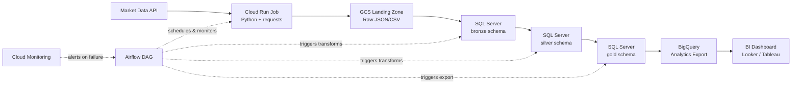

### Key Decisions Explained

> [!question] Why SQL Server over BigQuery for transforms?
> SQL Server provides ACID transactions, stored procedures, and sub-second point lookups. If your transforms need to update individual rows, enforce referential integrity, or run complex procedural logic, SQL Server is the right choice. BigQuery is optimized for analytical scans, not transactional writes. See [[medallion-architecture]] for the bronze/silver/gold pattern in SQL Server.

> [!question] Why BigQuery for serving to BI tools?
> BI tools like Looker and Tableau have native BigQuery connectors with query pushdown. Analysts can also write ad-hoc SQL directly. BigQuery handles concurrent analytical queries without affecting your transactional SQL Server workload. See [querying-and-cost-optimization](/06-GCP/BigQuery/querying-and-cost-optimization) for cost controls.

> [!question] Why Cloud Run over a VM-based cron script?
> Cloud Run scales to zero when not running — no idle compute cost. Each job runs in a Docker container, making it reproducible and isolated. If the job takes 5 minutes daily, you pay for 5 minutes, not 24 hours of VM time. See [cloud-run-jobs-vs-services](/06-GCP/Serverless/cloud-run-jobs-vs-services) for the jobs vs. services distinction.

> [!question] Why Airflow over Cloud Scheduler alone?
> Cloud Scheduler can trigger a single Cloud Run job, but Airflow manages multi-step DAGs with dependencies, retries, SLA monitoring, and backfills. If your pipeline has more than 2-3 steps, Airflow pays for itself in operational clarity. See [airflow-core-concepts](/12-Orchestration/Airflow/airflow-core-concepts) for DAG design.

### Implementation Checklist

- [ ] Create GCS bucket with lifecycle policy (delete raw files after 90 days) — [gcs-buckets-and-lifecycle](/06-GCP/Storage/gcs-buckets-and-lifecycle)
- [ ] Build Python ingestion script with retry logic and idempotent writes — [[rest-api-design-and-consumption]]
- [ ] Create SQL Server bronze/silver/gold schemas — [[medallion-architecture]]
- [ ] Write transforms as stored procedures or dbt models — [[dbt-transformation-layer]]
- [ ] Set up Airflow DAG with task dependencies — [airflow-dag-patterns](/12-Orchestration/Airflow/airflow-dag-patterns)
- [ ] Configure BigQuery export (scheduled query or `bq load`) — [data-loading-and-export](/06-GCP/BigQuery/data-loading-and-export)
- [ ] Add freshness monitoring and alerting — [gcp-cloud-monitoring-deep-dive](/13-Observability/GCP-Native/gcp-cloud-monitoring-deep-dive)
- [ ] Terraform all infrastructure — [terraform-plan-apply-destroy](/07-Terraform/Fundamentals/terraform-plan-apply-destroy)

### Related Notes

[[medallion-architecture]] | [[idempotent-pipeline-design]] | [[rest-api-design-and-consumption]] | [[dbt-transformation-layer]] | [cloud-run-jobs-vs-services](/06-GCP/Serverless/cloud-run-jobs-vs-services) | [airflow-core-concepts](/12-Orchestration/Airflow/airflow-core-concepts) | [gcs-buckets-and-lifecycle](/06-GCP/Storage/gcs-buckets-and-lifecycle) | [bronze-layer-loading](/04-SQL-Server/Medallion-Project/bronze-layer-loading) | [silver-transforms](/04-SQL-Server/Medallion-Project/silver-transforms) | [gold-transforms](/04-SQL-Server/Medallion-Project/gold-transforms)

---

## Scenario 2: Real-Time Streaming Pipeline

### Streaming Pipeline — Business Need

> "We need to process events as they arrive (sub-minute latency) and make them queryable immediately."

This scenario applies when batch processing is too slow. Examples include real-time dashboards, fraud detection, live pricing feeds, IoT sensor data, and operational alerting. The defining characteristic is that you cannot wait for a daily or hourly batch — data must be processed within seconds or minutes of arrival.

### Recommended Stack

| Component | Technology | Why |
|-----------|-----------|-----|
| **Ingestion** | Pub/Sub (push or pull subscription) | Fully managed, GCP-native, at-least-once delivery, no cluster ops |
| **Stream Processing** | Dataflow (Apache Beam) | Built-in windowing, exactly-once semantics, auto-scaling |
| **Hot Storage** | Firestore (real-time reads) or Bigtable (time-series at scale) | Sub-10ms reads for dashboards and APIs |
| **Cold Storage** | BigQuery (streaming insert or batch load) | Long-term analytical queries over historical data |
| **Real-Time Serving** | Firestore → Dashboard or REST API | Real-time listeners push updates to clients |
| **Monitoring** | Cloud Monitoring + custom latency metrics | Track end-to-end latency, backlog depth, error rates |

### Architecture — Real-Time Streaming Pipeline

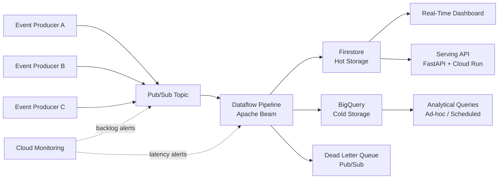

### Key Decisions Explained

> [!question] Why Pub/Sub over Kafka?
> Pub/Sub is fully managed — no brokers to provision, no ZooKeeper, no cluster sizing. It auto-scales to handle traffic spikes and you pay per message. Choose Kafka if you need message replay beyond 7 days, strict ordering guarantees across partitions, or you already run Kafka on-prem. See [pubsub-messaging](/06-GCP/Serverless/pubsub-messaging) and [pubsub-topics-and-subscriptions](/06-GCP/Serverless/pubsub-topics-and-subscriptions).

> [!question] Why Dataflow over Cloud Run with a Pub/Sub trigger?
> Cloud Run can process Pub/Sub messages, but it processes them individually — no windowing, no state, no exactly-once guarantees. Dataflow (Apache Beam) provides tumbling/sliding/session windows, watermarks for late data, and exactly-once processing. If you need to aggregate events over time windows, Dataflow is the right tool. See [[streaming-architecture]] for windowing patterns.

> [!question] Why dual-write to Firestore AND BigQuery?
> Different access patterns need different stores. Firestore serves sub-10ms point reads for dashboards and APIs. BigQuery handles full-table scans and aggregations for analytics. Writing to both from the same Dataflow pipeline ensures consistency without building a separate sync process.

> [!question] Why a dead letter queue?
> Messages that fail processing (malformed JSON, schema violations, transient errors after retries) should not block the pipeline. Route them to a dead letter topic for manual inspection and replay. This keeps the main pipeline flowing while preserving failed messages for debugging.

### Cost Considerations

| Component | Cost Driver | Optimization |
|-----------|------------|-------------|
| Pub/Sub | Message volume | Batch messages where possible |
| Dataflow | Worker vCPU hours | Right-size workers, use autoscaling |
| Firestore | Document reads/writes | Cache reads, batch writes |
| BigQuery | Storage + query bytes scanned | Partition by timestamp, cluster by key fields |

### Related Notes

[[streaming-architecture]] | [pubsub-messaging](/06-GCP/Serverless/pubsub-messaging) | [pubsub-topics-and-subscriptions](/06-GCP/Serverless/pubsub-topics-and-subscriptions) | [firestore-data-model-and-operations](/06-GCP/Firestore/firestore-data-model-and-operations) | [real-time-nosql-pipelines](/06-GCP/Firestore/real-time-nosql-pipelines) | [querying-and-cost-optimization](/06-GCP/BigQuery/querying-and-cost-optimization) | [gcp-cloud-monitoring-deep-dive](/13-Observability/GCP-Native/gcp-cloud-monitoring-deep-dive)

---

## Scenario 3: Data Warehouse for Analytics Team

### Business Need

> "The analytics team needs a warehouse where they can run ad-hoc SQL queries across all our data, build dashboards, and train ML models."

The analytics team does not want to manage infrastructure. They want a SQL interface to all the organization's data, organized in a way that makes sense for their use cases — dimensions they can filter by, facts they can aggregate, and documentation they can reference.

### Recommended Stack

| Component | Technology | Why |
|-----------|-----------|-----|
| **Warehouse** | BigQuery | Serverless, GCP-native, integrated ML (BQML), no cluster management |
| **Ingestion (batch)** | Cloud Run Jobs (Python) | Containerized, scalable, cost-effective for scheduled loads |
| **Ingestion (streaming)** | Dataflow or BigQuery streaming insert | Depends on volume and latency requirements |
| **Transformation** | dbt (staging → intermediate → mart layers) | Version-controlled SQL, built-in testing, auto-generated docs |
| **Modeling** | Star schema (Kimball methodology) | Intuitive for analysts, fast aggregation queries |
| **Data Quality** | dbt tests + Dataplex quality scans | Catch issues before they reach dashboards |
| **Data Catalog** | Dataplex + Data Catalog tags | Self-service discovery for analysts |
| **CI/CD** | GitHub Actions → dbt Cloud or dbt Core in Cloud Run | Automated testing and deployment of transform logic |

### Architecture — Data Warehouse for Analytics Team

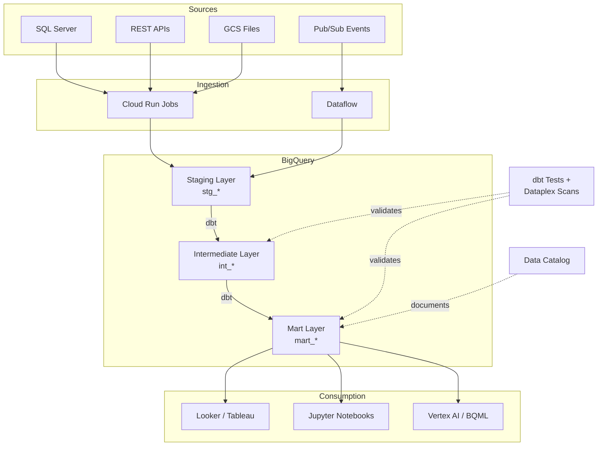

### Key Decisions Explained

> [!question] Why BigQuery over Snowflake?
> Both are excellent cloud warehouses. BigQuery wins on GCP-native integration (IAM, Cloud Monitoring, Dataflow, Vertex AI), truly serverless operation (no warehouse sizing), and cost model (pay per query byte scanned, not per compute-second). Choose Snowflake if you are multi-cloud or need features like data sharing with external partners on other clouds. See [[data-warehouse-architecture]].

> [!question] Why star schema (Kimball) over normalized (Inmon)?
> Analytics teams need fast, intuitive queries. Star schemas let analysts write `SELECT dim.category, SUM(fact.revenue) FROM fact JOIN dim` without understanding complex join chains. The denormalization trades storage efficiency for query simplicity. See [[dimensional-modeling]] for full DDL examples.

> [!question] Why dbt over stored procedures or custom Python?
> dbt provides version-controlled SQL transforms with built-in testing (`unique`, `not_null`, `relationships`, custom tests), automatic DAG generation from `ref()` calls, and documentation that stays in sync with code. It turns SQL into a software engineering practice. See [[dbt-transformation-layer]].

> [!question] Why three dbt layers (staging, intermediate, mart)?
> - **Staging**: 1:1 with source tables, minimal transformation (type casting, renaming)
> - **Intermediate**: Business logic, joins, deduplication — not exposed to analysts
> - **Mart**: Analytics-ready star schemas, one per business domain
> This separation keeps transforms modular, testable, and debuggable.

### dbt Project Structure

```
dbt_project/
├── models/
│   ├── staging/
│   │   ├── stg_market_data.sql
│   │   ├── stg_corporate_actions.sql
│   │   └── _staging.yml          # source definitions + tests
│   ├── intermediate/
│   │   ├── int_adjusted_prices.sql
│   │   └── int_constituent_weights.sql
│   └── marts/
│       ├── mart_daily_index_values.sql
│       ├── mart_constituent_performance.sql
│       └── _marts.yml            # column docs + tests
├── tests/
│   └── assert_no_negative_weights.sql
└── dbt_project.yml
```

### Related Notes

[[data-warehouse-architecture]] | [[dimensional-modeling]] | [[dbt-transformation-layer]] | [querying-and-cost-optimization](/06-GCP/BigQuery/querying-and-cost-optimization) | [data-loading-and-export](/06-GCP/BigQuery/data-loading-and-export) | [gcp-data-lineage-and-catalog](/13-Observability/GCP-Native/gcp-data-lineage-and-catalog) | [gcp-pipeline-health-and-sla](/13-Observability/GCP-Native/gcp-pipeline-health-and-sla)

---

## Scenario 4: Multi-Source Data Integration (ETL/ELT)

### Business Need

> "We have data in 5 different source systems (SQL Server, REST APIs, SFTP files, Pub/Sub events, GCS files). We need to bring it all together into a single, consistent data model."

This is the integration challenge. Each source has different formats, schemas, delivery mechanisms, and SLAs. The goal is to land everything in a common store, reconcile identities across systems, handle schema drift, and produce a unified view.

### Recommended Stack

| Component | Technology | Why |
|-----------|-----------|-----|
| **SQL Server Ingestion** | Python + pyodbc → GCS → BigQuery | Incremental extraction via watermark columns |
| **API Ingestion** | Python + requests → GCS → BigQuery | Paginated extraction with retry logic |
| **SFTP Ingestion** | Cloud Run + paramiko → GCS → BigQuery | File-based extraction, archive after processing |
| **Event Ingestion** | Pub/Sub → Dataflow → BigQuery | Streaming or micro-batch insert |
| **File Ingestion** | GCS event trigger → Cloud Run → BigQuery | Process on arrival via Eventarc |
| **Landing Zone** | GCS (one prefix per source) | Raw files preserved for replay and audit |
| **Warehouse** | BigQuery | Unified query layer across all sources |
| **Transformation** | dbt | Source-specific staging, unified intermediate + mart layers |
| **Orchestration** | Airflow | Complex DAG with per-source schedules and cross-source dependencies |
| **Data Quality** | dbt tests + Great Expectations | Schema validation, freshness checks, cross-source reconciliation |

### Architecture — Multi-Source Data Integration

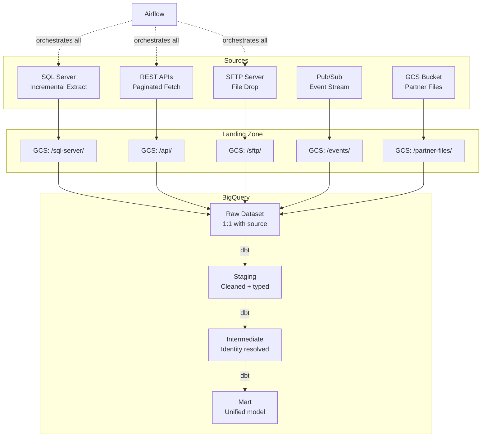

### Key Decisions Explained

> [!question] Why land everything in GCS first?
> GCS acts as an immutable audit log. If a transform has a bug, you can replay from raw files without re-extracting from the source. This also decouples extraction from loading — if BigQuery is temporarily unavailable, files are safe in GCS. See [gcs-buckets-and-lifecycle](/06-GCP/Storage/gcs-buckets-and-lifecycle).

> [!question] Why per-source prefixes in GCS?
> Different sources have different schemas, formats, and arrival schedules. Organizing by source (`/sql-server/YYYY-MM-DD/`, `/api/YYYY-MM-DD/`) makes it easy to re-process a single source without touching others. It also simplifies IAM — you can grant a service account access to only its source prefix.

> [!question] Why Airflow over simpler orchestration?
> Multi-source integration requires complex dependency management: "load API data only after SQL Server extract completes, but SFTP can run in parallel." Airflow's DAG model makes these dependencies explicit and visual. It also handles per-source retry logic and SLA monitoring. See [airflow-dag-patterns](/12-Orchestration/Airflow/airflow-dag-patterns).

> [!question] How do you handle schema drift?
> - **Landing zone**: Store raw files as-is (JSON, CSV, Parquet). Schema drift is the source's problem at this layer.
> - **Raw dataset**: Use BigQuery's schema auto-detection or explicit `RECORD` types for nested JSON.
> - **Staging**: dbt models cast to explicit types. If a new column appears, the staging model ignores it until you add it.
> - **Contracts**: Define expected schemas in dbt's `_sources.yml`. Tests fail if columns are missing or types change.
> See [[context-and-metadata-architecture]] and [[serialization-formats]].

### Identity Resolution Pattern

When the same entity (e.g., a company) exists across multiple sources with different IDs:

```sql
-- intermediate/int_company_master.sql
-- Resolve company identity across SQL Server (company_id),
-- API (ticker), and SFTP (ISIN) into a single surrogate key

WITH sql_companies AS (
    SELECT company_id, company_name, ticker, isin
    FROM {{ ref('stg_sql_server_companies') }}
),
api_companies AS (
    SELECT ticker, api_company_name, sector
    FROM {{ ref('stg_api_companies') }}
),
sftp_companies AS (
    SELECT isin, sftp_company_name, country
    FROM {{ ref('stg_sftp_companies') }}
)
SELECT
    {{ dbt_utils.generate_surrogate_key(['COALESCE(s.isin, f.isin)']) }}
        AS company_sk,
    COALESCE(s.company_name, a.api_company_name, f.sftp_company_name)
        AS company_name,
    s.company_id   AS sql_server_id,
    a.ticker       AS api_ticker,
    f.isin         AS sftp_isin,
    a.sector,
    f.country
FROM sql_companies s
FULL OUTER JOIN api_companies a ON s.ticker = a.ticker
FULL OUTER JOIN sftp_companies f ON s.isin = f.isin
```

### Related Notes

[[medallion-architecture]] | [[idempotent-pipeline-design]] | [[dbt-transformation-layer]] | [airflow-dag-patterns](/12-Orchestration/Airflow/airflow-dag-patterns) | [[serialization-formats]] | [[context-and-metadata-architecture]] | [[data-modeling-patterns]] | [gcs-buckets-and-lifecycle](/06-GCP/Storage/gcs-buckets-and-lifecycle) | database connections

---

## Scenario 5: Data Platform for a Small Team (2-3 Engineers)

### Business Need

> "We're a small team. We need something that works, is cheap, and doesn't require a DevOps team to operate."

The goal is maximum simplicity. Every tool you add is a tool you have to learn, operate, monitor, and debug. A small team cannot afford the operational burden of Airflow, Terraform, Datadog, and a dozen other tools. Pick the smallest stack that solves the problem and expand only when you hit a real limitation.

### Recommended Stack

| Component | Technology | Why NOT the "enterprise" choice |
|-----------|-----------|-------------------------------|
| **Scheduling** | Cloud Scheduler | Airflow is overkill for <10 jobs |
| **Compute** | Cloud Run Jobs | No VMs to manage, scales to zero |
| **Warehouse** | BigQuery | Serverless, no cluster sizing |
| **Transforms** | dbt Core (run in Cloud Run) | Keep transforms version-controlled |
| **CI/CD** | GitHub Actions | Free tier covers small teams |
| **Monitoring** | GCP Cloud Monitoring | Free tier is sufficient |
| **Infrastructure** | `gcloud` CLI scripts in a repo | Terraform is overhead at this scale |

> [!abstract] What You Skip (and Why)
> - **Airflow**: Operational burden (database, webserver, scheduler, workers). Use Cloud Scheduler + Cloud Run until you have 10+ interdependent jobs.
> - **Terraform**: Learning curve and state management overhead. A well-organized `gcloud` script achieves the same result for <20 resources.
> - **Datadog**: Expensive per-host pricing. Cloud Monitoring's free tier covers logs, metrics, and alerting.
> - **Kubernetes**: You do not need container orchestration for batch jobs. Cloud Run handles this.
> - **Data catalog**: At this scale, a well-organized dbt `schema.yml` with column descriptions is your catalog.

### Architecture — Small Team Platform (2-3 Engineers)

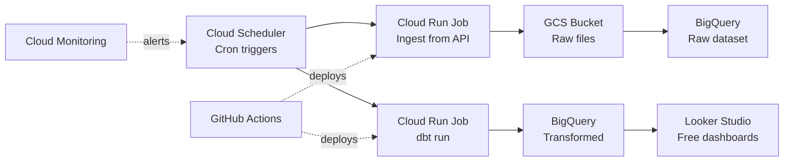

### Cost Estimate (~$50-100/month)

| Component | Estimated Monthly Cost |
|-----------|----------------------|
| Cloud Scheduler | ~$0 (3 free jobs) |
| Cloud Run | ~$5-20 (pay per invocation, scales to zero) |
| BigQuery | ~$10-40 (first 1TB query/month free, 10GB storage free) |
| GCS | ~$5-10 (Standard storage) |
| Cloud Monitoring | ~$0 (free tier: 150MB logs, basic metrics) |
| GitHub Actions | ~$0 (2,000 free minutes/month) |
| **Total** | **~$20-70/month** |

### Key Decisions Explained

> [!question] When do you graduate from this stack?
> Upgrade when you experience one of these pain points:
> - **>10 scheduled jobs with dependencies** → Add Airflow
> - **>3 engineers needing infra changes** → Add Terraform
> - **Need for APM traces or custom dashboards** → Add Datadog or Grafana
> - **Multiple environments (dev/staging/prod)** → Add Terraform + proper CI/CD
> - **Data quality issues slipping through** → Add Dataplex or Great Expectations

> [!question] How do you handle dependencies without Airflow?
> Chain Cloud Scheduler triggers sequentially with offset timing (Job A at 06:00, Job B at 06:30). For hard dependencies, have Job A call Job B's Cloud Run endpoint on success. This is fragile at scale but workable for 3-5 jobs.

### Related Notes

[cloud-run-jobs-vs-services](/06-GCP/Serverless/cloud-run-jobs-vs-services) | [gcp-scheduling](/12-Orchestration/Scheduling/gcp-scheduling) | [querying-and-cost-optimization](/06-GCP/BigQuery/querying-and-cost-optimization) | [[dbt-transformation-layer]] | [github-actions-workflows](/10-GitHub-Actions/github-actions-workflows) | [gcp-cloud-monitoring-deep-dive](/13-Observability/GCP-Native/gcp-cloud-monitoring-deep-dive) | [gcs-buckets-and-lifecycle](/06-GCP/Storage/gcs-buckets-and-lifecycle)

---

## Scenario 6: Data Platform for a Large Team (10+ Engineers)

### Business Need

> "We have multiple teams producing and consuming data. We need governance, lineage, quality, and clear ownership."

At this scale, the problem is not technology — it is coordination. Multiple teams writing pipelines that depend on each other's output. Schema changes that break downstream consumers. No one knows who owns which table. Data quality issues that get discovered by the CEO looking at a dashboard. The architecture must enforce boundaries, contracts, and visibility.

### Recommended Stack

| Component | Technology | Why |
|-----------|-----------|-----|
| **Orchestration** | Cloud Composer (managed Airflow) | Managed service eliminates Airflow ops burden |
| **Warehouse** | BigQuery (primary) + SQL Server (transactional) | BigQuery for analytics, SQL Server for OLTP workloads |
| **Transforms** | dbt (per-domain projects) | Each team owns their dbt project and models |
| **Infrastructure** | Terraform (modules per team) | Reproducible, auditable, peer-reviewed via PRs |
| **Governance** | Dataplex (zones, data quality, lineage) | Centralized governance with federated ownership |
| **Catalog** | Data Catalog + Dataplex discovery | Self-service data discovery for all teams |
| **Inter-service** | gRPC for service-to-service, REST for external | High-performance internal communication |
| **CI/CD** | GitHub Actions (per-repo) | Automated testing, linting, deployment per team |
| **Monitoring** | Cloud Monitoring + Datadog (APM) | Cloud Monitoring for infra, Datadog for application traces |
| **Data Contracts** | Protobuf schemas + dbt contracts | Schema enforcement at API and warehouse boundaries |

### Architecture — Large Team Platform (10+ Engineers)

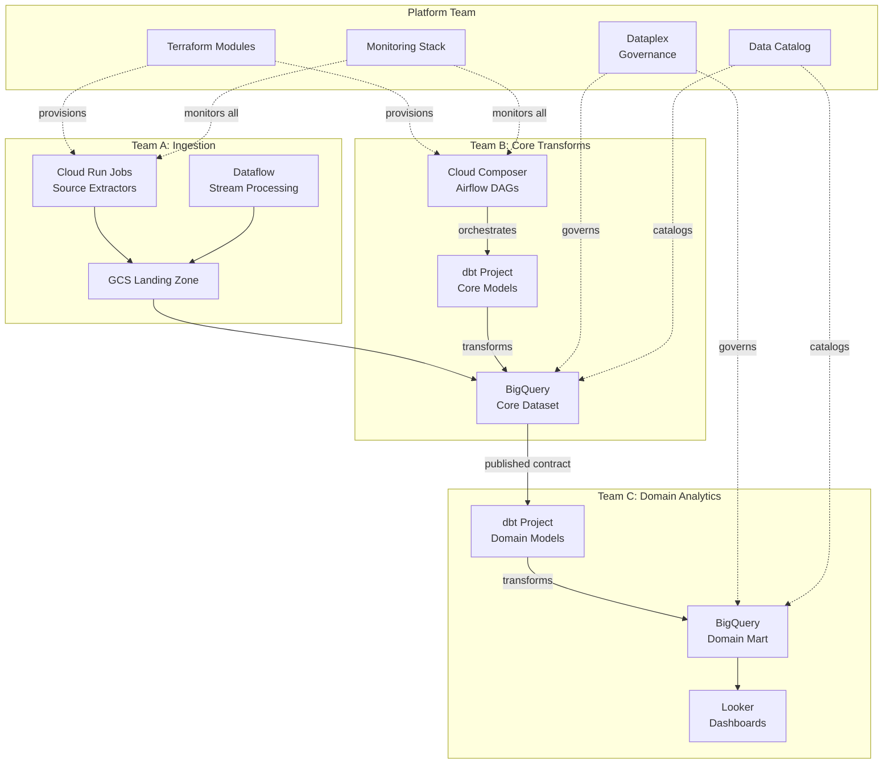

### Key Decisions Explained

> [!question] Why Cloud Composer over self-hosted Airflow?
> At 10+ engineers, Airflow becomes critical infrastructure. Cloud Composer handles upgrades, scaling, and high availability. The cost premium (~$300-500/month for a small environment) is cheaper than an engineer spending time on Airflow ops. See [airflow-deployment](/12-Orchestration/Airflow/airflow-deployment).

> [!question] Why data mesh principles?
> Data mesh assigns ownership: Team A owns ingestion, Team B owns core models, Team C owns domain analytics. Each team publishes "data products" with defined contracts (schema, SLA, freshness). Consumers depend on contracts, not implementation details. See [[data-mesh-architecture]].

> [!question] Why Terraform modules per team?
> Each team gets a Terraform module that provisions their resources (BigQuery datasets, Cloud Run services, IAM bindings). The platform team maintains shared modules (networking, monitoring). Changes are peer-reviewed via pull requests. See [terraform-module-composition](/07-Terraform/Patterns/terraform-module-composition).

> [!question] Why gRPC for inter-service communication?
> gRPC provides strongly-typed contracts (Protobuf), bi-directional streaming, and 2-10x better performance than REST for internal service-to-service calls. Use REST only for external-facing APIs where browser compatibility matters. See [[grpc-for-data-pipelines]] and [[api-protocols-comparison]].

### Data Contract Example

```yaml
# contracts/core_daily_prices.yml
# Published by Team B, consumed by Team C
contract:
  name: core_daily_prices
  owner: team-b-core
  description: Daily adjusted close prices for all tracked securities
  sla:
    freshness: 2 hours after market close
    availability: 99.9%
  schema:
    - name: trade_date
      type: DATE
      not_null: true
    - name: ticker
      type: STRING
      not_null: true
    - name: adjusted_close
      type: FLOAT64
      not_null: true
    - name: volume
      type: INT64
  breaking_changes:
    notification: 2 weeks advance
    channel: "#data-contracts"
```

### Related Notes

[[data-mesh-architecture]] | [airflow-deployment](/12-Orchestration/Airflow/airflow-deployment) | [terraform-module-composition](/07-Terraform/Patterns/terraform-module-composition) | [[grpc-for-data-pipelines]] | [[api-protocols-comparison]] | [gcp-data-lineage-and-catalog](/13-Observability/GCP-Native/gcp-data-lineage-and-catalog) | [[context-and-metadata-architecture]] | [gcp-pipeline-health-and-sla](/13-Observability/GCP-Native/gcp-pipeline-health-and-sla) | [service-accounts-and-iam](/06-GCP/Security/service-accounts-and-iam)

---

## Scenario 7: Financial Index Calculation Platform

### Business Need

> "We calculate and publish stock market indices. We need to ingest market data, run calculations (weighting, capping, corporate actions), and publish results with SLA guarantees."

This is the domain-specific reference architecture that brings together financial domain knowledge with data engineering patterns. Index calculation requires deterministic, auditable computation — the same inputs must always produce the same outputs. Every calculation must be traceable for regulatory compliance.

### Recommended Stack

| Component | Technology | Why |
|-----------|-----------|-----|
| **Market Data Ingestion** | Python + vendor APIs → GCS → SQL Server | Multiple vendors (Bloomberg, Refinitiv, exchange feeds) |
| **Corporate Actions** | SQL Server (bronze/silver/gold) | Complex event processing: splits, dividends, mergers |
| **Calculation Engine** | Python (NumPy/Pandas) or SQL stored procedures | Deterministic math: weighting, capping, divisor adjustments |
| **Publication** | BigQuery (analytics) + REST API (real-time) | Clients consume via API or data feeds |
| **Audit Trail** | SQL Server temporal tables + GCS raw archive | Full provenance: which data, which version of logic, which result |
| **Orchestration** | Airflow with strict SLA monitoring | Market-driven deadlines (publish by 18:00 UTC) |
| **Monitoring** | Cloud Monitoring + custom SLA dashboards | SLA breaches trigger PagerDuty escalation |

### Architecture — Financial Index Calculation Platform

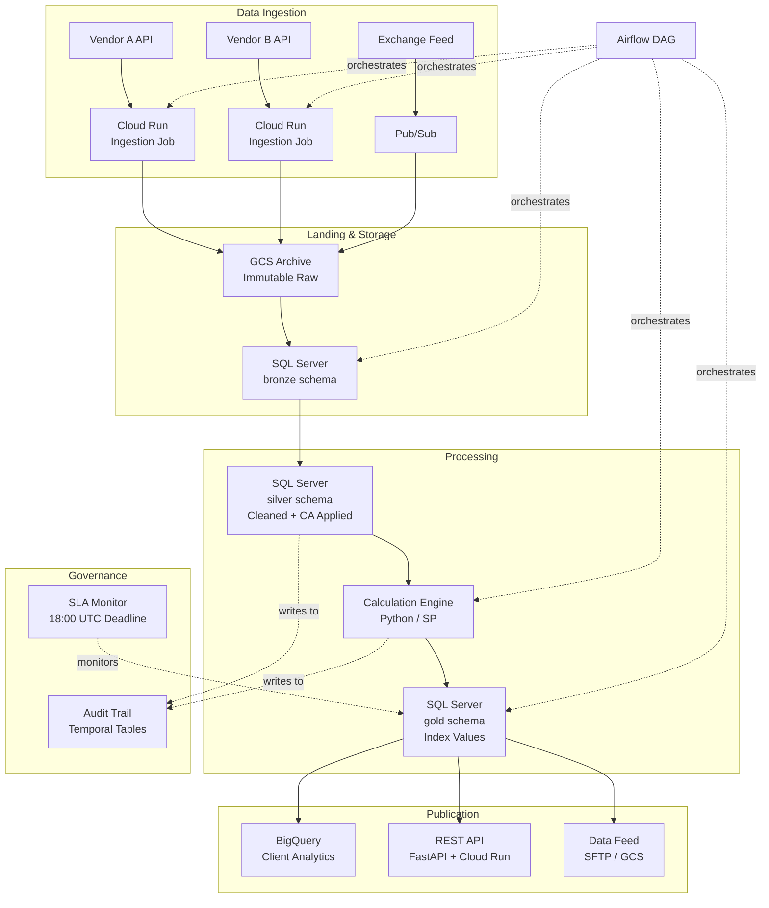

### Key Decisions Explained

> [!question] Why SQL Server for the calculation pipeline (not BigQuery)?
> Index calculation requires ACID transactions — if a corporate action adjustment fails midway, you need to roll back the entire calculation, not end up with partially adjusted data. SQL Server's transaction model, stored procedures, and temporal tables make this safe. BigQuery is append-optimized and lacks row-level transactions.

> [!question] Why immutable GCS archive?
> Regulatory requirement: you must be able to reproduce any historical index value. This requires proving which market data was used (GCS raw files), which version of the calculation logic ran (Git commit hash in audit table), and what the output was (temporal table history). See [gcs-buckets-and-lifecycle](/06-GCP/Storage/gcs-buckets-and-lifecycle).

> [!question] Why temporal tables for audit?
> SQL Server temporal tables automatically maintain a history of every row change with system-time versioning. You can query "what was the index value at any point in time" and "what data was used to calculate it." This satisfies regulatory audit requirements without custom audit trigger code.

> [!question] Why strict SLA monitoring?
> Index values drive trading decisions. A late publication can cause trading halts or client penalties. The Airflow DAG includes SLA callbacks that trigger PagerDuty if the gold layer is not populated by the deadline. See [gcp-pipeline-health-and-sla](/13-Observability/GCP-Native/gcp-pipeline-health-and-sla) and [airflow-core-concepts](/12-Orchestration/Airflow/airflow-core-concepts).

### Corporate Actions Processing Pattern

```sql
-- silver schema: apply corporate actions to raw price data
-- This is the most complex transform in index calculation

-- Step 1: Identify pending corporate actions
SELECT ca.action_type, ca.effective_date, ca.adjustment_factor,
       ca.ticker, ca.ex_date
FROM bronze.corporate_actions ca
WHERE ca.effective_date <= @calc_date
  AND ca.processed_flag = 0;

-- Step 2: Apply adjustment factors to historical prices
-- (split: divide price by factor, dividend: subtract amount)
UPDATE silver.adjusted_prices
SET adjusted_close = CASE
        WHEN ca.action_type = 'SPLIT'
        THEN raw_close / ca.adjustment_factor
        WHEN ca.action_type = 'DIVIDEND'
        THEN raw_close - ca.dividend_amount
    END,
    adjustment_reason = ca.action_type,
    adjusted_date = GETUTCDATE()
FROM silver.adjusted_prices ap
JOIN bronze.corporate_actions ca
    ON ap.ticker = ca.ticker
   AND ap.trade_date < ca.ex_date;

-- Step 3: Recalculate index divisor to maintain continuity
-- (the index value should not jump due to a corporate action)
```

### Related Notes

[[medallion-architecture]] | [bronze-layer-loading](/04-SQL-Server/Medallion-Project/bronze-layer-loading) | [silver-transforms](/04-SQL-Server/Medallion-Project/silver-transforms) | [gold-transforms](/04-SQL-Server/Medallion-Project/gold-transforms) | [[idempotent-pipeline-design]] | [[dimensional-modeling]] | [airflow-core-concepts](/12-Orchestration/Airflow/airflow-core-concepts) | [airflow-dag-patterns](/12-Orchestration/Airflow/airflow-dag-patterns) | [[rest-api-design-and-consumption]] | [gcp-pipeline-health-and-sla](/13-Observability/GCP-Native/gcp-pipeline-health-and-sla) | fastapi and polars

---

## Scenario 8: Machine Learning Feature Pipeline

### Business Need

> "The ML team needs features computed daily and served at low latency for real-time predictions."

ML models need features — derived values computed from raw data. The challenge is that features must be computed consistently for both training (batch, historical) and serving (real-time, single-record). This is the "training-serving skew" problem. The solution is a feature store that decouples feature computation from feature consumption.

### Recommended Stack

| Component | Technology | Why |
|-----------|-----------|-----|
| **Batch Feature Compute** | dbt (BigQuery) or Python (Dataflow) | Scheduled daily, outputs feature tables |
| **Streaming Feature Compute** | Dataflow (Apache Beam) | Real-time features from event streams |
| **Feature Store** | Vertex AI Feature Store or Firestore | Low-latency serving with point lookups |
| **Offline Store** | BigQuery | Historical features for training datasets |
| **Model Training** | Vertex AI or custom Python | Reads from offline store |
| **Model Serving** | Vertex AI Endpoints or Cloud Run | Reads features from online store at prediction time |
| **Orchestration** | Airflow | Coordinates feature computation with model retraining |

### Architecture — ML Feature Pipeline

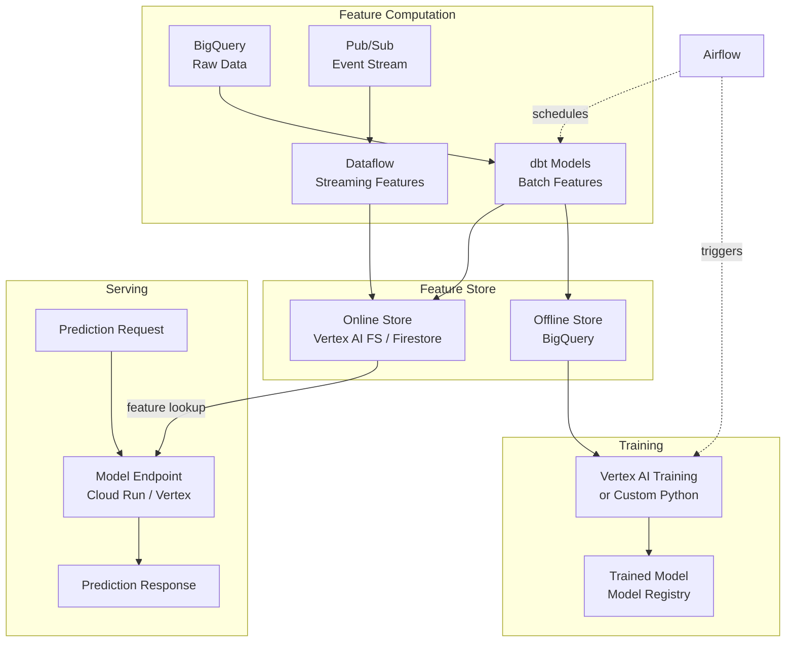

### Key Decisions Explained

> [!question] Why a feature store instead of just querying BigQuery?
> BigQuery has ~1-2 second query latency. Real-time predictions need <50ms feature lookups. The feature store (Firestore or Vertex AI Feature Store) pre-materializes features for point lookups. It also ensures training and serving use identical feature definitions, preventing training-serving skew.

> [!question] Why both batch and streaming feature computation?
> Some features are naturally batch (e.g., "average revenue over last 90 days") while others must be real-time (e.g., "number of events in the last 5 minutes"). Batch features are cheaper to compute and cover most use cases. Add streaming features only when freshness matters.

> [!question] Why Firestore over Redis for the online store?
> Firestore is fully managed, scales automatically, and has a generous free tier. Redis (Memorystore) requires capacity planning and cluster management. Choose Redis only if you need sub-millisecond latency (Firestore is ~10-50ms). See [firestore-data-model-and-operations](/06-GCP/Firestore/firestore-data-model-and-operations).

### Feature Definition Pattern

```python
# features/daily_trading_features.py
# Computed in dbt or Python, materialized to both offline and online stores

FEATURE_DEFINITIONS = {
    "avg_volume_30d": {
        "description": "30-day rolling average trading volume",
        "sql": "AVG(volume) OVER (PARTITION BY ticker ORDER BY trade_date ROWS 29 PRECEDING)",
        "entity": "ticker",
        "freshness": "daily",
        "type": "FLOAT64",
    },
    "price_momentum_5d": {
        "description": "5-day price return (close-to-close)",
        "sql": "(close - LAG(close, 5) OVER (PARTITION BY ticker ORDER BY trade_date)) / LAG(close, 5) OVER (PARTITION BY ticker ORDER BY trade_date)",
        "entity": "ticker",
        "freshness": "daily",
        "type": "FLOAT64",
    },
    "volatility_20d": {
        "description": "20-day realized volatility (annualized)",
        "sql": "STDDEV(LN(close / LAG(close, 1) OVER (PARTITION BY ticker ORDER BY trade_date))) OVER (PARTITION BY ticker ORDER BY trade_date ROWS 19 PRECEDING) * SQRT(252)",
        "entity": "ticker",
        "freshness": "daily",
        "type": "FLOAT64",
    },
}
```

### Related Notes

[firestore-data-model-and-operations](/06-GCP/Firestore/firestore-data-model-and-operations) | [real-time-nosql-pipelines](/06-GCP/Firestore/real-time-nosql-pipelines) | [[dbt-transformation-layer]] | [[streaming-architecture]] | [querying-and-cost-optimization](/06-GCP/BigQuery/querying-and-cost-optimization) | [ai-augmented-data-engineering](/16-AI-and-Prompts/LLM-Pipelines/ai-augmented-data-engineering)

---

## Scenario 9: Data Migration — On-Prem to Cloud

### Business Need

> "We're migrating from on-prem SQL Server to GCP BigQuery. We need zero data loss, minimal downtime, and a way to validate that everything transferred correctly."

Migration is not a one-time event — it is a multi-phase process that can take weeks or months. The key insight is that you should not do a "big bang" cutover. Instead, use the strangler fig pattern: run both systems in parallel, gradually shift workloads, validate continuously, and cut over only when you have confidence.

### Recommended Stack

| Component | Technology | Why |
|-----------|-----------|-----|
| **Initial Bulk Load** | `bcp` export → GCS → `bq load` | Fastest for large tables (millions of rows) |
| **Incremental Sync** | Python + pyodbc (watermark-based) → GCS → BigQuery | Daily delta extraction during dual-write period |
| **Change Data Capture** | SQL Server CDC or Debezium | Real-time sync for tables that need it |
| **Validation** | Custom Python (row counts, checksums, sample comparison) | Automated comparison between source and target |
| **Orchestration** | Airflow | Manages the multi-step migration DAG |
| **Infrastructure** | Terraform | Provision BigQuery datasets, IAM, networking |

### Architecture — On-Prem to Cloud Migration

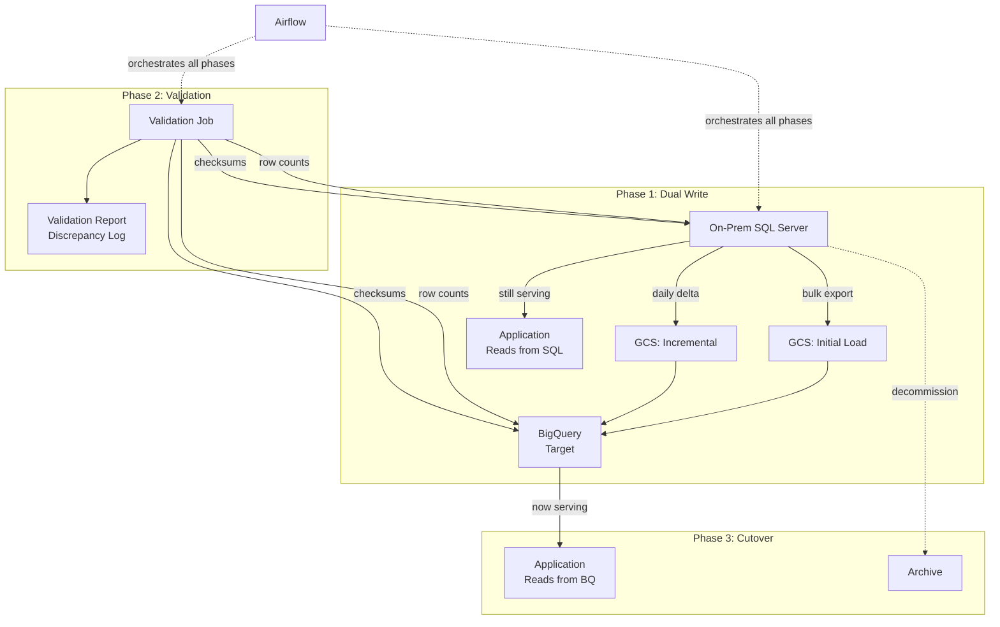

### Migration Phases

> [!info] Phase 1: Assessment (1-2 weeks)
> - Inventory all tables, views, stored procedures, and jobs
> - Classify tables: which migrate to BigQuery, which stay in SQL Server
> - Identify SQL Server features without BigQuery equivalents (temporal tables, triggers, CLR functions)
> - Estimate BigQuery storage and query costs

> [!info] Phase 2: Schema Translation (1-2 weeks)
> - Convert SQL Server DDL to BigQuery DDL (data type mapping)
> - Design partitioning and clustering strategy for BigQuery
> - Rewrite stored procedures as dbt models or scheduled queries
> - Handle SQL Server-specific syntax: `TOP`, `NOLOCK`, `CROSS APPLY`, window function differences

> [!info] Phase 3: Bulk Load + Dual Write (2-4 weeks)
> - Export large tables with `bcp` to CSV/Parquet → GCS → BigQuery
> - Set up daily incremental sync for active tables
> - Run both systems in parallel — SQL Server for production, BigQuery for validation

> [!info] Phase 4: Validation (1-2 weeks)
> - Automated row count comparison (per table, per partition)
> - Checksum comparison (hash of key columns)
> - Sample query comparison (run the same analytical query on both, compare results)
> - Freshness validation (BigQuery is within SLA of SQL Server)

> [!info] Phase 5: Cutover (1 day)
> - Final incremental sync
> - Switch application connection strings
> - Monitor for 24 hours
> - Decommission SQL Server (or archive)

### Key Decisions Explained

> [!question] Why strangler fig over big-bang migration?
> Big-bang migrations have a single point of failure: if anything goes wrong during cutover, you roll back entirely and lose weeks of work. Strangler fig lets you migrate table by table, validate incrementally, and roll back individual tables without affecting the rest. See [[migration-idempotency-backfills]].

> [!question] Why watermark-based incremental extraction?
> Each table has a column that monotonically increases (e.g., `modified_date`, `row_version`). The extraction job records the last watermark value and only extracts rows modified since then. This is idempotent — re-running with the same watermark extracts the same rows. See [[idempotent-pipeline-design]].

> [!question] What about stored procedures?
> BigQuery does not support traditional stored procedures in the same way. Options:
> 1. Rewrite as dbt models (preferred — version-controlled, testable)
> 2. Rewrite as BigQuery scripting (procedural SQL, less testable)
> 3. Keep complex logic in Python Cloud Run jobs
> See [[dbt-transformation-layer]] for the dbt approach.

### Validation Query Example

```python
# validation/compare_tables.py
# Run against both SQL Server and BigQuery, compare results

VALIDATION_QUERIES = {
    "row_count": {
        "sql_server": "SELECT COUNT(*) FROM {schema}.{table}",
        "bigquery": "SELECT COUNT(*) FROM `{project}.{dataset}.{table}`",
    },
    "checksum": {
        "sql_server": """
            SELECT CHECKSUM_AGG(CHECKSUM(
                ticker, trade_date, CAST(close_price AS VARCHAR(50))
            ))
            FROM {schema}.{table}
            WHERE trade_date >= '{start_date}'
        """,
        "bigquery": """
            SELECT FARM_FINGERPRINT(
                STRING_AGG(
                    CONCAT(ticker, CAST(trade_date AS STRING),
                           CAST(close_price AS STRING)),
                    ',' ORDER BY ticker, trade_date
                )
            )
            FROM `{project}.{dataset}.{table}`
            WHERE trade_date >= '{start_date}'
        """,
    },
    "freshness": {
        "sql_server": "SELECT MAX(modified_date) FROM {schema}.{table}",
        "bigquery": "SELECT MAX(modified_date) FROM `{project}.{dataset}.{table}`",
    },
}
```

### Related Notes

[[migration-idempotency-backfills]] | [[idempotent-pipeline-design]] | [data-loading-and-export](/06-GCP/BigQuery/data-loading-and-export) | [[dbt-transformation-layer]] | database connections | [querying-and-cost-optimization](/06-GCP/BigQuery/querying-and-cost-optimization) | [terraform-plan-apply-destroy](/07-Terraform/Fundamentals/terraform-plan-apply-destroy)

---

## Scenario 10: Cost-Optimized Pipeline (Maximum Savings)

### Business Need

> "Our cloud bill is too high. We need to cut costs without sacrificing reliability."

Cost optimization is not about choosing the cheapest option for each component — it is about eliminating waste across the entire stack. The biggest cost savings come from three areas: compute that runs when not needed, storage that is never accessed, and queries that scan more data than necessary.

### Optimization Techniques by Component

#### Compute (Cloud Run, VMs, Dataflow)

| Technique | Savings | Effort |
|-----------|---------|--------|
| Cloud Run `min-instances=0` | 50-90% of idle cost | Low |
| Spot/preemptible VMs for batch jobs | 60-91% vs on-demand | Medium |
| Right-size VM machine types | 20-50% | Low |
| Schedule non-production VMs to stop at night | 60% of dev/staging cost | Low |
| Use Cloud Run Jobs instead of always-on VMs | 80-95% for batch workloads | Medium |

#### Storage (GCS, BigQuery, SQL Server)

| Technique | Savings | Effort |
|-----------|---------|--------|
| GCS lifecycle policies (Standard → Nearline → Coldline → Archive) | 50-80% on old data | Low |
| BigQuery table expiration for temp tables | Eliminates forgotten temp tables | Low |
| BigQuery long-term storage pricing (auto after 90 days) | 50% on old partitions | Free |
| SQL Server table compression (PAGE for cold, ROW for warm) | 50-80% storage reduction | Medium |
| Delete raw GCS files after loading to warehouse | 100% of duplicate storage | Low |

#### Queries (BigQuery)

| Technique | Savings | Effort |
|-----------|---------|--------|
| Partition tables by date | 90%+ query cost reduction | Low |
| Cluster tables by frequently filtered columns | 30-50% scan reduction | Low |
| Use `SELECT specific_columns` instead of `SELECT *` | Proportional to unused columns | Low |
| Materialized views for repeated queries | Eliminates redundant scans | Medium |
| BI Engine reservation for dashboards | 60-80% for repeated dashboard queries | Medium |
| Set per-user and per-project query byte limits | Prevents runaway queries | Low |

### Architecture: Before and After

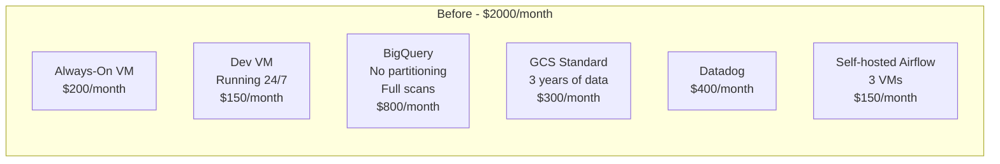

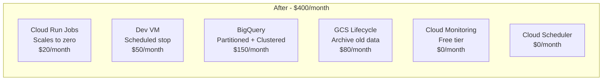

### Key Decisions Explained

> [!question] What is the single highest-impact optimization?
> **BigQuery partitioning and clustering.** If you have a 10TB table and every query scans all of it, you pay ~$50 per query. Partition by date and cluster by your most common filter column, and the same query might scan 10GB — $0.05. This is a 1000x cost reduction for time-range queries. See [querying-and-cost-optimization](/06-GCP/BigQuery/querying-and-cost-optimization).

> [!question] When is Datadog worth the cost?
> Datadog becomes worth it when: (1) you have 5+ services that need distributed tracing, (2) you need custom APM dashboards that Cloud Monitoring cannot provide, or (3) you need log analytics beyond simple search. For pipelines with <5 components, Cloud Monitoring's free tier is sufficient. See [gcp-cloud-monitoring-deep-dive](/13-Observability/GCP-Native/gcp-cloud-monitoring-deep-dive) and [datadog-cost-optimization](/13-Observability/Datadog/datadog-cost-optimization).

> [!question] Should we use reserved capacity (BigQuery slots)?
> Only if your monthly BigQuery on-demand spend exceeds ~$2,000/month consistently. Below that, on-demand is cheaper. BigQuery Editions flex slots let you commit for 1 hour minimum, which is useful for large batch windows. See [querying-and-cost-optimization](/06-GCP/BigQuery/querying-and-cost-optimization).

> [!question] How do we prevent cost surprises?
> - Set BigQuery per-user byte limits (`maximum_bytes_billed`)
> - Set GCP budget alerts at 50%, 80%, 100% of monthly budget
> - Use Cloud Billing export to BigQuery for cost analytics
> - Review the billing dashboard weekly
> - Tag all resources with `team` and `environment` labels for cost attribution

### Cost Audit Checklist

- [ ] All BigQuery tables are partitioned (by ingestion time at minimum)
- [ ] BigQuery tables with >1TB are clustered by common filter columns
- [ ] No `SELECT *` in production queries or views
- [ ] GCS lifecycle policies are set (Standard → Nearline at 30d → Coldline at 90d)
- [ ] No always-on VMs that could be Cloud Run Jobs
- [ ] Dev/staging VMs are scheduled to stop outside business hours
- [ ] Spot/preemptible VMs are used for fault-tolerant batch jobs
- [ ] Cloud Monitoring is used instead of Datadog where possible
- [ ] BigQuery slot usage is reviewed monthly
- [ ] Unused datasets and tables are identified and deleted quarterly
- [ ] Per-user query byte limits are set in BigQuery
- [ ] GCP budget alerts are configured

### Related Notes

[querying-and-cost-optimization](/06-GCP/BigQuery/querying-and-cost-optimization) | [gcs-buckets-and-lifecycle](/06-GCP/Storage/gcs-buckets-and-lifecycle) | [cloud-run-jobs-vs-services](/06-GCP/Serverless/cloud-run-jobs-vs-services) | [vm-lifecycle](/06-GCP/Compute/vm-lifecycle) | [finops-cost-optimization](/04-SQL-Server/Administration/finops-cost-optimization) | [gcp-cloud-monitoring-deep-dive](/13-Observability/GCP-Native/gcp-cloud-monitoring-deep-dive) | [datadog-cost-optimization](/13-Observability/Datadog/datadog-cost-optimization) | [datadog-cost-reference](/13-Observability/Datadog/datadog-cost-reference) | [table-compression](/04-SQL-Server/Storage-and-Indexes/table-compression) | [partitioning-strategies](/04-SQL-Server/Storage-and-Indexes/partitioning-strategies)

---

## Quick Lookup: "I Need To... --> Use This"

> [!tip] Bookmark This Section
> When you have a specific task and need to know which tool to reach for, scan this table first.

### Scheduling and Orchestration

| I need to... | Use | Notes | Link |
|---|---|---|---|
| Schedule a simple daily job | Cloud Scheduler + Cloud Run | No dependencies, single job | [gcp-scheduling](/12-Orchestration/Scheduling/gcp-scheduling) |
| Run a complex DAG with dependencies | Airflow | Multi-step with retries and SLA | [airflow-core-concepts](/12-Orchestration/Airflow/airflow-core-concepts) |
| Chain jobs with dependencies (simple) | Cloud Workflows | 2-5 steps, no complex logic | [gcp-scheduling](/12-Orchestration/Scheduling/gcp-scheduling) |
| Run a job on a Linux VM | cron + systemd | On-prem or persistent VM | [linux-scheduling](/12-Orchestration/Scheduling/linux-scheduling) |
| Run a job on a Windows server | Task Scheduler | Windows-only environments | [windows-scheduling](/12-Orchestration/Scheduling/windows-scheduling) |
| Manage Airflow in production | Cloud Composer | Managed Airflow, GCP-native | [airflow-deployment](/12-Orchestration/Airflow/airflow-deployment) |
| Debug a failed Airflow DAG | Airflow UI + logs | Check task logs, XComs, connections | [airflow-troubleshooting](/12-Orchestration/Airflow/airflow-troubleshooting) |

### Storage and Data

| I need to... | Use | Notes | Link |
|---|---|---|---|
| Store raw files cheaply | GCS (Nearline/Coldline) | Lifecycle policies auto-tier | [gcs-buckets-and-lifecycle](/06-GCP/Storage/gcs-buckets-and-lifecycle) |
| Run ad-hoc SQL on large data | BigQuery | Serverless, pay per query | [querying-and-cost-optimization](/06-GCP/BigQuery/querying-and-cost-optimization) |
| Store transactional data with ACID | SQL Server | Row-level transactions, stored procs | [moc-sql-server](/04-SQL-Server/moc-sql-server) |
| Serve data to a real-time dashboard | Firestore | Sub-10ms point reads | [firestore-data-model-and-operations](/06-GCP/Firestore/firestore-data-model-and-operations) |
| Store time-series at massive scale | Bigtable | Billions of rows, single-digit ms | [real-time-nosql-pipelines](/06-GCP/Firestore/real-time-nosql-pipelines) |
| Choose a file format for data exchange | Parquet (analytics) or JSON (APIs) | See format comparison | [[serialization-formats]] |
| Load data into BigQuery | `bq load` or streaming insert | Batch vs real-time trade-off | [data-loading-and-export](/06-GCP/BigQuery/data-loading-and-export) |
| Transfer files between systems | `gsutil rsync` or `gcloud transfer` | GCS-native tools | [data-transfer](/01-Shell/File-Operations/data-transfer) |

### Processing and Transformation

| I need to... | Use | Notes | Link |
|---|---|---|---|
| Transform data in a warehouse | dbt | Version-controlled SQL transforms | [[dbt-transformation-layer]] |
| Process streaming events | Pub/Sub + Dataflow | Windowing, exactly-once | [[streaming-architecture]] |
| Run Python data processing | Pandas/Polars in Cloud Run | Containerized, scalable | python pipeline execution |
| Build a medallion pipeline | bronze/silver/gold schemas | SQL Server or BigQuery | [[medallion-architecture]] |
| Handle idempotent writes | DELETE-INSERT or MERGE | Safe re-runs, no duplicates | [[idempotent-pipeline-design]] |
| Migrate data between platforms | Strangler fig + dual write | Incremental, validated | [[migration-idempotency-backfills]] |
| Compare ETL vs ELT approaches | See comparison table | Depends on compute location | ETL vs ELT |

### Infrastructure and DevOps

| I need to... | Use | Notes | Link |
|---|---|---|---|
| Deploy infrastructure reproducibly | Terraform | State-managed, peer-reviewed | [moc-terraform](/07-Terraform/moc-terraform) |
| Deploy a Cloud Run service | Terraform + Docker | Or `gcloud run deploy` for small teams | [terraform-cloud-run](/07-Terraform/GCP-Resources/terraform-cloud-run) |
| Manage secrets securely | GCP Secret Manager + Terraform | Never commit secrets to Git | [terraform-iam-and-secrets](/07-Terraform/GCP-Resources/terraform-iam-and-secrets) |
| Set up CI/CD for data pipelines | GitHub Actions | Test, lint, deploy on merge | [github-actions-workflows](/10-GitHub-Actions/github-actions-workflows) |
| Manage Terraform state | GCS backend with locking | Remote state for teams | [terraform-state-management](/07-Terraform/Fundamentals/terraform-state-management) |
| Create reusable infra modules | Terraform modules | Composition over inheritance | [terraform-module-composition](/07-Terraform/Patterns/terraform-module-composition) |

### Monitoring and Governance

| I need to... | Use | Notes | Link |
|---|---|---|---|
| Monitor pipeline health for free | GCP Cloud Monitoring | Free tier: logs, metrics, alerts | [gcp-cloud-monitoring-deep-dive](/13-Observability/GCP-Native/gcp-cloud-monitoring-deep-dive) |
| Track data lineage | Dataplex Lineage API | Auto-captured for BigQuery | [gcp-data-lineage-and-catalog](/13-Observability/GCP-Native/gcp-data-lineage-and-catalog) |
| Monitor SLA compliance | Custom metrics + alerting | Define freshness and completeness SLAs | [gcp-pipeline-health-and-sla](/13-Observability/GCP-Native/gcp-pipeline-health-and-sla) |
| Deep application performance tracing | Datadog APM | Distributed traces across services | [datadog-apm-traces](/13-Observability/Datadog/datadog-apm-traces) |
| Monitor SQL Server performance | Wait stats + execution plans | Identify bottlenecks | [wait-stats-analysis](/04-SQL-Server/Performance/wait-stats-analysis) |
| Audit database access | SQL Server audit logging | Compliance and security | [audit-logging](/04-SQL-Server/Security/audit-logging) |

### APIs and Communication

| I need to... | Use | Notes | Link |
|---|---|---|---|
| Build a REST API for data serving | FastAPI + Cloud Run | Python, async, auto-docs | [[rest-api-design-and-consumption]] |
| High-performance service-to-service calls | gRPC | Protobuf, streaming, 2-10x faster than REST | [[grpc-for-data-pipelines]] |
| Choose an API protocol | See comparison | REST vs gRPC vs GraphQL | [[api-protocols-comparison]] |
| Query data flexibly from frontend | GraphQL | Client-specified fields, nested queries | [[graphql-for-data-access]] |
| Consume a third-party REST API | Python + requests | Retry logic, pagination, auth | [[rest-api-design-and-consumption]] |

### Shell and Quick Tasks

| I need to... | Use | Notes | Link |
|---|---|---|---|
| Parse a log file quickly | awk / grep | Pattern matching and text extraction | [awk-data-processing](/01-Shell/Text-Processing/awk-data-processing), [grep-and-pattern-matching](/01-Shell/Text-Processing/grep-and-pattern-matching) |
| Edit a file in-place | sed | Stream editing, regex substitution | [sed-stream-editing](/01-Shell/Text-Processing/sed-stream-editing) |
| Transfer files via SSH | scp / rsync | Secure copy, incremental sync | [data-transfer](/01-Shell/File-Operations/data-transfer) |
| Debug network connectivity | curl, netcat, telnet | Test endpoints and ports | [connectivity-testing](/01-Shell/Networking/connectivity-testing) |
| Manage background processes | nohup, screen, tmux | Long-running jobs on VMs | [viewing-processes](/01-Shell/Process-Management/viewing-processes) |

---

### Decision Flowchart: Choosing Your Architecture

Use this flowchart when you are starting from scratch and do not know which scenario fits.

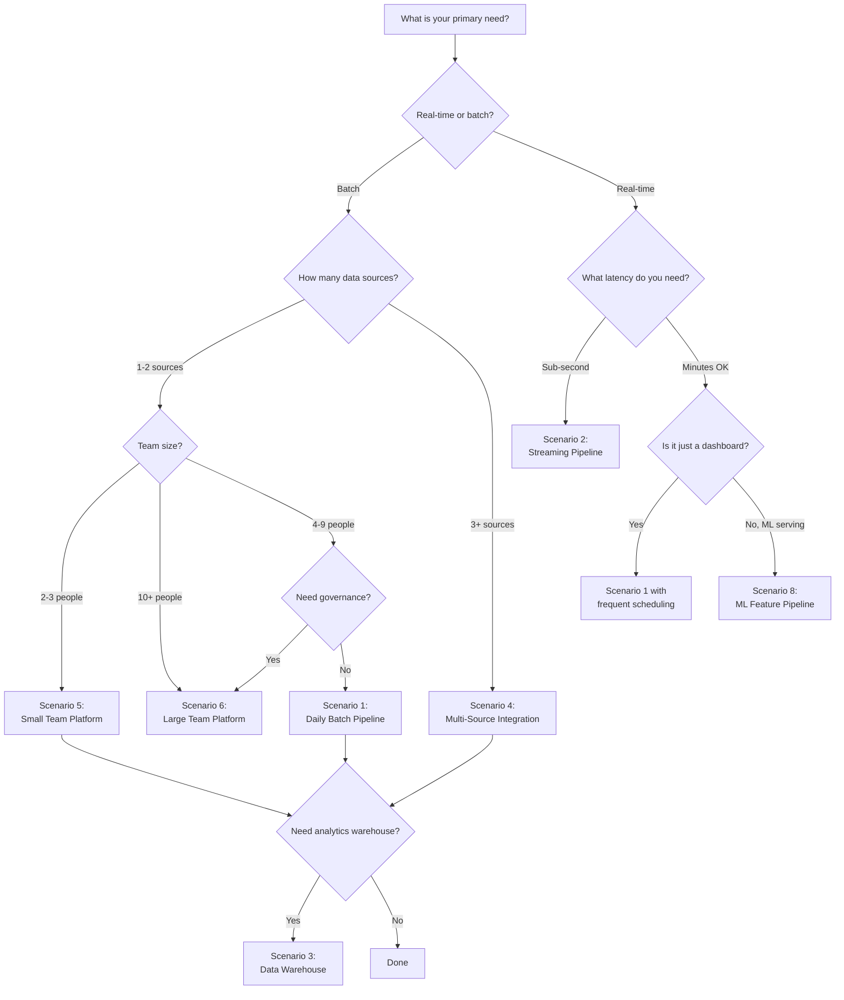

---

## Anti-Patterns: What NOT to Do

> [!danger] Common Mistakes
> These are patterns that look reasonable but cause pain at scale. Learn from others' mistakes.

### "We'll Build a Data Lake and Figure Out the Schema Later"

**The mistake:** Dumping everything into GCS or S3 with no schema enforcement, no catalog, no naming conventions. Six months later, nobody knows what any file is.

**The fix:** Define schemas upfront (even if they are flexible). Use a catalog (Dataplex, Data Catalog). Enforce naming conventions (`/source/entity/YYYY-MM-DD/`). See [[data-lake-architecture]] and [[context-and-metadata-architecture]].

### "We Need Kafka for Everything"

**The mistake:** Deploying Kafka for a pipeline that processes 1,000 events per day. You now have ZooKeeper, brokers, schema registry, and Connect to manage — for something Cloud Scheduler + Cloud Run could handle.

**The fix:** Use Pub/Sub for GCP-native workloads under 100K messages/second. Use Kafka only when you need multi-day replay, strict ordering, or you are already running Kafka. See [[streaming-architecture]].

### "Let's Use Microservices for Data Pipelines"

**The mistake:** Building 20 microservices for a pipeline that is fundamentally a linear DAG. Each service has its own deployment, monitoring, and failure mode. Debugging requires tracing through 20 services.

**The fix:** Use a monolithic pipeline (Airflow DAG with task functions) until you have a genuine reason to decompose. Microservices solve organizational scaling problems, not technical ones. See [airflow-dag-patterns](/12-Orchestration/Airflow/airflow-dag-patterns).

### "We Don't Need Tests for Data"

**The mistake:** No validation between pipeline stages. A source schema change silently produces NULL values that propagate to dashboards. The CEO discovers the issue.

**The fix:** dbt tests at every layer. Freshness checks. Row count assertions. Schema contracts. See [[dbt-transformation-layer]] and [[context-and-metadata-architecture]].

### "Terraform Everything from Day One"

**The mistake:** A 2-person team spending 40% of their time writing Terraform modules for 10 resources. The overhead exceeds the benefit.

**The fix:** Start with `gcloud` CLI scripts in a Git repo. Switch to Terraform when you have 20+ resources, multiple environments, or 3+ engineers making infra changes. See Scenario 5.

### "One Database to Rule Them All"

**The mistake:** Using SQL Server for everything — transactional writes, analytical queries, real-time serving, and ML feature storage. Performance degrades as workloads compete for resources.

**The fix:** Use the right store for the right access pattern. SQL Server for transactions, BigQuery for analytics, Firestore for real-time reads. See [[data-modeling-patterns]] for when to use which model.

---

## Technology Comparison Matrix

A quick reference for when two technologies seem interchangeable.

### Compute

| Criteria | Cloud Run | GCE VM | Dataflow | Cloud Functions |
|----------|-----------|--------|----------|----------------|
| **Best for** | Stateless batch/web | Stateful, long-running | Stream processing | Simple triggers |
| **Scales to zero** | Yes | No | Yes (batch) | Yes |
| **Max execution time** | 60 min (jobs) | Unlimited | Unlimited | 9 min |
| **Docker support** | Native | Manual | Beam containers | No |
| **Cost model** | Per-request | Per-hour | Per-worker-hour | Per-invocation |
| **When to choose** | Default for most jobs | Need GPUs, large memory | Windowed stream processing | Simple event response |

### Storage

| Criteria | BigQuery | SQL Server | Firestore | GCS |
|----------|----------|------------|-----------|-----|
| **Best for** | Analytics | Transactions | Real-time reads | File storage |
| **Latency** | 1-30s | <10ms | <10ms | ~100ms |
| **ACID transactions** | Limited | Full | Document-level | No |
| **Cost model** | Storage + query bytes | License + VM | Reads/writes | Storage + egress |
| **Max scale** | Petabytes | Terabytes | Millions of docs | Exabytes |
| **When to choose** | Ad-hoc SQL, ML, BI | OLTP, stored procs, ACID | Mobile/web, real-time | Raw files, archive |

### Orchestration

| Criteria | Cloud Scheduler | Airflow | Cloud Workflows |
|----------|----------------|---------|-----------------|
| **Best for** | Simple cron triggers | Complex DAGs | Simple sequences |
| **Dependencies** | None | Full DAG | Linear/parallel |
| **Retry logic** | Basic | Advanced (per-task) | Basic |
| **Monitoring** | Cloud Monitoring | Airflow UI + logs | Cloud Monitoring |
| **Cost** | Free (3 jobs) | $300+/month (Composer) | Pay per step |
| **When to choose** | <10 independent jobs | Complex pipelines | 2-5 step workflows |

---

## Version History

| Date | Change |
|------|--------|
| 2026-03-22 | Initial creation — 10 scenarios, quick lookup table, decision flowchart, anti-patterns, comparison matrices |

---

*This guide is a living document. As new scenarios emerge or technologies change, add new sections and update existing ones. The goal is that any data engineer can open this note and find a starting point for their next architecture decision.*

**See also:** [[moc-data-architecture]] | [[five-pillars-of-data-engineering]] | 
