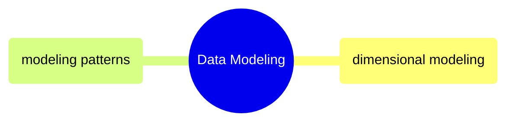

# Data Modeling

How to structure data inside each system for analytics, operations, and compliance — dimensional modeling, Data Vault 2.0, wide/flat, and every major modeling paradigm.

> [!abstract]- [[dimensional-modeling]]
>
> Kimball four-step process, star schema, all SCD types, bus matrix, bridge tables, physical implementation in SQL Server + BigQuery, dbt integration. The dominant approach for analytical workloads.

> [!abstract]- [[data-modeling-patterns]]
>
> Normalized (3NF), Data Vault 2.0, wide/flat OBT, activity schema, time-series, document (Firestore), graph — decision framework for choosing the right model. Covers every major modeling paradigm with full DDL and naming conventions.
