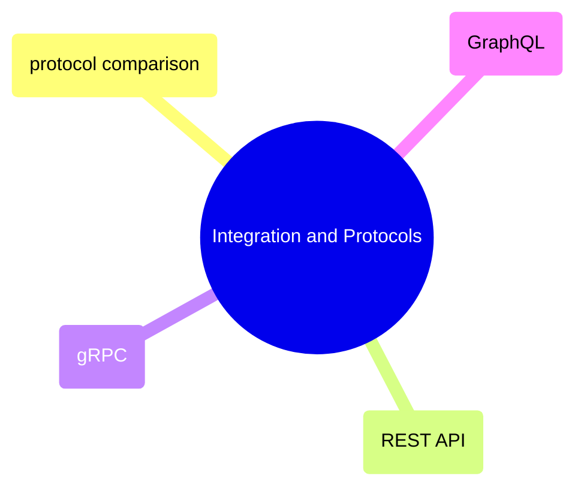

# Integration and Protocols

API design, protocol selection, and integration patterns — the full spectrum from REST to gRPC to GraphQL with decision frameworks for each use case.

> [!abstract]- [[04-api-protocols-comparison]]
>
> Master decision framework: REST vs gRPC vs GraphQL vs WebSocket vs SSE vs MQTT vs AMQP vs Webhooks vs SFTP vs FIX. Comparison tables, decision matrices, working code for each.

> [!abstract]- [[01-rest-api-design-and-consumption]]
>
> Consuming and building REST APIs: authentication, pagination (4 patterns), rate limiting, backoff, async ingestion, FastAPI, curl reference, OpenAPI.

> [!abstract]- [[02-grpc-for-data-pipelines]]
>
> Protocol Buffers, all 4 RPC types, Python server+client, interceptors, load balancing, GCP Cloud Run deployment. For high-throughput internal service communication.

> [!abstract]- [[03-graphql-for-data-access]]
>
> Schema definition, queries/mutations/subscriptions, Strawberry+FastAPI, N+1/DataLoader, cursor pagination, federation. For flexible client-driven data access.
