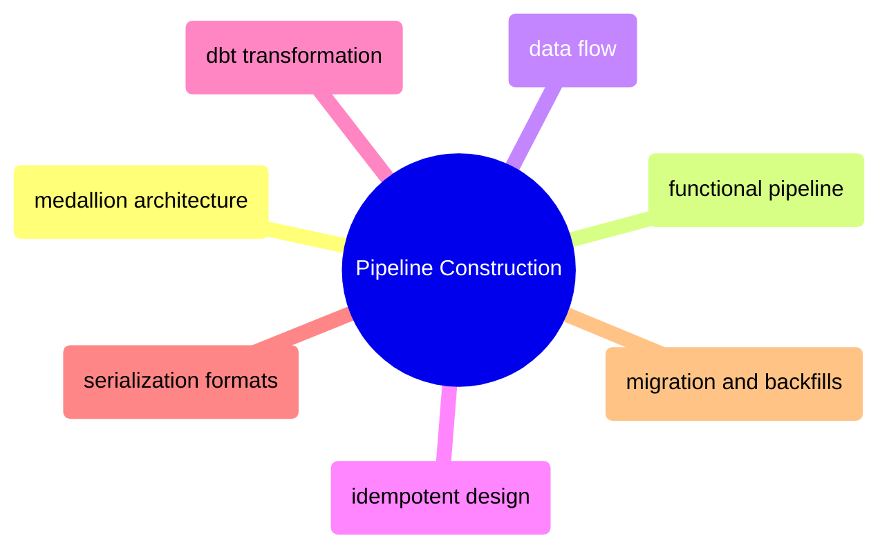

# Pipeline Construction

How to structure pipeline code — data layering, idempotent operations, transform architecture, data movement topology, serialization, and migration patterns.

> [!abstract]- [[01-medallion-architecture]]
>
> Bronze/Silver/Gold layered processing. The most widely adopted pipeline pattern for both warehouses and lakehouses. Start here.

> [!abstract]- [[03-functional-pipeline-architecture]]
>
> Five architectural principles (functional core/imperative shell, contract validation, quality gates, data provenance, immutable value objects) applied to pipeline construction. The theory behind the reference implementations.

> [!abstract]- [[02-data-flow-architecture]]
>
> Complete data movement topology for the stack: every source-destination pair, transfer method decision matrix, format selection, push/pull/staged patterns, batch vs streaming vs micro-batch.

> [!abstract]- [[04-idempotent-pipeline-design]]
>
> DELETE-INSERT, MERGE, staging table patterns for safe re-runs. The foundation for pipelines that can be retried without producing duplicates.

> [!abstract]- [[11-dbt-transformation-layer]]
>
> dbt Core vs Cloud, project structure, testing, macros, incremental models, Airflow integration. The SQL-first transformation approach.

> [!abstract]- [[12-serialization-formats]]
>
> JSON/YAML/CSV/Protobuf/Avro/Parquet/Pickle comparison, compression codecs (gzip, zstd, snappy), format selection by scenario.

> [!abstract]- [[10-migration-idempotency-backfills]]
>
> Migration strategies (strangler fig), backfill chunking, schema evolution, data contracts for safe evolution.

**Implementation references:**
* [25_py_functional_pipeline](https://alp78.github.io/elysium/02-Programming-Languages/Python/25_py_functional_pipeline) — Python reference implementation
* [25_cs_functional_pipeline](https://alp78.github.io/elysium/02-Programming-Languages/CSharp/25_cs_functional_pipeline) — C# reference implementation
