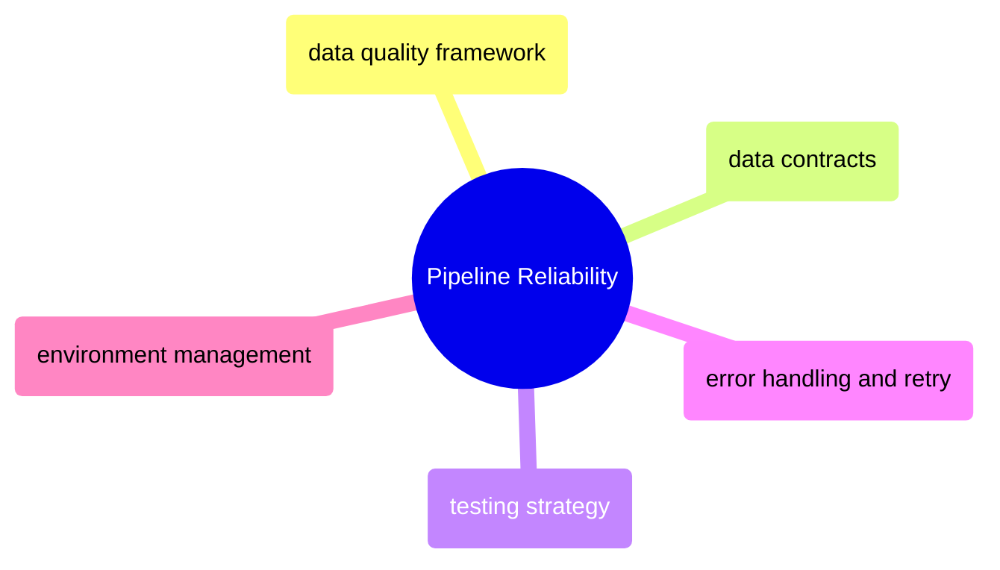

# Pipeline Reliability

Quality gates, contracts, testing strategy, error handling, and environment management — the patterns that prevent bad data from reaching consumers.

> [!abstract]- [[data-quality-framework]]
>
> Six quality dimensions (completeness, uniqueness, validity, timeliness, accuracy, consistency), quality gates per medallion layer, tooling comparison, quarantine pattern, anomaly detection.

> [!abstract]- [[data-contracts]]
>
> Schema + SLA + semantics agreements between data producers and consumers. Breaking vs non-breaking changes, CI validation, contract versioning.

> [!abstract]- [[data-pipeline-testing-strategy]]
>
> The testing pyramid for data engineering: unit tests, data quality assertions, contract tests, integration tests, E2E validation. Where each test type runs and what it catches.

> [!abstract]- [[error-handling-and-retry-patterns]]
>
> Error classification (transient/permanent/data-dependent/resource/partial), retry strategies (exponential backoff with jitter), circuit breaker, dead letter queue, failure propagation.

> [!abstract]- [[environment-management-strategy]]
>
> Environment topology (two-tier vs three-tier), what differs per environment, tool-by-tool separation (gcloud/Terraform/dbt/Airflow/GitHub Actions), promotion workflow, cost model.
