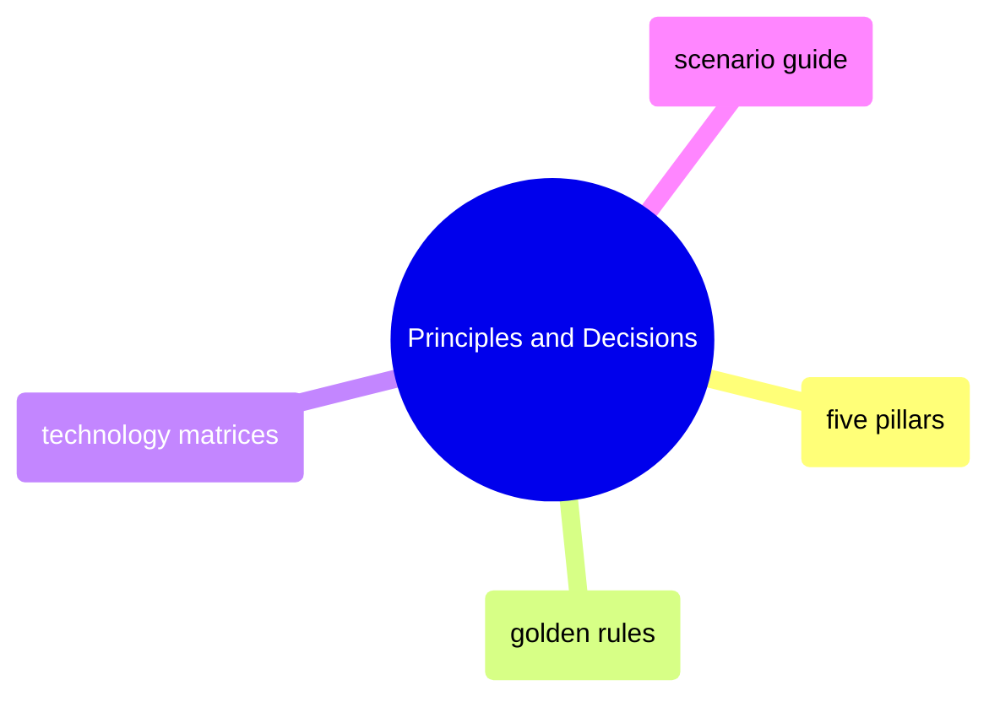

# Principles and Decisions

Foundational principles and decision frameworks for every technology and architecture choice — golden rules for the mindset, matrices and scenarios for specific decisions.

> [!abstract]- [[five-pillars-of-data-engineering]]
>
> Reliability, observability, efficiency, security, operability. The five concerns that separate junior from senior engineering thinking.

> [!abstract]- [[golden-rules-of-data-engineering]]
>
> 10 foundational principles: serve the business, choose boring technology, optimize for change, raw data is sacred, complexity is debt. Each with decision tests and anti-patterns.

> [!abstract]- [[technology-selection-matrices]]
>
> Decision tables for every choice: Python vs Bash vs C# vs SQL, SQL Server vs BigQuery, Airflow vs cron, Terraform vs gcloud, data models, APIs, build vs buy. 30+ lookup entries.

> [!abstract]- [[scenario-based-decision-guide]]
>
> 10 real-world scenarios with Mermaid architecture diagrams: daily batch pipeline, streaming, data warehouse, multi-source integration, cost optimization. Follow the scenario that matches your situation.
