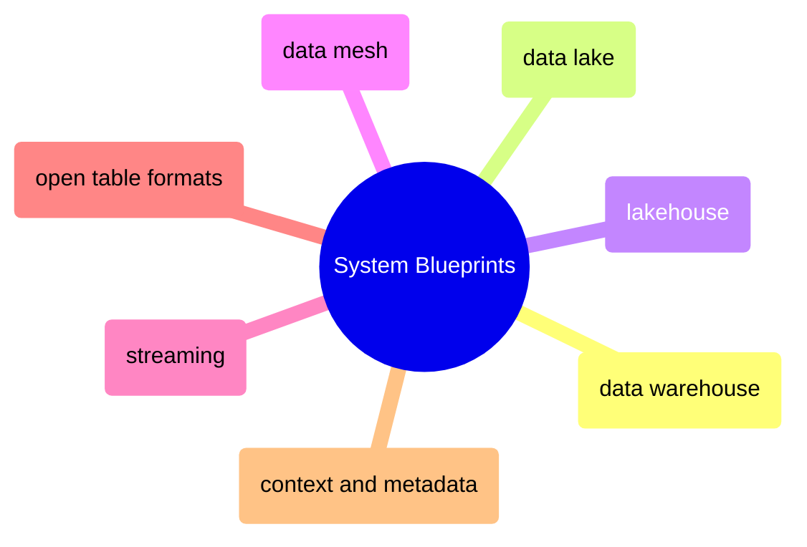

# System Blueprints

Platform architecture patterns — the big structural decisions chosen once and lived with for years, from warehouses and lakes to lakehouses, mesh, and streaming.

> [!abstract]- [[data-warehouse-architecture]]
>
> Star/snowflake schema, Kimball vs Inmon, SCD types, Data Vault 2.0, cloud warehouse comparison. Start here if your data is structured and analytical.

> [!abstract]- [[data-lake-architecture]]
>
> Zone architecture (landing/cleansed/curated), file formats, governance, anti-patterns. Start here if you work with unstructured or semi-structured data at scale.

> [!abstract]- [[lakehouse-architecture]]
>
> Combining lake storage with warehouse semantics: ACID on object storage, open table formats, query engines. Where most modern platforms are converging.

> [!abstract]- [[data-mesh-architecture]]
>
> Domain-driven data ownership, data products, federated governance. When centralized architecture creates organizational bottlenecks.

> [!abstract]- [[streaming-architecture]]
>
> Lambda vs Kappa, event-driven design, CDC, Kafka/Pub/Sub, windowing, exactly-once semantics. When batch latency isn't acceptable.

> [!abstract]- [[open-table-formats]]
>
> Delta Lake, Apache Iceberg, Apache Hudi — format internals, time travel, schema evolution, maintenance operations. The technology layer that enables lakehouse.

> [!abstract]- [[context-and-metadata-architecture]]
>
> The five types of pipeline context (run, provenance, temporal, quality, business), context propagation patterns, bi-temporal modeling, schema evolution. The semantic layer that makes data self-describing.
