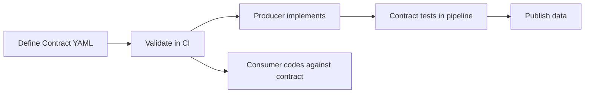

# Data Contracts

> [!abstract] When You Need This
>
> A data contract is a formal agreement between a data producer and its consumers specifying the schema, SLAs, semantics, and ownership of a dataset. Without contracts, schema changes break downstream pipelines silently.

### What a Data Contract Contains

| Component | Definition | Example |
|-----------|-----------|---------|
| **Schema** | Column names, types, nullability, constraints | `instrument_isin CHAR(12) NOT NULL` |
| **SLA** | Freshness, availability, quality thresholds | "Available by 18:00 UTC, 99.9% uptime" |
| **Semantics** | Business meaning of each field | "close_price is the official exchange closing price in local currency" |
| **Ownership** | Who produces, who maintains, who to contact | "Market Data Team owns, Index Ops consumes" |
| **Versioning** | How changes are communicated and rolled out | "Semver: breaking = major, additive = minor" |

The contract concept parallels [API contracts](/14-Data-Architecture/APIs-and-Protocols/rest-api-design-and-consumption) in REST design — both define a stable interface between producer and consumer, with versioning and backward-compatibility guarantees.

> [!warning] Enforce contracts in CI
>
> Writing a contract YAML file that nobody validates in CI provides a false sense of safety. The contract must be checked automatically on every pipeline run -- schema validation in CI, SLA checks in Airflow, and freshness monitors in Datadog. If the enforcement step is missing, the contract will drift from reality within weeks, and downstream consumers will still break on schema changes.

> [!danger] Contract Without Enforcement
>
> A contract YAML file that nobody validates in CI provides a false sense
> of safety. The contract will drift from reality within weeks: a column
> gets renamed, a type changes, an SLA shortens. Downstream consumers
> still break on schema changes — but now they're SURPRISED because
> the contract said it wouldn't happen. Enforce contracts automatically:
> Pydantic at ingestion, dbt tests at transform, CI checks at deployment.
> A contract that isn't tested is a lie.

### Contract-First Development Workflow



1. Producer and consumer agree on the contract (schema + SLA) before any code is written
2. Contract is version-controlled alongside the pipeline code
3. CI validates that produced data matches the contract
4. Breaking changes require a new major version and migration period

### Schema Definition Formats

| Format | Strengths | When to Use |
|--------|-----------|-------------|
| **JSON Schema** | Human-readable, widely supported | REST APIs, config validation |
| **Protocol Buffers** | Strongly typed, backward-compatible by design | gRPC services, high-throughput |
| **Avro** | Schema evolution built-in, compact binary | Kafka/Pub/Sub messages |
| **[dbt YAML](/11-dbt/Quality/dbt-data-contracts-implementation)** | Native to dbt, enforced at build time | Warehouse transforms |
| **SQL DDL** | Universal, everyone reads SQL | Database tables |

### Data Contracts in Practice — Exported from Code

The contract examples above use YAML — a design-time format. The functional
pipeline takes a different approach: contracts are GENERATED from code at
runtime. Pydantic models define the schema, ColumnContext registries define
the semantics, and `export_contracts()` serializes both into a JSON Schema
file — a machine-readable contract that any consumer (including AI agents)
can parse.

See [functional-pipeline-architecture](/14-Data-Architecture/Pipeline-Patterns/functional-pipeline-architecture) for the architecture and
[25_py_functional_pipeline](/02-Programming-Languages/Python/25_py_functional_pipeline) for the implementation.

### Example Contract: ESG Score Feed

> [!info] Contract Header and Schema
>
> The contract header identifies the dataset, owner, and version. The schema section defines every column with type, nullability, and business description.

```yaml
# contracts/esg-scores-v2.yaml — header and metadata
contract:
  name: esg-scores
  version: 2.0.0
  owner: esg-data-team
  description: "Normalized ESG scores, 0-100 scale (higher = better)"
```

```yaml
# contracts/esg-scores-v2.yaml — schema definition
schema:
  columns:
    - name: instrument_isin
      type: string
      length: 12
      nullable: false
      description: "ISO 6166 ISIN identifier"
    - name: vendor_code
      type: string
      nullable: false
      enum: [MSCI, SUSTAINALYTICS, ISS, BLOOMBERG, CDP]
    - name: normalized_score
      type: decimal
      precision: 5
      scale: 2
      nullable: true
      constraints: { min: 0, max: 100 }
    - name: score_date
      type: date
      nullable: false
    - name: loaded_at
      type: timestamp
      nullable: false
  primary_key: [instrument_isin, vendor_code, score_date]
```

> [!info] SLA and Change Classification
>
> The SLA section defines freshness, availability, and quality thresholds. Breaking vs non-breaking changes follow semver: breaking = major version bump with migration period.

```yaml
# contracts/esg-scores-v2.yaml — SLA and change rules
sla:
  freshness: "Updated weekly by Monday 08:00 UTC"
  availability: "99.9%"
  quality:
    completeness: ">= 95% of index universe covered"
    null_rate: "< 2% for normalized_score"

breaking_changes:
  - Removing a column
  - Changing a column type
  - Changing primary key
  - Narrowing an enum

non_breaking_changes:
  - Adding a new column (nullable)
  - Widening an enum (adding new vendor)
  - Relaxing a constraint
```

### Example Contract: Index Constituent Feed

> [!info] Constituent Schema with SCD2-Style Dates
>
> `effective_date` / `expiry_date` pattern enables point-in-time queries. `weight_pct` must sum to 1.0 per index per date — a circuit-breaker quality check.

```yaml
# contracts/index-constituents-v1.yaml — schema
contract:
  name: index-constituents
  version: 1.0.0
  owner: index-operations-team

schema:
  columns:
    - { name: index_code, type: string, nullable: false }
    - { name: instrument_isin, type: string, length: 12, nullable: false }
    - { name: effective_date, type: date, nullable: false }
    - { name: expiry_date, type: date, nullable: false, default: "9999-12-31" }
    - { name: weight_pct, type: decimal, nullable: false, constraints: { min: 0, max: 1 } }
    - { name: change_reason, type: string, nullable: true,
        enum: [REBALANCE, IPO_ADD, MERGER_REMOVE, DELIST, SPIN_OFF_ADD] }
  primary_key: [index_code, instrument_isin, effective_date]
```

```yaml
# contracts/index-constituents-v1.yaml — SLA
sla:
  freshness: "Updated at quarterly rebalancing and on corporate actions"
  quality:
    weight_sum: "SUM(weight_pct) = 1.00000000 per index_code + date"
    completeness: "Exactly N constituents where N = target count"
```

### Contract Testing in CI

> [!info] Automated Contract Enforcement
>
> Validates contract YAML syntax and runs dbt contract tests on every push that touches contracts or models. See [github-actions-patterns](/10-GitHub-Actions/github-actions-patterns) for reusable workflow patterns.

```yaml
# .github/workflows/contract-test.yml
name: Data Contract Validation
on:
  push:
    paths: ['contracts/**', 'models/**']
jobs:
  validate:
    runs-on: ubuntu-latest
    steps:
      - uses: actions/checkout@v4
      - run: pip install jsonschema pyyaml
      - run: python scripts/validate_contracts.py contracts/
      - run: dbt build --select tag:contract_test --target ci
```

### Breaking vs Non-Breaking Contract Changes

| Change | Breaking? | Action Required |
|--------|----------|----------------|
| Add nullable column | No | Minor version bump |
| Remove column | **Yes** | Major version, migration period |
| Change column type | **Yes** | Major version |
| Rename column | **Yes** | Major version |
| Add enum value | No | Minor version bump |
| Remove enum value | **Yes** | Major version |
| Tighten constraint | **Yes** | Major version |
| Relax constraint | No | Minor version bump |
| Change SLA | Depends | Communicate to all consumers |

> [!warning] Additive Changes Are Not Always Safe
>
> "Adding a nullable column is non-breaking" is true for schema-aware
> consumers. But a consumer that does `SELECT *` and feeds the result
> to a fixed-width parser, a strict Avro schema, or a Pydantic model
> with `model_config = ConfigDict(extra='forbid')` will BREAK on the
> new column. Additive changes are safe only when ALL consumers handle
> unknown fields gracefully. In practice, announce additive changes
> and give consumers a release window, even if they're "non-breaking."

### Producer and Consumer Responsibilities

| Responsibility | Producer | Consumer |
|---------------|----------|----------|
| Schema definition | Defines and maintains | Validates inputs against |
| SLA compliance | Monitors and guarantees | Monitors and alerts on breach |
| Breaking changes | Publishes new major version | Migrates within deprecation window |
| Quality checks | Validates before publishing | Validates after receiving |
| Documentation | Maintains contract YAML | References contract in their code |
| Incidents | Notifies consumers of issues | Reports anomalies to producer |

### Data Contract Anti-Patterns

| Anti-Pattern | Problem | Better Approach |
|-------------|---------|----------------|
| No contract exists | Schema changes break consumers silently | Define contracts before building |
| Contract not enforced | Contract exists but nobody checks | Automate validation in CI and pipeline (see [data-quality-framework](/14-Data-Architecture/Pipeline-Patterns/data-quality-framework)) |
| Verbal agreements | "We agreed in a meeting" is not auditable | Version-controlled YAML contracts |
| Producer ignores consumer needs | Schema designed for producer convenience | Joint schema design sessions |
| No deprecation period | Old version removed immediately | Minimum 30-day deprecation window |

## Related

- [data-quality-framework](/14-Data-Architecture/Pipeline-Patterns/data-quality-framework) — Quality gates that enforce contract SLAs at each medallion layer
- [data-pipeline-testing-strategy](/14-Data-Architecture/Pipeline-Patterns/data-pipeline-testing-strategy) — How contract tests fit in the data engineering testing pyramid
- [serialization-formats](/14-Data-Architecture/Pipeline-Patterns/serialization-formats) — Schema formats (Protobuf, Avro, JSON Schema) and their evolution support
- [dbt-transformation-layer](/14-Data-Architecture/Pipeline-Patterns/dbt-transformation-layer) — dbt model contracts with enforced schemas at build time
- [streaming-architecture](/14-Data-Architecture/Architectures/streaming-architecture) — Schema registries for event contracts in Pub/Sub and Kafka
- [rest-api-design-and-consumption](/14-Data-Architecture/APIs-and-Protocols/rest-api-design-and-consumption) — API contracts parallel data contracts: versioning, backward compatibility
- [error-handling-and-retry-patterns](/14-Data-Architecture/Pipeline-Patterns/error-handling-and-retry-patterns) — What happens when contract validation fails: quarantine, DLQ, alerting
