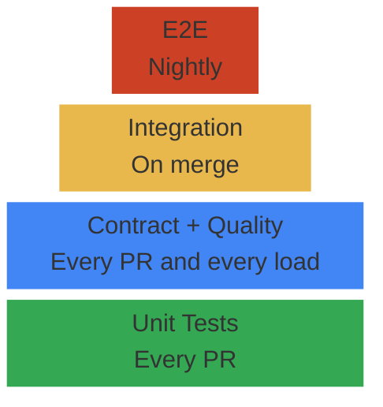

# Data Pipeline Testing Strategy

Every page in this vault covers *how* to use a testing tool — pytest fixtures, dbt generic tests, GitHub Actions workflows. This page answers the strategy question: **what should I test, at which layer, with which tool, and when does each test run?**

---

## The Data Engineering Testing Pyramid



The pyramid reads bottom-to-top: the base (unit tests) runs the most tests at the lowest cost, while the peak (E2E) runs the fewest tests at the highest cost. Each layer catches a different class of failure that the layers below cannot.

> [!tip] Where to Invest First
>
> Most pipeline teams have zero tests. If you're starting from nothing, add in this
> order: (1) dbt generic tests on gold models (unique, not_null on key columns),
> (2) row count assertions after every load, (3) pytest for transform functions.
> These three catch 80% of production data issues.

---

## Pyramid Layers — Detailed Breakdown

### Unit Tests — transform logic

Unit tests validate individual functions, SQL transforms, and dbt models in isolation. They are the fastest, cheapest, and most numerous tests in the pyramid.

> [!abstract] How Unit Tests Work
>
> Feed a known input DataFrame or SQL result into a transform function and assert the output matches expected values. No database, no network, no external dependencies. Pure logic verification.
>
> - **Python:** pytest with sample DataFrames as fixtures — see [10_py_testing_migration](https://alp78.github.io/elysium/03-Dataframes/Dataframes-Python/10_py_testing_migration)
> - **C#:** xUnit with test DataFrames — see [10_cs_testing_migration](https://alp78.github.io/elysium/03-Dataframes/Dataframes-CSharp/10_cs_testing_migration)
> - **dbt:** schema tests in `schema.yml` — `unique`, `not_null`, `accepted_values`, `relationships` — see [dbt-testing-framework > dbt Built-in Generic Tests](https://alp78.github.io/elysium/11-dbt/Quality/dbt-testing-framework#dbt-built-in-generic-tests)
> - **When:** every PR, every commit — seconds to run

> [!danger] Skip Unit Tests And...
>
> Broken transforms reach production. A z-score function that divides by the wrong column, a deduplication query that keeps the wrong row, an aggregation that double-counts — all of these produce **silently wrong data** that the dashboard displays with full confidence. Nobody notices until a business user challenges a number weeks later.

---

### Data Quality Assertions — data properties

Quality assertions validate data properties at layer boundaries: nulls, counts, ranges, uniqueness, and freshness. They run after every pipeline execution, not just in CI.

> [!abstract] How Quality Assertions Work
>
> After each pipeline stage writes its output, run a set of checks against the result:
>
> - Row count > 0 (table not empty after load)
> - Row count ± 20% of yesterday (no explosion from bad join, no loss from filter bug)
> - Null percentage < threshold per column
> - Value ranges (no negative prices, no future dates)
> - Uniqueness on business keys (no duplicates from failed dedup)
> - Freshness (latest date within SLA window)
>
> Tools: dbt generic tests, `dbt-expectations`, custom Python/SQL assertions. See [data-quality-framework > Data Quality Dimensions](https://alp78.github.io/elysium/14-Data-Architecture/Pipeline-Patterns/data-quality-framework#data-quality-dimensions).
> When: every pipeline run in production + every PR in CI.

> [!danger] Skip Quality Assertions And...
>
> Silent data degradation. A source API starts returning NULLs for a field — your pipeline loads them without error. Over weeks, 50% of your gold table is NULL. Nobody notices because there's no row count drop, no schema change, no error in the logs. The dashboard just gradually becomes wrong.

---

### Contract Tests — schema conformance

Contract tests verify that source data matches the expected schema before any transform runs. They are the only defense against upstream changes.

> [!abstract] How Contract Tests Work
>
> Define the expected schema (column names, types, nullability, value ranges) in a contract file or dbt source YAML. On every ingestion, validate the incoming data against the contract. If a column is missing, renamed, or has a new type, the test fails before the data enters bronze.
>
> - Define contracts: [data-contracts > What a Data Contract Contains](https://alp78.github.io/elysium/14-Data-Architecture/Pipeline-Patterns/data-contracts#what-a-data-contract-contains)
> - dbt contracts: [dbt-data-contracts-implementation](https://alp78.github.io/elysium/11-dbt/Quality/dbt-data-contracts-implementation)
> - Schema drift detection: [context-and-metadata-architecture](https://alp78.github.io/elysium/14-Data-Architecture/Architectures/context-and-metadata-architecture)
> - When: every PR (schema changes in code) + every ingestion (schema changes in source data)

> [!danger] Skip Contract Tests And...
>
> An upstream API renames `price` to `current_price`. Your pipeline loads NULLs into the `price` column — every row, every day. The pipeline reports success, row counts match, no errors in logs. Nobody notices until a business user asks why the dashboard shows zero for everything. This is the #1 silent pipeline killer.

---

### Integration Tests — cross-system flow

Integration tests run the pipeline end-to-end with real connections but test data. They catch the "works in dev, breaks in prod" failures that unit tests cannot.

> [!abstract] How Integration Tests Work
>
> Spin up a real database (Docker SQL Server in GitHub Actions), load test fixtures (100-1000 rows of known data), run the full bronze → silver → gold flow, and assert the output shape and values.
>
> - GitHub Actions: [github-actions-data-engineering > Full Python Lint + Test Workflow](https://alp78.github.io/elysium/10-GitHub-Actions/github-actions-data-engineering#full-python-lint--test-workflow)
> - dbt in CI: [github-actions-data-engineering > dbt Build Against Dev Schema](https://alp78.github.io/elysium/10-GitHub-Actions/github-actions-data-engineering#dbt-build-against-dev-schema)
> - When: on merge to main — too slow for every PR, too important to skip

> [!danger] Skip Integration Tests And...
>
> "Works in dev, breaks in prod" — the #1 pipeline failure mode. Your SQL runs perfectly against your local Docker database but fails on the production SQL Server because of a different collation, a missing index, or a permission issue. Mocking the database doesn't test your SQL against a real query engine.

---

### E2E Pipeline Validation — full flow

E2E tests validate the complete pipeline from data fetch through gold output, including orchestration, quality gates, and export. They catch multi-step regressions that no single-layer test can detect.

> [!abstract] How E2E Tests Work
>
> Run the full pipeline (or a representative subset) on a fixed test dataset. Compare the gold output against a "golden file" — a known-correct reference output. Flag any difference above a tolerance threshold (exact match for integers, ±0.01 for floats).
>
> - Use a dedicated test database/dataset with seeded fixture data
> - Run nightly or weekly — too slow and expensive for every PR
> - Compare: `pd.testing.assert_frame_equal()` with `atol` for numeric tolerance, or dbt custom tests against a seeded reference table

> [!danger] Skip E2E Tests And...
>
> Multi-step regressions go undetected. A subtle change in a silver transform produces correct-looking silver data, but when gold aggregates it, the composite scores shift by 5%. Unit tests pass (the function works). Quality tests pass (no nulls, no duplicates). Only the full end-to-end comparison catches the drift — because it checks the final answer, not intermediate steps.

---

## What to Test at Each Pipeline Layer

This table maps testing to the **medallion architecture** — what specific checks apply at each data layer, which tool runs them, and where the implementation lives in the vault.

| Pipeline Layer | What to Test | Primary Tool | Vault Reference |
|---|---|---|---|
| **Bronze** | Schema matches source, row count > 0, no all-NULL columns, source freshness | dbt source tests, Python assertions | [data-quality-framework > Medallion Bronze Quality Gate — Landing / Raw](https://alp78.github.io/elysium/14-Data-Architecture/Pipeline-Patterns/data-quality-framework#medallion-bronze-quality-gate--landing--raw) |
| **Silver** | Business logic correctness, dedup worked, SCD2 integrity, gap-fill completeness | dbt tests, pytest with fixtures | [dbt-testing-framework > dbt Built-in Generic Tests](https://alp78.github.io/elysium/11-dbt/Quality/dbt-testing-framework#dbt-built-in-generic-tests) |
| **Gold** | Output shape matches expectations, z-scores in bounds, no NaN in scores, ranks are contiguous | dbt tests, pandas assertions | [data-quality-framework > Medallion Gold Quality Gate -- Consumption / Publication](https://alp78.github.io/elysium/14-Data-Architecture/Pipeline-Patterns/data-quality-framework#medallion-gold-quality-gate----consumption--publication) |
| **Cross-layer** | Row count preservation (bronze → silver minus expected dedup), referential integrity | dbt cross-model tests, SQL assertions | [data-quality-framework > Data Quality Quarantine Pattern](https://alp78.github.io/elysium/14-Data-Architecture/Pipeline-Patterns/data-quality-framework#data-quality-quarantine-pattern) |

> [!danger] Gold Quality Is Last Defense
>
> Gold tables feed dashboards, APIs, and downstream consumers. A quality bug in gold
> is visible to the business. Every gold model must have at minimum: `unique` + `not_null`
> on the primary key, `accepted_values` on categorical columns, and a row count assertion
> comparing today vs yesterday (detect data loss or explosion).

---

## Test Types — Detailed Breakdown

### Unit tests — transform logic

Test individual functions, SQL transforms, and dbt models in isolation. These are the fastest tests and should make up the majority of your test suite.

**Python (pytest):** Test transform functions with sample DataFrames as fixtures. See [10_py_testing_migration](https://alp78.github.io/elysium/03-Dataframes/Dataframes-Python/10_py_testing_migration) for Pandas/Polars testing patterns.

**C# (xUnit):** Test transform methods with test DataFrames. See [10_cs_testing_migration](https://alp78.github.io/elysium/03-Dataframes/Dataframes-CSharp/10_cs_testing_migration) for Deedle/Polars.NET patterns.

**dbt:** Schema tests in `schema.yml` — `unique`, `not_null`, `accepted_values`, `relationships`. See [dbt-testing-framework > dbt Built-in Generic Tests](https://alp78.github.io/elysium/11-dbt/Quality/dbt-testing-framework#dbt-built-in-generic-tests) for the full list.

> [!info] The unit test rule
>
> Every transform function must have at least one test that verifies correct output
> for known input. If a function calculates a z-score, test it with a known dataset
> where you can verify the expected z-score by hand. If a function deduplicates, test
> it with a dataset containing known duplicates and verify the count drops correctly.

### Data quality assertions

Validate data properties at layer boundaries. These run after every pipeline execution, not just in CI.

**Checks to implement:**

| Check | What It Catches | Tool |
|---|---|---|
| Row count > 0 | Empty table after failed load | dbt `dbt_utils.at_least_one`, SQL assertion |
| Row count ± 20% of yesterday | Data explosion from bad join or data loss from filter bug | Custom dbt test, Python assertion |
| Null percentage < threshold | Silent schema change producing NULLs | dbt `not_null`, custom threshold test |
| Value ranges | Out-of-bounds scores, negative prices, future dates | dbt `accepted_range`, custom SQL |
| Uniqueness on business key | Duplicates from failed dedup or bad merge | dbt `unique`, `unique_combination_of_columns` |
| Freshness | Stale data — source hasn't updated | dbt `source freshness`, custom metric |

See [data-quality-framework > Data Quality Dimensions](https://alp78.github.io/elysium/14-Data-Architecture/Pipeline-Patterns/data-quality-framework#data-quality-dimensions) for the full quality taxonomy and [gcp-pipeline-health-and-sla > Row Count Validation](https://alp78.github.io/elysium/13-Observability/GCP-Native/gcp-pipeline-health-and-sla#row-count-validation) for production monitoring integration.

> [!warning] Quality Checks Need Production Too
>
> Data quality degrades between deploys — source schemas change, APIs return different
> data, volumes shift. dbt tests in CI catch code bugs. Production quality checks catch
> data bugs. You need both.

### Contract tests — schema conformance

Verify that source data matches the expected schema before any transform runs.

**The problem:** An upstream API changes a field name from `price` to `current_price`. Your pipeline loads NULLs into the `price` column — every row, every day — until someone notices the dashboard is wrong.

**Implementation:**
- Define the contract (column names, types, nullability, value ranges): see [data-contracts > What a Data Contract Contains](https://alp78.github.io/elysium/14-Data-Architecture/Pipeline-Patterns/data-contracts#what-a-data-contract-contains)
- Validate on ingestion with a Python validator or dbt source test: see [context-and-metadata-architecture > Schema Drift Detection](https://alp78.github.io/elysium/14-Data-Architecture/Architectures/context-and-metadata-architecture#schema-drift-detection)
- dbt contracts: see [dbt-data-contracts-implementation > What Is a dbt Data Contract?](https://alp78.github.io/elysium/11-dbt/Quality/dbt-data-contracts-implementation#what-is-a-dbt-data-contract)

> [!danger] Schema Changes Kill Silently
>
> Code bugs raise exceptions. Data volume changes are visible in monitoring. But a
> renamed column silently loads NULLs — the pipeline reports success, row counts match,
> and nobody notices until a business user asks why the dashboard shows zero. Contract
> tests are the only defense against this.

### Integration tests

Test the pipeline end-to-end with real connections but test data.

**Scope:** Full bronze → silver → gold flow with a small dataset (100-1000 rows).

**Pattern:** Dedicated test database/dataset, seeded with fixture data, torn down after each test run.

**GitHub Actions implementation:** Spin up a SQL Server Docker container, load test fixtures, run the pipeline, assert output shape and values.

See [github-actions-data-engineering > Full Python Lint + Test Workflow](https://alp78.github.io/elysium/10-GitHub-Actions/github-actions-data-engineering#full-python-lint--test-workflow) for the CI workflow and [github-actions-data-engineering > dbt Build Against Dev Schema](https://alp78.github.io/elysium/10-GitHub-Actions/github-actions-data-engineering#dbt-build-against-dev-schema) for dbt integration tests in CI.

> [!warning] Integration Tests Need Real Infra
>
> Mocking a database doesn't test your SQL. Mocking GCS doesn't test your upload logic.
> Integration tests must use real connections — even if that's a Docker SQL Server in
> GitHub Actions. The cost is minutes of CI time; the payoff is catching "works in dev,
> breaks in prod" before it reaches prod.

### Regression tests — snapshot comparison

Verify today's output matches yesterday's expected output after a code change.

**The problem:** A code change alters the z-score calculation subtly. Unit tests pass (they test the new formula). But production output is different from what downstream consumers expect — scores shift, ranks change, dashboards look wrong.

**Implementation:**
- Save expected output as a "golden file" (CSV/Parquet fixture)
- After pipeline run, compare actual output against golden file
- Flag differences above a threshold (exact match for integers, ±0.01 for floats)

**dbt:** Custom test comparing current model output against a seeded reference table.

**Python:** pytest with golden file fixtures — `pd.testing.assert_frame_equal()` with `atol` for numeric tolerance.

---

## Test Data Management

| Approach | When to Use | Gotcha |
|---|---|---|
| **Hand-crafted fixtures** | Unit tests — known edge cases (NULLs, duplicates, boundary dates) | Time-consuming to maintain as schema evolves |
| **Sampled from production** | Integration tests — realistic data shape and volume | Must anonymize PII; may miss edge cases |
| **Synthetic generation** | Load testing, edge case coverage | May not reflect real data distributions |

> [!tip] Test Data Edge Case Rule
>
> Test data must include at least one example of every edge case your code handles:
> NULL values, duplicate keys, missing dates, out-of-range values, Unicode characters,
> empty strings, and zero-length files. If your code has a `try/except` for a specific
> condition, your test data must trigger that condition.

> [!warning] Production Data Only Is Insufficient
>
> Production data tests the happy path — the data your pipeline already handles correctly.
> It never tests the edge cases that will crash your pipeline when they first appear.
> Always supplement production samples with hand-crafted edge case fixtures.

---

## CI/CD Test Automation

The complete testing pipeline on every PR and merge. For GitHub Actions workflow syntax, see [github-actions-data-engineering > End-to-End Pipeline: PR to Lint to Test to Build to Deploy to Verify](https://alp78.github.io/elysium/10-GitHub-Actions/github-actions-data-engineering#end-to-end-pipeline-pr-to-lint-to-test-to-build-to-deploy-to-verify).

```yaml
# Conceptual workflow — link to implementation pages for full YAML
on:
  pull_request:
    branches: [main]

jobs:
  lint-and-type-check:     # ruff, mypy, sqlfluff
  unit-tests:              # pytest -m "not integration"
  dbt-tests:               # dbt test --select state:modified+
  schema-validation:       # contract tests against source schemas
  # --- runs only on merge to main ---
  integration-test:        # Docker SQL Server + test data + pipeline run
  data-quality:            # assertions on integration test output
```

### When each test type runs

| Test Type | On Every PR | On Merge | Nightly | On Every Pipeline Run |
|---|---|---|---|---|
| Unit tests | Yes | Yes | — | — |
| dbt generic tests | Yes | Yes | — | Yes (in production) |
| Contract tests | Yes | Yes | — | Yes (on ingestion) |
| Integration tests | — | Yes | — | — |
| Regression tests | — | — | Yes | — |
| Data quality assertions | — | — | — | Yes |

> [!info] Test Timing Cost-Benefit
>
> Unit tests and contract tests are cheap (seconds, no infrastructure) — run on every PR.
> Integration tests need infrastructure (Docker containers, real connections) — run on
> merge only. Regression tests compare large datasets — run nightly to avoid slowing CI.
> Data quality assertions run in production after every load — they catch data problems
> that code tests can't.

---

## Production Monitoring Is Not Testing

| Concern | Testing (pre-deployment) | Monitoring (post-deployment) |
|---|---|---|
| **Question** | Does the code work correctly? | Is the pipeline healthy in production? |
| **When** | Before code reaches production | After every production run |
| **Tool** | pytest, dbt test, GitHub Actions | Datadog, Cloud Monitoring, custom metrics |
| **Catches** | Logic bugs, schema violations, regression | Data drift, volume changes, latency, failures |

Data quality checks are the exception — they span both worlds. Run them in CI (testing) AND after every production load (monitoring).

- Testing side: [dbt-testing-framework](https://alp78.github.io/elysium/11-dbt/Quality/dbt-testing-framework) + [github-actions-data-engineering](https://alp78.github.io/elysium/10-GitHub-Actions/github-actions-data-engineering)
- Monitoring side: [gcp-pipeline-health-and-sla](https://alp78.github.io/elysium/13-Observability/GCP-Native/gcp-pipeline-health-and-sla) + [data-quality-framework > Quality Gate Airflow Integration](https://alp78.github.io/elysium/14-Data-Architecture/Pipeline-Patterns/data-quality-framework#quality-gate-airflow-integration)

---

## Anti-Patterns

> [!danger] Pipeline Testing Anti-Patterns
>
> | Anti-Pattern | Consequence | Fix |
> |---|---|---|
> | No tests at all ("it worked in my notebook") | Every deploy is a gamble | Start with dbt `not_null` + `unique` on gold PKs |
> | Testing only the happy path | First NULL crashes production | Add edge case fixtures: NULLs, duplicates, empty, boundary dates |
> | Testing transforms but not schemas | Code correct, but input changed — garbage in, garbage out | Add contract tests on every source |
> | Tests only in CI, never in production | Data quality degrades silently between deploys | Run dbt tests + row count checks after every production load |
> | Production data as only test data | Never tests edge cases | Supplement with synthetic fixtures |
> | Testing by visual inspection | "I looked at it and it seems right" — not reproducible | Automated assertions with explicit expected values |
> | dbt tests without thresholds | Test passes with 99% NULLs (technically not ALL NULL) | Use `dbt-expectations` with `accepted_range` and percentage thresholds |
> | Mocking the database | SQL logic never tested against a real engine | Use Docker SQL Server in CI for integration tests |

---

## Related

- [dbt-testing-framework](https://alp78.github.io/elysium/11-dbt/Quality/dbt-testing-framework) — dbt generic tests, custom tests, severity levels, store-failures
- [data-quality-framework](https://alp78.github.io/elysium/14-Data-Architecture/Pipeline-Patterns/data-quality-framework) — Quality dimensions, medallion quality gates, quarantine pattern
- [data-contracts](https://alp78.github.io/elysium/14-Data-Architecture/Pipeline-Patterns/data-contracts) — Contract specification, breaking vs non-breaking changes, CI validation
- [dbt-data-contracts-implementation](https://alp78.github.io/elysium/11-dbt/Quality/dbt-data-contracts-implementation) — dbt-native contracts, model versions, access control
- [gcp-pipeline-health-and-sla](https://alp78.github.io/elysium/13-Observability/GCP-Native/gcp-pipeline-health-and-sla) — Production monitoring: freshness, row counts, SLA tracking, alerting
- [github-actions-data-engineering](https://alp78.github.io/elysium/10-GitHub-Actions/github-actions-data-engineering) — CI/CD workflows for data pipelines, dbt in CI, WIF auth
- [context-and-metadata-architecture](https://alp78.github.io/elysium/14-Data-Architecture/Architectures/context-and-metadata-architecture) — Schema drift detection, schema evolution patterns
- [10_py_testing_migration](https://alp78.github.io/elysium/03-Dataframes/Dataframes-Python/10_py_testing_migration) — pytest patterns for Pandas/Polars DataFrame testing
- [10_cs_testing_migration](https://alp78.github.io/elysium/03-Dataframes/Dataframes-CSharp/10_cs_testing_migration) — xUnit patterns for Deedle/Polars.NET DataFrame testing
- [environment-management-strategy](https://alp78.github.io/elysium/14-Data-Architecture/Pipeline-Patterns/environment-management-strategy) — How testing fits into the dev/staging/prod promotion workflow
