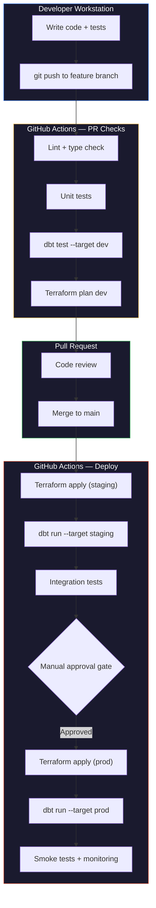

# Environment Management Strategy

> [!quote]
> "You need to get everything in version control. Not just the code, but everything required to build the environment."
>
> — **Gene Kim**, *The DevOps Handbook* (2016)

Every tool in the stack — gcloud, Terraform, dbt, Airflow, GitHub Actions, SQL Server, BigQuery — has its own mechanism for separating dev from prod. This page is the unifying strategy that coordinates all of them: how many environments, what differs between them, how changes are promoted, and how each tool switches context.

---

## Environment Topology — How Many and Why

| Model | Environments | Monthly Cost | Risk Profile | Best For |
|---|---|---|---|---|
| **Two-tier** | Dev workstation + Prod | ~$300-500 | Higher (no pre-prod gate) | Solo engineer, small team (1-3), budget-constrained |
| **Three-tier** | Dev + Staging + Prod | ~$400-600 | Lower (staging catches issues) | Most teams (3-10), standard recommendation |
| **Four-tier** | Dev + Staging + QA/UAT + Prod | ~$600-1000 | Lowest | Regulated industries, large teams (10+) |

> [!info] Two-Tier for Small Teams
>
> For a single data engineer or a team of 2-3 people, two-tier (dev + prod) is usually
> the right call. Staging adds $65-100/month in infrastructure cost plus operational
> overhead (maintaining a second environment, keeping schemas in sync, debugging
> staging-specific issues). The key mitigation: excellent CI/CD testing in GitHub Actions
> before merge to main. Add staging only when team size, compliance requirements, or
> incident frequency justify it.

Decision factors:
- **Team size:** 1-3 people → two-tier. 4-10 → three-tier. 10+ → four-tier.
- **Data sensitivity:** PII or financial data under regulation → staging mandatory.
- **Deployment frequency:** Multiple deploys per day → staging catches integration issues.
- **Budget:** Staging adds ~$65/month in GCP costs (see cost model below).

---

## What Differs Between Environments

| Dimension | Dev | Staging (if used) | Prod |
|---|---|---|---|
| **GCP Project** | `data-platform-dev` | `data-platform-staging` | `data-platform-prod` |
| **SQL Server** | Local Docker or e2-small VM | Smaller replica of prod | `data-pipeline-sql` (production VM) |
| **BigQuery dataset** | `dev_pipeline` | `staging_pipeline` | `pipeline_data` |
| **GCS bucket** | `data-platform-dev-data` | `data-platform-staging-data` | `data-platform-prod-data` |
| **Service account** | Dev SA (broader permissions) | Staging SA (prod-like permissions) | Pipeline SA (least privilege) |
| **Secrets** | `.env` file or dev Secret Manager | Staging Secret Manager | Prod Secret Manager |
| **Data volume** | Sample (1% of prod or synthetic) | Full copy or recent subset | Full production data |
| **Airflow** | Local Docker Compose | Staging VM (optional) | Production Airflow VM |
| **dbt target** | `dev` (profiles.yml) | `staging` | `prod` |
| **Terraform workspace** | `dev` | `staging` | `prod` |
| **Alerting** | None or Slack #dev-alerts | Slack #staging-alerts | PagerDuty + Slack #prod-alerts |
| **IAM** | Broader access for debugging | Prod-like restrictions | Strict least privilege |

> [!warning] Separate GCP Projects Required
>
> Same project for dev and prod means IAM changes affect both environments. Billing is mixed (can't attribute costs). A dev
> `terraform destroy` can hit prod resources. Always use separate GCP projects — the free
> tier applies per billing account, not per project, so multiple projects don't increase
> cost.

> [!success] Use separate GCP projects per environment
>
> Create `data-platform-dev`, `data-platform-staging`, and `data-platform-prod` as distinct GCP projects under the same billing account. Use Terraform to provision all three from a shared module with environment-specific `tfvars`. Billing attribution, IAM boundaries, and blast radius are all scoped automatically.

---

## Tool-by-Tool Environment Separation

### gcloud CLI — named configurations

One named configuration per environment. Switch with `activate`. The active configuration determines which GCP project, region, and account every `gcloud` command targets.

```bash
gcloud config configurations create dev
gcloud config set project data-platform-dev
gcloud config configurations activate dev
```

See [gcloud-configurations > gcloud config configurations create — named config per environment](https://alp78.github.io/elysium/06-GCP/Core/gcloud-configurations#gcloud-config-configurations-create--named-config-per-environment) for setup and [gcloud-configurations > Protecting Production with Visual Cues in Terminal](https://alp78.github.io/elysium/06-GCP/Core/gcloud-configurations#protecting-production-with-visual-cues-in-terminal) for the shell prompt trick that color-codes your terminal by environment.

> [!danger] Wrong gcloud configuration targets wrong project
>
> Forgetting to switch configurations before running `gcloud compute instances delete`
> or `bq rm` hits the wrong project. Always verify with `gcloud config get project`
> before destructive operations. The terminal color-coding pattern in
> [gcloud-configurations](https://alp78.github.io/elysium/06-GCP/Core/gcloud-configurations) makes the active project visible at a glance.

> [!success] Verify the active project before every destructive operation
>
> Run `gcloud config get project` as the first line of any script that performs destructive operations. Use the terminal color-coding pattern in [gcloud-configurations](https://alp78.github.io/elysium/06-GCP/Core/gcloud-configurations) to keep the active project permanently visible in your shell prompt.

### Terraform — workspaces or variable files

Three approaches, each with trade-offs:

| Approach | How It Works | Best For |
|---|---|---|
| Workspaces | `terraform workspace select prod` — same code, different state file | Small teams, identical infra per env |
| Variable files | `terraform apply -var-file=prod.tfvars` — same code, different variables | Different sizing per env (smaller dev VMs) |
| Separate directories | `terraform/dev/`, `terraform/prod/` — different code per env | Large teams, significantly different infra |

Recommendation: `.tfvars` files for small teams (keeps code DRY), separate directories only when environments have fundamentally different architectures.

```bash
# Variable file approach
terraform plan -var-file=environments/prod.tfvars
terraform apply -var-file=environments/prod.tfvars
```

> [!danger] Always verify workspace before apply
>
> `terraform apply` in the wrong workspace creates or destroys resources in the wrong
> environment. Always run `terraform workspace show` before `terraform plan`. In CI/CD,
> set the workspace explicitly in the workflow — never rely on the last-used workspace.

> [!success] Set workspace explicitly in every CI/CD workflow step
>
> Add `terraform workspace select prod` (or the target environment) as the first step in your GitHub Actions deploy job, immediately before `terraform plan`. Never assume the workspace state carried over from a previous run.

### dbt — profile targets

The `profiles.yml` file defines connection targets. The `target:` key sets the default — which environment `dbt run` without `--target` hits.

```yaml
pipeline:
  target: dev
  outputs:
    dev:
      type: sqlserver
      server: localhost
      database: analytics_dev
    prod:
      type: sqlserver
      server: data-pipeline-sql
      database: analytics_db
```

```bash
dbt run                    # hits dev (the default target)
dbt run --target prod      # explicitly hits prod
```

> [!danger] profiles.yml default target must be dev
>
> If `target: prod` is the default, every `dbt run` without `--target` hits production.
> A developer running `dbt run` locally to test a model change modifies production tables.
> Always set the default to `dev`. CI/CD pipelines should use `--target prod` explicitly.

> [!success] Set `target: dev` in profiles.yml and use `--target prod` explicitly in CI/CD
>
> The `profiles.yml` default must always be `dev`. All production deploys go through CI/CD with an explicit `dbt run --target prod`. No engineer should ever need to run `--target prod` locally — if they do, it is a process problem, not a tooling problem.

### Airflow — connections and variables

Each environment has its own Airflow Connections (different SQL Server host, different BigQuery dataset) and Variables (environment name, feature flags).

- Connections store credentials: see [airflow-core-concepts > Connections](https://alp78.github.io/elysium/12-Orchestration/Airflow/airflow-core-concepts#connections)
- Secret Manager backend: see [secrets-management > Airflow Connections Backed by Secret Manager](https://alp78.github.io/elysium/06-GCP/Security/secrets-management#airflow-connections-backed-by-secret-manager)
- Environment-specific variables: see [airflow-core-concepts > Variables](https://alp78.github.io/elysium/12-Orchestration/Airflow/airflow-core-concepts#variables)

> [!warning] Copying DAGs between environments
>
> Copying a DAG from prod to dev but forgetting to update the connection ID means the
> dev DAG runs against the production database. Use connection IDs that include the
> environment name (`sql_server_prod`, `sql_server_dev`) or use Airflow Variables to
> resolve the connection dynamically.

> [!success] Embed the environment name in every connection ID
>
> Name connections `sql_server_dev`, `sql_server_staging`, `sql_server_prod` — not just `sql_server`. Use an Airflow Variable `ENV` (`dev`/`staging`/`prod`) to build the connection ID dynamically: `conn_id = f"sql_server_{Variable.get('ENV')}"`. A copied DAG that still works correctly in dev is safe by construction.

### GitHub Actions — environment secrets and protection rules

GitHub Environments (`dev`, `staging`, `production`) provide per-environment secrets and protection rules (approval gates, branch restrictions).

- Define environments: see [github-actions-patterns > Define Environments in GitHub](https://alp78.github.io/elysium/10-GitHub-Actions/github-actions-patterns#define-environments-in-github)
- Deployment with gate: see [github-actions-patterns > Deployment Workflow with Gate](https://alp78.github.io/elysium/10-GitHub-Actions/github-actions-patterns#deployment-workflow-with-gate)
- Multi-environment deploy: see [github-actions-patterns > Multi-Environment Deployment](https://alp78.github.io/elysium/10-GitHub-Actions/github-actions-patterns#multi-environment-deployment)
- WIF authentication: see [secrets-management > GitHub Actions — Workload Identity Federation (Keyless)](https://alp78.github.io/elysium/06-GCP/Security/secrets-management#github-actions--workload-identity-federation-keyless)

> [!tip] Production environment protection rules
>
> Configure the `production` GitHub Environment to: (1) require manual approval before
> deployment, (2) restrict to the `main` branch only, and (3) use a separate WIF
> service account with least-privilege IAM. This prevents accidental prod deployments
> from feature branches.

### SQL Server — separate instances per environment

- **Dev:** Local Docker container (`docker run -e SA_PASSWORD=... mcr.microsoft.com/mssql/server`) or a small GCE e2-small VM
- **Prod:** Production GCE VM with proper sizing, backups, and Datadog monitoring
- Configuration: see [server-configuration](https://alp78.github.io/elysium/04-SQL-Server/Administration/server-configuration) for memory, recovery model, and RCSI settings

> [!danger] Separate SQL Server Instances
>
> Never share an instance between dev and prod. A dev query with no `WHERE` clause can lock a prod table. A dev `TRUNCATE` on the
> wrong database wipes production data. Separate instances — even if they're on the
> same VM — provide process isolation that separate databases on the same instance cannot.

> [!success] Run dev SQL Server as a local Docker container
>
> Use `docker run -e SA_PASSWORD=... mcr.microsoft.com/mssql/server` for dev — completely isolated from production with zero cross-contamination risk and no ongoing GCE cost. Production runs on its own dedicated GCE VM. The two instances cannot interact by design.

### BigQuery — separate datasets or projects

- **Dev:** Dataset `dev_pipeline` in the dev GCP project
- **Prod:** Dataset `pipeline_data` in the prod GCP project
- Per-service cost: see [gcp-billing-and-pricing > BigQuery](https://alp78.github.io/elysium/06-GCP/Cost-Management/gcp-billing-and-pricing#bigquery)

> [!warning] bq commands use the default project
>
> `bq query` without `--project_id` uses the project from the active gcloud
> configuration. If your gcloud config points to prod, your "dev" query runs against
> production BigQuery — and you pay for the bytes scanned in prod. Always specify
> `--project_id` or verify with `gcloud config get project`.

> [!success] Always pass `--project_id` explicitly to bq commands
>
> Use `bq query --project_id=data-platform-dev ...` in all scripts. This makes the target project explicit and independent of the active gcloud configuration, eliminating the risk of running dev queries against prod BigQuery.

---

## The Promotion Workflow — Code Path from Dev to Prod



> [!info] Code flows forward, data flows backward
>
> **Code changes** flow forward only: dev → staging → prod. Never cherry-pick from prod
> to dev or hotfix directly in production.
>
> **Data** flows in the opposite direction: production data is sampled or anonymized for
> dev/staging testing. Dev never generates data that flows to prod — prod is the source
> of truth.

### What blocks promotion at each stage

| Stage | Blocker | Action |
|---|---|---|
| PR checks | Lint failure, test failure, dbt test failure | Fix in feature branch, re-push |
| Code review | Reviewer requests changes | Address feedback, re-request review |
| Staging deploy | Terraform plan shows unexpected changes | Investigate — may indicate drift |
| Integration tests | Data quality check fails in staging | Fix transform logic, re-deploy staging |
| Manual approval | Reviewer sees risk in prod changes | Discuss, modify, or defer |
| Post-deploy | Monitoring shows anomaly after prod deploy | Rollback: `git revert` → re-deploy |

---

## The "Works in Dev, Breaks in Prod" Problem

> [!danger] Top 10 dev-vs-prod failures
>
> | # | What Breaks | Why | Prevention |
> |---|---|---|---|
> | 1 | Connection strings | Hardcoded in dev, different in prod | Secret Manager + env-specific connections |
> | 2 | Data volume | Dev has 1K rows, prod has 100M | Test with production-scale data in staging |
> | 3 | Permissions | Dev SA has `roles/editor`, prod has least privilege | Use prod-like IAM in staging |
> | 4 | Schema differences | Dev database schema drifted from prod | Automated schema comparison in CI |
> | 5 | Timing | Dev DAG runs instantly, prod has dependency waits | Test with realistic schedules in staging |
> | 6 | Concurrency | Dev is single-user, prod has parallel DAGs | Load testing in staging |
> | 7 | Secret availability | Dev uses `.env`, prod uses Secret Manager | Use Secret Manager in dev too |
> | 8 | Network | Dev has public access, prod is VPC-restricted | Test through IAP tunnel in dev |
> | 9 | Resource limits | Dev has no quotas, prod hits BQ slot limits | Set quotas in dev project too |
> | 10 | Feature flags | Feature enabled in dev, disabled in prod | Explicit feature flag management |

> [!success] Use staging as a prod mirror to surface these failures before cutover
>
> Staging exists precisely to catch the discrepancies in the table above. Give staging prod-like IAM, prod-like data volumes (recent subset), Secret Manager (not `.env`), VPC network config, and BQ slot quotas. A failure caught in staging costs a deploy cycle. The same failure in prod costs an incident and SLA breach.

---

## Cost Model by Environment

What each environment actually costs per month. For full per-service pricing detail, see [gcp-billing-and-pricing](https://alp78.github.io/elysium/06-GCP/Cost-Management/gcp-billing-and-pricing). For complete architecture cost breakdowns at different scales, see [gcp-total-cost-of-ownership](https://alp78.github.io/elysium/06-GCP/Cost-Management/gcp-total-cost-of-ownership).

| Component | Dev | Staging | Prod |
|---|---|---|---|
| GCE VM (SQL Server) | $0 (local Docker) or $25 (e2-small) | $50 (e2-medium) | $150 (n2-standard-4) |
| GCE VM (Airflow) | $0 (local Docker Compose) | $0 (shared or skipped) | $75 (e2-standard-2) |
| BigQuery | $0 (free tier: 1TB/mo queries) | $5 (limited queries) | $50-200 |
| GCS | $1 (small test data) | $5 (staging data) | $20-50 |
| Secret Manager | $0 (free tier) | $0 | $1 |
| Networking | $0 (local) | $5 (egress) | $10-30 |
| **Total** | **~$0-25/mo** | **~$65/mo** | **~$300-500/mo** |

> [!tip] Dev environment cost optimization
>
> - Run SQL Server as a local Docker container instead of a GCE VM — saves $25/month
> - Use BigQuery free tier (1TB/month of queries) — most dev work fits within this
> - Stop staging VMs overnight and weekends — ~30% cost reduction (see
>   [gcp-total-cost-of-ownership > Paused vs Running Cost Comparison](https://alp78.github.io/elysium/06-GCP/Cost-Management/gcp-total-cost-of-ownership#paused-vs-running-cost-comparison))

---

## Environment Anti-Patterns

> [!danger] Environment management anti-patterns
>
> | Anti-Pattern | Risk | Fix |
> |---|---|---|
> | No environment separation (dev → prod directly) | Every change is a production change | At minimum, use feature branches + CI tests before merge |
> | `profiles.yml` default target set to `prod` | Every `dbt run` without `--target` hits production | Always default to `dev` — CI uses `--target prod` explicitly |
> | Same GCP project for dev and prod | IAM changes, `terraform destroy`, billing all mixed | Separate projects — free tier applies per billing account |
> | Hardcoded project IDs in code | Can't switch environments without code changes | Use config files, env vars, or Terraform variables |
> | Dev database with production data | Privacy risk (PII), unnecessary storage cost | Use sampled or synthetic data in dev |
> | No approval gate before prod deploy | Broken code reaches production automatically | GitHub Environment protection rules on `production` |
> | Terraform state in same bucket for all envs | State corruption, accidental cross-env changes | Separate state buckets per environment |
> | Different schemas between dev and prod | Queries that work in dev fail in prod | Automated schema comparison in CI, or use dbt to manage schema |

> [!success] Treat environment config as infrastructure — version-controlled and automated
>
> Store all environment configuration (project IDs, connection strings, feature flags) in version-controlled `tfvars` files and GitHub Environment secrets. No hardcoding, no manual switches. When every environment property is declared in code, the anti-patterns above become structurally impossible.

---

## Related

- [data-flow-architecture](https://alp78.github.io/elysium/14-Data-Architecture/Pipeline-Patterns/data-flow-architecture) — how data moves between all systems in the stack
- [gcloud-configurations](https://alp78.github.io/elysium/06-GCP/Core/gcloud-configurations) — named configurations for multi-project safety
- [secrets-management](https://alp78.github.io/elysium/06-GCP/Security/secrets-management) — Secret Manager, Airflow connections, GitHub Actions secrets
- [airflow-deployment](https://alp78.github.io/elysium/12-Orchestration/Airflow/airflow-deployment) — Airflow installation and configuration per environment
- [github-actions-patterns](https://alp78.github.io/elysium/10-GitHub-Actions/github-actions-patterns) — CI/CD workflows with environment gates
- [golden-rules-of-data-engineering](https://alp78.github.io/elysium/14-Data-Architecture/Decision-Frameworks/golden-rules-of-data-engineering) — foundational principles including "choose boring technology"
- [gcp-billing-and-pricing](https://alp78.github.io/elysium/06-GCP/Cost-Management/gcp-billing-and-pricing) — per-service pricing detail
- [gcp-total-cost-of-ownership](https://alp78.github.io/elysium/06-GCP/Cost-Management/gcp-total-cost-of-ownership) — complete architecture cost breakdowns
