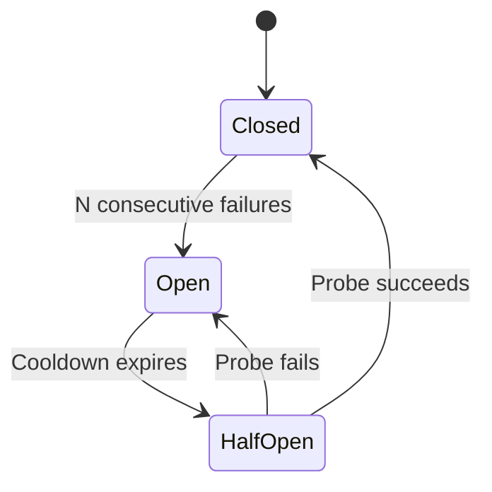

# Error Handling and Retry Patterns

> [!quote]
> "Failures are a given in distributed systems. The question is never whether something will fail, but whether your system can recover gracefully when it does."
>
> — **Martin Kleppmann**, *Designing Data-Intensive Applications* (2017)

Every tool in the vault handles errors in its own way — bash `trap`, Airflow retries, SQL Server deadlock retry, API backoff. This page provides the **universal theory** that cuts across all of them: error classification, retry strategies, failure propagation, circuit breakers, and dead letter queues. Every implementation detail links to the specific page and heading where it already exists.

---

## Error Classification — The Most Important Distinction

Every error falls into one of five categories. The classification determines the response — retrying a permanent error wastes time; failing on a transient error kills a pipeline that would have succeeded 30 seconds later.

### Error Category Decision Matrix

> [!info] Classify First, Then Respond
>
> Before writing retry logic, classify the error. The category drives EVERYTHING below.

| Category | Definition | Examples | Correct Response |
|----------|------------|----------|------------------|
| **Transient** | Temporary failure that resolves on its own | Network timeout, API rate limit (429), deadlock victim (1205), BigQuery 503 | Retry with backoff |
| **Permanent** | Will never succeed regardless of retries | Invalid SQL syntax, schema mismatch, auth failure (401/403), 404 | Fail immediately, alert, fix code |
| **Data-dependent** | Fails because of the data, not the system | NULL in NOT NULL column, duplicate key, constraint violation, Pydantic validation error | Quarantine the bad row, continue good rows |
| **Resource exhaustion** | System ran out of something | Disk full, OOM, BigQuery quota exceeded, Airflow pool slots exhausted | Back off, wait, or scale up |
| **Partial failure** | Some rows succeeded, others failed | bcp with `MAXERRORS`, BigQuery streaming insert per-row errors, Pub/Sub batch with mixed ack/nack | Process successes, quarantine failures |

> [!danger] The Cardinal Sin
>
> Retrying a permanent error in a loop. A `pyodbc.ProgrammingError` (bad SQL syntax) will never succeed no matter how many times you retry it. Catch it, log it, fail the task, and fix the code.

> [!success] Classify errors before retrying — only retry transient errors
>
> Define a `TRANSIENT_ERRORS` tuple containing only retryable exception types (`pyodbc.OperationalError`, HTTP 429/503). Catch all others with a separate handler that logs and re-raises immediately without retry. This keeps retry logic fast for recoverable failures and loud for permanent ones.

---

## Retry Strategies

### Immediate Retry — almost never correct

No delay between attempts. Only appropriate for extremely fast transient failures (TCP connection reset mid-handshake).

> [!warning] Hammers the Target
>
> If the failure persists for even a few seconds, immediate retry sends hundreds of requests per second to an already-struggling service. Almost never the right choice for data pipelines.

> [!success] Use exponential backoff with jitter as the default retry strategy
>
> Replace immediate retry with `delay = min(base * 2^attempt + random(0, jitter), max_delay)`. Even a 1-second base delay with 3 attempts costs at most 7 seconds of wall clock time while giving the failing service meaningful recovery time.

### Fixed-Interval Retry — predictable recovery time

Retry every N seconds, up to M attempts. Use when the recovery time is predictable (service restart takes ~30 seconds, DNS propagation takes ~60 seconds).

- Airflow implements this via `retry_delay`: [airflow-core-concepts > Complete DAG with All Common Parameters](https://alp78.github.io/elysium/12-Orchestration/Airflow/airflow-core-concepts#complete-dag-with-all-common-parameters)
- SQL Server Agent job retry: [sql-server-agent-jobs](https://alp78.github.io/elysium/04-SQL-Server/01-Server-Operations/sql-server-agent-jobs)

### Exponential Backoff with Jitter — the default choice

> [!tip] The Default Retry Strategy
>
> When in doubt, use exponential backoff with jitter. It handles rate limits, overloaded services, and shared resources without coordination between clients.

**Formula:** `delay = min(base * 2^attempt + random(0, jitter), max_delay)`

- Wait 1s, 2s, 4s, 8s, 16s... capped at `max_delay`
- **Jitter is critical:** without it, all retrying clients hammer the service at the same moment after each backoff period (thundering herd)

#### Python — exponential backoff with jitter

```python
import random, time

def retry_with_backoff(fn, max_attempts=3, base=1.0,
                       max_delay=30.0, jitter=1.0):
    """Retry a function with exponential backoff + jitter."""
    for attempt in range(max_attempts):
        try:
            return fn()
        except TRANSIENT_ERRORS as e:
            if attempt == max_attempts - 1:
                raise
            delay = min(base * (2 ** attempt)
                        + random.uniform(0, jitter), max_delay)
            log.warning(f"Retry {attempt+1}/{max_attempts}, "
                        f"waiting {delay:.1f}s: {e}")
            time.sleep(delay)
```

> [!info] TRANSIENT_ERRORS Definition
>
> Define the set of retryable exceptions explicitly. For pyodbc: `pyodbc.OperationalError`, `pyodbc.InterfaceError`. For HTTP: status codes 429, 500, 502, 503, 504. For SQL Server deadlocks: error number 1205.

Stack-specific implementations:
- REST API backoff: [rest-api-design-and-consumption > Exponential Backoff with Jitter](https://alp78.github.io/elysium/14-Data-Architecture/APIs-and-Protocols/rest-api-design-and-consumption#exponential-backoff-with-jitter)
- SQL Server deadlock retry (C#): [deadlock-detection-and-prevention > C# Dapper ExecuteWithRetry — centralized deadlock retry helper](https://alp78.github.io/elysium/04-SQL-Server/03-Query-Writing-and-Optimization/deadlock-detection-and-prevention#c-dapper-executewithretry--centralized-deadlock-retry-helper)
- Python tenacity decorator: [gcp-pipeline-health-and-sla > Python — custom exponential backoff decorator](https://alp78.github.io/elysium/13-Observability/GCP-Native/gcp-pipeline-health-and-sla#python--custom-exponential-backoff-decorator)
- Airflow `retry_exponential_backoff=True`: [airflow-dag-patterns > Key Idempotency Settings](https://alp78.github.io/elysium/12-Orchestration/Airflow/airflow-dag-patterns#key-idempotency-settings)

### Circuit Breaker — stop retrying a dead service

> [!info] Circuit Breaker Pattern
>
> After N consecutive failures, STOP retrying for a cooldown period. Then send one probe request. If it succeeds, resume normal operation. If it fails, extend the cooldown. This prevents a failed dependency from consuming all your retry budget.



- **CLOSED** — normal operation, requests pass through. Failures are counted.
- **OPEN** — all requests immediately fail without calling the downstream service. A timer runs.
- **HALF-OPEN** — one probe request is allowed. If it succeeds, move to CLOSED. If it fails, back to OPEN with extended cooldown.

> [!info] Circuit Breaker States
>
> - **Closed** (normal): requests pass through. Failures are counted.
> - **Open** (tripped): requests fail immediately without calling the
>   dependency. A timeout starts.
> - **Half-Open** (testing): after the timeout, one request is allowed
>   through. If it succeeds → Closed. If it fails → Open again.
>
> In data pipelines, the circuit breaker protects against: a source API
> that is down (stop retrying after N failures), a database that is
> overloaded (stop writing, let it recover), or a downstream consumer
> that is rejecting data (stop publishing until the consumer is healthy).

#### Python — simple circuit breaker

```python
class CircuitBreaker:
    """Dependency-free circuit breaker."""
    def __init__(self, threshold=5, cooldown=60):
        self.threshold = threshold
        self.cooldown = cooldown
        self.failures = 0
        self.last_failure = 0.0
        self.state = "CLOSED"

    def call(self, fn):
        if self.state == "OPEN":
            if time.time() - self.last_failure < self.cooldown:
                raise RuntimeError("Circuit OPEN — skipping call")
            self.state = "HALF_OPEN"
        try:
            result = fn()
            self.failures = 0
            self.state = "CLOSED"
            return result
        except Exception as e:
            self.failures += 1
            self.last_failure = time.time()
            if self.failures >= self.threshold:
                self.state = "OPEN"
            raise
```

- REST API circuit breaker: [rest-api-design-and-consumption > Circuit Breaker Pattern](https://alp78.github.io/elysium/14-Data-Architecture/APIs-and-Protocols/rest-api-design-and-consumption#circuit-breaker-pattern)
- When to implement: any pipeline step that calls an external API or a service with outages

### Dead Letter Queue (DLQ) — don't drop, don't retry forever

> [!info] DLQ Pattern
>
> After max retries, move the failed item to a DLQ for later inspection and reprocessing. The DLQ preserves the failed data with error context.

| Implementation | DLQ | Vault Reference |
|----------------|-----|-----------------|
| Pub/Sub | Dead letter topic | [pubsub-topics-and-subscriptions > Pub/Sub Dead Letter Topics](https://alp78.github.io/elysium/06-GCP/Serverless/pubsub-topics-and-subscriptions#pubsub-dead-letter-topics) |
| SQL Server pipeline | `quarantine` table (rejected rows) | [sql-server-pipeline-anti-patterns > Loading Directly to Production — no staging, no validation](https://alp78.github.io/elysium/04-SQL-Server/04-Applied-SQL-Server-for-Data-Pipelines/sql-server-pipeline-anti-patterns#loading-directly-to-production--no-staging-no-validation) |
| GCS pipeline | `gs://bucket/failed/` prefix | [gcs-object-operations](https://alp78.github.io/elysium/06-GCP/Storage/gcs-object-operations) |
| REST API | DLQ table or file | [rest-api-design-and-consumption > Dead Letter Queue](https://alp78.github.io/elysium/14-Data-Architecture/APIs-and-Protocols/rest-api-design-and-consumption#dead-letter-queue) |

> [!warning] DLQ Needs Monitoring
>
> A DLQ is NOT a garbage dump. If the DLQ is growing, something is systematically wrong. Alert when `DLQ_count > 0` (warning) and when DLQ is growing steadily (critical). See [gcp-pipeline-health-and-sla > Alerting Runbook for Data Engineers](https://alp78.github.io/elysium/13-Observability/GCP-Native/gcp-pipeline-health-and-sla#alerting-runbook-for-data-engineers).

> [!success] Configure a Cloud Monitoring alert on DLQ message count
>
> Create a metric alert that fires at warning when `DLQ_count > 0` and at critical when the DLQ message count has grown over consecutive 5-minute windows. A DLQ that grows indicates a systematic data quality problem requiring human investigation, not more retries.

---

## Failure Propagation in Multi-Step Pipelines

What happens when step 3 of 5 fails? This is the hardest problem in pipeline reliability.

### Propagation Strategy Comparison

> [!info] Choose Based on Task Dependencies
>
> The propagation strategy depends on whether downstream tasks need the failed task's output.

| Strategy | Behavior | When to Use |
|----------|----------|-------------|
| **Fail-fast** | Step 3 fails → steps 4-5 never run → DAG marked failed | Default. Steps 4-5 depend on step 3's output |
| **Continue on failure** | Step 3 fails → steps 4-5 still run | Steps are independent (loading different tables) |
| **Compensating action** | Step 3 fails → cleanup step undoes steps 1-2 | Financial transactions, cross-system consistency |
| **Partial success** | Step 3 processes 9,500/10,000 rows → quarantine 500 → continue | High-volume ingestion with expected bad rows |

Airflow implements this via trigger rules:
- `all_success` (default) = fail-fast: [airflow-dag-patterns > all_success (default): Run only if ALL upstream tasks succeeded](https://alp78.github.io/elysium/12-Orchestration/Airflow/airflow-dag-patterns#allsuccess-default-run-only-if-all-upstream-tasks-succeeded)
- `all_done` = continue on failure: [airflow-dag-patterns > all_done: Run when all upstream tasks are done, regardless of state](https://alp78.github.io/elysium/12-Orchestration/Airflow/airflow-dag-patterns#alldone-run-when-all-upstream-tasks-are-done-regardless-of-state)
- `one_failed` = compensating action branch: [airflow-dag-patterns > one_failed: Run if at least one upstream task failed (e.g., partial failure alert)](https://alp78.github.io/elysium/12-Orchestration/Airflow/airflow-dag-patterns#onefailed-run-if-at-least-one-upstream-task-failed-eg-partial-failure-alert)
- `none_failed_min_one_success` = safe downstream: [airflow-dag-patterns > none_failed_min_one_success: Run if no tasks failed AND at least one succeeded](https://alp78.github.io/elysium/12-Orchestration/Airflow/airflow-dag-patterns#nonefailedminonesuccess-run-if-no-tasks-failed-and-at-least-one-succeeded)

For SQL Server, idempotency ensures that a retry after partial failure doesn't corrupt data: [idempotent-pipeline-design > Why Idempotent Pipeline Design Matters](https://alp78.github.io/elysium/14-Data-Architecture/Pipeline-Patterns/idempotent-pipeline-design#why-idempotent-pipeline-design-matters).

---

## Error Handling by Tool

### Tool-Specific Error Reference

> [!info]- Error Mechanisms per Tool
>
> Each tool handles errors differently. This table maps tool → error mechanism → retry mechanism → vault reference.

| Tool | Error Mechanism | Retry Mechanism | Vault Reference |
|------|-----------------|-----------------|-----------------|
| Bash scripts | `set -euo pipefail`, `trap EXIT` | Manual (loop + sleep) | [defensive-scripting > set -e — exit immediately on error](https://alp78.github.io/elysium/01-Shell/Scripting/defensive-scripting#set--e--exit-immediately-on-error) |
| Airflow | Task state FAILED, `on_failure_callback` | `retries`, `retry_delay`, `retry_exponential_backoff` | [airflow-core-concepts > Complete DAG with All Common Parameters](https://alp78.github.io/elysium/12-Orchestration/Airflow/airflow-core-concepts#complete-dag-with-all-common-parameters) |
| SQL Server (deadlocks) | Error 1205 in TRY/CATCH | WAITFOR + retry loop | [deadlock-detection-and-prevention > C# Dapper ExecuteWithRetry — centralized deadlock retry helper](https://alp78.github.io/elysium/04-SQL-Server/03-Query-Writing-and-Optimization/deadlock-detection-and-prevention#c-dapper-executewithretry--centralized-deadlock-retry-helper) |
| SQL Server (MERGE) | XACT_ABORT, TRY/CATCH | Transaction rollback + retry | [merge-and-upsert > TRY/CATCH with XACT_ABORT — The Safe Pattern](https://alp78.github.io/elysium/04-SQL-Server/03-Query-Writing-and-Optimization/merge-and-upsert#trycatch-with-xactabort--the-safe-pattern) |
| SQL Server (races) | Constraint violations, phantom inserts | Serialization, UPDLOCK | [race-conditions > Strategy 2: Atomic Operations (Combine Read + Write)](https://alp78.github.io/elysium/04-SQL-Server/03-Query-Writing-and-Optimization/race-conditions#strategy-2-atomic-operations-combine-read--write) |
| pyodbc | `pyodbc.OperationalError` | Application-level backoff | [sql-server-loading-patterns > fast_executemany Gotchas](https://alp78.github.io/elysium/04-SQL-Server/04-Applied-SQL-Server-for-Data-Pipelines/sql-server-loading-patterns#fastexecutemany-gotchas) |
| BigQuery | Job FAILED, 503, quota exceeded | Built-in client library retry | [bigquery-problems > DML Quota Exceeded (20 Concurrent Mutations)](https://alp78.github.io/elysium/06-GCP/BigQuery/bigquery-problems#dml-quota-exceeded-20-concurrent-mutations) |
| REST APIs | HTTP 429/503 | Backoff with Retry-After header | [rest-api-design-and-consumption > Rate Limiting and Backoff](https://alp78.github.io/elysium/14-Data-Architecture/APIs-and-Protocols/rest-api-design-and-consumption#rate-limiting-and-backoff) |
| Pub/Sub | nack + redelivery | Automatic redelivery with DLQ | [pubsub-topics-and-subscriptions > Pub/Sub Dead Letter Topics](https://alp78.github.io/elysium/06-GCP/Serverless/pubsub-topics-and-subscriptions#pubsub-dead-letter-topics) |
| Cloud Run | Container exit code != 0 | Task retry policy (configurable) | [cloud-run-jobs-vs-services > Cloud Run Jobs vs Services Comparison](https://alp78.github.io/elysium/06-GCP/Serverless/cloud-run-jobs-vs-services#cloud-run-jobs-vs-services-comparison) |

---

## The Retry Budget Concept

### Total Retry Budget — SLA-Driven Limits

> [!info] Retry Budget Formula
>
> A pipeline should have a **total** retry budget — not unlimited retries on every step. The budget constrains total acceptable delay before alerting a human.

**Formula:** `total_retries x retry_delay < SLA_window / 2`

| Pipeline | SLA | Tasks | Retries/Task | Retry Delay | Worst-Case Delay | Within Budget? |
|----------|-----|-------|-------------|-------------|------------------|----------------|
| Daily medallion | 4 hours | 10 | 3 | 5 min | 150 min (2.5h) | Yes (< 2h) |
| Hourly pulse | 30 min | 3 | 2 | 2 min | 12 min | Yes (< 15 min) |
| Real-time CDC | 5 min | 1 | 3 | 30 sec | 90 sec | Yes (< 2.5 min) |

> [!warning] Worst-Case Matters
>
> A DAG with 10 tasks, each with 3 retries at 5-minute delay, has a worst case of 150 minutes of wall clock time before final failure. If your SLA is "data fresh within 4 hours" and the pipeline normally takes 30 minutes, the retry budget is 3.5 hours — but 2.5 hours of retries leaves only 1 hour of slack. Set `retries=2` or `retry_delay=timedelta(minutes=3)` to stay within budget.

> [!success] Size retries to the SLA: total retry time must be less than half the SLA window
>
> Apply the formula `total_retries × retry_delay < SLA_window / 2`. For a 4-hour SLA: maximum retry budget is 2 hours. With 10 tasks, each task gets at most 12 minutes of retries total — `retries=2` at `retry_delay=6 minutes`, or `retries=3` at `retry_delay=4 minutes`.

For SLA definitions and tracking, see [gcp-pipeline-health-and-sla > Defining Pipeline SLAs](https://alp78.github.io/elysium/13-Observability/GCP-Native/gcp-pipeline-health-and-sla#defining-pipeline-slas).

---

## Alerting Thresholds — When Retry Becomes Incident

### Alert Escalation Framework

> [!info] Progressive Alert Escalation
>
> Not every retry needs human attention. Reserve alerts for exhausted retries and systematic failures.

| Situation | Alert Level | Action |
|-----------|-------------|--------|
| First retry (transient failure) | None (logged) | Automatic recovery expected |
| Second retry | None (logged) | Still within normal bounds |
| Third/final retry | **Warning** | On-call notified — may need investigation |
| All retries exhausted → task failed | **Critical** | On-call paged — manual intervention required |
| DLQ message count > 0 | **Warning** | Bad data arriving — investigate source |
| DLQ growing steadily | **Critical** | Systematic data quality problem |
| Same task failing daily | **Escalation** | Not transient — code or data fix needed |

- Pipeline alerting implementation: [gcp-pipeline-health-and-sla > Alert Triage Decision Tree](https://alp78.github.io/elysium/13-Observability/GCP-Native/gcp-pipeline-health-and-sla#alert-triage-decision-tree)
- Alert response procedures: [gcp-pipeline-health-and-sla > Common Alert Response Procedures](https://alp78.github.io/elysium/13-Observability/GCP-Native/gcp-pipeline-health-and-sla#common-alert-response-procedures)
- Airflow SLA monitoring: [airflow-dag-patterns > SLA (Service Level Agreement)](https://alp78.github.io/elysium/12-Orchestration/Airflow/airflow-dag-patterns#sla-service-level-agreement)
- Airflow callbacks: [airflow-dag-patterns > Callbacks](https://alp78.github.io/elysium/12-Orchestration/Airflow/airflow-dag-patterns#callbacks)

> [!danger] Alert Fatigue Kills Reliability
>
> Alerting on every first retry creates hundreds of noise alerts per day. Engineers stop reading them. When a real incident happens, the alert is buried. Reserve critical alerts for exhausted retries and growing DLQs only.

> [!success] Alert only on final failure and growing DLQs — log everything else
>
> Set Airflow's `on_failure_callback` (not `on_retry_callback`) to trigger the PagerDuty notification. First and second retries write to structured logs only. This keeps the alert signal-to-noise ratio high and ensures on-call engineers respond to every alert they receive.

---

## Anti-Patterns

### Retry and Error Handling Mistakes

> [!danger] Each One Causes Incidents
>
> Every anti-pattern below has been seen in production.

> [!success] Adopt the five-rule error handling baseline for every pipeline task
>
> (1) Classify errors before retrying. (2) Use exponential backoff with jitter. (3) Ensure every retried operation is idempotent. (4) Always log errors — never swallow them silently. (5) Alert on exhausted retries only, not on first retry. These five rules eliminate the anti-patterns below.

### Retrying permanent errors — infinite waste

A `pyodbc.ProgrammingError` (bad SQL syntax) or a 404 (resource not found) will never succeed. Retrying wastes compute, fills logs, and delays the alert that tells someone to fix the code.

**The fix:** classify errors before retrying. Only retry errors in the transient category. See [sql-server-pipeline-anti-patterns > No Retry Logic for Deadlocks — pipeline fails on transient errors](https://alp78.github.io/elysium/04-SQL-Server/04-Applied-SQL-Server-for-Data-Pipelines/sql-server-pipeline-anti-patterns#no-retry-logic-for-deadlocks--pipeline-fails-on-transient-errors) for the correct deadlock retry pattern.

### No retry at all — fragile pipeline

A pipeline that dies on the first transient network timeout is the most fragile design possible. A 2-second network blip at 3am kills the entire DAG.

**The fix:** add `retries=3, retry_delay=timedelta(minutes=5)` to every Airflow task. See [airflow-core-concepts > Complete DAG with All Common Parameters](https://alp78.github.io/elysium/12-Orchestration/Airflow/airflow-core-concepts#complete-dag-with-all-common-parameters).

### Retrying without backoff — thundering herd

Retrying a rate-limited API (HTTP 429) immediately sends another request that will also be rate-limited. All clients retry at the same interval, creating synchronized bursts.

**The fix:** exponential backoff with jitter. See the Python implementation above.

### Retrying without idempotency — duplicate data

If a load inserts 5,000 rows, fails at row 5,001, and retries from the beginning, you get 5,000 duplicates. Every retried operation must be idempotent.

**The fix:** use MERGE upsert, DELETE-INSERT, or UNIQUE constraints. See [idempotent-pipeline-design](https://alp78.github.io/elysium/14-Data-Architecture/Pipeline-Patterns/idempotent-pipeline-design).

### Swallowing errors silently — invisible corruption

```python
# THE WORST ANTI-PATTERN IN ALL OF PROGRAMMING
try:
    load_data()
except:
    pass   # errors disappear — data silently missing
```

**The fix:** always log the error. At minimum: `except Exception as e: log.error(f"Load failed: {e}")`. Even better: quarantine and alert.

### Alerting on every retry — alert fatigue

If every first retry sends a PagerDuty alert, engineers receive 50 noise alerts per day and stop responding. When retries are genuinely exhausted, nobody notices.

**The fix:** alert only on exhausted retries (final failure) and growing DLQs. See the alert escalation table above.

### No DLQ for messaging — zombie messages

Failed Pub/Sub messages that are nack'd cycle forever in the subscription, consuming resources and inflating delivery counts. Without a dead letter topic, they never stop.

**The fix:** configure a dead letter topic with max delivery attempts. See [pubsub-topics-and-subscriptions > Configure Dead Letter Topics in Production](https://alp78.github.io/elysium/06-GCP/Serverless/pubsub-topics-and-subscriptions#configure-dead-letter-topics-in-production).

### Generic error messages — useless alerts

"Pipeline failed" tells you nothing. WHICH step? WHAT error? WHICH row? Without context, debugging starts from zero.

**The fix:** structured logging with `stage`, `batch_id`, `error_type`, `error_message`, and `row_context`. See [defensive-scripting > trap EXIT — guaranteed cleanup on script exit, error, or signal](https://alp78.github.io/elysium/01-Shell/Scripting/defensive-scripting#trap-exit--guaranteed-cleanup-on-script-exit-error-or-signal) for bash and [gcp-pipeline-health-and-sla > Alerting Runbook for Data Engineers](https://alp78.github.io/elysium/13-Observability/GCP-Native/gcp-pipeline-health-and-sla#alerting-runbook-for-data-engineers) for pipeline alerting.

