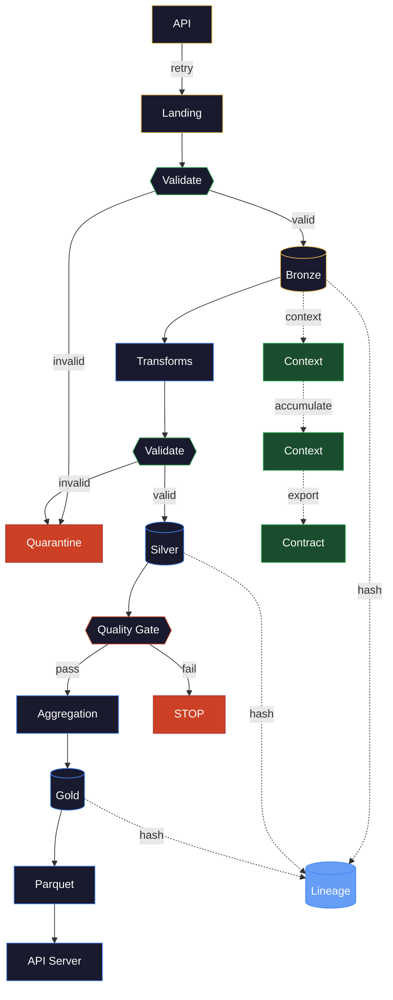

# Functional Pipeline Architecture

> [!quote]
> "I'm not a great programmer; I'm just a good programmer with great habits."
> — **Kent Beck**

This is a composite architecture combining five named principles from different engineering disciplines. No single established name exists for the combination — each principle has deep literature independently. Their power comes from using them together.

Two reference implementations exist:
- **Python:** [25_py_functional_pipeline](https://alp78.github.io/elysium/02-Programming-Languages/Python/25_py_functional_pipeline) — Pydantic + Polars + tenacity + pyodbc
- **C#:** [25_cs_functional_pipeline](https://alp78.github.io/elysium/02-Programming-Languages/CSharp/25_cs_functional_pipeline) — FluentValidation + LINQ + Polly + Dapper

> [!info] Theory here, implementation there
>
> This page explains WHAT each principle is and WHY it matters. The implementation
> details (code, validation rules, SQL DDL) live in the paired notebooks. Every section
> below links to the exact heading where the principle is built.

This architecture sits on TOP of [medallion-architecture](https://alp78.github.io/elysium/14-Data-Architecture/Pipeline-Patterns/medallion-architecture) (which defines the data layering) and [idempotent-pipeline-design](https://alp78.github.io/elysium/14-Data-Architecture/Pipeline-Patterns/idempotent-pipeline-design) (which defines safe re-runs). This page defines how the pipeline CODE is structured.

---

## The Complete Architecture



> [!abstract] Diagram legend
>
> **Amber border** — Imperative Shell (I/O, network, database)
> **Blue border** — Functional Core (pure transforms, no side effects)
> **Green border** — Contract Enforcement (typed validation at boundaries)
> **Red border** — Quality Gates and failure paths (quarantine, stop)
> **Blue fill** — Lineage tracking (batch_id, SHA-256 hash at every stage)
> **Green fill** — Context propagation (warnings accumulate bronze → silver → gold → contract)

---

## Functional Core, Imperative Shell

**Origin:** Gary Bernhardt, "Boundaries" talk (2012). Originally a software architecture pattern for isolating side effects from business logic.

**The principle:** Transforms are pure functions — given the same input DataFrame, they produce the same output DataFrame, every time. No database calls, no HTTP requests, no file I/O, no logging inside the transform. Everything with side effects (API calls, SQL writes, file saves, retry logic) lives in the "imperative shell" that calls the pure functions and handles I/O around them.

**Why it matters:** Pure functions are trivially testable (no mocking needed), trivially parallelizable (no shared state), and trivially debuggable (reproduce the bug by passing the same input). If a transform produces wrong output, the bug is in the function — not in a network timeout, a database lock, or a stale credential.

> [!tip] The purity test
>
> Can you call this function in a unit test with a hardcoded DataFrame and assert
> the output WITHOUT setting up a database, network, or file system? If yes —
> functional core. If no — imperative shell. The notebooks enforce this boundary:
> transforms take DataFrames and return DataFrames. Everything else is infrastructure.

**Functional core (pure transforms):**

| What | Python | C# |
|---|---|---|
| Daily returns | [25_py_functional_pipeline > Polars — compute daily returns with pct_change().over()](https://alp78.github.io/elysium/02-Programming-Languages/Python/25_py_functional_pipeline#polars--compute-daily-returns-with-pctchangeover) | [25_cs_functional_pipeline > LINQ — compute daily returns with GroupBy().SelectMany()](https://alp78.github.io/elysium/02-Programming-Languages/CSharp/25_cs_functional_pipeline#linq--compute-daily-returns-with-groupbyselectmany) |
| Intraday range | [25_py_functional_pipeline > Polars — compute intraday range with with_columns()](https://alp78.github.io/elysium/02-Programming-Languages/Python/25_py_functional_pipeline#polars--compute-intraday-range-with-withcolumns) | [25_cs_functional_pipeline > LINQ — compute intraday range with Select()](https://alp78.github.io/elysium/02-Programming-Languages/CSharp/25_cs_functional_pipeline#linq--compute-intraday-range-with-select) |
| Moving average | [25_py_functional_pipeline > Polars — compute 20-day moving average with rolling_mean().over()](https://alp78.github.io/elysium/02-Programming-Languages/Python/25_py_functional_pipeline#polars--compute-20-day-moving-average-with-rollingmeanover) | [25_cs_functional_pipeline > LINQ — compute 20-day SMA with Skip().Take().Average()](https://alp78.github.io/elysium/02-Programming-Languages/CSharp/25_cs_functional_pipeline#linq--compute-20-day-sma-with-skiptakeaverage) |
| Gold summary | [25_py_functional_pipeline > Polars — build daily cross-sectional summary with group_by().agg()](https://alp78.github.io/elysium/02-Programming-Languages/Python/25_py_functional_pipeline#polars--build-daily-cross-sectional-summary-with-groupbyagg) | [25_cs_functional_pipeline > LINQ — build Gold daily summary with GroupBy().Select()](https://alp78.github.io/elysium/02-Programming-Languages/CSharp/25_cs_functional_pipeline#linq--build-gold-daily-summary-with-groupbyselect) |
| Gold profiles | [25_py_functional_pipeline > Polars — build per-symbol profile with cum_max() drawdown](https://alp78.github.io/elysium/02-Programming-Languages/Python/25_py_functional_pipeline#polars--build-per-symbol-profile-with-cummax-drawdown) | [25_cs_functional_pipeline > LINQ — define standard deviation extension with Sum().Sqrt()](https://alp78.github.io/elysium/02-Programming-Languages/CSharp/25_cs_functional_pipeline#linq--define-standard-deviation-extension-with-sumsqrt) |

**Imperative shell (I/O boundaries):**

| What | Python | C# |
|---|---|---|
| Configuration | [25_py_functional_pipeline > Python — define pipeline paths, SQL connection, and stock universe](https://alp78.github.io/elysium/02-Programming-Languages/Python/25_py_functional_pipeline#python--define-pipeline-paths-sql-connection-and-stock-universe) | [25_cs_functional_pipeline > Constants — define pipeline paths, SQL connection, and stock universe](https://alp78.github.io/elysium/02-Programming-Languages/CSharp/25_cs_functional_pipeline#constants--define-pipeline-paths-sql-connection-and-stock-universe) |
| API fetch | [25_py_functional_pipeline > yfinance — fetch OHLCV to JSON landing zone with Ticker.history()](https://alp78.github.io/elysium/02-Programming-Languages/Python/25_py_functional_pipeline#yfinance--fetch-ohlcv-to-json-landing-zone-with-tickerhistory) | [25_cs_functional_pipeline > HttpClient — fetch OHLCV from Yahoo Finance with Polly ExecuteAsync()](https://alp78.github.io/elysium/02-Programming-Languages/CSharp/25_cs_functional_pipeline#httpclient--fetch-ohlcv-from-yahoo-finance-with-polly-executeasync) |
| DB persistence | [25_py_functional_pipeline > SQLAlchemy — define DataFrame write helper with to_sql()](https://alp78.github.io/elysium/02-Programming-Languages/Python/25_py_functional_pipeline#sqlalchemy--define-dataframe-write-helper-with-tosql) | [25_cs_functional_pipeline > Dapper — define Bronze MERGE upsert with Execute()](https://alp78.github.io/elysium/02-Programming-Languages/CSharp/25_cs_functional_pipeline#dapper--define-bronze-merge-upsert-with-execute) |

> [!danger] Anti-pattern: transforms that call the database
>
> A transform function that reads from SQL Server mid-computation, writes intermediate
> results to a file, or catches network errors — this is the shell leaking into the
> core. The transform becomes untestable without a live database and unpredictable
> under network failures. Keep I/O at the boundaries.

---

## Contract-First Validation

**Origin:** Data Contracts (Andrew Jones, 2022), Schema-on-Write (traditional RDBMS philosophy), Design by Contract (Bertrand Meyer, 1986).

**The principle:** Every stage boundary has a typed contract (Pydantic model / C# record + FluentValidation). Data that doesn't conform is rejected BEFORE it crosses the boundary. The contract is code — version-controlled, unit-testable, and enforced at runtime.

**Why it matters:** Without contracts, bad data enters the pipeline silently. A renamed API field loads NULLs into bronze. A negative volume passes through to silver. A NaN daily return poisons the gold aggregation. By the time someone notices, the damage is three layers deep. Contracts catch bad data at ingestion — one layer, one fix.

**Contract definitions:**

| Layer | Python | C# |
|---|---|---|
| Bronze | [25_py_functional_pipeline > Pydantic — define Bronze validation model with BaseModel and Field()](https://alp78.github.io/elysium/02-Programming-Languages/Python/25_py_functional_pipeline#pydantic--define-bronze-validation-model-with-basemodel-and-field) | [25_cs_functional_pipeline > record — define Bronze OHLCV data model with Data Annotations](https://alp78.github.io/elysium/02-Programming-Languages/CSharp/25_cs_functional_pipeline#record--define-bronze-ohlcv-data-model-with-data-annotations) |
| Silver | [25_py_functional_pipeline > Pydantic — define Silver validation model with BaseModel and Field()](https://alp78.github.io/elysium/02-Programming-Languages/Python/25_py_functional_pipeline#pydantic--define-silver-validation-model-with-basemodel-and-field) | [25_cs_functional_pipeline > record — define Silver OHLCV data model with enrichment fields](https://alp78.github.io/elysium/02-Programming-Languages/CSharp/25_cs_functional_pipeline#record--define-silver-ohlcv-data-model-with-enrichment-fields) |
| Gold | [25_py_functional_pipeline > Pydantic — define Gold validation models with BaseModel and Field()](https://alp78.github.io/elysium/02-Programming-Languages/Python/25_py_functional_pipeline#pydantic--define-gold-validation-models-with-basemodel-and-field) | [25_cs_functional_pipeline > record — define Gold daily summary data model](https://alp78.github.io/elysium/02-Programming-Languages/CSharp/25_cs_functional_pipeline#record--define-gold-daily-summary-data-model) |
| Validation rules | [25_py_functional_pipeline > Pydantic — validate Bronze rows with BaseModel() row-level check](https://alp78.github.io/elysium/02-Programming-Languages/Python/25_py_functional_pipeline#pydantic--validate-bronze-rows-with-basemodel-row-level-check) | [25_cs_functional_pipeline > FluentValidation — define Bronze validation rules with AbstractValidator\<T>](https://alp78.github.io/elysium/02-Programming-Languages/CSharp/25_cs_functional_pipeline#fluentvalidation--define-bronze-validation-rules-with-abstractvalidatort) |

**Language comparison:**

| Aspect | Python | C# |
|---|---|---|
| Contract definition | Pydantic `BaseModel` with `Field()` | `record` with Data Annotations |
| Complex rules | `@model_validator`, `@field_validator` | FluentValidation `AbstractValidator<T>` |
| Strictness mode | `ConfigDict(strict=True)` — no coercion | Compile-time type safety + runtime validation |
| Error output | `ValidationError` with field-level messages | `ValidationResult` with `Errors` collection |

See [data-contracts](https://alp78.github.io/elysium/14-Data-Architecture/Pipeline-Patterns/data-contracts) for the broader contract theory and [context-and-metadata-architecture > Schema Drift Detection](https://alp78.github.io/elysium/14-Data-Architecture/Architectures/context-and-metadata-architecture#schema-drift-detection) for schema evolution patterns.

---

## Quality Gate Pattern

**Origin:** Continuous Delivery (Jez Humble & David Farley, 2010). Originally a deployment concept — code must pass automated gates before reaching production. Applied here to data.

**The principle:** After each pipeline stage, automated assertions verify structural integrity, statistical bounds, and data freshness. If any assertion fails, the pipeline STOPS — downstream stages never see bad data. This is different from contract validation: contracts check individual rows at boundaries; quality gates check aggregate properties of the entire dataset after a stage completes.

| Check | What It Catches | Example Threshold |
|---|---|---|
| Not empty | Failed fetch, empty API response | `len(df) > 0` |
| No null keys | Schema drift, type coercion failure | `symbol`, `date` have 0 nulls |
| No duplicates | Bad MERGE, double-fetch, dedup failure | 0 duplicate `(symbol, date)` pairs |
| Value range | Outliers, data corruption, unit mismatch | `daily_return` within ±50% |
| Freshness | Stale data, broken source, timezone bug | Latest date within 5 days of today |
| Row count | Data loss, filter bug, source degradation | >= minimum expected rows |

**Quality gate implementations:**

| Check | Python | C# |
|---|---|---|
| Not empty | [25_py_functional_pipeline > Polars — assert DataFrame is not empty with len()](https://alp78.github.io/elysium/02-Programming-Languages/Python/25_py_functional_pipeline#polars--assert-dataframe-is-not-empty-with-len) | [25_cs_functional_pipeline > DataTable — define data quality assertion functions with AsEnumerable()](https://alp78.github.io/elysium/02-Programming-Languages/CSharp/25_cs_functional_pipeline#datatable--define-data-quality-assertion-functions-with-asenumerable) |
| No null keys | [25_py_functional_pipeline > Polars — assert no nulls in key columns with null_count()](https://alp78.github.io/elysium/02-Programming-Languages/Python/25_py_functional_pipeline#polars--assert-no-nulls-in-key-columns-with-nullcount) | (same file, same function) |
| No duplicates | [25_py_functional_pipeline > Polars — assert no duplicate rows with unique()](https://alp78.github.io/elysium/02-Programming-Languages/Python/25_py_functional_pipeline#polars--assert-no-duplicate-rows-with-unique) | (same file, same function) |
| Value range | [25_py_functional_pipeline > Polars — assert values within range with filter()](https://alp78.github.io/elysium/02-Programming-Languages/Python/25_py_functional_pipeline#polars--assert-values-within-range-with-filter) | (same file, same function) |
| Freshness | [25_py_functional_pipeline > Polars — assert data freshness against SLA with max()](https://alp78.github.io/elysium/02-Programming-Languages/Python/25_py_functional_pipeline#polars--assert-data-freshness-against-sla-with-max) | (same file, same function) |
| Orchestrator | [25_py_functional_pipeline > Pipeline — run all quality gate assertions with log.info()](https://alp78.github.io/elysium/02-Programming-Languages/Python/25_py_functional_pipeline#pipeline--run-all-quality-gate-assertions-with-loginfo) | [25_cs_functional_pipeline > DataTable — run Bronze data quality gate with RunQualityGate()](https://alp78.github.io/elysium/02-Programming-Languages/CSharp/25_cs_functional_pipeline#datatable--run-bronze-data-quality-gate-with-runqualitygate) |
| Exception | [25_py_functional_pipeline > Python — define custom Exception subclass for quality gate failures](https://alp78.github.io/elysium/02-Programming-Languages/Python/25_py_functional_pipeline#python--define-custom-exception-subclass-for-quality-gate-failures) | [25_cs_functional_pipeline > Exception — define data quality gate failure exception](https://alp78.github.io/elysium/02-Programming-Languages/CSharp/25_cs_functional_pipeline#exception--define-data-quality-gate-failure-exception) |

See [data-quality-framework](https://alp78.github.io/elysium/14-Data-Architecture/Pipeline-Patterns/data-quality-framework) for the quality dimension taxonomy and [data-pipeline-testing-strategy > Data quality assertions](https://alp78.github.io/elysium/14-Data-Architecture/Pipeline-Patterns/data-pipeline-testing-strategy#data-quality-assertions) for where quality gates fit in the testing pyramid.

> [!warning] Quality gates are not tests
>
> Tests run in CI before deployment — they catch CODE bugs. Quality gates run in
> production after every pipeline execution — they catch DATA bugs. You need both.
> A pipeline with perfect tests but no quality gates will silently ingest corrupt
> data from a source that changed its schema.

---

## Data Provenance and Lineage Tracking

**Origin:** W3C PROV Model (2013), Data Governance literature, blockchain-inspired tamper detection.

**The principle:** Every row carries a `batch_id` linking it to the pipeline run that created it. Every stage records a `StageLineage` object: start/end timestamps, input/output row counts, rejection counts, and a SHA-256 hash of the output. The `RunContext` captures the full execution envelope (symbols processed, date range, library versions, status). All of this is persisted alongside the data.

**Why it matters:** When a business user disputes a gold-layer number ("why did ASML's momentum score drop?"), you trace backward: gold row → `batch_id` → silver stage lineage → bronze stage lineage → landing JSON file → API call timestamp. The SHA-256 hash provides cryptographic proof that data wasn't modified between stages.

**Sample lineage query:**

```sql
SELECT stage, started_at, completed_at,
       input_rows, output_rows, rows_rejected, output_hash
FROM pipeline_lineage
WHERE batch_id = '9e43b0c5-a388-4ec8-ad76-bcde6e97d37e'
ORDER BY started_at;
```

| stage | started_at | completed_at | input_rows | output_rows | rejected | output_hash |
|---|---|---|---|---|---|---|
| bronze_ingest | 08:00:01 | 08:00:04 | 1331 | 1329 | 2 | a3f8b2... |
| silver_enrich | 08:00:04 | 08:00:06 | 1329 | 1329 | 0 | 7c1d4e... |
| gold_aggregate | 08:00:06 | 08:00:07 | 1329 | 50 | 0 | e9f2a1... |

**Lineage implementations:**

| Component | Python | C# |
|---|---|---|
| Batch ID | [25_py_functional_pipeline > uuid — generate unique batch ID with uuid4()](https://alp78.github.io/elysium/02-Programming-Languages/Python/25_py_functional_pipeline#uuid--generate-unique-batch-id-with-uuid4) | [25_cs_functional_pipeline > Guid — generate unique batch ID with Guid.NewGuid()](https://alp78.github.io/elysium/02-Programming-Languages/CSharp/25_cs_functional_pipeline#guid--generate-unique-batch-id-with-guidnewguid) |
| SHA-256 hash | [25_py_functional_pipeline > hashlib — compute deterministic DataFrame hash with sha256()](https://alp78.github.io/elysium/02-Programming-Languages/Python/25_py_functional_pipeline#hashlib--compute-deterministic-dataframe-hash-with-sha256) | [25_cs_functional_pipeline > SHA256 — compute deterministic data hash with SHA256.HashData()](https://alp78.github.io/elysium/02-Programming-Languages/CSharp/25_cs_functional_pipeline#sha256--compute-deterministic-data-hash-with-sha256hashdata) |
| Stage tracking | [25_py_functional_pipeline > Python — define stage start and end tracker with datetime.now()](https://alp78.github.io/elysium/02-Programming-Languages/Python/25_py_functional_pipeline#python--define-stage-start-and-end-tracker-with-datetimenow) | [25_cs_functional_pipeline > DateTime — define stage start and end tracker with DateTime.UtcNow](https://alp78.github.io/elysium/02-Programming-Languages/CSharp/25_cs_functional_pipeline#datetime--define-stage-start-and-end-tracker-with-datetimeutcnow) |
| Lineage models | [25_py_functional_pipeline > Pydantic — define lineage tracking models with BaseModel and Field()](https://alp78.github.io/elysium/02-Programming-Languages/Python/25_py_functional_pipeline#pydantic--define-lineage-tracking-models-with-basemodel-and-field) | [25_cs_functional_pipeline > record — define stage lineage tracking data model](https://alp78.github.io/elysium/02-Programming-Languages/CSharp/25_cs_functional_pipeline#record--define-stage-lineage-tracking-data-model) |
| Run context | [25_py_functional_pipeline > Pydantic — save run context to JSON with model_dump_json()](https://alp78.github.io/elysium/02-Programming-Languages/Python/25_py_functional_pipeline#pydantic--save-run-context-to-json-with-modeldumpjson) | [25_cs_functional_pipeline > JsonSerializer — save run context to JSON with Serialize()](https://alp78.github.io/elysium/02-Programming-Languages/CSharp/25_cs_functional_pipeline#jsonserializer--save-run-context-to-json-with-serialize) |
| Persistence | [25_py_functional_pipeline > SQL Server — define lineage persistence helper with cursor.execute()](https://alp78.github.io/elysium/02-Programming-Languages/Python/25_py_functional_pipeline#sql-server--define-lineage-persistence-helper-with-cursorexecute) | [25_cs_functional_pipeline > Dapper — define lineage persistence helper with Execute()](https://alp78.github.io/elysium/02-Programming-Languages/CSharp/25_cs_functional_pipeline#dapper--define-lineage-persistence-helper-with-execute) |

See [context-and-metadata-architecture](https://alp78.github.io/elysium/14-Data-Architecture/Architectures/context-and-metadata-architecture) for the broader provenance theory including bi-temporal modeling and context propagation patterns.

---

## Immutable Value Objects

**Origin:** Domain-Driven Design (Eric Evans, 2003), Functional Programming.

**The principle:** Pydantic models with `strict=True` and C# `record` types are immutable by default. Once created, they cannot be modified — you create a new instance with different values. This eliminates mutation bugs where a transform accidentally modifies its input. Combined with value equality (two records with identical fields are equal), immutability enables reliable change detection for SCD2 upserts and MERGE operations.

**Implementations:** The contract models from the Contract-First Validation section (above) serve double duty — they are both validation contracts AND immutable value objects. The SCD2 upsert logic relies on this:

- Python SCD2: [25_py_functional_pipeline > SQL Server — define SCD Type 2 upsert for one symbol with MERGE INTO](https://alp78.github.io/elysium/02-Programming-Languages/Python/25_py_functional_pipeline#sql-server--define-scd-type-2-upsert-for-one-symbol-with-merge-into)
- C#: [25_cs_functional_pipeline > record — define Bronze OHLCV data model with Data Annotations](https://alp78.github.io/elysium/02-Programming-Languages/CSharp/25_cs_functional_pipeline#record--define-bronze-ohlcv-data-model-with-data-annotations) (records provide built-in value equality)

> [!tip] Immutability enables change detection
>
> SCD Type 2 upserts need to compare "current vs incoming" to detect changes. With
> mutable objects, comparing two instances requires field-by-field checks that may
> miss newly added fields. With records/immutable models, value equality is built in —
> `old == new` compares every field automatically. If they differ, close the old record
> and insert the new one.

---

## The Quarantine Pattern

**The principle:** Rows that fail validation are not discarded — they're persisted to a quarantine table with the batch_id, stage, raw data, and full error message. This enables investigation (why did these rows fail?), replay (fix the source and re-ingest), and metrics (what percentage of rows fail per source? is it getting worse?).

**Implementations:**

| Component | Python | C# |
|---|---|---|
| Quarantine table DDL | [25_py_functional_pipeline > SQL Server — create quarantine table for rejected rows with cursor.execute()](https://alp78.github.io/elysium/02-Programming-Languages/Python/25_py_functional_pipeline#sql-server--create-quarantine-table-for-rejected-rows-with-cursorexecute) | (same DDL) |
| Quarantine persistence | [25_py_functional_pipeline > SQL Server — define quarantine persistence helper with cursor.execute()](https://alp78.github.io/elysium/02-Programming-Languages/Python/25_py_functional_pipeline#sql-server--define-quarantine-persistence-helper-with-cursorexecute) | [25_cs_functional_pipeline > Dapper — define quarantine persistence helper with Execute()](https://alp78.github.io/elysium/02-Programming-Languages/CSharp/25_cs_functional_pipeline#dapper--define-quarantine-persistence-helper-with-execute) |
| Review quarantined rows | [25_py_functional_pipeline > Polars — review quarantined rows with read_database()](https://alp78.github.io/elysium/02-Programming-Languages/Python/25_py_functional_pipeline#polars--review-quarantined-rows-with-readdatabase) | [25_cs_functional_pipeline > Dapper — review quarantined rows with QueryToTable()](https://alp78.github.io/elysium/02-Programming-Languages/CSharp/25_cs_functional_pipeline#dapper--review-quarantined-rows-with-querytotable) |

See [error-handling-and-retry-patterns](https://alp78.github.io/elysium/14-Data-Architecture/Pipeline-Patterns/error-handling-and-retry-patterns) for broader error handling theory and [data-quality-framework > Data Quality Quarantine Pattern](https://alp78.github.io/elysium/14-Data-Architecture/Pipeline-Patterns/data-quality-framework#data-quality-quarantine-pattern) for the quarantine pattern in the quality framework.

> [!danger] Never silently drop bad rows
>
> `if not valid: continue` is the most dangerous line in a data pipeline. The row
> disappears. Nobody knows it existed. The row count drops by one. Weeks later,
> someone asks why a symbol is missing from the gold report. Always quarantine —
> the 5 lines of code to persist rejected rows save hours of investigation.

---

## Two Dimensions of Data Trustworthiness

The five principles above — functional core, contract validation, quality gates, lineage, immutability — form the **structural** dimension. They ensure data is _correct_: typed, validated, auditable, and reproducible at every stage.

But correct data is not necessarily _useful_ data. A gold table with `volatility: 0.0187` is structurally perfect — it has a type, a hash, a lineage record, and it passed all quality gates. Yet no downstream consumer can interpret it without reading the pipeline source code.

The **semantic** dimension cuts across stages: column registries explain what each field means, business context records why the run happened, temporal context separates data date from load date, and warnings accumulate from bronze to gold. Together the two dimensions make data _trustworthy_.

> [!abstract] The Intersection
>
> Structural integrity answers: "Is this data correct?"
> Semantic integrity answers: "What does this data mean?"
> A trustworthy pipeline delivers both — verifiably correct AND self-describing.

---

## Context Architecture — Semantic Metadata Layer

Context is metadata that flows THROUGH the pipeline alongside the data, growing richer at each stage. Unlike lineage (recorded after the fact), context is created at stage start and carried forward. By gold, the context contains the accumulated knowledge from every upstream stage.

### ColumnContext — What Each Value Means

Each column carries structured metadata: description, unit, computation formula, source columns, null semantics, and valid range. Without it, `volatility: 0.0187` is an opaque number. With it: "daily σ of close-to-close returns, decimal_ratio, annualize with √252."

> [!danger] Without Semantic Context
>
> An AI agent queries `gold_symbol_profile` and sees `volatility: 0.0187`.
> It doesn't know if that's a percentage or a decimal, daily or annual,
> what formula produced it, or what NULL would mean. The data contract
> eliminates this: `unit=decimal_ratio`, `formula=std(daily_return)`,
> annualize with √252. The number becomes self-describing.

### BusinessContext — Why This Run Happened

Records the trigger (`scheduled`, `manual`, `backfill`, `reprocess`), the `is_correction` flag, and the business date. Without it, two batches covering the same date range are indistinguishable — was the second a correction or a duplicate?

### TemporalContext — Bi-Temporal Markers

Separates `as_of_date` (what date is this data FOR) from `knowledge_date` (when did we learn about it). Without it, a backfill loading 2024 data in 2026 looks like a normal 2026 run. See [context-and-metadata-architecture > Temporal Context — As of When Is This Data True?](https://alp78.github.io/elysium/14-Data-Architecture/Architectures/context-and-metadata-architecture#temporal-context--as-of-when-is-this-data-true) for the broader theory.

### StageContext — The Propagation Carrier

The carrier that propagates all context through the pipeline via `for_next_stage()`. Each stage inherits upstream warnings and adds its own. By gold, the context contains the full warning chain from every stage.

> [!tip] Warning Accumulation
>
> Bronze records "116 zero-volume rows detected." Silver inherits that warning and adds "95 SMA-20 NULLs (first 19 rows × 5 symbols)." Gold inherits both. Any consumer reading gold context sees the full chain without querying intermediate tables.

### Context Persistence

Context is persisted to `context_log` in SQL Server — it survives the Python/C# process exit. Query it for any batch to reconstruct the full semantic state at each stage.

**Implementations:**

| Component | Python | C# |
|---|---|---|
| ColumnContext model | [py](https://alp78.github.io/elysium/02-Programming-Languages/Python/25_py_functional_pipeline#pydantic--define-column-semantic-metadata-model-with-basemodel) | [cs](https://alp78.github.io/elysium/02-Programming-Languages/CSharp/25_cs_functional_pipeline#record--define-column-semantic-metadata-model-with-record) |
| Column registries | [py](https://alp78.github.io/elysium/02-Programming-Languages/Python/25_py_functional_pipeline#pydantic--define-column-registries-for-each-medallion-layer) | [cs](https://alp78.github.io/elysium/02-Programming-Languages/CSharp/25_cs_functional_pipeline#c--define-column-registries-for-each-medallion-layer) |
| BusinessContext model | [py](https://alp78.github.io/elysium/02-Programming-Languages/Python/25_py_functional_pipeline#pydantic--define-business-context-model-with-basemodel) | [cs](https://alp78.github.io/elysium/02-Programming-Languages/CSharp/25_cs_functional_pipeline#record--define-business-context-model-with-record) |
| TemporalContext model | [py](https://alp78.github.io/elysium/02-Programming-Languages/Python/25_py_functional_pipeline#pydantic--define-temporal-context-model-with-basemodel) | [cs](https://alp78.github.io/elysium/02-Programming-Languages/CSharp/25_cs_functional_pipeline#record--define-temporal-context-model-with-record) |
| StageContext model | [py](https://alp78.github.io/elysium/02-Programming-Languages/Python/25_py_functional_pipeline#pydantic--define-stage-context-model-for-cross-stage-propagation-with-basemodel) | [cs](https://alp78.github.io/elysium/02-Programming-Languages/CSharp/25_cs_functional_pipeline#record--define-stage-context-model-for-cross-stage-propagation-with-record) |
| Context persistence | [py](https://alp78.github.io/elysium/02-Programming-Languages/Python/25_py_functional_pipeline#sql-server--define-context-persistence-helper-with-cursorexecute) | [cs](https://alp78.github.io/elysium/02-Programming-Languages/CSharp/25_cs_functional_pipeline#sql-server--define-context-persistence-helper-with-execute) |
| context_log DDL | [py](https://alp78.github.io/elysium/02-Programming-Languages/Python/25_py_functional_pipeline#sql-server--create-context-log-table-with-cursorexecute) | (same DDL) |

---

## Data Contracts as Consumer-Facing Output

The [[#Contract-First Validation]] section above covers contracts as INPUT validation — rejecting bad data at boundaries. This section covers contracts as OUTPUT — making gold values self-describing for any consumer.

The pipeline exports a JSON Schema file per gold table, enriched with `x-column-context` — the column registries serialized as structured metadata alongside the schema. Any consumer — a dashboard, another pipeline, an LLM agent — can interpret every value correctly without reading the pipeline source code.

```json
{
  "x-column-context": [
    {
      "name": "volatility",
      "description": "Std dev of daily returns — annualize with √252",
      "unit": "decimal_ratio",
      "computation": "std(daily_return) per symbol",
      "source_columns": ["silver.daily_return"],
      "null_semantics": "insufficient_data"
    }
  ]
}
```

> [!tip] Contracts Turn Numbers Into Knowledge
>
> Without the contract, `volatility: 0.0187` requires reading the pipeline source.
> With the contract, any consumer reads: unit=decimal_ratio, formula=std(daily_return),
> annualize with √252 → 29.7% annual volatility. The data is self-describing.

**Implementations:**

| Component | Python | C# |
|---|---|---|
| Contract export | [py](https://alp78.github.io/elysium/02-Programming-Languages/Python/25_py_functional_pipeline#pydantic--define-data-contract-export-function-with-modeljsonschema) | [cs](https://alp78.github.io/elysium/02-Programming-Languages/CSharp/25_cs_functional_pipeline#c--define-data-contract-export-function-with-jsonserializer) |
| Contract inspection | [py](https://alp78.github.io/elysium/02-Programming-Languages/Python/25_py_functional_pipeline#json--inspect-exported-data-contract-with-jsonloads) | [cs](https://alp78.github.io/elysium/02-Programming-Languages/CSharp/25_cs_functional_pipeline#json--inspect-exported-data-contract-with-jsonserializerdeserialize) |

See [data-contracts](https://alp78.github.io/elysium/14-Data-Architecture/Pipeline-Patterns/data-contracts) for the broader contract specification theory. See [ai-augmented-data-engineering > Self-Describing Data for AI Consumers](https://alp78.github.io/elysium/16-AI-and-Prompts/LLM-Pipelines/ai-augmented-data-engineering#self-describing-data-for-ai-consumers) for how AI agents consume these contracts in practice.

---

## Context-Driven Decisions — Real Data Proof

Context architecture produces real value through the pipeline's own data — not hypothetical scenarios, but actual output where context answered a question that the data alone couldn't.

### Zero-Volume Classification

116 Silver rows have `volume=0`. Without context, each is an undifferentiated alert. The pipeline cross-referenced each zero-volume date against `dim_calendar` at bronze ingestion and recorded the classification (non-trading day vs genuine anomaly) as a context warning. The warning propagates through silver and gold — consumers know WHY volume is zero without investigating.

### SMA-20 Null Accounting

`sma_20` has 95 NULLs — exactly 19 × 5 symbols (the first 19 rows per symbol lack enough history for a 20-day average). Context recorded "95 NULL values (first 19 rows per symbol)" at silver stage. If any symbol had MORE than 19, those extras would be unexplained. Context draws the line between expected and unexpected NULLs.

### Contract Interpretation

The AI agent scenario: `volatility: 0.0187` is meaningless without the contract. With `x-column-context`, the consumer reads: `unit=decimal_ratio`, `formula=std(daily_return)`, annualize with √252 → 29.7%. No source code reading required.

**Implementations:**

| Demonstration | Python | C# |
|---|---|---|
| Zero-volume classification | [py](https://alp78.github.io/elysium/02-Programming-Languages/Python/25_py_functional_pipeline#zero-volume-classification--holiday-or-anomaly) | [cs](https://alp78.github.io/elysium/02-Programming-Languages/CSharp/25_cs_functional_pipeline#zero-volume-classification--holiday-or-anomaly) |
| SMA-20 null accounting | [py](https://alp78.github.io/elysium/02-Programming-Languages/Python/25_py_functional_pipeline#sma-20-null-accounting--expected-vs-unexpected) | [cs](https://alp78.github.io/elysium/02-Programming-Languages/CSharp/25_cs_functional_pipeline#sma-20-null-accounting--expected-vs-unexpected) |
| Contract interpretation | [py](https://alp78.github.io/elysium/02-Programming-Languages/Python/25_py_functional_pipeline#data-contract--column-semantics-as-structured-data) | [cs](https://alp78.github.io/elysium/02-Programming-Languages/CSharp/25_cs_functional_pipeline#data-contract--column-semantics-as-structured-data) |

> [!abstract] Context Makes Data Self-Describing
>
> Lineage traces data BACKWARD through the pipeline — where did this row come from?
> Context explains data FORWARD to any consumer — what does this value mean?
> Together they make data trustworthy: verifiably correct AND self-describing.

See [ai-augmented-data-engineering](https://alp78.github.io/elysium/16-AI-and-Prompts/LLM-Pipelines/ai-augmented-data-engineering) for how AI agents consume context-enriched data.

---

## Implementation Comparison

| Concept | Python | C# |
|---|---|---|
| **Validation** | Pydantic v2 `BaseModel` | `record` + FluentValidation |
| **Transforms** | Polars expressions | LINQ |
| **Retry** | tenacity `@retry` | Polly `WaitAndRetryAsync` |
| **DB access** | pyodbc + SQLAlchemy | Dapper |
| **Hashing** | `hashlib.sha256` | `SHA256.HashData` |
| **Serving** | FastAPI | ASP.NET Core (HttpListener) |
| **Immutability** | `ConfigDict(strict=True)` | `record` types (default immutable) |
| **Serialization** | `model_dump_json()` | `JsonSerializer.Serialize()` |
| **Batch ID** | `uuid.uuid4()` | `Guid.NewGuid()` |
| **Upsert** | pyodbc `MERGE` statement | Dapper `Execute()` with `MERGE` |
| **Quality checks** | Custom `dq_check_*` functions | Custom `Dq*` assertion functions |
| **Dead letter queue** | `quarantine_row()` → SQL Server | `QuarantineRow()` → SQL Server |
| **Column context** | `ColumnContext(BaseModel)` | `ColumnContext record` |
| **Business context** | `BusinessContext(BaseModel)` | `BusinessContext record` |
| **Context propagation** | `StageContext.for_next_stage()` | `StageContext.ForNextStage()` |
| **Data contract export** | `export_contracts()` → JSON Schema | `ExportContracts()` → JSON |
| **Context persistence** | `persist_context()` → context_log | `PersistContext()` → context_log |

---

## Related

- [25_py_functional_pipeline](https://alp78.github.io/elysium/02-Programming-Languages/Python/25_py_functional_pipeline) — Python reference implementation (Pydantic + Polars + tenacity)
- [25_cs_functional_pipeline](https://alp78.github.io/elysium/02-Programming-Languages/CSharp/25_cs_functional_pipeline) — C# reference implementation (FluentValidation + LINQ + Polly)
- [medallion-architecture](https://alp78.github.io/elysium/14-Data-Architecture/Pipeline-Patterns/medallion-architecture) — Bronze/Silver/Gold data layering (this page builds on top of medallion)
- [idempotent-pipeline-design](https://alp78.github.io/elysium/14-Data-Architecture/Pipeline-Patterns/idempotent-pipeline-design) — MERGE upsert and safe re-run patterns
- [data-contracts](https://alp78.github.io/elysium/14-Data-Architecture/Pipeline-Patterns/data-contracts) — Contract specification, breaking vs non-breaking changes
- [data-quality-framework](https://alp78.github.io/elysium/14-Data-Architecture/Pipeline-Patterns/data-quality-framework) — Quality dimensions, medallion quality gates, quarantine pattern
- [data-pipeline-testing-strategy](https://alp78.github.io/elysium/14-Data-Architecture/Pipeline-Patterns/data-pipeline-testing-strategy) — Where quality gates fit in the testing pyramid
- [error-handling-and-retry-patterns](https://alp78.github.io/elysium/14-Data-Architecture/Pipeline-Patterns/error-handling-and-retry-patterns) — Retry strategies, circuit breaker, dead letter queue theory
- [context-and-metadata-architecture](https://alp78.github.io/elysium/14-Data-Architecture/Architectures/context-and-metadata-architecture) — The five types of pipeline context, bi-temporal modeling, schema evolution
- [ai-augmented-data-engineering](https://alp78.github.io/elysium/16-AI-and-Prompts/LLM-Pipelines/ai-augmented-data-engineering) — AI agents as consumers of context-enriched data
- [data-modeling-patterns](https://alp78.github.io/elysium/14-Data-Architecture/Data-Modeling/data-modeling-patterns) — SCD Type 2 pattern used in dim_symbol
