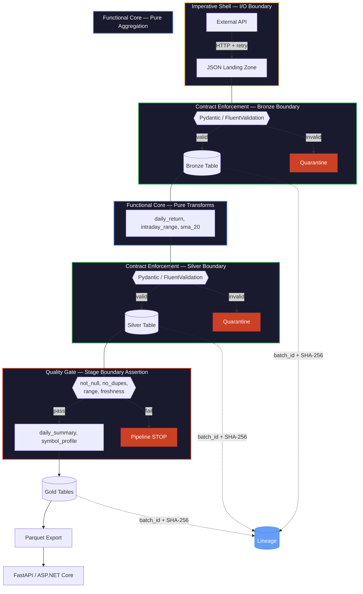

# Functional Pipeline Architecture

This is a composite architecture combining five named principles from different engineering disciplines. No single established name exists for the combination — each principle has deep literature independently. Their power comes from using them together.

Two reference implementations exist:
- **Python:** [[25_py_functional_pipeline]] — Pydantic + Polars + tenacity + pyodbc
- **C#:** [[25_cs_functional_pipeline]] — FluentValidation + LINQ + Polly + Dapper

> [!info] Theory here, implementation there
>
> This page explains WHAT each principle is and WHY it matters. The implementation
> details (code, validation rules, SQL DDL) live in the paired notebooks. Every section
> below links to the exact heading where the principle is built.

This architecture sits on TOP of [[medallion-architecture]] (which defines the data layering) and [[idempotent-pipeline-design]] (which defines safe re-runs). This page defines how the pipeline CODE is structured.

---

## The Complete Architecture



> [!abstract] Diagram legend
>
> **Amber border** — Imperative Shell (I/O, network, database)
> **Blue border** — Functional Core (pure transforms, no side effects)
> **Green border** — Contract Enforcement (typed validation at boundaries)
> **Red border** — Quality Gates and failure paths (quarantine, stop)
> **Blue fill** — Lineage tracking (batch_id, SHA-256 hash at every stage)

---

## Functional Core, Imperative Shell

**Origin:** Gary Bernhardt, "Boundaries" talk (2012). Originally a software architecture pattern for isolating side effects from business logic.

**The principle:** Transforms are pure functions — given the same input DataFrame, they produce the same output DataFrame, every time. No database calls, no HTTP requests, no file I/O, no logging inside the transform. Everything with side effects (API calls, SQL writes, file saves, retry logic) lives in the "imperative shell" that calls the pure functions and handles I/O around them.

**Why it matters:** Pure functions are trivially testable (no mocking needed), trivially parallelizable (no shared state), and trivially debuggable (reproduce the bug by passing the same input). If a transform produces wrong output, the bug is in the function — not in a network timeout, a database lock, or a stale credential.

> [!tip] The purity test
>
> Can you call this function in a unit test with a hardcoded DataFrame and assert
> the output WITHOUT setting up a database, network, or file system? If yes —
> functional core. If no — imperative shell. The notebooks enforce this boundary:
> transforms take DataFrames and return DataFrames. Everything else is infrastructure.

**Functional core (pure transforms):**

| What | Python | C# |
|---|---|---|
| Daily returns | [[25_py_functional_pipeline#Polars — compute daily returns with pct_change().over()]] | [[25_cs_functional_pipeline#LINQ — compute daily returns with GroupBy().SelectMany()]] |
| Intraday range | [[25_py_functional_pipeline#Polars — compute intraday range with with_columns()]] | [[25_cs_functional_pipeline#LINQ — compute intraday range with Select()]] |
| Moving average | [[25_py_functional_pipeline#Polars — compute 20-day moving average with rolling_mean().over()]] | [[25_cs_functional_pipeline#LINQ — compute 20-day SMA with Skip().Take().Average()]] |
| Gold summary | [[25_py_functional_pipeline#Polars — build daily cross-sectional summary with group_by().agg()]] | [[25_cs_functional_pipeline#LINQ — build Gold daily summary with GroupBy().Select()]] |
| Gold profiles | [[25_py_functional_pipeline#Polars — build per-symbol profile with cum_max() drawdown]] | [[25_cs_functional_pipeline#LINQ — define standard deviation extension with Sum().Sqrt()]] |

**Imperative shell (I/O boundaries):**

| What | Python | C# |
|---|---|---|
| Configuration | [[25_py_functional_pipeline#Python — define pipeline paths, SQL connection, and stock universe]] | [[25_cs_functional_pipeline#Constants — define pipeline paths, SQL connection, and stock universe]] |
| API fetch | [[25_py_functional_pipeline#yfinance — fetch OHLCV to JSON landing zone with Ticker.history()]] | [[25_cs_functional_pipeline#HttpClient — fetch OHLCV from Yahoo Finance with Polly ExecuteAsync()]] |
| DB persistence | [[25_py_functional_pipeline#SQLAlchemy — define DataFrame write helper with to_sql()]] | [[25_cs_functional_pipeline#Dapper — define Bronze MERGE upsert with Execute()]] |

> [!danger] Anti-pattern: transforms that call the database
>
> A transform function that reads from SQL Server mid-computation, writes intermediate
> results to a file, or catches network errors — this is the shell leaking into the
> core. The transform becomes untestable without a live database and unpredictable
> under network failures. Keep I/O at the boundaries.

---

## Contract-First Validation

**Origin:** Data Contracts (Andrew Jones, 2022), Schema-on-Write (traditional RDBMS philosophy), Design by Contract (Bertrand Meyer, 1986).

**The principle:** Every stage boundary has a typed contract (Pydantic model / C# record + FluentValidation). Data that doesn't conform is rejected BEFORE it crosses the boundary. The contract is code — version-controlled, unit-testable, and enforced at runtime.

**Why it matters:** Without contracts, bad data enters the pipeline silently. A renamed API field loads NULLs into bronze. A negative volume passes through to silver. A NaN daily return poisons the gold aggregation. By the time someone notices, the damage is three layers deep. Contracts catch bad data at ingestion — one layer, one fix.

**Contract definitions:**

| Layer | Python | C# |
|---|---|---|
| Bronze | [[25_py_functional_pipeline#Pydantic — define Bronze validation model with BaseModel and Field()]] | [[25_cs_functional_pipeline#record — define Bronze OHLCV data model with Data Annotations]] |
| Silver | [[25_py_functional_pipeline#Pydantic — define Silver validation model with BaseModel and Field()]] | [[25_cs_functional_pipeline#record — define Silver OHLCV data model with enrichment fields]] |
| Gold | [[25_py_functional_pipeline#Pydantic — define Gold validation models with BaseModel and Field()]] | [[25_cs_functional_pipeline#record — define Gold daily summary data model]] |
| Validation rules | [[25_py_functional_pipeline#Pydantic — validate Bronze rows with BaseModel() row-level check]] | [[25_cs_functional_pipeline#FluentValidation — define Bronze validation rules with AbstractValidator\<T>]] |

**Language comparison:**

| Aspect | Python | C# |
|---|---|---|
| Contract definition | Pydantic `BaseModel` with `Field()` | `record` with Data Annotations |
| Complex rules | `@model_validator`, `@field_validator` | FluentValidation `AbstractValidator<T>` |
| Strictness mode | `ConfigDict(strict=True)` — no coercion | Compile-time type safety + runtime validation |
| Error output | `ValidationError` with field-level messages | `ValidationResult` with `Errors` collection |

See [[data-contracts]] for the broader contract theory and [[context-and-metadata-architecture#Schema Drift Detection]] for schema evolution patterns.

---

## Quality Gate Pattern

**Origin:** Continuous Delivery (Jez Humble & David Farley, 2010). Originally a deployment concept — code must pass automated gates before reaching production. Applied here to data.

**The principle:** After each pipeline stage, automated assertions verify structural integrity, statistical bounds, and data freshness. If any assertion fails, the pipeline STOPS — downstream stages never see bad data. This is different from contract validation: contracts check individual rows at boundaries; quality gates check aggregate properties of the entire dataset after a stage completes.

| Check | What It Catches | Example Threshold |
|---|---|---|
| Not empty | Failed fetch, empty API response | `len(df) > 0` |
| No null keys | Schema drift, type coercion failure | `symbol`, `date` have 0 nulls |
| No duplicates | Bad MERGE, double-fetch, dedup failure | 0 duplicate `(symbol, date)` pairs |
| Value range | Outliers, data corruption, unit mismatch | `daily_return` within ±50% |
| Freshness | Stale data, broken source, timezone bug | Latest date within 5 days of today |
| Row count | Data loss, filter bug, source degradation | >= minimum expected rows |

**Quality gate implementations:**

| Check | Python | C# |
|---|---|---|
| Not empty | [[25_py_functional_pipeline#Polars — assert DataFrame is not empty with len()]] | [[25_cs_functional_pipeline#DataTable — define data quality assertion functions with AsEnumerable()]] |
| No null keys | [[25_py_functional_pipeline#Polars — assert no nulls in key columns with null_count()]] | (same file, same function) |
| No duplicates | [[25_py_functional_pipeline#Polars — assert no duplicate rows with unique()]] | (same file, same function) |
| Value range | [[25_py_functional_pipeline#Polars — assert values within range with filter()]] | (same file, same function) |
| Freshness | [[25_py_functional_pipeline#Polars — assert data freshness against SLA with max()]] | (same file, same function) |
| Orchestrator | [[25_py_functional_pipeline#Pipeline — run all quality gate assertions with log.info()]] | [[25_cs_functional_pipeline#DataTable — run Bronze data quality gate with RunQualityGate()]] |
| Exception | [[25_py_functional_pipeline#Python — define custom Exception subclass for quality gate failures]] | [[25_cs_functional_pipeline#Exception — define data quality gate failure exception]] |

See [[data-quality-framework]] for the quality dimension taxonomy and [[data-pipeline-testing-strategy#Data quality assertions]] for where quality gates fit in the testing pyramid.

> [!warning] Quality gates are not tests
>
> Tests run in CI before deployment — they catch CODE bugs. Quality gates run in
> production after every pipeline execution — they catch DATA bugs. You need both.
> A pipeline with perfect tests but no quality gates will silently ingest corrupt
> data from a source that changed its schema.

---

## Data Provenance and Lineage Tracking

**Origin:** W3C PROV Model (2013), Data Governance literature, blockchain-inspired tamper detection.

**The principle:** Every row carries a `batch_id` linking it to the pipeline run that created it. Every stage records a `StageLineage` object: start/end timestamps, input/output row counts, rejection counts, and a SHA-256 hash of the output. The `RunContext` captures the full execution envelope (symbols processed, date range, library versions, status). All of this is persisted alongside the data.

**Why it matters:** When a business user disputes a gold-layer number ("why did ASML's momentum score drop?"), you trace backward: gold row → `batch_id` → silver stage lineage → bronze stage lineage → landing JSON file → API call timestamp. The SHA-256 hash provides cryptographic proof that data wasn't modified between stages.

**Sample lineage query:**

```sql
SELECT stage, started_at, completed_at,
       input_rows, output_rows, rows_rejected, output_hash
FROM pipeline_lineage
WHERE batch_id = '9e43b0c5-a388-4ec8-ad76-bcde6e97d37e'
ORDER BY started_at;
```

| stage | started_at | completed_at | input_rows | output_rows | rejected | output_hash |
|---|---|---|---|---|---|---|
| bronze_ingest | 08:00:01 | 08:00:04 | 1331 | 1329 | 2 | a3f8b2... |
| silver_enrich | 08:00:04 | 08:00:06 | 1329 | 1329 | 0 | 7c1d4e... |
| gold_aggregate | 08:00:06 | 08:00:07 | 1329 | 50 | 0 | e9f2a1... |

**Lineage implementations:**

| Component | Python | C# |
|---|---|---|
| Batch ID | [[25_py_functional_pipeline#uuid — generate unique batch ID with uuid4()]] | [[25_cs_functional_pipeline#Guid — generate unique batch ID with Guid.NewGuid()]] |
| SHA-256 hash | [[25_py_functional_pipeline#hashlib — compute deterministic DataFrame hash with sha256()]] | [[25_cs_functional_pipeline#SHA256 — compute deterministic data hash with SHA256.HashData()]] |
| Stage tracking | [[25_py_functional_pipeline#Python — define stage start and end tracker with datetime.now()]] | [[25_cs_functional_pipeline#DateTime — define stage start and end tracker with DateTime.UtcNow]] |
| Lineage models | [[25_py_functional_pipeline#Pydantic — define lineage tracking models with BaseModel and Field()]] | [[25_cs_functional_pipeline#record — define stage lineage tracking data model]] |
| Run context | [[25_py_functional_pipeline#Pydantic — save run context to JSON with model_dump_json()]] | [[25_cs_functional_pipeline#JsonSerializer — save run context to JSON with Serialize()]] |
| Persistence | [[25_py_functional_pipeline#SQL Server — define lineage persistence helper with cursor.execute()]] | [[25_cs_functional_pipeline#Dapper — define lineage persistence helper with Execute()]] |

See [[context-and-metadata-architecture]] for the broader provenance theory including bi-temporal modeling and context propagation patterns.

---

## Immutable Value Objects

**Origin:** Domain-Driven Design (Eric Evans, 2003), Functional Programming.

**The principle:** Pydantic models with `strict=True` and C# `record` types are immutable by default. Once created, they cannot be modified — you create a new instance with different values. This eliminates mutation bugs where a transform accidentally modifies its input. Combined with value equality (two records with identical fields are equal), immutability enables reliable change detection for SCD2 upserts and MERGE operations.

**Implementations:** The contract models from the Contract-First Validation section (above) serve double duty — they are both validation contracts AND immutable value objects. The SCD2 upsert logic relies on this:

- Python SCD2: [[25_py_functional_pipeline#SQL Server — define SCD Type 2 upsert for one symbol with MERGE INTO]]
- C#: [[25_cs_functional_pipeline#record — define Bronze OHLCV data model with Data Annotations]] (records provide built-in value equality)

> [!tip] Immutability enables change detection
>
> SCD Type 2 upserts need to compare "current vs incoming" to detect changes. With
> mutable objects, comparing two instances requires field-by-field checks that may
> miss newly added fields. With records/immutable models, value equality is built in —
> `old == new` compares every field automatically. If they differ, close the old record
> and insert the new one.

---

## The Quarantine Pattern

**The principle:** Rows that fail validation are not discarded — they're persisted to a quarantine table with the batch_id, stage, raw data, and full error message. This enables investigation (why did these rows fail?), replay (fix the source and re-ingest), and metrics (what percentage of rows fail per source? is it getting worse?).

**Implementations:**

| Component | Python | C# |
|---|---|---|
| Quarantine table DDL | [[25_py_functional_pipeline#SQL Server — create quarantine table for rejected rows with cursor.execute()]] | (same DDL) |
| Quarantine persistence | [[25_py_functional_pipeline#SQL Server — define quarantine persistence helper with cursor.execute()]] | [[25_cs_functional_pipeline#Dapper — define quarantine persistence helper with Execute()]] |
| Review quarantined rows | [[25_py_functional_pipeline#Polars — review quarantined rows with read_database()]] | [[25_cs_functional_pipeline#Dapper — review quarantined rows with QueryToTable()]] |

See [[error-handling-and-retry-patterns]] for broader error handling theory and [[data-quality-framework#Data Quality Quarantine Pattern]] for the quarantine pattern in the quality framework.

> [!danger] Never silently drop bad rows
>
> `if not valid: continue` is the most dangerous line in a data pipeline. The row
> disappears. Nobody knows it existed. The row count drops by one. Weeks later,
> someone asks why a symbol is missing from the gold report. Always quarantine —
> the 5 lines of code to persist rejected rows save hours of investigation.

---

## Implementation Comparison

| Concept | Python | C# |
|---|---|---|
| **Validation** | Pydantic v2 `BaseModel` | `record` + FluentValidation |
| **Transforms** | Polars expressions | LINQ |
| **Retry** | tenacity `@retry` | Polly `WaitAndRetryAsync` |
| **DB access** | pyodbc + SQLAlchemy | Dapper |
| **Hashing** | `hashlib.sha256` | `SHA256.HashData` |
| **Serving** | FastAPI | ASP.NET Core (HttpListener) |
| **Immutability** | `ConfigDict(strict=True)` | `record` types (default immutable) |
| **Serialization** | `model_dump_json()` | `JsonSerializer.Serialize()` |
| **Batch ID** | `uuid.uuid4()` | `Guid.NewGuid()` |
| **Upsert** | pyodbc `MERGE` statement | Dapper `Execute()` with `MERGE` |
| **Quality checks** | Custom `dq_check_*` functions | Custom `Dq*` assertion functions |
| **Dead letter queue** | `quarantine_row()` → SQL Server | `QuarantineRow()` → SQL Server |

---

## Related

- [[25_py_functional_pipeline]] — Python reference implementation (Pydantic + Polars + tenacity)
- [[25_cs_functional_pipeline]] — C# reference implementation (FluentValidation + LINQ + Polly)
- [[medallion-architecture]] — Bronze/Silver/Gold data layering (this page builds on top of medallion)
- [[idempotent-pipeline-design]] — MERGE upsert and safe re-run patterns
- [[data-contracts]] — Contract specification, breaking vs non-breaking changes
- [[data-quality-framework]] — Quality dimensions, medallion quality gates, quarantine pattern
- [[data-pipeline-testing-strategy]] — Where quality gates fit in the testing pyramid
- [[error-handling-and-retry-patterns]] — Retry strategies, circuit breaker, dead letter queue theory
- [[context-and-metadata-architecture]] — Schema drift detection, provenance, bi-temporal modeling
- [[data-modeling-patterns]] — SCD Type 2 pattern used in dim_symbol
