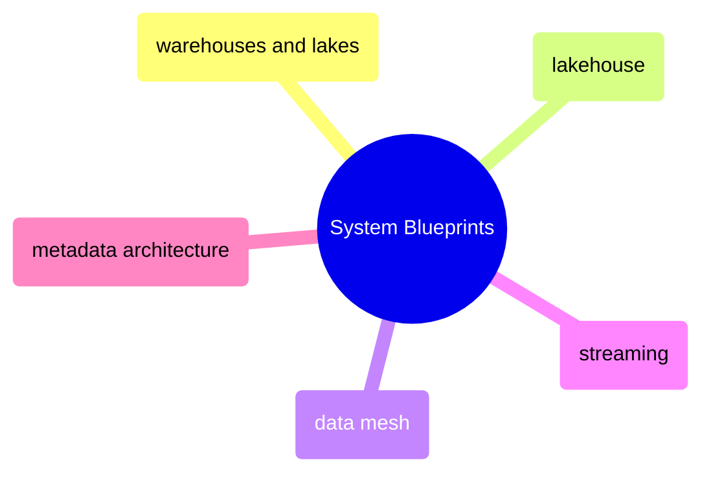
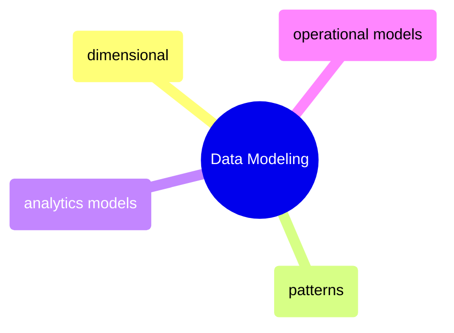
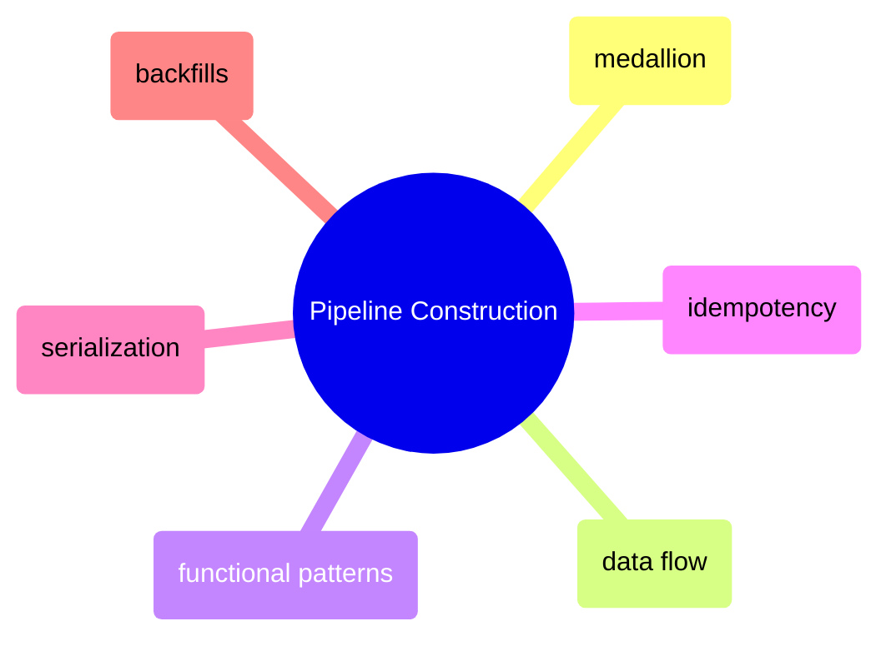
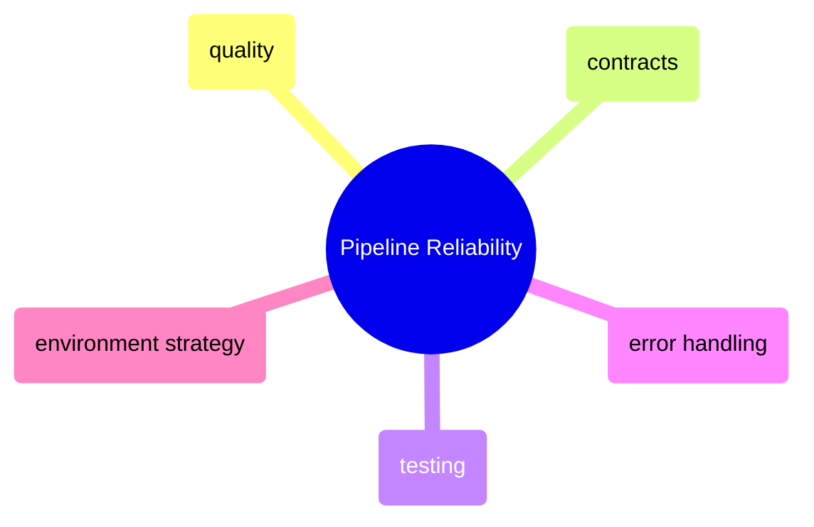
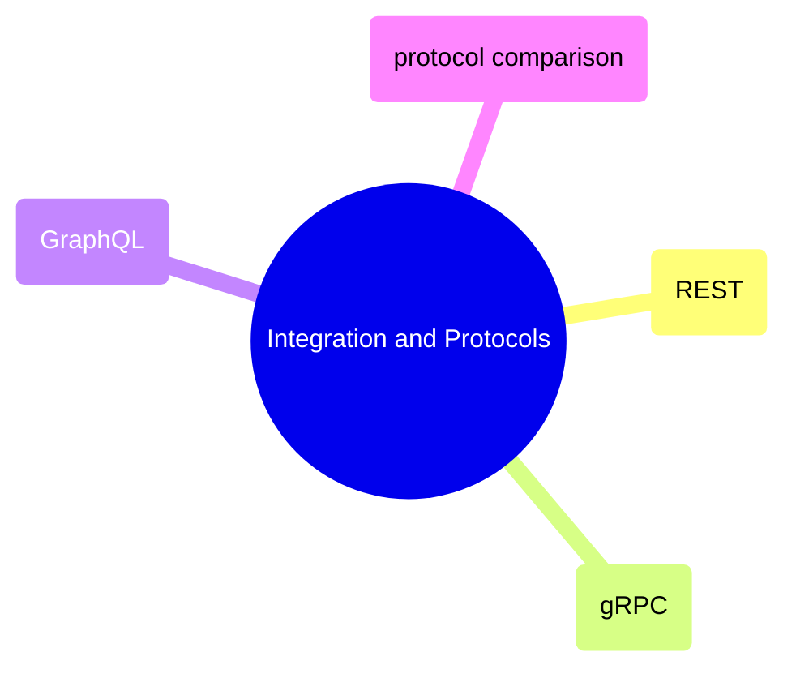
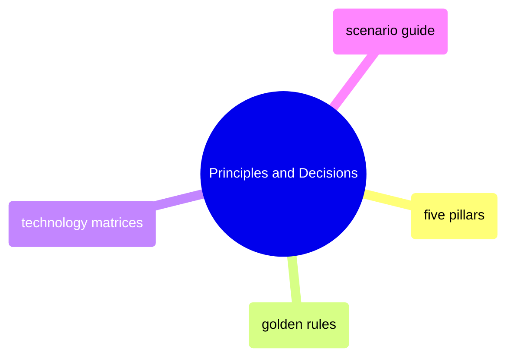

# MOC: Data Architecture

The complete map of data architecture knowledge, from system blueprints to protocol selection. Six domains cover how to design systems, build pipelines, move data between systems, and choose between competing approaches. Expand any section to browse page contents.

> [!guide]+ System Blueprints — Platform Architecture Patterns
>
> [[domain-system-blueprints]]
>
> The big structural decisions chosen once and lived with for years — warehouses, lakes, lakehouses, mesh, streaming, open table formats, and context/metadata architecture.

> [!guide]+ Data Modeling — Structuring Data for Purpose
>
> [[domain-data-modeling]]
>
> How to structure data inside each system for analytics, operations, and compliance — dimensional modeling, Data Vault 2.0, wide/flat, and every major modeling paradigm.

> [!guide]+ Pipeline Construction — Building Reliable Data Pipelines
>
> [[domain-pipeline-construction]]
>
> Data layering, idempotent operations, transform architecture, data movement topology, serialization, and migration patterns that define how data flows from source to consumer.

> [!guide]+ Pipeline Reliability — Keeping Data Trustworthy
>
> [[domain-pipeline-reliability]]
>
> Quality gates, contracts, testing strategy, error handling, and environment management — the patterns that prevent bad data from reaching consumers.

> [!guide]+ Integration & Protocols — How Data Moves Between Systems
>
> [[domain-integration-and-protocols]]
>
> API design, protocol selection, and integration patterns covering the full spectrum from REST to gRPC to GraphQL with decision frameworks for each use case.

> [!guide]+ Principles & Decisions — Choosing the Right Approach
>
> [[domain-principles-and-decisions]]
>
> Foundational principles and decision frameworks for every technology and architecture choice — golden rules, selection matrices, and scenario-based guides.

## Cross-References

- [bronze-layer-loading](https://alp78.github.io/elysium/04-Databases/01-SQL-Server/04-Applied-SQL-Server-for-Data-Pipelines/bronze-layer-loading), [silver-transforms](https://alp78.github.io/elysium/04-Databases/01-SQL-Server/04-Applied-SQL-Server-for-Data-Pipelines/silver-transforms), [gold-transforms](https://alp78.github.io/elysium/04-Databases/01-SQL-Server/04-Applied-SQL-Server-for-Data-Pipelines/gold-transforms) — SQL Server implementations of medallion layers
- [airflow-dag-patterns](https://alp78.github.io/elysium/12-Orchestration/Airflow/airflow-dag-patterns) — pipeline scheduling patterns for Airflow
- [gcp-scheduling](https://alp78.github.io/elysium/12-Orchestration/Scheduling/gcp-scheduling) — Cloud Scheduler to Cloud Run patterns
- [dbt](https://alp78.github.io/elysium/11-dbt/moc-dbt) — full dbt transformation layer section
- [dbt-transformation-layer](https://alp78.github.io/elysium/dbt-transformation-layer) — concise code-heavy dbt overview
