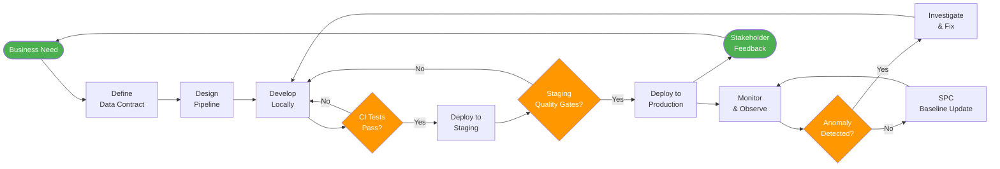

# DataOps Principles and Practices

> [!quote]
> "DataOps is not a destination — it is a discipline of continuously reducing the cycle time from data question to trusted answer."
>
> — **Lars Albertsson** (data engineering practitioner)

> [!abstract]- Summary
>
> This note frames DataOps as the operational discipline that turns data engineering into a repeatable, observable, and continuously improving delivery system, combining Agile, DevOps, and Lean practices so teams can shorten the path from data question to trusted answer without sacrificing quality.
>
> **Core philosophy and process control**
> - Defines DataOps through the manifesto themes, the data value stream, and the three operational pillars of automation, agile iteration, and continuous improvement.
> - Connects DataOps to Statistical Process Control, explaining control charts, special-cause versus common-cause variation, and how process metrics become early warning signals for unstable pipelines.
>
> **Delivery engineering for data systems**
> - Covers CI/CD for data pipelines, deployment strategies such as blue-green, canary, rolling, feature-flag, and shadow mode, and the shift-left testing model that moves validation from post hoc detection to design, development, and delivery gates.
> - Treats data artifacts as code: transformations, schemas, tests, access policies, infrastructure, contracts, and documentation all live in version control and flow through the same reviewable automation path.
>
> **Environments, culture, and maturity**
> - Explains environment management, staging fidelity, cultural changes, anti-patterns, DORA metrics, data-specific operational metrics, and the crawl-walk-run maturity model used to decide where a team should invest next.
> - Ends with a value-stream-mapping exercise so teams can convert observed waste into a prioritized DataOps improvement backlog.
>
> **Operations and safety**
> - Warnings: unstable pipelines break SPC baselines, bad deployments can corrupt history, irreversible schema changes should not ship with code changes, and weak staging data hides the defects teams most need to catch.
> - Recommendations: stabilize before baselining, require staging sign-off with rollback and repair plans, keep every controlling artifact in Git, and prioritize maturity work against the pain point causing the most operational damage.

> [!note]- Glossary
>
> **DataOps**
> - A data-engineering operating model that applies Agile, DevOps, and Lean ideas to the full lifecycle of building, testing, deploying, and improving data systems.
> - It matters here because the note treats DataOps as a discipline of process design and delivery quality, not as a product or vendor category.
>
> > [!info] Method, not tooling
> >
> > Teams can buy platforms that support DataOps, but the core change is in how the team works, measures itself, and automates quality.
>
> ---
>
> **Data value stream**
> - The end-to-end path from a raw event or business question to a usable analytical answer or decision.
> - It matters here because DataOps uses value-stream thinking to expose wait time, waste, and defect injection across the whole delivery chain.
>
> > [!info] Optimize flow, not steps
> >
> > A locally efficient stage can still be harmful if it increases idle time or handoffs elsewhere in the stream.
>
> ---
>
> **Statistical Process Control / SPC**
> - A process-monitoring approach that uses historical measurements and control limits to detect when a system has shifted outside normal behavior.
> - It matters here because the note adapts SPC from manufacturing to pipeline freshness, volume, null-rate, and latency monitoring.
>
> > [!warning] Baselines need stability
> >
> > If the pipeline logic or source behavior is changing constantly, the resulting control limits are noise rather than a trustworthy signal.
>
> ---
>
> **Control chart**
> - A time-series view of a process metric with expected bounds that show whether the process remains under control.
> - It matters here because control charts are the visual mechanism behind anomaly detection and process-health tracking in a DataOps workflow.
>
> > [!info] Trends matter as much as spikes
> >
> > Gradual drift can be just as operationally important as a single outlier if it shows the process is moving away from its normal state.
>
> ---
>
> **Special-cause variation**
> - A deviation caused by an identifiable event such as a bug, schema change, outage, or unexpected source-system shift.
> - It matters here because the note distinguishes real process failures from routine noise when deciding whether to alert or intervene.
>
> > [!warning] Not every anomaly is random
> >
> > Treating special-cause variation as business-as-usual delays detection of the very failures the team is trying to catch early.
>
> ---
>
> **Shift-left testing**
> - The practice of moving quality checks earlier in the lifecycle, from post-delivery inspection toward design, development, CI, and pre-release gates.
> - It matters here because DataOps depends on catching defects before bad data reaches consumers rather than after dashboards and models are already wrong.
>
> > [!info] Earlier checks are cheaper
> >
> > The same logic error is far cheaper to fix in a contract review or unit test than after it has damaged production data and stakeholder trust.
>
> ---
>
> **CI/CD for data**
> - The adaptation of continuous integration and delivery to stateful data systems, including tests, staging runs, promotion gates, and rollback-aware deploys.
> - It matters here because the note treats data delivery as a software problem with extra state, schema, and repair constraints.
>
> > [!danger] State changes survive deploys
> >
> > A failed web deployment can often be rolled back instantly, but a failed data deployment may also require repairing already-written data.
>
> ---
>
> **Shadow mode**
> - A deployment pattern where a new pipeline or calculation runs in parallel with production without serving its output to consumers yet.
> - It matters here because the note recommends shadow execution as a low-risk way to validate new data logic before a full cutover.
>
> > [!info] Safe comparison path
> >
> > Shadow mode is most valuable when the team needs confidence in correctness differences, not just service uptime.
>
> ---
>
> **Data-as-code**
> - The practice of representing schemas, transformations, tests, contracts, infrastructure, policies, and documentation as version-controlled artifacts.
> - It matters here because the note argues that anything controlling or describing data should move through Git and automated delivery rather than through ad hoc manual changes.
>
> > [!warning] If it is outside Git, it drifts
> >
> > Manual edits may solve the immediate problem, but they also create invisible configuration and audit gaps that undermine repeatable delivery.
>
> ---
>
> **Environment parity**
> - The degree to which development, staging, and production environments reflect the same schemas, behavior, and operational assumptions.
> - It matters here because weak parity is one of the main reasons staging checks fail to predict production incidents.
>
> > [!warning] Old staging data lies
> >
> > A staging environment that is cheap but unrealistic often validates the happy path while missing the volume, skew, and edge cases that break production.
>
> ---
>
> **DORA metrics**
> - A small set of delivery metrics that track deployment frequency, lead time, change failure rate, and mean time to recovery.
> - It matters here because the note uses DORA as the baseline measurement framework for whether DataOps practices are improving delivery performance.
>
> > [!info] Measure trend, not pride
> >
> > Teams do not need elite numbers on day one, but they do need an honest baseline and a way to prove whether changes are helping.
>
> ---
>
> **Data contract**
> - A formal agreement about schema, semantics, quality expectations, and delivery behavior between data producers and consumers.
> - It matters here because the note places contracts early in the lifecycle as a design-time mechanism for preventing avoidable downstream breakage.
>
> > [!warning] Contracts belong before the build
> >
> > If producers and consumers only discover schema expectations after deployment, the contract exists too late to prevent production friction.
>
> ---
>
> **Maturity model**
> - A staged framework that describes how capable a team is across practices such as testing, environments, observability, documentation, and collaboration.
> - It matters here because the note uses maturity levels to help teams sequence improvements instead of attempting every DataOps capability at once.
>
> > [!info] Invest where the pain is
> >
> > A maturity model is useful when it guides the next improvement step, not when it becomes a vanity score disconnected from current operational pain.

### What Is DataOps?

DataOps emerged from the frustration that traditional data teams — even skilled ones — were slow, brittle, and opaque. Stakeholders waited weeks for new reports. Schema changes broke dashboards silently. Nobody knew what "the right number" was when two reports disagreed. Data engineers became ticket-processing machines rather than value-creating engineers.

DataOps addresses this through three lenses:

| Lens | Core Question | Key Borrowing |
|------|--------------|---------------|
| **Agile** | How do we deliver value iteratively and respond to change? | Sprints, backlog, retrospectives, working software over documentation |
| **DevOps** | How do we automate the path from code to production? | CI/CD, infrastructure-as-code, monitoring, on-call culture |
| **Lean** | How do we eliminate waste in the data value stream? | Value stream mapping, pull systems, eliminate bottlenecks, continuous improvement |

When these three lenses converge on a data team, the result is a team that ships trustworthy data faster than competitors, with fewer incidents, and with clearer accountability for quality.

---

> [!example] Operating Discipline Fit
>
> > [!success] Appropriate
> >
> > - Use this note for team operating-model design, platform improvement planning, CI/CD modernization, observability rollout, and any discussion about why data delivery is slow, brittle, or opaque.
> > - Use it when the question is not one tool choice but the broader delivery discipline: automation, testing, process control, environment parity, and continuous improvement.
> > - Use it to turn vague calls for "better process" into explicit DataOps investments tied to value-stream pain and measurable delivery outcomes.
>
> > [!failure] Inappropriate
> >
> > - Do not use DataOps as branding without the underlying discipline of automation, testing, environment parity, metrics, and cultural accountability.
> > - Do not jump to SPC dashboards or maturity labels before the pipeline behavior is stable enough to baseline sensibly.
> > - Do not treat this note as a substitute for concrete implementation decisions once the team has already identified the specific operational bottleneck.

## The DataOps Manifesto

The DataOps Manifesto (datakitchen.io, 2017) articulates eighteen principles. They cluster into four themes:

### Theme 1: Continually Satisfy the Customer

> "Our highest priority is to satisfy the customer through early and continuous delivery of valuable analytic insights."

- Deliver working analytics frequently — days or weeks, not months
- Welcome changing requirements, even late in development
- Business people and data engineers must work together daily
- Measure success by business outcomes, not pipeline uptime

### Theme 2: Value Communication and Collaboration

- Build projects around motivated individuals; give them the environment and trust they need
- The most efficient way to convey information is face-to-face conversation (or its async equivalent)
- Working analytics is the primary measure of progress
- Sustainable pace — DataOps processes should be maintainable indefinitely

### Theme 3: Focus on Technical Excellence

- Continuous attention to technical excellence and good design enhances agility
- Simplicity — the art of maximizing the amount of work NOT done — is essential
- The best architectures, requirements, and designs emerge from self-organizing teams
- At regular intervals, the team reflects on how to become more effective

### Theme 4: Improve Your Process

- Add data and statistics to your operational processes; use facts, not opinions
- Implement a workflow system that makes the movement and transformation of data visible
- Reuse, generalize, and compose data transformations; avoid bespoke single-use pipelines
- Improve cycle time by eliminating waste

> [!tip] The Most Important Manifesto Principle
> "Add data and statistics to your operational processes." This is the direct link to Statistical Process Control — the idea that your **data operations process itself** should be monitored with the same rigor you apply to the data it produces.

---

## Statistical Process Control (SPC) for Data

SPC is borrowed from manufacturing quality control (Deming, Shewhart). The core idea: instead of inspecting finished products for defects, monitor the **process** that creates products, and intervene when the process goes out of control — before defects occur.

Applied to data pipelines, SPC means tracking operational metrics over time and setting control limits. When a metric falls outside its control limits, it signals a process shift — not just a one-off anomaly.

### Key SPC Concepts for Data Teams

| Concept | Manufacturing Meaning | Data Pipeline Meaning |
|---------|----------------------|----------------------|
| **Control chart** | Plot of process metric over time with UCL/LCL | Row count over time, null rate over time, latency over time |
| **Upper Control Limit (UCL)** | Mean + 3σ | Anomaly threshold for a metric |
| **Lower Control Limit (LCL)** | Mean − 3σ | Drop threshold (e.g., row count fell 40%) |
| **Special cause variation** | Process is out of control | Pipeline bug, upstream schema change, source outage |
| **Common cause variation** | Normal process noise | Day-of-week seasonality, expected batch size fluctuation |
| **Process capability** | Can this process consistently meet spec? | Can this pipeline reliably deliver within SLA? |

### Applying SPC to Data Observability

```
For each key metric M in each pipeline P:
  1. Collect M over a rolling window (e.g., 30 days)
  2. Compute mean(M) and stddev(M)
  3. Set UCL = mean + 3σ, LCL = mean − 3σ
  4. On each run: if M_today < LCL or M_today > UCL → alert
  5. Periodically re-baseline as business naturally evolves
```

This is the foundation behind tools like Monte Carlo Data, Bigeye, and the anomaly detection features in [dbt](https://alp78.github.io/elysium/14-Data-Architecture/Pipeline-Patterns/dbt-transformation-layer) and Great Expectations. For a deeper look at how observability fits into a broader monitoring strategy, see [observability-deep-dive](https://alp78.github.io/elysium/13-Observability/Monitoring/observability-deep-dive).

> [!warning] SPC Requires Stability First
> SPC only works on a **stable process**. If your pipelines are constantly being rewritten, your baselines will be meaningless. Stabilize your architecture before adding SPC-style monitoring.

> [!success] Fix: Establish a Freeze Window Before Baselining
> Before activating SPC monitoring on a pipeline, declare a two-week stabilization freeze: no schema changes, no logic rewrites, no source changes. Collect baseline metrics during this window. Activate control limits only once the process has operated stably for at least 14 days.

---

### DataOps vs DevOps vs MLOps Comparison

| Dimension | DevOps | DataOps | MLOps |
|-----------|--------|---------|-------|
| **Primary artifact** | Application code | Data pipelines + datasets | ML models |
| **Key concern** | Application availability | Data freshness + quality | Model accuracy + drift |
| **Testing** | Unit, integration, end-to-end | Schema, row count, statistical, referential integrity | Validation set, shadow mode, A/B |
| **Versioning** | Code | Code + data + schemas | Code + data + model weights |
| **Deployment unit** | Service / container | DAG / transformation / dataset | Model endpoint |
| **Rollback** | Re-deploy previous image | Re-run from previous checkpoint | Roll back to previous model version |
| **Monitoring** | Latency, error rate, saturation | Freshness, volume, distribution, referential integrity | Accuracy, precision, recall, prediction drift |
| **Maturity tooling** | GitHub Actions, Jenkins, Kubernetes | dbt, Airflow, Great Expectations, Monte Carlo | MLflow, Kubeflow, Seldon, Feast |
| **Cultural home** | Engineering | Data Engineering + Analytics | Data Science + Engineering |

> [!info] MLOps Is DataOps + Model Lifecycle
> MLOps inherits everything from DataOps (pipeline CI/CD, data quality, environment parity) and adds the model training, evaluation, registration, and serving loop on top. A mature DataOps practice is a prerequisite for MLOps.

---

## The Data Value Stream

Value stream mapping (VSM), borrowed from Lean manufacturing, traces the full path that a unit of value takes from request to delivery — and identifies waste along the way.

In data engineering, the **data value stream** runs from "raw event occurs in production system" to "analyst makes a decision using that data."

### Typical Data Value Stream Stages

```
Raw Event → Ingestion → Landing → Cleaning → Modeling → Serving → Analysis → Decision
```

For each stage, VSM identifies:

- **Process time** (time actively worked on)
- **Wait time** (time sitting idle)
- **Quality** (defect rate introduced at this stage)

### Common Waste in Data Value Streams

| Waste Type (Lean) | Data Engineering Manifestation |
|------------------|-------------------------------|
| **Overproduction** | Building reports nobody reads; ingesting data nobody queries |
| **Waiting** | Analysts waiting on tickets; pipelines waiting on upstream dependencies |
| **Transport** | Moving data between systems without transformation (unnecessary hops) |
| **Over-processing** | Re-cleaning already-clean data; re-modeling stable datasets |
| **Inventory** | Staging tables that accumulate without being consumed |
| **Defects** | Incorrect data reaching dashboards; null keys joining incorrectly |
| **Motion** | Engineers context-switching between too many unrelated pipelines |
| **Unused talent** | Analysts writing SQL workarounds because self-service doesn't exist |

> [!tip] VSM Exercise
> Run a value stream mapping workshop with your team. Pick one important dataset and trace its path from source to dashboard. Most teams find that **85–95% of elapsed time is wait time**, not active processing. This is your improvement opportunity.

---

## Three Pillars of DataOps

### Pillar 1: Automation and Orchestration

Manual processes are the enemy of reliability and speed. Every manual step is a place where:

- A human can make a mistake
- Knowledge can be siloed
- Speed depends on individual availability

#### Automation targets in data engineering

| Process | Before Automation | After Automation |
|---------|------------------|-----------------|
| Pipeline deployment | Engineer SSHes to server, runs script | Push to main branch → [CI/CD](https://alp78.github.io/elysium/10-GitHub-Actions/github-actions-ci-cd) deploys |
| Data quality checks | Analyst notices anomaly in dashboard | Automated test fails pipeline before serving |
| Schema migration | Manual ALTER TABLE + prayer | Migration scripts in version control, tested in staging |
| Alerting | On-call checks dashboard daily | Alert fires within minutes of anomaly |
| Environment refresh | "Copy prod to staging" ticket | Automated refresh job on schedule |
| Documentation | Wiki page, always stale | Generated from code (dbt docs, Data Catalog) |

**Orchestration** is the coordination layer — ensuring pipelines run in the right order, with proper dependencies, retries, and alerting. See [orchestration selection](https://alp78.github.io/elysium/14-Data-Architecture/Decision-Frameworks/technology-selection-matrices) for a full breakdown of Airflow, Prefect, Dagster, and others.

### Pillar 2: Agile Iteration

Data teams that operate in long waterfall cycles — "gather requirements for 3 months, build for 6 months, deliver once" — consistently deliver the wrong thing. By the time the product is delivered, business needs have changed.

#### Agile for data means

- Two-week sprints with a shippable data product at the end
- Backlog grooming with stakeholders, not just engineers
- Daily standups that surface blockers quickly
- Sprint reviews where analysts and business users see working data, not slides
- Retrospectives that improve the process, not just the code

#### Adapting Agile for data-specific challenges

| Challenge | Agile Adaptation |
|-----------|-----------------|
| Data work is exploratory and hard to estimate | Use spike tickets for unknown work; timebox exploration |
| Dependencies on upstream source teams | Make dependencies visible in backlog; escalate blockers early |
| "Definition of Done" is fuzzy for data | Define DoD: tested, documented, monitored, accessible |
| Stakeholders want everything NOW | Prioritized backlog with transparent trade-offs |

### Pillar 3: Continuous Improvement and Governance

DataOps is not a project with an end date — it is a continuous practice. Teams should:

- Track and trend key operational metrics (see DORA Metrics section below)
- Hold regular retrospectives focused on process improvement
- Build governance in, not on (data contracts, access controls, lineage tracking) — the [data-quality-framework](https://alp78.github.io/elysium/14-Data-Architecture/Pipeline-Patterns/data-quality-framework) provides the concrete checks and thresholds that operationalize this governance
- Create feedback loops from consumers back to producers

---

## CI/CD for Data Pipelines

Continuous Integration and Continuous Delivery for data pipelines follows the same principles as software CI/CD, with adaptations for the stateful, data-dependent nature of data systems.

### The Data CI/CD Pipeline

```
┌─────────────────────────────────────────────────────────────────────────┐
│                          DATA CI/CD PIPELINE                            │
├─────────┬──────────────┬──────────────┬──────────────┬──────────────────┤
│  Code   │     CI       │   Staging    │   Quality    │   Production     │
│  Push   │   Tests      │   Deploy     │   Gates      │   Deploy         │
├─────────┼──────────────┼──────────────┼──────────────┼──────────────────┤
│ git push│ lint         │ run against  │ schema tests │ deploy DAG       │
│         │ unit tests   │ sample data  │ row counts   │ update catalog   │
│         │ schema valid │ integration  │ freshness    │ notify consumers │
│         │ doc check    │ tests        │ distribution │ update lineage   │
└─────────┴──────────────┴──────────────┴──────────────┴──────────────────┘
```

### CI Stage: What to Test Before Merging

| Test Type | What It Checks | Tool Example |
|-----------|----------------|-------------|
| **Linting** | SQL style, naming conventions | SQLFluff, dbt |
| **Compilation** | Models resolve without errors | dbt compile |
| **Unit tests** | Logic correctness on mock data | dbt-unit-testing, pytest |
| **Schema tests** | Not-null, unique, accepted values | dbt tests, Great Expectations |
| **Referential integrity** | Foreign keys resolve | dbt relationships test |
| **Documentation** | All models have descriptions | dbt doc check |
| **Lineage** | No orphaned models or circular deps | dbt lineage graph |

### CD Stage: Deployment Strategies

| Strategy | Description | When to Use |
|----------|-------------|-------------|
| **Blue/Green** | Two identical environments; switch traffic | Low tolerance for downtime |
| **Canary** | Roll out to a subset of tables/consumers first | Large pipelines with many consumers |
| **Rolling** | Deploy one pipeline at a time sequentially | Dependent pipeline chains |
| **Feature flags** | New logic behind a flag, toggle without redeploy | Experimental features |
| **Shadow mode** | New pipeline runs in parallel; output not served | Validating new logic before cutover |

> [!danger] Bad deploys corrupt history
>
> Unlike stateless web services, data pipelines have state (the data itself). A bad deploy doesn't just affect new requests -- it can corrupt historical data or create gaps that are invisible until a downstream consumer notices weeks later. Always test in staging with production-representative data volumes before promoting to production. Have a rollback plan that includes both code rollback AND data repair (re-running from the last known-good state).

> [!success] Fix: Mandatory Staging Sign-Off with Data Repair Runbook
> For every pipeline promotion, require a sign-off checklist: (1) tests passed on production-representative data, (2) rollback command documented in the PR description, (3) data repair runbook exists for the last-known-good re-run window. Use shadow mode deployment (new pipeline runs in parallel, output not served) before full cutover for high-risk changes.

> [!warning] Schema migrations are not reversible
>
> Adding a column is easy to roll back. Dropping or renaming a column is not -- any downstream consumers that depend on the old schema will break immediately. Always deploy schema changes as additive operations (add new columns, deprecate old ones, remove after all consumers migrate). Never drop a column and deploy new pipeline code in the same release.

> [!success] Fix: Expand-and-Contract Migration Pattern
> Use the expand-and-contract pattern: (1) add the new column alongside the old one, (2) deploy the new pipeline logic writing to both, (3) migrate all consumers to the new column, (4) in a separate release, drop the old column. This makes every schema change reversible at any intermediate step.

---

## Shift-Left Testing

"Shift left" means moving testing earlier in the development lifecycle — toward the left of the timeline — rather than discovering defects late (or after delivery).

In traditional data development, quality checks happened at the end: an analyst noticed something wrong in a dashboard and filed a ticket. Shift-left moves quality checks to:

1. **Design time** — data contracts, schema agreements before development starts
2. **Development time** — unit tests while writing transformations
3. **Integration time** — automated tests in CI before merging
4. **Delivery time** — quality gates in CD before data reaches consumers

### Shift-Left Maturity Levels

| Level | Name | What Happens | Who Owns Quality |
|-------|------|--------------|-----------------|
| 0 | **Reactive** | Stakeholder reports wrong numbers | Nobody proactively owns it |
| 1 | **End-gate** | QA review before dashboard publish | Separate QA team or analyst |
| 2 | **CI/CD gates** | Automated tests block bad deploys | Pipeline fails loudly |
| 3 | **Design contracts** | Schema agreed before build starts | Both producer and consumer |
| 4 | **Source quality** | Quality enforced at ingestion | Source team + data platform |

### Implementing Shift-Left

#### At design time

- Agree on schema with downstream consumers before writing code
- Define data contracts: types, nullable fields, expected ranges, SLAs
- Document business rules in code, not in someone's head

#### At development time

- Write dbt schema tests alongside the model, not after — the [dbt-testing-framework](https://alp78.github.io/elysium/11-dbt/Quality/dbt-testing-framework) provides the full catalog of test types available for shift-left validation
- Use `dbt-unit-testing` to test SQL logic on small mock datasets
- Make the feedback loop fast — run tests locally in seconds, not minutes

#### At CI time

- Block merges that fail tests — no exceptions
- Run tests against a representative sample of production data
- Validate that documentation exists before allowing merge

> [!tip] The Cost of Late Defects
> Studies from software engineering (Barry Boehm) consistently show that the cost to fix a defect increases exponentially the later it is found. A defect caught at design time costs 1x. The same defect caught in production costs 100x. Data engineering is no different.

---

## Data-as-Code

Data-as-code is the practice of treating all data artifacts — schemas, transformations, quality rules, access policies, documentation — as code: version-controlled, reviewed, tested, and deployed through automated pipelines.

### What "Data-as-Code" Covers

| Artifact | Traditional Approach | Data-as-Code Approach |
|----------|--------------------|-----------------------|
| **Transformations** | Stored procedure in DB, no version control | SQL/Python in Git, deployed via CI/CD |
| **Schema definitions** | Implicit in CREATE TABLE, undocumented | Explicit schema files (Avro, Protobuf, JSON Schema) |
| **Quality rules** | Manual checks run by analyst | Great Expectations / dbt tests in Git |
| **Access policies** | Manually granted in console | Terraform / dbt-access policies in Git |
| **Infrastructure** | Manually provisioned | Terraform, Pulumi, or Cloud Deployment Manager |
| **Documentation** | Confluence page, always out of date | Generated from code comments (dbt docs) |
| **Data contracts** | Verbal agreement or email | YAML file in Git, enforced by platform |

### The Repository Structure for Data-as-Code

```
data-platform/
├── ingestion/          # Source connectors, configs
├── transformations/    # dbt project (models, tests, docs)
├── quality/            # Great Expectations suites
├── orchestration/      # Airflow DAGs / Prefect flows
├── infrastructure/     # Terraform for cloud resources
├── contracts/          # Data contract YAML files
└── .github/workflows/  # CI/CD pipeline definitions
```

> [!info] Everything in Git
> The rule is simple: if it controls or describes your data, it lives in Git. If it's not in Git, it doesn't exist as far as your CI/CD system is concerned.

---

## Environment Management

Mature data teams maintain multiple environments with clear promotion paths:

```
Development → Staging → Production
```

### Environment Characteristics

| Characteristic | Development | Staging | Production |
|----------------|-------------|---------|------------|
| **Data** | Synthetic or small sample | Full production snapshot (or anonymized) | Live data |
| **Scale** | Minimal (fast iteration) | Production-representative | Full scale |
| **Access** | Engineers only | Engineers + QA + select analysts | All authorized users |
| **Cost** | Minimize (pause when idle) | Moderate (run on schedule) | Optimize for reliability |
| **Deployment** | On branch push | On PR merge to main | Manual promote or CD |
| **Monitoring** | Optional | Enabled (catch issues early) | Full observability |

### Common Environment Anti-Patterns

- **"Works on my machine"** — no dev environment, engineers test directly in production
- **Permanent staging drift** — staging data is months old and unrepresentative
- **Environment sprawl** — dozens of ad-hoc dev environments with no cleanup
- **Skipping staging** — deploying directly from dev to production under pressure

> [!warning] Staging data must represent production
>
> The most common reason staging tests don't catch production bugs is that staging data doesn't represent production data. Either use a recent anonymized copy of production, or generate synthetic data that matches production distributions and edge cases.

> [!success] Fix: Automated Weekly Staging Refresh
> Schedule an automated weekly job that copies a recent anonymized snapshot of production into staging. Record the snapshot date in a `staging_metadata` table. Any test run older than 7 days flags a staleness warning. Synthetic data generation should be seeded from production statistical distributions, not invented from scratch.

---

## Cultural Transformation

DataOps is 20% tooling and 80% culture. The tools are the easy part. The hard part is changing how people think and work.

### Cultural Shifts Required

| From | To |
|------|----|
| "Data quality is someone else's problem" | "Quality is everyone's responsibility" |
| "We'll test it when it's done" | "Testing is part of development" |
| "I work alone on my pipeline" | "We work in pairs and review each other's code" |
| "Stakeholders are external to us" | "Stakeholders are part of the team" |
| "Incidents are shameful" | "Incidents are learning opportunities" |
| "Documentation is a chore" | "Documentation is part of the job" |
| "We work on whatever gets escalated" | "We work from a prioritized backlog" |
| "This has always been done this way" | "What does the retrospective data tell us?" |

### How to Drive Cultural Change

1. **Start with psychological safety** — people won't admit mistakes or suggest improvements if they fear blame
2. **Make work visible** — Kanban board, shared backlog, public dashboards of team metrics
3. **Celebrate process wins** — not just output wins ("we shipped X") but process wins ("our deploy time dropped 40%")
4. **Blameless postmortems** — incidents are process failures, not people failures
5. **Embed with stakeholders** — put data engineers in business team standups, not just data team silos
6. **Measure what matters** — if you're not tracking cycle time, MTTR, and defect rate, you can't improve them

---

### DataOps Lifecycle Flowchart



---

### DataOps Anti-Patterns

| Anti-Pattern | Description | Why It's Harmful | Fix |
|-------------|-------------|-----------------|-----|
| **Pipeline spaghetti** | Hundreds of unrelated, undocumented DAGs | Impossible to understand impact of changes | Rationalize, document, standardize |
| **Manual deployments** | Engineers SSH to deploy | Inconsistent, error-prone, unauditable | Implement CI/CD |
| **No staging environment** | Testing directly in production | Silent data corruption, stakeholder trust destroyed | Build a staging environment |
| **Testing after delivery** | Quality checks run after data reaches consumers | Defects reach stakeholders; costly to fix | Shift-left: test in CI |
| **Siloed ownership** | One engineer owns a pipeline, nobody else knows it | Bus factor = 1; single point of failure | Shared ownership, code review |
| **Snowflake environments** | Each environment configured differently by hand | Works in dev, breaks in prod | Infrastructure-as-code |
| **Stale documentation** | Wiki pages that don't match reality | Analysts make wrong assumptions | Generate docs from code |
| **Alert fatigue** | Too many low-quality alerts | On-call ignores alerts; real incidents missed | Tune alerts; use SPC thresholds |
| **Chasing perfection** | Won't ship until everything is perfect | Nothing ships; value never delivered | Ship good enough, iterate |
| **Hero culture** | One person heroically saves every incident | Knowledge silo; burnout; no systemic fix | Blameless postmortems; process fixes |

---

## DORA Metrics for Data

The DORA (DevOps Research and Assessment) four key metrics — originally developed for software engineering — translate directly to data engineering:

| DORA Metric | Software Meaning | Data Engineering Equivalent | Elite Target |
|-------------|-----------------|------------------------------|-------------|
| **Deployment Frequency** | How often code is deployed | How often new/updated pipelines are deployed to production | Multiple times per day |
| **Lead Time for Changes** | Time from commit to production | Time from data requirement to pipeline in production | Less than 1 day |
| **Change Failure Rate** | % of deploys causing incidents | % of pipeline deploys that cause data quality incidents | Less than 5% |
| **Mean Time to Recovery** | Time to restore service after incident | Time to restore data quality / freshness after incident | Less than 1 hour |

> [!tip] Start Measuring Now
> Even if your numbers are poor, measuring them creates the foundation for improvement. Teams that can't measure their deployment frequency or MTTR are flying blind. Pick one metric, instrument it, and trend it over 90 days.

### Additional Data-Specific Metrics

| Metric | Description | Why It Matters |
|--------|-------------|----------------|
| **Data freshness SLA adherence** | % of datasets delivered within agreed SLA | Stakeholder trust |
| **Test coverage** | % of models with automated tests | Quality predictability |
| **Pipeline reliability** | % of pipeline runs completing without error | Operational stability |
| **Time to detection** | Average time from data incident start to alert | Observability effectiveness |
| **Stakeholder satisfaction** | NPS or periodic survey | Business alignment |

---

### DataOps Maturity Model

| Capability | Crawl (Level 1) | Walk (Level 2) | Run (Level 3) |
|-----------|----------------|----------------|---------------|
| **Version control** | Some scripts in Git | All code in Git, branching strategy | Git + semantic versioning + changelogs |
| **Testing** | Manual ad-hoc checks | Automated tests in CI | Comprehensive shift-left, SPC monitoring |
| **Deployment** | Manual, ad-hoc | Automated CI/CD to staging | Automated CI/CD with quality gates |
| **Environments** | Dev = Prod | Separate dev/staging/prod | Full parity, automated refresh |
| **Orchestration** | Cron jobs | Managed orchestrator (Airflow) | Declarative DAGs, SLAs, auto-retry |
| **Observability** | No monitoring | Basic alerting on failures | Full data observability, SPC-based anomaly detection |
| **Documentation** | None or stale wikis | dbt docs generated | Auto-generated + data catalog integrated |
| **Data contracts** | None | Informal agreements | Formal contracts enforced by platform |
| **Collaboration** | Siloed engineers | Code review, shared backlog | Embedded with business, shared ownership |
| **Metrics** | No measurement | DORA metrics tracked | DORA + data-specific metrics, improving trend |
| **Cultural** | Blame culture, heroes | Blameless postmortems | Continuous improvement, psychological safety |

> [!info] Prioritize maturity by pain point
>
> Prioritize maturity in the areas that cause the most pain. If incidents are your biggest problem, invest in observability first. If speed is the bottleneck, invest in CI/CD. Don't try to do everything at once.

---

### Value Stream Mapping Exercise

Running a VSM workshop with your data team:

**Step 1: Define the value stream**
Pick one important dataset or report. Trace it from the raw source system to the consumer decision.

**Step 2: Map the current state**
For each stage, capture:

- What happens here?
- How long does it take (process time)?
- How long does it wait before this stage starts (wait time)?
- What is the defect rate introduced here?

**Step 3: Calculate**

- Total lead time = sum of all process times + all wait times
- Value-added ratio = sum of process times / total lead time
- Most teams find a value-added ratio of 5–15% — meaning 85–95% of time is waste

**Step 4: Map the future state**
Identify the top 3 sources of waste. Design a future state that eliminates them. This becomes your DataOps improvement backlog.

**Step 5: Implement and measure**
Run the improvements as a time-boxed project. Re-measure after 90 days. Repeat.

---

## Related Concepts

- [five-pillars-of-data-engineering](https://alp78.github.io/elysium/14-Data-Architecture/five-pillars-of-data-engineering) — the foundational engineering capabilities that DataOps practices build upon
- [golden-rules-of-data-engineering](https://alp78.github.io/elysium/14-Data-Architecture/Decision-Frameworks/golden-rules-of-data-engineering) — principles that align with DataOps philosophy
- [data-team-organization](https://alp78.github.io/elysium/15-DataOps/data-team-organization) — how to structure a team to execute DataOps practices effectively
- [self-service-data-platform](https://alp78.github.io/elysium/15-DataOps/self-service-data-platform) — the platform-level manifestation of DataOps maturity
- [orchestration selection](https://alp78.github.io/elysium/14-Data-Architecture/Decision-Frameworks/technology-selection-matrices) — choosing the right orchestration tool for your CI/CD pipelines
- [data quality](https://alp78.github.io/elysium/15-DataOps/dataops-principles-and-practices) — detailed look at shift-left testing tools and strategies
