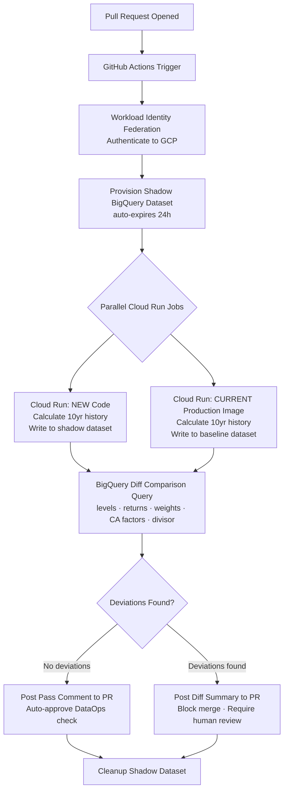

# DataOps for Indices

> [!quote]+
> "Inspection to improve quality is too late, ineffective, costly. Quality comes not from inspection, but from the improvement of the production process."
>
> — **W. Edwards Deming**, *Out of the Crisis* (1986)

> [!abstract]- Summary
>
> This note turns DataOps into an operational playbook for index-calculation platforms, showing how to prove methodological changes numerically, validate post-market outputs, deploy data safely, version methodology alongside code, and respond when published benchmark values are wrong or delayed.
>
> **Parallel backtesting and numerical diffing**
> - Defines the shadow-versus-baseline backtest architecture used to run new and production calculation engines in parallel across long historical windows, then compare levels, returns, weights, corporate-action factors, and divisors before a merge is allowed.
> - Includes GitHub Actions orchestration, Workload Identity Federation, temporary BigQuery datasets, Cloud Run job execution, and the SQL used to surface only material deviations beyond tolerated precision.
>
> **Continuous validation and deployment safety**
> - Covers scheduled end-of-day validation for production data, including weight-sum, missing-price, level-range, corporate-action, and ESG-freshness checks that catch issues caused by upstream data or operational drift rather than by code changes alone.
> - Explains blue-green data deployment patterns for BigQuery and SQL Server so schema or engine changes can be validated, swapped atomically, and rolled back without destabilizing consumer-facing aliases.
>
> **Methodology-as-code and controlled change**
> - Treats index methodology, capping rules, schedules, screens, ESG overlays, and schema migrations as versioned artifacts that move through the same review, backtest, and deployment controls as the calculation engine itself.
> - Uses idempotent migrations and a tracked schema history to keep operational changes auditable and safe to re-run.
>
> **Incident response and operational reference**
> - Defines severity classes, a SEV-1 restatement runbook, recalculation and publication-repair flow, subscriber notification expectations, and post-mortem follow-up for materially wrong benchmark outputs.
> - Ends with precision standards, severity decision logic, key `bq` commands, and Terraform resource examples so the note can serve as a working runbook as well as a design reference.
>
> **Operations and safety**
> - Warnings: unexplained deviations are potential restatement events, post-hoc validation is too late for subscriber-facing calculations, access controls can be lost during naive alias swaps, and SEV-1 incidents require compliance involvement rather than silent correction.
> - Recommendations: run parallel backtests on every consequential change, validate production outputs daily, keep methodology and migrations in version control, and maintain a pre-authorized restatement workflow with compliance and subscriber teams.

> [!note]- Glossary
>
> **Parallel backtest**
> - A validation run where new calculation logic and the current production logic process the same historical date range side by side.
> - It matters here because the note uses parallel backtesting as the primary proof that an index-engine change is numerically safe before promotion.
>
> > [!info] Compare history, not intent
> >
> > For regulated calculations, a change is only trustworthy once its historical outputs have been measured against the current baseline.
>
> ---
>
> **Shadow dataset**
> - A temporary dataset used to hold candidate calculation outputs during validation without exposing them to production consumers.
> - It matters here because the workflow relies on isolated shadow data to compare new and baseline runs cleanly and to delete the evidence afterward if the change is rejected.
>
> > [!info] Safe isolation for diffing
> >
> > Shadow data lets the team test production-like outputs without polluting the production dataset or forcing awkward table-name conventions into downstream consumers.
>
> ---
>
> **Baseline image**
> - The currently approved production calculation-engine artifact used as the control case in a parallel comparison.
> - It matters here because the note measures every new output against the actual deployed behavior, not just against a theoretical expected result.
>
> > [!warning] Validate against what is running
> >
> > If the baseline does not match production, the diff can prove the wrong thing with complete confidence.
>
> ---
>
> **Workload Identity Federation / WIF**
> - An authentication pattern that lets GitHub Actions obtain cloud access without storing long-lived service-account keys in the repository.
> - It matters here because the note uses WIF to secure CI/CD access to GCP while keeping the validation workflow auditable and keyless.
>
> > [!info] Credentials without static secrets
> >
> > WIF reduces secret-sprawl risk, but the workflow still needs tightly scoped roles and clear trust-boundary configuration.
>
> ---
>
> **Diff tolerance**
> - The numeric precision threshold that defines when two calculation outputs should be treated as equivalent versus materially different.
> - It matters here because index levels, returns, weights, and factors must be compared with field-specific precision rather than with a single generic equality test.
>
> > [!warning] Tolerance is part of the methodology
> >
> > Overly loose tolerances hide defects, while overly strict ones create noise that blocks legitimate changes for the wrong reasons.
>
> ---
>
> **Blue-green data deployment**
> - A deployment pattern where one physical dataset or table serves production while another candidate copy is prepared, validated, and then swapped into the production alias.
> - It matters here because the note uses blue-green patterns to reduce downtime and make rollback immediate for data-serving changes.
>
> > [!warning] Alias swaps still need controls
> >
> > The swap may be atomic, but access rules, validation checks, and rollback paths still need to be designed explicitly around it.
>
> ---
>
> **Methodology-as-code**
> - The practice of storing index rules, schedules, capping settings, ESG parameters, and related methodological definitions in version control beside the engine that implements them.
> - It matters here because the note treats benchmark methodology as an executable operational artifact, not as a PDF that drifts away from production behavior.
>
> > [!info] Rules deserve the same discipline as code
> >
> > A methodology update without version control, review, and backtesting is still a production change, just a less visible one.
>
> ---
>
> **Divisor**
> - The normalization value used in index calculation to preserve continuity when corporate actions, rebalances, or structural changes would otherwise create artificial jumps.
> - It matters here because divisor changes are one of the fields that must be backtested, audited, and included in incident investigations.
>
> > [!warning] Continuity depends on it
> >
> > A wrong divisor can make an index appear mathematically consistent while still publishing an economically false level.
>
> ---
>
> **Corporate action factor**
> - An adjustment value applied so splits, spinoffs, or related events are reflected correctly in constituent or index calculations.
> - It matters here because the note includes factor comparisons and validation checks as part of the operational safety net around methodology and data changes.
>
> > [!warning] Small factors, large impact
> >
> > A subtle corporate-action mismatch can cascade into incorrect weights, levels, and subscriber outputs even when the raw input feed looks mostly intact.
>
> ---
>
> **Restatement event**
> - A formal correction process triggered when published benchmark values are materially wrong and must be amended for subscribers and regulators.
> - It matters here because the note treats SEV-1 incidents as compliance-bound operational events, not just as internal bugs to fix quietly.
>
> > [!danger] Silent correction is not acceptable
> >
> > Once incorrect benchmark values have been distributed, the organization has disclosure obligations that go beyond technical remediation.
>
> ---
>
> **SEV-1**
> - The highest-severity incident level in this note, used when published index values are materially wrong or delayed beyond acceptable regulatory or subscriber thresholds.
> - It matters here because the SEV-1 classification activates the halt-publication, compliance, recalculation, and restatement workflow immediately.
>
> > [!danger] Classification drives response speed
> >
> > If the team hesitates to call a true SEV-1, it usually loses the time window in which downstream damage and regulatory exposure can still be minimized.
>
> ---
>
> **Incident recalculation dataset**
> - A dedicated dataset created during an incident to hold corrected outputs for affected indices and dates before they are merged back into production.
> - It matters here because the runbook separates incident recalculation from live production writes until the corrected values have been independently validated.
>
> > [!info] Repair in isolation first
> >
> > Recomputing directly into production makes it harder to verify, explain, and if necessary reverse the repair path during a high-pressure event.


## Parallel Backtesting Architecture

### Parallel Backtesting — The Problem

Every change to a calculation engine — whether it is a bug fix, a methodology update, a new corporate action handler, or a refactored capping algorithm — must be proven numerically identical (or intentionally different within documented tolerances) against the full published history of an index before that change is promoted to production.

For a typical index platform this means:

- **10 years of daily history** per index, often across hundreds of indices simultaneously
- **Multiple output series**: daily levels, total return, net return, constituent weights, divisor, corporate action factors
- **Strict precision requirements**: levels to 5 decimal places, weights to 8 decimal places
- **Regulatory obligation**: any unexplained deviation is a potential restatement event

Running this manually is error-prone and slow. Running it automatically on every pull request makes it a hard gate in CI/CD.

### Architecture



### GitHub Actions Workflow

```yaml
# .github/workflows/parallel-backtest.yml
name: Parallel Backtest

on:
  pull_request:
    branches: [main]
    paths:
      - 'calc/**'
      - 'sql/**'
      - 'methodology/**'

permissions:
  contents: read
  id-token: write        # Required for Workload Identity Federation
  pull-requests: write   # Required to post PR comments

env:
  GCP_PROJECT: ${{ vars.GCP_PROJECT }}
  GCP_REGION: ${{ vars.GCP_REGION }}
  ARTIFACT_REGISTRY: ${{ vars.ARTIFACT_REGISTRY }}
  PROD_IMAGE: ${{ vars.PROD_IMAGE_URI }}
  SHADOW_DATASET_PREFIX: shadow_backtest
  BACKTEST_YEARS: 10
  FLAT_RATE_RESERVATION: backtest-reservation

jobs:
  parallel-backtest:
    name: 10-Year Parallel Backtest
    runs-on: ubuntu-latest
    timeout-minutes: 120

    steps:
      - name: Checkout
        uses: actions/checkout@v4

      # ── Authentication ──────────────────────────────────────────────────
      - name: Authenticate to GCP via Workload Identity Federation
        id: auth
        uses: google-github-actions/auth@v2
        with:
          workload_identity_provider: ${{ secrets.WIF_PROVIDER }}
          service_account: ${{ secrets.WIF_SERVICE_ACCOUNT }}

      - name: Set up Cloud SDK
        uses: google-github-actions/setup-gcloud@v2

      # ── Shadow Dataset ──────────────────────────────────────────────────
      - name: Create shadow dataset (auto-expires 24h)
        id: shadow
        run: |
          SHADOW_DS="${SHADOW_DATASET_PREFIX}_${{ github.event.pull_request.number }}_${GITHUB_RUN_ID}"
          echo "SHADOW_DS=${SHADOW_DS}" >> $GITHUB_ENV

          EXPIRY_MS=$(( ( $(date -u +%s) + 86400 ) * 1000 ))

          bq mk \
            --dataset \
            --default_table_expiration=86400 \
            --description="Shadow backtest for PR ${{ github.event.pull_request.number }}" \
            "${GCP_PROJECT}:${SHADOW_DS}"

          echo "shadow_ds=${SHADOW_DS}" >> $GITHUB_OUTPUT

      # ── Build new calc engine image ─────────────────────────────────────
      - name: Build and push new calc engine image
        id: build
        run: |
          NEW_IMAGE="${ARTIFACT_REGISTRY}/calc-engine:pr-${{ github.event.pull_request.number }}-${GITHUB_SHA::8}"
          echo "NEW_IMAGE=${NEW_IMAGE}" >> $GITHUB_ENV

          docker build -t "${NEW_IMAGE}" -f calc/Dockerfile .
          docker push "${NEW_IMAGE}"

          echo "new_image=${NEW_IMAGE}" >> $GITHUB_OUTPUT

      # ── Run parallel Cloud Run jobs ─────────────────────────────────────
      - name: Submit new-code backtest job
        id: job_new
        run: |
          gcloud run jobs create "backtest-new-${GITHUB_RUN_ID}" \
            --image="${NEW_IMAGE}" \
            --region="${GCP_REGION}" \
            --set-env-vars="OUTPUT_DATASET=${SHADOW_DS},OUTPUT_TABLE_SUFFIX=new,YEARS=${BACKTEST_YEARS}" \
            --max-retries=0 \
            --task-timeout=90m \
            --execute-now \
            --wait

      - name: Submit baseline backtest job
        id: job_base
        run: |
          BASELINE_DS="${SHADOW_DS}_baseline"
          echo "BASELINE_DS=${BASELINE_DS}" >> $GITHUB_ENV

          bq mk \
            --dataset \
            --default_table_expiration=86400 \
            "${GCP_PROJECT}:${BASELINE_DS}"

          gcloud run jobs create "backtest-base-${GITHUB_RUN_ID}" \
            --image="${PROD_IMAGE}" \
            --region="${GCP_REGION}" \
            --set-env-vars="OUTPUT_DATASET=${BASELINE_DS},OUTPUT_TABLE_SUFFIX=baseline,YEARS=${BACKTEST_YEARS}" \
            --max-retries=0 \
            --task-timeout=90m \
            --execute-now \
            --wait

      # ── BigQuery diff ───────────────────────────────────────────────────
      - name: Run BigQuery diff comparison
        id: diff
        run: |
          RESULT=$(bq query \
            --use_legacy_sql=false \
            --format=json \
            --reservation_id="${FLAT_RATE_RESERVATION}" \
            "$(cat .github/sql/backtest_diff.sql \
               | sed "s|{{SHADOW_DS}}|${SHADOW_DS}|g" \
               | sed "s|{{BASELINE_DS}}|${BASELINE_DS}|g" \
               | sed "s|{{PROJECT}}|${GCP_PROJECT}|g")")

          echo "diff_result<<EOF" >> $GITHUB_OUTPUT
          echo "${RESULT}" >> $GITHUB_OUTPUT
          echo "EOF" >> $GITHUB_OUTPUT

          DEVIATION_COUNT=$(echo "${RESULT}" | python3 -c "import sys,json; data=json.load(sys.stdin); print(sum(int(r.get('deviation_count',0)) for r in data))")
          echo "deviation_count=${DEVIATION_COUNT}" >> $GITHUB_OUTPUT

      # ── Post PR comment ─────────────────────────────────────────────────
      - name: Post backtest results to PR
        uses: actions/github-script@v7
        with:
          script: |
            const deviationCount = parseInt('${{ steps.diff.outputs.deviation_count }}');
            const diffResult = `${{ steps.diff.outputs.diff_result }}`;
            const passed = deviationCount === 0;

            const icon = passed ? '✅' : '❌';
            const status = passed ? 'PASSED — no deviations detected' : `FAILED — ${deviationCount} deviation(s) found`;

            const body = [
              `## ${icon} Parallel Backtest: ${status}`,
              '',
              `**Shadow dataset:** \`${{ env.SHADOW_DS }}\` (auto-expires 24h)`,
              `**Baseline image:** \`${{ env.PROD_IMAGE }}\``,
              `**New image:** \`${{ env.NEW_IMAGE }}\``,
              `**History window:** ${{ env.BACKTEST_YEARS }} years`,
              '',
              passed
                ? '_All index levels, returns, weights, corporate action factors, and divisor values match within tolerance._'
                : `<details><summary>Deviation summary (first 50 rows)</summary>\n\n\`\`\`json\n${diffResult.slice(0,4000)}\n\`\`\`\n\n</details>`,
            ].join('\n');

            await github.rest.issues.createComment({
              owner: context.repo.owner,
              repo: context.repo.repo,
              issue_number: context.issue.number,
              body,
            });

            if (!passed) {
              core.setFailed(`Backtest detected ${deviationCount} deviation(s). Merge blocked.`);
            }

      # ── Cleanup ─────────────────────────────────────────────────────────
      - name: Cleanup shadow datasets
        if: always()
        run: |
          bq rm -r -f "${GCP_PROJECT}:${SHADOW_DS}" || true
          bq rm -r -f "${GCP_PROJECT}:${BASELINE_DS}" || true

          gcloud run jobs delete "backtest-new-${GITHUB_RUN_ID}" --region="${GCP_REGION}" --quiet || true
          gcloud run jobs delete "backtest-base-${GITHUB_RUN_ID}" --region="${GCP_REGION}" --quiet || true
```

### BigQuery Diff Comparison SQL

Save as `.github/sql/backtest_diff.sql`. The query checks every meaningful output dimension and surfaces only rows that differ beyond acceptable floating-point precision.

```sql
-- .github/sql/backtest_diff.sql
-- Compares new vs baseline calculation outputs across all result dimensions.
-- Template variables: {{PROJECT}}, {{SHADOW_DS}}, {{BASELINE_DS}}

WITH

-- ── Index levels ─────────────────────────────────────────────────────────
level_diff AS (
  SELECT
    n.index_id,
    n.calc_date,
    'index_level' AS dimension,
    n.level_value   AS new_value,
    b.level_value   AS baseline_value,
    ABS(n.level_value - b.level_value) AS abs_diff,
    ABS(n.level_value - b.level_value) / NULLIF(b.level_value, 0) AS rel_diff
  FROM `{{PROJECT}}.{{SHADOW_DS}}.index_levels_new`   AS n
  JOIN `{{PROJECT}}.{{BASELINE_DS}}.index_levels_baseline` AS b
    USING (index_id, calc_date)
  WHERE ROUND(n.level_value, 5) != ROUND(b.level_value, 5)
),

-- ── Total return levels ───────────────────────────────────────────────────
tr_diff AS (
  SELECT
    n.index_id,
    n.calc_date,
    'total_return_level' AS dimension,
    n.tr_level   AS new_value,
    b.tr_level   AS baseline_value,
    ABS(n.tr_level - b.tr_level) AS abs_diff,
    ABS(n.tr_level - b.tr_level) / NULLIF(b.tr_level, 0) AS rel_diff
  FROM `{{PROJECT}}.{{SHADOW_DS}}.index_levels_new`   AS n
  JOIN `{{PROJECT}}.{{BASELINE_DS}}.index_levels_baseline` AS b
    USING (index_id, calc_date)
  WHERE ROUND(n.tr_level, 5) != ROUND(b.tr_level, 5)
),

-- ── Daily returns ─────────────────────────────────────────────────────────
return_diff AS (
  SELECT
    n.index_id,
    n.calc_date,
    'daily_return' AS dimension,
    n.daily_return   AS new_value,
    b.daily_return   AS baseline_value,
    ABS(n.daily_return - b.daily_return) AS abs_diff,
    NULL AS rel_diff
  FROM `{{PROJECT}}.{{SHADOW_DS}}.index_returns_new`   AS n
  JOIN `{{PROJECT}}.{{BASELINE_DS}}.index_returns_baseline` AS b
    USING (index_id, calc_date)
  WHERE ROUND(n.daily_return, 6) != ROUND(b.daily_return, 6)
),

-- ── Constituent weights ───────────────────────────────────────────────────
weight_diff AS (
  SELECT
    n.index_id,
    n.calc_date,
    CONCAT('weight:', n.constituent_id) AS dimension,
    n.weight   AS new_value,
    b.weight   AS baseline_value,
    ABS(n.weight - b.weight) AS abs_diff,
    NULL AS rel_diff
  FROM `{{PROJECT}}.{{SHADOW_DS}}.constituent_weights_new`   AS n
  JOIN `{{PROJECT}}.{{BASELINE_DS}}.constituent_weights_baseline` AS b
    USING (index_id, calc_date, constituent_id)
  WHERE ROUND(n.weight, 8) != ROUND(b.weight, 8)
),

-- ── Weight sum integrity ──────────────────────────────────────────────────
weight_sum_diff AS (
  SELECT
    n.index_id,
    n.calc_date,
    'weight_sum' AS dimension,
    n.total_weight   AS new_value,
    b.total_weight   AS baseline_value,
    ABS(n.total_weight - b.total_weight) AS abs_diff,
    NULL AS rel_diff
  FROM (
    SELECT index_id, calc_date, ROUND(SUM(weight), 8) AS total_weight
    FROM `{{PROJECT}}.{{SHADOW_DS}}.constituent_weights_new`
    GROUP BY 1, 2
  ) n
  JOIN (
    SELECT index_id, calc_date, ROUND(SUM(weight), 8) AS total_weight
    FROM `{{PROJECT}}.{{BASELINE_DS}}.constituent_weights_baseline`
    GROUP BY 1, 2
  ) b USING (index_id, calc_date)
  WHERE n.total_weight != b.total_weight
),

-- ── Corporate action factors ──────────────────────────────────────────────
ca_diff AS (
  SELECT
    n.index_id,
    n.calc_date,
    CONCAT('ca_factor:', n.constituent_id) AS dimension,
    n.ca_factor   AS new_value,
    b.ca_factor   AS baseline_value,
    ABS(n.ca_factor - b.ca_factor) AS abs_diff,
    ABS(n.ca_factor - b.ca_factor) / NULLIF(b.ca_factor, 0) AS rel_diff
  FROM `{{PROJECT}}.{{SHADOW_DS}}.corporate_action_factors_new`   AS n
  JOIN `{{PROJECT}}.{{BASELINE_DS}}.corporate_action_factors_baseline` AS b
    USING (index_id, calc_date, constituent_id)
  WHERE ROUND(n.ca_factor, 8) != ROUND(b.ca_factor, 8)
),

-- ── Divisor values ────────────────────────────────────────────────────────
divisor_diff AS (
  SELECT
    n.index_id,
    n.calc_date,
    'divisor' AS dimension,
    n.divisor   AS new_value,
    b.divisor   AS baseline_value,
    ABS(n.divisor - b.divisor) AS abs_diff,
    ABS(n.divisor - b.divisor) / NULLIF(b.divisor, 0) AS rel_diff
  FROM `{{PROJECT}}.{{SHADOW_DS}}.divisor_new`   AS n
  JOIN `{{PROJECT}}.{{BASELINE_DS}}.divisor_baseline` AS b
    USING (index_id, calc_date)
  WHERE ROUND(n.divisor, 8) != ROUND(b.divisor, 8)
),

-- ── Union all deviations ──────────────────────────────────────────────────
all_deviations AS (
  SELECT * FROM level_diff
  UNION ALL SELECT * FROM tr_diff
  UNION ALL SELECT * FROM return_diff
  UNION ALL SELECT * FROM weight_diff
  UNION ALL SELECT * FROM weight_sum_diff
  UNION ALL SELECT * FROM ca_diff
  UNION ALL SELECT * FROM divisor_diff
)

SELECT
  index_id,
  calc_date,
  dimension,
  ROUND(new_value, 10)      AS new_value,
  ROUND(baseline_value, 10) AS baseline_value,
  ROUND(abs_diff, 10)       AS abs_diff,
  ROUND(rel_diff * 100, 6)  AS rel_diff_pct,
  COUNT(*) OVER ()          AS deviation_count
FROM all_deviations
ORDER BY abs_diff DESC
LIMIT 50;
```

> [!tip] Cost Control
> - Shadow datasets carry a `default_table_expiration` of 86,400 seconds (24 hours). They are also deleted explicitly in the `always()` cleanup step, but the expiry is a safety net.
> - Use a flat-rate slot reservation for backtest queries to prevent runaway on-demand costs. Pass `--reservation_id` to `bq query`.
> - Cache the production baseline image in Artifact Registry rather than rebuilding it on every PR.
> - Parallelize across indices by sharding the Cloud Run jobs by index family; one job per family keeps job count manageable.

---

## Continuous Validation

End-of-day validation runs automatically after market close. It catches issues that the parallel backtest cannot — price feed gaps, stale ESG scores, weight drift caused by upstream data changes rather than code changes.

### Scheduled Workflow

```yaml
# .github/workflows/eod-validation.yml
name: End-of-Day Index Validation

on:
  schedule:
    # Weekdays at 18:00 UTC — after US market close and post-processing
    - cron: '0 18 * * 1-5'
  workflow_dispatch:
    inputs:
      validation_date:
        description: 'Override date (YYYY-MM-DD). Defaults to today.'
        required: false

permissions:
  contents: read
  id-token: write
  issues: write

env:
  GCP_PROJECT: ${{ vars.GCP_PROJECT }}
  PROD_DATASET: ${{ vars.PROD_DATASET }}
  ALERT_ISSUE_LABEL: validation-failure

jobs:
  validate:
    name: Post-Market Validation
    runs-on: ubuntu-latest
    timeout-minutes: 30

    steps:
      - name: Checkout
        uses: actions/checkout@v4

      - name: Authenticate to GCP
        uses: google-github-actions/auth@v2
        with:
          workload_identity_provider: ${{ secrets.WIF_PROVIDER }}
          service_account: ${{ secrets.WIF_SERVICE_ACCOUNT }}

      - name: Set validation date
        id: date
        run: |
          VAL_DATE="${{ github.event.inputs.validation_date }}"
          if [ -z "${VAL_DATE}" ]; then
            VAL_DATE=$(date -u +%Y-%m-%d)
          fi
          echo "val_date=${VAL_DATE}" >> $GITHUB_OUTPUT

      - name: Run weight sum validation
        id: weight_sum
        run: |
          bq query --use_legacy_sql=false --format=json \
            "$(cat .github/sql/validate_weight_sum.sql \
               | sed "s|{{PROJECT}}|${GCP_PROJECT}|g" \
               | sed "s|{{DATASET}}|${PROD_DATASET}|g" \
               | sed "s|{{DATE}}|${{ steps.date.outputs.val_date }}|g")" \
            > /tmp/weight_sum_result.json
          echo "result=$(cat /tmp/weight_sum_result.json)" >> $GITHUB_OUTPUT

      - name: Run missing price validation
        id: missing_prices
        run: |
          bq query --use_legacy_sql=false --format=json \
            "$(cat .github/sql/validate_missing_prices.sql \
               | sed "s|{{PROJECT}}|${GCP_PROJECT}|g" \
               | sed "s|{{DATASET}}|${PROD_DATASET}|g" \
               | sed "s|{{DATE}}|${{ steps.date.outputs.val_date }}|g")" \
            > /tmp/missing_prices_result.json

      - name: Run index level range validation
        id: level_range
        run: |
          bq query --use_legacy_sql=false --format=json \
            "$(cat .github/sql/validate_level_range.sql \
               | sed "s|{{PROJECT}}|${GCP_PROJECT}|g" \
               | sed "s|{{DATASET}}|${PROD_DATASET}|g" \
               | sed "s|{{DATE}}|${{ steps.date.outputs.val_date }}|g")" \
            > /tmp/level_range_result.json

      - name: Run corporate action application check
        id: ca_check
        run: |
          bq query --use_legacy_sql=false --format=json \
            "$(cat .github/sql/validate_corporate_actions.sql \
               | sed "s|{{PROJECT}}|${GCP_PROJECT}|g" \
               | sed "s|{{DATASET}}|${PROD_DATASET}|g" \
               | sed "s|{{DATE}}|${{ steps.date.outputs.val_date }}|g")" \
            > /tmp/ca_result.json

      - name: Run ESG data freshness check
        id: esg_freshness
        run: |
          bq query --use_legacy_sql=false --format=json \
            "$(cat .github/sql/validate_esg_freshness.sql \
               | sed "s|{{PROJECT}}|${GCP_PROJECT}|g" \
               | sed "s|{{DATASET}}|${PROD_DATASET}|g" \
               | sed "s|{{DATE}}|${{ steps.date.outputs.val_date }}|g")" \
            > /tmp/esg_result.json

      - name: Aggregate results and raise issue on failure
        uses: actions/github-script@v7
        with:
          script: |
            const fs = require('fs');
            const checks = [
              { name: 'Weight Sum',         file: '/tmp/weight_sum_result.json' },
              { name: 'Missing Prices',     file: '/tmp/missing_prices_result.json' },
              { name: 'Index Level Range',  file: '/tmp/level_range_result.json' },
              { name: 'Corporate Actions',  file: '/tmp/ca_result.json' },
              { name: 'ESG Freshness',      file: '/tmp/esg_result.json' },
            ];

            let failures = [];
            for (const check of checks) {
              const data = JSON.parse(fs.readFileSync(check.file, 'utf8'));
              const failRows = data.filter(r => r.check_status !== 'PASS');
              if (failRows.length > 0) {
                failures.push({ check: check.name, rows: failRows });
              }
            }

            if (failures.length === 0) {
              console.log('All validation checks passed.');
              return;
            }

            const body = [
              '## Validation Failure — ${{ steps.date.outputs.val_date }}',
              '',
              ...failures.map(f => [
                `### ${f.check}`,
                '```json',
                JSON.stringify(f.rows.slice(0, 10), null, 2),
                '```',
              ].join('\n')),
            ].join('\n');

            await github.rest.issues.create({
              owner: context.repo.owner,
              repo: context.repo.repo,
              title: `EOD Validation Failure — ${{ steps.date.outputs.val_date }}`,
              body,
              labels: ['${{ env.ALERT_ISSUE_LABEL }}'],
            });

            core.setFailed(`${failures.length} validation check(s) failed.`);
```

### Validation SQL

**Weight sum check** — every index on the validation date must have constituent weights that sum to exactly 1.00000000.

```sql
-- .github/sql/validate_weight_sum.sql
SELECT
  index_id,
  calc_date,
  ROUND(SUM(weight), 8)           AS weight_sum,
  ABS(1.0 - ROUND(SUM(weight), 8)) AS deviation,
  CASE
    WHEN ABS(1.0 - ROUND(SUM(weight), 8)) <= 0.00000001 THEN 'PASS'
    ELSE 'FAIL'
  END AS check_status
FROM `{{PROJECT}}.{{DATASET}}.constituent_weights`
WHERE calc_date = DATE('{{DATE}}')
GROUP BY 1, 2
HAVING check_status = 'FAIL'
ORDER BY deviation DESC;
```

**Missing price check** — constituents with a null or zero close price on the calculation date.

```sql
-- .github/sql/validate_missing_prices.sql
SELECT
  cw.index_id,
  cw.calc_date,
  cw.constituent_id,
  p.close_price,
  CASE
    WHEN p.close_price IS NULL OR p.close_price = 0 THEN 'FAIL'
    ELSE 'PASS'
  END AS check_status
FROM `{{PROJECT}}.{{DATASET}}.constituent_weights` AS cw
LEFT JOIN `{{PROJECT}}.{{DATASET}}.prices` AS p
  ON  cw.constituent_id = p.security_id
  AND cw.calc_date      = p.price_date
WHERE cw.calc_date = DATE('{{DATE}}')
  AND (p.close_price IS NULL OR p.close_price = 0)
ORDER BY cw.index_id, cw.constituent_id;
```

**Index level range check** — flags indices whose daily return falls outside ±15%, which is a plausible upper bound for normal market days.

```sql
-- .github/sql/validate_level_range.sql
WITH daily_returns AS (
  SELECT
    index_id,
    calc_date,
    level_value,
    LAG(level_value) OVER (PARTITION BY index_id ORDER BY calc_date) AS prev_level,
    SAFE_DIVIDE(
      level_value - LAG(level_value) OVER (PARTITION BY index_id ORDER BY calc_date),
      LAG(level_value) OVER (PARTITION BY index_id ORDER BY calc_date)
    ) AS daily_return
  FROM `{{PROJECT}}.{{DATASET}}.index_levels`
  WHERE calc_date BETWEEN DATE_SUB(DATE('{{DATE}}'), INTERVAL 1 DAY) AND DATE('{{DATE}}')
)
SELECT
  index_id,
  calc_date,
  ROUND(level_value, 5)   AS level_value,
  ROUND(daily_return, 6)  AS daily_return,
  CASE
    WHEN ABS(daily_return) > 0.15 THEN 'FAIL'
    WHEN level_value <= 0          THEN 'FAIL'
    ELSE 'PASS'
  END AS check_status
FROM daily_returns
WHERE calc_date = DATE('{{DATE}}')
  AND (ABS(daily_return) > 0.15 OR level_value <= 0)
ORDER BY ABS(daily_return) DESC;
```

**Corporate action application check** — any announced corporate action effective on the validation date must be reflected in the adjustment factors.

```sql
-- .github/sql/validate_corporate_actions.sql
SELECT
  ca.index_id,
  ca.constituent_id,
  ca.effective_date,
  ca.action_type,
  af.ca_factor,
  CASE
    WHEN af.ca_factor IS NULL THEN 'FAIL'
    WHEN ca.action_type = 'SPLIT' AND ABS(af.ca_factor - ca.split_ratio) > 0.000001 THEN 'FAIL'
    ELSE 'PASS'
  END AS check_status
FROM `{{PROJECT}}.{{DATASET}}.announced_corporate_actions` AS ca
LEFT JOIN `{{PROJECT}}.{{DATASET}}.corporate_action_factors` AS af
  ON  ca.index_id       = af.index_id
  AND ca.constituent_id = af.constituent_id
  AND ca.effective_date = af.calc_date
WHERE ca.effective_date = DATE('{{DATE}}')
  AND (af.ca_factor IS NULL
       OR (ca.action_type = 'SPLIT' AND ABS(af.ca_factor - ca.split_ratio) > 0.000001))
ORDER BY ca.index_id, ca.constituent_id;
```

**ESG data freshness check** — for ESG indices, scores must not be older than the configured maximum staleness threshold (default: 35 calendar days, accounting for provider delivery windows).

```sql
-- .github/sql/validate_esg_freshness.sql
SELECT
  s.index_id,
  s.constituent_id,
  s.score_date,
  DATE_DIFF(DATE('{{DATE}}'), s.score_date, DAY) AS days_stale,
  s.esg_score,
  CASE
    WHEN DATE_DIFF(DATE('{{DATE}}'), s.score_date, DAY) > 35 THEN 'FAIL'
    WHEN s.esg_score IS NULL                                   THEN 'FAIL'
    ELSE 'PASS'
  END AS check_status
FROM `{{PROJECT}}.{{DATASET}}.esg_scores` AS s
JOIN `{{PROJECT}}.{{DATASET}}.index_constituents` AS ic
  ON  s.constituent_id = ic.constituent_id
  AND ic.calc_date     = DATE('{{DATE}}')
  AND ic.is_esg_index  = TRUE
WHERE DATE_DIFF(DATE('{{DATE}}'), s.score_date, DAY) > 35
   OR s.esg_score IS NULL
ORDER BY days_stale DESC;
```

> [!note] See also
>  for the upstream ingestion pipeline that feeds the `esg_scores` table validated here.

---

## Blue-Green Data Deployment

The blue-green pattern for data avoids downtime and provides instant rollback during schema migrations, backfill operations, or ETL engine swaps. The production alias always points to either the blue or green physical table; the swap is atomic.

### Concept

```
┌─────────────────────────────────────────────────────┐
│  BLUE  (current production)                         │
│  index_levels_blue   ◄── production synonym/view    │
└─────────────────────────────────────────────────────┘

  Deploy new data to green:

┌─────────────────────────────────────────────────────┐
│  GREEN  (staging)                                   │
│  index_levels_green  ◄── validate here first        │
└─────────────────────────────────────────────────────┘

  Validate green. If pass, swap the alias. Rollback = swap back.
```

### BigQuery Implementation (Dataset Rename Pattern)

BigQuery does not support renaming tables atomically, but you can achieve the swap via a view alias that is updated in a single DDL statement, or by using authorized views and swapping the underlying view definition.

```sql
-- Step 1: Create the green table and load data
CREATE OR REPLACE TABLE `project.dataset.index_levels_green`
OPTIONS (
  description = 'Green deployment candidate — not yet production'
)
AS
SELECT * FROM `project.dataset.index_levels_blue`;  -- start from current state

-- (ETL writes new data into index_levels_green)

-- Step 2: Validate green before swap
SELECT
  COUNT(*)                                    AS total_rows,
  COUNT(DISTINCT index_id)                    AS index_count,
  MIN(calc_date)                              AS earliest_date,
  MAX(calc_date)                              AS latest_date,
  SUM(CASE WHEN level_value <= 0 THEN 1 END)  AS negative_levels,
  SUM(CASE WHEN level_value IS NULL THEN 1 END) AS null_levels
FROM `project.dataset.index_levels_green`;
-- Inspect results; proceed only if negative_levels = 0 and null_levels = 0.

-- Step 3: Atomic swap via view replacement
CREATE OR REPLACE VIEW `project.dataset.index_levels` AS
SELECT * FROM `project.dataset.index_levels_green`;
-- The production view now reads from green.

-- Step 4: Rollback (if issues found post-swap)
CREATE OR REPLACE VIEW `project.dataset.index_levels` AS
SELECT * FROM `project.dataset.index_levels_blue`;
```

> [!warning] Authorized views and row-level security
> If the production view has authorized view bindings or row-level security policies, those must be reapplied to the new view definition. Automate this via Terraform so the swap never silently drops access controls.

> [!success] Fix: Terraform-Managed View Swap with Access Controls
> Define both the view and its IAM bindings in the same `google_bigquery_table` and `google_bigquery_dataset_iam_binding` Terraform resources. A `terraform plan` before the swap shows any access delta. The apply is atomic from the infrastructure perspective — access controls are never left detached.

### SQL Server Implementation (Synonym Swap)

On SQL Server, synonyms provide a named alias that can be swapped atomically within a transaction, giving consumers a stable object name while the underlying table changes.

```sql
-- Initial state: synonym points to blue table
-- CREATE SYNONYM dbo.index_levels FOR dbo.index_levels_blue;

-- Step 1: Load into green table (run ETL against this table)
-- Truncate or recreate dbo.index_levels_green as needed.

-- Step 2: Validate green
SELECT
  COUNT(*)                                          AS total_rows,
  SUM(CASE WHEN level_value <= 0 THEN 1 ELSE 0 END) AS invalid_levels
FROM dbo.index_levels_green;
GO

-- Step 3: Atomic synonym swap within a transaction
BEGIN TRANSACTION;

  DROP SYNONYM IF EXISTS dbo.index_levels;
  CREATE SYNONYM dbo.index_levels FOR dbo.index_levels_green;

  -- Quick smoke-test inside the transaction
  DECLARE @row_count INT;
  SELECT @row_count = COUNT(*) FROM dbo.index_levels;

  IF @row_count = 0
  BEGIN
    ROLLBACK TRANSACTION;
    RAISERROR('Swap aborted: green table is empty.', 16, 1);
    RETURN;
  END

COMMIT TRANSACTION;
GO

-- Step 4: Rollback synonym to blue if production issues emerge
BEGIN TRANSACTION;
  DROP SYNONYM IF EXISTS dbo.index_levels;
  CREATE SYNONYM dbo.index_levels FOR dbo.index_levels_blue;
COMMIT TRANSACTION;
GO

-- Step 5: After confirming green is stable, truncate blue and reload
-- (making it the next green for the subsequent deployment)
TRUNCATE TABLE dbo.index_levels_blue;
```

> [!tip] Terraform for BigQuery blue-green
> Manage the view definition in a `google_bigquery_table` resource with `view.query` as a Terraform variable. Swapping is then a `terraform apply` with a single variable change, giving you a full audit trail in state and version control.

---

## Methodology-as-Code

Index methodology is as much a software artifact as the calculation engine. Storing it in version control alongside the code that implements it ensures that any drift between documented methodology and actual behavior is detectable and auditable.

### What Gets Versioned

| Artifact | Location | Format |
|---|---|---|
| Calculation engine | `calc/` | Python / compiled binary |
| SQL migrations | `migrations/` | Numbered `.sql` files |
| Index rules | `methodology/indices/` | YAML |
| Capping parameters | `methodology/caps/` | YAML |
| Rebalancing schedules | `methodology/schedules/` | YAML |
| Constituent eligibility screens | `methodology/screens/` | YAML |
| ESG scoring weights | `methodology/esg/` | YAML |

Every commit that touches any of these directories triggers the parallel backtest workflow described in Section 1.

### Example Methodology YAML

```yaml
# methodology/indices/broad-market-index.yaml
# This file is the authoritative source for calculation parameters.
# Changes require a passing parallel backtest and sign-off from the index committee.

schema_version: "2"

index:
  id: BMI-USD-PR
  name: Broad Market Index (USD, Price Return)
  currency: USD
  return_type: price_return   # price_return | total_return | net_return
  base_date: "2000-01-01"
  base_level: 1000.00000

universe:
  exchange_filter:
    - NYSE
    - NASDAQ
    - AMEX
  country_filter:
    - US
  security_type:
    - common_equity
    - reit
  min_market_cap_usd_millions: 100
  min_adtv_usd_millions: 1.0
  min_days_listed: 63

weighting:
  method: float_adjusted_market_cap
  capping:
    enabled: true
    single_constituent_cap: 0.10    # 10% maximum weight per constituent
    group_cap:
      enabled: false

rebalancing:
  frequency: quarterly
  schedule_ref: methodology/schedules/quarterly-march-cycle.yaml
  # Rebalance effective dates are the third Friday of March, June, September, December
  buffer_rule:
    add_threshold_bps: 0            # added when crossing into eligible
    delete_threshold_bps: 0         # deleted when crossing out of eligible

corporate_actions:
  splits: apply_immediately
  spinoffs: include_when_eligible
  mergers: remove_on_effective_date
  dividends: not_reinvested         # price return index; reinvested for TR variant

corporate_action_factors:
  precision_decimal_places: 8

divisor:
  initial: 1234567890.12345678      # set at inception to produce base_level
  precision_decimal_places: 8
  adjustment_events:
    - rebalancing
    - constituent_change
    - capping_adjustment

output_precision:
  index_level_decimal_places: 5
  daily_return_decimal_places: 6
  constituent_weight_decimal_places: 8

esg_overlay:
  enabled: false
```

### Schema Migration Numbering and Idempotency

Migrations are numbered sequentially and written to be safe to re-run (idempotent). A `schema_migrations` table tracks applied versions.

```sql
-- migrations/0001_create_schema_migrations.sql
CREATE TABLE IF NOT EXISTS schema_migrations (
    version         BIGINT       NOT NULL,
    description     VARCHAR(255) NOT NULL,
    applied_at      DATETIME2    NOT NULL DEFAULT SYSUTCDATETIME(),
    applied_by      VARCHAR(128) NOT NULL DEFAULT SYSTEM_USER,
    checksum        CHAR(64)     NOT NULL,  -- SHA-256 of migration file
    CONSTRAINT pk_schema_migrations PRIMARY KEY (version)
);
GO
```

```sql
-- migrations/0042_add_divisor_audit_log.sql
-- Description: Add audit log table for divisor adjustments
-- Idempotency: wrapped in existence check; safe to re-run

IF NOT EXISTS (
    SELECT 1 FROM sys.tables
    WHERE object_id = OBJECT_ID('dbo.divisor_audit_log')
)
BEGIN
    CREATE TABLE dbo.divisor_audit_log (
        audit_id        BIGINT IDENTITY(1,1) NOT NULL,
        index_id        VARCHAR(50)          NOT NULL,
        effective_date  DATE                 NOT NULL,
        old_divisor     DECIMAL(28, 8)       NOT NULL,
        new_divisor     DECIMAL(28, 8)       NOT NULL,
        adjustment_reason VARCHAR(255)       NOT NULL,
        applied_at      DATETIME2            NOT NULL DEFAULT SYSUTCDATETIME(),
        applied_by      VARCHAR(128)         NOT NULL DEFAULT SYSTEM_USER,
        CONSTRAINT pk_divisor_audit_log PRIMARY KEY (audit_id),
        CONSTRAINT uq_divisor_audit_log_idx_date UNIQUE (index_id, effective_date)
    );

    CREATE INDEX ix_divisor_audit_log_index_date
        ON dbo.divisor_audit_log (index_id, effective_date);

    PRINT 'Migration 0042: divisor_audit_log created.';
END
ELSE
BEGIN
    PRINT 'Migration 0042: divisor_audit_log already exists, skipping.';
END
GO
```

> [!note] Migration runner
> Run migrations at deploy time before starting the calculation engine. The runner reads all `.sql` files in `migrations/`, computes a SHA-256 of each, checks against `schema_migrations`, and applies only those not yet recorded. Never edit a migration file after it has been applied — add a new migration instead.

> [!note] See also
> [golden-rules-of-data-engineering](https://alp78.github.io/elysium/14-Data-Architecture/Decision-Frameworks/golden-rules-of-data-engineering) — Rule 3 (never mutate history without a restatement) and Rule 7 (all schema changes through migrations) apply directly here.

---

## Incident Response for Calculation Errors

### Severity Classification

| Severity | Trigger | Response SLA | Example |
|---|---|---|---|
| **SEV-1** | Published index values are materially wrong; subscribers have received incorrect data | Immediate; 15 min to first action | Wrong close price applied; divisor not adjusted for rebalancing |
| **SEV-2** | Calculation produced correct values but publication was delayed or incomplete | 1 hour | File delivery failure; downstream API returned error |
| **SEV-3** | Validation checks failed but values not yet published | 4 hours | EOD validation flagged a weight sum discrepancy before dissemination |
| **SEV-4** | Non-material data quality issue; no subscriber impact | Next business day | Single constituent weight differs in 8th decimal place; within tolerance |

> [!danger] SEV-1 is a restatement event
> Regulatory frameworks (IOSCO, EU Benchmarks Regulation, SEC) require formal disclosure of material restatements. Engage compliance immediately; do not attempt to quietly correct and republish without a documented restatement notice. See [compliance-and-auditability](https://alp78.github.io/elysium/13-Observability/Monitoring/compliance-and-auditability).

> [!success] Safe Pattern: Pre-Authorized Restatement Workflow
> Maintain a pre-approved restatement notice template with your compliance team. When a SEV-1 is confirmed, open the incident channel, tag compliance immediately, and follow the runbook below — do not wait for root cause before notifying. The notice template allows fast publication of the initial subscriber alert while the full investigation continues.

### SEV-1 Runbook

#### Phase 1 — Halt Publication (target: T+0 to T+15 min)

1. Identify the affected indices and the date range of incorrect values.
2. Halt all downstream dissemination immediately.

```bash
# Pause the publication job in Cloud Scheduler
gcloud scheduler jobs pause index-publication-job \
  --location="${GCP_REGION}" \
  --project="${GCP_PROJECT}"

# If using a SQL Server agent job
-- EXEC msdb.dbo.sp_update_job
--   @job_name = N'IndexPublicationJob',
--   @enabled = 0;
```

3. Notify the on-call team and open a SEV-1 incident channel.
4. Engage compliance and subscriber relations teams.

#### Phase 2 — Identify Root Cause (target: T+15 to T+60 min)

5. Check the most recent production calculation logs.

```bash
# Cloud Run job logs
gcloud logging read \
  'resource.type="cloud_run_job" severity>=ERROR' \
  --project="${GCP_PROJECT}" \
  --freshness=2h \
  --format="table(timestamp, textPayload)"
```

6. Query the audit log to find what changed.

```sql
-- Find recent divisor adjustments
SELECT *
FROM dbo.divisor_audit_log
WHERE effective_date >= DATEADD(DAY, -5, GETUTCDATE())
ORDER BY applied_at DESC;

-- Find recent corporate action factor changes
SELECT *
FROM dbo.corporate_action_factor_history
WHERE calc_date >= DATEADD(DAY, -5, GETUTCDATE())
ORDER BY recorded_at DESC;
```

7. Compare production output against the shadow backtest for the affected dates using the diff SQL from Section 1 (scoped to the specific date range and index).

```sql
-- Spot-check: compare published level against recalculated level
SELECT
  pub.index_id,
  pub.calc_date,
  pub.published_level,
  recalc.level_value        AS correct_level,
  pub.published_level - recalc.level_value AS error,
  ABS((pub.published_level - recalc.level_value) / recalc.level_value) * 100 AS error_pct
FROM `project.dataset.published_values` AS pub
JOIN `project.dataset.incident_recalculation` AS recalc
  USING (index_id, calc_date)
WHERE pub.calc_date BETWEEN DATE('2026-01-15') AND DATE('2026-01-20')
ORDER BY error_pct DESC;
```

#### Phase 3 — Calculate Correct Values (target: T+60 to T+180 min)

8. Fix the root cause (data, config, or code) in a hotfix branch.
9. Trigger a recalculation of the affected date range into an incident dataset.

```bash
# Create incident recalculation dataset
bq mk \
  --dataset \
  --description="Incident recalculation — SEV-1-$(date +%Y%m%d)" \
  "${GCP_PROJECT}:incident_recalc_$(date +%Y%m%d)"

# Run corrected calc engine over affected date range
gcloud run jobs create "incident-recalc-$(date +%Y%m%d)" \
  --image="${HOTFIX_IMAGE_URI}" \
  --region="${GCP_REGION}" \
  --set-env-vars="OUTPUT_DATASET=incident_recalc_$(date +%Y%m%d),START_DATE=2026-01-15,END_DATE=2026-01-20" \
  --max-retries=0 \
  --task-timeout=60m \
  --execute-now \
  --wait
```

10. Validate the recalculated values using the diff SQL (Section 1) against a clean backtest run.
11. Have a second engineer independently verify the correct values.

#### Phase 4 — Notify Subscribers (target: T+180 to T+240 min)

12. Draft and send subscriber notification. The notification must include:
    - Which indices are affected
    - The affected date range
    - Nature of the error (without necessarily disclosing full root cause at this stage)
    - When the corrected values will be published
    - Reference to the formal restatement notice (if regulatory disclosure is required)

#### Phase 5 — Publish Restatement (target: as soon as correct values are confirmed)

13. Promote correct values from the incident dataset to production.

```sql
-- BigQuery: overwrite production records with corrected values
MERGE `project.prod_dataset.index_levels` AS target
USING `project.incident_recalc_20260120.index_levels_corrected` AS source
  ON target.index_id   = source.index_id
  AND target.calc_date = source.calc_date
WHEN MATCHED THEN
  UPDATE SET
    level_value        = source.level_value,
    tr_level           = source.tr_level,
    is_restatement     = TRUE,
    restatement_reason = 'SEV-1 incident 2026-01-20: incorrect corporate action factor',
    restated_at        = CURRENT_TIMESTAMP()
WHEN NOT MATCHED BY TARGET THEN
  INSERT (index_id, calc_date, level_value, tr_level, is_restatement, restatement_reason, restated_at)
  VALUES (source.index_id, source.calc_date, source.level_value, source.tr_level,
          TRUE, 'SEV-1 incident 2026-01-20: incorrect corporate action factor', CURRENT_TIMESTAMP());
```

14. Re-enable publication and publish the corrected values.

```bash
gcloud scheduler jobs resume index-publication-job \
  --location="${GCP_REGION}" \
  --project="${GCP_PROJECT}"
```

15. Publish the formal restatement notice to subscribers (required format depends on regulatory jurisdiction).

#### Phase 6 — Post-Mortem (target: within 5 business days)

16. Complete a blameless post-mortem covering:
    - Timeline of events
    - Root cause (technical and process)
    - Why existing controls did not catch this
    - Corrective actions with owners and deadlines
    - Changes to validation checks, runbooks, or monitoring

> [!note] Post-mortem template
> File the post-mortem document in the incident record and link it from the GitHub issue. Tag it with the incident date and severity. Review corrective actions at the next DataOps team retrospective.

> [!note] See also
> [pit-integrity-logic](https://alp78.github.io/elysium/04-Databases/01-SQL-Server/04-Applied-SQL-Server-for-Data-Pipelines/pit-integrity-logic) for the point-in-time correctness principles that govern how restatements are recorded without corrupting the historical record visible to downstream consumers.

---

## Appendix: Quick Reference

### Precision Standards

| Output | Decimal Places | Enforcement |
|---|---|---|
| Index level | 5 | `ROUND(value, 5)` in diff SQL |
| Total return level | 5 | `ROUND(value, 5)` |
| Daily return | 6 | `ROUND(value, 6)` |
| Constituent weight | 8 | `ROUND(value, 8)` |
| Corporate action factor | 8 | `ROUND(value, 8)` |
| Divisor | 8 | `ROUND(value, 8)` |
| Weight sum tolerance | ±0.00000001 | Enforced in validation SQL |

### Severity Decision Tree

```
Is incorrect data already in subscribers' hands?
  ├─ YES → SEV-1 (publication halt required)
  └─ NO
       Is the calculation wrong but not yet published?
         ├─ YES → SEV-3 (fix before publication)
         └─ NO
              Was publication delayed/incomplete?
                ├─ YES → SEV-2
                └─ NO → SEV-4
```

### Key `bq` Commands

```bash
# List datasets with expiry
bq ls --format=prettyjson | jq '.[].datasetReference.datasetId'

# Inspect table schema
bq show --schema --format=prettyjson project:dataset.table

# Run query with flat-rate reservation
bq query --use_legacy_sql=false --reservation_id=RESERVATION_NAME 'SQL'

# Delete dataset and all contents
bq rm -r -f project:dataset

# Copy table
bq cp source_project:dataset.table dest_project:dataset.table
```

### Terraform Resources for This Pattern

```hcl
# BigQuery dataset with auto-expiry (for shadow datasets)
resource "google_bigquery_dataset" "shadow" {
  dataset_id                  = "shadow_backtest_${var.pr_number}"
  location                    = var.gcp_region
  default_table_expiration_ms = 86400000  # 24 hours

  labels = {
    environment = "shadow"
    pr_number   = var.pr_number
  }
}

# Workload Identity Federation pool (referenced in workflow)
resource "google_iam_workload_identity_pool" "github" {
  workload_identity_pool_id = "github-actions-pool"
  display_name              = "GitHub Actions"
}

resource "google_iam_workload_identity_pool_provider" "github" {
  workload_identity_pool_id          = google_iam_workload_identity_pool.github.workload_identity_pool_id
  workload_identity_pool_provider_id = "github-provider"

  attribute_mapping = {
    "google.subject"       = "assertion.sub"
    "attribute.actor"      = "assertion.actor"
    "attribute.repository" = "assertion.repository"
  }

  oidc {
    issuer_uri = "https://token.actions.githubusercontent.com"
  }
}
```
