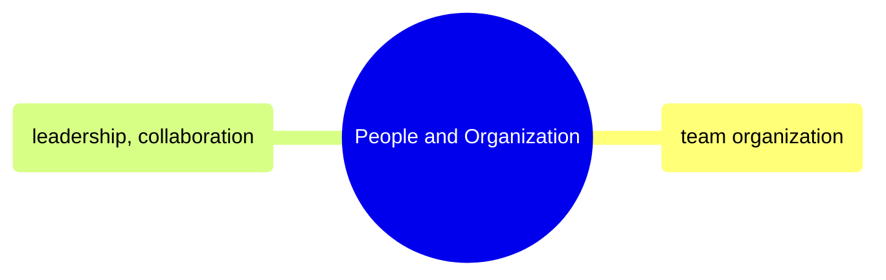

# People and Organization

Team topology, role definitions, career progression, and leadership practices for data engineering organizations.

> [!abstract]- [[02-data-team-organization]]
>
> - [[data-team-organization#Team Topology Models|Team Topology Models]]
> - [[data-team-organization#Role Definitions|Role Definitions]]
> - [[data-team-organization#Career Progression|Career Progression]]
> - [[data-team-organization#RACI Matrix|RACI Matrix]]
> - [[data-team-organization#On-Call and Incident Management|On-Call and Incident Management]]
> - [[data-team-organization#Building a Data Team from Scratch|Building a Data Team from Scratch]]

> [!abstract]- [[04-leadership-and-collaboration]]
>
> - [[leadership-and-collaboration#The Code Review as a Teaching Tool|Code Review as a Teaching Tool]]
> - [[leadership-and-collaboration#Technical Design Documents|Technical Design Documents]]
> - [[leadership-and-collaboration#Managing Stakeholder Expectations|Managing Stakeholder Expectations]]
> - [[leadership-and-collaboration#Mentoring Junior Engineers|Mentoring Junior Engineers]]
> - [[leadership-and-collaboration#Architecture Decision Records (ADRs)|Architecture Decision Records]]
> - [[leadership-and-collaboration#Managing Technical Debt: The Guide to Saying "No"|Managing Technical Debt]]
