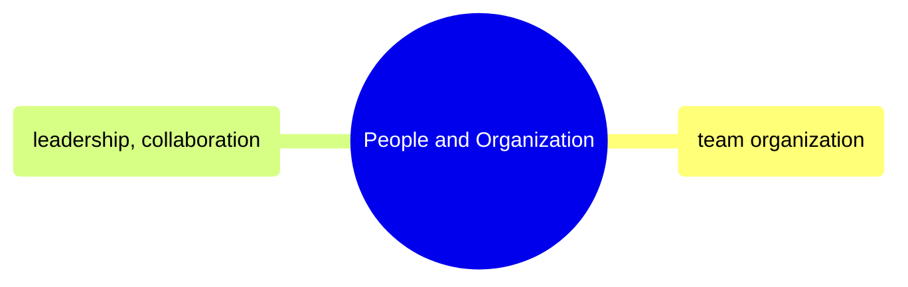

# People and Organization

Team topology, role definitions, career progression, and leadership practices for data engineering organizations.

> [!abstract]- [[02-data-team-organization]]
>
> Team topology models, role definitions, career ladders, RACI ownership, on-call structure, distributed-team practices, and org-scaling guidance for data functions.

> [!abstract]- [[04-leadership-and-collaboration]]
>
> Senior-engineer leadership practice across code review, design docs, ADRs, stakeholder management, mentoring, technical-debt negotiation, and blameless incident response.
