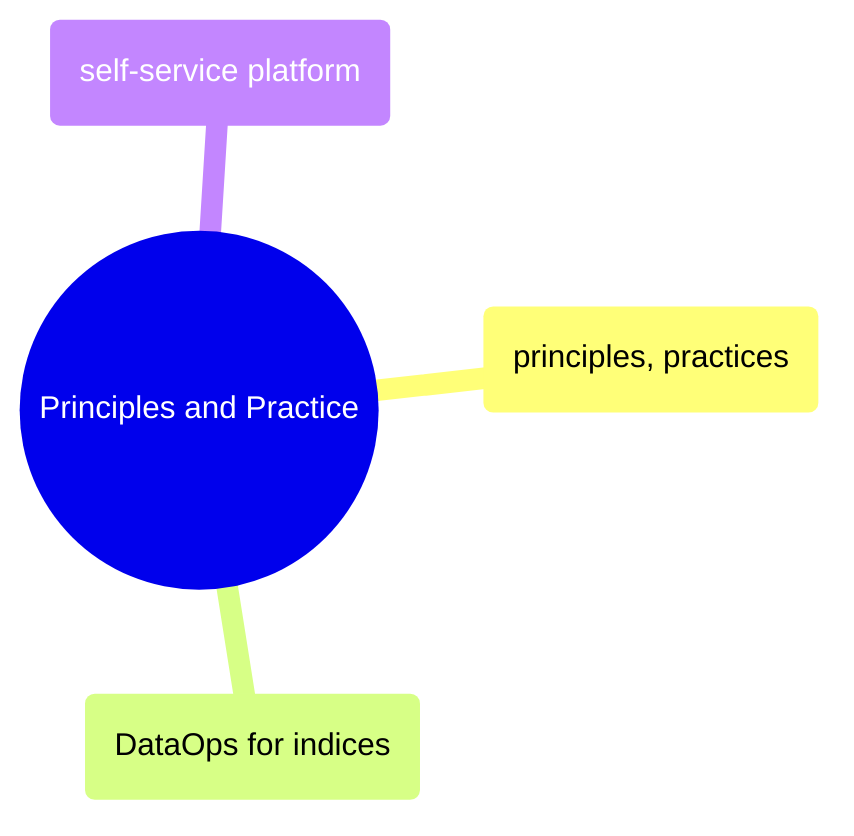

# Principles and Practice

DataOps principles, CI/CD practices for data pipelines, index-specific operational patterns, and self-service platform engineering.

> [!abstract]- [[01-dataops-principles-and-practices]]
>
> - [[dataops-principles-and-practices#The DataOps Manifesto|The DataOps Manifesto]]
> - [[dataops-principles-and-practices#Statistical Process Control (SPC) for Data|Statistical Process Control]]
> - [[dataops-principles-and-practices#Three Pillars of DataOps|Three Pillars of DataOps]]
> - [[01-dataops-principles-and-practices|CI/CD for data pipelines]]
> - [[dataops-principles-and-practices#Shift-Left Testing|Shift-left testing]]
> - [[dataops-principles-and-practices#DORA Metrics for Data|DORA Metrics for Data]]

> [!abstract]- [[05-dataops-for-indices]]
>
> - [[dataops-for-indices#Parallel Backtesting Architecture|Parallel Backtesting Architecture]]
> - [[dataops-for-indices#Continuous Validation|Continuous Validation]]
> - [[dataops-for-indices#Blue-Green Data Deployment|Blue-Green Data Deployment]]
> - [[dataops-for-indices#Methodology-as-Code|Methodology-as-Code]]
> - [[dataops-for-indices#Incident Response for Calculation Errors|Incident Response]]

> [!abstract]- [[03-self-service-data-platform]]
>
> - [[self-service-data-platform#The Self-Service Spectrum|The Self-Service Spectrum]]
> - [[self-service-data-platform#Data Catalog Tools|Data Catalog Tools]]
> - [[self-service-data-platform#Data Quality Layer|Data Quality Layer]]
> - [[self-service-data-platform#Data Products|Data Products]]
> - [[self-service-data-platform#Data Contracts|Data Contracts]]
> - [[self-service-data-platform#Governed Self-Service|Governed Self-Service]]
