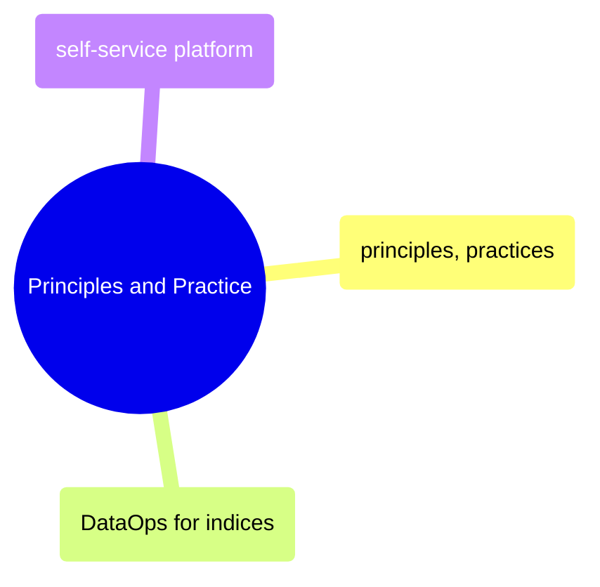

# Principles and Practice

DataOps principles, CI/CD practices for data pipelines, index-specific operational patterns, and self-service platform engineering.

> [!abstract]- [[01-dataops-principles-and-practices]]
>
> DataOps foundations across manifesto principles, SPC, CI/CD, shift-left testing, environment strategy, cultural change, DORA metrics, and maturity models.

> [!abstract]- [[05-dataops-for-indices]]
>
> Operational DataOps patterns for regulated index-calculation platforms: parallel backtesting, continuous validation, blue-green data deployment, methodology-as-code, and SEV-1 restatement response.

> [!abstract]- [[03-self-service-data-platform]]
>
> Governed self-service platform design covering catalogs, semantic layers, quality visibility, data products, contracts, cost controls, literacy, and rollout sequencing.
