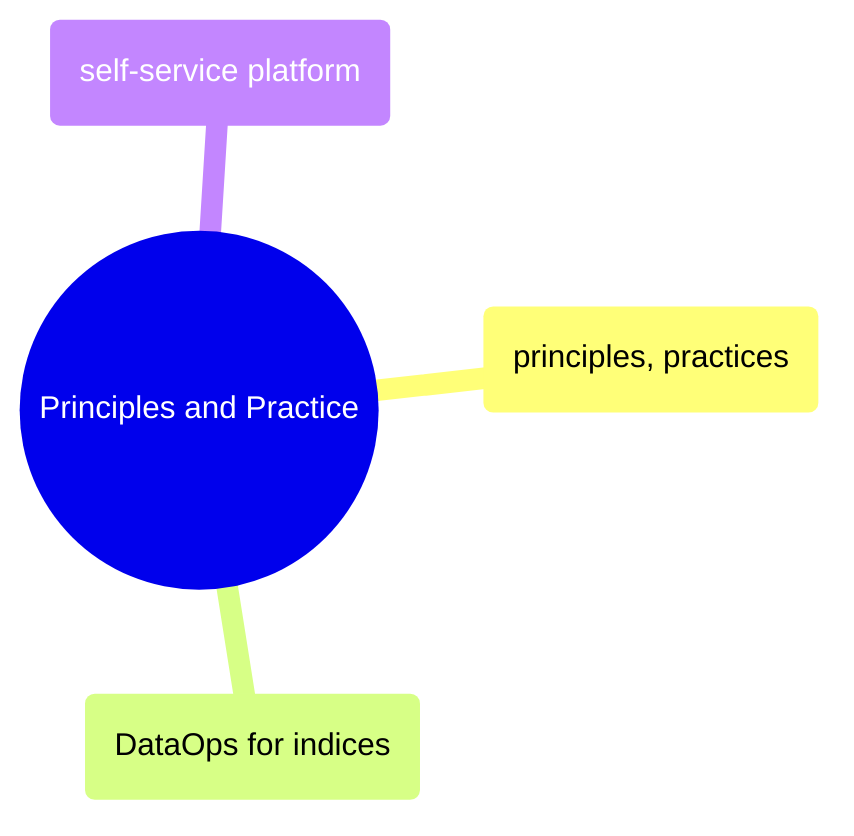

# Principles and Practice

DataOps principles, CI/CD practices for data pipelines, index-specific operational patterns, and self-service platform engineering.

> [!abstract]- [[01-dataops-principles-and-practices]]
>
> - [[01-dataops-principles-and-practices|CI/CD for data pipelines]]

> [!abstract]- [[05-dataops-for-indices]]

> [!abstract]- [[03-self-service-data-platform]]
