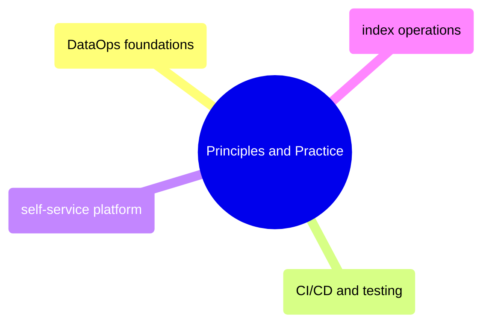
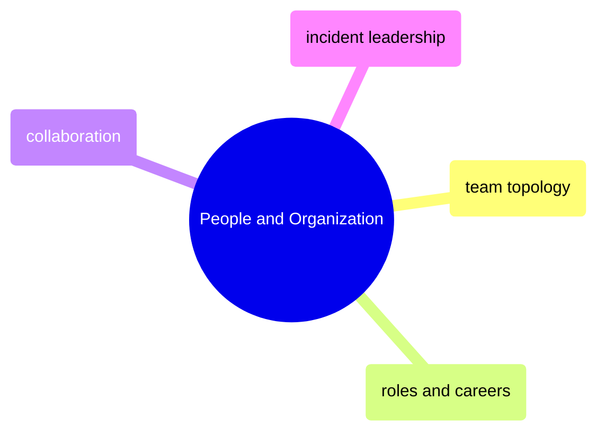

# MOC: DataOps

DataOps methodology and team organization, from delivery discipline and self-service platform design through team topology, leadership, and incident practice. Expand any section to browse the chapter by operating concern.

> [!guide]+ Principles and Practice
>
> [[domain-principles-and-practice]]
>
> DataOps principles, CI/CD practices for data pipelines, index-specific operational patterns, and self-service platform engineering.

> [!guide]+ People and Organization
>
> [[domain-people-and-organization]]
>
> Team topology, role definitions, career progression, and leadership practices for data engineering organizations.

## DataOps Cross-References

- [Data Architecture](https://alp78.github.io/elysium/14-Data-Architecture/moc-data-architecture) — Architecture principles that DataOps operationalizes
- [GitHub Actions](https://alp78.github.io/elysium/10-CICD/moc-github-actions) — CI/CD automation implementing DataOps practices
- [Observability](https://alp78.github.io/elysium/13-Observability/moc-observability) — Monitoring and SLA tracking as a DataOps pillar
