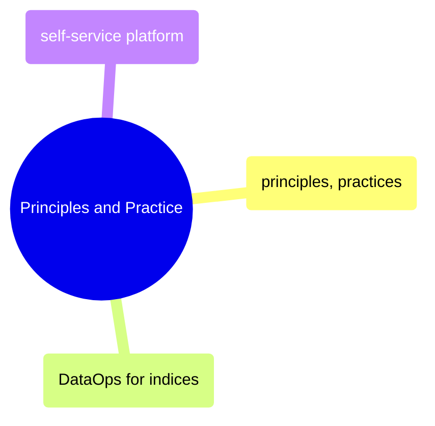
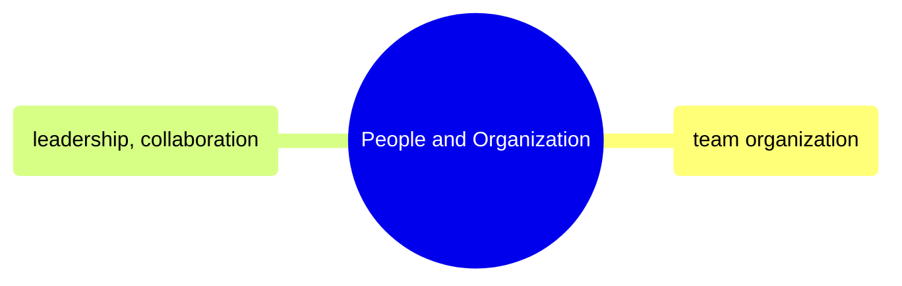

# MOC: DataOps

DataOps methodology and team organization — from principles and CI/CD
practices through platform engineering to leadership and collaboration.
Expand any section to browse page contents.

> [!example]- Principles and Practice
>
> > [!abstract]- [[dataops-principles-and-practices]]
> >
> > - [[dataops-principles-and-practices#The DataOps Manifesto|The DataOps Manifesto]]
> > - [[dataops-principles-and-practices#Statistical Process Control (SPC) for Data|Statistical Process Control]]
> > - [[dataops-principles-and-practices#Three Pillars of DataOps|Three Pillars of DataOps]]
> > - [[dataops-principles-and-practices|CI/CD for data pipelines]]
> > - [[dataops-principles-and-practices#Shift-Left Testing|Shift-left testing]]
> > - [[dataops-principles-and-practices#DORA Metrics for Data|DORA Metrics for Data]]
>
> > [!abstract]- [[dataops-for-indices]]
> >
> > - [[dataops-for-indices#Parallel Backtesting Architecture|Parallel Backtesting Architecture]]
> > - [[dataops-for-indices#Continuous Validation|Continuous Validation]]
> > - [[dataops-for-indices#Blue-Green Data Deployment|Blue-Green Data Deployment]]
> > - [[dataops-for-indices#Methodology-as-Code|Methodology-as-Code]]
> > - [[dataops-for-indices#Incident Response for Calculation Errors|Incident Response]]
>
> > [!abstract]- [[self-service-data-platform]]
> >
> > - [[self-service-data-platform#The Self-Service Spectrum|The Self-Service Spectrum]]
> > - [[self-service-data-platform#Data Catalog Tools|Data Catalog Tools]]
> > - [[self-service-data-platform#Data Quality Layer|Data Quality Layer]]
> > - [[self-service-data-platform#Data Products|Data Products]]
> > - [[self-service-data-platform#Data Contracts|Data Contracts]]
> > - [[self-service-data-platform#Governed Self-Service|Governed Self-Service]]

> [!example]- People and Organization
>
> > [!abstract]- [[data-team-organization]]
> >
> > - [[data-team-organization#Team Topology Models|Team Topology Models]]
> > - [[data-team-organization#Role Definitions|Role Definitions]]
> > - [[data-team-organization#Career Progression|Career Progression]]
> > - [[data-team-organization#RACI Matrix|RACI Matrix]]
> > - [[data-team-organization#On-Call and Incident Management|On-Call and Incident Management]]
> > - [[data-team-organization#Building a Data Team from Scratch|Building a Data Team from Scratch]]
>
> > [!abstract]- [[leadership-and-collaboration]]
> >
> > - [[leadership-and-collaboration#The Code Review as a Teaching Tool|Code Review as a Teaching Tool]]
> > - [[leadership-and-collaboration#Technical Design Documents|Technical Design Documents]]
> > - [[leadership-and-collaboration#Managing Stakeholder Expectations|Managing Stakeholder Expectations]]
> > - [[leadership-and-collaboration#Mentoring Junior Engineers|Mentoring Junior Engineers]]
> > - [[leadership-and-collaboration#Architecture Decision Records (ADRs)|Architecture Decision Records]]
> > - [[leadership-and-collaboration#Managing Technical Debt: The Guide to Saying "No"|Managing Technical Debt]]

## Cross-References

- [[moc-data-architecture|Data Architecture]] — Architecture principles that DataOps operationalizes
- [[moc-github-actions|GitHub Actions]] — CI/CD automation implementing DataOps practices
- [[moc-observability|Observability]] — Monitoring and SLA tracking as a DataOps pillar
