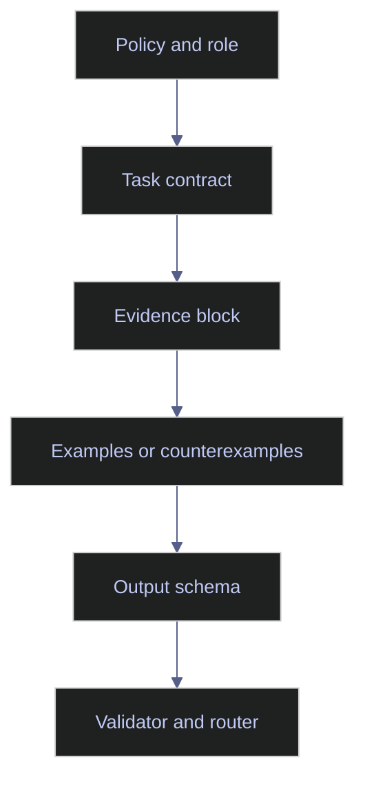

# Prompt Architecture

> [!abstract]- Summary
>
> This note treats prompt architecture as the design discipline that turns an ad hoc request into a reusable prompt asset, separating stable policy from volatile request material so prompts remain testable, debuggable, and maintainable as models, data, and workflows change.
>
> **Architectural layers and structure**
> - Defines the layered prompt contract of role and policy, task objective, evidence block, decision rules or examples, and output contract.
> - Explains how delimiters, labeled sections, XML-style tags, and JSON or field schemas reduce context confusion and make prompt components easier to reason about separately.
>
> **Controlled outputs and decomposition**
> - Covers schema-bound outputs, prompt templates, prompt chaining, and decomposition as the main ways to make pipeline-facing prompts safer and reviewer-facing prompts clearer.
> - Connects these patterns to ESG field extraction, index-methodology support, retrieval, tool use, and validator design instead of treating prompt structure as a purely stylistic concern.
>
> **Versioning and operational fit**
> - Explains why prompt architecture must log template, model, retrieval, tool, and schema versions together so regressions can be traced and reversed.
> - Frames architecture quality around failure isolation, portability under changing models, and the ability to tell which layer actually needs to change when outputs degrade.
>
> **Operations and safety**
> - Warnings: freeform outputs are fragile in pipelines, untrusted content must not share a block with policy, prompt chains can add avoidable latency if stages are split carelessly, and production changes without versioning destroy auditability.
> - Recommendations: keep policy stable, keep evidence narrow and labeled, use schemas for machine-facing outputs, split tasks when stages can be validated independently, and log all prompt-side versions with outputs.

> [!note]- Glossary
>
> **Prompt template**
> - A reusable prompt skeleton with placeholders or variables for request-specific data and context.
> - It matters here because architecture depends on making prompts repeatable across many runs instead of rewriting the full contract each time.
>
> > [!warning] Reuse can fossilize mistakes
> >
> > A template scales good practice, but it also scales bad assumptions if the team never revisits it with eval results.
>
> ---
>
> **Layered prompt contract**
> - A prompt design where policy, task, evidence, examples, and output requirements are separated into distinct sections with different roles.
> - It matters here because layered contracts make prompt failures easier to attribute and make stable instructions easier to preserve across use cases.
>
> > [!info] Separate what changes
> >
> > Stable policy should move less often than request data, and the prompt layout should reflect that difference explicitly.
>
> ---
>
> **Delimiter**
> - A structural marker such as headings, XML tags, or clearly labeled blocks that marks where prompt sections begin and end.
> - It matters here because delimiters reduce ambiguity about which text is instruction, evidence, example, or output contract.
>
> > [!info] Boundaries improve parsing
> >
> > Delimiters do not make the prompt correct by themselves, but they make the intended structure visible to both models and humans.
>
> ---
>
> **Evidence block**
> - The section of a prompt that contains the document fragment, metadata, retrieval result, or tool output the model is allowed to use.
> - It matters here because architecture depends on keeping evidence distinct from policy and task framing.
>
> > [!warning] Context should not float
> >
> > When evidence is mixed into prose without boundaries, reviewers and models both have a harder time telling what is authoritative.
>
> ---
>
> **Schema-bound output**
> - A response constrained to a defined structure such as JSON Schema or typed fields with known names and shapes.
> - It matters here because pipeline-facing prompts become safer when output shape is explicit and machine-validated.
>
> > [!warning] Structure is not semantic truth
> >
> > A model can still place the wrong value into the right field, so schema validation must be paired with business-rule checks.
>
> ---
>
> **Prompt chaining**
> - Splitting a complex task into sequential prompts or stages rather than asking one prompt to do everything at once.
> - It matters here because chaining can isolate failures, reduce ambiguity, and allow stage-specific validators or approval gates.
>
> > [!warning] Chains add overhead
> >
> > If the stages do not create clearer validation or routing boundaries, chaining may only increase latency and operational complexity.
>
> ---
>
> **Decomposition**
> - Breaking a workflow into smaller task units such as extraction, classification, explanation, or reviewer-note generation.
> - It matters here because prompt architecture becomes safer when each stage has a narrower job and a clearer success condition.
>
> > [!info] Split by failure mode
> >
> > Decomposition is most useful when different stages fail differently and should not share the same prompt contract.
>
> ---
>
> **Prompt version**
> - A named revision of a prompt contract used for testing, deployment, rollback, and regression analysis.
> - It matters here because prompt changes are operational changes, and the team needs to know exactly which revision produced each output.
>
> > [!warning] No version means no forensics
> >
> > If outputs are not tagged with prompt version, incident analysis becomes guesswork even when the change itself looked small.
>
> ---
>
> **Reasoning budget**
> - The amount of token, latency, and model-capacity spend the system is willing to allocate to a task.
> - It matters here because some architectural choices should move work into the application or into smaller stages rather than blindly expanding prompt size.
>
> > [!info] Cost shapes architecture
> >
> > A prompt that works only with very high reasoning or token budgets may be functionally correct but still operationally poor.
>
> ---
>
> **Section contract**
> - A semi-structured output requirement where the answer must follow named sections rather than a fully typed machine schema.
> - It matters here because reviewer-facing outputs often benefit from stronger structure than freeform prose even when JSON would be unnecessarily rigid.
>
> > [!info] Human-readable structure still matters
> >
> > Section contracts are useful when humans are the next validator, but they still need explicit headings and expectations.
>
> ---
>
> **Tool interaction boundary**
> - The architectural point where a prompt stops reasoning over text and begins asking the application to retrieve, compute, or act through tools.
> - It matters here because architecture decisions should clarify when the model is expected to decide, when it is expected to call a tool, and how those results re-enter the prompt.
>
> > [!warning] Prompting is not orchestration
> >
> > A prompt can request structured tool use, but the application still needs to own permission control, retries, and validation around the call.

> [!example] Template Architecture Fit
>
> > [!success] Appropriate
> >
> > - Use this note for reusable prompt templates, schema-driven extraction, tool-backed workflows, reviewer packets, and any system where prompts are long-lived production assets rather than one-off chat requests.
> > - Use it when policy, task, evidence, examples, and output schema need to be separated so failures can be debugged by layer instead of by guesswork.
> > - Use it to make prompts maintainable under model changes, retrieval changes, and evolving workflow requirements.
>
> > [!failure] Inappropriate
> >
> > - Do not use prompt architecture as a substitute for application orchestration, validators, or clear task separation when the workflow itself is still monolithic or ambiguous.
> > - Do not over-engineer layers if the prompt still lacks a clean job definition from the foundations note.
> > - Do not store templates without version linkage to models, schemas, and traces; that creates text reuse, not architecture.

## Why this topic matters

Weak prompt architecture creates fragile systems. The prompt works in a demo, fails on new data, and no one can tell whether the breakage came from the model, the evidence, or the hidden assumptions in the prompt body.

Chroma search surfaced a repeated theme across LLM-application books and framework references: structured outputs and modular prompt construction are what make model behavior consumable by software systems. Current provider guidance also reflects this shift. Anthropic's current prompt documentation groups clarity, examples, XML structuring, thinking, and prompt chaining as architecture choices, not isolated tricks.

## Conceptual model / diagrams

Prompt architecture should separate stable instructions from request-specific material.

## Core patterns or workflows

This section explains the architectural choices that matter most in production prompts.

### Layered prompt contracts

A strong prompt template usually contains five layers:

1. **Role and policy**: what the model is allowed to do and what it must not do.
2. **Task objective**: the concrete business goal for the current request.
3. **Evidence or context block**: the data, document fragment, metadata, or tool result the model may rely on.
4. **Decision rules or examples**: how to resolve ambiguity, classify edge cases, or imitate a house style.
5. **Output contract**: the exact response structure and uncertainty behavior.

This layered approach makes it easier to pinpoint which part needs to change when outputs degrade.

### Delimiters and labeled sections

Delimiters are not about style. They are about reducing context confusion. When the model sees explicit boundaries such as `Instructions`, `Context`, `Rules`, and `Output Schema`, it has a better chance of respecting the intended separation between the parts.

Useful delimiter patterns include:

- labeled markdown sections for readability
- XML-like tags for nested blocks or tool-ready prompt construction
- field-by-field JSON schemas for machine-validated outputs
- negative examples that show what the model must not emit

The right delimiter depends on the task. XML-style boundaries are often useful when several context blocks must stay distinct. JSON schemas are useful when the output must be parsed automatically.

### Schema-bound outputs

Schema-bound outputs are the default choice when the model feeds a pipeline. Current provider capabilities and Chroma sources align on this point: the application should tell the model the field names, types, and allowed shapes rather than hoping the model improvises correctly.

Schema-bound outputs are especially strong for:

- document extraction
- classification and routing
- tool invocation arguments
- ranked candidate lists
- human-review packets with fixed sections

They are less useful when the deliverable is an open narrative, but even then a section contract is better than freeform prose.

### Decomposition and prompt chaining

If the task mixes interpretation, retrieval, policy, and action, the prompt is usually being asked to do too much at once. Split it when:

- the stages can be validated independently
- one stage depends on tool or retrieval output
- the failure modes differ materially between stages
- the approval boundary sits between stages

For example, in an index-maintenance assistant, "extract methodology rules," "compare today's constituents to the prior composition," and "draft a reviewer note" should not be one opaque prompt. Each stage has different evidence and a different validation method.

### Prompt versioning

Prompt architecture is incomplete until the system records which prompt revision produced which output. Versioning should capture:

- prompt template identifier
- model identifier
- retrieval or tool configuration version
- schema version
- test-suite status before release

Without this, regression analysis is mostly anecdotal.

## Production examples

### Schema-bound ESG field extraction

For ESG extraction, the prompt should explicitly define:

- the source pages or paragraph boundaries
- the target fields such as scope, metric, unit, reporting period, and source reference
- the allowed null behavior
- whether inferred values are forbidden

That architecture keeps the prompt aligned with the traceability needs of `[[03-sfdr-data-requirements]]` and emerging ESG-ratings governance.

### Methodology support for index analysts

For index methodology interpretation, a strong prompt architecture separates:

- the methodology excerpt
- the specific case facts
- the rule-selection task
- the allowed response shape
- the escalation path when the rule is ambiguous

This prevents the model from blending methodology text, market color, and invented assumptions into one unsupported explanation.

## Risks / anti-patterns

- Storing policy, user input, and untrusted retrieved content in the same block.
- Overloading a prompt template with several mutually independent jobs.
- Using freeform outputs for tasks that need typed fields.
- Modifying prompt wording in production without a recorded version bump or regression run.
- Treating prompt chains as a substitute for proper application orchestration.

## Recommendations / operating rules

- Keep policy-level instructions stable and reusable.
- Keep task-level instructions explicit and short enough that the real objective is obvious.
- Keep evidence blocks narrow, labeled, and provenance-aware.
- Use schemas for pipeline-facing outputs and section contracts for reviewer-facing outputs.
- Log prompt version, model version, and schema version together.

## Domain-specific applications

Prompt architecture matters wherever the model output will be reviewed against rules, not just style:

- ESG taxonomy mapping where the output must distinguish disclosure text from mapped taxonomy code.
- Corporate-actions extraction where dates, ratios, and event types need typed outputs.
- Data-quality review flows where the model's explanation is helpful, but the routing decision must still pass deterministic controls.

## Evaluation / validation considerations

Architectural quality shows up in:

- schema-validity rate
- field completeness
- unsupported inference rate
- reviewer disagreement by task stage
- rollback frequency after prompt changes

If a prompt architecture change improves prose quality but increases validation failures, it is not an improvement.

## Troubleshooting / failure modes

- If different inputs produce wildly different output structures, the schema contract is too weak.
- If the model hallucinates from retrieved content, trusted and untrusted layers are not separated clearly enough.
- If one template accumulates dozens of optional branches, the architecture should be split into specialized templates.
- If prompt changes keep breaking outputs silently, the system is missing prompt versioning and regression gates.

## Related notes

- [[01-prompt-foundations]]
- [[03-applied-prompting]]
- [[04-model-specific-prompting]]
- [[05-prompt-debugging]]
- [[02-rag-retrieval-and-tool-use]]
- [[01-ai-evaluation-and-quality-assurance]]

## References

- ChromaDB enrichment: `Designing Large Language Model Applications.epub`
- ChromaDB enrichment: `Learning LangChain Building AI and LLM Applications with LangChain and LangGraph.epub`
- ChromaDB enrichment: `Prompt Engineering for LLMs The Art and Science of Building Large Language Model-Based Applications.epub`
- Anthropic | [Prompt engineering overview](https://platform.claude.com/docs/en/build-with-claude/prompt-engineering/overview)
- Model Context Protocol | [What is MCP?](https://modelcontextprotocol.io/docs/getting-started/intro)
