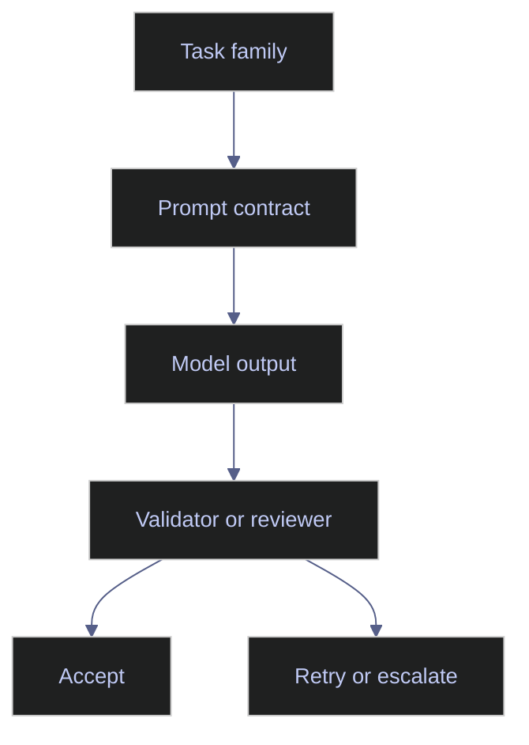

# Applied Prompting

> [!abstract]- Summary
>
> This note moves from prompt theory to workflow-specific prompt design, showing how different task families such as research, extraction, coding support, and reviewer packets need different contracts, validators, and autonomy boundaries if they are going to be useful in production.
>
> **Task-family prompt patterns**
> - Covers grounded research and synthesis, structured extraction and classification, code and SQL assistance, and reviewer-facing exception packets as distinct prompt families with different evidence, structure, and validation needs.
> - Emphasizes that applied prompts should follow the job shape of the workflow rather than forcing every task into a generic chat pattern.
>
> **Workflow role and autonomy**
> - Distinguishes assistive prompts from action-taking prompts and shows why many high-value production uses should stop at reviewer packets, evidence-linked summaries, or draft artifacts rather than autonomous decisions.
> - Grounds those patterns in ESG processing, index maintenance support, and data-engineering productivity tasks where the model adds leverage without owning the final operational action.
>
> **Failure boundaries and operating discipline**
> - Identifies the common production failures of applied prompting, especially prompt reuse across incompatible task types, hidden autonomy, weak evidence rules, and overreliance on confidence language instead of calibrated routing.
> - Connects prompt usefulness to task-specific evaluation criteria such as extraction accuracy, reviewer utility, escalation quality, schema validity, business-rule conformance, latency, and cost.
>
> **Operations and safety**
> - Warnings: the same prompt should not be reused across unrelated task families, confidence wording does not replace routing logic, and outputs that look polished can still be unusable for the surrounding workflow.
> - Recommendations: match the prompt to the task family, keep high-stakes work evidence-linked and reviewer-oriented, and test prompts on representative edge cases instead of only on clean examples.

> [!note]- Glossary
>
> **Grounded research prompt**
> - A prompt that asks the model to answer using supplied or fetched sources and to surface uncertainty when the evidence is incomplete.
> - It matters here because applied prompting for synthesis is only operationally useful when the answer can be traced back to actual evidence.
>
> > [!warning] Research quality follows source quality
> >
> > Grounded synthesis still degrades if the underlying sources are stale, partial, or poorly selected.
>
> ---
>
> **Extraction prompt**
> - A prompt that converts unstructured text into fields, labels, or evidence-linked records.
> - It matters here because extraction is one of the main production prompt patterns and needs stronger structure than general-purpose summarization.
>
> > [!warning] Structured output still needs validation
> >
> > A well-formed record can still be wrong on business rules, so extraction prompts must feed validators rather than bypass them.
>
> ---
>
> **Reviewer packet**
> - A model-generated output organized for human review, typically including what changed, why it may have changed, supporting evidence, and open uncertainties.
> - It matters here because reviewer packets are often the safest high-value pattern for finance-sensitive and operations-sensitive workflows.
>
> > [!info] Assistive, not authoritative
> >
> > A reviewer packet should make human approval easier, not quietly replace the approval step.
>
> ---
>
> **Assistive prompt**
> - A prompt designed to support a human workflow by drafting, summarizing, extracting, or organizing information without taking direct action.
> - It matters here because many production uses of LLMs are safest and most useful when they enhance human judgment rather than replace it.
>
> > [!info] Leverage without autonomy
> >
> > Assistive prompting usually creates better operational outcomes than autonomous prompting when the task is high-stakes or ambiguously specified.
>
> ---
>
> **Action-taking prompt**
> - A prompt whose output is intended to trigger or directly shape a system action rather than simply inform a human reviewer.
> - It matters here because applied prompting has to decide where autonomy ends and where deterministic checks or human approval begin.
>
> > [!danger] Action needs stronger controls
> >
> > Once prompt output can change system state, validators, permissions, and rollback logic matter more than prompt polish.
>
> ---
>
> **Confidence routing**
> - The use of model confidence, evaluator signals, or rule-based certainty thresholds to decide whether work continues automatically or is escalated.
> - It matters here because many applied workflows depend on sending ambiguous cases to humans instead of forcing a low-confidence answer through.
>
> > [!warning] Confidence must be calibrated
> >
> > Confidence numbers are useful only when they have been tested against real accepted and rejected cases from the same task family.
>
> ---
>
> **Exception packet**
> - A reviewer-facing summary created for anomalous or uncertain cases that need human investigation before closure.
> - It matters here because index QA, ESG disagreement analysis, and pipeline triage often need explanation plus escalation rather than direct automation.
>
> > [!info] Exceptions deserve context
> >
> > Reviewers move faster when the packet includes evidence, the model's tentative rationale, and what still remains uncertain.
>
> ---
>
> **Prompt anti-pattern**
> - A recurring prompt design mistake that consistently harms quality, safety, or operational usefulness.
> - It matters here because naming anti-patterns helps teams diagnose workflow failures faster than vague statements that the prompt “felt worse.”
>
> > [!warning] Many prompt bugs are workflow bugs
> >
> > Some of the most persistent prompt failures come from mismatched task design or missing validators rather than from wording alone.
>
> ---
>
> **Escalation path**
> - The explicit rule for what happens when the model cannot answer safely, confidently, or within the defined task boundary.
> - It matters here because applied prompting needs a defined next step for uncertain or high-risk cases rather than optimistic guessing.
>
> > [!warning] Unclear escalation creates hidden automation
> >
> > If the fallback path is not explicit, teams often end up treating low-confidence model output as if it were a valid completion.
>
> ---
>
> **Business-rule conformance**
> - The degree to which a model output respects the domain rules that govern the workflow, beyond simply matching the requested structure.
> - It matters here because applied prompts in finance, ESG, and data engineering are valuable only if the outputs are operationally valid, not just well phrased.
>
> > [!info] Valid JSON can still violate the workflow
> >
> > Schema validity is useful, but applied prompting still needs checks against domain rules, routing rules, and approval rules.

> [!example] Workflow Prompt Fit
>
> > [!success] Appropriate
> >
> > - Use this note for document extraction, evidence-backed research, coding assistance with guardrails, anomaly triage, reviewer-note generation, and workflow support where AI output is validated before action.
> > - Use it when the task family itself should shape the prompt contract, autonomy boundary, and validation method.
> > - Use it to decide when AI should assist, summarize, extract, or prepare evidence instead of taking direct operational action.
>
> > [!failure] Inappropriate
> >
> > - Do not use applied prompting as a freeform shortcut for tasks that need deterministic records, explicit approval gates, or direct system actions without strong downstream controls.
> > - Do not reuse one prompt shape across unrelated task families just because the wording happened to work once.
> > - Do not let polished language hide weak evidence rules or hidden autonomy in the workflow.

## Why this topic matters

Most production prompt failures are not failures of language. They are failures of task design. A prompt written for a conversational chatbot is then reused for extraction, routing, exception review, or QA narration, and the model is blamed when the output becomes unstable.

Chroma enrichment highlighted that prompt design should follow the job shape. Structured extraction needs schemas and evidence handling. Research prompts need source boundaries. Coding prompts need repository context and acceptance criteria. Current provider documentation and tooling guidance reinforce the same point: prompting is inseparable from the surrounding validation and evaluation loop.

## Conceptual model / diagrams

Different task families need different prompt contracts.

## Core patterns or workflows

This section maps common prompt families to their operational requirements.

### Grounded research and synthesis

A grounded research prompt should define:

- the question to answer
- the allowed evidence set
- the required citation or source-link behavior
- the expected structure of the answer
- how uncertainty should be expressed

This pattern is appropriate for analyst briefings, document summaries, and evidence-backed explanations. It is inappropriate when the task requires a deterministic field record rather than prose.

### Structured extraction and classification

Extraction prompts work best when they state:

- the target entity or record type
- the exact fields to extract
- the rule for null or unknown values
- the evidence rule for each field
- the schema or output contract

This pattern is the default for ESG disclosures, controversy triage, corporate actions parsing, and metadata enrichment. It should usually feed a validator, not a user-facing answer directly.

### Code and SQL assistance with guardrails

Applied prompting is useful for:

- draft SQL generation
- unit-test generation
- code review summaries
- migration explanation
- runbook drafting

But the prompt must still define the guardrails:

- target dialect or language
- repository or schema context
- business rules that cannot be violated
- whether the output may change production state
- what checks the generated code must satisfy

For SQL generation, the model should be constrained to draft or explain queries, not execute them. For code review, the model should reason over the diff and project context rather than invent generic style advice.

### Reviewer-facing summaries and exception packets

Some of the most valuable prompts do not aim for autonomous completion at all. They assemble reviewer packets:

- what changed
- why the system believes it changed
- which sources support that view
- what remains uncertain
- what action the human should take next

This is the right pattern for index QA, ESG disagreement analysis, and anomaly triage.

## Production examples

### ESG document processing

A good ESG extraction prompt asks the model to:

- process only the supplied pages or OCR text
- identify whether the statement is policy, target, or measured result
- capture reporting period, unit, and organizational scope
- preserve evidence snippets for each extracted field
- abstain when the disclosure is qualitative and not measurable

That design supports later reconciliation against taxonomy mappings and vendor data.

### Index maintenance support

A good index-operations prompt asks the model to:

- compare the methodology excerpt with the event facts
- classify whether a constituent change is expected
- cite the rule clause or corporate action that explains the change
- generate a reviewer note rather than publishing a decision
- escalate if the case spans multiple rules or conflicting feeds

This keeps the model in an assistive role compatible with `[[01-eu-bmr-benchmark-regulation]]` and `[[02-iosco-benchmark-principles]]`.

### Data engineering productivity

A good developer-assistance prompt asks the model to:

- explain the failing pipeline component
- use the provided log lines or code diff only
- separate likely cause from speculation
- propose tests or validation steps
- avoid destructive remediation unless explicitly requested

That pattern is useful for incident support, code review, and documentation generation.

## Risks / anti-patterns

- Reusing the same freeform prompt for extraction, review, and automation.
- Asking the model to "be careful" instead of defining a validator or approval boundary.
- Using a summary prompt when the real deliverable is a typed record.
- Mixing retrieval, reasoning, and action in one opaque answer.
- Treating confidence language like "probably" or "likely" as a substitute for calibrated routing.

## Recommendations / operating rules

- Match the prompt to the task family, not to personal writing preference.
- Default to evidence-linked extraction or reviewer packets for high-stakes workflows.
- Keep autonomous actions behind deterministic checks and explicit approval gates.
- Test prompts on representative edge cases, not only clean examples.
- Prefer simple, explicit language over elaborate persona design.

## Domain-specific applications

- ESG analysis: disclosure extraction, controversy classification, taxonomy support, and issuer-level reconciliation.
- Index operations: methodology interpretation, corporate actions normalization, exception clustering, and QA narrative generation.
- Data engineering: schema mapping, incident explanation, code review support, and runbook drafting.

## Evaluation / validation considerations

Applied prompts should be measured against task-specific criteria:

- extraction accuracy and evidence quality
- reviewer usefulness
- false-escalation and missed-escalation rates
- schema validity
- business-rule conformance
- latency and cost relative to business value

## Troubleshooting / failure modes

- If the model keeps summarizing instead of extracting, the task contract is too narrative.
- If outputs are structurally valid but factually wrong, the prompt needs stronger evidence rules and better downstream validation.
- If reviewers distrust the output, the prompt likely hides uncertainty instead of surfacing it.
- If coding prompts produce generic advice, the repository context or acceptance criteria are too thin.

## Related notes

- [[01-prompt-foundations]]
- [[02-prompt-architecture]]
- [[04-model-specific-prompting]]
- [[05-prompt-debugging]]
- [[01-ai-augmented-data-engineering]]
- [[01-ai-for-esg-analytics]]
- [[01-ai-for-index-engineering-and-maintenance]]

## References

- ChromaDB enrichment: `Hands-On AI Trading with Python, QuantConnect, and AWS.epub`
- ChromaDB enrichment: `Financial Data Engineering.epub`
- ChromaDB enrichment: `Big Book of Data Engineering.pdf`
- Anthropic | [Prompt engineering overview](https://platform.claude.com/docs/en/build-with-claude/prompt-engineering/overview)
- OpenAI | [Safety best practices](https://developers.openai.com/api/docs/guides/safety-best-practices)
