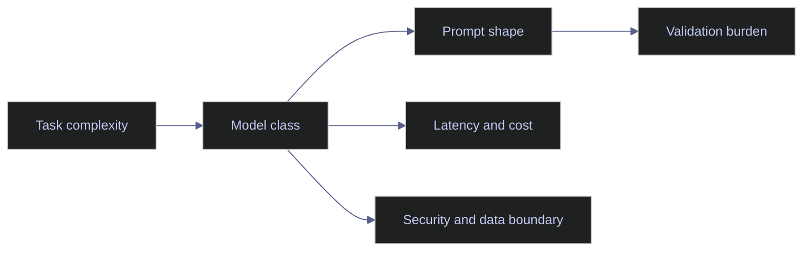

# Model-Specific Prompting

> [!abstract]- Summary
>
> This note explains why prompts are never fully model-agnostic in production, showing how model class, provider behavior, context size, tool support, latency, and hosting boundary all change what a prompt can safely and efficiently do.
>
> **Model classes and prompt behavior**
> - Compares frontier hosted chat models, reasoning-oriented models, long-context models, tool-native models, and smaller or local models as distinct operating environments for prompt design.
> - Shows how context density, decomposition style, output constraints, and tool orchestration change as prompts move between providers or model sizes.
>
> **Prompt tuning versus system tuning**
> - Explains when to change the prompt, when to move complexity into the application, and when the real answer is to use a different model class rather than adding more prose.
> - Frames portability as controlled portability with known exceptions instead of pretending one wording will behave identically across every routed model.
>
> **Workflow fit and finance-aware routing**
> - Applies model-specific choices to ESG review, index-operations support, and data-engineering assistance, showing where long context, stronger reasoning, structured tool use, or smaller local models each make sense.
> - Connects those choices to security boundaries, cost, latency, and operational resilience rather than to vendor preference alone.
>
> **Operations and safety**
> - Warnings: bigger models do not remove the need for retrieval or validation, long context does not replace relevance filtering, and hosted versus local deployment is a security decision as much as a capability decision.
> - Recommendations: classify the task before choosing the model, keep portability at the level of task logic rather than exact wording, and re-evaluate model choice whenever latency, cost, or data-boundary requirements change.

> [!note]- Glossary
>
> **Model portability**
> - The degree to which a prompt or workflow behaves acceptably across different models or providers.
> - It matters here because real systems often need routing flexibility, migration options, or vendor resilience without rewriting every prompt from scratch.
>
> > [!warning] Portability has limits
> >
> > Once tools, long contexts, structured outputs, or provider-specific behavior enter the design, “portable” usually means controlled adaptation, not perfect sameness.
>
> ---
>
> **Reasoning-oriented model**
> - A model class optimized for more deliberate multi-step synthesis, planning, or trade-off analysis.
> - It matters here because some tasks benefit from deeper reasoning, but that usually comes with higher latency and cost.
>
> > [!warning] Use depth where it pays off
> >
> > If the task should really be deterministic or staged in the application, a reasoning-heavy model may only make the failure more expensive.
>
> ---
>
> **Long-context model**
> - A model designed to handle much larger prompt windows than standard chat-oriented models.
> - It matters here because large evidence packs, audit packets, or methodology bundles can reduce retrieval pressure in the right workflows.
>
> > [!warning] Context still needs curation
> >
> > A long prompt window makes it possible to include more, but it does not make irrelevant or conflicting material safer to include.
>
> ---
>
> **Tool-native model**
> - A model that is strong at producing structured tool calls and integrating returned tool results into its responses.
> - It matters here because many production workflows depend on retrieval, search, databases, or function calls rather than on text-only reasoning.
>
> > [!info] Good tools still need guardrails
> >
> > Tool-native capability improves orchestration, but the application must still own permission control, validation, and post-call safety checks.
>
> ---
>
> **Frontier hosted chat model**
> - A general-purpose hosted model class used for broad language understanding, synthesis, and assistant-like interaction through a provider-managed platform.
> - It matters here because these models are often the default starting point for production AI tasks before specialization or routing pressure appears.
>
> > [!info] Strong default, not universal answer
> >
> > Hosted frontier models handle many tasks well, but they are still a poor fit when the main problem is deterministic enforcement or data-boundary control.
>
> ---
>
> **Open-weight or local model**
> - A model operated under the team's own hosting boundary instead of exclusively through a remote provider.
> - It matters here because local hosting can improve privacy, cost, or operational control for narrow workloads.
>
> > [!warning] Capability trades against control
> >
> > Moving local can help with boundaries and unit economics, but it adds infrastructure burden and may lower performance on broader tasks.
>
> ---
>
> **Routing set**
> - The collection of models a system can choose between for different tasks, workloads, or policy boundaries.
> - It matters here because model-specific prompting becomes more valuable when workflows are intentionally routed instead of tied to one universal model.
>
> > [!info] Compare failure behavior too
> >
> > A routing set should be evaluated not only on best-case accuracy but also on how each model fails when the task exceeds its sweet spot.
>
> ---
>
> **Context density**
> - The amount of task-relevant information packed into the prompt relative to the amount of surrounding or explanatory text.
> - It matters here because different model classes tolerate dense instructions, examples, or evidence bundles differently.
>
> > [!warning] Same prompt, different load
> >
> > A prompt that feels concise on one model can become overloaded on a smaller or less tool-capable model.
>
> ---
>
> **Capability boundary**
> - The practical limit of what a model class can do reliably in a given workflow before quality, latency, or safety degrades.
> - It matters here because model selection should be based on what the task actually requires rather than on vague assumptions that a stronger model fixes everything.
>
> > [!info] Boundaries are empirical
> >
> > Teams find real capability boundaries through evaluation and incidents, not by marketing labels alone.
>
> ---
>
> **Data-boundary decision**
> - The explicit choice of whether a task's inputs, outputs, or supporting context may be processed by a hosted provider or must remain inside a controlled environment.
> - It matters here because model choice in finance-aware and enterprise workflows is often constrained by privacy, compliance, or residency requirements before accuracy is even compared.
>
> > [!danger] Hosting choice is a policy choice
> >
> > Sending sensitive context to the wrong execution boundary can create a governance failure even if the model output itself is accurate.

> [!example] Model Routing Fit
>
> > [!success] Appropriate
> >
> > - Use this note for model-routing design, vendor migration planning, latency and cost tuning, data-boundary decisions, and any workflow that mixes several model classes.
> > - Use it when the system needs controlled portability across hosted, local, reasoning-heavy, long-context, or tool-native models.
> > - Use it to decide whether the right fix is prompt change, application change, or model change before more prose is added blindly.
>
> > [!failure] Inappropriate
> >
> > - Do not use model selection as a justification to paper over weak prompt structure, weak retrieval, or missing validators with a larger or more expensive model.
> > - Do not assume long context or frontier size eliminates the need for relevance filtering, approvals, or deterministic safeguards.
> > - Do not treat portability as exact wording portability when provider and model behavior materially differ.

## Why this topic matters

Teams often overfit to whichever model they tried first. That creates two bad outcomes. Either the prompt becomes filled with provider-specific quirks, or the team assumes every prompt failure can be fixed by "switching to a stronger model."

Current provider documentation, Chroma framework material, and field experience all point to a more disciplined view: model choice, prompt design, retrieval design, and validation design are interdependent. A prompt that fails because it needs a schema-aware tool-native model should not be "fixed" by adding more prose. A prompt that fails because its evidence boundary is weak will continue to fail on a larger model, only more fluently.

## Conceptual model / diagrams

Different model classes shift the prompt-design burden to different parts of the stack.

## Core patterns or workflows

### Frontier hosted chat models

These models are the default choice for broad language tasks, extraction, summarization, and reviewer-facing synthesis. They generally respond well to:

- clear sectioned prompts
- explicit output contracts
- moderate use of examples
- tool calling when the application supplies clean tool definitions

They are a strong fit for analyst workflows, document processing, and developer-assistance tasks, but they still require validation and governance.

### Reasoning-oriented models

These are better suited to:

- methodology interpretation
- complex trade-off analysis
- multi-step planning
- exception triage with several evidence sources

The trade-off is usually higher latency and cost. Use them when the task genuinely benefits from deeper reasoning, not as a blanket replacement for smaller models.

### Long-context models

Long context changes prompt strategy, but it does not eliminate architecture. You can provide larger document slices, more prior conversation, or wider evidence packs, yet the model still benefits from:

- labeled sections
- relevance filtering
- explicit task focus
- output contracts

Long context is particularly useful for methodology packs, audit packets, and multi-document ESG review, but only when the team is willing to manage token cost and prompt drift.

### Tool-native and structured-output-capable models

These models are preferred when the workflow needs:

- function or tool calling
- schema-bound responses
- database or search access
- explicit separation between reasoning and action

They are often the best choice for production routing and extraction tasks because the application can validate both the call and the return shape.

### Smaller or local models

Smaller models can be appropriate for:

- narrow classification
- low-risk routing
- repetitive extraction with tight schemas
- privacy-sensitive pre-processing

But they usually need tighter prompts, narrower tasks, and stronger validators. Use them where their limitations are a design input, not an unpleasant surprise.

## Production examples

### ESG review assistant

For a multilingual ESG review flow:

- use a long-context or retrieval-backed model for document interpretation
- use schema-capable extraction prompts for field capture
- use smaller models only for narrow routing or pre-tagging if validated

The key insight is that one workflow can legitimately use several model classes rather than one universal model.

### Index-operations assistant

For benchmark support:

- use a tool-native model for methodology lookup and corporate-actions retrieval
- use a reasoning-oriented model only for reviewer-facing exception explanations
- keep publication-affecting actions outside model autonomy

That combination is safer than asking one large chat model to fetch, decide, and narrate in one step.

## Risks / anti-patterns

- Assuming bigger models remove the need for retrieval or validation.
- Chasing provider-specific quirks instead of fixing prompt structure.
- Building one prompt meant to behave identically across radically different model classes.
- Using long context as a substitute for relevance filtering.
- Routing sensitive data to a hosted model without an explicit boundary decision.

## Recommendations / operating rules

- Classify the task before choosing the model.
- Prefer prompt portability at the level of task logic, not exact wording.
- Move provider-specific details into configuration or adapters where possible.
- Use stronger models for ambiguity and synthesis, not for tasks that should be deterministic.
- Re-evaluate model choice when latency, cost, or data-boundary requirements change.

## Domain-specific applications

- ESG analytics often benefits from long context for methodology packs and multilingual disclosure review.
- Index engineering often benefits from tool-native prompts because methodology, corporate actions, and point-in-time reference data need explicit retrieval.
- Data engineering support can often use smaller models for drafts and stronger models for review or exception analysis.

## Evaluation / validation considerations

Model-specific prompting should be tested on:

- accuracy by task class
- schema adherence
- tool-call quality
- latency and token cost
- refusal quality on unsafe or unsupported requests
- portability across the routed model set

If portability matters, compare not only final answers but also failure behavior.

## Troubleshooting / failure modes

- If a prompt works only on one provider, separate true capability differences from accidental wording overfit.
- If a smaller model collapses output structure, simplify the task or strengthen schema and examples.
- If a reasoning-oriented model is too slow, move some decomposition into the application rather than weakening the whole workflow.
- If a long-context model drifts off-task, the issue is usually context relevance, not context size.

## Related notes

- [[02-prompt-architecture]]
- [[05-prompt-debugging]]
- [[01-llm-pipeline-architecture]]
- [[02-rag-retrieval-and-tool-use]]
- [[03-modern-ai-tooling-landscape]]

## References

- ChromaDB enrichment: `Learning LangChain Building AI and LLM Applications with LangChain and LangGraph.epub`
- ChromaDB enrichment: `Prompt Engineering for LLMs The Art and Science of Building Large Language Model-Based Applications.epub`
- ChromaDB enrichment: `Google Prompt Engineering - 2025.pdf`
- Anthropic | [Prompt engineering overview](https://platform.claude.com/docs/en/build-with-claude/prompt-engineering/overview)
- OpenAI | [Safety best practices](https://developers.openai.com/api/docs/guides/safety-best-practices)
