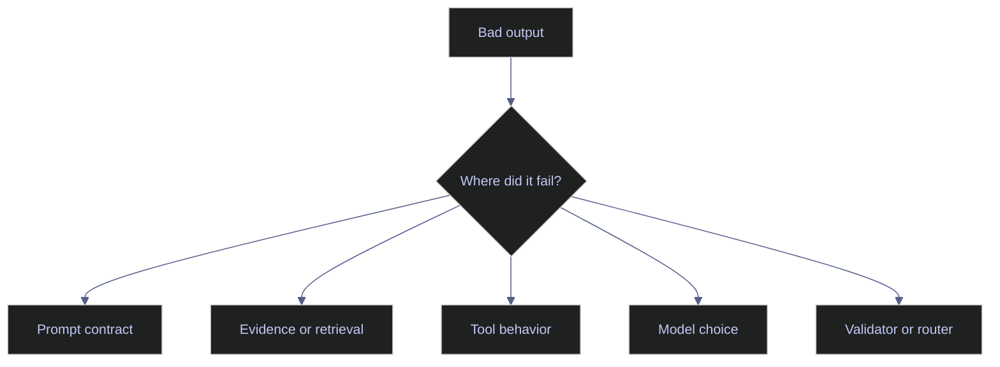

# Prompt Debugging

> [!abstract]- Summary
>
> This note treats prompt debugging as an operational discipline: isolate the failing stage, measure it with representative tests, and decide whether the fix belongs in the prompt, retrieval, tooling, model choice, validator, or workflow before another prompt rewrite creates more hidden debt.
>
> **Failure isolation and test design**
> - Defines a practical failure taxonomy covering task misunderstanding, unsupported claims, schema breakage, missed abstention, unsafe suggestions, weak retrieval grounding, poor reviewer usefulness, and excessive latency or cost.
> - Shows how to build representative evaluation sets with clean, ambiguous, contradictory, missing-data, adversarial, and domain edge cases instead of relying on tidy demo samples.
>
> **Regression discipline and policy testing**
> - Covers stable-control comparisons, regression suites, golden datasets, and release criteria so prompt changes can be measured without changing the rest of the system at the same time.
> - Adds red-team testing for prompt injection, leakage, unsafe agency, and output handling so safety regressions are treated as first-class failures rather than as secondary concerns.
>
> **Release, rollback, and workflow debugging**
> - Explains when the problem is actually retrieval, tooling, model choice, or routing rather than the prompt itself, and ties that diagnosis to production rollback discipline and approval rules.
> - Uses ESG extraction and index exception-review examples to show how incident cases should flow back into the permanent test suite after every material failure.
>
> **Operations and safety**
> - Warnings: unversioned prompt changes accumulate operational debt, clean-only regression sets hide the cases that matter most, and vague rollback rules fail under pressure.
> - Recommendations: debug by stage, preserve a permanent regression set, add incident cases after failures, treat injection and unsafe agency as standard test categories, and define rollback thresholds before release.

> [!note]- Glossary
>
> **Regression suite**
> - A fixed set of known cases run repeatedly against prompt or model changes to detect degradation.
> - It matters here because prompt debugging depends on seeing whether a new change quietly breaks cases that used to work.
>
> > [!warning] Clean tests are not enough
> >
> > A regression suite that contains only easy or clean examples will miss the very edge cases most likely to cause operational incidents.
>
> ---
>
> **Golden dataset**
> - A curated set of reviewed examples used as a reference point for evaluation and release decisions.
> - It matters here because debugging needs a business-aligned notion of what “good” looks like on real tasks, not just on model-internal scores.
>
> > [!info] Goldens must evolve
> >
> > If methodology, policies, or data definitions change, the goldens need to change with them or they stop being a trustworthy reference.
>
> ---
>
> **Failure taxonomy**
> - A named categorization of prompt failures by type instead of a vague description that the output simply “felt worse.”
> - It matters here because a named failure is easier to measure, assign, and fix than an impressionistic complaint.
>
> > [!info] Name the break first
> >
> > Teams debug faster when they can say whether the issue is grounding, structure, abstention, safety, or workflow fit before changing anything.
>
> ---
>
> **Judge-model evaluation**
> - The use of a model to score, compare, or rank outputs during evaluation.
> - It matters here because judge models can scale feedback, but only if their scoring behavior matches human judgment closely enough for the task.
>
> > [!warning] Judges need calibration
> >
> > A judge model that has not been compared with human reviewers can make evaluation look rigorous while quietly pushing the system in the wrong direction.
>
> ---
>
> **Red-team test**
> - An adversarial test designed to expose unsafe prompt behavior such as injection, leakage, unsafe tool use, or approval bypasses.
> - It matters here because prompt quality is not only about accuracy; it is also about whether the system holds its safety boundaries under pressure.
>
> > [!warning] Coverage is never complete
> >
> > Red teaming is an ongoing practice, not a one-time certification that the prompt is now permanently safe.
>
> ---
>
> **Rollback criterion**
> - A predefined threshold that tells the team when a prompt or model change must be reverted.
> - It matters here because release discipline breaks down quickly when rollback is decided ad hoc during an incident.
>
> > [!danger] Vague rollback rules fail live
> >
> > If the rollback condition is not written before release, teams tend to hesitate exactly when speed and clarity matter most.
>
> ---
>
> **Stable control**
> - The practice of holding model, retrieval, tool, and validator settings constant while testing a prompt change so the outcome can be attributed cleanly.
> - It matters here because prompt debugging becomes storytelling instead of engineering when several variables change at once.
>
> > [!info] Change one layer at a time
> >
> > Attribution is impossible if the prompt, model, and retrieval stack all move together in the same test.
>
> ---
>
> **Prompt injection**
> - Malicious or unintended text that tries to override instructions, extract secrets, or steer the model away from its intended behavior.
> - It matters here because debugging must include whether the prompt and surrounding system resist both direct and indirect instruction hijacking.
>
> > [!danger] Untrusted text is active input
> >
> > Retrieved or user-supplied content can behave like an attack surface if the system treats it as if it were trusted instruction.
>
> ---
>
> **Unsafe agency**
> - The condition where a model has too much ability to act, route, or trigger system behavior without sufficient controls.
> - It matters here because some prompt failures are dangerous not because the answer is wrong, but because the model can do too much with a wrong answer.
>
> > [!warning] Wrong answers matter more with power
> >
> > As soon as outputs can cause actions, validator strength and permission boundaries matter more than conversational quality.
>
> ---
>
> **Release criterion**
> - The set of conditions a prompt or model change must satisfy before it can be promoted into production.
> - It matters here because safe prompt iteration depends on knowing what counts as “ready,” not just what looks better in a playground.
>
> > [!info] Improvement must be explicit
> >
> > A release criterion should define which metrics must improve, which may remain flat, and which regressions are unacceptable.

> [!example] Prompt Release Fit
>
> > [!success] Appropriate
> >
> > - Use this note for prompt release review, incident investigation, eval-suite design, regression triage, safety testing, and any workflow where prompt changes can affect business outcomes.
> > - Use it when the team needs to isolate which stage failed and decide whether the fix belongs in the prompt, retrieval, tooling, model, validator, or workflow.
> > - Use it to turn incidents and regressions into permanent tests instead of another round of intuition-driven rewrites.
>
> > [!failure] Inappropriate
> >
> > - Do not use prompt debugging as justification for endless prompt rewriting when the real problem is missing context, weak validators, or a mismatched model class.
> > - Do not release prompt changes without versioning, regression criteria, and rollback rules.
> > - Do not trust clean-only eval sets; the hard and ambiguous cases are the ones that decide production safety.

## Why this topic matters

The fastest way to accumulate AI operational debt is to change prompts without controlled testing. Teams remember one good answer from a playground session, ship the change, and discover later that extraction quality, escalation behavior, or tool safety quietly degraded.

Current guidance from Anthropic, OpenAI, and evaluation tooling all points to the same baseline: start with success criteria, test empirically, and treat prompt changes as releasable artifacts. Chroma sources reinforce that evaluation should be tied to human judgment and business outcomes, not only to model self-assessment.

## Conceptual model / diagrams

Prompt debugging should isolate the failing stage before proposing a fix.

## Core patterns or workflows

### Failure taxonomy first

Start by naming the failure precisely:

- wrong task understanding
- unsupported factual claim
- schema breakage
- missing abstention
- unsafe action suggestion
- weak retrieval grounding
- poor reviewer usefulness
- excessive latency or cost

A named failure is easier to measure and easier to fix than "the prompt feels worse."

### Build representative test sets

A usable prompt test set should include:

- clean examples
- ambiguous examples
- contradictory examples
- missing-data examples
- adversarial or injection-style examples
- domain edge cases that previously caused incidents

For ESG and index workflows, this means keeping real-world difficult cases in the suite, not just textbook samples.

### Compare prompt changes with stable controls

Each prompt experiment should keep some inputs stable:

- same model
- same retrieval config
- same tool definitions
- same output validator

If all of those change at once, no one can attribute the outcome. Prompt debugging becomes storytelling instead of engineering.

### Red-team and policy testing

Prompt debugging is not only about accuracy. It is also about boundary control. Test whether the prompt resists:

- direct prompt injection
- indirect prompt injection from retrieved content
- prompt leaking attempts
- unsafe action requests
- attempts to route around approval gates

OWASP's current LLM risk framing remains useful here because it forces the team to test output handling, sensitive information exposure, insecure plugins, and excessive agency, not just answer quality.

### Release and rollback discipline

A prompt release should define:

- which metrics must improve or stay flat
- which regressions are unacceptable
- who approves the change
- what version can be restored immediately
- what telemetry will confirm the change is healthy in production

That is the minimum needed for safe iteration.

## Production examples

### ESG extraction regression set

A practical ESG regression set includes:

- a clean emissions disclosure
- a policy-only statement with no numeric disclosure
- multilingual content with translated headings
- tables where units appear separately from values
- conflicting vendor and issuer language

If the new prompt improves the clean case but worsens the ambiguous or multilingual cases, the release is not ready.

### Index exception-review debugging

For benchmark support, keep cases such as:

- straightforward split adjustment
- methodology edge case involving buffers
- missing corporate-actions feed data
- conflicting membership signals across files
- reviewer escalation cases that must never auto-close

This lets the team see whether a prompt change made the assistant more useful or simply more confident.

## Risks / anti-patterns

- Editing prompts in production without versioning.
- Trusting judge-model scores that were never calibrated against human review.
- Fixing retrieval or tool errors by stuffing more text into the prompt.
- Looking only at average score improvement instead of inspecting critical-case regressions.
- Forgetting to test the refusal and escalation path.

## Recommendations / operating rules

- Debug by stage, not by instinct.
- Keep a permanent regression set for every prompt that matters operationally.
- Add incident examples to the test set after every material failure.
- Treat prompt injection and unsafe agency as first-class test categories.
- Define rollback thresholds before release, not during the incident.

## Domain-specific applications

- ESG analytics needs edge-case coverage for issuer-versus-document scope, multilingual variation, and taxonomy ambiguity.
- Index engineering needs point-in-time, methodology, and corporate-actions edge cases with explicit escalation expectations.
- Data engineering assistants need tests for log interpretation, SQL safety, and documentation faithfulness rather than only prose quality.

## Evaluation / validation considerations

Prompt debugging should connect to formal evals:

- human-reviewed golden cases
- field-level extraction accuracy
- schema-validity rate
- unsupported-claim rate
- escalation precision and recall
- latency and cost budgets

Judge models are useful, but only after comparing their scoring behavior to human reviewers on the same task family.

## Troubleshooting / failure modes

- If many failures are actually missing or bad context, debug retrieval or data sourcing first.
- If outputs are valid JSON but wrong on business rules, add deterministic rule checks instead of rewriting prose instructions endlessly.
- If the same prompt works in a playground but fails in production, compare the full runtime context, including hidden system instructions, tools, and validators.
- If metrics improve but reviewers complain, the eval set is measuring the wrong thing.

## Related notes

- [[01-prompt-foundations]]
- [[02-prompt-architecture]]
- [[01-ai-evaluation-and-quality-assurance]]
- [[02-ai-observability-and-operations]]
- [[01-ai-governance-and-security]]

## References

- ChromaDB enrichment: `Prompt Engineering for LLMs The Art and Science of Building Large Language Model-Based Applications.epub`
- ChromaDB enrichment: `LLM Prompt Engineering For Developers The Art and Science of Unlocking LLMs True Potential.pdf`
- ChromaDB enrichment: `Agentic AI.pdf`
- Anthropic | [Prompt engineering overview](https://platform.claude.com/docs/en/build-with-claude/prompt-engineering/overview)
- OWASP | [Top 10 for Large Language Model Applications](https://owasp.org/www-project-top-10-for-large-language-model-applications/)
