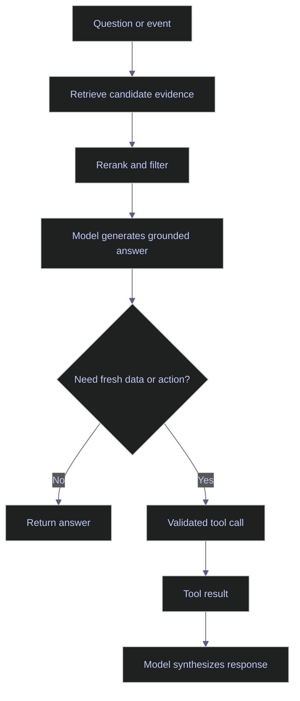

# RAG, Retrieval, and Tool Use

> [!abstract]- Summary
>
> This note explains how retrieval-augmented generation, hybrid search, reranking, and validated tool calls work together to ground model output in current evidence while keeping external data access and execution under explicit control.
>
> **Retrieval foundations**
> - Distinguishes retrieval from tool use, defines what RAG can and cannot solve, and explains why better evidence boundaries are different from better access to external functions.
> - Covers embeddings, vector search, chunking, metadata, and evidence-linked answers so retrieval quality can be reasoned about as its own subsystem.
>
> **Retrieval design and quality**
> - Examines document parsing, chunk size and overlap, metadata filtering, vector versus lexical search, hybrid retrieval, and reranking as the main design levers that determine whether the right evidence reaches the model.
> - Shows why identifiers, dates, methodology versions, and issuer context often require hybrid retrieval instead of pure similarity search in finance-heavy workflows.
>
> **Tool use and platform connectivity**
> - Explains when retrieval is sufficient, when tool use is required, and when both should be combined so the model can read evidence first and query deterministic services second.
> - Covers MCP-style connectivity as a standard way to expose tools and data sources while keeping tool descriptions, outputs, and reachable resources inside the security model.
>
> **Operations and safety**
> - Warnings: low-quality chunks, unsanitized tool output, overly broad tool scope, and conflating retrieval with action-taking all create failure modes that prompting alone will not fix.
> - Recommendations: start with document and metadata quality, prefer hybrid retrieval where exact terms matter, rerank only when it improves downstream quality, and keep tool scopes narrow and auditable.
> - Troubleshooting: 4 failure modes covering irrelevant citations, exact-rule lookup misses, wrong-tool selection, and injection through retrieved or tool-returned content.

> [!note]- Glossary
>
> **Retrieval-augmented generation**
> - A pattern where the application fetches evidence and passes it into the model so generation is constrained by current retrieved context rather than unsupported recall alone.
> - It matters here because the note treats RAG as an evidence-grounding mechanism, not as a universal fix for model mistakes.
>
> > [!warning] Retrieval is not truth
> >
> > RAG only improves answers when the system retrieves the right evidence and the model is told to stay inside it.
>
> ---
>
> **Embedding**
> - A numeric representation of text or data used to compare semantic similarity between queries and stored chunks.
> - It matters here because embeddings power vector retrieval and influence which passages are considered relevant enough to show the model.
>
> > [!info] Semantic, not exact
> >
> > Embeddings help surface related meaning, but they do not guarantee exact identifier or date matches.
>
> ---
>
> **Vector search**
> - Retrieval over embeddings to find semantically similar chunks, passages, or records.
> - It matters here because it is a core building block of RAG systems when the workflow needs concept-level recall beyond keyword matching.
>
> > [!warning] Similarity can drift
> >
> > Pure vector search often returns plausible but operationally wrong context when exact terminology matters.
>
> ---
>
> **Hybrid retrieval**
> - A retrieval strategy that combines semantic search with lexical matching, metadata constraints, or both.
> - It matters here because finance, ESG, and methodology workflows often need exact identifiers and narrative similarity at the same time.
>
> > [!info] Mixed evidence wins
> >
> > Hybrid retrieval is often the most stable default when exact strings and semantically related prose both matter.
>
> ---
>
> **Reranking**
> - A second-stage relevance step that reorders retrieved candidates with a stronger model or scoring function before they are shown to the generator.
> - It matters here because the initial retrieval set is often too broad or noisy to trust directly.
>
> > [!warning] Latency is the price
> >
> > Reranking should be applied where measured quality gain justifies the extra time and cost.
>
> ---
>
> **Metadata filter**
> - A structured constraint on retrieval based on fields such as issuer, date, market, language, or methodology version.
> - It matters here because metadata is often the fastest way to prevent the system from grounding on the wrong time period or entity.
>
> > [!info] Structure protects relevance
> >
> > Good metadata frequently improves retrieval more than swapping embeddings or prompt wording.
>
> ---
>
> **Chunking**
> - The process of splitting documents into smaller units for indexing and retrieval, often with a chosen size and overlap strategy.
> - It matters here because chunk boundaries determine whether the model receives coherent evidence or fragmented, context-poor snippets.
>
> > [!warning] Bad chunks poison retrieval
> >
> > Even a strong vector store cannot recover cleanly from chunks that cut across tables, sections, or logical boundaries.
>
> ---
>
> **Evidence-linked answer**
> - A response that preserves explicit links back to the document, chunk, page, or record that supported each claim.
> - It matters here because grounded answers become reviewable only when the retrieval trail is visible to the user or operator.
>
> > [!info] Hidden context is weaker
> >
> > If the evidence trail is invisible, RAG behaves more like an opaque prompt stuffing technique than a trustworthy system.
>
> ---
>
> **Tool call**
> - A structured request from the model to an external function, service, or system such as search, SQL, a rule engine, or an API.
> - It matters here because tool use lets the model access fresh data or deterministic capabilities beyond the text already in context.
>
> > [!warning] Validate before execution
> >
> > The application, not the model, must check tool choice and arguments before anything runs.
>
> ---
>
> **MCP**
> - Model Context Protocol, an open protocol for connecting AI clients to tools, data sources, and workflow servers.
> - It matters here because it standardizes interoperability across tools while making tool and data exposure part of the model's effective context surface.
>
> > [!warning] Standardized is not trusted
> >
> > MCP reduces integration friction, but permission scoping, sanitization, and audit controls still have to be implemented explicitly.
>
> ---
>
> **Tool output sanitization**
> - The filtering, validation, or redaction applied to tool responses before they are sent back into the model context or shown to users.
> - It matters here because retrieved or tool-returned content can contain prompt injection, irrelevant payloads, or sensitive information.
>
> > [!warning] Tools can inject too
> >
> > A trusted tool connection does not guarantee that its returned content is safe to reinsert into the prompt untouched.
>
> ---
>
> **Read-only tool scope**
> - A permission model where tools may fetch or inspect data but cannot mutate external systems.
> - It matters here because many analyst-assistance and review workflows need current data access without granting the assistant operational write power.
>
> > [!info] Read support is often enough
> >
> > Restricting tools to read-only access usually preserves most of the utility while sharply reducing operational risk.

> [!example] Grounding Strategy Fit
>
> > [!success] Appropriate
> >
> > - Use this note when the workflow needs grounded evidence, current records, deterministic lookups, or controlled access to external systems rather than unsupported recall.
> > - Use it when retrieval design, hybrid search, reranking, and tool boundaries need to be engineered as separate but cooperating subsystems.
> > - Use it to decide when document retrieval is enough, when deterministic tools are required, and how both should be combined safely.
>
> > [!failure] Inappropriate
> >
> > - Do not use vector similarity as a substitute for exact identifiers, dates, or business-rule lookups that require deterministic matching.
> > - Do not expose write-capable tools to workflows that only need read support and evidence assembly.
> > - Do not assume RAG fixes low-quality documents, bad chunking, or unsafe tool output by itself.

## Why this topic matters

RAG is often used as a cure-all for hallucinations. It is not. It helps only when the retrieval step finds the right evidence, the evidence is passed cleanly, and the model is instructed to stay within it. Tool use has a similar misconception: connecting tools makes the assistant more capable, but it also makes it easier to act unsafely if the permissions and outputs are not controlled.

Chroma results emphasized reranking, context compression, and relevance filtering as the main quality levers after retrieval. Current MCP guidance and GenAI observability standards reinforce the operational side: tool and retrieval events should be explicit, attributable, and traceable.

## Conceptual model / diagrams

RAG and tool use frequently coexist in one workflow, but they should remain distinguishable.

## Core patterns or workflows

### Retrieval design

Retrieval quality depends on more than the vector database. The system needs to make decisions about:

- document parsing quality
- chunk size and overlap
- metadata such as issuer, effective date, language, or methodology version
- retrieval strategy such as vector, keyword, hybrid, or graph-assisted
- reranking or filtering

In ESG and index workflows, metadata filters are especially important because date, issuer, market, and methodology version frequently matter as much as semantic similarity.

### Hybrid retrieval and reranking

Hybrid retrieval is often the production default:

- lexical retrieval helps with tickers, identifiers, article numbers, and exact terms
- vector retrieval helps with semantically related narrative passages
- reranking improves which chunks ultimately reach the model

This is better than relying on similarity search alone, especially when the workflow mixes narrative documents and structured reference data.

### Citations and evidence-linked answers

RAG is most useful when the system preserves the evidence trail. The answer should be able to point back to:

- the source document or record
- the chunk identifiers or page references
- the retrieval timestamp or version
- the methodology or data snapshot used

Without this, RAG is only a hidden context mechanism, not a trustworthy one.

### Tool use and MCP-style connectivity

Use tool calls when the model needs access to:

- live databases
- current market or vendor records
- document search over a large corpus
- deterministic rule engines
- calculators or workflow APIs

MCP matters because it gives AI applications a standardized way to connect to external systems. That improves interoperability, but it also widens the attack surface. Tool descriptions, tool outputs, and accessible resources all become part of the model's effective context and must be treated as security-relevant.

### Retrieval versus tool use

A useful rule is:

- use **retrieval** when the model needs evidence to read
- use **tool use** when the model needs a system to fetch, compute, or act
- use **both** when the model must first gather evidence and then query a deterministic service

For example, methodology interpretation may start with retrieval over benchmark documentation, then use a tool to fetch the exact constituent or corporate-actions record for the date under review.

## Production examples

### ESG methodology support

An ESG analyst assistant may:

- retrieve relevant ESRS or issuer-report sections
- rerank by issuer and reporting period
- surface extracted passages
- call a taxonomy-mapping tool or internal reference service
- draft a reviewer-facing interpretation with evidence attached

### Index review support

An index QA assistant may:

- retrieve the relevant methodology clauses and previous rebalance notes
- call read-only tools for membership snapshots, weights, and corporate actions
- produce a grounded explanation for why a constituent changed or why the change is suspicious

### Incident investigation

A data-platform assistant may:

- retrieve logs and runbook fragments
- call read-only lineage or metadata tools
- propose next checks while keeping state-changing actions outside the tool scope

## Risks / anti-patterns

- Using vector similarity alone for identifier-heavy tasks.
- Passing too many low-quality chunks and assuming the model will sort them out.
- Letting tool outputs enter the context without sanitization or relevance filtering.
- Giving write-capable tools to workflows that only need read support.
- Treating MCP connectivity as trust rather than as an integration mechanism that still needs policy.

## Recommendations / operating rules

- Start retrieval design with document and metadata quality, not only with the vector store.
- Prefer hybrid retrieval for finance, ESG, and methodology work.
- Rerank only where it materially improves downstream quality.
- Keep tool scopes narrow and default to read-only access.
- Preserve citations, chunk identifiers, and source versions wherever possible.

## Domain-specific applications

- ESG analytics: disclosure retrieval, taxonomy support, controversy evidence gathering, multilingual report analysis.
- Index engineering: methodology lookup, corporate-actions disambiguation, point-in-time constituent review, exception packets.
- Data engineering: runbook retrieval, schema lookup, lineage support, and controlled SQL assistance.

## Evaluation / validation considerations

Evaluate retrieval and tool use separately:

- recall and precision of retrieved evidence
- citation quality
- reranker gain
- tool-call correctness
- argument validity
- unsafe-call rate
- answer quality after retrieval versus without retrieval

If tool use quality is poor, switching embedding models will not fix it.

## Troubleshooting / failure modes

- If answers cite irrelevant passages, inspect chunking and reranking before prompt wording.
- If exact-rule lookup fails, add lexical retrieval or metadata filters.
- If the model calls the wrong tool, improve tool descriptions, routing logic, or permission scopes.
- If injected content appears in the answer, sanitize retrieved and tool-returned content before it re-enters model context.

## Related notes

- [[01-llm-pipeline-architecture]]
- [[03-modern-ai-tooling-landscape]]
- [[01-ai-governance-and-security]]
- [[02-ai-observability-and-operations]]

## References

- ChromaDB enrichment: `Designing Large Language Model Applications.epub`
- ChromaDB enrichment: `Raieli S. Building AI Agents.pdf`
- ChromaDB enrichment: `Ultimate Agentic AI with AutoGen for Enterprise Automation.epub`
- Model Context Protocol | [What is MCP?](https://modelcontextprotocol.io/docs/getting-started/intro)
- OpenTelemetry | [Semantic conventions for Generative AI events](https://opentelemetry.io/docs/specs/semconv/gen-ai/gen-ai-events/)
