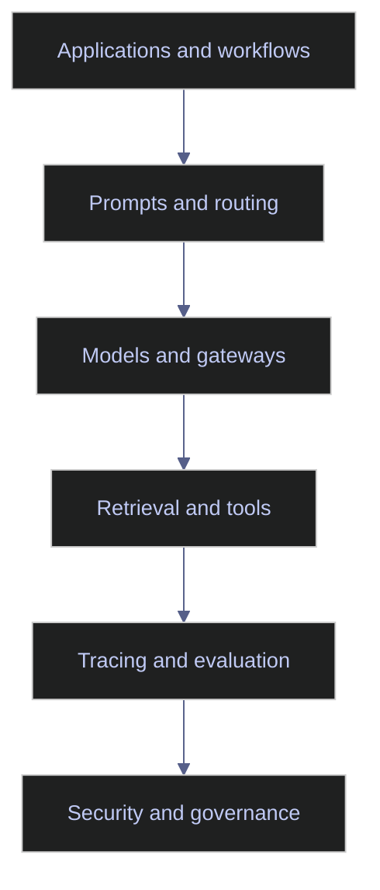

# Modern AI Tooling Landscape

> [!abstract]- Summary
>
> This note maps the modern AI tooling stack by operational layer so teams can choose the minimal combination of model access, retrieval, tracing, evaluation, and safety controls that supports real production workflows without buying or building premature complexity.
>
> **Tooling layers and roles**
> - Breaks the landscape into model APIs and routing, retrieval infrastructure, reranking, prompt management, evaluation, observability, document parsing, and guardrail layers, focusing on what each category is supposed to solve operationally.
> - Uses a layered mental model instead of vendor memorization so applications, prompts, models, retrieval, tracing, and governance can be reasoned about as separate responsibilities.
>
> **Stack design and market direction**
> - Explains what a pragmatic early stack usually needs first, which capabilities can stay minimal until scale or risk justifies expansion, and where duplicated platforms create more confusion than value.
> - Highlights current trend lines such as tighter tracing-evaluation integration, runtime-linked prompt management, open telemetry and protocol work, and more explicit AI-specific runtime safety controls.
>
> **Production workflow fit**
> - Maps the tooling choices to data-platform copilots, ESG extraction systems, and index-support assistants so parsing quality, prompt versioning, read-only tools, and audit-grade traces are tied to real operating needs.
> - Frames tool selection around operational fit, including metadata quality, redaction, replayability, ownership burden, and the need to connect prompt versions with retrieved evidence and methodology changes.
>
> **Operations and safety**
> - Warnings: extra tooling can hide failures, vendor overlap can fragment ownership, weak parsing poisons downstream quality, and guardrails do not validate business truth.
> - Recommendations: keep the stack minimal, prefer tools that expose traces and versions cleanly, use open standards where they reduce lock-in, and evaluate every category by governance, replay, and redaction fit rather than demo appeal.
> - Troubleshooting: 4 failure modes covering weak tracing, disconnected prompt and evaluation loops, low-quality retrieval inputs, and misaligned safety policies.

> [!note]- Glossary
>
> **Inference gateway**
> - A routing layer that sits between applications and models to manage provider selection, quotas, policies, and failover behavior.
> - It matters here because gateways can centralize governance, but only add value when multi-model or multi-provider control is actually needed.
>
> > [!warning] Extra layer, extra burden
> >
> > A gateway can become unnecessary infrastructure if the team has one stable provider and no routing problem worth centralizing.
>
> ---
>
> **Prompt registry**
> - A system for versioning, labeling, reviewing, and deploying prompt templates or prompt variants.
> - It matters here because prompt changes need to be auditable and tied back to experiments and production behavior.
>
> > [!warning] Storage is not governance
> >
> > A registry without linked traces and eval results is just a catalog of text, not an operational control.
>
> ---
>
> **Tracing stack**
> - The observability layer that captures prompts, retrieval events, tool calls, latency, costs, and outcomes across an AI workflow.
> - It matters here because non-deterministic systems cannot be debugged or governed without step-level traces.
>
> > [!warning] Traces hold sensitive data
> >
> > Prompt bodies, retrieved content, and tool payloads often require redaction and retention rules before tracing can be used safely.
>
> ---
>
> **Evaluation harness**
> - A platform or workflow for datasets, experiments, scoring, comparison, and regression testing of model-driven behavior.
> - It matters here because prompt and model changes only become engineering work when they can be measured against stable tasks and criteria.
>
> > [!warning] Judges are not enough
> >
> > Automated evaluators need calibration against human review or they can create false confidence in the wrong behaviors.
>
> ---
>
> **Vector store**
> - A storage and query system for embeddings plus the metadata needed to filter and retrieve relevant chunks or records.
> - It matters here because retrieval quality depends on the operational fit of the storage layer, not just on similarity-search benchmarks.
>
> > [!info] Metadata matters as much
> >
> > Backup, access control, filters, and metadata support often matter more in production than headline search speed.
>
> ---
>
> **Guardrail layer**
> - Runtime controls that inspect prompts, model outputs, or tool interactions for safety, policy, or compliance issues.
> - It matters here because AI systems need a defense-in-depth layer around the model when prompts, responses, or tool actions can create risk.
>
> > [!warning] Risk reduction, not truth
> >
> > Guardrails can catch obvious unsafe patterns, but they do not prove that a business answer is correct.
>
> ---
>
> **Document parsing**
> - The conversion of source files into structured text, layout information, tables, and chunks that downstream retrieval or extraction can use.
> - It matters here because every AI workflow that starts from documents inherits the quality ceiling of its parsing stage.
>
> > [!warning] Garbage in stays expensive
> >
> > Weak OCR or broken table extraction propagates into retrieval, prompting, and evaluation no matter how strong the model is.
>
> ---
>
> **Prompt version**
> - A distinct tracked revision of a prompt template that can be linked to traces, experiments, releases, and rollback decisions.
> - It matters here because prompt behavior changes need the same release discipline as code when they affect production workflows.
>
> > [!info] Version with context
> >
> > A prompt version is most useful when it is tied to the dataset, model, and routing conditions under which it was tested.
>
> ---
>
> **Replayability**
> - The ability to reconstruct and rerun an earlier AI interaction or batch job with the same inputs, versions, and context.
> - It matters here because teams cannot explain incidents, compare regressions, or audit outcomes if previous runs cannot be recreated.
>
> > [!info] Debugging needs replay
> >
> > Without replay, many tooling decisions devolve into guesswork after a production issue.
>
> ---
>
> **OpenTelemetry**
> - An open observability standard that can be used to capture and export traces, metrics, and events across distributed systems, including AI workflows.
> - It matters here because open telemetry conventions reduce lock-in and make AI traces easier to connect with the rest of the platform.
>
> > [!info] Standards help integration
> >
> > Shared telemetry formats matter most when AI behavior needs to be debugged alongside application, data, and infrastructure events.
>
> ---
>
> **Operational ownership**
> - The practical burden of maintaining, securing, tuning, and explaining a tool once it is part of the production stack.
> - It matters here because a tool choice is only good if the team can actually operate it under cost, governance, and staffing constraints.
>
> > [!warning] Every tool becomes work
> >
> > Platform sprawl is often less a technology problem than an ownership problem the team accepted too casually.

> [!example] Stack Selection Fit
>
> > [!success] Appropriate
> >
> > - Use this note when the team is choosing or simplifying the stack around LLM applications and needs to understand which layers are essential versus optional.
> > - Use it when model access, retrieval, evaluation, tracing, parsing, and safety controls need to be mapped to operational responsibilities instead of to vendor hype.
> > - Use it to keep the stack minimal and to identify where one category of tooling genuinely solves a production problem versus adding ownership burden.
>
> > [!failure] Inappropriate
> >
> > - Do not use this note as a reason to add overlapping agent platforms, gateways, or guardrails before the workflow has stable tracing, evaluation, and deterministic validation.
> > - Do not buy a parsing, tracing, or registry layer if the team still cannot explain the failure surface it is meant to fix.
> > - Do not confuse a richer stack with a safer system when core prompt, retrieval, and governance discipline are still weak.

## Why this topic matters

Tooling decisions affect cost, latency, operability, and lock-in. They also shape what the team can observe, test, and govern. The wrong stack is not necessarily the one with the wrong vendors. It is the one that duplicates capabilities, obscures failures, or adds complexity faster than the team can operate it.

Current web guidance and Chroma material suggest three present-day patterns:

- evaluation and tracing are becoming first-class rather than optional
- prompt management is moving closer to the runtime and experiment loop
- security controls are shifting from generic content moderation toward runtime AI-specific protections such as prompt, response, and tool screening

## Conceptual model / diagrams

The tooling stack is easiest to reason about as layers rather than products.

## Core patterns or workflows

### Tool categories that matter

| Category | What it solves | Typical examples | Watch-outs |
|---|---|---|---|
| **Model APIs and routing** | Access to hosted or self-hosted models, quotas, failover, and routing policy. | Provider APIs, inference gateways, internal model routers. | Routing adds value only if the team can measure quality and cost by route. |
| **Retrieval stack** | Embeddings, vector storage, metadata filters, and hybrid search. | `pgvector`, Pinecone, Qdrant, Weaviate, cloud-native vector indexes. | Do not choose a vector store without validating metadata, security, and backup needs. |
| **Reranking and retrieval quality** | Relevance refinement after initial retrieval. | Cross-encoders, vendor rerank APIs, ranking microservices. | Reranking adds latency and should be justified by measured gain. |
| **Prompt management** | Versioning, deployment labels, and prompt experimentation. | Internal Git-backed registries, Langfuse prompt management, LangSmith prompt tooling. | Prompt management without trace linkage is hard to operationalize. |
| **Evaluation platforms** | Datasets, experiments, offline/online evals, and annotations. | LangSmith, Langfuse, internal eval harnesses. | Judge models must still be calibrated against human review. |
| **Observability and tracing** | Traces, costs, latency, prompt versions, tool calls, and feedback loops. | Langfuse, LangSmith observability, OpenTelemetry-based stacks. | Sensitive content needs redaction, retention rules, and access control. |
| **Document parsing** | OCR, layout parsing, table extraction, and multimodal ingestion. | Cloud document AI services, Docling, Unstructured, custom parsers. | Bad parsing quality propagates into every downstream model step. |
| **Guardrails and safety** | Prompt or output screening, PII detection, policy enforcement, and AI firewalls. | Provider moderation tools, Google Cloud Model Armor, internal policy engines. | Guardrails can block obvious unsafe content but cannot validate business truth. |

### How to choose the stack

Early-stage production systems usually need:

- one reliable model provider or router
- one retrieval path
- one tracing path
- one eval workflow
- deterministic validators

Only add additional layers when the existing system shows a concrete limit, such as multi-provider routing, regulatory trace requirements, or tool-heavy agent workflows.

### Current trend lines

The current ecosystem is moving toward:

- tighter integration between tracing and evaluation
- prompt management tied directly to experiments and production traces
- open telemetry and open protocol efforts for interoperability
- more explicit runtime safety controls around prompts, responses, and tool interactions

This is useful because AI systems fail in interactions, not only inside individual model calls.

## Production examples

### Data platform copilot

A pragmatic stack for an internal data-engineering assistant might be:

- a hosted frontier model
- a `pgvector` or equivalent retrieval layer over docs and runbooks
- OpenTelemetry or Langfuse/LangSmith tracing
- a Git-backed prompt registry with regression datasets
- read-only tools for metadata and incident context

That is enough to be production-capable without building a full agent platform.

### ESG extraction platform

An ESG document pipeline often needs more emphasis on:

- document parsing quality
- multilingual handling
- prompt and schema versioning
- eval datasets by disclosure type
- evidence-linked storage and review queues

### Index-support assistant

An index-assistance workflow benefits from:

- read-only retrieval and tool access
- step-level tracing for every retrieved rule and tool call
- strict guardrails for publication-affecting actions
- prompt versions tied to methodology versions

## Risks / anti-patterns

- Buying too many overlapping platforms before the workflow is stable.
- Building an agent framework before basic tracing and evaluation exist.
- Choosing retrieval tooling without considering metadata and access control.
- Assuming vendor guardrails replace business-rule validation.
- Letting prompt versions drift outside the observable runtime path.

## Recommendations / operating rules

- Keep the stack minimal until there is a measurable reason to expand it.
- Prefer tools that expose traces, datasets, and version metadata cleanly.
- Use open standards where they reduce lock-in without weakening controls.
- Evaluate tools by operational fit: logging, governance, redaction, and replay, not only by demo quality.
- Treat parsing quality and metadata quality as first-class tooling decisions.

## Domain-specific applications

- ESG workflows benefit from strong parsing, review queues, and dataset-driven evaluation.
- Index workflows benefit from read-only tools, audit-grade tracing, and prompt/version linkage to methodology changes.
- Data-engineering copilots benefit from lightweight retrieval, observability, and guarded tool access more than from elaborate agent orchestration.

## Evaluation / validation considerations

Assess tooling choices against:

- trace completeness
- replayability
- evaluator coverage
- prompt version visibility
- security and access controls
- latency overhead
- operational ownership burden

## Troubleshooting / failure modes

- If teams cannot explain why a model answer changed, the tracing layer is too weak.
- If prompt experiments are hard to compare, prompt management and evaluation are disconnected.
- If retrieved content quality is low, changing models or gateways will not solve the real issue.
- If the safety layer blocks too much or too little, its policies are not aligned with the workflow risk.

## Related notes

- [[01-llm-pipeline-architecture]]
- [[02-rag-retrieval-and-tool-use]]
- [[01-ai-evaluation-and-quality-assurance]]
- [[02-ai-observability-and-operations]]
- [[01-ai-governance-and-security]]

## References

- ChromaDB enrichment: `Agentic AI.pdf`
- ChromaDB enrichment: `Learning LangChain Building AI and LLM Applications with LangChain and LangGraph.epub`
- LangSmith | [Evaluation concepts](https://docs.langchain.com/langsmith/evaluation-concepts)
- Langfuse | [Overview](https://langfuse.com/docs)
- OpenTelemetry | [Semantic conventions for Generative AI events](https://opentelemetry.io/docs/specs/semconv/gen-ai/gen-ai-events/)
- Google Cloud | [Model Armor documentation](https://docs.cloud.google.com/model-armor)
