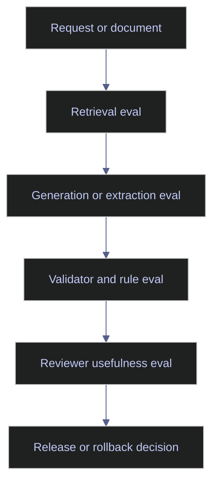

# AI Evaluation and Quality Assurance

> [!abstract]- Summary
>
> This note defines AI evaluation as the evidence system for deciding whether a model-driven workflow is accurate, safe, and useful enough for production, then shows how quality assurance turns that evidence into release gates, review queues, and drift response.
>
> **Evaluation layers and datasets**
> - Distinguishes offline and online evaluation, explains why AI systems must be scored by stage instead of only by final prose quality, and frames QA as the operational layer around those measurements.
> - Covers golden datasets, regression suites, representative edge cases, and incident-derived examples so the test set reflects the real business failures the workflow must survive.
>
> **Metrics, review, and routing**
> - Uses task-specific metrics for extraction, classification, routing, retrieval, reviewer support, and business controls rather than pretending model quality is one generic number.
> - Explains judge-model caveats, human review design, and confidence routing built from schema checks, rule validation, retrieval signals, and disagreement indicators rather than a single confidence score.
>
> **Workflow fit and governance**
> - Maps evaluation design to ESG extraction, index-support review, and data-engineering copilots, with emphasis on field accuracy, explanation usefulness, false-confidence control, and safe review acceleration.
> - Treats dataset ownership, scoring-rubric ownership, release thresholds, rollback thresholds, and reviewer roles as part of the QA system rather than as afterthought governance.
>
> **Operations and safety**
> - Warnings: average quality can hide critical-case collapse, offline gains may not survive live traffic, and schema-valid output can still violate business rules.
> - Recommendations: define task-specific scorecards early, keep goldens under explicit ownership, calibrate judge models against humans, add incident cases continuously, and use shadow or limited online rollout before full release.
> - Troubleshooting: 4 failure modes covering stale datasets, unstable human rubrics, syntactic quality that hides business failure, and weak retrieval that is being misdiagnosed as a generation problem.

> [!note]- Glossary
>
> **Offline evaluation**
> - Testing prompts, models, or full pipelines against a fixed dataset outside live production traffic.
> - It matters here because offline evaluation supports repeatable comparison, release gating, and controlled debugging before the workflow touches users.
>
> > [!warning] Good offline is not enough
> >
> > A system can improve on a benchmark set and still regress in production if the dataset is not representative.
>
> ---
>
> **Online evaluation**
> - Measuring model-driven behavior on live, limited, or shadow traffic after deployment.
> - It matters here because real traffic reveals drift, edge cases, and operational behaviors that static test sets miss.
>
> > [!warning] Safety boundary required
> >
> > Online evaluation should usually start in shadow or limited-release mode when the workflow carries operational risk.
>
> ---
>
> **Golden dataset**
> - A curated set of reviewed examples used as a stable reference for comparison across versions.
> - It matters here because goldens anchor changes to business expectations instead of to vague impressions of quality.
>
> > [!warning] Goldens decay
> >
> > If rules, document shapes, or exception types change, an old golden set can create false confidence.
>
> ---
>
> **Regression suite**
> - A reusable set of evaluation cases run whenever prompts, models, routing, or validators change.
> - It matters here because release discipline depends on being able to prove that known behaviors did not silently break.
>
> > [!info] Incidents should feed it
> >
> > The highest-value regression cases are often real failures the team has already seen in production.
>
> ---
>
> **Precision / recall / F1**
> - Standard metrics used to quantify false positives, false negatives, and their balance in classification or extraction tasks.
> - It matters here because these metrics can describe task performance cleanly when the labels and review criteria are actually well defined.
>
> > [!warning] Only for reviewable labels
> >
> > These metrics become misleading when the task boundaries or labels are too fuzzy for consistent human judgment.
>
> ---
>
> **Retrieval evaluation**
> - Measurement of whether the system found the right evidence before generation or extraction happened.
> - It matters here because poor retrieval can make a strong model look bad, and that failure should be isolated instead of blended into final-answer scoring.
>
> > [!info] Separate the bottleneck
> >
> > If retrieval is weak, tuning prompts or models alone will not solve the real problem.
>
> ---
>
> **Business-rule conformance**
> - Scoring whether the output respects domain rules, process constraints, or policy requirements in addition to sounding plausible.
> - It matters here because regulated and audited workflows care about rule adherence as much as linguistic quality.
>
> > [!warning] Plausible can still be unusable
> >
> > A fluent answer that violates a business rule is still a failed output in production.
>
> ---
>
> **Judge model**
> - A model used to score, rank, or compare AI outputs against a rubric rather than to perform the original task itself.
> - It matters here because judge models can scale evaluation, but only after the team knows where they agree or disagree with humans.
>
> > [!warning] Judges inherit bias
> >
> > A judge model can reproduce rubric mistakes or stylistic bias unless it is calibrated against human review.
>
> ---
>
> **Confidence routing**
> - The use of confidence-related signals to decide whether to return an answer, escalate to review, or take a safer path.
> - It matters here because production AI often needs a routing decision, not just a score, when uncertainty is high.
>
> > [!info] Combine signals
> >
> > Confidence routing is more robust when it blends validation, retrieval, and disagreement signals instead of trusting one model-reported number.
>
> ---
>
> **Reviewer agreement**
> - The degree to which human reviewers independently judge outputs or cases in the same way.
> - It matters here because evaluation quality depends on the stability of the human rubric, not only on the model outputs being scored.
>
> > [!warning] Low agreement means unclear task
> >
> > Heavy reviewer disagreement often signals that the rubric or approval boundary is still underspecified.
>
> ---
>
> **Shadow rollout**
> - A deployment pattern where the system processes real traffic or cases without its outputs taking live effect.
> - It matters here because shadow rollout gives online evidence while keeping the release boundary conservative.
>
> > [!info] Safe way to learn
> >
> > Shadow mode is often the cleanest bridge between offline confidence and full production exposure.

> [!example] Release Evidence Fit
>
> > [!success] Appropriate
> >
> > - Use this note when an AI workflow needs release decisions, regression control, or ongoing quality monitoring tied to concrete business outcomes.
> > - Use it when the team must decide whether a model-driven system is accurate, safe, and useful enough to ship based on stage-level evidence instead of intuition.
> > - Use it to connect datasets, scorecards, human review, thresholds, and rollback rules into one quality-assurance system.
>
> > [!failure] Inappropriate
> >
> > - Do not use this note as a superficial demo check or a prose-only scorecard for rule-bound tasks.
> > - Do not rely on judge-model output alone if the task has not been calibrated against human review and business criteria.
> > - Do not average away critical-case failures that matter more than the mean score.

## Why this topic matters

Teams often evaluate LLM systems like demos: ask a few good questions, inspect a few impressive answers, and assume the system is improving. That pattern fails immediately in production. Real AI quality is multi-dimensional. A system can have strong prose quality and weak field extraction. It can have good average retrieval quality and terrible performance on rare-but-critical exceptions. It can have high reviewer satisfaction and still violate business rules.

Chroma sources emphasized structured testing, side-by-side evaluation, and human-grounded scoring. Current observability and evaluation platforms reflect the same trend: tracing, datasets, and evals are now part of the expected production stack rather than research extras.

## Conceptual model / diagrams

Evaluation should happen at the same granularity as the system.

## Core patterns or workflows

This section defines the evaluation layers that should exist before an AI workflow is trusted.

### Evaluate by stage, not only by final answer

A production AI system should usually be evaluated on:

- retrieval quality
- field or output quality
- schema validity
- business-rule conformance
- escalation quality
- reviewer usefulness
- latency and cost

This stage-wise view makes it possible to fix the failing layer instead of guessing.

### Golden datasets and regression suites

A useful dataset should include:

- clean examples
- ambiguous examples
- contradictory examples
- low-signal examples
- adversarial examples
- previously observed incident examples

For ESG and index workflows, the rare edge cases often matter more than average-case performance because they are precisely where human analysts need support.

### Task-specific metrics

Choose metrics that reflect the real deliverable:

- **Extraction**: field accuracy, precision, recall, F1, evidence quality, unit correctness.
- **Classification and routing**: precision, recall, escalation quality, false-negative rate.
- **Retrieval**: recall@k, precision@k, citation usefulness, reranker lift.
- **Reviewer support**: reviewer agreement, time saved, override rate, missing-context rate.
- **Business controls**: schema-validity rate, policy violations, rule-conformance failures.

If a metric cannot explain whether a bad business outcome was likely, it is not enough on its own.

### Judge-models and human review

Judge-model scoring is useful for scale, but only after it has been compared to human reviewers for the same task family. Judge models are strongest for:

- ranking competing prompt outputs
- rubric-based narrative quality
- consistency checks across large candidate sets

They are weaker when the task requires nuanced domain interpretation or when the rubric itself is unstable.

### Confidence thresholds and human review routing

Confidence routing should combine several signals where possible:

- model confidence or self-rated certainty
- schema validation outcome
- business-rule validation outcome
- retrieval quality signals
- disagreement across models or extraction passes

This is more robust than trusting a single confidence number.

## Production examples

### ESG extraction evaluation

Evaluate an ESG extractor on:

- field-level accuracy by disclosure type
- scope correctness, such as issuer-level versus site-level
- unit normalization
- source-citation completeness
- reviewer agreement on ambiguous disclosures

### Index-support evaluation

Evaluate an index assistant on:

- rule-selection accuracy
- explanation usefulness for reviewers
- false-confidence rate on ambiguous methodology cases
- escalation behavior when source feeds disagree
- absence of unsupported benchmark-affecting recommendations

### Data-engineering copilot evaluation

Evaluate a data-engineering assistant on:

- log or failure interpretation quality
- SQL safety and rule conformance
- quality of suggested next checks
- improvement in review speed without increased incident risk

## Risks / anti-patterns

- Using only narrative quality scoring for extraction or rule-based tasks.
- Treating judge-model agreement as ground truth.
- Releasing prompt or model changes without rerunning a stable regression set.
- Ignoring online drift because offline scores still look good.
- Measuring only average quality while critical-case performance collapses.

## Recommendations / operating rules

- Define task-specific scorecards before tuning prompts or models.
- Keep golden datasets under explicit ownership and revision control.
- Calibrate judge-models against humans before trusting them for release decisions.
- Add incident-derived cases to the regression suite continuously.
- Use shadow or limited online rollout before full deployment in high-stakes workflows.

## Domain-specific applications

- ESG analytics needs strong extraction and evidence metrics because outputs may feed reports, scores, or client-facing products.
- Index workflows need business-rule conformance and escalation quality because benchmark-affecting errors are operational and regulatory events.
- Data-engineering copilots need usefulness metrics that do not reward unsafe automation.

## Evaluation / validation considerations

Evaluation programs should define:

- the dataset owner
- the scoring rubric owner
- the release threshold
- the rollback threshold
- the reviewer role for borderline cases

That governance is part of QA, not a separate concern.

## Troubleshooting / failure modes

- If the offline dataset keeps improving but production complaints increase, the dataset is no longer representative.
- If human reviewers disagree heavily, the rubric is unstable or the task needs clearer approval rules.
- If schema validity is high but business quality is low, the evaluation is overfocused on syntax.
- If retrieval metrics are weak, generation tuning is not the main bottleneck.

## Related notes

- [[05-prompt-debugging]]
- [[02-ai-observability-and-operations]]
- [[01-ai-governance-and-security]]
- [[01-ai-for-esg-analytics]]
- [[01-ai-for-index-engineering-and-maintenance]]

## References

- ChromaDB enrichment: `LLM Prompt Engineering For Developers The Art and Science of Unlocking LLMs True Potential.pdf`
- ChromaDB enrichment: `Prompt Engineering for LLMs The Art and Science of Building Large Language Model-Based Applications.epub`
- LangSmith | [Evaluation concepts](https://docs.langchain.com/langsmith/evaluation-concepts)
- Langfuse | [Overview](https://langfuse.com/docs)
