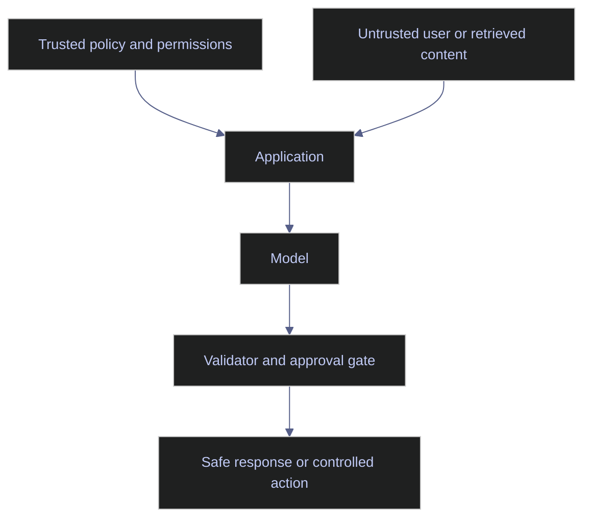

# AI Governance and Security

> [!abstract]- Summary
>
> This note frames AI governance and security as the control system that defines what an AI workflow may know, do, and send outside the platform, then shows how those boundaries are enforced and evidenced in financial, ESG, and benchmark-sensitive environments.
>
> **Threats and trust boundaries**
> - Covers the main AI-specific control failures, including prompt injection, retrieval poisoning, sensitive-data disclosure, and excessive agency, with emphasis on how untrusted content can cross into trusted instruction or execution paths.
> - Uses the trusted-versus-untrusted boundary model to explain why user input, retrieved text, tool returns, prompts, traces, and external connectivity must not share the same trust assumptions.
>
> **Control design and governance artifacts**
> - Explains approval gates, least-privilege tool scopes, vendor-boundary decisions, human-in-the-loop control, and governance artifacts such as data-boundary definitions, version ownership, rollback rules, and retention policies.
> - Shows how permission scoping, argument validation, output sanitization, provenance, and auditability work together so assistive systems do not turn into uncontrolled operators.
>
> **Workflow fit and regulatory pressure**
> - Maps the controls to ESG analytics, index operations, and data-platform copilots, where client-facing narratives, benchmark-affecting decisions, production writes, and sensitive research content all need explicit non-autonomy and review boundaries.
> - Connects the note to current industry and regulatory pressure, where governance, transparency, and evidence retention are becoming part of the required operating model rather than optional hygiene.
>
> **Operations and safety**
> - Warnings: internal retrieval sources are not automatically trusted, stored traces expand the attack surface, and convenience-driven autonomy usually signals excessive agency by design.
> - Recommendations: separate trusted policy from untrusted content, default tools to least privilege, log and enforce approval gates, retain provenance, and revisit governance whenever the workflow or regulatory context changes.
> - Troubleshooting: 4 failure modes covering weak trust boundaries, incomplete auditability, convenience-driven autonomy, and vendor-boundary decisions that are not operationalized.

> [!note]- Glossary
>
> **Prompt injection**
> - An attempt to manipulate model behavior through crafted user input, retrieved content, or tool output that is treated as though it were trusted instruction.
> - It matters here because prompt injection is one of the main ways an AI system crosses its intended control boundary without changing the core code.
>
> > [!warning] Indirect injection is common
> >
> > Retrieved documents and tool responses can be more dangerous than direct user text because teams often trust them too casually.
>
> ---
>
> **Retrieval poisoning**
> - The corruption or placement of misleading content in a knowledge source so the system retrieves and relies on it later.
> - It matters here because retrieval can steer outputs and actions even when the base prompt has not changed.
>
> > [!warning] Internal does not mean clean
> >
> > A source inside the organization still needs provenance, review, and trust controls before it is treated as safe evidence.
>
> ---
>
> **Sensitive information disclosure**
> - The leakage of secrets, personal data, confidential records, or other restricted information through prompts, traces, tool outputs, or final answers.
> - It matters here because AI workflows can expose sensitive information at multiple layers, not only in the visible answer.
>
> > [!warning] Traces are part of exposure
> >
> > Stored prompts and telemetry can become their own attack surface if masking and retention are weak.
>
> ---
>
> **Excessive agency**
> - A system design choice that gives the model more autonomy, tool scope, or decision power than the workflow can safely tolerate.
> - It matters here because many AI incidents start with the application handing the model action-taking authority that should have stayed with code or humans.
>
> > [!warning] Convenience hides risk
> >
> > Features that feel efficient in demos often become the highest-risk paths once they can mutate real systems or influence governed decisions.
>
> ---
>
> **Approval gate**
> - A mandatory human or deterministic checkpoint that must be satisfied before a high-risk action, publication, or decision is allowed to continue.
> - It matters here because approval gates keep assistive workflows from silently becoming autonomous ones.
>
> > [!warning] Implicit approval is weak
> >
> > Approval boundaries should be explicit, logged, and visible enough that reviewers know when the system is requesting authority.
>
> ---
>
> **Vendor boundary**
> - The line between data or logic that remains inside the organization's approved environment and data or requests sent to external providers or hosted models.
> - It matters here because data-boundary decisions determine what information may leave the platform and under which contractual or technical controls.
>
> > [!warning] Boundary decisions are use-case specific
> >
> > One blanket provider rule rarely fits every workflow, because sensitivity and action risk differ across use cases.
>
> ---
>
> **Trust boundary**
> - The explicit separation between components or content that the system is allowed to trust and content that must be treated as untrusted input.
> - It matters here because AI control design depends on keeping policy, user input, retrieved material, and tool output in distinct trust layers.
>
> > [!warning] Mixed trust confuses policy
> >
> > Once untrusted content can behave like instruction, the model becomes easier to steer away from intended controls.
>
> ---
>
> **Least privilege**
> - A permission principle where a tool, service, or workflow receives only the minimum access needed for its specific task.
> - It matters here because broad permissions amplify the blast radius of prompt injection, tool misuse, or model error.
>
> > [!info] Read-only is a strong default
> >
> > Many useful assistants need fresh data access but not write access, so least privilege often means stopping at read-only tools.
>
> ---
>
> **Output sanitization**
> - The validation, filtering, redaction, or cleanup applied to tool results or retrieved content before they are returned to the model or shown to users.
> - It matters here because connected systems can reintroduce unsafe or irrelevant content into the prompt path unless outputs are treated as a control surface.
>
> > [!warning] Tools can carry instructions
> >
> > Tool output should be treated as untrusted until it has been checked for injection, sensitive data, and relevance.
>
> ---
>
> **Human-in-the-loop**
> - A workflow design where a human reviewer is part of the decision path for specific high-risk actions or judgments.
> - It matters here because governance often requires the system to assist, explain, or draft without becoming the final authority.
>
> > [!info] Review is part of the design
> >
> > Human review is not a temporary workaround when the workflow is intentionally high-stakes; it is part of the control model.
>
> ---
>
> **Provenance**
> - The recorded evidence of which sources, prompt versions, model versions, tools, and reviewer steps shaped an output.
> - It matters here because governance cannot be proven after the fact without a durable record of how the answer was produced.
>
> > [!warning] Missing provenance weakens audit
> >
> > If reviewers cannot reconstruct the sources and versions behind an answer, the workflow is not truly governable.

## Why this topic matters

Many AI failures are not model-intelligence failures. They are control-boundary failures. The system reads untrusted content as instruction, exposes sensitive context in traces, calls a tool it should not have been able to call, or produces a confident recommendation where only a human decision is acceptable.

OWASP's current LLM risk taxonomy remains useful because it frames AI systems as security systems, not only NLP systems. Current OpenAI and MCP guidance also points to the same operational direction: use defense in depth, limit the impact of prompt injection, scope permissions, and treat tool and resource connectivity as security-relevant surfaces.

For ESG workflows, governance pressure is tightening. The European Commission states that Regulation 2024/3005 on ESG rating activities entered into force on January 1, 2025 and applies from July 2, 2026, strengthening transparency and governance expectations around ESG rating methodologies. For benchmark workflows, existing BMR obligations already make auditability, methodology control, and review boundaries non-negotiable. The Commission's Benchmarks Regulation FAQ also describes a review that narrows scope toward significant and climate benchmarks with intended application from January 1, 2026. Treat that latter point as an indicator of direction and confirm the current consolidated legal text before using it as a compliance assumption.

## Conceptual model / diagrams

The control model should separate trusted from untrusted layers.

## Core patterns or workflows

### Separate trusted and untrusted context

Do not let user input, retrieved text, or tool returns behave like system policy. Keep separate:

- policy and role instructions
- task instructions
- untrusted user content
- untrusted retrieved or tool-returned content

This is the baseline defense against prompt injection and tool manipulation.

### Scope tools and permissions narrowly

Every AI tool should have:

- a defined purpose
- the narrowest feasible permission scope
- argument validation
- output sanitization
- explicit logging

Read-only tools should remain read-only unless the workflow truly requires action. High-risk actions such as production writes, file deletion, or benchmark-affecting changes should always sit behind approval gates.

### Protect sensitive data

Governance controls should define:

- which data classes may be sent to hosted models
- which must remain on internal or approved boundaries
- how PII and secrets are masked in prompts and traces
- how tool outputs are sanitized before returning to the model
- who can inspect AI traces or reviewer packets

### Approval gates and human-in-the-loop control

Use approval gates whenever the workflow can:

- change production data
- influence a benchmark-affecting decision
- publish client-facing ESG or financial narratives
- override deterministic business rules
- expose external communications or filings

Human review is not a workaround. It is part of the designed control model.

### Governance artifacts

Production AI systems should have named governance artifacts:

- use-case definition
- approved data boundary
- prompt and model version ownership
- evaluation threshold
- rollback rule
- trace and retention policy
- approval boundary definition

Without these, governance remains rhetorical.

## Production examples

### ESG analytics controls

An ESG assistant may help classify, extract, or summarize, but it should not autonomously produce an official client-facing ESG rating or controversy decision without a governed review path. Evidence linkage, reviewer identity, and methodology references should all be retained.

### Index operations controls

An index-support assistant may:

- explain methodology
- retrieve corporate-actions context
- draft reviewer notes

It should not:

- approve constituent inclusion
- modify index weights
- publish restatements
- override methodology or audit controls

### Data-platform copilot controls

A data-engineering copilot may retrieve logs, explain failures, and draft SQL. It should not gain broad write access to production systems simply because tool use is available.

## Risks / anti-patterns

- Treating retrieved content as trusted because it came from an internal store.
- Logging raw prompts and tool payloads without classification or masking.
- Giving broad write or network permissions to general-purpose assistants.
- Confusing a helpful recommendation with an approved decision.
- Applying a single blanket provider policy to all use cases instead of classifying by data sensitivity and action risk.

## Recommendations / operating rules

- Keep trusted policy and untrusted content in separate channels.
- Default tools to least privilege and read-only access.
- Put high-risk actions behind logged approval gates.
- Record enough provenance to show what evidence and versions shaped the output.
- Re-evaluate governance when the workflow, data boundary, or regulatory context changes.

## Domain-specific applications

- ESG workflows need methodology transparency, evidence retention, and careful control over customer-facing interpretations.
- Index workflows need explicit non-autonomy for benchmark-affecting actions and durable audit trails.
- Data-engineering workflows need strong secret handling, trace redaction, and narrow tool permissions.

## Evaluation / validation considerations

Governance quality should also be tested:

- prompt-injection resistance
- unsafe tool-call rate
- secret or PII leakage rate
- approval-gate bypass attempts
- reviewer ability to reconstruct why the answer was produced

## Troubleshooting / failure modes

- If the model follows instructions from retrieved documents, the trust boundary is weak.
- If reviewers cannot tell which sources shaped the answer, auditability is incomplete.
- If the system performs risky actions automatically "for convenience," excessive agency has already been designed in.
- If legal or compliance teams cannot answer where the data went, vendor-boundary governance is not operationalized.

## Related notes

- [[02-rag-retrieval-and-tool-use]]
- [[01-ai-evaluation-and-quality-assurance]]
- [[02-ai-observability-and-operations]]
- [[01-ai-for-esg-analytics]]
- [[01-ai-for-index-engineering-and-maintenance]]

## References

- OWASP | [Top 10 for Large Language Model Applications](https://owasp.org/www-project-top-10-for-large-language-model-applications/)
- OpenAI | [Safety best practices](https://developers.openai.com/api/docs/guides/safety-best-practices)
- Model Context Protocol | [What is MCP?](https://modelcontextprotocol.io/docs/getting-started/intro)
- European Commission | [ESG rating activities](https://finance.ec.europa.eu/sustainable-finance/tools-and-standards/esg-rating-activities_en)
- European Commission | [Frequently asked questions: Benchmarks Regulation](https://finance.ec.europa.eu/news/frequently-asked-questions-benchmarks-regulation-2023-10-17_en)
