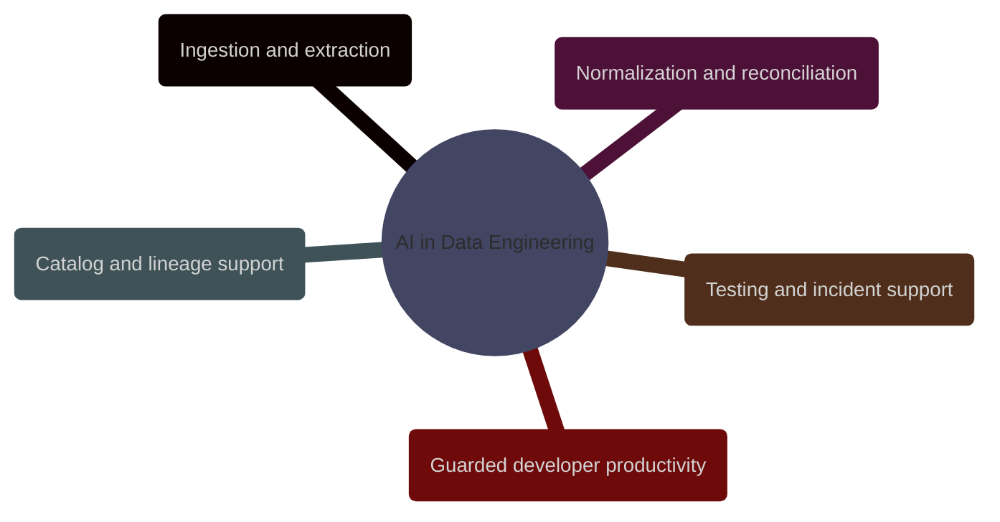

# AI in Data Engineering

This domain focuses on where AI adds leverage inside production data platforms, and where deterministic engineering controls still have to remain in charge.

> [!abstract] [[01-ai-augmented-data-engineering]]
>
> A production map of assistive AI use across ingestion, schema mapping, anomaly explanation, SQL generation, catalog enrichment, runbooks, code review, and human-in-the-loop operations.
