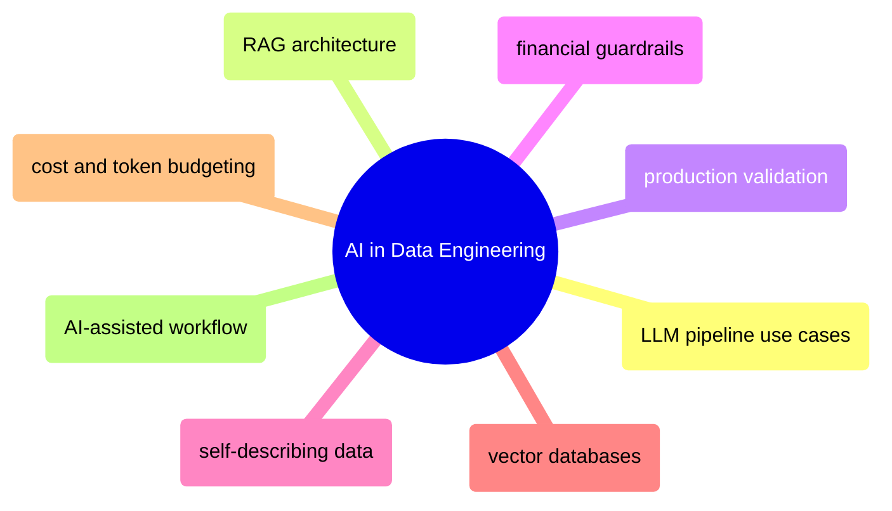

# AI in Data Engineering

LLM integration into data pipelines — RAG architecture, production validation, financial guardrails, vector databases, and cost management.

> [!abstract]- [[01-ai-augmented-data-engineering]]
>
> - [[ai-augmented-data-engineering#Where LLMs Fit in Data Engineering|Where LLMs fit in data engineering]]
> - [[ai-augmented-data-engineering#RAG Architecture: Retrieval-Augmented Generation|RAG architecture]]
> - [[ai-augmented-data-engineering#Using LLMs in Data Pipelines|LLMs in data pipelines]]
> - [[ai-augmented-data-engineering#Validating LLM Outputs in Production|Validating LLM outputs]]
> - [[ai-augmented-data-engineering#Guardrails for Financial Data Pipelines|Financial pipeline guardrails]]
> - [[ai-augmented-data-engineering#Self-Describing Data for AI Consumers|Self-describing data for AI]]
> - [[ai-augmented-data-engineering#Vector Database Comparison for Financial Data|Vector database comparison]]
> - [[ai-augmented-data-engineering#Cost Management and Token Budgeting|Cost management and token budgeting]]
> - [[ai-augmented-data-engineering#Apache Iceberg + AI Hybrid Architecture|Iceberg and AI hybrid architecture]]
> - [[ai-augmented-data-engineering#AI-Assisted Workflow: Senior Productivity with Claude Code and GitHub Copilot|AI-assisted development workflow]]
