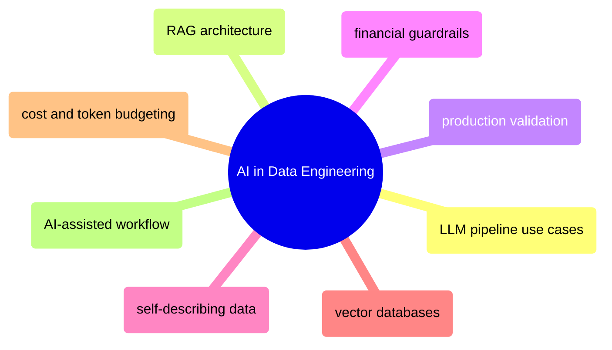

# AI in Data Engineering

LLM integration into data pipelines — RAG architecture, production validation, financial guardrails, vector databases, and cost management.

> [!abstract]- [[01-ai-augmented-data-engineering]]
