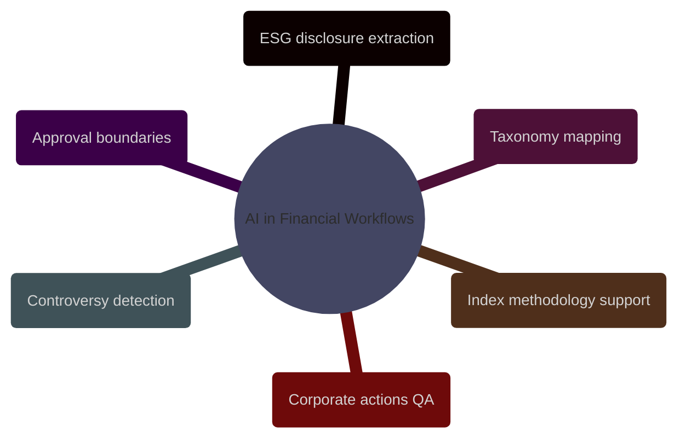

# AI in Financial Workflows

This domain translates generic AI patterns into the two financial workflows where traceability and approval boundaries matter most in this vault: ESG analytics and stock-index engineering.

> [!abstract] [[01-ai-for-esg-analytics]]
>
> ESG disclosure extraction, taxonomy mapping, controversy detection, issuer resolution, multilingual processing, reconciliation, and traceability requirements for customer-facing or regulated ESG outputs.

> [!abstract] [[01-ai-for-index-engineering-and-maintenance]]
>
> Methodology interpretation support, constituent screening assistance, corporate actions extraction, rebalance QA, anomaly detection, exception clustering, and auditability constraints for benchmark operations.
